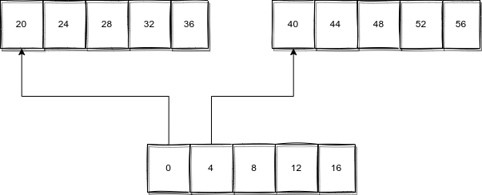
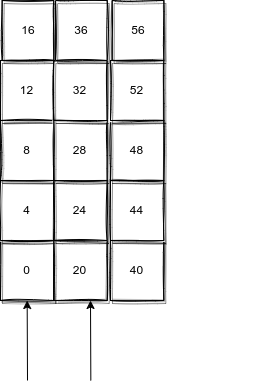

## 综述

之所以在介绍 C++ 的文章里 C 语言，是因为 C++ 确实脱胎于 C，所以很多语法现象都是和 C 保持一致的。

---


## 运算符优先级

虽然盲目的整理过会就忘，但是还是有很多可以记住的东西

- `(), ., ->, []` 这四个运算符是优先级最高的，而且是自左向右结合的，其中 `()` 是函数调用的意思

  - 这条意味着不用担心这种情况 `node.a[1], pnode->a[1]` ，这种都是可以正常表达语义的。
  - `*` 解除地址引用运算符并不在其中，这意味着无论是函数指针，还是数组指针，都需要加括号来形成正确的优先级。

- 其他的单目运算符的优先级次高，并且是自右向左结合的，包括 `!, ~, ++, --, (type), *, &, sizeof` 。其中 `* &` 是地址运算符，不是乘法和位运算的与。

  - 这意味着他们高于算术运算符，而且单目运算符优先级高也是一件很好记忆的事情。

- 位运算比算数运算的优先级低

- 关系运算符的优先级就比三目高，比其他都低（正常情况）

  - 也就是说，可以写这种东西

    ```c
    a == 1 || b == 2 && c == 3
    ```

    会正确表示为三个命题的关系运算。

---


## 变量的复杂类型 

在我刚学 C 语言的时候，就对很多的复杂类型心有余悸，比如说**指针数组**和**数组指针**的区别。

```c
int *p[3];
int (*p)[3];
```

就很难分清楚，而且一直似乎有一种方法（在《C 陷阱与缺陷》中记录，谭火彬老师也讲过）可以抽丝剥茧的分析对每一个这样的复杂类型，但是我经常掌握以后就忘了，所以一直都很害怕，今天最终想到一个可以自圆其说的方法，特地记录下来。

我觉得任何变量的声明都由两个部分组成，类型以及类似表达式的声明符（declarator）。比如指针数组说

```c
int *p[3]
```

其中 `int` 就是类型，而 `*p[3]` 则是声明符。我们判断的依据就要从声明符入手，规则就是：**按照声明符规定去运算，刚好可以得到一个数据类型的变量**。我们以指针数组为例，由运算符优先级可以判定 `[], *` 是这样的一个运算。那么也就是先从对一个变量按数组下标操作，然后得到的新的变量再进行解除地址引用操作，就可以得到一个 `int` 的整型变量。所以 `p` 一定是一个指针数组，因为只有数组可以取下标，而取出的元素只有是指针的情况，才可以解除地址引用。所以 p 一定是一个指针数组。而对于数组指针

```c
int (*p)[3]
```

首先进行解除地址引用，解除完以后再利用下标索引得到一个运算。说明 `p` 首先是一个指针，这样才可以解除地址引用，而在解除完后得到的一定是一个数组，不然没有办法利用下标进行索引。

我们再用一个例子说明一下

```c
int (*p[10])();
```

首先判断运算顺序 `[], *, ()`，那么就是先对 `p` 按数组下标取出一个元素，这个元素解除地址引用后，被当成一个函数调用，最终会返回一个 `int` 类型的变量。那么 `p` 必须是一个数组，这个数组中每一个元素都是指针，指针指向的内容可以被调用，所以是一个函数，这个函数会返回一个 `int` 变量。所以 `p` 是一个返回值为 `int` 的函数指针数组。

---


## 多维数组

当我们有一个多维数组的时候，其实很想分析清楚它的结构中是长什么样子的，虽然这个结构是抽象的（内存中一定是一维的），但是仍然有一探究竟的必要。因为这涉及到数组指针的应用.

```c
int a[2][3] = {0, 1, 2, 3, 4, 5}；
    
0, 1, 2,
3, 4, 5
    
0, 1, 
2, 3,
4, 5
```

答案是第一种，也就是它是一个每个元素为一个含有 3 个元素的数组。这个其实可以看作上面规则的一个特殊应用。因为 `[]` 是从左到右结合的，所以我们首先获得的是以个含有两个元素的数组，这两个元素又是含有三个元素的数组，而此时的元素是整型变量。

此外，还是需要强调的，尽管二维数组本质上是一个一维数组，但是涉及到指针，依然是需要解除**两次**引用的，也就是说

```c
#include <stdio.h>

int main()
{
    int b[3][4] = {0, 1, 2, 3, 4, 5, 6, 7, 9, 9, 10, 11};
    int (*p1)[4];
    p1 = b;
    printf("b[3][4] = {0, 1, 2, 3, 4, 5, 6, 7, 9, 9, 10, 11};\n");
    
    printf("%d", *p1);
}
```

这里并不会输出 0，即第一个元素，想要正确输出，必须这样

```c
printf("%d\n", **p1);
```

换句话说，解除地址引用跟加减法一样，是依赖于指针的类型的，不能简单粗暴的认为指针就是地址，指针提供了诸多地址不具备的功能。

所以我们可以再利用这些知识开发出一种新的遍历形式

```c
#include <stdio.h>

int main()
{
    int b[3][4] = {0, 1, 2, 3, 4, 5, 6, 7, 9, 9, 10, 11};
    int (*p1)[4];
    int *p2;
    printf("b[3][4] = {0, 1, 2, 3, 4, 5, 6, 7, 9, 9, 10, 11};\n");
    
    for (p1 = b; p1 < &b[3]; p1++)
    {
        for (p2 = *p1; p2 < &(*p1)[4]; p2++)
        {
            printf("%d\t", *p2);
        }
        printf("\n");
    }
}
```

## 数组的 sizeof

尽管指针和数组基地址有诸多相似的地方，但是在某些时刻，他们依然是不同的，比如使用 `sizeof` 的时候，这段代码

```c
#include <stdio.h>

int main()
{
    int a[] = {1, 2, 3};
    int *pa = a;

    printf("The size of a is %d\n", sizeof(a));
    printf("The size of pa is %d\n", sizeof(pa));
}
```

输出结构是这样的，可以看出 `sizeof(a)` 就是数组的大小，而 `pa` 则是指针的大小。

```c
The size of a is 12
The size of pa is 8
```

同样的道理，在结构体数组中依然是成立的

```c
#include <stdio.h>

struct array
{
    int a[30];
};

int main()
{
    struct array a[3];
    struct array *pa = a;
    printf("The size of a is %d\n", sizeof(a));
    printf("The size of pa is %d\n", sizeof(pa));
}
```

输出为

```
The size of a is 360
The size of pa is 8
```

## 利用结构体拷贝数组

C 语言似乎没有提供数组简单的深拷贝运算符，也就是说，这种形式会报错。所以我们需要 `memcpy` 之类的函数。

```c
#include <stdio.h>

int main()
{
   int a[] = {1, 2, 3};
   int b[] = a;
}
```

如果不想用的话，其实可以用结构体里套一个数组的方式

```c
#include <stdio.h>

struct array
{
    int elements[3];
};

int main()
{
    struct array a;
    a.elements[0] = 1;
    a.elements[1] = 2;
    a.elements[2] = 3;
    struct array b = a;
    b.elements[0] = 4;
    b.elements[1] = 5;
    b.elements[2] = 6;

    printf("elements of a is :\n");
    for (int i = 0; i < 3; i++)
    {
        printf("%d\t", a.elements[i]);
    }
    printf("\n");

    printf("elements of b is :\n");
    for (int i = 0; i < 3; i++)
    {
        printf("%d\t", b.elements[i]);
    }
    printf("\n");
}
```

这样的 `=` 就可以完成深克隆功能，输出如下

```
elements of a is :
1       2       3
elements of b is :
4       5       6
```

## 数组指针和双重指针

长期以来，我都分不清这两个的区别。甚至在上面的文章中，我依然没有分清。我没有分清的本质是认为“需要经过两次解除引用才能获得非指针类型“的指针本质上都是同一种东西，这显然是错误的，在我的错误认知下，我认为对于整型指针，一共有这么几种

```c
int *p;		// point to int
int **p;	// point to a pointer to int
int ***p;	// point to a pointer to a pointer to int
int ****p 	// ....
```

但是实际上不是的，对于一个数组指针，显然不能和某个几重指针画等号，就是对于下面的东西

```c
int **p1;
int (*)p2[3];
```

`p1, p2` 并不是相等的类型，尽管他们都可以有以下的形式

```c
p1[0][0];
p2[0][0];
```

但是他们本质是不同的。他们的不同在于他们递增的时候的位移是不一样的，对于二重指针



他是这样的，也就是说，每次递增的步长是指针的大小，换句话说，二重指针和指针数组在某种程度上具有相似性，即

```c
int *p1[3];
int **p2;
p2 = p1;
```

是合法的。

而对于数组指针，它每次递增的步长是其指向数组的大小，也就是这样的图



所以综上所述，就是两者完全不同。

对于数组传参的问题，对于以下这几种形式，是相同的

```c
int f(int a[2][3]);
int f(int a[][3]);
int f(int (*a)[3]);
```

我们见到的二重指针的例子，其实就是 `main`，是这样的

```c
int main(int argv, char **argv)
```

这可能是由于为了字符数组的不变性，利用指针避免复制。

## inline
对于内联函数，其实有如下要点：

* `inline` 只是建议，编译器可以选择不听。
* 内联函数的实现要放在头文件中，因为内联函数要在调用点展开，所以编译的时候必须知道具体的内容，放在头文件中只用写一次。
* 内联函数要慎重考虑，因为如果贸然展开，很容易造成程序内存变大，这也是不建议内联函数中有循环的原因，因为展开后循环又可以展开，很容易内存膨胀（但是并不是不允许）。
* 内联函数不能是递归函数，这太难为编译器了。
* 在 C++ 中，定义在类中的成员函数默认都是内联的。
* `inline` 是一种“用于实现的关键字”，如下所示

``` c
// 无效
inline void Foo(int x, int y); // inline 仅与函数声明放在一起
void Foo(int x, int y){}

// 有效
void Foo(int x, int y);
inline void Foo(int x, int y) {} // inline 与函数定义体放在一起
```
