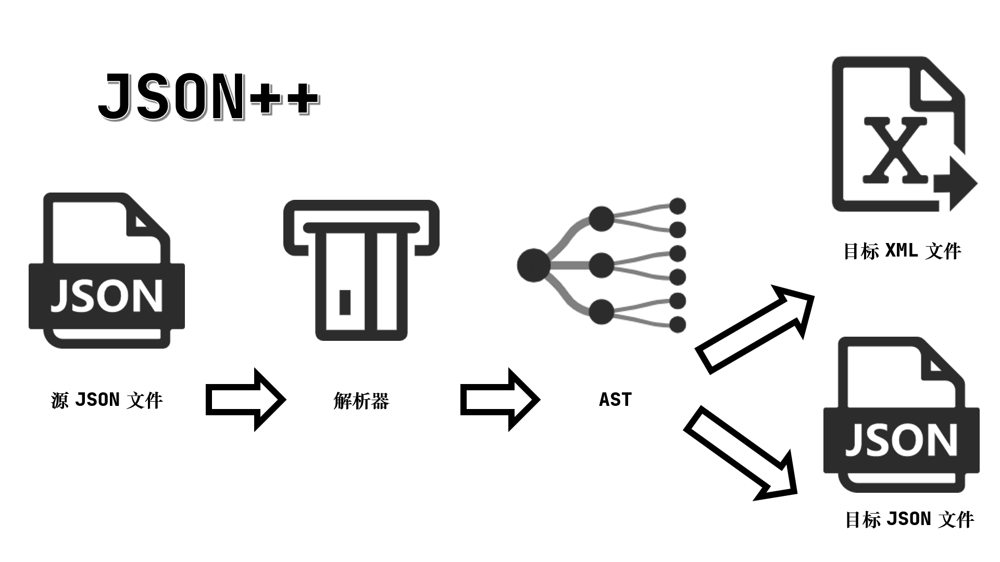
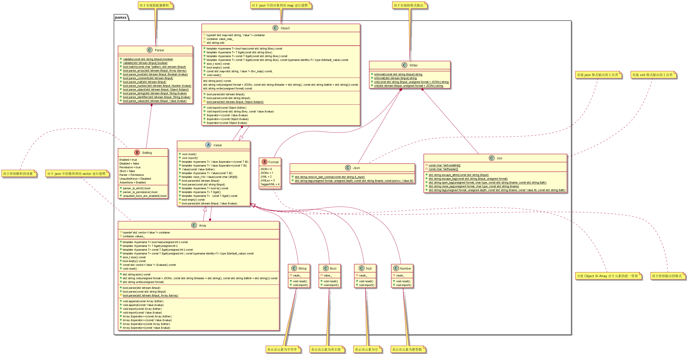
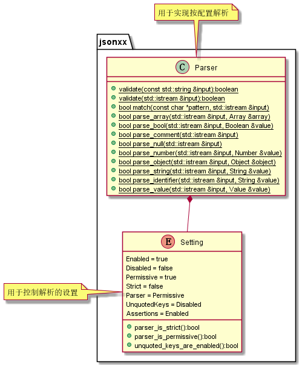
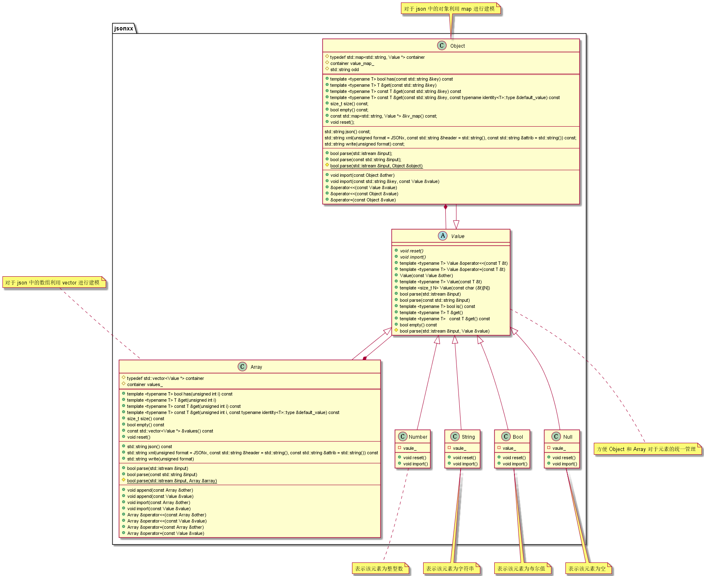
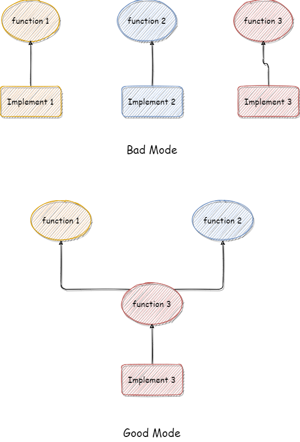

## 一、基本信息

| 条目     | 内容                             |
| -------- | -------------------------------- |
| 姓名     | 提斯雷尔                         |
| 学号     | 9527                             |
| 学院     | 丽春院                           |
| 班级     |                                  |
| 项目名   | JSON++，json 文件的解析器        |
| 项目地址 | https://github.com/hjiang/jsonxx |


---


## 二、项目概览

### 2.1 项目需求

这个项目可以实现读取一个 Json 文件并进行解析，在解析后可以形成一个抽象表达式树（AST），然后可以考虑直接处理这棵表达式树整体或者部分，也可以考虑将这棵树按照 `XML` 或者 `JSON` 格式输出。

这个项目的重要特点是**轻量级**，也就是说，相对于市面上的其他 `JSON` 解析器，这个项目的代码量要更少（2000 多行），运行速度要更快（大量的内存优化），项目架构要更加简单（仅有几个文件）。但是**轻量级**跟**简单**并不可以划等号，相反，以“轻量级”为开发目的项目，其架构设计上有更多别出心裁的设计，这些亮点会在之后介绍。

### 2.2 项目架构

整个项目的架构可以用如下图示（原创）进行概括



可以看到项目可以分为如下这几个部分：

| 部分   | 功能                              | 组件                        | 所在文件                      |
| ------ | --------------------------------- | --------------------------- | ----------------------------- |
| 解析器 | 实现对源文件的读入和解析          |                             | `jsonxx_test.cpp, jsonxx.cpp` |
| AST    | 实现对于解析好的信息的存储和管理  | 数组，对象，多种变量        | `jsonxx.cpp, jsonxx.h`        |
| 输出器 | 将 `AST` 部分按照固定格式写入文件 | `JSON` 输出器，`XML` 输出器 | `jsonx.cpp`                   |

----


## 三、OOP 分析

### 3.1 UML 类图分析

#### 3.1.1 整体 UML 图



整体位于 `jsonxx` 的命名空间中，里面有多个类。

#### 3.1.2 解析器 UML 图



主要包括两个部分

- 解析类 `Parser` ：主要包括所有的解析函数和解析可行性检验函数，是用户直接接触的接口。其中的函数大多是“包装函数”，即并不在这里实现具体的解析功能，而是调用
- 枚举设置类 `Setting`：用于设置解析时的功能状态

必须承认，虽然在 UML 图上是一个工具类，但是在项目中呈现的形式却是一组函数（并不属于类），这里如此表达，是为了读者更好得理解（在类图上无法显示函数），之后的输出器依然有相似情况。

#### 3.1.3 AST UML 图



该架构有较好的数学**递归特性**：

- `Value`：这个类是所有 AST 节点必须实现，它包括最基本的构造函数、设置函数、解析函数、字符串转化函数。但是其实现更像是一种“抽象类”。
- `Array`：这个类用来表现 `Json` 中的数组，其底层实现是一个 `Vector` 动态数组，每个元素都是一个 `Value`
- `Object`：这个类用来表示 `Json` 中的对象，其底层实现是一个 `map`，可以通过 `string` 的 `key` 查找 `Value` 的 `value`。
- `Number` ：这个类用来表示 `Json` 中的整型数，不存在递归结构
- `String`：这个类用来表示 `Json` 中的字符串，不存在递归结构
- `Bool`：这个类用来表示 `Json` 中的字符串，不存在递归结构
- `Null`：这个类用来表示 `Json` 中的空指针，不存在递归结构

正是因为 `Array` 的元素和 `Object` 的属性可以是 `Value` ，使得整个数据结构呈现一种递归的树结构。

#### 3.1.4 输出器 UML 图


- `Writer`：一个工具类，用于实现写入格式化文件的管理
- `Json`：一个工具类，用于实现 `Json` 格式的输出
- `Xml`：一个工具类，用于实现 `Xml` 格式的输出
- `Format`：枚举类，用于控制写入文件的格式

### 3.2 封装性

这个项目的封装性实现的极好，这是因为其“轻量级”的需求所需求的，因为轻量，所以必须易懂，而易懂的前提就是暴露的结构要少，接口要简单，这两点该项目都实现的很好。

#### 3.2.1 文件的封装

我从项目结构可以看出，因为只有两个文件，所以用户并不需要了解多个复杂的文件

```bash
E:.
└─jsonxx
        .gitignore
        .travis.yml
        circle.yml
        jsonxx.cc
        jsonxx.h
        jsonxx_test.cc
        Makefile
        README.md
```

对于项目的编译和使用，也是有专门的 Makefile 和演示代码，极大的方便了用户的使用，代码示例如下

```makefile
CXXFLAGS=-Werror -Wall -g -std=c++11

jsonxx_test: jsonxx_test.cc jsonxx.o

jsonxx.o: jsonxx.h jsonxx.cc

test: jsonxx_test
	./jsonxx_test

.PHONY: clean
clean:
	rm -f jsonxx_test *.o *~
```

#### 3.2.2 匿名命名空间的封装

整个项目提供的接口都是用函数的形式提供的，并没有涉及到内部 `AST` 的数据结构，使用户可以在不了解解析的实现原理的情况下，很方便的使用这个程序。

以下是该项目提供的接口：

```cpp
bool parse_array(std::istream &input, Array &array);
bool parse_bool(std::istream &input, Boolean &value);
bool parse_comment(std::istream &input);
bool parse_null(std::istream &input);
bool parse_number(std::istream &input, Number &value);
bool parse_object(std::istream &input, Object &object);
bool parse_string(std::istream &input, String &value);
bool parse_identifier(std::istream &input, String &value);
bool parse_value(std::istream &input, Value &value);
```

之所以有这种效果，除了与 `OOP` 的设计有关，这个项目还利用了命名空间的方法，利用**匿名命名空间**来实现不同文件间的屏蔽，其示例如下

```cpp
// 匿名命名空间的意思是外部文件无法访问, 类似于全局 + static
namespace
{
    typedef unsigned char byte;

    std::string escape_string(const std::string &input, const bool quote = false)
    {
        ...
    }

    namespace xml
    {

        std::string escape_attrib(const std::string &input)
        {
            ...
        }

        std::string escape_tag(const std::string &input, unsigned format)
        {
            ...
        }

        std::string tag(unsigned format, unsigned depth, const std::string &name, const jsonxx::Value &t, const std::string &attr = std::string())
        {
            ...
        }

        // order here matches jsonxx::Format enum
        const char *defheader[] = 
        {
            ...
        };
    } // namespace jsonxx::anon::xml

} // namespace jsonxx::anon
```

被匿名命名空间包裹的代码段，只是本文件可见的，所以这个空间里有大量繁复而且命名方式不易于用户理解的函数和数据，都可以被隐藏起来。

#### 3.2.3 类的封装

类的封装的要点在于隐藏其中的数据细节，这点也在这个项目中有很好的的体现

对于 `Array` 和 `Object` 来说，其主要的数据结构就是 `vector` 和 `map` ，如下所示

```cpp
// Array
typedef std::vector<Value *> container;
container values_;

// Object
typedef std::map<std::string, Value *> container;
container value_map_;
```

类方法并没有暴露这些数据结构的实现细节，而是面向用户的，提供用户方便理解的接口（比如将数据转换成特定格式的字符串，或者解析输入生成数据），示例如下：

```cpp
// 将数据转换成 json 格式
std::string json() const;
// 将数据装转换成 xml 格式
std::string xml(unsigned format = JSONx, const std::string &header = std::string(), const std::string &attrib = std::string()) const;
// 将数据转换成规定格式
std::string write(unsigned format) const;
// 解析输入流生成数据
bool parse(std::istream &input);
// 解析字符串生成数据
bool parse(const std::string &input);
```

### 3.3 继承性

#### 3.3.1 自己构造的继承机制

**继承**的特性主要体现在 `AST` 上，复杂的树结构可以抽象出公共的部分，这样达到化简代码，方便管理的目的。

但是，我们的项目要求”轻量级“，继承会导致大量的函数重写（因为本质上 `Value` 发挥的是一个抽象类的作用），而为了实现函数的动态绑定，那么就会需要虚函数，而虚函数的实现依赖于虚函数表，这是一个很浪费内存和时间的结构，所以为了实现的更加轻巧，这个项目做了一个创新的设置，就是不直接利用 `CPP` 内置的继承机制，而是使用一种自己构造的方式来实现继承的功能。

其实现方式如下，`Value` 维护两个变量，一个变量用于说明“子类”的种类，另一个变量用于指向具体工作的类。

```cpp
// type_ 应该是一个属性，这是一个匿名的枚举量，他有一个变量名为 type_
enum
{
    NUMBER_,
    STRING_,
    BOOL_,
    NULL_,
    ARRAY_,
    OBJECT_,
    INVALID_
} type_;
// 指针，用于调用不同的类
union
{
    Number number_value_;
    String *string_value_;
    Boolean bool_value_;
    Array *array_value_;
    Object *object_value_;
};
```

其中 `type_` 用于说明“子类”的种类，而联合体 `union` 则负责指向对应的类的具体实现，`Value` 的方法大多呈现 `switch-case` 结构，这是因为需要根据 `type_` 来实现具体的函数调用（其本质是实现了一个高效的**虚函数表**）。示例如下

```cpp
void import(const Value &other)
{
    if (this != &other)
        switch (other.type_)
        {
            case NULL_:
                import(Null());
                break;
            case BOOL_:
                import(other.bool_value_);
                break;
            case NUMBER_:
                import(other.number_value_);
                break;
            case STRING_:
                import(*other.string_value_);
                break;
            case ARRAY_:
                import(*other.array_value_);
                break;
            case OBJECT_:
                import(*other.object_value_);
                break;
            case INVALID_:
                type_ = INVALID_;
                break;
            default:
                JSONXX_ASSERT(!"not implemented");
        }
}
```

#### 3.3.2 利用宏实现代码生成

但是这样实现依然逃不开另一个问题，就是代码量会变多，相同的代码，对于 `Number` 需要实现一次，而对于 `String` 又需要实现一次，这样就会导致代码的冗余和不好维护，我们可以利用宏实现代码生成，示例如下

```cpp
#define $number(TYPE)                                	 \
		void import(const TYPE &n)                       \
		{                                                \
			reset();                                     \
			type_ = NUMBER_;                             \
			number_value_ = static_cast<long double>(n); \
		}
	$number(char)
    $number(int)
    $number(long)
    $number(long long)
    $number(unsigned char)
    $number(unsigned int)
    $number(unsigned long)
    $number(unsigned long long)
    $number(float)
    $number(double)
    $number(long double)
#undef $number
```

### 3.4 多态性

#### 3.4.1 利用可重入实现多态性

多态性指的是指为不同数据类型的实体提供统一的接口。 这里的方法大多都是由 `Value` 定义的，由于是**自己实现的继承机制**，所以就要求对于多态性也是提供自己的实现机制，即上文介绍过的 `switch-case` 模拟虚函数表。除了这种方法，还可以采用**遍历**和**可重入**结合的方法实现多态

```cpp
// 这个方法会调用 value 各自的 parse，即多态
bool parse_value(std::istream &input, Value &value)
{
	return value.parse(input);
}

// 这里对每一种 value 都尝试解析，如果解析成功，那么就将结果存在 value 中
// 这是多态的实现
bool Value::parse(std::istream &input, Value &value)
{
    value.reset();

    std::string string_value;
    if (parse_string(input, string_value))
    {
        value.string_value_ = new std::string();
        value.string_value_->swap(string_value);
        value.type_ = STRING_;
        return true;
    }

    if (parse_number(input, value.number_value_))
    {
        value.type_ = NUMBER_;
        return true;
    }

    if (parse_bool(input, value.bool_value_))
    {
        value.type_ = BOOL_;
        return true;
    }

    if (parse_null(input))
    {
        value.type_ = NULL_;
        return true;
    }
    if (input.peek() == '[')
    {
        value.array_value_ = new Array();
        if (parse_array(input, *value.array_value_))
        {
            value.type_ = ARRAY_;
            return true;
        }
        delete value.array_value_;
        value.array_value_ = 0;
    }
    value.object_value_ = new Object();
    if (parse_object(input, *value.object_value_))
    {
        value.type_ = OBJECT_;
        return true;
    }
    delete value.object_value_;
    value.object_value_ = 0;
    return false;
}
```

这一组 `parse_*` 函数都是**可重入**的函数，因为对于输入流，都有 `putback` 的操作：

```cpp
input.putback(*cur);
```

所以经过多次遍历尝试，一定会完成合适的解析。

----


## 四、其他亮点

### 4.1 函数重载与项目维护

函数重载指的是同名的函数因为参数不同所以可以被区分。我觉得函数重载的好处在于降低了用户的理解难度，增加了程序对于用户的鲁棒性（方便用户操作），比如说在下面的函数中：

```cpp
bool Value::parse(std::istream &input)
{
    return parse(input, *this);
}

bool Value::parse(const std::string &input)
{
    std::istringstream is(input);
    return parse(is, *this);
}

bool Value::parse(std::istream &input, Value &value)
{
    value.reset();

    std::string string_value;
    if (parse_string(input, string_value))
    {
        value.string_value_ = new std::string();
        value.string_value_->swap(string_value);
        value.type_ = STRING_;
        return true;
    }

    if (parse_number(input, value.number_value_))
    {
        value.type_ = NUMBER_;
        return true;
    }

    if (parse_bool(input, value.bool_value_))
    {
        value.type_ = BOOL_;
        return true;
    }

    if (parse_null(input))
    {
        value.type_ = NULL_;
        return true;
    }
    if (input.peek() == '[')
    {
        value.array_value_ = new Array();
        if (parse_array(input, *value.array_value_))
        {
            value.type_ = ARRAY_;
            return true;
        }
        delete value.array_value_;
        value.array_value_ = 0;
    }
    value.object_value_ = new Object();
    if (parse_object(input, *value.object_value_))
    {
        value.type_ = OBJECT_;
        return true;
    }
    delete value.object_value_;
    value.object_value_ = 0;
    return false;
}
```

三个 `parse` 函数可以接受一个参数或者两个参数，而且既可以接受字符流，也可以接受字符串。

有意思的是，这三个函数呈现以下特征：

```cpp
// Wrapper
bool Value::parse(std::istream &input)
{
    return parse(input, *this);
}

// Wrapper
bool Value::parse(const std::string &input)
{
    std::istringstream is(input);
    return parse(is, *this);
}

bool Value::parse(std::istream &input, Value &value)
{
	// ... 具体实现
}
```

只有一个函数涉及了具体的实现，其他函数只是这个函数的包装函数。这大大增加了项目的易维护性。结合示意图说明：



如果按照 `Bad Mode` 所示，那么每次维护都需要维护 3 个实现，而且三个实现都有几率出 bug，这就不利用程序的正常功能，而按照 `Good Mode` 所示，只需要维护 1 个实现。这就是 《Effective cpp》中说的

> 要控制对原始资源的访问。

### 4.2 泛型与类型参数

泛型可以大大提高代码生成的效率，他实际实现的是将数据结构和算法解偶联的一个功能。但是在这个项目里，它提供了另一种应用形式，就是将类型视为一个参数，通过这个参数调用不同的处理函数，也是十分有趣，可以看做是多态的一种补充，也可以看做是类型的一种传参，示例如下

```cpp
template <> inline bool Value::is<Null>() const
{
    return type_ == NULL_;
}

template <> inline bool Value::is<Boolean>() const
{
    return type_ == BOOL_;
}

template <> inline bool Value::is<String>() const
{
    return type_ == STRING_;
}

template <> inline bool Value::is<Number>() const
{
    return type_ == NUMBER_;
}

template <> inline bool Value::is<Array>() const
{
    return type_ == ARRAY_;
}

template <> inline bool Value::is<Object>() const
{
    return type_ == OBJECT_;
}
```

### 4.3 运算符重载

其实运算符可以看做一种函数，只要稍微有点离散基础的人，都可以很好的理解这件事情。说一下声明格式：

```cpp
returnType operator op(argument-list);
```

当对象使用重载运算符的时候，其实就是在使用第二行这个函数。

```cpp
object op arguments;
ogject.op(arguments);
```

在这个项目中，有如下示例

```cpp
// 为了 Array 有一个特殊的输出函数
std::ostream &operator<<(std::ostream &stream, const jsonxx::Array &v)
{
    stream << "[";
    jsonxx::Array::container::const_iterator
        it = v.values().begin(),
        end = v.values().end();
    while (it != end)
    {
        stream << *(*it);
        ++it;
        if (it != end)
        {
            stream << ", ";
        }
    }
    return stream << "]";
}
```