# 一、系统结构设计

## 1.1 体系结构

### 1.1.1 总体结构

项目的整体架构如图所示


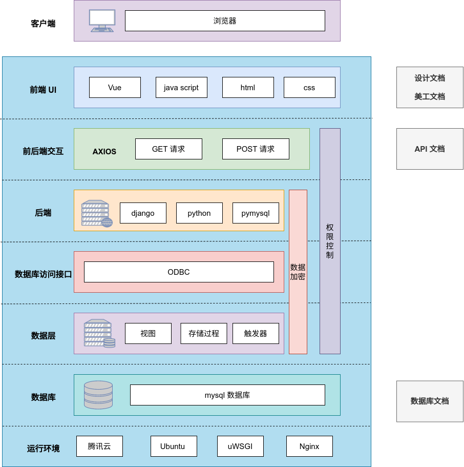


该项目是部署在云端的 Web 应用，用户通过浏览器访问该应用。应用开发可以分为三个部分，前端开发，后端开发和文档开发。

### 1.1.2 前端结构

**assets**：

- 用于存储静态资源。
- 包括网站图片与字体。

**components**：

- 多次重复使用的或者功能较为独立的 Vue 组件。
- 包括：固定按钮、侧边栏、导航栏、密码修改表单、排行榜、计分板、文件上传器。

**router**：

- 控制应用路由的 JS 文件。
- 应用采用二级路由的机制，所以一共有多个 JS 文件，分别记录课程页面组，活动页面组，个人页面组和管理页面组的子路由。

**store**：

- 网页会话存储，可以在客户端存储一些信息，存储寿命与该次会话寿命一致，即网页关闭则存储失效。
- store中包含两个存储对象，一是注册时基本信息的存储，在注册密码页发送请求时一起调用；二是用户token。

**views**：

- 应用的界面 Vue 文件。
- 具有课程、活动、个人、管理四个子文件夹，这些子文件夹下存储着不同的页面。

### 1.1.3 后端结构

后端采用 Django 框架实现。文件结构如下：

* **app**

  * **migrations**
    这个文件夹中时 Django 生成的数据库迁移代码，用于修改模型类后将修改执行到数据库。

  * **models.py**

    该文件定义了模型类，对应数据库的表，具体内容见本文档第二部分。

  * **url.py**

    该文件定义路由，通过设置该文件中的路由，可以将不同的请求发送到不同的视图函数中进行处理。

  * **util.py**

  该文件定义了一些工具函数，用于处理一些常用的操作，如密码加密、token生成等。

  * **views**
    * 该文件夹中存放着视图函数，用于处理前端发送的请求。
    * **student**
      与学生相关的视图函数 
    * **teacher**
      与教师相关的视图函数 
    * **User.py**
      与用户管理相关的视图函数 
    * **Activity.py**
      与活动相关的视图函数 
    * **Administractor.py**
      管理端相关视图函数


* **backend**


  后端基本文件，用于进行一些配置，主要有 Django 框架生成。 

* **manage.py**


  脚本，用于后端的部署、数据库的迁移等。

### 1.1.4 文档架构

- **TODO.md**：以周为单位为规划任务，并每周进行检测。
- **api.md**：记录前后端交互的接口。
- **style.md**：记录着 Git 的提交规范和项目代码风格规范。
- **report**：记录着所有的需要报告。
- **design**：记录着所有的设计和美工文档。
  - **beautify**：记录着美工原则。
  - **analyze**：记录着推荐机制的判断原理。
  - **其他**：记录这页面的布局信息。

架构图如下所示：

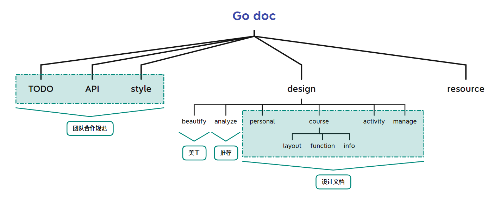

## 1.2 系统实现环境

### 1.2.1 客户端环境

```c
go_frontend@0.1.0 /home/thysrael/learn/sem5/DBSM/4H16B/go_frontend
├── @babel/core@7.19.3
├── @babel/eslint-parser@7.19.1
├── @vue/cli-plugin-babel@5.0.8
├── @vue/cli-plugin-eslint@5.0.8
├── @vue/cli-service@5.0.8
├── async@3.2.4
├── axios@0.27.2
├── core-js@3.25.3
├── echarts@5.4.1
├── element-ui@2.15.10
├── eslint-plugin-vue@8.7.1
├── eslint@7.32.0
├── qs@6.11.0
├── router@1.3.7
├── vue-axios@3.4.1
├── vue-router@3.5.1
├── vue-template-compiler@2.7.10
├── vue@2.7.10
├── vuex@3.6.2
└── wowjs@1.1.3
```

### 1.2.2 服务器端

* **开发语言**：Python

  依赖包 

    ```
  PyJWT==2.5.0
  PyMySQL==1.0.2
  Django==4.1.1
  django-cors-headers==3.13.0
  django-rest-framework==0.1.0
  djangorestframework==3.13.1
    ```

* **Web 开发框架**：Django@4.1.1

* **DBMS**：MySQL

## 1.3 功能结构

功能架构示意图如下：

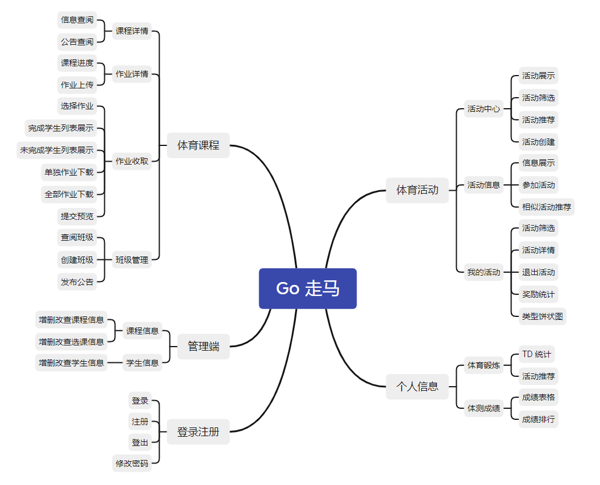

### 1.3.1 登录注册

- 登录：可以通过输入邮箱和邮箱对应的正确密码，登录进入功能界面，否则会无法进入功能页面。
- 注册：通过选择用户类型，输入邮箱和密码，当后台查验无误的时候，即可注册账户。
- 登出：用户登录后可以选择登出，用户会失去访问所有功能界面的权限。
- 修改密码：在登录后可以选择修改密码，用户的密码会被设置成新的密码。。

### 1.3.2 体育课程

**课程详情**：

- 信息查阅：包括可以查询教师姓名、上课时间、上课地点、课程编号。
- 公告查阅：可以查询当前课程发布的所有公告。

**作业详情**：

- 课程进度：以瀑布流的形式展示每个学生面对的所有作业。
- 作业上传：可以上传自己的作业

**作业收取**：

- 选择作业：指定作业的内容
- 完成学生列表展示：应该根据选择器的结果，可以展示学生信息。
- 未完成学生列表展示：应该根据选择器的结果，可以展示学生信息。
- 单独作业下载按钮：可以下载某个作业。
- 全部下载：就是把左右的作业打包成一个 `zip` 下载。
- 提交预览：可以在线预览

**班级管理**：

- 查阅班级：会显示自己管理的所有班级，并且可以查看该班级的学生的具体信息，对学生进行一定的操作。
- 创建班级：可以创建一个新的班级。
- 发布通告：可以给具体班级发布通告。

### 1.3.3 体育活动

**活动中心**：

- 活动展示：可以展示活动的简略信息和活动图片，点击活动可以查看具体的活动信息。
- 活动筛选：可以通过地点、标签、开始时间、结束时间筛选活动。
- 活动推荐：可以从“最热”、“最新”、“志同道合”、“猜你喜欢”、“最多 TD” 等多个维度对活动进行推荐。
- 活动创建：可以创建活动。

**活动信息**：

- 信息展示：可以展示活动的具体信息，比基本信息多了活动的参与人数和活动介绍。
- 参加活动：可以参加当前活动。
- 相似活动：可以根据当前活动推荐相似的活动。

**我的活动**：

- 活动筛选：可以根据学期筛选自己的活动。
- 活动详情：列表展示活动的基本信息，同时可以跳转到活动的具体页面。
- 退出活动：可以退出想要选定的活动。
- 奖励统计：统计活动的总奖励数。
- 类型饼状图：用饼状图显示参加活动的各种信息。

### 1.3.4 个人信息

**体育锻炼**：

- TD 统计：可以获得各个学期的 TD 统计信息。
- 活动推荐：可以推荐适合加 TD 的活动。

**体测成绩**：

- 成绩表格：可以展示每一项成绩的表格。
- 成绩排行：对于“50m”、“耐力”、“立定跳远”的成绩进行了排行。

### 1.3.5 管理端

**课程信息**：

- 增删改查课程信息。
- 增删改查“学生-课程”关系。

**学生信息**：

- 增删改查学生信息。

---


# 二、数据基本表的定义

数据库共包含 7 个实体，12 张表，采用 Django 提供的数据库访问接口实现数据库表的定义以及访问，相比于直接使用 SQL 语句更加清晰并且易于维护。每个表对应一个模型类，类中的属性对应表的列。

具体定义以及实现代码如下。

## 2.1 用户管理部分

这部分内容关于用户的管理，主要包括用户的登录、注册、修改密码等。该系统中用户有两种，分别为老师和学生，由于老师和学生具有某些共同的性质（例如账号和密码），但是学生具有老师不具备的性质（例如入学年份），因此可以让老师和学生都继承 Django 模型的一个抽象类 `AbstractUser`。

```python
class AbstractUser(models.Model):
    email = models.CharField(max_length=EMAIL_LEN, verbose_name='email', primary_key=True)
    name = models.CharField(max_length=NAME_LEN, verbose_name='姓名')
    password = models.CharField(max_length=PASSWD_LEM, verbose_name='密码')

    class Meta:
        abstract = True
```

这种特化关系表现在数据库的表中是老师表和学生表都具有 `email, name` 等属性，这里相当于 Django 框架对数据库的表进行了一层抽象。

### 2.1.1 学生表

tb_students

| 字段名称   | 数据类型    | 可否为空 | 主码 | 外码 | 其他 | 说明     |
| ---------- | ----------- | -------- | ---- | ---- | ---- | -------- |
| email      | varchar(30) | NO       | YES  |      |      | 邮箱     |
| name       | varchar(10) | NO       |      |      |      | 姓名     |
| password   | varchar(20) | NO       |      |      |      | 密码     |
| student_id | varchar(8)  | NO       |      |      |      | 学生编号 |
| grade      | int         | NO       |      |      |      | 入学年份 |


```python
class Student(AbstractUser):
    student_id = models.CharField(max_length=STUDENT_ID_LEN, verbose_name='学号')
    grade = models.IntegerField(verbose_name='年级')

    class Meta:
        db_table = 'tb_students'  # 指明数据库表名
        verbose_name = '学生'  # 在admin站点中显示的名称
        verbose_name_plural = verbose_name  # 显示的复数名称

    def __str__(self):
        """定义每个数据对象的显示信息"""
        return self.email
```

### 2.1.2 教师表

tb_teachers

| 字段名称 | 数据类型    | 可否为空 | 主码 | 外码 | 其他 | 说明 |
| -------- | ----------- | -------- | ---- | ---- | ---- | ---- |
| email    | varchar(30) | NO       | YES  |      |      | 邮箱 |
| name     | varchar(10) | NO       |      |      |      | 姓名 |
| password | varchar(20) | NO       |      |      |      | 密码 |

```python
class Teacher(AbstractUser):
    class Meta:
        db_table = 'tb_teachers'  # 指明数据库表名
        verbose_name = '教师'  # 在admin站点中显示的名称
        verbose_name_plural = verbose_name  # 显示的复数名称

    def __str__(self):
        """定义每个数据对象的显示信息"""
        return self.email
```

## 2.2 课程管理系统部分

这部分的表主要设计项目中课程管理相关内容，包括教师发布和删除通知，收发作业，学生选课和提交作业、获取通知。

### 2.2.1 课程表

tb_courses

| 字段名称         | 数据类型    | 可否为空 | 主码 | 外码       | 其他     | 说明                  |
| ---------------- | ----------- | -------- | ---- | ---------- | -------- | --------------------- |
| id               | bigint      | NO       | YES  |            | 自动递增 | 课程编号              |
| name             | varchar(40) | NO       |      |            |          | 课程名称              |
| time             | varchar(30) | NO       |      |            |          | 上课时间              |
| location         | varchar(30) | NO       |      |            |          | 上课地点              |
| manager_email_id | varchar(30) | NO       |      | tb_teacher |          | 课程负责人邮箱        |
| semester         | int         | NO       |      |            |          | 课程开设学期（春/秋） |
| year             | int         | NO       |      |            |          | 课程开设学年          |

```python
class Course(models.Model):
    name = models.CharField(max_length=COURSE_NAME_LEN)
    manager_email = models.ForeignKey(Teacher, on_delete=models.CASCADE, verbose_name='课程负责人', default='ems')
    time = models.CharField(max_length=30, verbose_name='上课时间')
    location = models.CharField(max_length=30, verbose_name='上课地点')
    year = models.IntegerField(verbose_name='年份', default=2022)
    semester = models.IntegerField(verbose_name='学期', default=1)  # 1:秋季学期 2:春季学期

    class Meta:
        db_table = 'tb_courses'

    def __str__(self):
        return self.id
```

### 2.2.2 学生-课程表

tb_student_course

| 字段名称   | 数据类型    | 可否为空 | 主码 | 外码        | 其他 | 说明     |
| ---------- | ----------- | -------- | ---- | ----------- | ---- | -------- |
| c_id_id    | bigint      | NO       | YES  | tb_courses  |      | 课程编号 |
| s_email_id | varchar(30) | NO       | YES  | tb_students |      | 学生编号 |
| grade      | int         | YES      |      |             |      | 成绩     |

```python
class StudentCourse(models.Model):
    s_email = models.ForeignKey(Student, on_delete=models.CASCADE)
    c_id = models.ForeignKey(Course, on_delete=models.CASCADE)
    grade = models.IntegerField(verbose_name='成绩', null=True)

    class Meta:
        db_table = 'tb_student_course'
        unique_together = (("s_email", "c_id"),)
```

### 2.2.3 教师-课程表

tb_teacher_course

| 字段名称   | 数据类型    | 可否为空 | 主码 | 外码        | 其他 | 说明     |
| ---------- | ----------- | -------- | ---- | ----------- | ---- | -------- |
| c_id_id    | bigint      | NO       | YES  | tb_courses  |      | 课程编号 |
| t_email_id | varchar(30) | NO       | YES  | tb_teachers |      | 老师编号 |

```python
class TeacherCourse(models.Model):
    t_email = models.ForeignKey(Teacher, on_delete=models.CASCADE)
    c_id = models.ForeignKey(Course, on_delete=models.CASCADE)

    class Meta:
        db_table = 'tb_teacher_course'
        unique_together = (("t_email", "c_id"),)
```

### 2.2.4 作业表

tb_homeworks

| 字段名称        | 数据类型     | 可否为空 | 主码 | 外码        | 其他     | 说明           |
| --------------- | ------------ | -------- | ---- | ----------- | -------- | -------------- |
| id              | bigint       | NO       | YES  |             | 自动递增 | 作业编号       |
| ddl             | datetime(6)  | NO       |      |             |          | 作业截止日期   |
| content         | varchar(300) | NO       |      |             |          | 作业内容       |
| author_email_id | varchar(30)  | NO       |      | tb_teachers |          | 作业发布者     |
| course_id_id    | bigint       | NO       |      | tb_courses  |          | 作业对应的课程 |
| time            | datetime(6)  | NO       |      |             |          | 作业创建时间   |
| title           | varchar(30)  | NO       |      |             |          | 作业标题       |

```python
class Homework(models.Model):
    time = models.DateTimeField(auto_now_add=True)
    title = models.CharField(max_length=30, verbose_name='作业标题', default='')
    ddl = models.DateTimeField()
    content = models.CharField(max_length=HW_CONTENT_LEN)
    author_email = models.ForeignKey(Teacher, on_delete=models.CASCADE)
    course_id = models.ForeignKey(Course, on_delete=models.CASCADE)

    class Meta:
        db_table = 'tb_homeworks'

    def __str__(self):
        return self.id
```

### 2.2.5 作业提交表

tb_hw_submission

| 字段名称          | 数据类型     | 可否为空 | 主码 | 外码         | 其他 | 说明         |
| ----------------- | ------------ | -------- | ---- | ------------ | ---- | ------------ |
| time              | datetime(6)  | NO       |      |              |      | 作业提交时间 |
| fileTitle         | varchar(100) | NO       |      |              |      | 文件名称     |
| fileContent       | varchar(100) | NO       |      |              |      | 文件所在地址 |
| homeworkId_id     | bigint       | NO       | YES  | tb_homeworks |      | 作业编号     |
| submitterEmail_id | varchar(30)  | NO       | YES  | b_students   |      | 提交者邮箱   |

```python
class HwSubmission(models.Model):
    time = models.DateTimeField(auto_now_add=True)
    fileTitle = models.FileField()
    fileContent = models.FileField(upload_to='upload_files', )
    submitterEmail = models.ForeignKey(Student, on_delete=models.CASCADE)
    homeworkId = models.ForeignKey(Homework, on_delete=models.CASCADE)

    class Meta:
        db_table = 'tb_hw_submission'
        unique_together = (("homeworkId", "submitterEmail"),)

    def __str__(self):
        return self.id, self.fileTitle
```

### 2.2.6 通知表

tb_notices

| 字段名称        | 数据类型      | 可否为空 | 主码 | 外码        | 其他     | 说明           |
| --------------- | ------------- | -------- | ---- | ----------- | -------- | -------------- |
| id              | bigint        | NO       | YES  |             | 自动递增 | 通知编号       |
| time            | datetime(6)   | NO       |      |             |          | 通知时间       |
| content         | varchar(1000) | NO       |      |             |          | 通知内容       |
| title           | varchar(30)   | NO       |      |             |          | 通知标题       |
| author_email_id | varchar(30)   | NO       |      | tb_teachers |          | 通知发布者     |
| course_id_id    | bigint        | NO       |      | tb_courses  |          | 通知对应的课程 |

```python
class Notice(models.Model):
    time = models.DateTimeField(auto_now=True)
    content = models.CharField(max_length=NOTICE_LEN)
    title = models.CharField(max_length=30)
    author_email = models.ForeignKey(Teacher, on_delete=models.CASCADE)
    course_id = models.ForeignKey(Course, on_delete=models.CASCADE)

    class Meta:
        db_table = 'tb_notices'
```

## 2.3 活动管理部分

### 2.3.1 活动表

tb_activites

| 字段名称     | 数据类型      | 可否为空 | 主码 | 外码      | 其他     | 说明             |
| ------------ | ------------- | -------- | ---- | --------- | -------- | ---------------- |
| id           | bigint        | NO       | YES  |           | 自动递增 | 活动编号         |
| content      | varchar(1000) | NO       |      |           |          | 活动内容         |
| title        | varchar(30)   | NO       |      |           |          | 活动标题         |
| position     | varchar(30)   | NO       |      |           |          | 活动地点         |
| create_time  | datetime(6)   | NO       |      |           |          | 活动创建时间     |
| start_time   | datetime(6)   | NO       |      |           |          | 活动开始时间     |
| end_time     | datetime(6)   | NO       |      |           |          | 活动结束时间     |
| author_email | varchar(30)   | NO       |      |           |          | 活动创建者邮箱   |
| tag          | varchar(30)   | NO       |      |           |          | 活动标签         |
| TD           | int           | NO       |      |           |          | 活动加的TD数量   |
| img_id       | bigint        | YES      |      | tb_images |          | 活动图片         |
| BY           | int           | NO       |      |           |          | 活动加的博雅数量 |

```python
class Activity(models.Model):
    content = models.CharField(max_length=NOTICE_LEN)
    title = models.CharField(max_length=30)
    position = models.CharField(max_length=30)
    create_time = models.DateTimeField(auto_now_add=True)
    start_time = models.DateTimeField()
    end_time = models.DateTimeField()
    author_email = models.CharField(max_length=EMAIL_LEN)
    tag = models.CharField(max_length=30)
    TD = models.IntegerField(default=0)
    BY = models.IntegerField(default=0)
    img = models.ForeignKey(Images, null=True, on_delete=models.SET_NULL, default=None)

    class Meta:
        db_table = 'tb_activities'
```

### 2.3.2 学生-活动表

tb_student_sctivites

| 字段名称    | 数据类型    | 可否为空 | 主码 | 外码          | 其他 | 说明                             |
| ----------- | ----------- | -------- | ---- | ------------- | ---- | -------------------------------- |
| time        | datetime(6) | NO       |      |               |      | 活动参与时间                     |
| status      | varchar(2)  | NO       |      |               |      | 参与状态（未开始/已完成/已过期） |
| activity_id | bigint      | NO       | YES  | tb_activities |      | 活动编号                         |
| student_id  | varchar(30) | NO       | YES  | tb_students   |      | 学生编号                         |

```python
class StudentActivity(models.Model):
    student = models.ForeignKey(Student, on_delete=models.CASCADE)
    activity = models.ForeignKey(Activity, on_delete=models.CASCADE)
    time = models.DateTimeField(auto_now_add=True)

    class Status(models.TextChoices):
        NOT_START = 'NS', _('Not Start')
        NOT_ATTEND = 'NA', _('Not Attend')
        ATTEND = 'A', _('Attend')

    status = models.CharField(
        max_length=2,
        choices=Status.choices,
        default=Status.NOT_START
    )

    class Meta:
        db_table = 'tb_student_activity'
        unique_together = (("student", "activity"),)
```

## 2.4 个人信息部分

### 2.4.1 学生-体测成绩表

tb_student_examine_result

| 字段名称      | 数据类型     | 可否为空 | 主码 | 外码        | 其他 | 说明         |
| ------------- | ------------ | -------- | ---- | ----------- | ---- | ------------ |
| year          | int          | NO       | YES  |             |      | 学年         |
| tdSpring      | int          | YES      |      |             |      | 春季 td      |
| tdAutumn      | int          | YES      |      |             |      | 秋季 td      |
| examineResult | varchar(200) | NO       |      |             |      | 体测结果     |
| student_id    | varchar(30)  | NO       | YES  | tb_students |      | 学生         |
| byAutumn      | int          | YES      |      |             |      | 秋季博雅     |
| bySpring      | int          | YES      |      |             |      | 春季博雅     |
| height        | double       | YES      |      |             |      | 学生身高     |
| score         | int          | YES      |      |             |      | 学生体测分数 |
| weight        | double       | YES      |      |             |      | 学生体重     |

```python
class StudentExamineResult(models.Model):
    student = models.ForeignKey(Student, on_delete=models.CASCADE)
    year = models.IntegerField()
    tdSpring = models.IntegerField(default=0, null=True)
    tdAutumn = models.IntegerField(default=0, null=True)
    bySpring = models.IntegerField(default=0, null=True)
    byAutumn = models.IntegerField(default=0, null=True)

    # json 格式存储体测成绩信息
    examineResult = models.CharField(max_length=200)
    weight = models.FloatField(default=60.1, null=True)
    height = models.FloatField(default=172.3, null=True)
    score = models.IntegerField(default=85, null=True)

    class Meta:
        db_table = 'tb_student_examine_result'
        unique_together = (("student", "year"),)
```

## 2.5 其他

### 2.5.1 图片管理表

tb_images

| 字段名称 | 数据类型     | 可否为空 | 主码 | 外码 | 其他     | 说明         |
| -------- | ------------ | -------- | ---- | ---- | -------- | ------------ |
| id       | bigint       | NO       | YES  |      | 自动递增 | 图片编号     |
| img      | varchar(100) | NO       |      |      |          | 图片存储位置 |


---


# 三、系统重要功能实现方法

## 3.1 鉴权实现

### 3.1.1 token机制

为了鉴别用户身份，我们采用 token 唯一标识。用户登录后，服务器校验用户身份并返回一个 token；客户端在 session 中储存该 token，并在随后的每一次请求中再请求头中附带该 token，以示身份；最终，服务器校验 token 进而返回数据。

除此之外，token 还可以作为标识用户是否登录的载体，因为只有登录过的用户，才会获得其独一无二的 token。

### 3.1.2 路由守护

为了防止用户未登录直接通过网址访问个人中心页等等，我们设置网页的全局路由守卫。此处的逻辑采用前置守卫，即在进入每个页面前检测用户是否登录，从而显示给用户正确的内容。

对于登录注册网页这些显然不需要登录的页面，我们将其路径存储到“白名单”中，即用户的确无需登录即可访问。

```javascript
const whiteRoute = ['/login', '/', '/register', '/password']
```

对于其余页面，只需在 route 路由文件中设置其 meta 路由元信息，将其中 needLogin 属性置为 true。触发前置路由时，会首先检测当前页面是否在白名单中，如果在则正常显示，否则判断其 needLogin 属性是否为 true，如果为 true，则直接路由到登录界面，以提醒用户需要先登录才能访问当前页面。

```javascript
router.beforeEach((to, from, next) => {
    let token = sessionStorage.getItem("token")
    next();
    if (whiteRoute.includes(to.path)) {
        if(to.path === '/password') {
            const hasRegistered = sessionStorage.getItem("registered")
            if (hasRegistered) {
                next();
            } else {
                next();
            }
        } else {
            next();
        }
    } else {
        if(to.meta.needLogin) {
            if (token) {
                next();
            } else {
                next('/');
            }
        } else {
            next();
        }
    }
})
```

## 3.2 推荐算法

  数据挖掘是数据库中数据的另一种应用形式，我们可以从大量收集到的用户行为数据中收集信息，从而对用户进行分析，为用户提供更加个性化的推荐。GO 在活动查看功能部分使用了推荐算法，“猜你喜欢”选项根据用户以往参与活动的记录，为用户推荐更加符合其兴趣的活动。“志同道合”选项可以分析多个用户的参与活动信息，推荐用户可能会感兴趣的活动。

  “猜你喜欢”选项是一个评价问题，随机选取该用户最近几次参加的活动，对于用户未参与的各项活动，分别比较它们和已参加活动的相似程度，按照相似程度进行排序，排名靠前的就是可能和用户喜好比较相符的活动。

```python
def computeWeight(i, activityList):
    '''
    Args:
        i: 活动
        activityList: 用户参加过的活动

    Returns: 活动 i 和用户参加过的活动的相似程度
    '''
    w = 0
    for a in activityList:
        if i['position'] == a.position:
            w += 7
        if i['tag'] == a.tag:
            w += 3
        if i['title'] == a.title:
            w += 11
        else:
            w += 8 * difflib.SequenceMatcher(None, a.title, i['title']).quick_ratio()
        w += i['TD'] + i['BY']
    return w
```

  “志同道合” 推荐部分采用了聚类算法，将用户参与的活动信息（包括活动名称，活动地点，活动标签，TD 等）标准化和归一化，对这些向量用 k-means 方法进行聚类分析，得到与该用户兴趣相似的用户，并向其推荐兴趣相似的用户参与的活动，达到“志同道合”的效果。一下是 k-means 推荐算法的代码：

```python
def KMeans(data, k, distance_func=euclidean_distance):
    '''根据k-means算法求解聚类的中心'''
    m = np.shape(data)[0]  # 获得行数m
    cluster_assment = np.mat(np.zeros((m, 2)))  # 初始化一个矩阵，用来记录簇索引和存储距离平方
    centroids = get_centroids(data, k)  # 生成初始化点
    cluster_changed = True  # 判断是否需要重新计算聚类中心
    while cluster_changed:
        cluster_changed = False
        for i in range(m):
            distance_min = np.inf  # 设置样本与聚类中心之间的最小的距离，初始值为正无穷
            index_min = -1  # 所属的类别
            # 判断离哪个类别最近
            for j in range(k):
                distance_ji = distance_func(centroids[j, :], data[i, :])
                if distance_ji < distance_min:
                    distance_min = distance_ji
                    index_min = j
            if cluster_assment[i, 0] != index_min:
                cluster_changed = True
                cluster_assment[i, :] = index_min, distance_min ** 2  # 存储距离平方
        for cent in range(k):  # 更新质心，将每个族中的点的均值作为质心
            pts_in_cluster = data[np.nonzero(cluster_assment[:, 0].A == cent)[0]]
            centroids[cent, :] = np.mean(pts_in_cluster, axis=0)
    return centroids, cluster_assment

def nearest(data, cluster_centers, distance_func=euclidean_distance):
    min_dist = np.inf
    m = np.shape(cluster_centers)[0]  # 当前已经初始化的聚类中心的个数
    for i in range(m):
        d = distance_func(data, cluster_centers[i, ])  # 计算point与每个聚类中心之间的距离
        if min_dist > d:  # 选择最短距离
            min_dist = d
    return min_dist

def get_centroids(data, k, distance_func=euclidean_distance):
    m, n = np.shape(data)
    cluster_centers = np.mat(np.zeros((k, n)))
    index = np.random.randint(0, m) 
    cluster_centers[0, ] = np.copy(data[index, ])
    d = [0.0 for _ in range(m)] 
    for i in range(1, k):
        sum_all = 0
        for j in range(m):
            d[j] = nearest(data[j, ], cluster_centers[0:i, ], distance_func) 
            sum_all += d[j] 
        sum_all *= random.random()
        for j, di in enumerate(d): 
            sum_all -= di
            if sum_all > 0:
                continue
            cluster_centers[i] = np.copy(data[j, ])
            break
    return cluster_centers
```

## 3.3 文件上传

vue中，文件上传需要以 FormData 的结构发送给后端。即

```javascript
var formData = new FormData();
formData.append('homework', file);
```

如果还需要传入其他数据，则将其他数据一并包含在 formData 中，在最终向后端发包时，将 formData 作为参数整体传递即可。

```javascript
this.$axios({
          url: url,
          method: 'post',
          data: formData,
          headers: {
            token: token
}
})
```

## 3.4 图床

由于在活动界面需要展示每个活动对应的图片，而图片是需要在用户创建活动的时候上传的，所以我们需要将这些图片存在一个位置然后在需要的时候读取。为了更加灵活，我们采用自己租用的服务器 + Nginx 搭建了一个图床，访问对应地址，就能看到相应的图片。在前端需要显示图片的时候后端只需要向前端传递图片的地址，前端访问这个地址就能得到图片，相比于后端向前端直接传图片，这样提高了网站的加载速度。

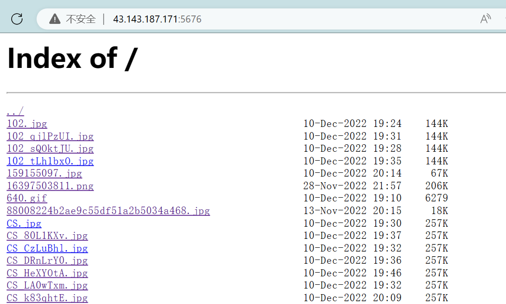

## 3.5 动态路由匹配

我们经常需要把某种模式匹配到的所有路由，全都映射到同个组件。例如，在 Go 走马中，我们有一个 `ActivityInfo` 组件，对于所有 ID 各不相同的用户，都要使用这个组件来渲染。那么，我们可以在 `vue-router` 的路由路径中使用“动态路径参数“(dynamic segment) 来达到这个效果，具体设置如下

```javascript
{
    path: '/activity_home/activity/:id',
        name: 'Activity',
            component: () =>
            import('../views/activity/ActivityInfo'),
                meta: {
                    needLogin: true
                }
},
```

对于具体的 `/activity_home/activity/1` 和 `/activity_home/activity/514` 都可以匹配到这个路由，对应的值都会设置到 `$route.params` 中，可以直接取出来使用，如图所示：

```javascript
let activityId = this.$route.params.id;
```

最终效果如图所示：

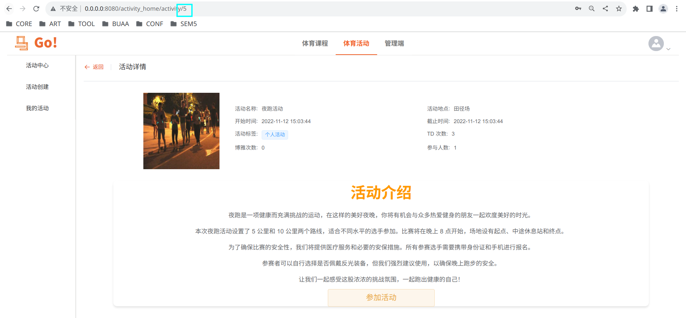

## 3.6 触发器

   采用触发器来防止异常数据的产生。在插入或删除数据的时候进行检查或者修改，保证数据的完整性。

**1. 删除学生时的动作**

   删除学生时应该删除这个学生的选课记录、活动参与记录、学生的成绩。

   ```sql
CREATE TRIGGER `delete_student` BEFORE DELETE ON `student` FOR EACH ROW
BEGIN
    DELETE FROM `student_course` WHERE `student_id` = OLD.`id`;
    DELETE FROM `student_activity` WHERE `student_id` = OLD.`id`;
    DELETE FROM `student_examine_result` WHERE `student_id` = OLD.`id`;
END
   ```

**2. 删除教师时的动作**
   删除教师的时候应该删除这个教师开设的课程，以及课程相关信息。

   ```sql
CREATE TRIGGER `delete_teacher` BEFORE DELETE ON `teacher` FOR EACH ROW
BEGIN
    DELETE FROM `course` WHERE `teacher_id` = OLD.`id`;
END
   ```

**3. 删除课程时的动作**
   删除课程的时候应该删除选课记录。

   ```sql
CREATE TRIGGER `delete_course` BEFORE DELETE ON `course` FOR EACH ROW
BEGIN
    DELETE FROM `student_course` WHERE `course_id` = OLD.`id`;
END
   ```

**4. 删除活动时的动作**

  删除活动时应该删除这个活动对应的参与记录。

   ```sql
CREATE TRIGGER `delete_activity` BEFORE DELETE ON `activity` FOR EACH ROW
BEGIN
    DELETE FROM `student_activity` WHERE `activity_id` = OLD.`id`;
END
   ```

## 3.7 存储过程

### 3.7.1 用户管理（登录/注册）

1. 学生注册

  **涉及的基本表：** `students`

  **过程描述：** 检查该账号未注册后，向学生表中插入这个学生的信息。

  **代码：**

```python
class StudentRegister(APIView):
    def post(self, request):
        name = str(request.data.get('name'))
        email = str(request.data.get('email'))
        student_num = str(request.data.get('student_num'))
        grade = int(request.data.get('grade'))
        password = str(request.data.get('password'))
        print(request.data)
        if checkEmail(email) == 1:
            return Response({'value': 2})
        try:
            s = Student.objects.create(
                name=name,
                email=email,
                password=password,
                student_id=student_num,
                grade=grade
            )
            s.save()
        except Exception as e:
            print(e)
            return Response(1)
        return Response(0)
```

2. 登录

   **涉及的基本表：** `students`，`teachers`

   **过程描述：** 检查该账号是否存在，密码是否正确。

   **代码：**

```python
class Login(APIView):
    def post(self, request):
        print(request.data)
        email = str(request.data.get('email'))
        password = str(request.data.get('password'))
        value = 0
        token = ''
        type = -1

        try:
            item = Student.objects.get(email=email)
            type = UserType.student.value
        except Student.DoesNotExist:
            try:
                item = Teacher.objects.get(email=email)
                type = UserType.teacher.value
            except Teacher.DoesNotExist:
                value = 1

        if value == 0:
            if password != item.password:
                value = 2  # 密码错误
            else:
                token = gen_token(email)
        print(value)
        return Response({'value': value, 'token': token, 'type': type})
  
```

3. 教师注册

   **涉及的基本表：** `teachers`
   **过程描述：** 检查该账号未注册后，向教师表中插入这个教师的信息。
   **代码：**

```python
class TeacherRegister(APIView):
    def post(self, request):
        print(request.data)
        name = str(request.data.get('name'))
        email = str(request.data.get('email'))
        password = str(request.data.get('password'))
        if checkEmail(email) == 1:
            return Response({'value': 2})
        try:
            s = Teacher.objects.create(
                name=name,
                email=email,
                password=password,
            )
            s.save()
        except Exception as e:
            print(e)

            return Response(1)
        return Response(0)
```

4. 密码修改

   **涉及的基本表：** `students`，`teachers`

   **过程描述：** 检查该账号是否存在，密码是否正确，修改密码。

   **代码：**

```python
class ResetPassword(APIView):
    def post(self, request):
        print(request.data)
        token = get_header_token(request)
        if not decode_token(token):
            return Response({'value': 1, 'reason': 'token error'})
        email = decode_token(token)['email']
        new = str(request.data.get('newPass'))
        old = str(request.data.get('oldPass'))
        value, reason = 0, ''
        try:
            item = Student.objects.get(email=email)
        except Student.DoesNotExist:
            try:
                item = Teacher.objects.get(email=email)
            except Teacher.DoesNotExist:
                value, reason = 1, '用户不存在'
        if value == 0:
            if item.password != old:
                value, reason = 2, '旧密码错误'
            else:
                item.password = new
                item.save()
        return Response({'value': value, 'reason': reason})
```

### 3.7.2 课程系统

#### 3.7.2.1 管理员相关

1. 添加课程

  **涉及的基本表：** `courses`, `teacher_course`

  **过程描述：** 添加课程到 courses 表中，并且将创建课程的教师和课程添加到教师-课程表中。

  **代码：**

```python
class AddCourse(APIView):
    def post(self, request: Request):
        data = request.data
        reason = ''
        email = data['major_teacher_email']
        value = 0
        course_id = -1
        try:
            teacher = Teacher.objects.get(email=email)
        except Teacher.DoesNotExist:
            value = 1
            reason = '教师邮箱不存在'
        if value == 0:

            try:
                course = Course.objects.create(
                    name=str(data['name']),
                    manager_email=teacher,
                    time=data['time'],
                    location=data['location'],
                    year=getYearNow(),
                    semester=getSemesterNow(),
                )
                course_id = course.id
                tc = TeacherCourse.objects.create(
                    t_email=teacher,
                    c_id=course
                )
                course.save()
                tc.save()
            except Exception as e:
                print(e)
                value, reason = 2, '未知原因'
        return Response({'value': value, 'course_id': course_id, 'reason': reason})
```

2. 添加用户到课程

  **涉及的基本表：** `student_course`

  **过程描述：** 检查用户是否存在，检查课程是否存在，检查用户是否已经在课程中，添加用户到课程。

  **代码：**

```python
class AddUserToCourse(APIView):
    def post(self, request: Request):
        data = request.data
        ret, reason = 0, ''
        email = data['user_email']
        id = data['course_id']
        ys = datetime.date.today().year * 2 + datetime.date.today().month
        try:
            s = Student.objects.get(email=email)
            c = Course.objects.get(id=id)
            old = StudentCourse.objects.filter(s_email=s)
            if old.exists():
                ret = 1
                reason = '该学生已经选过id为{}的{}课了，请退掉再选新的课'.format(old[0].c_id.id, old[0].c_id.name)
            sc = StudentCourse.objects.create(
                s_email=s,
                c_id=c,
            )
            sc.save()
        except Student.DoesNotExist:
            ret = 2
            reason = '此邮箱未注册'
        except Course.DoesNotExist:

            ret = 3
            reason = '找不到该课程'
        except Exception as e:
            ret = 1
            reason = '该用户已加入课程或其他错误'

        return Response({'value': ret, 'reason': reason})
```

3. 删除课程

  **涉及的基本表：** `courses`, `teacher_course`, `student_course`

  **过程描述：** 删除课程，删除教师-课程表中的记录，删除学生-课程表中的记录。

  **代码：**

```python
class DeleteCourse(APIView):
    def post(self, request: Request):
        data = request.data
        ret = 0
        reason = ''
        try:
            c = Course.objects.get(id=data['course_id'])
            c.delete()
        except Course.DoesNotExist:
            ret = 1
            reason = '找不到该课程'
        except Exception as e:
            ret = 2
            reason = '未知原因'
        return Response({'value': ret, 'reason': reason})
```

4. 删除用户的选课记录

  **涉及的基本表：** `student_course`

  **过程描述：** 删除学生-课程表中的记录。

  **代码：**

```python
class DeleteUserFromCourse(APIView):
    def post(self, request: Request):
        data = request.data
        ret, reason = 0, ''
        email = data['user_email']
        id = data['course_id']

        try:
            s = Student.objects.get(email=email)
            c = Course.objects.get(id=id)
            obj = StudentCourse.objects.get(
                s_email=s,
                c_id=c
            )
            obj.delete()
        except Student.DoesNotExist:
            ret = 2
            reason = '此邮箱未注册'
        except Course.DoesNotExist:

            ret = 3
            reason = '找不到该课程'
        except StudentCourse.DoesNotExist as e:
            ret = 1
            reason = '删除失败，该用户不在课程中'
        except Exception as e:
            ret = -1
            reason = '未知原因'
        return Response({'value': ret, 'reason': reason})
```

5. 编辑课程

  **涉及的基本表：** `courses`

  **过程描述：** 编辑课程。

  **代码：**

```python
class EditCourse(APIView):
    def post(self, request: Request):
        data = request.data
        # type = UserType.student if data['type'] == '学生' else UserType.teacher
        value = 0
        reason = ''
        try:
            c = Course.objects.get(id=data['id'])
            c.name = data['name']
            c.location = data['location']
            c.time = data['time']
            c.save()
        except Course.DoesNotExist:
            value = 1
            reason = '课程不存在'
        except Exception:
            value = -1
            reason = '未知原因'
        return Response({
            'value': value,
            'reason': reason
        })
```

#### 3.7.2.2 学生相关

1. 提交作业

  **涉及的基本表：** `homeworks`, `hw_submission`

  **过程描述：** 检查该学生是否提交过这项作业，如果提交过，删除旧的提交以及旧的文件，然后存储新上传的文件到服务器并将文件名、文件地址保存到数据库。

  **代码：**

```python
class SubmitHomework(APIView):
    def post(self, request: Request):
        reason, value = '', 0
        data = request.data
        token = get_header_token(request)
        if not decode_token(token):
            value, reason = -1, '登录超时或者其他原因导致token失效'
        else:
            u_email = decode_token(token)['email']
            try:
                user = Student.objects.get(email=u_email)
                try:
                    homework = Homework.objects.get(id=data['id'])

                    file_obj = request.FILES.get('hw_submit')
                    oldhws = HwSubmission.objects.filter(homeworkId=homework, submitterEmail=user)
                    for _ in oldhws:
                        _.fileContent.delete()
                        _.delete()
                    sbm = HwSubmission.objects.create(
                        fileContent=file_obj,
                        fileTitle=file_obj.name,
                        submitterEmail=user,
                        homeworkId=homework
                    )
                    sbm.save()
                except Homework.DoesNotExist:
                    value, reason = 1, '要提交的作业不存在'
                except Exception as e:
                    print("error" + str(e))
                    value, reason = 2, '未知错误'
            except Student.DoesNotExist:
                value, reason = 1, '用户不存在'

        return Response({'value': value, 'reason': reason})
```

#### 3.7.2.3 教师相关

1. 创建课程

   **设计的基本表：**`courses`

    **过程描述：**将课程信息插入到 `course` 表中。

    **代码：**

```python
class CreateCourse(APIView):
    def post(self, request: Request):
        data = request.data
        value, reason = 0, ''
        token = get_header_token(request)
        id_ = None
        if not decode_token(token):
            value, reason = -1, '登录超时或者其他原因导致token失效'
        else:
            u_email = decode_token(token)['email']
            try:
                c = Course.objects.create(
                    name=data['name'],
                    location=data['location'],
                    time=data['time'],
                    manager_email_id=u_email,
                    year=getYearNow(),
                    semester=getSemesterNow(),
                )
                c.save()
                id_ = c.id
                tc = TeacherCourse.objects.create(
                    t_email=Teacher.objects.get(email=u_email),
                    c_id=c
                )
                tc.save()
            except Teacher.DoesNotExist:
                value, reason = 1, '用户不存在'
            except Exception:
                value, reason = 2, '未知错误'
        return Response({'value': value, 'reason': reason, 'id': str(id_)})
```

2. 发布通知

  **涉及的基本表：**`notices`

  **过程描述：**将这条通知插入到通知表中。

  **代码：**

```python
class AddNotice(APIView):
    def post(self, request: Request):
        data = request.data
        value, reason = 0, ''
        token = get_header_token(request)
        id_ = None

        if not decode_token(token):
            value, reason = -1, '登录超时或者其他原因导致token失效'
        else:
            u_email = decode_token(token)['email']
            try:
                n = Notice.objects.create(
                    content=data['content'],
                    title=data['title'],
                    course_id=Course.objects.get(id=data['g_id']),
                    author_email=Teacher.objects.get(email=u_email)
                )
                n.save()
                id_ = n.id
            except Course.DoesNotExist:
                value, reason = 1, '课程不存在'
            except Teacher.DoesNotExist:
                value, reason = 2, '用户不存在'
            except Exception:
                value, reason = 3, '未知错误'
        return Response({'value': value, 'reason': reason, 'id': str(id_)})
```

3. 删除通知

  **涉及的基本表：**`notices`

  **过程描述：**检查这条通知是否存在，并且作者是提出删除请求的用户，如果存在，将这条通知从通知表中删除。

  **代码：**

```python
class DeleteNotice(APIView):

    def post(self, request: Request):
        data = request.data
        value, reason = 0, ''
        # token = gen_token('20230002@buaa.edu.cn')
        token = get_header_token(request)

        if not decode_token(token):
            value, reason = -1, '登录超时或者其他原因导致token失效'
        else:
            u_email = decode_token(token)['email']
            try:
                n = Notice.objects.get(id=data['id'])
                if n.author_email.email == u_email:
                    n.delete()
                else:
                    value, reason = 2, '无权删除，只能删除自己发表的通知'
                n.delete()
            except Notice.DoesNotExist:
                value, reason = 1, '通知不存在'
        return Response({'value': value, 'reason': reason})
```

### 3.7.3 活动系统

1. 创建活动

  **涉及的基本表：**`activites`

  **过程描述：**将这条活动插入到活动表中。

  **代码：**

```python
class CreateActivity(APIView):
    def post(self, request: Request):
        value, reason = 0, ''
        token = get_header_token(request)
        id = -1
        if not decode_token(token):
            value, reason = -1, '登录超时或者其他原因导致token失效'
        u_email = decode_token(token)['email']
        if (checkEmail(u_email)) == 0:
            value, reason = 1, '用户不存在'
        else:
            img_id = request.data.get('img_id')
            try:
                img = Images.objects.get(id=img_id)
            except Images.DoesNotExist:
                img = None

            a = Activity.objects.create(
                title=request.data['title'],
                content=request.data['content'],
                position=request.data['position'],
                start_time=datetime.datetime.fromisoformat(request.data['start_time']),
                end_time=datetime.datetime.fromisoformat(request.data['end_time']),
                author_email=u_email,
                tag=request.data['tag'],
                TD=request.data['TD'],
                BY=request.data['BY'],
                img=img
            )
            a.save()
            id = a.id
        return Response({'value': value, 'reason': reason, "id": id})
```

2. 参加活动

  **涉及的基本表：**`activites`

  **过程描述：**检查用户信息和活动信息，如果活动存在，将用户和活动插入到参加活动表中。

  **代码：**

```python
class TakePartInActivity(APIView):
    def get(self, request):
        value, reason = 0, ''
        token = get_header_token(request)
        if not decode_token(token):
            value, reason = -1, '登录超时或者其他原因导致token失效'
        else:
            u_email = decode_token(token)['email']
            try:
                user = Student.objects.get(email=u_email)
                activity = Activity.objects.get(id=request.GET.get('id'))
                StudentActivity.objects.create(student=user, activity=activity)
            except Student.DoesNotExist:
                value, reason = 1, '用户不存在'
            except Activity.DoesNotExist:
                value, reason = 1, '活动不存在'
            except Exception as e:
                value, reason = 1, '未知错误: ' + str(e)
        return Response({'value': value, 'reason': reason})
```

3. 退出活动

  **涉及的基本表：**`activites`

  **过程描述：**检查用户信息和活动信息，如果活动存在，并且用户参与了这项活动，将用户和活动从参加活动表中删除。

  **代码：**

```python
class ExitActivity(APIView):
    def get(self, request):
        value, reason = 0, ''
        token = get_header_token(request)
        if not decode_token(token):
            value, reason = -1, '登录超时或者其他原因导致token失效'
        else:
            u_email = decode_token(token)['email']
            try:
                user = Student.objects.get(email=u_email)
                activity = Activity.objects.get(id=request.GET.get('id'))
                sa = StudentActivity.objects.get(student=user, activity=activity)
                sa.delete()
            except Student.DoesNotExist:
                value, reason = 1, '用户不存在'
            except Activity.DoesNotExist:
                value, reason = 1, '活动不存在'
            except StudentActivity.DoesNotExist:
                value, reason = 1, '用户未参与该活动'
            except Exception as e:
                value, reason = 1, '未知错误: ' + str(e)
        return Response({'value': value, 'reason': reason})
```

### 3.7.4 管理员系统

1. 删除用户

  **涉及的基本表：**`students`, `teachers`

  **过程描述：**检查用户信息，如果用户存在，将用户从用户表中删除。

  **代码：**

```python
class DeleteUser(APIView):
    def post(self, request: Request):
        value, reason = 0, ''
        try:
            s = Student.objects.get(email=request.data['email'])
            s.delete()
        except Student.DoesNotExist:
            t = Teacher.objects.get(email=request.data['email'])
            t.delete()
        except Teacher.DoesNotExist:
            value = 1
            reason = '用户不存在'
        return Response({'value': value, 'reason': reason})
```

2. 编辑用户

  **涉及的基本表：**`students`, `teachers`

  **过程描述：**检查用户信息，如果用户存在，将用户信息更新到用户表中。

  **代码：**

```python
class EditUser(APIView):
    def post(self, request : Request):
        data = request.data
        value, reason = 0, ''
        try:
            s = Student.objects.get(email=data['email'])
            s.email = data['email']
            s.name = data['name']
            s.student_id = data['student_num']
            s.grade = int(data['grade'][0:4]) + 1
            s.password = data['password']
            s.save()
        except Student.DoesNotExist:
            value = 1
            reason = '用户不存在'
        return Response({'value': value, 'reason': reason})
```

3. 添加用户

  **设计的基本表：**`students`, `teachers`

  **过程描述：**检查用户信息，如果用户不存在，将用户信息添加到学生表或者教师表中。

  **代码：**

```python
class AddUser(APIView):
    def post(self, request : Request):
        print(request.data)

        name =  str(request.data.get('name'))
        email =  str(request.data.get('email'))
        student_num = str(request.data.get('student_num'))
        grade = request.data.get('grade')
        # 前端传来的grade是日期
        grade = int(grade[0:4]) + 1
        password = str(request.data.get('password'))
        ret = 0
        reason = ''
        if checkEmail(email) == 1:
            ret = 1
            reason = '邮箱已注册'

        else:
            try:
                s = Student.objects.create(
                    email=email,
                    name=name,
                    student_id=student_num,
                    grade=grade,
                    password=password
                )
                s.save()
            except Exception as e:
                print(e)
                ret = 2
                reason = '未知原因'
        return Response({'value': ret, 'reason': reason})
```

---


# 四、系统实现效果

## 4.1 登录注册

### 4.1.1 首页

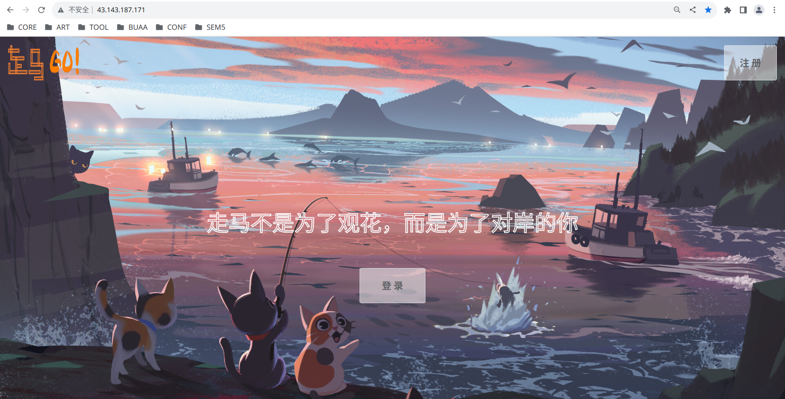

**信息**

- 图标：网站的图标。
- 口号：网站的口号。
- 背景：小猫垂钓图。

**功能**

- 登录：点击这个按钮后进入“登录”界面。
- 注册：点击这个按钮后进入“注册”界面。

### 4.1.2 登录

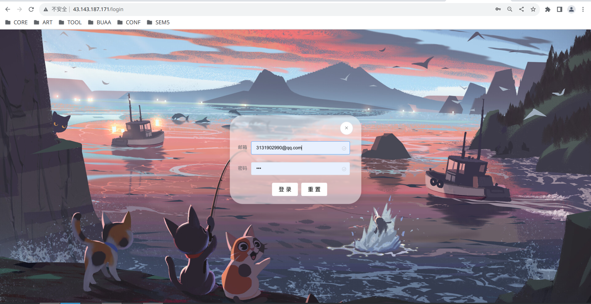

**信息**

- 邮箱 prompt
- 密码 prompt
- 登录按钮
- 背景界面为初始界面加一层蒙版

**功能**

- 点击 exit 按钮可以回到初始界面
- 邮箱和密码的信息按登录按钮后传递给后端，后端检验后返回是否是正确密码
- 如果是正确密码，就进入主界面（还未实现，意思意思就好了）
- 如果是错误密码，应当显示错误密码并清空 input 后再次等待

### 4.1.3 注册

老师注册界面

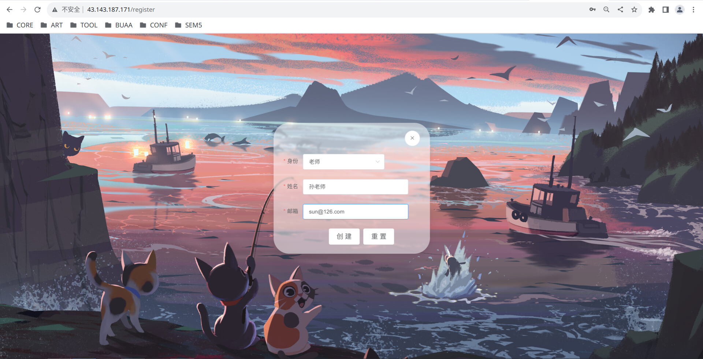

学生注册界面：

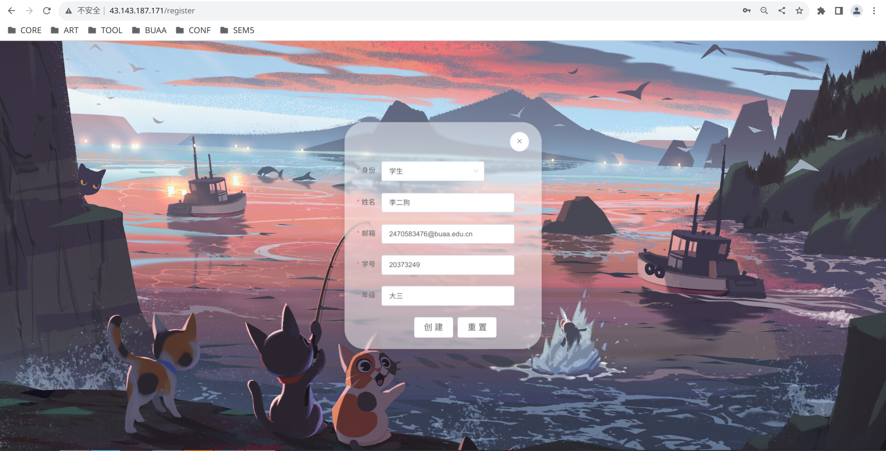

**信息**

- 各种 prompt
- 确认按钮

**功能**

- 按 exit 会退回到初始界面，按 pre 会退回到第一个注册界面。
- 在第一个界面按“确认“会检测输入内容的合法性，如果合法，则进入第二个界面，如果不合法，则显示提示信息。对于输入内容的合法性：
  - 学生学号需要不重复
  - 其他的需要非空
- 输入密码和确认密码（再次输入相同密码）后，需要检验两次是否相同，并将密码登记入数据库。
- 一切正常后，按“确认”回到初始界面。
- 根据身份单选框的不同（目前只有老师和学生两种），提供后面不同的选项，比如如果勾选学生，则应该要求用户多输入学号和年级两项内容，而如果勾选老师，则不需要多输入内容。

### 4.1.4 登出

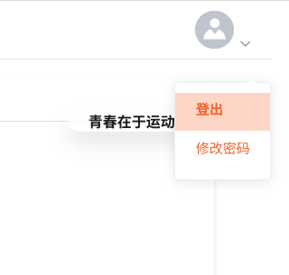

**功能**

- 点击登出后失去所有的权限，重新回到首页。

### 4.1.5 修改密码

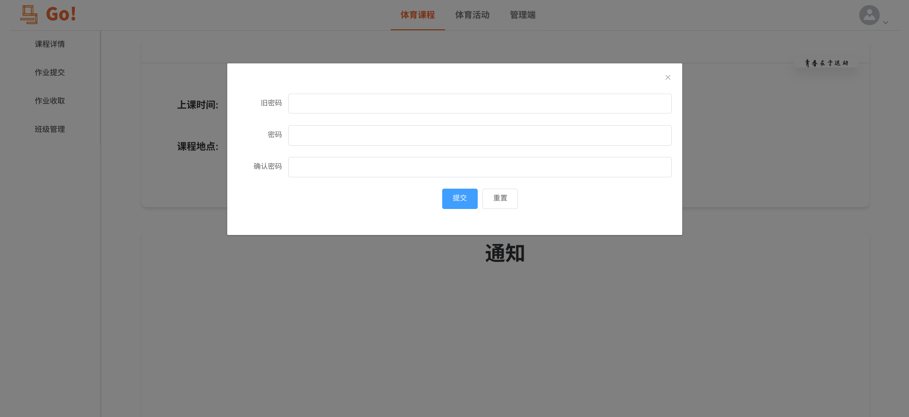

**功能**：

- 修改密码，前端提供一定的检测功能。

## 4.2 体育课程

### 4.2.1 课程详情

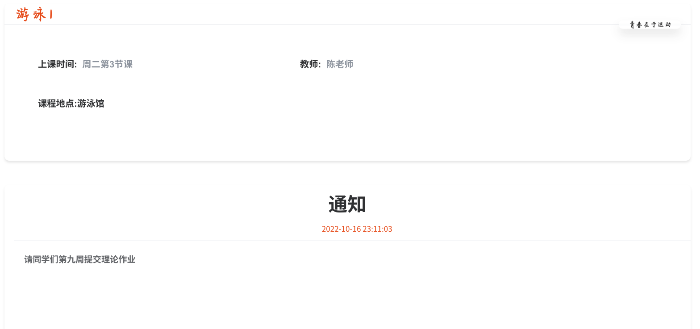

**信息**

- 课程基本信息中包括：
  - 课程名称（这个要字体比较大，比较显眼）
  - 老师姓名
  - 上课时间
  - 课程编号
- 公告栏有多个，其主要内容有
  - 标题，即公告标题（大一点）
  - 时间期限（稍微大一点）
  - 具体内容

### 4.2.2 作业提交

**展示界面**

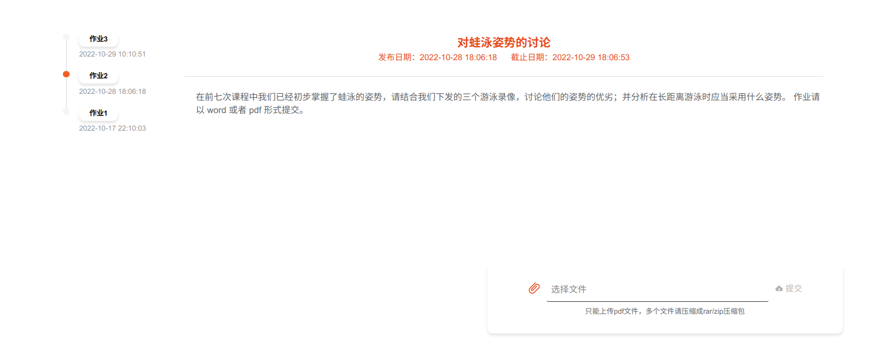

**提交作业**

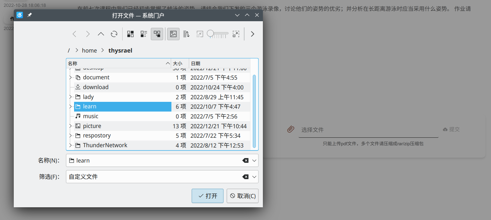

**信息**

- 课程进度：当前课程按时间排序的所有作业。
- 作业标题：就是作业的题目。
- 作业详情，包括：
  - 开始时间：年-月-日-时-分
  - 截止时间：年-月-日-时-分
  - 作业详情：类似于补充信息，比如（“允许重复提交，是大作业，算分“之类的）
  - 作业附件：一个下载按钮，可以下载作业附件，就像
- 提交相关：
  - 就是在布局右下角的那个东西
  - 提交输入框，就像 CO 的一样
  - 提价按钮，就是上面这幅图靠右的东西
  - 提交情况：

    - 显示是否成功提交
    - 显示提交的时间


**功能**

- 可以在“课程进度“里选择要提交的作业。
- 显示作业的信息。
- 可以下载作业附件。
- 可以提交作业。
- 可以查看提交是否成功。

### 4.2.3 作业收取

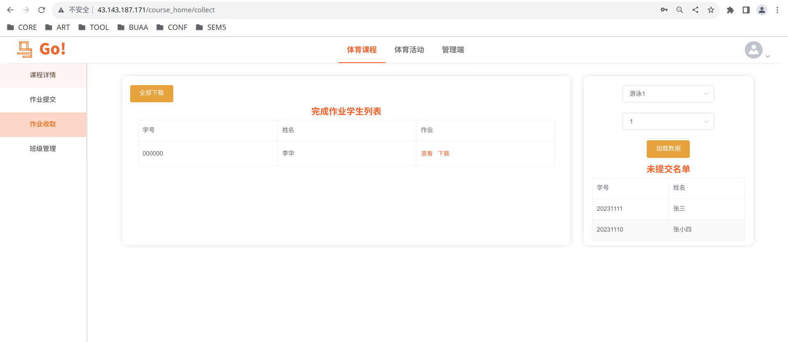

**信息**

- 课程选择器的选项：因为一个老师可能同时担任多门课程的，所以选择器需要提供老师所有的课程。
- 作业批次选择器：对于一个课程，可能留了多次作业，所以需要提供各个作业的名字。
- 完成学生列表：左侧的那个表格，可以“当前课程当前作业”的完成学生的名单，对于每个学生，显示“学号、姓名、作业文件名”
- 未提交名单：右侧表格，显示未完成作业的学生的“学号、姓名”

**功能**：

- 选择特定的某次作业：即两个选择器发挥的功能。
- 完成学生列表展示：应该根据选择器的结果，可以展示学生信息。
- 未完成学生列表展示：应该根据选择器的结果，可以展示学生信息。
- 单独作业下载按钮：可以下载某个作业，比如说图中的 `李华`。
- 全部下载：就是把左右的作业打包成一个 `zip` 下载。

### 4.2.4 班级管理

**浏览界面**：

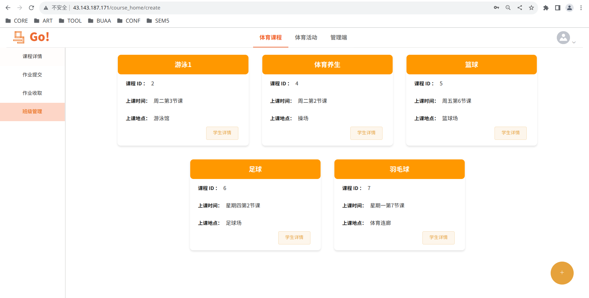

**添加活动**：

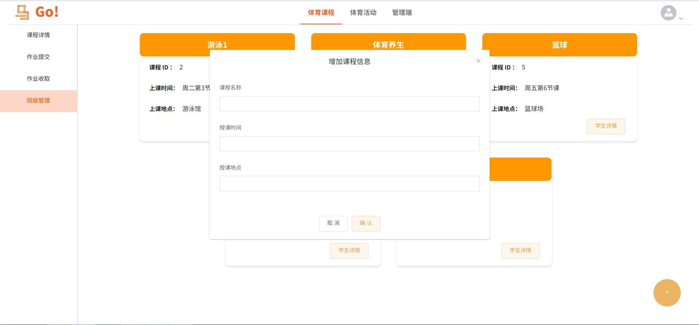

**信息**：

- 显示当前用户管理的课程。
- 课程信息包括：
  - 课程 ID
  - 上课时间
  - 游泳馆
- 显示上课学生的基本信息。
- “创建课程”按键。

**功能**：

- 点击“学生详情”可以查看学生的详细内容。
- 点击“创建班级“可以创建班级。

## 4.3 体育活动

### 4.3.1 活动中心

**浏览活动**

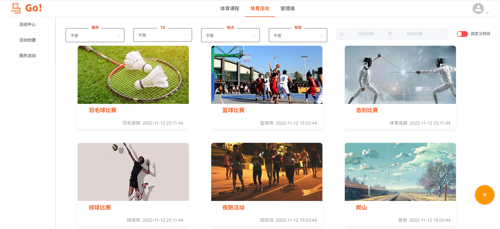

**筛选机制**

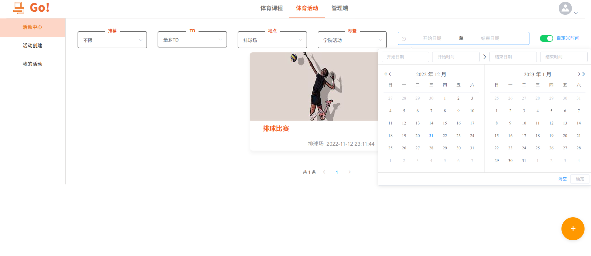

**推荐机制**

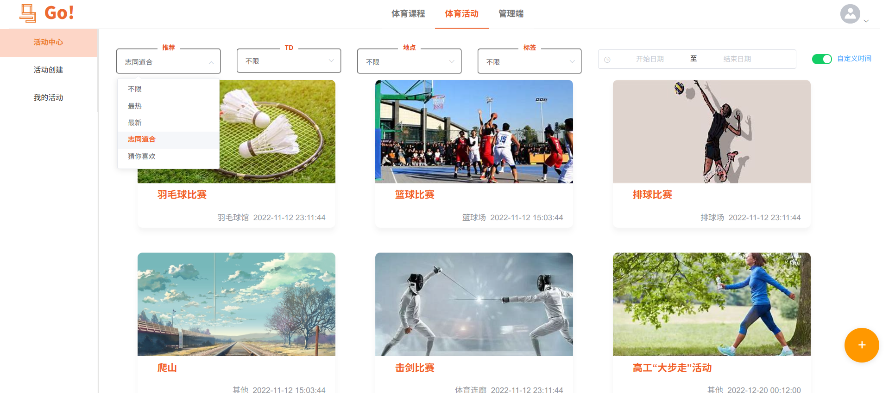

**信息**

- 上面 5 个是过滤器
  - TD：包括
    - 最多TD：就是按 TD 排序大小排序
    - 最值TD：按 （TD / （截止日期 - 开始日期））
    - 最多博雅：安好博雅次数排序
  - 推荐：包括
    - 最热：参加人数最多
    - 最新：开始时间最大
    - 志同道合：推荐身边的人（两个人参加了相同的多个活动）参加的活动。
    - 猜你喜欢：推荐与之前参加过的活动相似的活动。可以给男生推荐女生多的活动，反之亦然。
  - 地点：
    - 田径场
    - 体育连廊
    - 排球场
    - 篮球场
    - 羽毛球馆
    - 游泳馆
  - 时间：
    - 开始日期：年-月-日-时（如果 时 太长了，可以考虑去了）
    - 截止日期：年-月-日-时
  - 标签
    - 社团活动
    - 学院活动
    - 学校活动
    - 个人活动
- 每个活动占据一个 block，每个 block 的上面是一张活动图片（创建活动的时候可选上传图片，如果没有的话，就选择创建人的头像）下方是活动名称和开始时间，截止时间
- 每个页面展示 9 个 block，如果多于 9 个 block，那么分页。
- 创建 + 号浮在 block 上

**功能**

- **选择器**：如果啥都不选，那么应该呈现所有活动，如果选了过滤器，应当有叠加效果，比如说我可以看“TD 最多的，最热的，在田径场上的社团活动”。

- **创建活动**：那个加号可以跳转到创建页面（这里不涉及）

- 查看活动详情：可以点击 block 看详细信息（也就是跳转到“活动详情”页面，这里也不涉及）

### 4.3.2 创建活动

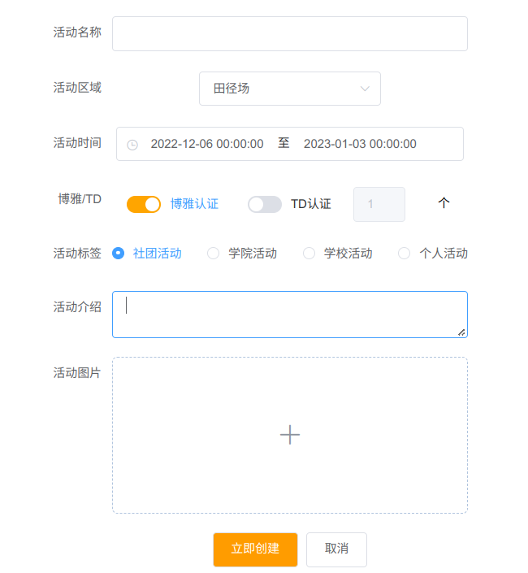

**功能**：

- 填写相关信息后即可创建活动。

### 4.3.3 活动详情

**活动介绍**：

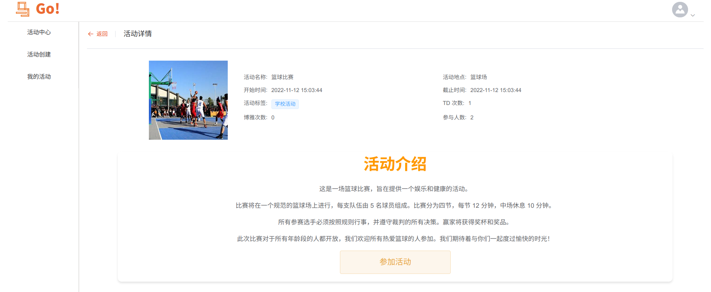

**相似活动推荐**

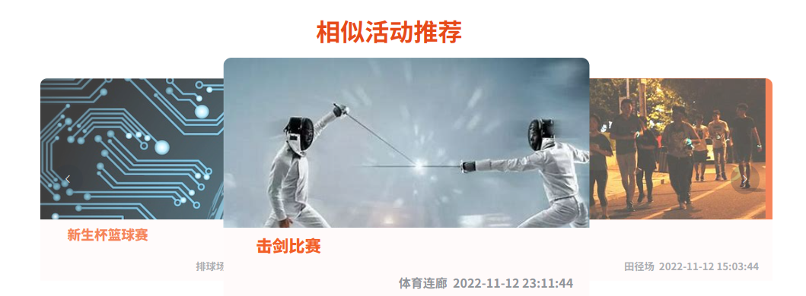

**信息**

- 活动图片，需要显示具体的图片
- 各种信息都需要
- 活动介绍：这个信息没有在“活动中心”界面显示，需要在这里显示。
- 相似活动：返回与当前活动“相似”的活动（信息内容与“活动中心”的一致）

**功能**

- 根据当前活动推荐相似活动
  - 利用一个函数来评价相似性
  - 比如说如果“地点，标签，时间，内容”类似，就被判定为相似活动
  - 相似活动只需要提供 3 个。

### 4.3.4 我的活动

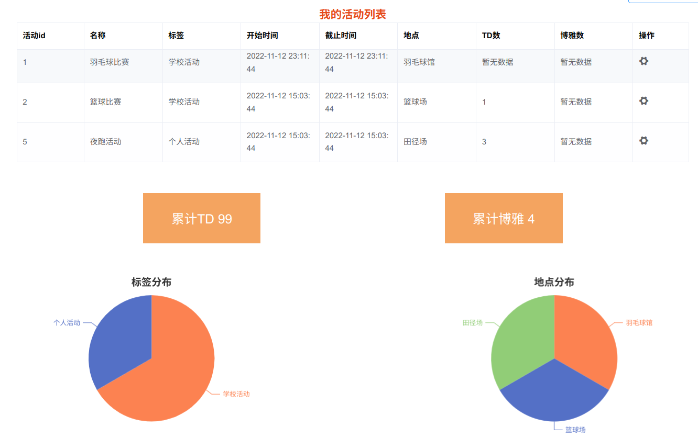

**信息**

- 学期选择器选择学期
- 活动列表根据学期选择器选择的学期展示活动，每个活动都有如上条目。
- 累计 TD，就是个数，累计博雅，也是个数
- 标签饼状图，刻画所选活动的标签的比例，比如说两个学院活动，一个个人活动，就是 66% 学院活动，33% 个人活动
- 地点饼状图

**功能**

列表里面有个“操作”条目，对于每个活动，都有如下两个操作

- 查看详情：跳转到具体的活动页面
- 退出活动：就是退出活动的意思。

## 4.4 个人信息

### 4.4.1 体育锻炼

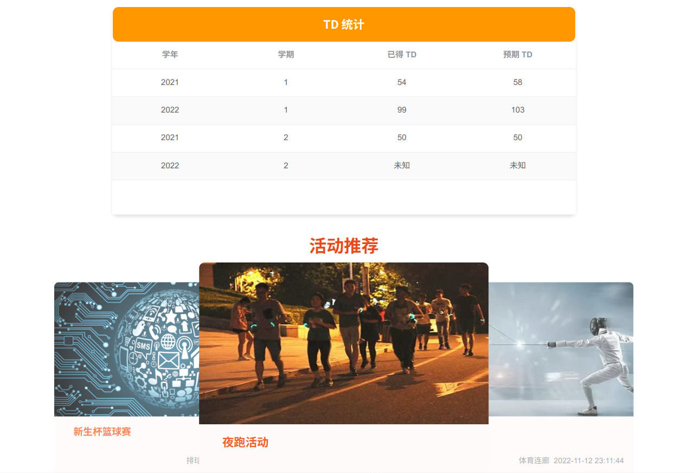

**信息**

- 上方是一个表单，里面有学年，已得 TD，预期 TD 三项
  - 已得 TD 指的是在活动截止时间计算的 TD
  - 预期 TD 是活动开始时间计算的 TD
- 底下是一个 TD 活动推荐

**功能**

- 可以推荐 TD 活动。

### 4.4.2 体测成绩

**体测成绩**

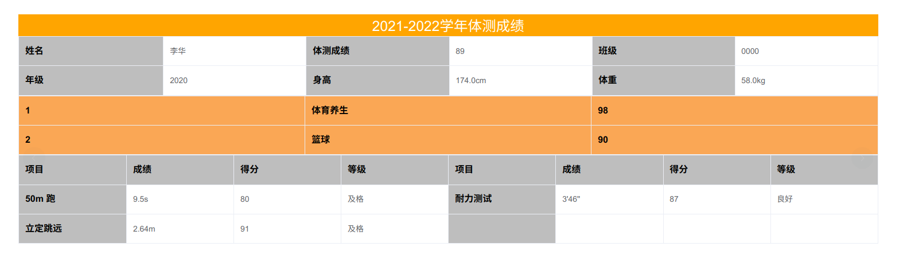

**排行榜**

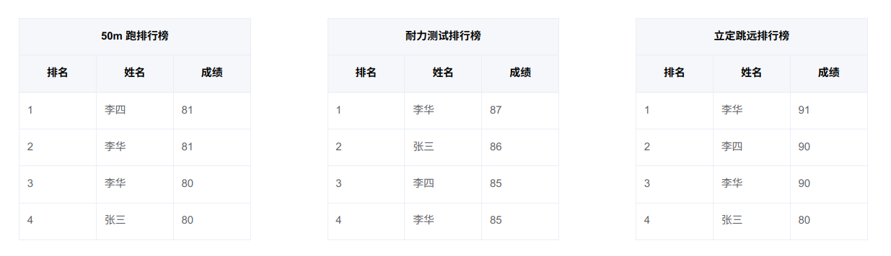

**信息**

- 上面的是体测成绩展示表单，具体的信息参考体测成绩表。
- 最下方是三个排行榜，排行榜包括排名，姓名，成绩三个表项。

## 4.5 管理端

### 4.5.1 课程名单

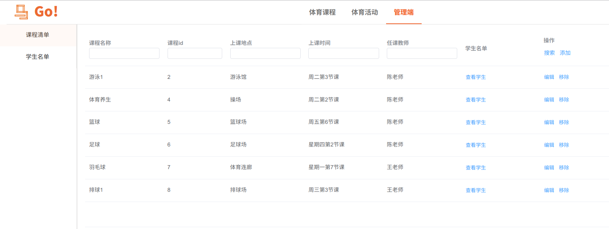

**功能**:

- 搜索：按列搜索，依然是模糊搜索。全部列都提供搜索操作。
- 编辑：利用一个对话编辑指定课程的信息，可以编辑的信息包括所有的列。
- 删除：可以删除学生信息，删除的时候要考虑后端信息。

### 4.5.2 学生名单

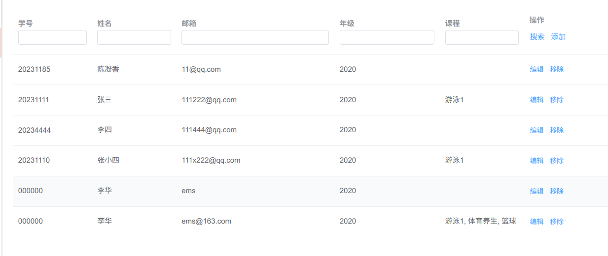

**功能**：

- 搜索：按列提供关于所有信息的模糊搜索，比如说 `203` 可以搜索出 `20373249, 20373250` 之类的。除了团队并不提供这个操作。前端可以提供输入的内容，还有在搜索啥，比如说“学号-““203””。
- 编辑：利用一个对话编辑指定学生的信息，可以编辑的信息包括所有的列。
- 删除：可以删除学生信息，删除的时候要考虑后端信息。

----


# 五、总结

现在时间是 2022 年 12 月 20 日，如果从 9 月份项目立项开始算起，Go走马已经是一个 4 个月大的宝宝了。这四个月里，我们仨人每周开一次组会，不定期的在群里讨论问题，互相吸取长处，一起解决困难，有了十足的进步。

在设计层面，给我印象最深的是**需求分析调研**。在做第一版作业的时候，我们没有太看重这个环节，但是后来发现之前的模型是没有办法让数据“流畅”的流通起来的，后来在第二版作业的时候，才开始认认真真去写设计文档，先是发调研文卷，然后整理调研结果，全组人一起线下讨论数据流图和 ER 图，正确消除功能上的缺憾，感觉第二版作业的完成度和完备性都要高于第一版，可以说最大的原因就是有了充分的调研和设计。

在功能层面，给我印象最深的是**推荐机制**的实现。当时在一次组会中，陶思远提到有没有办法让数据库中的数据被更多，更加有趣的使用。我想到如果只是让用户去使用数据，那么其实使用的方法十分单一，其方式其实取决于前端定义的方式。但是推荐机制并不是用户在使用数据，而是数据库应用在使用数据，他们通过分析数据库中的数据，提炼出有价值的信息，然后反馈给用户，这样的使用是我们之前没有想过的。但是正是因为先例很少，我们对于这个方向的工作一直没有很大的进展。后来是听郎老师上课，讲到她的实验室好像有一个课题就是关于数据分析的，然后我才意识到这个不是数据库的一个子功能，而是一个与数据库可以等量齐观的学问。之后有看了教材和课件上关于“数据仓库”的介绍，才对于这个功能有了一定的认识，之后有看了往届的设计实现报告里面的介绍，最终才实现了一个功能上说得过去的推荐机制。

在实现层面，给我印象最深的**数据库和后端在云端的部署**。这个涉及了很多我们之前学过的知识，比如说操作系统的权限，还有数据库的权限问题，还有一些我们没有学过的机制，比如说一些计网的知识，十分困难。当时我和陈凝香，在大运村的广场上一直捣鼓到不知道几点，就记得，当时连廊外的路灯十分像月亮。所幸最终的效果十分理想，我们的部署是自动化的，而且功能强大，在实验的后期，我们帮助了多个小组的同学解决了服务器租赁，部署，图床等问题，看到大家在我们的帮助下都能将自己的作品变得更好，我们感到十分的自豪。

一路走来，非常感谢老师和助教的帮助，我们还记得郎老师在下课后为我们解决问题，助教哥哥们在听了我们的中期汇报后给出了十分有建设性的建议，在开完会之后我们纠正了对于文件上传功能的执着，将设计和实现的焦点放在了与课程更加贴近的数据库设计和管理上，这才有了后面理论和实践相结合，知行合一的良好体验。在答疑的时候也帮我们解决过具体的问题。没有他们，我们走不到今天这一步。

最后放上我们的共同回忆留作纪念。


