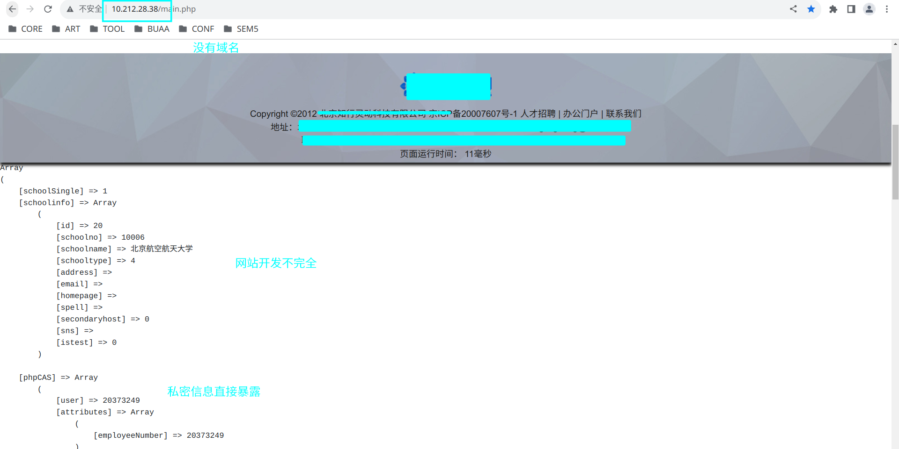
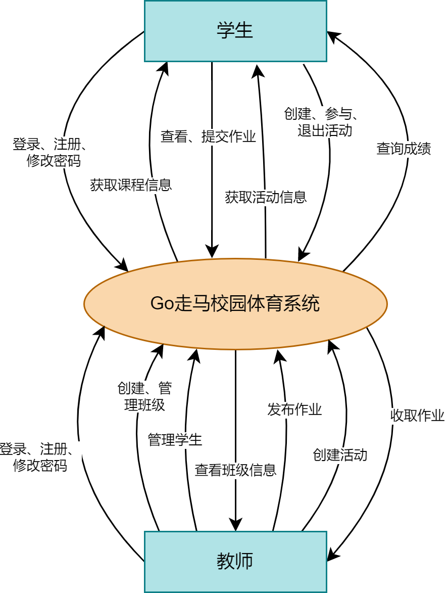
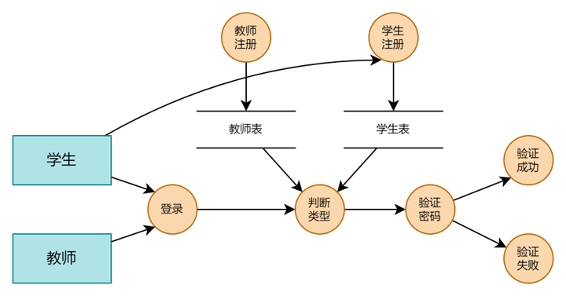
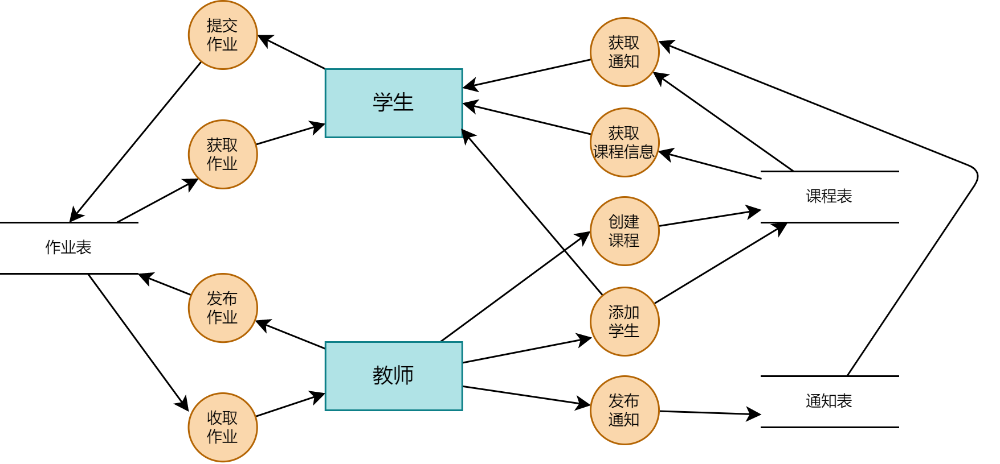
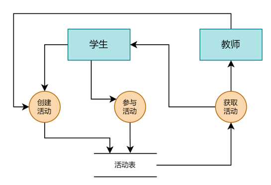
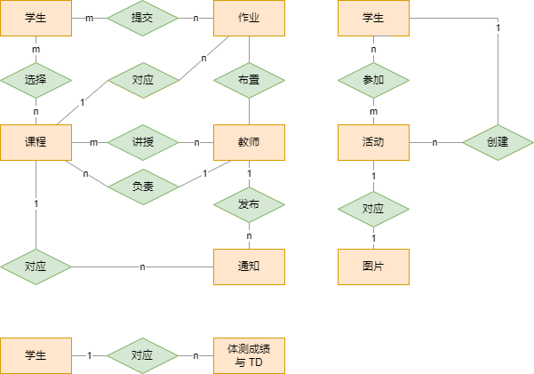
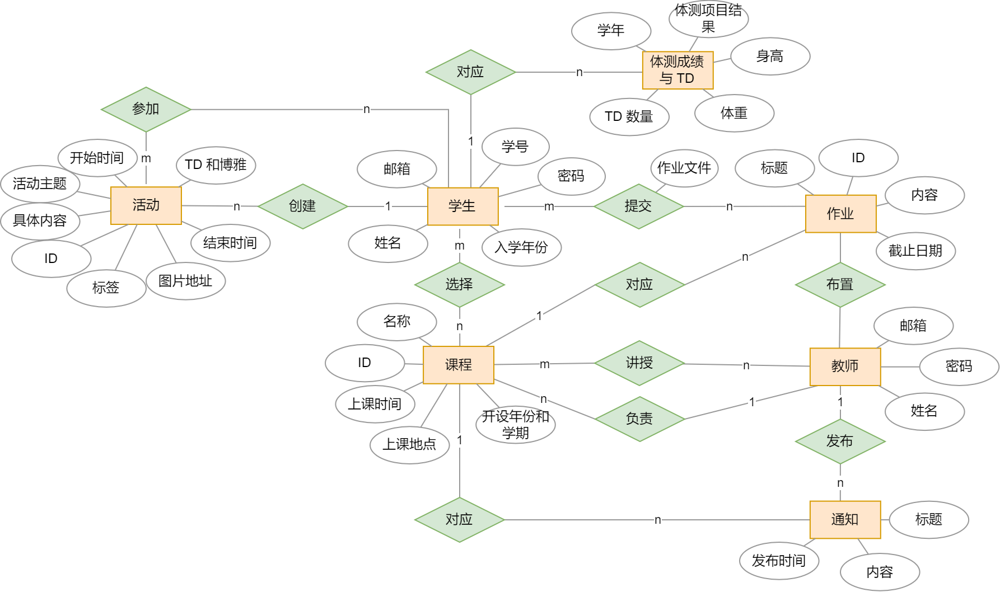

# 一、需求分析

## 1.1 需求描述

### 1.1.1 背景调研

第八次全国学生体质与健康调研结果显示，大学生体质下滑的问题，仍然没有得到有效遏制。高校体育如何从世界百年未有之大变局和中华民族伟大复兴战略全局中认识新机遇、洞察新挑战、顺应新变化？高校体育如何担起培养社会主义现代化强国的建设者和接班人的伟大使命？作为为祖国培养“健康工作七十年的红色工程师”的北京航空航天大学，应当以怎样的技术和平台来支持学生体育事业。这些问题都值得我们深入思考。

首先，应当意识到，高校体育是一个完整的生态闭环，体育课程，体育比赛，官方体育活动，社团活动等都是高校体育建设不可或缺的一部分。高校体育建设不应当仅仅局限于每周固定时长的体育课程，恰恰相反，他应当融入大学生的生活中。也就是构建“**立体化**”的高校体育体系，拓展大学体育课程体系的长度、宽度和高度。学校体育课程要为学生走向社会和未来生活做准备，让大学生掌握体育知识、运动技能并能运用于生活之中，保持健康的体魄，促进自己的全面发展，帮助大学生适应未来，引导大学生创造未来。

其次，建设高校体育离不开方法体系优化、技术手段革新。随着电子信息技术的发展，校园体育网站在北航的体育建设中发挥了举足轻重的作用，北航学生可以登录健康云查看自己的体育锻炼分数，也可以查看自己的体检报告；学校举办的运动会，也会在各个院系的公众号上宣发，同学们可以与通过与院系体育委员联系参加活动；对于体育部开展的活动，一般是以微信群的方式进行管理，比如说夜跑打卡活动和趣味运动会活动等。

但是，现有的高校体育信息管理存在以下不足，首先是信息管理分散化，冗余度高。学生需要在“博雅网站、健康云、微信群、公众号”等多个平台参加体育活动，这无疑提高了操作的复杂度，打击了同学们参加活动的积极性；其次，现有的体育系统开发简陋，数据不安全，更新不及时，存在多处“脚手架”情况出现（如下图所示）；再其次，现有功能并不完全支持高校体育建设需求，大量的功能依靠人力实现，这是由于现有系统的功能边界过于逼仄造成的。



正因如此，4H16B 团队希望开发一个需求集成，功能强大，数据安全的校园体育系统。多方位，立体化的支持北航的体育建设，这就是 Go 走马校园体育体系统的开发初衷。

### 1.1.2 用户画像

校园体育系统的用户主要有 4 种类型：

- 体育课程学生
- 体育课程老师
- 体育活动组织者
- 体育活动参与者

对此我们进行了初步的用户画像侧写，如下所示：


### 1.1.3 用户调研

对于学生需求，我们采用调查问卷的方式进行调查，部分调查问卷如下所示：


初步总结需求如下

| 体育课程学生                   | 体育课程老师         | 体育活动组织者   | 体育活动参与者     |
| ------------------------------ | -------------------- | ---------------- | ------------------ |
| 可以将所有课程集中在同一个网站 | 可以统一的收取作业   | 可以满足基本功能 | 有一个统一的平台   |
| 可以方便的提交作业文件         | 可以管理多个班级     | 场地冲突问题     | 可以向用户推荐活动 |
| 可以方便地查询分数             | 可以方便的发出通知   |                  | 可以寻找相似的朋友 |
| 可以知悉上课的时间地点         | 可以方便统计成绩     |                  |                    |
| 可以方便知道老师的通知         | 可以解决场地冲突问题 |                  |                    |

### 1.1.4 需求总结

经过上面的侧写分析和用户和背景调研，我们可以总结出需求如下：

对于**学生**：

1. 每个学期都需要加入所选课程的老师管理的班级。
2. 具有上传文件的权限，以方便每个学期上传作业和打卡资料。
3. 具有查询成绩和体测信息的权限。
4. 具有查询课程信息和课程公告的权限。

对于**老师**：

1. 具有管理多个班级的权限，可以方便的创建班级，填写班级的基本信息，发布课程公告，将同学拉入自己的班级。
2. 具有收取作业的权限，可以便捷的收取同学们上传的文件，同时统计作业收取情况。
3. 可以方便的管理成绩。

对于**活动参与者**

1. 具有参加活动的权限，可以方便的参加自己心仪的活动。
2. 具有浏览活动的权限，可以浏览所有的活动，并且查看具体的信息，以臻选自己心仪的活动。
3. 具有搜索和被推荐的权限，以便根据自己喜欢的关键词进行全局或局部搜索。
4. 具有管理自己活动的权限，可以浏览和退出自己已经参加的活动，并且获得关于这些活动的统计数据。

对于**活动组织者**：

1. 具有创建活动的权限，包括登记活动的基本信息，确定活动的奖励。
2. 管理参与活动的参与者。

此外，对于**数据库管理员**：

1. 具有管理课程的权限，可以检索，修改，增加，删除所有的课程信息。
2. 具有管理用户的权限，可以检索，修改，增加，删除所有的用户信息。

可见，Go走马 具有庞大的需求市场,具有光明的应用前景,开发该系统的价值性很高。且五种潜在用户的需求都十分明确, 开发该系统是切实可行的。

## 1.2 数据流图

### 1.2.1 总体数据流图



### 1.2.2 用户管理部分数据流图



### 1.2.3 课程部分数据流图



### 1.2.4 活动部分数据流图



## 1.3 数据元素表

### 1.3.1 用户管理部分

**学生表**

| 字段名称   | 数据类型    | 可否为空 | 说明     |
| ---------- | ----------- | -------- | -------- |
| email      | varchar(30) | NO       | 邮箱     |
| name       | varchar(10) | NO       | 姓名     |
| password   | varchar(20) | NO       | 密码     |
| student_id | varchar(8)  | NO       | 学生编号 |
| grade      | int         | NO       | 入学年份 |

**教师表**

| 字段名称 | 数据类型    | 可否为空 | 说明 |
| -------- | ----------- | -------- | ---- |
| email    | varchar(30) | NO       | 邮箱 |
| name     | varchar(10) | NO       | 姓名 |
| password | varchar(20) | NO       | 密码 |


### 1.3.2 课程管理部分

**课程表**

| 字段名称         | 数据类型    | 可否为空 | 说明                  |
| ---------------- | ----------- | -------- | --------------------- |
| id               | bigint      | NO       | 课程编号              |
| name             | varchar(40) | NO       | 课程名称              |
| time             | varchar(30) | NO       | 上课时间              |
| location         | varchar(30) | NO       | 上课地点              |
| manager_email_id | varchar(30) | NO       | 课程负责人邮箱        |
| semester         | int         | NO       | 课程开设学期（春/秋） |
| year             | int         | NO       | 课程开设学年          |

**学生选课表**


| 字段名称   | 数据类型    | 可否为空 | 说明     |
| ---------- | ----------- | -------- | -------- |
| c_id_id    | bigint      | NO       | 课程编号 |
| s_email_id | varchar(30) | NO       | 学生编号 |
| grade      | int         | YES      | 成绩     |

**教师-课程表**


| 字段名称   | 数据类型    | 可否为空 | 说明     |
| ---------- | ----------- | -------- | -------- |
| c_id_id    | bigint      | NO       | 课程编号 |
| t_email_id | varchar(30) | NO       | 老师编号 |

**作业表**

| 字段名称        | 数据类型     | 可否为空 | 说明           |
| --------------- | ------------ | -------- | -------------- |
| id              | bigint       | NO       | 作业编号       |
| ddl             | datetime(6)  | NO       | 作业截止日期   |
| content         | varchar(300) | NO       | 作业内容       |
| author_email_id | varchar(30)  | NO       | 作业发布者     |
| course_id_id    | bigint       | NO       | 作业对应的课程 |
| time            | datetime(6)  | NO       | 作业创建时间   |
| title           | varchar(30)  | NO       | 作业标题       |

**作业提交表**


| 字段名称          | 数据类型     | 可否为空 | 说明         |
| ----------------- | ------------ | -------- | ------------ |
| time              | datetime(6)  | NO       | 作业提交时间 |
| fileTitle         | varchar(100) | NO       | 文件名称     |
| fileContent       | varchar(100) | NO       | 文件所在地址 |
| homeworkId_id     | bigint       | NO       | 作业编号     |
| submitterEmail_id | varchar(30)  | NO       | 提交者邮箱   |

**通知表**

| 字段名称        | 数据类型      | 可否为空 | 说明           |
| --------------- | ------------- | -------- | -------------- |
| id              | bigint        | NO       | 通知编号       |
| time            | datetime(6)   | NO       | 通知时间       |
| content         | varchar(1000) | NO       | 通知内容       |
| title           | varchar(30)   | NO       | 通知标题       |
| author_email_id | varchar(30)   | NO       | 通知发布者     |
| course_id_id    | bigint        | NO       | 通知对应的课程 |

### 1.3.3 活动管理部分

**活动表**

| 字段名称     | 数据类型      | 可否为空 | 说明             |
| ------------ | ------------- | -------- | ---------------- |
| id           | bigint        | NO       | 活动编号         |
| content      | varchar(1000) | NO       | 活动内容         |
| title        | varchar(30)   | NO       | 活动标题         |
| position     | varchar(30)   | NO       | 活动地点         |
| create_time  | datetime(6)   | NO       | 活动创建时间     |
| start_time   | datetime(6)   | NO       | 活动开始时间     |
| end_time     | datetime(6)   | NO       | 活动结束时间     |
| author_email | varchar(30)   | NO       | 活动创建者邮箱   |
| tag          | varchar(30)   | NO       | 活动标签         |
| TD           | int           | NO       | 活动加的TD数量   |
| img_id       | bigint        | YES      | 活动图片         |
| BY           | int           | NO       | 活动加的博雅数量 |

**学生-活动表**

| 字段名称    | 数据类型    | 可否为空 | 说明                             |
| ----------- | ----------- | -------- | -------------------------------- |
| time        | datetime(6) | NO       | 活动参与时间                     |
| status      | varchar(2)  | NO       | 参与状态（未开始/已完成/已过期） |
| activity_id | bigint      | NO       | 活动编号                         |
| student_id  | varchar(30) | NO       | 学生编号                         |


### 1.3.4 个人信息部分

**学生-体测成绩表**


| 字段名称      | 数据类型     | 可否为空 | 说明         |
| ------------- | ------------ | -------- | ------------ |
| year          | int          | NO       | 学年         |
| tdSpring      | int          | YES      | 春季 td      |
| tdAutumn      | int          | YES      | 秋季 td      |
| examineResult | varchar(200) | NO       | 体测结果     |
| student_id    | varchar(30)  | NO       | 学生         |
| byAutumn      | int          | YES      | 秋季博雅     |
| bySpring      | int          | YES      | 春季博雅     |
| height        | double       | YES      | 学生身高     |
| score         | int          | YES      | 学生体测分数 |
| weight        | double       | YES      | 学生体重     |


---

# 二、数据库概念模式设计

## 2.1 系统初步 ER 图

### 2.1.1 实体 ER 图


### 2.1.2 关系 ER 图

下图分别为课程管理模块、活动模块、成绩查询模块对应的 ER 图。



## 2.2 系统基本 ER 图

分析系统初步 E-R 图，我们发现可以消除以下 1:1 联系：

* 活动与活动图片是 1:1 的关系，因此在实现的时候没有必要将活动图片作为一个单独的实体，将其作为活动的个一个属性即可。

合并并消除冗余之后得到的系统基本 ER 图有 7 个实体，如下图所示：



# 三、数据库逻辑模式设计

## 3.1 数据库关系模式

关系模式可以形式化表示为`R(U, D, DOM, F)`。U 为组成该关系的属性名，D为 U 中属性所来自的域，DOM 指的是属性与域的映射，F 指的是属性间的依赖关系集合。以下约定 N 表示正整数，FLOAT 表示浮点数，S 为任意字符组成的字符 S，T 表示时间，B 表示布尔值。码以下划线标识。

以下是由 ER 图得到的关系模式。

### 3.1.1 实体

1. **学生** 

   students({<u>邮箱</u>, 密码, 姓名, 学号, 年级}, D, DOM, F)

   D = {STR, N}

   DOM = {DOM(年级) = N, DOM(邮箱) = DOM(密码) = DOM(姓名) = DOM(学号) = STR}

   F = {邮箱→其他属性, 学号→密码, 学号→姓名, 学号→邮箱, 学号→年级} 

2. **教师**

   teachers({<u>邮箱</u>, 密码, 姓名}, D, DOM, F)

   D = {STR, N}

   DOM = {DOM(邮箱) = DOM(密码) = DOM(姓名) = STR}

   F = {邮箱→密码, 邮箱→姓名} 

3. **课程**

   courses({<u>ID</u>, 名称, 开设年份, 开设学期, 上课时间, 上课地点}, D, DOM, F)

   D = {STR, N}

   DOM = {DOM(ID) = DOM(开设年份) = DOM(开设学期) = N, DOM(名称) = DOM(上课地点) = DOM(上课时间) = STR}

   F = {ID→其他属性}

4. **活动**

   activities({<u>ID</u>, 活动主题, 具体内容, 标签, 开始时间, 结束时间, TD, 博雅}, D, DOM, F)

   D = {STR, N, T}

   DOM = {DOM(ID) = DOM(TD) = DOM(博雅) = N, DOM(活动主题) = DOM(具体内容) = DOM(标签) = STR,  DOM(开始时间) = DOM(结束时间) = T}

   F = {ID→其他属性}

5. **作业**

   homeworks({<u>ID</u>, 标题, 内容, 截止日期}, D, DOM, F)

   D = {STR, N, T}

   DOM = {DOM(ID) = N, DOM(标题) = DOM(内容) = STR,  DOM(截止时间) = T}

   F = {ID→其他属性}

6. **通知**

   notices({<u>ID</u>, 发布时间, 内容, 标题}, D, DOM, F)

   D = {STR, N, T}

   DOM = {DOM(ID) = N, DOM(标题) = DOM(内容) = STR,  DOM(发布时间) = T}

   F = {ID→其他属性}

7. **体测成绩与TD**

   examineResultAndTd({<u>学生email, 学年</u>, 累计 TD 数量, 体重, 身高, 体育项目结果}, D, DOM, F)

   D = {STR, N, F}

   DOM = {DOM(学年) = DOM(累计 TD 数量) = N, DOM(学生 email) = DOM(体育项目结果) = STR, DOM(身高) = DOM(体重) = F}

   F = {(学生email, 学年)→其他属性}

### 3.1.2 联系

约定以下函数依赖集合省略非主属性对码的完全函数依赖。

#### 3.1.2.1 多对多联系

1. **学生-课程**

   studentCourse({<u>student, course</u>, grade}, D, DOM, F)

   D = {STR, N}

   DOM = {DOM(student) = STR, DOM(course) = DOM(grade) = N}

   ***外码***：student 对应学生表的主码 student.email, course 对应课程表的主码 course.ID

2. **老师-课程**

   teacherCourse({<u>teacher, course</u>}, D, DOM, F)

   D = {STR, N}

   DOM = {DOM(teacher) = STR, DOM(course) = N}

   ***外码***: teacher 对应老师表的主码 teacher.email, course 对应课程表的主码 course.ID

3. **学生-活动**

   studentActivity({<u>student, activity</u>, time}, D, DOM, F)

   D = {STR, N, T}

   DOM = {DOM(student) = STR, DOM(activity) = N, DOM(time) = T}

   ***外码***：student 对应学生表的主码 student.email, activity 对应活动表的主码 activity.ID

4. **作业提交表**
   hwSubmission({<u>student, homework</u>, time, file}, D, DOM, F)

   D = {STR, N, T}

    DOM = {DOM(student) = STR, DOM(homework) = N, DOM(time) = T, DOM(file) = STR}

    ***外码***：student 对应学生表的主码 student.email, homework 对应作业表的主码 homework.ID


#### 3.1.2.2 一对多联系

   对于 1:n 联系，表的主码是 n 对应的实体。

1. **活动创建表**
   activityCreate({<u>activity</u>, student}, D, DOM, F)

   D = {STR, N}

   DOM = {DOM(activity) = N, DOM(student) = STR}

   ***外码***：activity 对应活动表的主码 activity.ID, student 对应学生表的主码 student.email

2. **学生-体测成绩和TD 对应表**
   studentExamineResultAndTd({<u>examineResultAndTd</u>, student}, D, DOM, F)

   D = {STR, N}

   DOM = {DOM(student) = STR, DOM(examineResultAndTd) = N}

   ***外码***：student 对应学生表的主码 student.email, examineResultAndTd 对应体测成绩和TD 表的主码 examineResultAndTd.ID

3. **课程-通知表**
   courseNotice({<u>notice</u>, course}, D, DOM, F)

   D = {N}

   DOM = {DOM(course) = DOM(notice) = N}

    ***外码***：course 对应课程表的主码 course.ID, notice 对应通知表的主码 notice.ID

4. **教师-通知表**
   teacherNotice({<u>notice</u>, teacher}, D, DOM, F)

    D = {STR, N}

    DOM = {DOM(teacher) = STR, DOM(notice) = N}

    ***外码***：teacher 对应教师表的主码 teacher.email, notice 对应通知表的主码 notice.ID

5. **教师-负责的课程表**
   managerCourse({<u>course</u>, teacher}, D, DOM, F)

    D = {STR, N}

    DOM = {DOM(teacher) = STR, DOM(course) = N}

    ***外码***：teacher 对应教师表的主码 teacher.email, course 对应课程表的主码 course.ID

6. **课程-作业表**
   courseHomework({<u>homework</u>, course}, D, DOM, F)

    D = {N}

    DOM = {DOM(course) = DOM(homework) = N}

    ***外码***：course 对应课程表的主码 course.ID, homework 对应作业表的主码 homework.ID

7. **教师-作业表**
   teacherHomework({<u>homework</u>, teacher}, D, DOM, F)

    D = {STR, N}

    DOM = {DOM(teacher) = STR, DOM(homework) = N}

    ***外码***：teacher 对应教师表的主码 teacher.email, homework 对应作业表的主码 homework.ID


## 3.2 关系模式范式等级的判定与规范

   分别对上述表进行范式等级判断，然后将未达到 3NF 的表规范到 3NF。

   ### 3.2.1 实体

1. **学生** 

   students({<u>邮箱</u>, 密码, 姓名, 学号, 年级}, D, DOM, F)

   F = {邮箱→其他属性, 学号→密码, 学号→姓名, 学号→邮箱, 学号→年级} 

   对于学生表，邮箱是主码，学号是一个候选码，满足对于所有函数依赖 $X\rightarrow Y$ ，X 都是码，所以学生表 $\in BCNF$ ，学生表 $\in 3NF$ 。

2. **教师**

   teachers({<u>邮箱</u>, 密码, 姓名}, D, DOM, F)

   F = {邮箱→密码, 邮箱→姓名} 

   对于该表，非主属性仅仅依赖于唯一的主码，因此属于 BCNF，也属于 3NF。

3. **课程**

   courses({<u>ID</u>, 名称, 开设年份, 开设学期, 上课时间, 上课地点}, D, DOM, F)

   F = {ID→其他属性}

   对于该表，所有函数依赖左端都是主码，所以属于 BCNF，因此也属于 3NF。

4. **活动**

   activities({<u>ID</u>, 活动主题, 具体内容, 标签, 开始时间, 结束时间, TD, 博雅}, D, DOM, F)

   F = {ID→其他属性}

   对于该表，所有函数依赖左端都是主码，所以属于 BCNF，因此也属于 3NF。

5. **作业**

   homeworks({<u>ID</u>, 标题, 内容, 截止日期}, D, DOM, F)

   F = {ID→其他属性}

   对于该表，所有函数依赖左端都是主码，所以属于 BCNF，因此也属于 3NF。

6. **通知**

   notices({<u>ID</u>, 发布时间, 内容, 标题}, D, DOM, F)

   F = {ID→其他属性}

   对于该表，所有函数依赖左端都是主码，所以属于 BCNF，因此也属于 3NF。

7. **体测成绩与TD**

   examineResultAndTd({<u>学生email, 学年</u>, 累计 TD 数量, 体重, 身高, 体育项目结果}, D, DOM, F)

   F = {(学生email, 学年)→其他属性}

   对于该表，所有函数依赖左端都是主码，所以属于 BCNF，因此也属于 3NF。

### 3.2.2 联系

约定以下函数依赖集合省略非主属性对码的完全函数依赖。

#### 3.2.2.1 多对多联系

1. **学生-课程**

   studentCourse({<u>student, course</u>, grade}, D, DOM, F)

   F = {(student, course)→grade}

   对于该表，所有函数依赖左端都是主码，所以属于 BCNF，因此也属于 3NF。

2. **老师-课程**

   teacherCourse({<u>teacher, course</u>}, D, DOM, F)

   所有属性都是主码，因此属于 3NF，主属性之间不存在函数依赖，因此属于 BCNF。

3. **学生-活动**

   studentActivity({<u>student, activity</u>, time}, D, DOM, F)

   F = {(student, activity)→time}

   对于该表，所有函数依赖左端都是主码，所以属于 BCNF，因此也属于 3NF。

4. **作业提交表**
   hwSubmission({<u>student, homework</u>, time, file}, D, DOM, F)

   F = {(student, homework)→time, (student, homework)→ file}

   对于该表，所有函数依赖左端都是主码，所以属于 BCNF，因此也属于 3NF。

#### 3.2.2.2 一对多联系

   对于 1:n 联系，表的主码是 n 对应的实体。在具体实现的时候可以将 n 对应的实体表和联系表合并，不会影响范式等级。

1. **活动创建表**
   activityCreate({<u>activity</u>, student}, D, DOM, F)

   F = {activites→student}

   函数依赖左端仅包含主码，不存在传递函数依赖和部分函数依赖，因此属于 BCNF，也属于 3NF。

2. **学生-体测成绩和TD 对应表**
   studentExamineResultAndTd({<u>examineResultAndTd</u>, student}, D, DOM, F)

   F = {examineResultAndTd→student}

   函数依赖左端仅包含主码，不存在传递函数依赖和部分函数依赖，因此属于 BCNF，也属于 3NF。

3. **课程-通知表**
   courseNotice({<u>notice</u>, course}, D, DOM, F)

   F = {notice→course}

   函数依赖左端仅包含主码，不存在传递函数依赖和部分函数依赖，因此属于 BCNF，也属于 3NF。

4. **教师-通知表**
   teacherNotice({<u>notice</u>, teacher}, D, DOM, F)

   F = {notice→teacher}

   函数依赖左端仅包含主码，不存在传递函数依赖和部分函数依赖，因此属于 BCNF，也属于 3NF。

5. **教师-负责的课程表**
   managerCourse({<u>course</u>, teacher}, D, DOM, F)

   F = {course→teacher}

   函数依赖左端仅包含主码，不存在传递函数依赖和部分函数依赖，因此属于 BCNF，也属于 3NF。

6. **课程-作业表**
   courseHomework({<u>homework</u>, course}, D, DOM, F)

   F = {homework→course}

   函数依赖左端仅包含主码，不存在传递函数依赖和部分函数依赖，因此属于 BCNF，也属于 3NF。

7. **教师-作业表**
   teacherHomework({<u>homework</u>, teacher}, D, DOM, F)

   F = {homework→teacher}

   函数依赖左端仅包含主码，不存在传递函数依赖和部分函数依赖，因此属于 BCNF，也属于 3NF。

## 3.3 数据库设计优化

### 3.3.1 索引优化

   对于所有的表，我们都建立了主码的索引，因为大多数查询是基于主码进行的。

   对于学生表，由于除了通过邮箱（主码）查询学生信息，还可能通过学生学号进行查询，索引我们在学生学号上建立了唯一索引，以便于通过学号查询学生信息。

```sql
 create unique index student_id on tb_students(student_id); 
```

   对于关系表，同样以其主码为索引，同时对于经常需要查询的字段，也建立了索引。例如对于学生-活动表，我们用以下语句分别建立了 (学生, 活动)索引，学生索引，活动索引，以便于查询学生参加的活动，活动的参加学生，以及学生是否参加了某个活动。

```sql
create unique index SA on tb_student_activity(student_id, activity_id); 

create index student_id on tb_student_activity(student_id);

create index activity_id on tb_student_activity(activity_id);
```

   其余的索引建立语句基于以上原则，由于篇幅原因这里不再列出。

### 3.3.2 使用外键

   使用外键来保证数据的关联性并提高访问速度，同时在使用过程中保证数据的参照完整性。在本项目的后端数据库中，各表具有完备的外键联系，通过遵循这种外键关系进行实际数据库的建立，将从逻辑的角度保证数据库的设计功能能够完全正确执行到位。

### 3.3.3 优化查询语句

   可以优化的地方有如下几点：

* 在大多数情况下，联表查询比嵌套查询更有效，因此能使用联表查询的地方尽可能使用联表查询比较高效

* 尽可能不将查询语句放在循环内也是一种优化的方法

* 避免在查询中使用复杂的函数以及 LIKE 关键词也是一种优化方法

  通过使用较好的 ORM 框架可以解决以上问题。

### 3.3.4 合并相同主码的表

   对于主码相同的表，可以在设计的时候将其合并，例如将*活动创建表*和*活动表*合并，直接将活动的创建人和创建时间存入*活动表*，这样做的好处是在同时需要查询两个表中的数据时，减少了一次连接操作，提高效率。


### 3.3.5 严格约束加入数据库的数据

   通过建表时添加约束、用触发器实现约束等方法，严格约束对数据库的增删操作，避免将异常数据插入数据表。

* 建表时可以添加的约束有主键约束、UNIQUE 约束、外码约束等。
* 用触发器可以更灵活的实现想要的约束，例如检查某个整数的取值在一定范围内。
