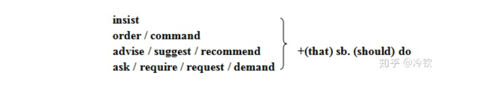

## 一、非真实条件句

### 1.1 基础和时态

时态如下所示：

| 类型           | 从句                         | 主句                                       |
| -------------- | ---------------------------- | ------------------------------------------ |
| 与过去事实相反 | had done                     | (should / would / could / might) have done |
| 与现在事实相反 | did / were                   | (should / would / could / might) do        |
| 与将来事实相反 | did / were to do / should do | (should / would / could / might) do        |

> 之前我学习的时候，总是痴迷于**时态回退**这种概念，最后绕来绕去把自己绕晕，今天看了看，发现似乎直接死记硬背要更加容易一些。

示例

```c
/* 过去事实相反 */
"You would not have caught a cold if had put on more clothes."
// 如果你多穿一些依附，就不会着凉了

/* 与现在事实相反 */
"If I were you, I would reconsider their advice."
// 如果我是你，我会重新考虑他们的意见
    
/* 与将来事实相反 */
"If I (were to / should) do it, I would do it in different way."
// 如果我来做这件事，我会以一种不同的方式去做
```

### 1.2 条件从句的倒装

> 是一个小点，记录一下。

在非正式文体中，如果 If 条件句中有助动词 were / should / had 可将其提于主语之前（位于句首），再把 If 省掉，即形成部分倒装。

```c
// 如果我是你 ...
"If I were you ..." = "Were I you ..."

// 如果要不是 ...
"If it were not for ..." = "Were it not for ..."

// 如果当时要不是 ...
"If it had not been for ..." = "Had it not been for ..."
```

### 1.3 错综时间条件句

“错综时间”指的是如果条件和推论发生在不同的时间，那么应当挑选不同的时态，是一个十分好理解的概念，如下所示：

```c
/* 从句指过去，主句指现在 */
"If the weather had been more favorable, the crops would be growing still better."
// 如果天气再好一些，庄稼的收成会更加好一些

/* 从句指现在，主句指过去 */
"If I were you, I would have taken his adivise"
// 如果我是你，那么我会听取他的建议
```

### 1.4 含蓄虚拟条件句

指的是条件从句不在以 “if” 的形式出现，而是转变成了 “but for（若不是）/ without / under ”，这个时候只需要选择主句的时态即可，如

```c
// If you hadn't helped me, I wouldn't have passed the exam. 
"Without your help, I wouldn't have passed the exam." 
"But for your help, I wouldn't have passed the exam."
```

有些时候有些标志词会用于修饰主句，这时条件句会变成某种意义上的独立句子，如 “/ otherwise / but /  or / but that（若不是）”

```c
// If I had your phone number, I would have called you back.
I don't have your phone number, (otherwise / or) I would have called you back 
```

---


## 二、Wish

wish 从句表示一种与现实不符合的愿望，其从句时态如下

| 类型           | 从句时态                   |
| -------------- | -------------------------- |
| 与过去事实相反 | had done                   |
| 与现在事实相反 | did / were                 |
| 与未来事实相反 | (could / would / might) do |

示例如下：

```c
/* 与过去相反的愿望 */
"I wish I had seen the film."

/* 与现在相反的愿望 */
"I wish I were a bird."

/* 与将来相反的愿望 */
"I wish you would do that again."
```

---


## 三、As (if / though)

as if / as though 的意思相同，就表示“好像是，就好像是”的意思，可以用在表语从句或者是状语从句中，一般表示一种不太可能发生的东西，如果是一种可能性大的，可以不用虚拟语气。

其规则如下：

| 类型           | 从句时态                   |
| -------------- | -------------------------- |
| 与过去事实相反 | had done                   |
| 与现在事实相反 | did / were                 |
| 与未来事实相反 | (could / would / might) do |

> 也就是与 wish 一样，此时的从句并不太受主句时态的约束（我现在理解并不受）。

示例如下：

```c
/* 过去 */
"He acts as if he had been abroad."

/* 现在 */
"They treat me as though I were a stranger."
```

---


## 四、If only 条件句

If only 常用感叹的形式，表示强烈的不满，遗憾或愿望，主句常省略，意为：“要是/如果......该多好啊/就好了！”，注意：“only if ...”意为：“只要......”，位于句首时采用部分倒装。）

| 类型           | 从句时态                   |
| -------------- | -------------------------- |
| 与过去事实相反 | had done                   |
| 与现在事实相反 | did / were                 |
| 与未来事实相反 | (could / would / might) do |

示例如下：

```c
"If only I could see him once more!"
// 我要是再见到他就好了！

"If only we had telephoned him in advance!"
// 要是事先给他打个电话就好了！
```

---


## 五、假设条件句

包括 supposing  / suppose / provided / providing / what if 这一类，都表示“假如，假定”的意味，引导一个条件从句，这种有的时候也舍弃主句，其时态如下

| 类型           | 从句时态   |
| -------------- | ---------- |
| 与过去事实相反 | had done   |
| 与现在事实相反 | did / were |
| 与未来事实相反 | did / were |

示例如下：

```c
"(supppose / supposing) we told her the truth."
// 假定我们把事情的真相告诉她。

"What if you came tomorrow instead of today."
// 如果我是你明天来而不是今天来呢？
```

--


## 六、宁愿条件句

(had / would) (sooner / rather) + that... 从句中意为“宁愿“。其时态如下

| 类型           | 从句时态   |
| -------------- | ---------- |
| 与过去事实相反 | had done   |
| 与现在事实相反 | did / were |
| 与未来事实相反 | did / were |

其示例如下：

```c
"She will get home at dinner time, but I would rather she got home a little earlier."
    
"He got drunk last night. I'd rather he hadn't drunk so much."
```

---


## 七、名词性从句



其示例如下

```c
"The teacher suggested that we (should) make good use of every minute."

"He ordered that all the book (should) be sent at once."

"She insisted that she (should) go to the south for her holiday."
```

需要注意的是，并不是的动词都指向了虚拟语句，他有可能指向事实。

---


## 八、形容词性从句

即如下句型

```c
"It's (high / about / the very / quite) time that ... "
```

这样的后面可以跟 should do / did 并没有明显区别。
