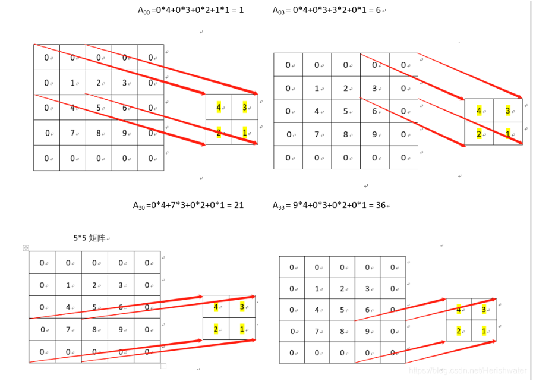
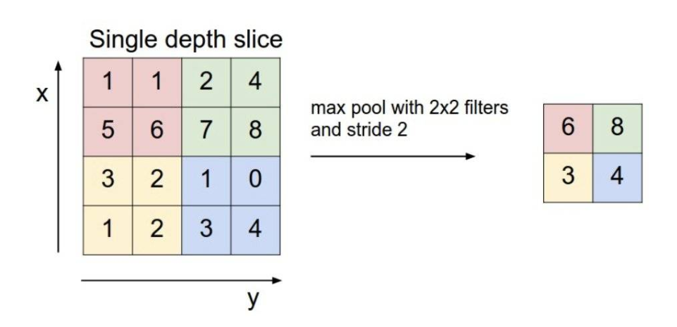
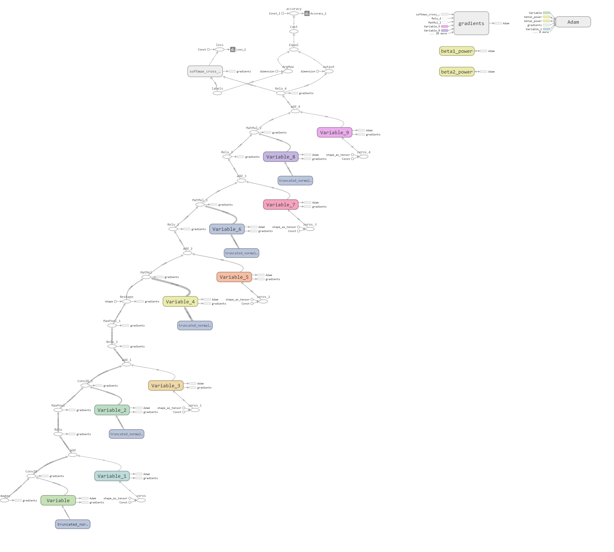
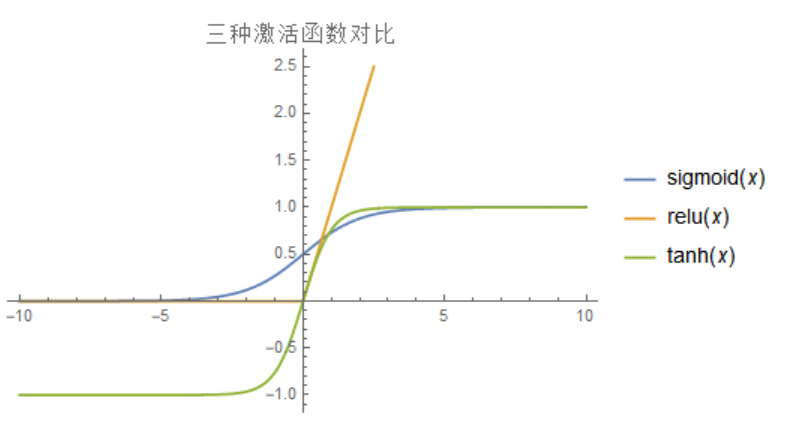
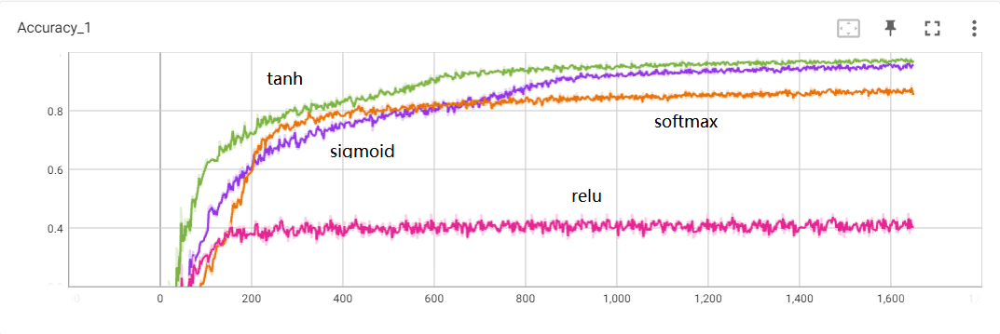

## 一、感受

这次作业的神经网络是比上一次作业复杂的，上一次作业是“多层感知机（MLP）”，这一次的作业是“卷积神经网络（CNN）”。运算从原来的矩阵乘法变成了卷积，网络结构也更加复杂，所以这次的作业是允许使用框架的。

这次作业的难点本质上是对于卷积网络的理解上，TensorFlow 可以提供卷积的计算方式还有后窥修正，所需要书写的只是网络结构。次难点是 TensorFlow 的工作机理，其实一开始做的时候如果能对 TensorFlow 有一个好的理解，写起来大概 40 分钟就够了（但是学习上面这俩东西花了整整一天）。

---


## 二、卷积神经网络

### 2.1 卷积层

卷积运算利用一个输入矩阵和一个卷积核进行运算，卷积核会在输入矩阵上运动，然后每次都进行与输入矩阵的点对点的乘法（数学上还需要旋转卷积核 180 度，但是实现的时候不需要，因为反正也是随机的），大概如下：



关于卷积为啥要比普通的矩阵乘法（线性变化）要更加优异，我的同学说过，卷积会重复的利用输入矩阵中的信息，而且每个信息的贡献是不等的，边缘的贡献会小一些，而且卷积核这种东西本身的权重就很有灵性，而且可能有更好的数学理论支持。

如果再细说，确实感知机模型在数学上是可以完成拟合的，本质类似于用多项式模拟函数。但是这会导致训练数据集的很大，这是因为本来这件事情就是很困难的事情，但是复杂的神经网络会加入一些假设，正是由于这些假设，导致了我们可以用很小的数据集训练出很高准确率的网络。

以卷积神经网络为例，对于普通的感知机，如果想识别人脸，需要“人脸出现在图片中央，人脸出现在图片角落，人脸出现在图片次中心”等一系列数据，但是卷积神经网络就没有这个限制，卷积的计算方法会天然就可以将这些情况考虑进去。

不同的神经网络有不同的特性，对应不同的假设，如

- RNN: 时间点和时间点是相关的
- CNN: 图片相邻的像素是相关的
- Encoder-Decoder: 一个图片的信息可以压缩
- UNet: 浅层神经网络对图像边界的理解比深层神经网络好
- Dropout: 数据噪声没有意义
- 各种 attention: 图片某些位置要仔细看
- 各种 context: 图片中全局的信息很重要

不过卷积的特性就是，乘法运算的次数会大大增加（一个输入元素被算了不止一遍），所以才需要池化层和硬件加速器。

### 2.2 池化层

池化是为了减少卷积输入矩阵的大小而存在的，其基本原理如下：



对于一个输入矩阵，我们用一个视窗在上面移动，然后从每个视窗中用某种方法获得一个值，然后输出成输出矩阵的一个元素，上图采用的方法是在视窗中挑一个最大的元素当输出，所以叫做 max pool，常用的还有 avg pool ，是取平均值的意思。

经过池化处理，矩阵会变小，其功能有：

- 抑制噪声，降低信息冗余
- 提升模型的尺度不变性、旋转不变形
- 降低模型计算量
- 防止过拟合

需要强调的是，视窗的移动不一定不覆盖，如下图所示


### 2.3 其他概念

那个移动的视窗也被叫做**滤波器（filter）**，每次移动的步幅叫做**步长（stride）**，另外在卷积中，为了保证输入矩阵和输出矩阵的大小不发生变化（或者可控的变化），我们有在输入矩阵边缘**补零（padding）**的操作。正如多层感知机会有一个 b 的值在完成线性映射后，卷积神经网络也是有这样的值的，我们称之为**偏置单元（bias）**

---


## 三、LeNet

### 3.1 总论

LeNet 是一个经典的卷积网络，有神经网络界的 “Hello, world” 之称，所以网上资料还是很多的。可以大量的查阅资料。

### 3.2 输入

虽然在经典的这张图中，一张图片的大小事 `32 x 32` 的，但是实际在 `mnist` 数据集中，一张图片的大小是 `28 x 28` ，所以可以采用 padding 补零的方法让后续操作不太改变。


通过给定的输入处理函数，我们最终会获得 3 个四维的张量，分别是训练集（train），验证集（validation），测试集（test）。其四个维度为 `[batch, height, width, channel]` ，其中 `batch` 为批量之意，在这里是图片数，这里我们的训练集的 `batch` 为 55000， 验证集的 `batch` 为 5000，测试集的 `batch` 为 1000	，`height, width` 是图片的高和宽，这里均为 28 ，`channel` 是通道之意，因为是黑白照片，所以 `channel = 1` 恒成立（如果是 RGB 彩色图片，则 `channel = 3`）。

### 3.3 Conv1

卷积层的搭建需要用到 TensorFlow 中的函数，如下示例

```python
tf.nn.conv2d(input, filter, strides, padding)
```

其中 `input` 为输入的四维张量，很好理解。

`filter` 是卷积核的参数，为一个 4 维张量（不是 4 元素向量），每一维格式如下 `[长，宽，输入通道数，深度]` 。输入通道数应当与 input 的通道数相同，这里是 1，深度（输出通道数）自定，我们这里需要 6 张图（和上面一样，所以为 6），最终代码如下

```python
# 5 * 5 采样窗口，6 个卷积核从 1 个平面抽取特征
conv1_w = self.init_weight([5, 5, 1, 6])
```

上述代码说明了我们生成了 5 x 5 的输出 6 通道的卷积核（本质应该是 6 个二维矩阵作为卷积核）。

因为最后有 6 张图，所以我们需要 6 个偏置单元

```python
conv1_b = self.init_bias([6])
```

和感知器一样，我们需要选择一个激活函数，我们选择 `relu` ，这个的选择后面会有讨论

```python
conv2_h = self.relu(self.conv2d(pool1_h, conv2_w), conv2_b)
```

其中的 `self.conv2d` 是这样的

```python
    def conv2d(x, W):
        """
        param x: input tensor of shape [batch, in_height_, in_weight, in_channels]
        param W: filter tensor of shape [filter_height, filter_width, in_channels, out_channels]
        return: 一组卷积核
        """
        # strides 是步长的意思，是 strides[1] 代表 x 方向的步长，strides[2] 代表 y 方向的步长
        # padding 即补齐方式，SAME 不会造成输出的矩阵变小（卷积的自然情况），valid 会
        return tf.nn.conv2d(x, W, strides=[1, 1, 1, 1], padding='SAME')
```

关于步长和补齐，有


其中 `stride` 作为一个四元数组，`stride[0], stride[3] = 1` 是常态，这里采用 `padding = 'SAME'` 的操作，就是为了适应图片是 `28 x 28` 的特殊性。

设输入图像尺寸为 W，卷积核尺寸为 F，步幅为 S，Padding 使用 P，则经过卷积层或池化层之后的图像尺寸为（W-F+2P）/ S + 1

- 如果参数是 `SAME`，那么计算只与步长有关，直接除以步长 W / S (除不尽，向上取整)
- 如果参数是 `VALID`,那么计算公式如上：(W – F + 1)  /  S （结果向上取整）

经过这一层，一张图片被转换成了 6 张 `28 x 28` 的 feature map。

### 3.4 Pool1

池化层的标准都比较统一，有代码

```python
pool1_h = self.max_pool(conv1_h)
def max_pool(x):
    """
    返回一组池化核
    """
    # ksize [1,x,y,1] x,y 为池化窗口大小
    return tf.nn.max_pool(x, ksize=[1, 2, 2, 1], strides=[1, 2, 2, 1], padding='SAME')
```

可以看到我们用到的池化层都是每 `2 x 2` 的窗口中取最大值，然后紧密但是无覆盖的遍历的，并且有补齐操作。这就导致经过池化层后，输入的高和宽都会变为原来的 $\frac12$ 。

经过这一层，6 张 `28 x 28` 的 feature map 变成了 6 张 `14 x 14` 的 feature map。

### 3.5 Conv2

```python
# 5 * 5 采样窗口，16 个卷积核从 6 个平面抽取特征
conv2_w = self.init_weight([5, 5, 6, 16])
conv2_b = self.init_bias([16])
conv2_h = self.relu(self.conv2d(pool1_h, conv2_w), conv2_b)
```

结构与 Conv1 类似。

经过这一层， 6 张 `14 x 14` 的 feature map 变成了 16 张 `14 x 14` 的 feature map。这里再次与官方的图发生了差异，这是因为原有代码这里肯定没有 padding，但是我 padding 了（使用了课程组提供的函数）。

### 3.6 Pool2

结构与 Pool1 类似

```python
# layer 4 construct the pool2
pool2_h = self.max_pool(conv2_h)
```

经过这一层，16 张 `14 x 14` 的 feature map 变成了 16 张 `7 x 7` 的 feature map。

### 3.7 Flatten

我们需要在这里加装一个多层感知机，所以第一步是将原来的四维张量（注意，我们讨论的时候只说了后三维，第一维是图片个数，比较朴素）展成二维张量（其实本质是一维，第一维依然是图片个数），如下实例

```python
# 第四步得到的结果拉伸为 1 个一维向量，其长度为 7 ∗ 7 ∗ 16 = 784
pool2_h_flat = tf.reshape(pool2_h, [-1, 7 * 7 * 16])
```

其中 `reshape` 的用法与 `numpy` 库类似，`-1` 代表缺省，需要根据其他维度进行计算。

经过这一层，我们得到了 `784` 的一维输入。

### 3.8 Fc1

```python
fc1_w = self.init_weight([7 * 7 * 16, 120])
fc1_b = self.init_bias([120])
# matmul 是矩阵乘法的意思
fc1_h = self.relu(tf.matmul(pool2_h_flat, fc1_w), fc1_b)
```

这里用 TensorFlow 的形式重新搭建了一遍，感觉十分新奇。

经过这层，`784` 个输入节点转换成了 `120` 个隐层节点。可以说从这里开始，又与标准的 LeNet 重合了。

### 3.9 Fc2

与 Fc1 结构类似

```python
fc2_w = self.init_weight([120, 84])
fc2_b = self.init_bias([84])
fc2_h = self.relu(tf.matmul(fc1_h, fc2_w), fc2_b)
```

经过这一层，`120` 个隐层节点转换成了 `84` 个隐层节点。

### 3.9 Fc3

与 Fc1 结构类似

```python
# output layer
fc3_w = self.init_weight([84, 10])
fc3_b = self.init_bias([10])
fc3_h = tf.nn.sigmoid(tf.matmul(fc2_h, fc3_w) + fc3_b)  # 输出层使用 sigmod 作为激活函数输出
```

这层的特殊之处在于激活函数换成了 `sigmoid` ，这个效果要远好于 `rellu`。

经过这一层，`84` 个隐层节点变成了 `10` 个输出节点。

---


## 四、TensorFlow

### 4.1 张量 Tensor

张量就是多维矩阵的意思，从上面的分析可知，LeNet 用 TensorFlow 实现是很恰当的。

### 4.2 Session 和 Computational Graph

对于 TensorFlow，我们大量的运算（看似的运算），其实不是在运算，而是在写一个运算结构，比如说我们搭建的神经网络，其实上面写的东西，并没有实际运算，而是搭建成了这样的一个网络



是一个像表达式树的东西，我们需要利用“对话（session）” 来运行这个结构。

> 计算图包含**数据**（data，也就是各种Tensor）和**操作**（operation）。一个模型中的每一个数据或者操作都是图中的一个节点，箭头代表了数据流动的方向。上文提到的用Session计算的过程实际上就是数据流经整个图，计算出每一个节点的数值。

### 4.3 数据类型

#### 4.3.1 类型需求

对于一个模型，大致有这样几种数据类型需求：

- 可更新的参数：包括权重（weights），偏置项（bias）。这些参数将在训练过程中不断更新。
- 独立于模型存在的数据：数据集中的数据需要“喂给”网络，包括输入数据、输出端的数据（输出的数据会用于反馈）。这个过程就像数学课本中给函数f(x)求值的过程，给x不同的值，求得不同的结果。可以想见，我们需要一个类似“容器”的对象，每次将数据放进去，然后计算整幅计算图。
- 常量。
- 操作符。

因此，我们有了这样的几种数据：

#### 4.3.2 Variable

变量”是可以在程序运行过程中被改变的量，因此**模型中的权重、偏置项等均使用此类型**。从代码中可以看到，是这样的

```python
@staticmethod
def init_weight(shape):
    """
    Init weight parameter.
    shape 是一个元组，用于描述矩阵的维度
    """
    w = tf.random.truncated_normal(shape=shape, mean=0, stddev=0.1)
    return tf.Variable(w)

@staticmethod
def init_bias(shape):
    """
    Init bias parameter.
    偏置单元（bias unit），在 y = wx + b中，b 表示函数在 y 轴上的截距，控制着函数偏离原点的距离
    """
    b = tf.zeros(shape)
    return tf.Variable(b)
```

需要注意的是，`Variable` 有一个初始化的过程，也就是 `tf_mnist.py` 中的这个代码

```python
sess.run(tf.global_variables_initializer())
```

#### 4.3.3 Placeholder

这个就是前面说的类似“容器”的对象，顾名思义，占位符就是先在模型中”占位“，至于这个位置填入的数值，在Session运行的时候再指定。我们的输入是 Placeholder

```python
images = tf.placeholder(dtype=tf.float32, shape=[None, 28, 28, 1], name='images')
labels = tf.placeholder(dtype=tf.float32, shape=[None, 10], name='labels')
```

对于这种容器，我们需要在运行的时候“投喂”他，也就是这里的代码

```python
_, loss, loss_summary = sess.run([training_operation, loss_operation, merge_summary],
                                             feed_dict={images:batch_train_images,labels:batch_train_labels})
```

#### 4.3.4 Operator

这个东西似乎包括的挺多的，一开始我模型的时候，以为没有设置前向传播和后向反馈的机制，但是后来发现不是在网络里实现的，而是在网络外部实现的，代码如下

```python
# get loss
cross_entropy = tf.nn.softmax_cross_entropy_with_logits(logits=out, labels=labels)
loss_operation = tf.reduce_mean(cross_entropy, name="loss")

# set up the optimizer and optimize the parameters
optimizer = tf.train.AdamOptimizer(learning_rate=lr)
training_operation = optimizer.minimize(loss_operation)

# post-processing, get accuracy
prediction = tf.argmax(out, axis=1, name='output')
correct_prediction = tf.equal(prediction, tf.argmax(labels, axis=1))
accuracy_operation = tf.reduce_mean(tf.cast(correct_prediction, tf.float32), name="accuracy")
```

这些运算符规定了误差的计算方式、优化器的种类，精确度的计算方式，可以说很神奇了。

---


## 五、实验结果

因为我的电脑刚装了  `vitis` ，导致在运行其他程序的时候经常缺失一大堆库，我努力了俩小时，到现在都没有运行起来 TensorBoard。所以可视化的图用的是同学的。

### 5.1 训练过程

训练过程截图：


准确率变化：


loss 变化


### 5.2 实验结果

2 号实验结果截图：


不同参数数据

| 编号 | epoch | 激活函数                        | 运行时间(s) | 准确率(%) |
| ---- | ----- | ------------------------------- | ----------- | --------- |
| 1    | 100   | 最后一层为 tanh，其余为 relu    | 486.825     | 98.430    |
| 2    | 100   | 最后一层为 sigmoid，其余为 relu | 522.454     | 97.750    |
| 3    | 30    | 最后一层为 sigmoid，其余为 relu | 146.511     | 96.510    |
| 4    | 30    | 均为 relu                       | 151.085     | 69.490    |

### 5.3 激活函数的选择

之所以讨论这个问题，是因为我的同学敲代码的时候将最后一层本来的 `sigmoid` 敲成 `relu`，然后导致她的正确率一直是 40% 多，最后我俩一起 de 了这个 bug，然后对激活函数的影响有了深刻认识。



总的来说，不同的激活函数对与学习速度，过拟合现象，死神经现象都有影响，导致最终对于正确率也有一定的影响，比较详细的是和激活函数的梯度有关系，当然也和均值啥的有关系，我找到一篇写得很好的帖子，附在这里 [详解激活函数](https://zhuanlan.zhihu.com/p/427541517?utm_campaign=shareopn&utm_medium=social&utm_oi=1124048358603636736&utm_psn=1563147188217319424&utm_source=wechat_session) 。另外并不是准确率越高越好，还要考虑训练时间、训练规模等因素。

在这个数据集和网络下，激活函数可以绘图如下



