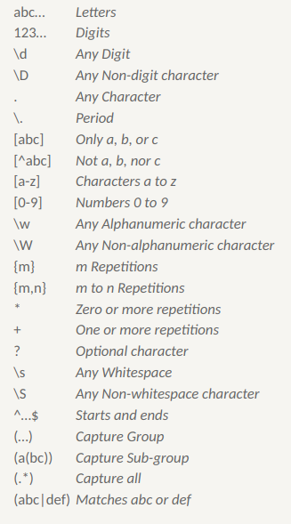
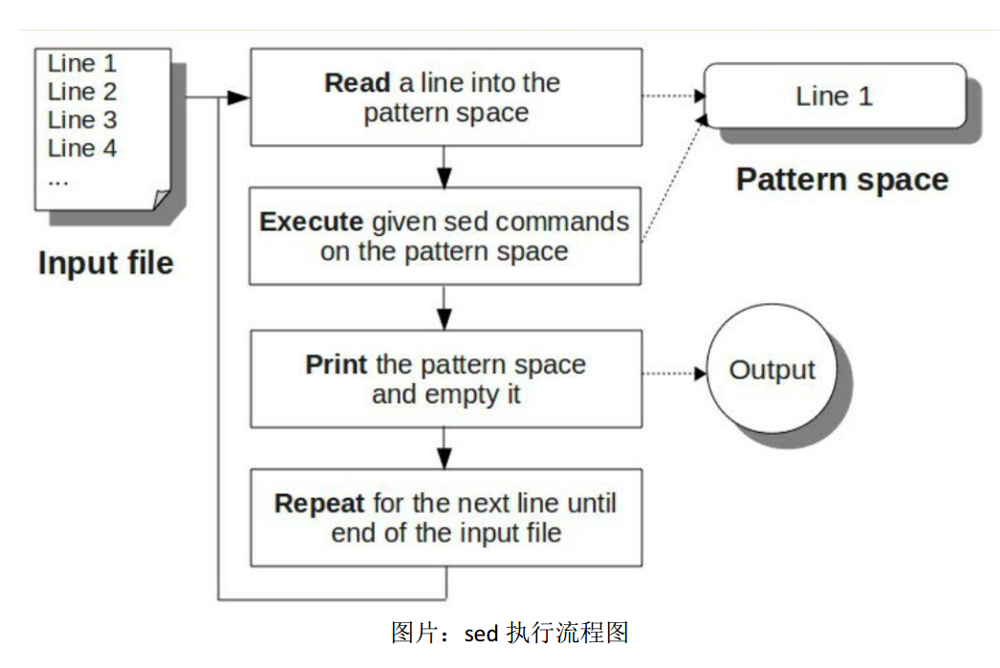
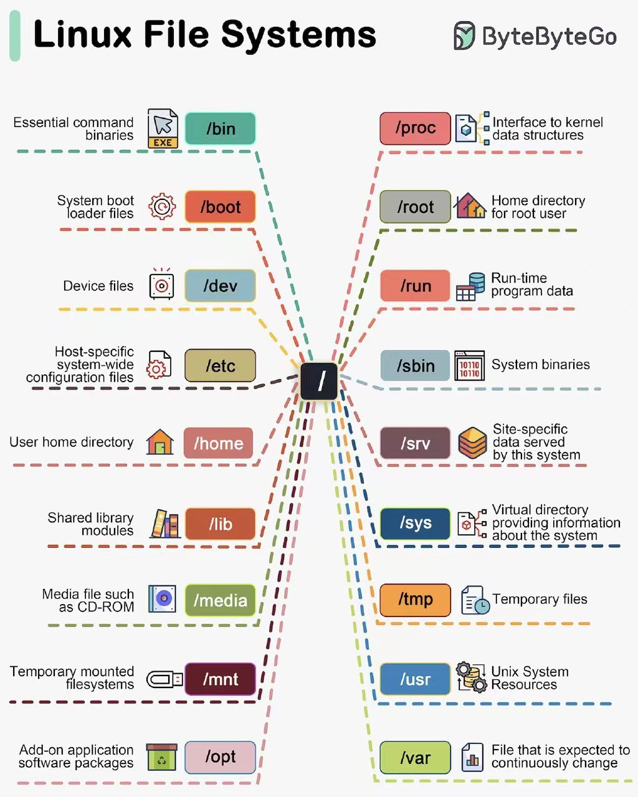

## 一、总论

如何熟悉工具呢？我觉得最为重要的是理解工具被设计和使用时的理念或者概念或者抽象，只要理解了工具中蕴含的理念是什么，对于具体的操作，就可以抄文档了。

linux 下的常见命令行工具有什么特点呢？这些常见的，简单的命令行工具，本质是 GNU/Linux 生态的一部分，他们的很多概念，本质是 Linux Kernel 的概念的延续和拓展。

GNU/Linux 的伟大真的是难以形容啊。

----


## 二、归档与压缩

“归档“常常和“压缩”一起出现，但是其实他们应该被看做两个独立的过程。我看过一个贴切的比喻：“归档”是将多件衣服放到一个塑料袋里，而“压缩”是将塑料袋抽真空。

压缩是很容易理解的事情，但是归档的意义就不是那么直观了，原本非常美好的目录树，为什么要归档成一个文件？我觉得其本质是这样的，目录树的实现是需要文件系统的支持的，我们平时在电脑上可以用资源管理器探索目录树，正是因为操作系统内具有文件系统解析器，可以将原本为一堆二进制的文件翻译成有条理的的目录树，但是很多地方是没有文件系统解析器的，比如说操作系统不支持特定的文件系统格式，比如说微信就没法在线浏览目录树，网络传输的时候应该是也字节流形式的，并没有办法维护树结构。归档就是将目录树结构和文件都安排到一个归档文件的过程，就避免了在不具有文件系统解析器的环境下浏览、修改、传输的不便。

Linux 下常用的归档工具是 tar，原生的 tar 并不具备压缩功能。常用命令如下：

**创建归档文件**

```shell
tar -cvf arch.tar t1.txt t2.txt t3.txt
```

其中 `-c` 表示 create，即创建一个压缩文件，`-v` 表示 verbose ，即显示 tar 的经过，`-f arch.tar` 表示指定归档文件的生成名称。`*.txt` 是被压缩的文件。

**列出归档文件内容**

归档文件中保存了一些文件系统信息（比如目录结构，文件的时间信息和权限信息等），我们可以在不提取归档文件的情况下，浏览这些信息，命令如下

```shell
tar -tvf arch.tar
```

其中 `-t` 表示 list，即列出归档文件的内容

**提取（解压缩）归档文件**

将归档文件提取到指定目录 `./extract` 下，命令如下

```shell
tar -xvf arch.tar -C ./extract
```

其中 `-x` 表示 extract，即提取文件，`-C` 指定提取路径，如果没有指定，那么就会提取到当前目录。

可以看到这三条命令都是保证参数 `-vf` 不变的前提下，修改前面的参数来执行不同行为的。

我们平时的逻辑是“归档 + 压缩”的，所以 tar 也提供了后续的方法，比如说如果使用 `gzip` 工具进行压缩，那么可以在参数中添加 `z` 来表示，相应的命令就变成了

```shell
tar -zcvf arch.tar t1.txt t2.txt t3.txt # 打包并压缩文件		
tar -ztvf arch.tar	# 列出打包压缩文件里面的内容
tar -zxvf arch.tar -C ./extract # 解压缩
```

此外还有其他压缩器

- `z`：gzip，即 GNU zip
- `j`：bzip2，是 gzip 的升级版

其实现代的 GNU tar 是有一套根据扩展名自动识别压缩算法的机制的，免去了手动通过参数指定压缩算法的麻烦。压缩时使用 tar acvf ，解压时使用 tar axvf 即可。其中 a 表示自动检测，这个 a 也可以省略。

---


## 三、进程

### 3.1 概念

在计算机操作系统中，一个会话（session）是用户与系统之间的交互期间所建立的逻辑连接。它代表了用户登录到系统，与系统进行交互并最终退出系统的完整过程。会话可以包含一个或多个进程，这些进程在用户登录期间与用户进行交互。通常，当用户通过终端登录到系统时，会话会与该终端相关联。用户可以在会话中运行多个进程，这些进程共享相同的会话上下文，包括环境变量、工作目录和权限等。

会话的一个重要特性是会话领导者（session leader）。会话领导者是在会话创建时由操作系统指定的一个特殊进程，通常是用户登录时启动的 shell 进程。会话领导者负责管理会话中的其他进程，并接收来自终端的输入。如果会话中的会话领导者终止运行，整个会话将被终止。

需要注意的是，有些进程并不属于任何会话领导者，他们是守护进程，在开机的时候启动，在后台运行，并在需要时为用户提供服务。这也是他们与后台进程的一个重要区别（后台程序受到会话领导者的控制）。

tty 是一个缩写，代表着 "teletypewriter"（电传打字机）的意思。在现代操作系统中，tty 是指**终端设备**，它是用户与操作系统进行交互的接口，允许用户输入命令并接收系统的输出。终端设备可以是物理终端，例如连接到计算机的终端机或终端仿真器，也可以是虚拟终端，例如在图形界面下运行的终端模拟器。

会话领导者通常与一个终端设备（tty）相关联。它负责管理与该终端设备相关的会话过程。会话领导者接收终端的输入，将其传递给会话中的其他进程，并将这些进程的输出发送回终端设备。当会话领导者终止运行时，与该终端设备相关的会话也会终止。

### 3.2 ps

`ps` 可以列出系统正在运行的进程，我们在终端键入 `help` 命令，就可以理解 `ps` 的设计思路

```shell
~ > ps --help       

用法： ps [选项]

 Try 'ps --help <simple|list|output|threads|misc|all>'
  or 'ps --help <s|l|o|t|m|a>'
 for additional help text.
```

可以看到 `ps` 的几个大功能，有：

- `list`：将列出来的进程分组
- `output`：控制排序格式
- `threads`：线程级显示
- `misc`：misc 是 miscellaneous 的缩写，意思是“冗杂的”，所以是一些杂项

我们使用 ps 常常是为了查看特定进程的 pid，然后用 `kill` 给他们发信号，所以如何列出全部的进程就成了一个问题，我们其实是用两个参数解决的

- `a` ：这个参数会列出所有在当前 tty 里的进程（也就是受到 session leader 控制的），如果不加 `a`，那么只会列出来当前 shell 下的进程。
- `x`：列出所有的不在 tty 里的进程（不受 session leader 控制的），可能就是守护进程的意思。

当这两个合在一起的时候，我们就可以看到运行在这个系统上的全部进程了。这也是我们最常用的命令的由来，多出来的 `u` 表示打印用户信息。

```shell
ps -aux
```

### 3.3 kill

`kill` 用于向指定 `pid` 的进程发送 signal，一般都是如下形式，会杀死这个进程。

```shell
kill [pid]
```

也可以向这个进程发送其他的信号，信号的种类可用 `kill -l` 查询。指令形式如下

```shell
kill -[signal] [pid]
```

 ### jobs

`jobs` 用于查看后台进程。

### 3.4 htop

神器中的神器，可以用于搜索、过滤、排序、分组进程，并且还可以杀死进程。

---


## 四、过滤器

### 4.1 xargs

`xargs` 命令可以和管道配合的很好，它可以将管道的输入转换成命令的参数，大大拓展了原来命令的能力。比如说我想对当前文件夹下所有的条目执行 `ls` 命令，看上去应该是这样的

```shell
ls . | ls
```

但是这并不行，不是所有的命令都是 `less` ，可以接受管道的输出，像 `ls` 就不可以，它的输入只能是参数，我们可以用 `xargs` 实现我们的需求，具体如下

```shell
ls . | xargs ls
```

当然这个需求比较简单，原因是 `ls` 是比较简单的命令，它的特性是对于其要处理的对象一视同仁，是没有角色区别的，考虑一下 `cp` 命令，如果将当前文件夹下的条目拷贝到 `~/desktop` 下，那么就会发现 `cp` 的命令格式是这样的 

```shell
cp <src> <dst>
```

我们用 `xargs` 时，无法确定到底要传给 `<src>` 还是要传给 `<dst>`, 所以我们可以这样

```shell
ls . | xargs -I {} cp {} ~/desktop/
```

这里的 `-I {}` 表示了一个占位符，经过 `xargs` 处理的参数会对应到后面的 `cp {}` 中的 `{}` 中。

此外有些命令对其处理的对象也有数量限制，比如说如下脚本

```shell
#!/bin/bash

echo $1 $2 $3
```

这个脚本会打印前三个传递给脚本的参数，所以如果执行这个命令

``` shell
echo "1 2 3 4 5 6" | xargs ./print.sh 
```

那么执行结果只能是 `1 2 3`, 其后的 `4 5 6` 就被丢弃来。那么如果希望打印出来呢？那么其实可以使用 `-n` 参数，这个参数相当于 `xargs` 每次会限定传递给 `command` 的个数，如果输入的参数很多，那么 `xargs` 就会多次调用 `command`, 我们可以这样修改命令，就可以打印 6 个数字：

``` shell
echo "1 2 3 4 5 6" | xargs -n3 ./print.sh
```

此外，`xargs` 还需要区分“1 个”参数的概念，因为 `-n` 需要明确单位，那么需要明确分界符是什么。可以用 `-D` 来指定分界符，如下所示

``` shell
echo "nameXnameXnameXname" | xargs -dX
```

其输出为

``` shell
name name name name
```

### 4.2 grep

#### 4.2.1 搜索

`grep, sed, awk` 都是很好的数据整理工具，但是其实并不像很多工具书谣传的“awk 可以代替 sed, sed 可以代替 grep”，这 3 个工具由明显不同的侧重点，我希望能在下面解释清楚。

提到 `grep, sed, awk` 就不得不提正则表达式（regular expression, regexp），但是考虑到正则表达式尤其是扩展后的正则表达式的语法已经很复杂了，所以在下面的介绍中我不打算系统的记录了。我会在讲完 grep 之后介绍一部分，在介绍完 sed 后再介绍一部分。

我觉得 grep 的核心功能是**“搜索”**，而 sed 和 awk 都有很强的编辑功能。搜索有如下要点：

- 搜索的目标是以行内子串为单位的，也就是说，检验一个正则表达式是否匹配，说的是这个 regexp 是否和文件中的某一行的一部分可以匹配。既不需要考虑是否和多行匹配，也不需要考虑要与一整行进行匹配。
- 搜索的结果是以行为单位的，也就是说，如果某一行和一个正则表达式匹配了（本质是一个子串匹配了），那么搜索结果就会展示这一整行，而不是展示匹配好的子串。
- 搜索的范围并不是局限于一个文件（后面介绍的的 sed 和 awk 因为对格式的依赖更强，所以搜索的一般是同格式的一个或者多个文件），而是一个范围的文件组（比如一个或者多个目录下的所有文件）。

#### 4.2.2 正则

基础的正则表达式用法很显然了，这个图可以进行说明：



然后我们来谈一下正则表达式的时间复杂度，我们规定模式串的长度为 $m$，匹配串的长度是 $n$。 这其实是涉及了正则表达式引擎的实现，引擎需要先根据正则表达式建立 NFA 或则 DFA，建立 DFA 的时间复杂度是 $O(2^m)$，而建立 NFA 的时间复杂度只是 $O(m)$。但是利用状态机进行匹配时，DFA 可以做到不回退，所以只需要扫描一遍匹配串即可，时间复杂度是 $O(n)$，而 NFA 需要回退，所以时间复杂度是 $O(mn)$ （每个匹配串的字符都回退，回退前的状态机路径长度都是 m）。所以其实是需要取舍的。据不可靠资料，据说一般程序都会采用 NFA 的方式。

总的来说，正则表达式不是一个十分高效的手段，不过考虑到我们需求的要求（用简单的字符串匹配很多种字符），这也是一种“最不坏”的方案了。此外，我们也可以通过优化正则表达式的写法，来简化 NFA，其核心思想就是少引入 $\varepsilon$ 。

然后介绍一下正则表达式的用法：

- 正则表达式本身是没有子串反选功能的，所以涉及到反选功能，`grep -v` 可以提供不符合模式串的匹配串，但是正选功能又无法保持了，所以可以连缀多个 `grep, sed, awk` 命令。可能 unix 的设计思路就是这样的，通过管道，用多个简单的工具组装出一个极度定制化的工具，而非逼迫一个工具完成所有的功能。
- 突然想多谈一谈，emacs 的本质并不是一个 all in one，而是一个 all in group，emacs 的多个简单的插件组合起来，才满足了用户定制化的编辑需求，其实 vscode 也是这个设计思路，真正 All in one 的是 IDEA 或者 VS 这种重型 IDE，虽然功能都能满足，但是定制化程度和上限都会被限制。
- 最基础的正则没有这么多的元字符，所以使用这些工具的时候，如果没有达到预期效果，需要指定参数来开启拓展正则。但是这些工具对于拓展正则的支持也是有限的。所以尽量不要使用 `\d` ，而是要使用 `[0-9]` 。
- 贪婪匹配说的是**在匹配成功的情况下**，尽可能的匹配较长的串，所以不用担心 `.*b` 匹配 `aab` 的时候用 `.` 去匹配 `b` ，导致后面的 `b` 匹配不上，这不是贪婪匹配，这是没有匹配成功。 
- 没必要去想如何匹配整行，很多时候只需要匹配一部分就够了，剩下的用 `.` 就好了。

### 4.3 sed

从 `sed` 开始，后面的两个工具都具有编辑功能了，但是可以这样说，`sed` 编辑的对象并不需要很特化（`awk` 要求文件的组织结构像数据库一样）

#### 4.3.1 流式编程

sed 是 stream editor 的缩写，对于流这个概念，似乎是一个很难解释的现象，我考虑先讲解一下对 stream 的理解，我觉得 stream 最大的特性在于其无限性，也就是形象的说，流不是池，池子是有限的，对应到编程中就是数组这样的结构，我们可以随机的存取，可以移动它，复制它，我们对他的掌控力是很高的。但是流不是，流是无限的，我们不知道它占了多少的内存，也不知道他未来的样子。

所以 stream 我觉得 stream 一开始并不是一个编程的工具，它一开始就是对于现实世界的一种客观抽象。现实中确实有这样的事物——我们无法获得他的全貌，而且在一定意义上它是无限的。比如说对于我们的键盘，没人知道我还会在键盘上打多少个字，我们总不能等一天都结束了，计算机才将我这一天内打的字都传给电脑。所以键盘设备就是一个流设备，计算机只知道有个键被按下了，不知道未来还有多少个键会被按下。

正因为这种特性，与流相关的处理总是聚焦于当下（或者还有过去），对于全局和外来并不抱有指望。这样看，流处理是一种信息受限的编程。不过正因为这种约束关系，反而使其增加了一些优良的特性（这就好像当限制了先进后出的策略后，栈反而变得高效了）：

- 只需设计当下信息的处理：我觉得这是其最基本的性质，在流中“全局”被弱化了。当流中的元素到达时，它们会触发相应的计算操作，而不是等待所有元素都可用才开始计算。
- 可组合性：流可以通过连接、组合和串联不同的处理单元，形成复杂的数据处理流程。我觉得这是因为连接当前单元的难度要比连接全局要小。
- 异步性：流可以支持异步操作，即数据可以按照不同的速率和时间间隔进行处理，提高程序的并发性能。

在 `sed` 中，它的流式编程特点体现在，他每次只读入待处理文本中的一行，然后进行处理，然后再读入下一行，这样循环，其流程如下所示：



基本上遵循一个“读入，处理，输入”的过程，比较明显的区别是这个过程会循环发生。

如图上显示的一般，sed 会将文件中的一行读入它的流处理 buffer，它的特定词汇是 pattern space 模式空间。然后会对这个 pattern space 里的文本执行多条 sed command，最后将 pattern space 里的文本输出（在默认情况下），输出后会清空然后读入下一条文本，开启循环。

与 vim 这样的编辑器的设计思路不同，sed 不会将整个待处理文本读入内存后再工作，这种特点产生了如下有好有坏的影响：

- 运行时内存减少：sed 只需要维护一行内存即可，这使得 sed 在处理超大型文本的时候有绝对优势（突然想到不会有人使用 sed 进行编程吧，这可就太极客了）。
- 在编辑时可以获得的全局信息少：sed 是无法获得当前行之后的行的信息的，所以全局搜索或者前瞻（比如多行组成了一个处理单元）这样的操作，要么完成不了，要么需要十分特殊的手段。
- 无法简单的写回文件，这是因为 sed 获得的只有文件的一行信息，它没法直接对源文件进行更改，这点在 java 流编程中似乎也有体现。不过我们可以用 `sed -i.bak` 创建备份文件的方式来解决这个问题。
- sed 可以积累历史信息，虽然无法前瞻未来，但是 sed 可以记录一些处理过的行的历史信息来增强编辑能力，最简单的是行号，比较复杂的是 sed 其实维护了一个 holding space 保留空间，可以用来记录指定的历史信息。

写到这个时候，我突然觉得 sed 确实抓住了一些“编辑”的本质或者说抽象，我们平时编辑的时候，也是首先找到目的行，然后对它进行一些基于语义的修改（sed 中使用了正则替换），然后再去找下一个目的行，再处理。

相比于普世的编辑器，当一个编辑单元出现在多行上时，sed 的编辑能力就不太足够了，sed 适合处理编辑单元在行内的情况。

#### 4.3.2 正则捕获

这里介绍一下正则捕获知识，之所以没在介绍 `grep` 介绍这个，是因为捕获是对于信息的提取，进而达到编辑的目的，而 grep 聚焦于搜索功能，即使捕获了一些信息，也不知道应用到哪里。

所谓的捕获就是可以提取正则表达式的一部分中匹配到的字符串，用作后续的信息处理。我们用 `()` 来表示要捕获的部分（也被成为一个捕获组），比如说

```shell
"3.14"
"\d+\.(\d+)"
```

可以用上面的表达式捕获有理数的小数部分，对于匹配的 `3.14` 而言，他就是小数部分 `14`。

我们可以使用 `\1, \2, \3, ... ,\n` 来表示不同的捕获，比如说 `\1` 就对应第一组捕获，其中捕获的顺序是由正则表达式中 `(` 出现的顺序决定的。`\0` 被用作表示匹配好的整个串。

当然捕获也衍生出多种变体：

- 捕获显然会影响效率，但是有的时候 `()` 语法又是无法避免的（比如说一个子串多次出现），此时可以用 `(?:pattern)` 表示非捕获分组。
- 只使用数字表示捕获组有些缺少可读性，可以对捕获组进行命名，方式是 `(?<name>pattern)` ，只不过 linux 工具似乎并不支持。
- `(?=pattern)`：正向肯定预查（个人建议放弃理解正反，直接看例子）。`Windows(?=95|98|NT|2000)` 能匹配 `Windows2000` 中的`Windows`，但不能匹配 `Windows3.1` 中的 `Windows`。
- `(?!pattern)`：正向否定预查。`Windows(?!95|98|NT|2000)` 能匹配 `Windows3.1` 中的 `Windows`，但不能匹配 `Windows2000` 中的`Windows`。
- `(?<=pattern)`：反向肯定预查， `(?<=95|98|NT|2000)Windows` 能匹配 `2000Windows` 中的 `Windows`，但不能匹配 `3.1Windows`中的 `Windows`。
- `(?<!pattern)`：反向否定预查，`(?<!95|98|NT|2000)Windows`能匹配`3.1Windows`中的`Windows`，但不能匹配`2000Windows`中的`Windows`

后面这几种在 linux cli 工具中的支持并不是很好，但是在 js 或者 python 中都有支持。

#### 4.3.3 指令格式

sed 的单指令格式如下

```shell
sed [sed-options] <sed-command> <file>
```

sed 的多指令格式如下

```shell
sed [sed-options] -e <sed-command1> -e <sed-command2> <file>

sed [sed-options] '{
 <sed-command1>
 <sed-command2>
}' <file>
```

对于 `sed-options` ，他们主要有

| 选项         | 示意                                                         |
| ------------ | ------------------------------------------------------------ |
| `-n`         | 不打印模式空间，如果不加这个参数，`sed` 默认会将处理好的结果打印出来 |
| `-i[扩展名]` | 直接修改文件（如果指定扩展名则备份文件）                     |
| `-E, -r`     | 在脚本中使用扩展正则表达式                                   |

对于 `sed-command`，他可以被分为两个部分，如下所示：

```shell
"[地址选择] [sed 操作]"
```

其中“地址选择”负责选择哪些行会被读入模式空间，而“sed 操作”则负责将读入模式空间的字符串进行操作。

地址选择有如下方式：

| 示例                     | 解释                                                         |
| ------------------------ | ------------------------------------------------------------ |
| `2`                      | 第 2 行                                                      |
| `2, 4`                   | 第 2，3，4 行                                                |
| `2, $`                   | 从第 2 行到最后一行                                          |
| `1, ~3`                  | 第 1，4，7，……，行（从第 1 行开始，隔 3 递增）               |
| `1, +3`                  | 第 1，2，3 行（从第 1 行开始，一共 3 行）                    |
| `/pattern/`              | 可以匹配正则表达式 `pattern` 的行                            |
| `/pattern/!`             | 不可以匹配正则表达式 `pattern` 的行                          |
| `/pattern1/, /pattern2/` | 从第一次匹配到 `pattern1` 的行开始，到第一次匹配到 `pattern2` 的行结束（这符合流编辑特点） |

命令有如下几种，其中替换命令又伴随着一堆子命令：

<table>
  <tr><th colspan="2">命令</th><th>含义</th></tr>
  <tr><td colspan="2">p</td><td>打印，因为 sed 默认打印模式空间，所以需要与 <code>-n</code> 搭配</td></tr>
  <tr><td colspan="2">d</td><td colspan="2">删除，也就是不打印这一行，不需要与 <code>-n</code> 搭配</td></tr>
  <tr><td colspan="2">w output_file</td><td colspan="2">写入，将模式空间中的内容写入到文件中</td></tr>
  <tr><td colspan="2">a append_line</td><td colspan="2">在当前行后插入一行</td></tr>
  <tr><td colspan="2">i insert_line</td><td colspan="2">在当前行前插入一行</td></tr>
  <tr><td colspan="2">c replace_line</td><td colspan="2">将当前行替换为为新行</td></tr>
  <tr>
    <td rowspan="7">s/pattern/replacement/[flags]</td>
    <td>s/pattern/replacement/<td>将模式空间中第 1 个符合 <code>pattern</code> 的部分替换成 <code>replacement</code></td></td>
  	</tr><tr><td>s/pattern/replacement/g</td><td>将模式空间中所有符合 <code>pattern</code> 的部分替换成 <code>replacement</code></td></tr>
	</tr><tr><td>s/pattern/replacement/3</td><td>将模式空间中第 3 个符合 <code>pattern</code> 的部分替换成 <code>replacement</code></td></tr>
    </tr><tr><td>s/pattern/replacement/p</td><td>替换完成后打印出来，需要与<code>-n</code>搭配</td></tr>
	</tr><tr><td>s/pattern/replacement/w output_file</td><td>替换完成后写入文件</td></tr>
	</tr><tr><td>s/pattern/replacement/i</td><td>模式空间中的内容忽略大小写</td></tr>
	</tr><tr><td>s/pattern/replacement/e</td><td>执行模式空间中的内容</td></tr>
</table>


多个 flag 是可以混用搭配的。

个人感觉 `sed` 的命令几乎和 `vim` 的一样，不知道两者是否有渊源。

### 4.4 awk

awk 在 sed 的基础上更近了一步，或者说，awk 比 sed 更加特化，他适合处理每一行是一个 record 的情况，这里的 record 就是数据库中的记录的意思，是一个具有多个属性的的条目或者说实体。每个实体的多个属性都被分隔符分割。更进一步而说，awk 是一种处理“字符串数据库“的工具，它提供了很好的操作二维表的能力。

awk 不只是是一个简单的工具，他更是一种语言，这种语言对于处理“字符串数据库”很适合，因为它内置了许多变量用于描述 record 和record 多个字段，同时对于字符串和数的处理很简便。很多人都会说 awk 的语法很像（是真的很像，基本上所有语法细节都是一样的），我认为 awk 是一种特化的 C。

此外，awk 和 sed 一样，都是流处理器，但是并不是每次维护一行，而是维护一个 record。所以 awk 也具有和 sed 同样的优缺点。

#### 4.4.1 内置变量

awk 有一堆内置变量，在讨论前我们还是先明确一下，一个数据库的实体被称为一个“记录 Record”，一条记录由多个“字段 Filed”组成。

| 变量                        | 含义                                                         |
| --------------------------- | ------------------------------------------------------------ |
| FS (Field Seperator)        | 字段分隔符，也就是一条记录中字段的分界符，默认为空格         |
| RS (Record Seperator)       | 记录分隔符，也就是区分相邻两条记录的分解符，默认为换行符，也就是默认一行是一条记录 |
| NR (Number of Record)       | 已处理记录的条数，也就是通俗意义上的行号                     |
| FNR (File Number of Record) | 对于当前文件已处理记录的条数，因为 awk 可以同时处理多个文件，NR 是持续递增，FNR 会每个文件归零 |
| $n (n = 1, 2, 3, ...)       | 当前记录的第 n 个字段                                        |

可以看出通过这几种变量，我们可以很好的控制这个数据库。

#### 4.4.2 指令结构

awk 的指令结构如下

```shell
awk [awk-options] <awk-script-content> <file>
```

这种是直接将脚本内容执行。下面这种则是执行一个 awk 脚本文件

```shell
awk [awk-options] -f <awk-script-file> <file>
```

关于 `awk-options` ，其实只有 `-F` 比较重要，他可以指定 FS，比如说 `-F:` 就是将 `:` 作为字段分隔符。

 其中 awk 脚本最完整的结构如下

```c
BEGIN {
	<awk-command>
}

record-condition-statement {
	<awk-command>
}

END {
    <awk-command>
}
```

其中 `BEGIN` 只会在 awk 开始的时候运行，一般进行初始化工作和 header 的打印；中间的部分（body）则会每一个 record 都运行，其中 record 只有符合 `record-condition-statement` 才会执行里面的部分；`END` 只会在处理都结束后才会运行，一般用于进行结果的处理和 footer 的打印。

`BEGIN, END` 都是可以省略的（`record-condition-statement` 和 body 其实也可以），所以 awk 也可以退化成这种形式

```shell
awk "/Jane/ {print $2}" numbers.txt
```

这就是说找出匹配正则 `Jane` 的记录，然后打印第 2 个字段。这个结构就和 sed 很类似了，但是 sed 要实现这个功能，还需要实现一个带有捕获的正则表达式，这足以体现 awk 的优越性。

对于 `record-condition-statement` 的语法，其实和 C 语言类似，只是少了括号和增加了对于正则的支持

```c
NR >= 3 && /Jane/
```

这个条件就表示了既要满足行号大于等于 3，且还要让 record 匹配 /Jane/ 的结果。

此外 awk 还支持对于字段的正则匹配，他的写法如下

```shell
$2 ~ /Jane/ # $2 可以匹配 Jane
$3 !~ /Jane/ # $3 不可以匹配 Jane
```

此外 awk 也支持字符串比较

```shell
$4 == "Jane"
$5 != "Jane"
```

#### 4.4.3 其他语法

awk 的变量也很有趣，它们处于一种“量子态”，既可以是数字，也可以是字符串，我个人感觉这是通过不同的运算符实现的。此外，awk 的变量是不需要提前声明的。

当一个变量是数字时，其运算符都是和 C 一致的：

```c
add = $4 + $5; # add 是第 4, 5 两个字段的和
count++; # count 递增
sum += $6; # sum 增加 $6 
```

字符串运算则遵循另一套逻辑，使用空格运算符和逗号运算符完成拼接操作

```c
string_a = "aaa";
string_b = "bbb";
string_sum1 = string_a string_b; # "aaabbb"
string_sum2 = string_a, string_b; # "aaa bbb"
```

二者的区别是使用逗号会引入一个 `OFS` 符号，这个符号默认是空格，具体的会在后面讲。

此外，awk 还支持 map 结构，以及配套的 sort 函数，总之非常厉害。示例如下

```c
item[101]="HD Camcorder";
item[102]="Refrigerator";
item[103]="MP3 Player";
item[104]="Tennis Racket";
item[105]="Laser Printer";
item[1001]="Tennis Ball";
item[55]="Laptop";
item["no"]="Not Available";

delete item[102]
item[103]=""
delete item[104]
delete item[1001]
delete item["na"]

for(x in item)
	print "Index",x,"contains",item[x]
```

awk 同时支持 `if, else, for, while` 这样的语法，而且语法和 C 一模一样，十分舒适。

#### 4.4.4 格式化输出

awk 不仅可以用于分析“字符串数据库”，还可以用于输出“字符串数据库”，他同样拥有很好的输出系统。

最常用的输出函数是 `print`，可以输出一个或者多个字符串（也可能是多个字符串先拼接成一个字符串，我觉得这样更好理解）

```c
string_a = "aaa";
string_b = "bbb";
print string_a string_b; # "aaabbb"
print string_a, string_b; # "aaa bbb"
```

这里就又涉及了两个内置变量

| 变量                          | 含义                                                         |
| ----------------------------- | ------------------------------------------------------------ |
| OFS (Output Field Seperator)  | 输出字段分隔符，也就是一条记录中字段的分界符，默认为空格     |
| ORS (Output Record Seperator) | 输出记录分隔符，也就是区分相邻两条记录的分解符，默认为换行符，也就是默认一行是一条记录 |

另一个是 `printf`，可用于实现格式化输出，用法基本上和 C 一致，格式如下

```c
printf "print format", variable1,variable2,etc.
```

#### 4.4.5 GNU 工具

awk 这个工具的强悍震惊了我，这让我产生了很多要深度使用这个工具的想法，因为它实在是对于处理这种数据库太友善了，而且其强大的语法足以满足我的需求。

但是转念一想，似乎还是应该用 python，因为只有 python 才能做到跨平台，awk 是 GNU/Linux 生态的一环，而如果想要冲破这个生态，就不能使用 python，而且 python 不仅能处理文件，做别的也很好，这种语言虽然不像 awk 或者 ruby 一样用他的特色吸引我，但是却用一种神秘的，宿命的东西强迫我，曾经 js 也是这样的。我似乎感受到了其他程序员对我的指指点点，实在是奇妙的感觉啊。

---


## 五、文件系统

### 5.1 链接

了解链接就必须了解 linux 的文件系统数据结构。linux 比较常见的文件系统是 ext3/4， 它和我熟悉的 fat32 可以比照着来学习，从他们中提取一些共同的抽象。

文件系统存储在外存上，外存生产厂商会将外存抽象成一个线性的大数组，但是我们认识到的文件系统其实是一个树形结构。所以这就导致了一个自然而然的问题，就是如何用一个数组描述一个文件系统树。当然最直观的想法就是每个文件是一个树节点，将数组变成一个节点数组，但是其实这样是不行的，因为文件的特性是“大且不定长”，所以这种简单的构造使得碎片化的空间太多了，而且移动和删除也会有一定的问题，所以现在流行的结构是一种“索引式”的结构，即保持文件系统的数据部分依然是一个大数组（像一个堆一样管理），而用于维护文件的数据块的位置信息，则另外开辟一个地方专门存放这类信息，这个区域可以被理解为索引区。

此外每个文件系统还需要记录整体信息（比如说外存大小，扇区大小等）的元数据区，所以 fat32 和 ext3 都可以理解为由三个部分组成：

- 超级块：用于记录文件系统整体信息。
- 索引区：用于记录文件数据在数据区中的位置。
- 数据区：用于记录文件数据。

此外在文件系统中还有两个需要注意的点：

- 文件元数据的维护方式：每个文件都需要维护一些元数据，比如操作权限，文件类型，各种时间信息等。
- 目录的实现方式：目录的本质是维护一组树结构的亲子关系。

我们将从这五个方面比较 fat32 和 ext3 的区别：

| 条目               | fat32                                                                                                     | ext3                                                                                                                 |
|--------------------|-----------------------------------------------------------------------------------------------------------|----------------------------------------------------------------------------------------------------------------------|
| 超级块             | 容量较小                                                                                                  | 容量较大                                                                                                             |
| 索引区             | fat 表，每个节点和数据区簇一一对应，一条链表对应一个文件，每个节点只记录下一个簇的簇号，查询效率为 $O(n)$ | 节点被称为 inode，一个 inode 对应一个文件，使用多级索引的方式，将该文件用到的数据区号全部记录下来，查询效率为 $O(1)$ |
| 数据区             | 多个 sector 组成了 cluster                                                                                | 多个 sector 组成了 block                                                                                             |
| 文件元数据维护方式 | 直接在目录文件中维护文件元数据数组                                                                        | 仅在目录文件中记录文件名到 inode 的映射，在 inode 中维护文件元数据                                                   |

对于硬链接，命令如下：

```shell
ln source link
```

硬链接的实现实质是对于新生成的 `link` 链接，它和 `source` 对应同样的 inode，所以他俩的地位是等同的。这种等同性是硬链接的优点，我可以删除 `source` ，使用 `link` 时也不会出现任何问题。但是它的缺点是无法跨越文件系统（因为 inode 是文件系统的一部分），没有办法链接目录（这是因为 inode 组成了树结构，硬链接会导致文件系统中出现环，在递归遍历目录等操作时容易出现 bug）。

另外有趣的是，常见的 `.` 和 `..` 都是采用硬链接实现的。

对于软链接（符号链接），命令如下

```shell
ln -s source link
```

软链接的实现实质是对于新生成的 `link` 链接，它本质是一个特殊文本文件，存储着 `source` 的路径，所以他俩在地位上就是不等同的。`link` 是依附于 `source` 的，很像是 win 系统上的“快捷方式”。它就可以链接目录，而且可以跨越文件系统。但是其缺点是依附于 `source`，如果 `source` 损坏，`link` 也就是失效了，同时要比硬链接占据的空间更大（软链接是创建一个文件，而硬链接是在工作目录中加一个 inode 映射）。

### 5.2 文件夹

比较简单，主要是记住不加参数的 `mkdir` 只能一层层创建，比如如果想要创建 `./d1/d2/d3/` 结构，则需要

```shell
mkdir d1 
cd d1
mkdir d2
cd d2
mkdir d3
```

但是如果加上 `-p` 选项，就可以省略这个事情

```shell
mdkir -p d1/d2/d3
```

### 5.3 回收站

垃圾(trash)是由桌面管理器比如 GNOME、KDE 和 XFCE 等提供的一个特性。当通过文件管理器删除一个文件或目录的时候，该文件或目录将会成为垃圾(trash)，然后被移动到回收站中，回收站对应的目录是 `$HOME/.local/share/Trash`。

回收站目录包含两个子目录：`files` 和 `info` 。`files` 目录存储实际被删除了的文件和目录，`info` 目录包含被删除了的文件和目录的信息，比如文件路径、删除日期和时间，每个文件单独存储。

`trash-cli` 是一个 cli 回收站工具，可以使用命令行的方式控制回收站，我们用它替换原本的 `rm`。`trash-cli` 是一组命令

```shell
trash 			# 将文件删除，移入回收站
trash-list 		# 列出回收站的文件
trash-restore	# 交互式恢复回收站文件
trash-rm		# 删除回收站文件
trash-empty	n	# 清空 n 天前的回收站文件
```

然后我们在 `~/.zshrc` 中加入如下语句来替换原本的 `rm`

```shell
alias rm="trash"
```

考虑到需要自动清空回收站，我们可以利用 `crontab` 设置自动清理（虽然 dolphin 其实有这个功能），使用

```shell
crontab -e
```

在交互控制台上输入一下命令表示每 7 天 0 时 0 分进行删除。

```shell
0 0 */7 * * /usr/bin/trash-empty -f
```

### 5.4 删除、移动、重命名

对于删除操作，十分简单，就是 `rm` 命令，`rm` 默认情况下不能删除文件夹，所以需要加上 `-r` 参数，此外，加上 `-f` 参数可以避免 `rm` 删除不存在的文件时，不会发生询问。

移动和重命名都使用的是 `mv` 命令，在知晓了 linux 对于文件夹的实现后可以很清楚的理解，`mv` 是一个会修改目的文件夹文件内容的命令。`mv` 功能是非常强大的，它是可以直接移动文件夹的（被移动的文件夹里的所有文件也都会移动）。这与 `rm` 形成来鲜明对比，这是因为即使是移动文件夹，也只会修改目的文件夹这一个文件，而删除一个文件夹，则需要修改多个文件。

此外就是需要了解 `mv` 的指令格式，它是源文件在前，而目的文件夹在后，如果目的不是一个已经存在文件夹，则这个指令兼具了移动和移动后重命名的功能，由如下示例：

``` shell
mv <src> <dst> # mv 指令格式
mv src_file.txt ./exist_dst_dir/ # 将 src_file.txt 移动到已经存在的 ./exist_dst_dir/ 文件夹下
mv src_file.txt ./exist_dst_dir/rename_file.txt # 将 src_file.txt 移动到已经存在的 ./exist_dst_dir/ 文件夹下，并重命名为 rename_file.txt
mv src_dir/ ./exist_dst_dir/ #  将 src_dir 移动到已经存在的 ./exist_dst_dir/ 文件夹下，也就是形成 ./exist_dst_dir/src_dir/ 结构
mv src_file.txt rename_file.txt # 将 src_file 重命名为 rename_file
```

关于“src 在前，而 target 在后”其实是一个非常普遍的现象。比如说在编译的时候先写源文件，后写目标文件；在链接的时候，先写被链接的对象，再写链接本身；拷贝的时候，先写源，后写拷贝路径。

唯一和这个经验有冲突的，其实是许多汇编语言，move 语句或者计算语句，都有将结果放在第一个运算符位置的现象。

### 5.5 查找

查找文件可以使用 `find` 命令，他会在指定目录下递归查找满足要求的文件和文件夹。

```shell
find <0 到 n 个指定路径> <要求>
```

要求有如下格式

| 要求                     | 备注                                                         |
| ------------------------ | ------------------------------------------------------------ |
| `-name pattern`          | 支持 `*, ?` 通配符。                                         |
| `-type type`             | 按文件类型查找，可以是 `f`（普通文件）、`d`（目录）、`l`（符号链接）等 |
| `-size [+-]size[cwbkMG]` | 按文件大小查找，支持使用 `+` 或 `-` 表示大于或小于指定大小，单位可以是 `c`（字节）、`w`（字数）、`b`（块数）、`k`（KB）、`M`（MB）或 `G`（GB）。 |
| `-mtime days`            | 按修改时间查找，支持使用 `+` 或 `-` 表示在指定天数前或后，days 是一个整数表示天数。 |
| `-user username`         | 按文件所有者查找。                                           |
| `-group groupname`       | 按文件所属组查找。                                           |

有如下示例：

查找当前目录下名为 file.txt 的文件：

```
find . -name file.txt
```

将当前目录及其子目录下所有文件后缀为 **.c** 的文件列出来:

```
# find . -name "*.c"
```

将当前目录及其子目录中的所有文件列出：

```
# find . -type f
```

查找 /home 目录下大于 1MB 的文件：

```
find /home -size +1M
```

查找 /var/log 目录下在 7 天前修改过的文件：

```
find /var/log -mtime +7
```

### 5.6 文件信息

如果希望查看文件的类型，那么可以使用 `file` 命令，`file` 命令基本上并不需要参数。

如果希望查看文件在文件系统（内核意义上的文件系统）中的信息，可以使用 `stat` 命令。

----


## 六、网络

### 6.1 request, response, url, user agent

经过不完整的考证，web request 是构建在 http 也就是应用层上的一个功能，client 会给 server 发送一个 request ，然后 server 会返回给 client 一个 response 。

这个 response 一般都会返回一个 html 文件，但是其实仔细一想，当考虑到 url 这个概念后，给定 url 后，有可能从 server 中获得可能为任何文件类型的 response 。另外似乎还会附加一个 response code 。 

User Agent 即用户代理，简称 UA，它使得服务器能够识别客户使用的操作系统及版本、CPU 类型、浏览器及版本、浏览器渲染引擎、浏览器语言等。

### 6.2 curl

`curl` 是一个创建 web request 的命令行工具，它的全称是 `client url` 。顾名思义，他可以作为 client 获得一个特定 url 的资源，其格式为

```shell
curl [options] <url>
```

其中比较有用的选项包括：

- 储存响应体到文件：也就是将资源保存到本地的意思。`-o` 可以指定文件名，`-O` 直接使用 server 资源的名字。如果没有这两个参数，那么 curl 似乎只会将资源输出到 stdout 。
- 获取 HTTP 响应头：response head 是资源的“元数据”，`-i, ---head` 可以附加打印 head 信息，`-I` 只打印 head 信息。
- 改变 User Agent ：由 `-A` 指定。

其他还有许多选项可以指定 cookie(-e), get param(-G), referrer(-e), http header(-H), 请求方式(-X) 。

### 6.3 wget

`wget` 是一个和 `curl` 类似的工具，他用于根据 url 下载资源。不过二者还是由一些区别的：

- `curl` 支持 http, https, ftp, scp, fscp 等多种协议，而 `wget` 更专注于 http 和 ftp
- `curl` 的选项主要用于设置 request 的各种参数，`wget` 的选项用于设置下载的参数，比如说下载速率等

总的来说，`curl` 是普世的，其需求是为了和 server API 进行作用，而 `wget` 是特化的，其需求就是为了下载文件。

`wget` 的格式为：

```shell
wget [options] <url>
```

----


## 七、根文件系统



### 7.1 `/dev` 和 `/sys` 的区别

`/dev` 是一个很著名的文件夹，因为它是 Unix “一切皆文件”设计哲学下的一个例子，这个文件夹下的文件都是“设备文件”，我们可以用操纵文件的 API 来控制我们的设备，但是在我之后的了解中，似乎 `/sys` 也有类似的效果，比如说可以用 `cat` 查看电池剩余电量，如下所示

```shell
cat /sys/class/power_supply/BAT0/capacity
```

这样看上去似乎两者的功能冲突了。

但其实并没有，`/sys` 提供的是设备包装后的信息，我们用操作文件的方式操作它们，可以看作是在调用各种设备的 API，而 `/dev` 则更加粗糙，是直接对设备进行操作。如果 Linux 是在没有历史背景的情况下设计的，`/dev/sda` 可能是 `/sys/block/sda/content` 。

### 7.2 `bin`, `sbin`, `usr` , `local` 的区别

在根文件系统中，有 `/bin/, /sbin/, /usr/bin/, /usr/sbin/, /usr/local/bin, /usr/local/sbin, ~/.local/bin` 等文件夹都可以存放二进制文件，那么他们的区别是什么？

有如下几点区别：

- 是否是 OS 必需的：必需的会放在根目录下，如 `/bin,/sbin` 而不必需的则在 `/usr` 下。
- 可用的用户不同：只有根用户可以用的会放在 `/sbin, /usr/sbin` 而所有普通用户可以用的，则会放在 `/bin, /usr/bin` ，只有特定用户可用的会放在 `~/.local/bin` 。
- 是否受到发行版包管理器控制：受控的放在 `/bin, /usr/bin` 中，不受控的放在 `usr/local, ~/.config/bin` 中。

总结如下：

| 目录            | OS 必需 | 使用用户     | 包管理器控制 |
|:---------------:|:-------:|:------------:|:------------:|
| /bin            | 是      | 所有普通用户 | 是           |
| /sbin           | 是      | 根用户       | 是           |
| /usr/bin        | 否      | 所有普通用户 | 是           |
| /usr/sbin       | 否      | 根用户       | 是           |
| /usr/local/bin/ | 否      | 所有普通用户 | 否           |
| /usr/local/sbin | 否      | 根用户       | 否           |
| ~/.local/bin    | 否      | 特定普通用户 | 否           |

在实践上，发行版自带的包，一部分会被安装 `/bin, /sbin/` ，当然也有一些会被安装到 `/usr/` 下，如果是通过包管理器安装的包，一般会安装到 `/usr/` 下，而如果是手动编译安装的包，则会安装在 `/usr/local` 下，因为并不受到包管理器控制。而 `~/.local/bin` 下可能会安装一些 `pip, npm` global 安装的脚本，当然也可能在别的地方。

### `bin`, `include`, `lib`, `share` 的区别

对于一个软件，它一般并不会在一个文件夹下老老实实呆着，它实际会分成多个部分，以 emacs 举例，执行如下命令

``` bash
whereis emacs
```

``` bash
emacs: /usr/bin/emacs /usr/lib/emacs /usr/share/emacs /usr/share/man/man1/emacs.1.gz /usr/share/info/emacs.info.gz
```

可以看到一个 emacs 会分布在 `bin, lib, share, man, info` 多个文件夹内。其中可执行文件在 `bin` 下，库文件（常常是 `lib*.so` 的形式，不过 emacs 的 `lib` 里是一些我不知道的东西），数据文件在 `share` 下（emacs 是内置的包），`info` 和 `man` 下存着说明文件。此外 `include` 文件夹下存储着头文件，一般用于包含库文件的声明。

一个软件并不会都有每一个部分，比如说 emacs 就没有 `include` 部分。

这种组织形式虽然很好的贯彻了分类学，比如在开发中可以使用哪些库只需要去 `include` 中查看即可，但是对于软件的独立性，则形成了挑战，比如说我现在要卸载 emacs, 那么就要去 5 个地方卸载，非常不方便（虽然包管理器会帮助我），但是对于手动编译的包，则没有这种便利性了。这就是 `/opt` 存在的意义，在这个文件夹下的每个子文件夹代表一个软件，这样只要删除一个文件夹，就等价于卸载了一个文件，十分方便，这也是 `optional` 的含义，即可选的，尝试性质的。

### 7.3 `/boot`
虽然在之前调研操作系统启动流程的时候，我就了解过 `/boot` 文件夹，它里面有内核文件和一个虚拟文件系统（据我观察，似乎 stage2 的 grub 也在这个文件夹下），作为 bootloader 需要加载内核和文件系统。

不过仔细想一想还是挺好完的，操作系统是一个常驻内存的程序，但是在他入驻内存前，肯定是在外存上的，需要通过 bootloader 将它从外存移入到内存中。但是外存那一份文件并没有消失，这本来就是进程和可执行文件的关系，所以我们可以通过 OS 进程看到那个文件系统中的 OS 程序。

这是一种很奇妙的感觉，有一种蛋糕凝视蛋糕模具的感觉。我们利用这个特性，可以在 Kernel 运行的情况下编译新的 Kernel, 并且在下次启动时用到新的 Kernel, 原来的 Kernel 已经死去了。

此外，这个文件夹下还有虚拟文件系统，至于为啥需要这个。是因为内核实在是太大了，所以 bootloader 并没有办法加载完全体的内核，它只能加载一个有基本功能的小内核，在让这个小内核加载自己的剩余部分（内核模块的设计）。直到这里，其实虚拟文件系统依然不必须，因为小内核有能力处理真实的文件系统。

但是问题是，这个“有基本功能的小内核”，依然太大了。所谓的“基本功能”，大部分是外存驱动程序，只要有了外存启动程序，小内核就可以从中读取文件系统，加载模块健全自己了。但是外存的种类实在是太多了，每一种外存都要有自己对应的驱动程序，而小内核在没有虚拟文件系统帮助的情况下，包含所有程序依然会导致自身变得臃肿，以至于让 bootloader 没法加载（也可能是这样会导致大量冗余的驱动被放入内核）。

这个时候虚拟文件系统就派上用场了，它作为一个文件系统，里面有各式各样的外存驱动程序。小内核只需要拥有识别虚拟文件系统的能力就可以了，小内核可以从虚拟文件系统中装载自己需要的外存驱动，然后利用装载好的外存驱动去识别真实外存上的文件系统。相当于先刷个虚拟文件系统的小怪涨涨经验，再去刷真实文件系统的大怪。

虚拟文件系统都是在内存中的，这是因为在识别虚拟文件系统前，内核并不具有识别外存的能力，只能识别内存。所以需要 bootloader 将虚拟文件系统加载到内存中。

而虚拟文件系统是如何构造的，也有一个演变历史。最初的方案被叫做 `initrd` ，这是一个虚拟的块设备。内核需要内置一种与之匹配的外存驱动去读取它，比如说一个 `ext2` 的驱动。只要可以读取 `initrd` ，那么内核就可以从中获得自己需要的驱动了。后来又提出了一种叫做 `initramfs` 的方案，这种方案直接将文件系统（而不是一个虚拟的块设备）放到内存中，这样小内核并不需要内置任何一个驱动程序，它可以直接读取内存中的文件系统。这个方案省略了驱动过程，更加高效。需要注意的是，尽管第二个方案成为主流，但是 `/boot` 文件夹下的虚拟文件系统依然叫做 `initr*` ，其实它是 `initramfs` 方案。

对比来说，bootloader 对 `initrd` 完成的任务像是

``` bash
zcat initrd | dd of=/dev/ram0
```

即解压解析后制造出块设备 `/dev/ram0` 。而对于 `initramfs` 更像是

``` bash
zcat initramfs | cpio -i
```

即解压后直接生成一个文件夹。

### 7.4 `/proc`
`/proc` 文件系统（procfs）是一个虚拟文件系统，提供了关于系统信息和内核状态的接口。它的内容在内核中动态生成，并不占用实际的磁盘空间。

`/proc` 包含很多与内核相关的信息，如当前运行的进程、内存使用情况、CPU 信息、内核参数等。每个运行的进程在 `/proc` 中都有一个对应的目录，目录名称为该进程的 PID（进程 ID）。这些目录中包含该进程的状态、内存映射、打开的文件等信息。`/proc` 文件系统的内容是动态生成的，当你访问某个文件时，内核会实时生成相应的信息。

----


## 八、remote

### 8.1 ssh

### 8.2 tmux

tmux 除了对终端进行分屏以外，还具有维持对话的功能，这在不稳定的 ssh 连接中十分有作用，因为如果在终端内运行耗时很长的程序（比如说编译或者运行测试），那么一旦 ssh 中断，程序也会运行失败。

tmux 可以解决这种问题，tmux 将我们和远端的通信包装成一个 session，tmux 会负责维护这个 session 的持续进行，并不会因为连接中断等原因停止。如果不幸中断，我们也可以重新进入这个 session，这个 session 之前的操作结果都会被保留。

创建一个 tmux session 有如下两种方式

```shell
tmux # 创建一个非命名的对话
tmux new-session -s <session-name> # 创建一个命名对话
```

然后就进入了一个 tmux session，此时如果希望离开并结束这个 session，那么应该输入

```shell
exit
```

而如果希望离开并保存这个 session，那么应该输入

```shell
tmux detach
```

如果希望展示现有的 session，那么可以使用

```shell
tmux ls
```

如果希望进入某个 session，那么就可以使用

```shell
tmux attach -t <session-name>
```

### 8.3 bashrc

常规的 bash 一般是不会显示分支名的，这对一个 git 仓库的指示不太有利，所以可以在 `~/.bashrc` 中添加如下代码修改 PS1，使得 bash 可以指示当前分支名和 status ：

```bash
# ${VALUE} 是展开字符串，$(FUNC) 是捕获 FUNC 的输出
PURPLE="\e[1;35m"
YELLOW="\e[1;33m"
GREEN="\e[1;32m"
BLUE="\e[1;34m"
RED="\e[1;31m"
WHITE="\e[1;37m"
RESET="\e[0m"

git_branch() {
branch="`git branch 2>/dev/null | grep "^\*" | sed -e "s/^\*\ //"`"
if [ "${branch}" != "" ];then
    if [ "${branch}" = "(no branch)" ];then
        branch="`git rev-parse --short HEAD`..."
    fi
    echo "$branch"
fi
}

git_status() {
  if git rev-parse --is-inside-work-tree > /dev/null 2>&1; then
    local untracked=0
    local modified=0
    local modified_updated=0
    local new_added=0
    local deleted=0
    local deleted_updated=0
    local renamed_updated=0

    local status_items=$(git status --porcelain)
    if [ -n "$status_items" ]; then
      while IFS= read -r item; do
        case "${item:0:2}" in
          "??") ((untracked++));;
          "MM") ((modified++)); ((modified_updated++));;
          " M") ((modified++));;
          "M ") ((modified_updated++));;
          "A ") ((new_added++));;
          " D") ((deleted++));;
          "D ") ((deleted_updated++));;
          "R ") ((renamed_updated++));;
        esac
      done <<< "$status_items"

      local result=""
      local index=""
      local workdir=""

      if [ "$modified" -ne 0 ]; then
        workdir+="${modified}${BLUE}*${RESET}"
      fi
      if [ "$modified_updated" -ne 0 ]; then
        index+="${modified_updated}${BLUE}*${RESET}"
      fi

      if [ "$deleted" -ne 0 ]; then
        workdir+="${deleted}${RED}x${RESET}"
      fi
      if [ "$deleted_updated" -ne 0 ]; then
        index+="${deleted_updated}${RED}x${RESET}"
      fi
      if [ "$renamed_updated" -ne 0 ]; then
        index+="${renamed_updated}${YELLOW}!${RESET}"
      fi
      if [ "$untracked" -ne 0 ]; then
        workdir+="${untracked}${YELLOW}?${RESET}"
      fi
      if [ "$new_added" -ne 0 ]; then
        index+="${new_added}${PURPLE}+${RESET}"
      fi

      if [ -z "$index" ]; then
        index="${WHITE}Ծ${RESET}"
      fi
      if [ -z "$workdir" ]; then
        index="${WHITE}Ծ${RESET}"
      fi

      result="${index}${WHITE}ᴗ${RESET}${workdir}"

      echo "$result"
    else
      echo "${WHITE}ԾᴗԾ${RESET}"
    fi
  else
    echo ""
  fi
}

GIT_STATUS=$(git_status)

thy_prompt() {
    # 必须先将它记下来，不然会被掩盖
    exitstatus=$?
    result="${GREEN}┌─[${RESET}\u@\h${GREEN}]─[${RESET}\t${GREEN}]\n"
    result+="├─[${WHITE}\w${GREEN}]"

    last_command=$(history 1 | awk '{print $2}')

    if [ -n "$(git_branch)" ]; then
        result+="${GREEN}─[${RESET}$(git_branch)${GREEN}]"
    fi


    if [[ $last_command == git* || $last_command == cd* ]]; then
        GIT_STATUS=$(git_status)
    fi

    if [ -n "$GIT_STATUS" ]; then
        result+="${GREEN}─[${RESET}$GIT_STATUS${GREEN}]"
    fi

    result+="${GREEN}\n└─>${RESET}"
    if [[ $exitstatus == 0 ]]; then
        result+="${YELLOW}λ${RESET} "
    else
        result+="${RED}λ${RESET} "
    fi

    PS1="$result"
    # echo "$result"
}
# PROMPT_COMMAND 用于每次更新 PS
PROMPT_COMMAND=thy_prompt
```
