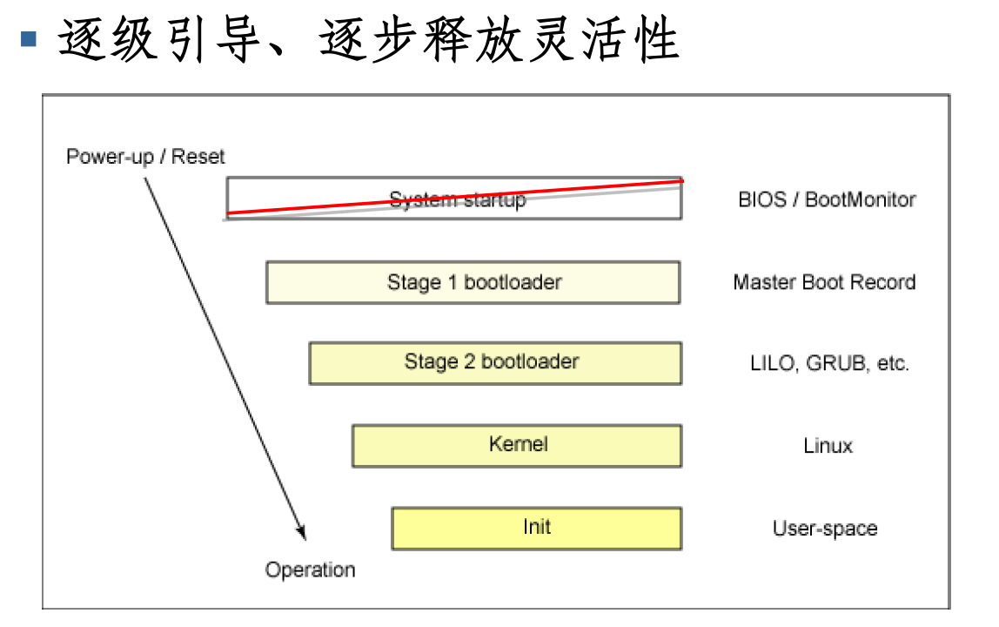

## 一、再次回顾启动流程

### 1.1 stage 1

在学 OS 的时候我就已经写过一篇介绍启动流程的文章了，在我忙了一上午以后重新学了一遍，发现其实之前就已经学的十分详细了，属于是自己造自己的轮子了。不过再次回顾，尤其是结合了自己开发操作系统的经验，还是发现很多重点的，所以再来回顾一遍。

首先是关于启动最初，bios，MBR 和 grub 的区别



他仨除了有一个“引导和被引导”的关系，其实在逻辑上还可以区分的更好。

BIOS 是在 ROM 中保存的，它的读取和执行时一种硬件行为，上电以后会自动读取，所以它是第一个，并不会被引导，只会引导别人。BIOS 可以选择不同的外存设备加载到内存进行启动，也就是选择不同的 MBR。BIOS 在逻辑上被称为固件，同类产品还有 UEFI。BIOS 执行的过程可能叫做 stage1。

MBR 并不是一个程序，他是外存设备上的一个固定扇区，之所以把他拉出来，是因为它一般作为 GRUB 这样的 bootloader 的一个子模块，其主要原因是 MBR 比较小，没法放下整个 GRUB。

### 1.2 stage 2

GRUB 是在外存中保存的，他的作用是选择不同的内核（当然还有别的功能）加载到内存，他的同类产品是 LILO。比较有意思的点是，他需要加载文件系统，但是加载能力有限（还没有被释放），所以他会加载一个 `initrmfs` 的虚拟文件系统来充数，是一个临时文件系统。当将控制权交给内核时，此时真正的根文件系统（也就是在外存上保存的那个东西）已经被加载好了。加载的内核在 `/boot/` 下。这个过程被叫做 stage2。

boot loader 程序主要做两件事，一个是将内核加载到内存中，另一个是启动一个虚拟文件系统．内核文件是 `/boot/vmlinuz*` ，虚拟文件系统文件是 `/boot/initr*`。其实我们可以看一下这个文件系统长啥样子（纯属闲得无聊）：

首先在桌面创建一个文件夹用于存放解压好的文件

```shell
mkdir -p ~/desktop/initrd && cd ~/desktop/initrd
```

然后将虚拟文件系统拷贝到这个目录

```shell
sudo cp /boot/initramfs-5.15-x86_64.img .
```

通过 `file` 可知这个 `img` 的本质是 gzip 压缩文件，所以需要解压缩，解压缩前需要修改后缀名

```shell
mv ./initramfs-5.15-x86_64.img ./initramfs-5.15-x86_64.gz
sudo gzip -d ./initramfs-5.15-x86_64.gz
```

然后发现 `initramfs-5.15-x86_64` 是 cpio 文件，继续用 cpio 提取

```shell
sudo chmod 777 ./initramfs-5.15-x86_64
cpio -idm < ./initramfs-5.15-x86_64
```

解压完成，就可以看到一个简单的根目录文件系统。目录结构如下：

```less
initramfs
├── kernel
│   └── x86
│       └── microcode
├── lib -> usr/lib
├── lib64 -> usr/lib
└── usr
    ├── lib
    │   ├── firmware
    │   │   ├── i915
    │   │   └── xe
    │   └── modules
    │       └── 6.11.2-arch1-1
    │           └── kernel
    │               ├── arch
    │               │   └── x86
    │               │       └── crypto
    │               ├── crypto
    │               ├── drivers
    │               │   ├── acpi
    │               │   ├── block
    │               │   ├── char
    │               │   │   └── agp
    │               │   ├── gpu
    │               │   │   └── drm
    │               │   │       ├── display
    │               │   │       ├── i915
    │               │   │       ├── scheduler
    │               │   │       ├── ttm
    │               │   │       └── xe
    │               │   ├── hid
    │               │   │   └── usbhid
    │               │   ├── i2c
    │               │   │   └── algos
    │               │   ├── media
    │               │   │   └── cec
    │               │   │       └── core
    │               │   ├── mmc
    │               │   │   └── core
    │               │   ├── nvme
    │               │   │   ├── common
    │               │   │   └── host
    │               │   ├── pci
    │               │   │   └── controller
    │               │   ├── platform
    │               │   │   └── x86
    │               │   ├── scsi
    │               │   ├── spi
    │               │   └── usb
    │               │       ├── host
    │               │       └── storage
    │               ├── fs
    │               │   └── btrfs
    │               └── lib
    │                   └── raid6
    └── lib64 -> lib
```

可以看到临时系统中的大部分文件都是各种驱动内核模块，这些临时的驱动文件有助于操作系统去解析真正的文件系统。

---


## 二、启动后

之前的启动似乎一般侧重于介绍控制权是如何递交到操作系统上就结束了，但是实际上操作系统依然需要启动一些程序，然后才可以将控制权移交给用户。这些程序在 windows 中被称为“服务”（service），在 linux 中被称为“守护进程”（daemon）。

systemd 就是一个管理这些守护进程的程序，提供对守护进程的管理，评测，日志等功能。之前还有 system V 发挥着和他类似的功能。

systemd 的整体架构如下


---


## 三、systemd

### 3.1 用户接口

为了方便管理，systemd 提供了一组用户命令来使用 systemd。

**systemctl**

主要用于 unit 管理和系统管理两个方面，关于 unit 管理的部分后面统一介绍，先介绍系统管理部分。

```shell
sudo systemctl reboot 		# 重启
sudo systemctl poweroff		# 关机
```

**systemd-analyze**

用于查看启动耗时。

```shell
systemd-analyze  			# 查看启动耗时
systemd-analyze blame		# 查看每个服务的启动耗时
systemd-analyze critical-chain # 显示瀑布状的启动过程流
systemd-analyze critical-chain atd.service # 显示指定服务的启动流
```

**hostnamectl**

用于查看当前主机的信息。

```shell
hostnamectl 	# 显示当前主机的信息
sudo hostnamectl set-hostname <name> # 设置主机名
```

**localectl**

用于查看本地化设置

```shell
localectl 	# 查看本地化设置
sudo localectl set-locale LANG=en_GB.utf8 # 设置本地化参数
```

### 3.2 unit

Systemd 可以管理所有系统资源。不同的资源统称为 Unit（单位）。Unit 一共分成12种。

- Service unit：系统服务
- Target unit：多个 Unit 构成的一个组
- Device Unit：硬件设备
- Mount Unit：文件系统的挂载点
- Automount Unit：自动挂载点
- Path Unit：文件或路径
- Scope Unit：不是由 Systemd 启动的外部进程
- Slice Unit：进程组
- Snapshot Unit：Systemd 快照，可以切回某个快照
- Socket Unit：进程间通信的 socket
- Swap Unit：swap 文件
- Timer Unit：定时器

`systemctl list-units` 命令可以查看当前系统的所有 Unit 。


```shell
# 列出正在运行的 Unit
systemctl list-units
 
# 列出所有Unit，包括没有找到配置文件的或者启动失败的
systemctl list-units --all

# 列出所有没有运行的 Unit
systemctl list-units --all --state=inactive

# 列出所有加载失败的 Unit
systemctl list-units --failed

# 列出所有正在运行的、类型为 service 的 Unit
systemctl list-units --type=service
```

`systemctl status` 命令用于查看系统状态和单个 Unit 的状态。

```shell
# 显示系统状态
systemctl status

# 显示单个 Unit 的状态
sysystemctl status bluetooth.service

# 显示远程主机的某个 Unit 的状态
systemctl -H root@rhel7.example.com status httpd.service
```

最重要的其实是管理系统 Unit 状态

```shell
# 立即启动一个服务
sudo systemctl start apache.service

# 立即停止一个服务
sudo systemctl stop apache.service

# 重启一个服务
sudo systemctl restart apache.service

# 杀死一个服务的所有子进程
sudo systemctl kill apache.service

# 激活开机启动
sudo systemctl enable apache.service

# 取消开机启动
sudo systemctl disable apache.service

# 重新加载一个服务的配置文件
sudo systemctl reload apache.service

# 重载所有修改过的配置文件
sudo systemctl daemon-reload

# 显示某个 Unit 的所有底层参数
systemctl show httpd.service

# 显示某个 Unit 的指定属性的值
systemctl show -p CPUShares httpd.service

# 设置某个 Unit 的指定属性
sudo systemctl set-property httpd.service CPUShares=500
```

每一个 Unit 都有一个配置文件，告诉 Systemd 怎么启动这个 Unit 。

Systemd 默认从目录`/etc/systemd/system/`读取配置文件。但是，里面存放的大部分文件都是符号链接，指向目录`/usr/lib/systemd/system/`，真正的配置文件存放在那个目录。

`systemctl enable`命令用于在上面两个目录之间，建立符号链接关系。

### 3.3 target

启动计算机的时候，需要启动大量的 Unit。如果每一次启动，都要一一写明本次启动需要哪些 Unit，显然非常不方便。Systemd 的解决方案就是 Target。

简单说，Target 就是一个 Unit 组，包含许多相关的 Unit 。启动某个 Target 的时候，Systemd 就会启动里面所有的 Unit。从这个意义上说，Target 这个概念类似于"状态点"，启动某个 Target 就好比启动到某种状态。

传统的`init`启动模式里面，有 RunLevel 的概念，跟 Target 的作用很类似。不同的是，RunLevel 是互斥的，不可能多个 RunLevel 同时启动，但是多个 Target 可以同时启动。
