## 一、总论

当我们提起 git 的时候，我们总说它是版本控制工具。但是版本控制工具到底是什么？我觉得是一种特化的数据库，我们根据版本号去查询对应的项目内容，这种特殊数据库用于进行代码管理。而对于 git，我愿意定义它为“分布式、并发、无锁数据库”。

Git 是 Linus 写出来的版本控制工具，其诞生的直接原因是原来为 Linux 进行版本控制的工具 BitKeeper 不再免费了。也就是说，git 的直接需求是 Linux 的版本控制，而 Linux 是世界上最复杂的开源项目之一，所以 git 的设计是较为彪悍的，它支持最为复杂的分布式并发开发，并且可以促进这种集市一般的开发文化。

正因为如此，我个人觉得 git 并不用户友好，它迫使每一个希望更好地利用 git 的用户，都需要去了解 git 的底层实现理解和 git 面临的现实需求。光是“指针分离”这一个常见的现象，如果希望合理的解释，那么就必须深入 git 的底层实现，在了解了指针引用，版本快照，追踪分支和版本快照等一系列实现知识后，还需要了解频繁切换分支，生成分支，并行开发，分布式开发等多个版本管理需求，才可以明白它为啥不把这种直接暴露底层实现的功能更好的封装一下。

总的来说，git 不够友好，不够简洁，并不是开发者的开发水平不行，而是其需求过于强了，所以不得不将工具设计得这么复杂。而如vscode 或者 IDEA 将 git 封装成更为易用的状态，但是这种方式往往限制了 git 的功能，其本质其实是限制了需求的强度。而一旦面对更高强度的需求，不得不承认 git 做得已经很“友好简洁”了。

这种观点其实会贯穿全文，工具可以优化效率、解决问题，但并不是以削减需求的方式。当一个需求很明显存在的（比如用人脑产生一个 idea），工具也无能为力，工具又不是我们自己。

将 git 视为一种特殊数据库的观点会贯彻全文，分别对应 git 的不同功能。为了行文更加自然，会将这种探讨分散在各个章节。大致如下所示：

- 版本库要存什么东西：用 SHA1 作为数据库条目主键。
- 变化还是快照：维护数据库操作事务还是数据库快照。
- 合并冲突的本质：并发访问时的无锁设计，MVCC 模型。

---


## 二、底层实现

### 2.1 基于 diff 的版本库

版本库的最基础要求，就是给定版本，就可以取出特定的版本的项目。那么最直观的想法，就是建立一个 `版本号 -> 版本源码` 的映射。实现起来也很简单，就是开发到一定程度后，就把整个项目作为一个归档文件去归档，然后继续开发，开发到一定阶段，再次归档。

不过这样就会有一个问题，就是造成了大量的空间浪费。这是代码的有些部分是长时间不会发生变化的，但是我们却每次都重复归档了。对于一个有 16000 行代码的项目，一个关键版本可能只用在之前的版本上修改 3，4 行代码，难道就要复制 16000 行代码吗？

那么比较自然的想法就是，我们可以不再每个版本都保存一整份源码，而是可以每个版本只保存相对于上个版本的变化，也就是 $\Delta$ 或者说是 diff 或者 patch 或者补丁。这种方法不仅在空间上是最优的，同时在逻辑上也是很直观的：我们去说一个版本的时候，并不是再说完整的一个项目，而更倾向是在这个版本做出了哪些变更。

其实这种记录变更的思想和数据库更加贴近，如果将项目内容看成数据库的内容，那么哪里有每次对于数据库的操作就生成一个略有不同的数据库的道理（当然后面会说，在 MVCC 思路下，是有可能的）。当然是记录数据库的增删改查了。这就对应着上面这种 diff 的思想，我们去编辑源码，本质是就是对版本数据库进行增删改查。

上面这种基于 diff 的示意图如下，可以看到是非常紧凑的。

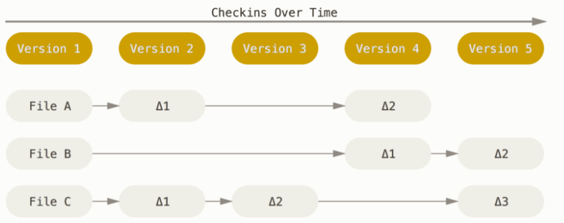

### 2.2 Git 的快照设计

虽然基于 diff 的设计很简洁和直观，但是 git 并没有采用这种方式，他用的是一种基于快照的设计，说白了，就是最开始提出的那种“一个版本对应一个完整的项目内容”的思路，如下所示：

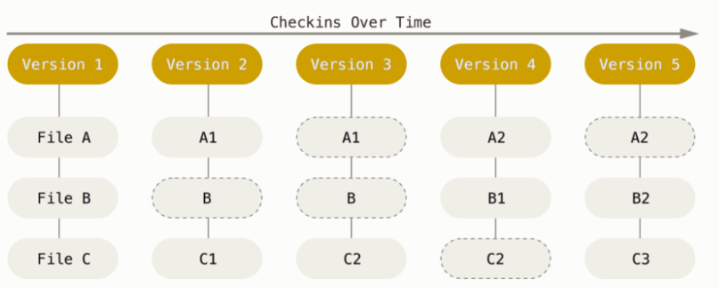

这种看似蠢笨的方法相比于 diff 方式也是有优势的，其优势就在于分支管理上。分支管理的本质是并行开发，所以采用这种设计本身也是为了服务 linux 这种高强度并行开发项目。

按照 progit，他说之前的版本管理工具在创建分支的时候会重新复制一遍代码（相当于也是快照），在合并分支的时候很难考虑清楚分支应该如何合并，因为 diff 保留的信息很少。我倒觉得这并不是因为这个原因，虽然这确实是之前版本管理工具的缺点，高昂的快照代价让分支操作变慢，但是这更像是 git 的另一个特性，即**分支引用模型**可以解决的问题，而非**快照设计**解决的问题。

我觉得基于快照的方式相比于基于 diff 的优势在这里：

- 各种操作速度更快：因为基于 diff 的设计，在恢复版本的时候，需要累积运算，当版本历史拉的很长时，就会导致效率极低。而给予快照的方式，其实并不关心中间版本的状态，而只需要关注两端的状态即可，无疑是极快的（就像积分一样）。
- 在某些意义上更直观：正如上面举例的，我们最先想到的就是的版本控制设计思路就是基于快照的，在理解上，意识到每个版本都是对应一个项目的，也是一件比较直观的事情。
- 空间占有上并非一无是处：比如说如果一个文件反复的增删同一行 100 次，那么就有 100 次 diff，而实际上这个文件只有两个状态，记录 100 次 diff 空间要更多。不过虽然构造了这种特殊的例子，但是也不得不说基于 diff 的方式就是省空间的，而快照的优势，正是一种“空间换时间”的设计思路。
- 对于二进制文件，diff 不太好进行。

当然 git 也没有傻傻的消耗空间，它提出了两个举措来解决这个问题：

- 当文件没有发生更改时，是归档记录的还是原来的文件。这样减少了重复文件的空间。但是需要注意，即使文件只改了一个换行符，都会重新生成一份文件。

- 定期将文档库打包，被打包后的版本，就也变成了基于 diff 的形式了。而且 diff 的基准版并非最开始的版本，而是打包时最新的版本，这样多次打包就会形成多个基准版，这些基准版不会导致 diff 的大量累加，而是在固定几个基准版累加（这个优化已经很像是差分和前缀和的高难度算法优化了）。这个过程涉及的命令如下：

  ```shell
  git gc # 主动对版本库打包
  .git/objects/pack/ # 存储打包文件的路径
  git verify-pack -v .git/objects/pack/pack-[xxx].idx # 查看打包文件
  ```

在谈完二者的对比后，还是要强调，其实这两种方式都是人们逻辑上需要的：当我们去想要某个特定版本的项目时，我们会用快照的方式去思考版本管理；当我们去思考某个特定版本造成的影响时，我们会用 diff 的思路去思考。所谓的设计思路，只是底层的实现思路，在更靠近用户的一侧，基于 diff 的工具会用累加来模拟出快照功能，给予快照的工具会用差分来模拟出 diff 功能。

### 2.3 总体结构

git 的结构被称为“三棵树”，示意图如下：

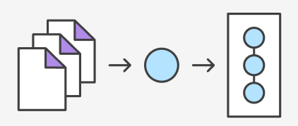

我觉得这幅图最好的就是它明确强调了这三个部分的结构并不相同：

- 左侧是工作目录（working directory），也就是我们平时的项目区域。
- 中间是缓存区（staged area），担任左右两侧的缓冲区，下次个版本就在这里生成。
- 右侧是版本库，里面储藏着很多个版本。分支功能和远程功能都是在这里实现的，可以说只有这里储存的东西具有永久性。

### 2.4 版本库结构

版本库结构涉及两个部分：

- 提交（commit）：也就是版本的文件实体组成，主要在 `.git/objects` 
- 引用（reference）：构成了靠近用户侧的分支模型，主要在 `.git/refs`

在这一节我只打算介绍提交的内部，因为其实这个部分和使用 git 关系不大，因为它过于底层了，而且封装的很好（只是这一层）。从上层看上去，一个提交就是一个版本，也就是一个项目的快照。而至于这个快照内部的结构，其实了解了也不能更好的使用 git。

**git 其实自己实现了一个特化的文件系统**，这个文件系统可以方便实现“相同内容相同路径的文件只缓存一次”的进阶版思路的。

为了达成这个目的，那么我们必须有办法快速比较两个文件是否是相同文件。我们采用的方式是用文件内容生成一个 SHA-1 散列数，只要内容不同，那么生成出来的散列数就不会相同。我们进行比较的时候，就可以通过比较散列数（40 个 16 进制数）来比较文件的内容。本质上是一种压缩过的比较。这种思路下，我们构建了 SHA-1 到文件内容的映射。这种普通文件，在 Git 中称为 Blob，类似于普通文件系统中的文件。

更进一步，这样只是可以区分文件的相同与否，并不完全实现了快照功能，我们还需要一种类似目录的实现来记录项目结构。我们并不能使用原来的文件系统功能，虽然现在想来似乎可以使用链接的手段组织文件，但是这和 SHA-1 又有了差别，所以 Git 自己构造了自己的“目录文件”，被称为 Tree，Tree 负责记录一组“文件名 -> SHA-1 Number”键值对。可以看到，这基本上和 Ext 文件系统的目录实现类似了，Ext 文件系统记录的就是 “文件名 -> Inode Number” 键值对。当然了，为了嵌套目录的要求，Tree 必须也可以被 SHA-1 Number 检索，就像目录文件也要对应 Inode Number 一样。

当有了 Blob 和 Tree 以后，我们就已经可以构造出一个项目结构了，比如说对于这样的一个项目结构

```shell
.
├── bak
│   └── test.txt
├── new.txt
└── test.txt
```

我们构造出来的结构就是这样的（基本上就是一模一样）

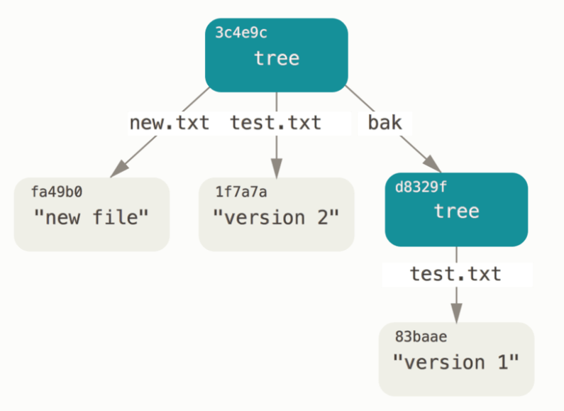

但是这种结构还缺少一些一些地方储存版本的元信息（比如说“提交时间”，“提交者”，“作者”），同时也很难记录分支信息，所以我们又实现了一个 Commit 结构，来储存上面我说的信息，同样的，他们也是可以被用 SHA-1 Number 检索到的。最终的结构就像这样

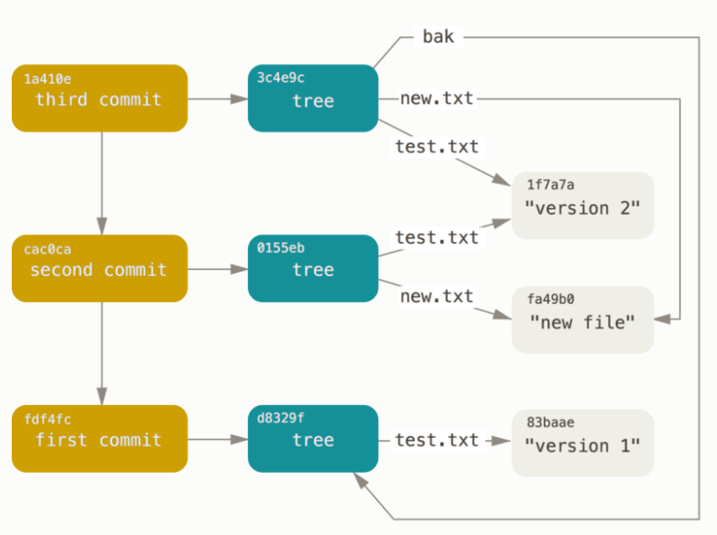

我知道我说得有些快了，所以再来重新梳理一遍。

版本库维护了一个根据内容寻址的数据库，其中 key 是 SHA-1 Number，value 是 Object，如下所示

```cpp
objects = map<SHA, Object>;
```

Object 可以分成三类：Commit（版本库元数据和分支信息），Tree（目录文件），Blob（普通文件）

```cpp
type Object = Commit | Tree | Blob;
```

在具体介绍这三种文件前，我想介绍一下如下命令，他可以打印出 Object 的内容，因为所有的 Object 都是压缩二进制文件（为了节省空间），所以需要这条命令当做阅读器，其中的 `-p` 选项是 `--pretty` 的意思，自动识别 Object 类型

```shell
git cat-file -p <SHA-1 Number>
```

我们之后会用这条命令查看 Object 内容。

Blob 就是普通文件的意思，我们用 `cat-file` 查看，可以得到如下内容

```shell
$ git cat-file -p d670460b4b4aece5915caf5c68d12f560a9fe3e4
test content # 就是文件内容
```

它的抽象结构如下所示：

```cpp
type Blob = array<byte> // 二进制文件
```

Tree 用 `cat-file` 查看，可以看到如下内容

```shell
$ git cat-file -p "master^{tree}" # 查看 master 对应的根树
100644 blob a906cb2a4a904a152e80877d4088654daad0c859      README
100644 blob 8f94139338f9404f26296befa88755fc2598c289      Rakefile
040000 tree 99f1a6d12cb4b6f19c8655fca46c3ecf317074e0      lib
```

前面的部分 `10644, 040000` 似乎是一些权限元数据，后面的则是 `filename -> SHA-1 Number` 的映射。

它的抽象结构如下：

```cpp
// 一个包含文件和目录的目录
type Tree = map<SHA, Tree | Blob>
```

Commit 用 `cat-file` 查看，可以看到如下内容：

```shell
$ git cat-file -p 559bf47
tree 5a82eeca5c9c745be2d8a32681a0fa123a504d47
parent 55f900dc51104b73b0fed8d5e1f6b59c98d44231
parent b0376e80fbd945c25273600a0907f4a8a87aa92f
author Thysrael <2470583476@qq.com> 1685070332 +0800
committer Thysrael <2470583476@qq.com> 1685070332 +0800
```

可以看到里面有记录作者和提交者元数据，同时对应某个项目的根目录 Tree，同时还有两个 parent 数据用于记录分支数据，2 个 parent 说明这是一个合并点。

它的抽象结构如下：

```cpp
// 每个提交都包含一个父辈，元数据和顶层树
type Commit = struct {
    parent: array<Commit>
    author: SHA
    message: SHA
    snapshot: Tree
}
```

此外，所有的 object 都会以 SHA 为索引存储在 `.git/objects` 中。

### 2.5 缓存区结构

在开始介绍之前，不得不说，最让人困惑的其实是名字，这个中间的结构其实有很多个名字，比如说 staged，index，buffer。都是指向这个结构。

在实现上，缓存区只依靠二进制文件 `.git/index` 。，我们可以用入下命令来查看这个文件的结构

```shell
git ls-files --stage
```

我们查出来以后是这样的

```shell
100644 83baae61804e65cc73a7201a7252750c76066a30 0       bak/test.txt
100644 25da366300d98fba739b1912fd91cd267ee644fb 0       g.txt
100644 fa49b077972391ad58037050f2a75f74e3671e92 0       new.txt
100644 40207989ba26423b2d8ac4bd3dab5d69cb60e49e 0       repo.rb
100644 a4cfb9c22dbd7aa74e6cceb7a95b884e605460b7 0       s.txt
100644 1f7a7a472abf3dd9643fd615f6da379c4acb3e3a 0       test.txt
```

这个结构会记录所有的 Blob 文件，也就是在加入缓冲区的时候（`git add`）就已经回在版本库里生成（不知道如果撤销的话会不会删去）。这其实有一些反直觉，我还以为 index 中也会维护一个 Tree 结构的快照呢，但是并没有。

缓存区有两个作用，第一个是可以使工作目录可以分批次提交。如果工作目录中做了多个目的的更改，那么可以分配次提交到缓存区，再分批次提交到版本库。虽然我平时每次都是 `git add .` 一股脑提交，但是不可否认，这种设计会使得 Commit 变得更加细粒度，从原来的“项目整体有了很大的改变”到“项目的某个功能有了改变”。这种方式更加方便了之后的 `cherry-pick, rebase` 等改写历史或者检入检出操作。

不过我一直对这种想法嗤之以鼻，因为缓存结构并不必须，在之前的版本控制工具中都没有，而且提出它对于工具的使用引入很大的难度：开始出现 working dirctory 和 starged area 的一致性问题。后来我在网上看到了一种解释，我觉得说得还算有道理。

它是这样说的，当我们去查看版本库时（比如说 diff），我们实际上是在进行了一个 $O(n)$ 的查找，其中 $n$ 是项目最深的目录层级，比如说 `a/b/c/d.txt` 这个文件，我们去版本库里查找的时候，就需要先找 `a` 对应的 tree，读出 `a` 中的 `b` 的 SHA，然后再去找 `b` ，在 `b` 中查找 `c` 的 SHA，如此循环，一共需要查找四次才能读出 `d.txt` 中的内容，考虑到这些 Object 都是被压缩了，所以读取会比较慢。

index 像是一个 cache 一样，会记录所有修改的文件的路径，和其对应的 Blob SHA，这样查找操作的时间复杂度就会被降到 $O(1)$ 。在上面的命令中也可以看出这样的效果。这也是 index 没有维护树状结构，而是维护一个“路径 -> SHA”键值对组的原因。

----


## 三、对三棵树进行管理

这章和前一章联系联系比较大，主要涉及关于 Git 三个区的相互作用和变换。说白了就是“将工作区新写的版本检入（checkin）到版本库中“和将写好的版本检出（checkout）到工作区中“两件事情。也就是如下图所示：

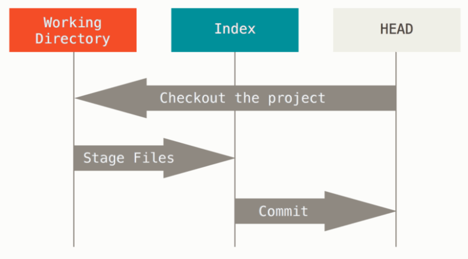

### 3.1 锁

这里有一个很有趣的事情，就是在 git 中，是有 `checkout` 操作，但是没有 `checkin` 操作的，其实 `chekin` 应该是被 `git add, git commit` 代替了。

我个人觉得因为检入和检出操作是非常 old fashion 的，它应该是用于描述一种“单源并发”的数据库，每个人检出某个文件进行修改，在修改前需要先给这个文件（或者某个版本）加锁来确保其他开发者不会修改它，然后在修改完成检入的时候再释放锁。所以检入和检出操作都伴随着锁的争夺和释放，那么就是两个很对称的操作。

但是 git 是无锁的结构，所以这两个操作就并没有那么对称了。

### 3.2 HEAD

虽然我希望在之后统一介绍分支模型，但是这里还是需要先介绍一下 HEAD 这个特殊的引用，他被记录在 `.git/HEAD` 中，这是一个文本文件，我们用 `cat` 就可以查看它

```shell
$ cat .git/HEAD  
ref: refs/heads/main
```

可以看到，它指向了 `main` 这个引用（引用就是 commit 的指针），但是如果考虑指针分离的情况，他也可以是 commit 的 SHA

```shell
$ cat .git/HEAD         
2882470dab805f981534776ae607e01710bc251c
```

也就是一个直接引用。

HEAD 可以看做我们当前聚焦的版本库中的版本，如果我们选择检入，那么新的版本就会成为当前版本的孩子，并且 HEAD 会指向新的版本，当检出时，我们可以根据 HEAD 所在的版本进行相对寻址。

HEAD 的相对寻址有两种方式，其实本质就是在描述一个有向无环图的感觉，其中两个标志，一个是 `~n` 表示第 n 重父版本，也就是纵向关系，比如 `~2` 就是祖父提交，`~3` 就是曾祖父提交。另一个是 `^m` 表示第 m 个父版本，也就是横向关系，比如 `^1` 就是父版本，`^3` 就是三叔版本。这两种方式也可以结合起来，比如说 `~2^5` 就是五曾爷爷。有了这种方式，我们就可以寻找到与 HEAD 有亲缘关系的所有祖先。

### 3.3 reset

reset 其实是分为三个模式，三个模式分别表示修改的范围：

- soft，只会修改 HEAD 指针的指向。
- mixed，修改 HEAD 和 index。
- hard，修改  HEAD，index，Working Directory

我们来举一个例子，下面是没有运行 reset 时的情况：

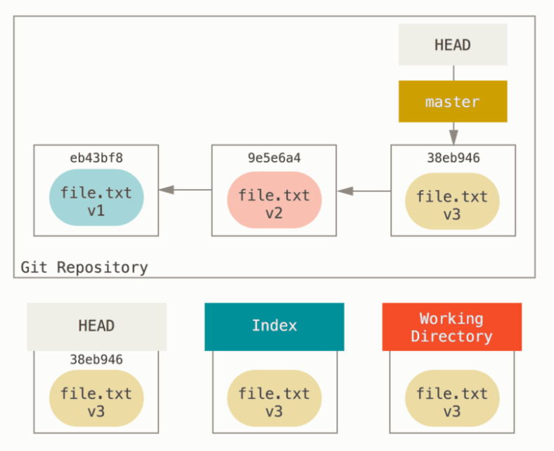

如果我们运行 `soft`，那么效果如图：

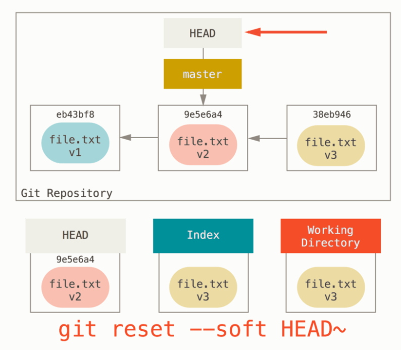

可以看到此时 HEAD 回退了一个版本，如果此时再 `git commit`，那么就可以重新提交一遍 V3 了，这个功能相当于可以刚刚提交的版本不太满意时（或者需要压缩提交时），可以用这个，类似于一个更加本质的

```shell
git commit --amend
```

另外还有一种应用，是当提交错分支时，我们可以进行如下操作

```shell
git reset --soft HEAD~ # 在版本库中撤销之前的错误提交，但是保留了 index 和 work dict 的修改
git stash # 将 index 和 work dict 的修改压栈
git stash pop branch name-of-the-correct-branch 在正确的分支上弹栈
# 在正确分支上提交
git add . 
git commit -m "your message here";
```

如果我们运行 `mixed`，这也是默认模式，那么效果如图：

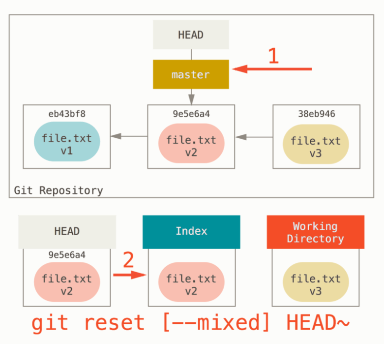

这个我没有想好太典型的应用。

如果我们运行 `hard`，那么效果如图：


大部分教程都会强调 `hard` 的危险性，这是因为在前两种模式下，我们总是保留着项目的 V3 版本的，但是如果是 `hard`，那么就会导致 V3 版本的彻底丢失。不过依然是可以使用 reflog 进行找回的。

当然没人要求必须采用相对寻址的方式，也可以直接使用 SHA 进行寻址。

reset 除了整个版本回退，也可以完成部分文件的回退，其指令格式如下

```shell
git reset [commit] [file-path] [-p]
```

这里需要强调，此时不能指定格式，只能是 `mixed` 模式。

这种方式下，我们并不会改变 HEAD 指针的指向（因为 Commit 是最小的版本控制单位），我们只会修改 index，所以这个命令在我看来约等于没有用，因为它并不修改工作目录，我并不太习惯这种东西，而且似乎如果希望让 index 覆盖 working dirctory，我没有找到对应的 git 命令，非常遗憾。后面还会讲一个基于 `git checkout` 的方式，会修改 index 和 working dirctory，感觉较为自然，不过似乎也可以用 `git show` 来手动记录。

`-p` 参数如果指定，那么就可以按照 diff hunk 来 reset，是比文件更小的粒度。

### 3.4 checkout

同样，`checkout` 也有改变 Git 三棵树的能力，在版本粒度上，`git checkout <commit>` 的效果和 `git reset --hard <commit>` 对于三棵树的效果类似，都会修改 HEAD，Index 和 Working Dirctory。

但是 `checkout` 还有有两点重要区别的：

首先，`checkout` 只会移动 HEAD，而 `reset` 不止会移动 HEAD，还会移动 HEAD 指向的引用，在上面的例子中，HEAD 指向 `master`，`master` 指向 `38eb96` 这个版本，当使用 `reset` 时，不仅 HEAD 指向了 `9e5e6a4` ，而且 `master` 也指向了这个版本。效果示意图如下所示：

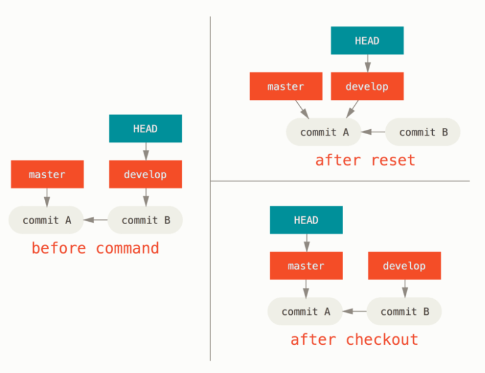

这也是 `checkout` 会造成指针分离的原因（因为它不带着分支指针移动）。正是因为不带着分支移动，所以 `checkout` 并不会丢失其子版本信息（因为这时的子版本会被原来的分支指针指向）。当然并不是“安全”就是好的，“安全”同时也意味着操作会更加受限制，比如这里的 `checkout` 就不再能随心所欲的移动分支指针了。

其次，`checkout` 对于 Working Dirctory 是“安全“的。在 Git 中的安全指的是不会不加确认地丢失已经做出的修改（无论修改在哪里），我们说 `reset --hard` 是不安全的，是因为他会丢失目标子孙版本（因为 commit 只记录 parent，不记录 child），同时还会丢弃 Working Dirctory，但是 `checkout` 并不会这样，他会检查工作区的文件，并不会强行替换。

后来又看了看如何在文件级别实现检出，如下图所示（似乎命令中的 `--` 可以省略）：

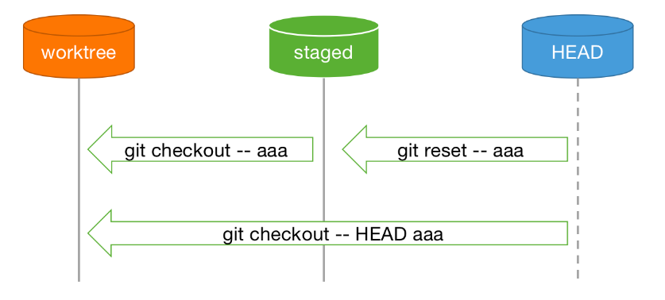

当有了新版本的 `restore` 之后，格式如下

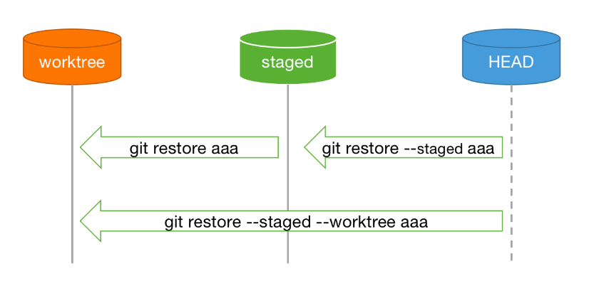

不过似乎也没有办法指定版本还原（或者说比较自然的做到）。

### 3.5 stash

stash 给我感觉像是一种对于当前 index 和 working dirctory 的打包，而且是极其快速的打包，他会将所有被追踪的文件都打包了然后将 index 和 working dirctory 还原成和 HEAD 一致的状态。所用的命令如下

```shell
git stash
```

当然如果希望也打包进未被追踪的文件，那么可以用

```shell
git stash -u
```

更加具体的选项如下图所示：

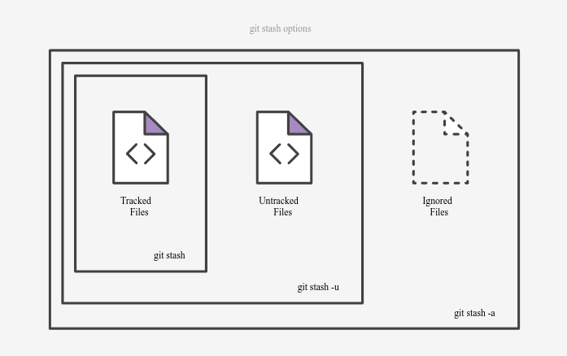

打包好的文件会被存放到一个栈中，我们可以用如下命令查看栈中内容

```shell
$ git stash list                                                                                           
stash@{0}: WIP on main: 07169fb Gorgeous
stash@{1}: WIP on main: 07169fb Gorgeous
```

我们可以用 `stash@{n}` 来描述特定的打包。

> 另外介绍一下 git 中的 `@{}` 语法：
>
> 在Git中，`@{}` 是一种特殊的语法，用于引用不同的Git引用（如分支或标签）的历史位置。这个语法通常与一些Git命令一起使用，以便更轻松地引用不同的提交和引用。
>
> 1. **`HEAD@{n}`**：这个语法用于引用相对于当前`HEAD`的历史位置。例如，`HEAD@{1}` 表示 `HEAD` 指针的上一个位置，而 `HEAD@{2}` 表示 `HEAD` 指针的上两个位置。
> 2. **`<branch>@{n}`**：这个语法用于引用特定分支（或其他引用）相对于其历史位置的提交。例如，`mybranch@{1}` 表示 `mybranch` 分支的上一个位置。
> 3. **`<refname>@{date}`**：您可以使用日期来引用特定日期之前的提交。例如，`mybranch@{yesterday}` 表示 `mybranch` 分支在昨天的位置。
> 4. **`<refname>@{<time>}`**：这个语法用于引用特定时间之前的提交，时间的格式可以是绝对时间（如`2022-01-01`）或相对时间（如`2.days.ago`）。例如，`mybranch@{2022-01-01}` 表示 `mybranch` 分支在指定日期的位置。

正因为是栈结构，所以我们可以 `pop` 来在当前分支上应用打包文件

```shell
git stash pop
```

这种方式甚至可以有更加高级的玩法，比如说可以将 pop 指定分支（即使这个分支并不存在），其写法如下

```shell
git stash branch <new-branch> [stash-id]
```

这就很符合我的习惯，我一般都会在 `main` 上改一下，之所以不新开一个分支修改，是因为不确定某个 feat 能否写出来，而已经写出来的 feat，又懒得再换一个分支写一遍了，这就导致经常搞乱 `main`。现在可以现在 `main` 上写，然后并不提交，然后换一个分支提交。

当然上面这两种方法会导致弹栈，如果不希望弹栈，那么可以用如下命令选择 stash 包

```shell
git stash apply stash@{n}
```

如果希望丢弃某个版本，那么也可以使用如下命令

```shell
git stash drop stash@{n}
```

这个命令也很有用，还是上面的场景，如果我在 main 上开发一个分支并且搞乱了，那么我可以这样干进行 index 和 working dirctory 的还原：

```shell
git stash
git stash drop
```

如果希望清除所有的是打包，可以使用如下命令

```shell
git stash clear
```

在实现原理上，git stash 本质也是利用当前的修改构造出一些版本，并且记录下来，如图所示：

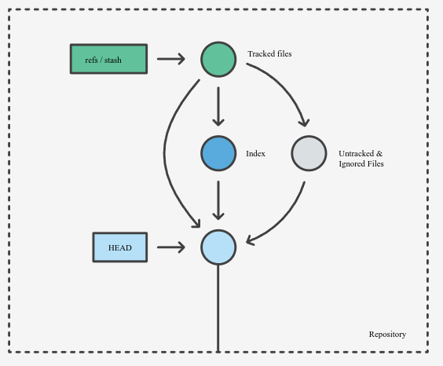


### 3.6 rm

`git rm` 这个命令的效果有两个：

- 在 working dirctory 中删除这个文件
- 在 index 中删除这个文件（之后提交的版本就没有这个文件了）

基本上这个命令是没有作用的，因为在删除完了以后直接 `git add .` 就可以完成了，没必要特地用这个命令。

但是下面的命令很有用

```shell
git rm --cached <file>
```

这个命令可以只在 index 中删除文件而不在 working dirctory 中删除文件。

考虑这样的场景，我 commit 的一个本应在 `.gitignore` 中忽略的文件 `file.txt`，在下一次 commit 中我不希望在包含这个文件，但是我依然希望它出现在 working dirctory 中。

正常考虑就是在 `.gitignore` 加入 `file.txt`，但是 `.gitignore` 只能保证 untrack 的文件不会被 track，并不能将已经被 track 的文件（也就是情景里的 `file.txt`）自动 untrack，所以这个时候就可以使用命令

```shell
vim file.txt # 确保 git add 不会自动追踪
git rm --cached file.txt # 确保 index 中有删除
```

就可以满足效果。

### 3.7 clean

`git clean` 可以清除从 working dirctory 移除未被追踪的文件，如果考虑想要移除的内容是可以不在工作区保留的（比如说编译产物），那么这个命令可以和

```shell
make clean
```

类似，但是很可惜，有些未被追踪的文件是需要长久在工作区存在的（比如私人配置文件），如果移除了就不能正常工作了，所以这个命令也不是很好用。

---


## 四、分支

### 4.1 引用

引用（reference）模型是 Git 分支模型的底层实现。引用模型不仅实现了分支模型，还实现了诸如 tag，stash，remote 等功能，都是利用了引用来描述实现的。引用是在 `.git/refs/` 文件夹下，里面有许多子文件夹和文本文件。

引用的本质是指针，这个指针可以指向 Commit，也可以指向另一个引用（比如 HEAD 在指针未分离的状态下，就是指向分支引用或者 tag 的）。其具体的实现方式就是利用一个文本文件 `refname` 去记录其指向的 Commit 的 SHA Number 或者另一个 `refname`，其实现跟符号链接有异曲同工之处。

因为功能的不同，引用也被分为了很多种：

- 本地分支引用
- 远端分支引用
- HEAD 引用
- tag 引用
- stash 引用

在这里，我们主要聚焦于本地分支引用的介绍。在分支的实现上，**“居然用一个指针表示一个分支”**，指针是“一个”，而分支是“一串”。在我刚刚了解这个模型的时候，对于下图这种结构，充满了不解：

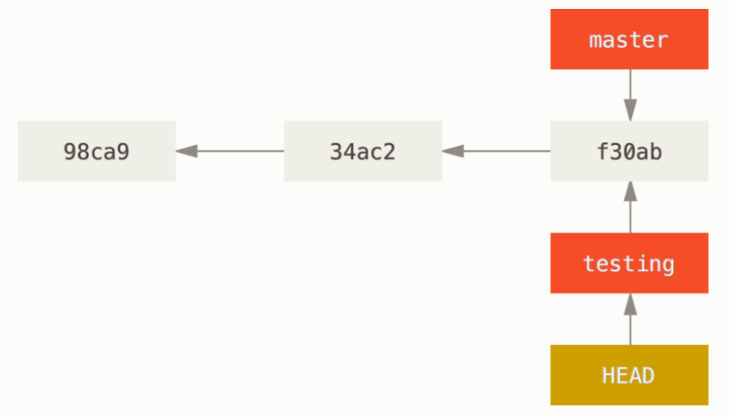

这个图上明明只有一个“分支”（没有分开的枝条），但是却有两个分支引用，也就是说，在 Git 看来，这是两个分支。

如果是之前的一些版本控制软件，并不会发生困惑，这是因为生成分支的方式是直接复制一份项目内容，然后再新复制好的内容上开发。这就是真的“分支了”，有一种 fork 的感觉。

但是 Git 并没有采用这种方式，这种复制一个镜像的方式无疑是低效的。Git 为了鼓励分支，提出了这一种分支就是一个引用的设计。那么这样是否合理呢？我个人觉得细想下来是合理的。用一个指针描述一组数据结构的现象并非不可理喻，比如说数据结构中的链表，就是用一个头指针代表整个链表，其中头指针发挥着 handler 的作用。事实上，很多复杂的数据结构，直接表示全体是不切实际的，往往都是用一个 handler 来表示结构的。

那么分支引用时候可以作为一个分支的 handler 呢？如果要讨论这个问题，必须要思考一下啥是分支。我个人觉得，分支一条独立的、线性的版本链，说白了，就是一个链表结构。所以用一个指针指向这个链表的最新节点，同时保证每个提交都可以追溯他的父版本，那么这个指针就等价于链表的头指针了，用头指针表示链表结构，并无不妥。

说得更加玄学一点，分支诞生是为了一个开发的需求，分支的意义在于记录这个开发需求上的所有编辑操作。Git 构造出的有向无环图在最新子代（也就是分支引用指向的地方）处进行图搜索，搜出来的版本集合对应且仅对应了造成当前版本的所有编辑操作。没有搜索到的版本就是对当前版本的存在没有贡献的版本，搜索到的版本都对当前版本有贡献。这个很美妙的性质确保了分支引用的合理性。

### 4.2 branch, checkout, commit

虽然分支操作都是很好理解的，但是还是回顾一下来体会 Git 分支模型的奇妙。

首先创建一个分支本质上就是创建一个引用，并不会进行复制，如下所示

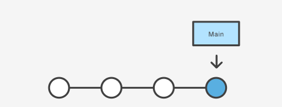

当执行 

```shell
git branch crazy-experiment
```

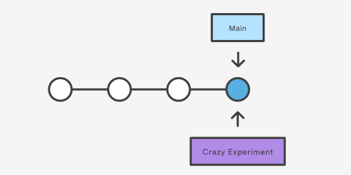

就会变成上面这样。

新建一个分支引用还可以发生在将版本库中的内容取出放到工作区

然后我们来看删除操作，对于一个常见的分支图

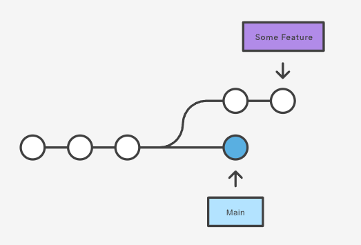

如果我们执行

```shell
git branch -d some-feature
```

那么紫色的分支引用就会被删除，看上去似乎并没有起到删除靠上的整条分支的作用，但是实际上我们已经没有比较方便的办法去查阅靠上的分支上的版本了，这是因为 Commit 只记录 parent 的特性，分支引用就是头结点，删掉头结点，那么其对应的链表就丢失了。

当然也不是完全抢救不回来，我们可以用靠上的分支上版本 Commit SHA 直接检索版本，但是说到底，已经不再优雅了。

所以在删除分支前，需要确定能否还能通过其他分支引用（当然 tag 引用也行）检索它所对应的版本。常规的来说，在分支合并后，就可以删除了，因为合并的本质是这样的：

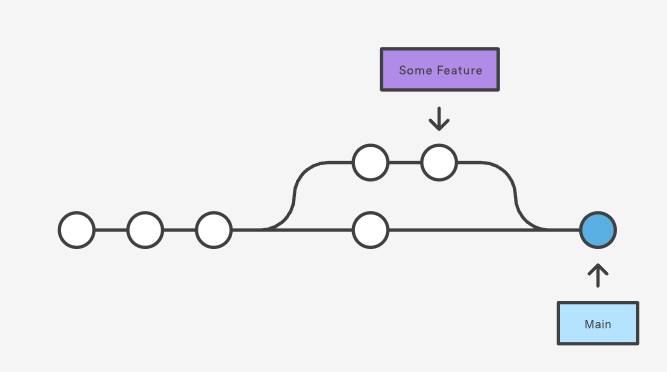

此时即使删除了紫色引用，我们依然是可以通过 `main` 这个分支引用查询到上方分支版本的。

分支切换的本质是 HEAD 指针的移动，比如说我们有这样的版本库

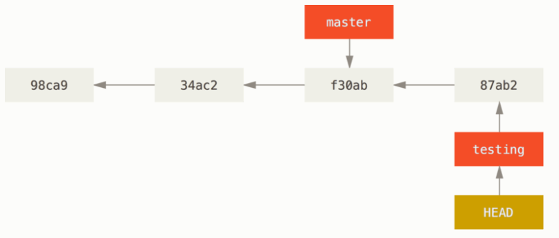

当我们使用命令

```shell
git checkout master
```

会发生如下变化：

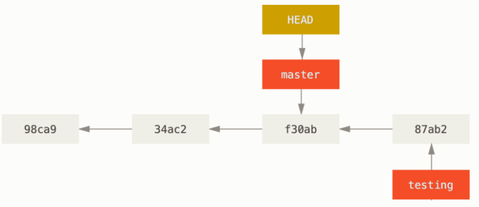

HEAD 指针会从“指向 testing” 变成了“指向 master”。

当发生 commit 的时候，本质是 HEAD 和其指向的分支一起向前移动，在上图的基础上继续操作，在 master 上提交一个版本，效果如下：

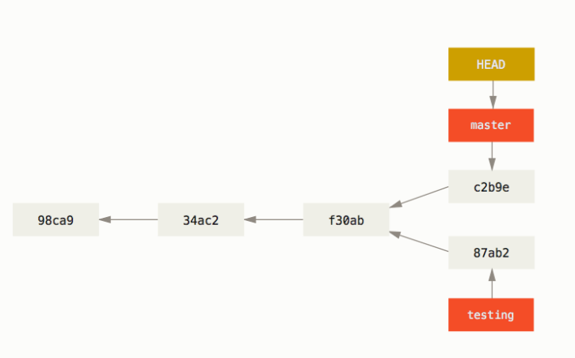

这里吐槽一句，`checkout` 这个名字起得并不好，因为 checkout 应该指的是“将版本库中的内容取出放到工作区”这个行为，在 git 中其实对应的是 `reset --hard` 或者 `checkout <file>` ，而移动 HEAD 分支并不算是 checkout，所以在 Git 较新的版本中，将“移动 HEAD”的行为也绑定到了 `git switch` 上。

### 4.3 diff

接下来我们要介绍分支合并，在介绍分支合并之前，我希望介绍一下 diff。因为基于快照是不太好理解分支合并的。虽然 Git 在分支模型上使用的是快照模型，但是在分支合并的时候，其实现和原理都是 diff 模型。

diff 说的是，将一个个版本视为对前一个版本的差异，或者说一个版本，就是记录一些在原版本基础上的编辑操作。一个分支就是一串操作，通过累加应用这一串操作，就可以使得项目获得某个新的 feature。

diff 之所以适合分支合并，是因为分支合并的本质是将不同分支所代表的不同 feature 融合在一起。如果按照快照的思路，那么其实是很难实现的，两个不同版本是很难合并成一个版本的（这种设计思路对应的是两路合并，会在下文进行讨论）。相反，diff 的粒度更细，而且更合理，我们可以总结对比出为了开发这些 feature 都需要进行那些 diff，这些 diff 是否冲突，然后就可以将所有的 diff 一起应用，就获得了融合版本。

diff 这个需求并不是 git 的独创，git 借助了外部工具的帮助，不过 git diff 的结构还是有的一说。我们将对于一个文件中的某个区域的修改称为一个补丁（patch），这是一种比文件颗粒度更小的修改：

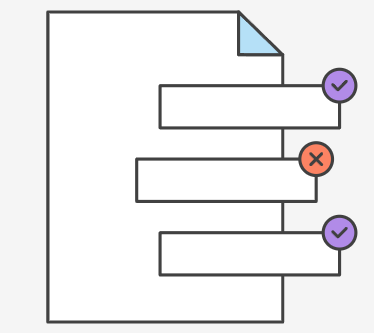

diff 针对就是这种补丁，它用一个 diff hunk 来描述这种补丁，其示例如下

```diff
index 5360b42..bd126d3 100644
--- "a/public/static/docs/\345\274\200\345\217\221\346\227\245\345\277\227.md"
+++ "b/public/static/docs/\345\274\200\345\217\221\346\227\245\345\277\227.md"
@@ -72,17 +72,3 @@
 
 - beta 阶段冲刺稳定版本 - UI 细节调整-
-### v0.2.1
-
-**发布时间：**2023.06.21
-
-**简介：** beta 版本迭代更新-
-**功能速览：**
-
-- beta 阶段优化跳转
-- 支持记忆化窗口
-- 优化 Vditor 复制操作
-- 解决latex补全、链接路径补全bug
-- 在所见即所得模式下, 当生成新的代码块时，自动聚焦到lang输入框中
```

解释如下：

```diff
index 5360b42..bd126d3 100644
```

上面的 index 说明了参与比较的双方 SHA 值

```diff
--- "a/public/static/docs/\345\274\200\345\217\221\346\227\245\345\277\227.md"
+++ "b/public/static/docs/\345\274\200\345\217\221\346\227\245\345\277\227.md"
```

这两行表示分别用 `-a` 和 `+b` 来区分参与比较的两个文件的不同内容

```diff
@@ -72,17 +72,3 @@
```

这个结构被称为 hunk header，这里的意思是，对于 `a` 版本（也就是 `-` 版本），参与的区域是从第 72 行开始的 17 行内容；对于 `b` 版本（也就是 `+` 版本），参与的区域是从 72 行开始的 3 行内容。之所以两者的内容不一样，是因为 `b` 版本做出的 diff 本来就是删掉 `a` 版本的一些行（也就是删除了 14 行内容）。

```diff
 
 - beta 阶段冲刺稳定版本 - UI 细节调整-
-
-### v0.2.1
-
-**发布时间：**2023.06.21
-
-**简介：** beta 版本迭代更新-
-**功能速览：**
-
-- beta 阶段优化跳转-- 支持记忆化窗口
-- 优化 Vditor 复制操作
-- 解决latex补全、链接路径补全bug
-- 在所见即所得模式下, 当生成新的代码块时，自动聚焦到lang输入框中
```

以 `-` 开头的行表示 `a` 版本有而 `b` 版本没有的，如果有 `+` 开头的行，则是 `b` 有 `a` 无的行。也可以理解为，将 `a` 版本删掉（用 `-` 表示）以 `-` 开头的行，增加（用 `+` 表示）以 `+` 开头的行，就获得了 `b` 版本。原来只是用来表示不同版本的 `+, -` 符号，也就有了语义。

总结一下

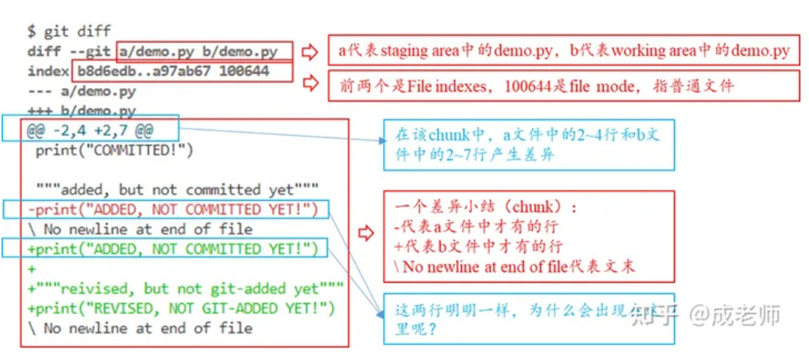

关于 git diff 的命令，有如下示意图：

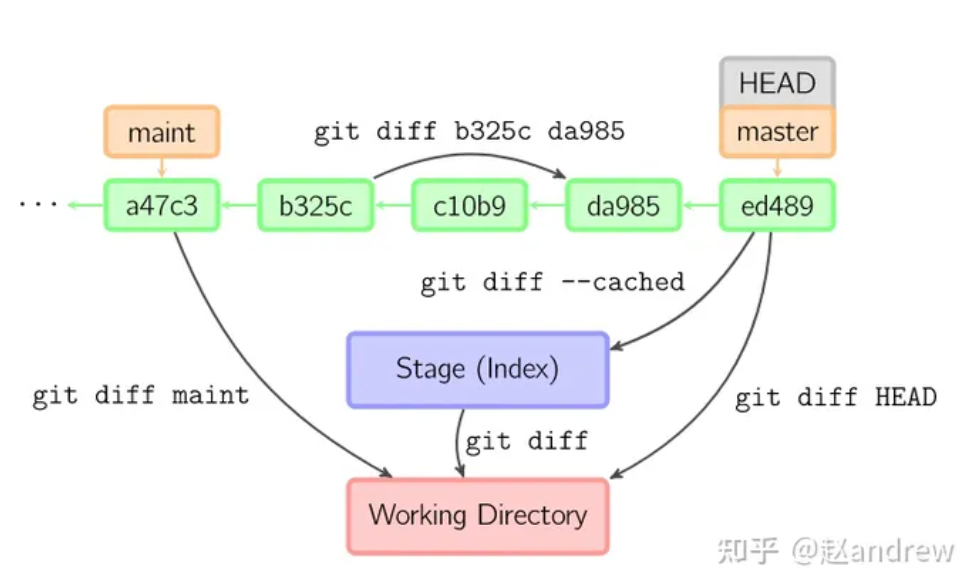

如果希望比较单个文件，似乎可以在版本比较命令后加上文件名即可。

### 4.4 merge

merge 可以分为两大类，一种是快进式的，在这种模式下，只有一个分支做出了改变，如下所示：

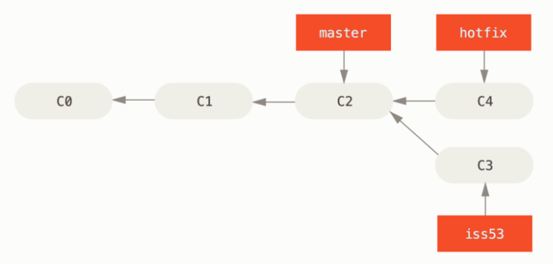

我希望合并 `hotfix` 和 `master`，那么本质只是将 `master` 移动到 `hotfix` 指向的版本，如下所示：

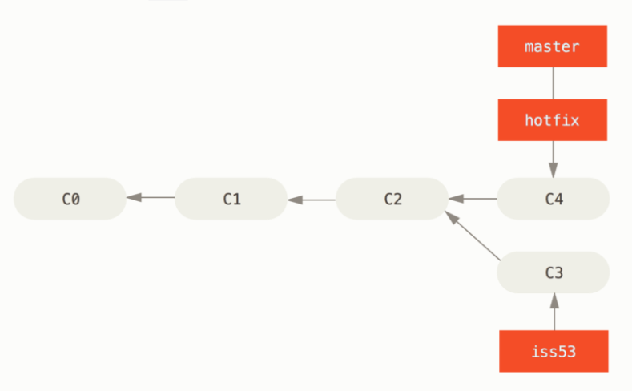

另一个就是三路合并（3-ways）式，也就是待合并的两个分支真的做出了不同的改变，那么就需要思考如何处理这个问题了。

我们首先考虑较为简单的两方合并，如下图所示：

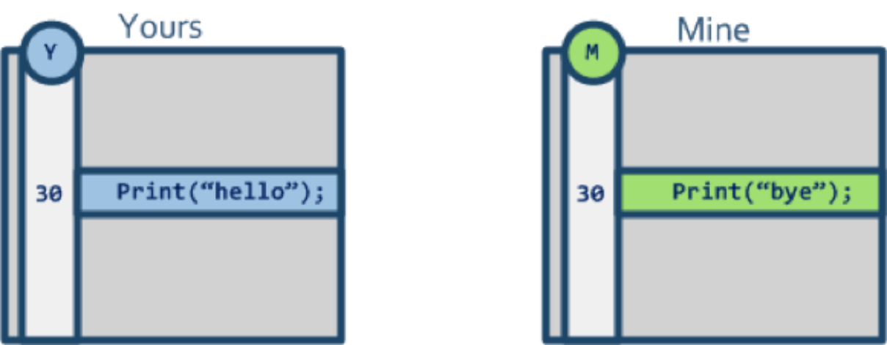

参与合并的一共有两个版本，在第 30 行出现了差异，那么应该如何去办呢？

实际情况有如下几种：

1. `Mine `版本没有修改，`Yours` 版本修改了内容（从`Print("bye")` 修改 `Print("hello")`)
2. `Yours`版本没有修改，`Mine`版本修改了内容（从`Print("hello")` 修改 `Print("bye")`）
3. `Yours`和`Mine`都修改了内容，（`Yours`从`???`修改成`Print("hello")`；`Mine`从`???`修改成`Print("bye")`
4. `Yours`和`Mine`都增加了一行

那么对应的策略就有如下几种：

1. `Mine`版本没有修改，`Yours`版本修改了内容 => 应该选`Yours`版本
2. `Yours`版本没有修改，`Mine`版本修改了内容 => 应该选`Mine`版本
3. `Yours`和`Mine`都修改了内容 => 需要手动解决冲突
4. `Yours`和`Mine`都增加了一行 => 需要手动解决冲突

但是非常不幸的是，仅仅比较两个快照，是根本得不出具体的情况的。

所以说以“2 个快照”为实现基础的两路合并并不现实，而三路合并，本质上是“2 个 diff”，则可以完美解决问题，其设计思路如下：

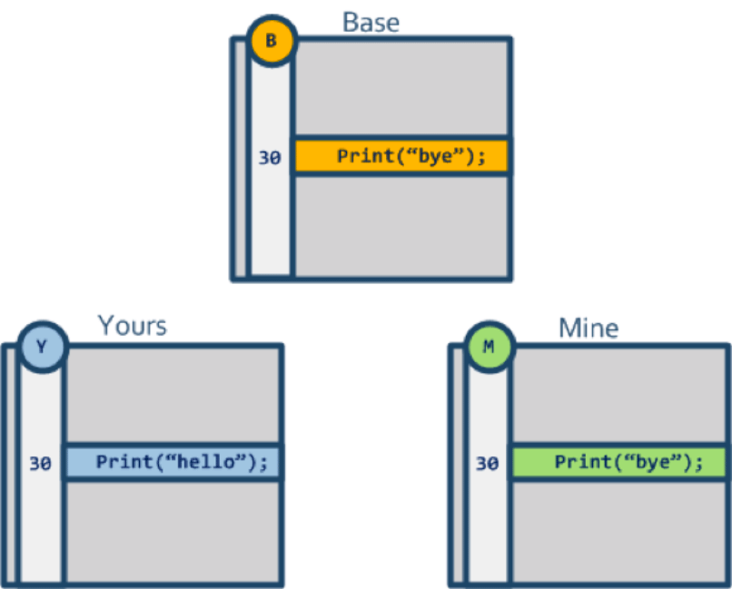

这时 merging 算法发现：

- 修改前的`Base`版本里的内容是：`Print("bye")`
- 在`Yours`的版本里内容是：`Print("hello")`
- 在`Mine`的版本里内容是：`Print("bye")`

说明`Yours`对这一行做了修改，而`Mine`对这行没有做修改，因此对`Yours`和`Mine`进行merge后的结果应该采用`Yours`的修改，于是就变成`Print("hello")`。

如果在版本库中表示，则示意图如下：

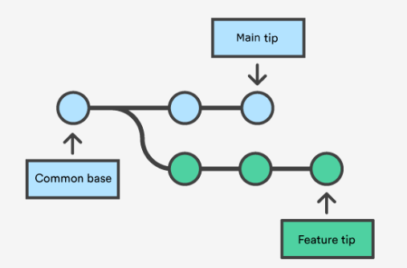

我们举一个例子：

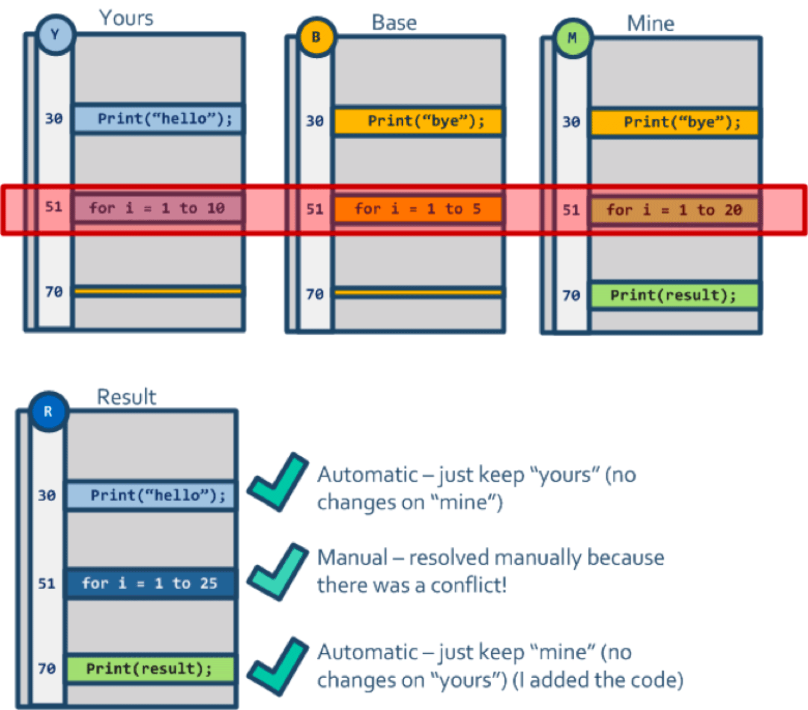

至此，关于 merge 的部分就介绍完毕了。不过需要强调的是，三路合并并不是 merge 的专属原理，cherry-pick 和 rebase 甚至是 stash apply 等操作都会导致三路合并的发生。

---


## 五、重写版本库

### 5.1 cherry-pick

cherry-pick 指的是在版本库中挑选一个版本，然后“重播”到当前 HEAD 版本之后，这样的效果就是，cherry-pick 会生成一个子版本，这个版本既有被 pick 版本的特征，也有 HEAD 版本的特征，相当于一次“繁殖”。示意图如下所示：

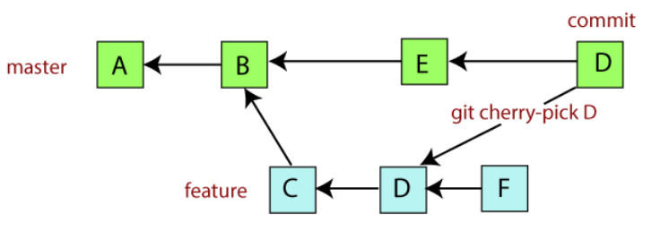

从这个描述上说，cherry-pick 发生了一次“合并”，而事实也确实如此。所以我们可以用三路合并的模板去思考一下这次合并的原理（用上面这张图）：

当我们在 HEAD 指向 E 时执行 `git cherry-pick D` ，则参与方如下

- ours：变更的接收者，是 E
- theirs：变更本身，是 D
- base：祖先，是 C

这里对于 base 是谁，还是有一个很有趣的认识的。因为从直观上来说，base 应该是 ours 和 theirs 的共同祖先，在上图中应该是 B，而 C 只是 D 的祖先，与 E 属于是兄弟关系，看上去并不能作为 base 来用。

如果 B 真的是 base 的话，那么考虑 $Diff_{DB}$ 就是 $Diff_{CB} + Diff_{DC}$，而不是 $Diff_{DC}$ 了，这与 cherry-pick 的设计就不符合了（我们只挑选指定 commit 做出来的 diff），所以为了获得单个版本的变更，所以我们认为 `base = theirs~` 。

严格意义上讲，cherry-pick 是安全的，因为被 pick 的版本并不会被删除。

### 5.2 rebase

rebase 可以看做是 cherry-pick 的多次循环。证据就是如果执行 `rebase -i` 的话，就会看到 rebase 的流程

```shell
pick c50221f commit B
pick 73deeed commit C
pick d9623b0 commit D
pick e7c7111 commit E
pick 74199ce commit F

# 变基 ef13725..74199ce 到 ef13725（5 个提交）
#
# 命令:
# p, pick <提交> = 使用提交
# r, reword <提交> = 使用提交，但修改提交说明
# e, edit <提交> = 使用提交，进入 shell 以便进行提交修补
# s, squash <提交> = 使用提交，但融合到前一个提交
# f, fixup <提交> = 类似于 "squash"，但丢弃提交说明日志
# x, exec <命令> = 使用 shell 运行命令（此行剩余部分）
# b, break = 在此处停止（使用 'git rebase --continue' 继续变基）
# d, drop <提交> = 删除提交
```

可以看到 git 会依次执行 `git cherry-pick B, git cherry-pick C, git cherry-pick D, ...`  。

在实际应用中，`rebase` 一般和 `merge` 去做对比，如果我们希望让某个 feature 分支并入主分支 master，可以执行如下命令

```shell
git checkout feature
git rebase master
git checkout master
git merge feature
git branch -d feature
```


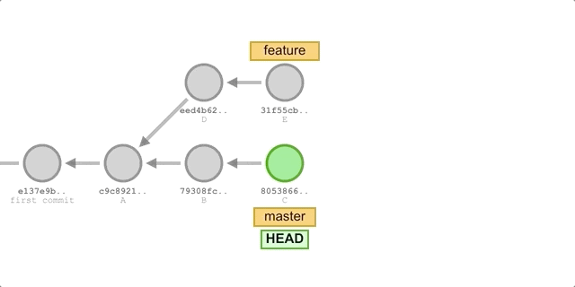

可以看到有两点和 cherry-pick 不同：

- rebase 的 ours 不是 HEAD，而是 rebase 的参数分支。
- rebase 在变基完成后，会将原来的提交删去。

### 5.3 amend

amend 是修正的意思，相比于 `rebase` 尤其是 `rebase -i` 可能没有那么强大的功能，但是却是一个很方便的功能。

如下命令可以将 index 中的修改添加到当前 HEAD 指向的版本中（默认行为是添加到 HEAD 的子版本中），同时修改当前版本的 commit message。

```shell
git commit --amend 
```

当然如果希望修改 commit message，也可以使用上面的命令。

### 5.4 reflog

正因为重写操作充满了风险，所以 `reflog` 就可以很好的缓解这个问题，reflog 可以显示某个引用（默认是 HEAD）的历史。

---


## 六、远端协作

### 6.1 远端库和本地库

在合作开发方面，git 也是别出心裁。它又了本地库的设置，也就是和其他人的同步并不需要发生在每次提交中，而是可以考虑在本地库中先存储，然后在有网络的情况下在提交到中心库。

查看当前的 remote

```shell
git remote -v
```

增加 remote

```shell
git remote add <name> <url>
```

删除 remote

```
git remote rm <name>
```

重命名 remote

```shell
git remote rename <old-name> <new-name>
```

http 是一种只可以读取的远端，没法进行推送。

### 6.2 中心仓库

中心仓库就是共用的版本库，是开发协作的中心。就是部署在服务器上的版本，有几点很有趣的：

中心仓库往往是 `bare` 的，也就是只有一个 `.git` 文件，这样可以避免 working dirctory 和 index 的冲突。

中心仓库的分支移动正常情况下只能通过 merge，而 merge 只能是快进式的。分支移动是通过 git push 实现的，当无法满足上面的条件时，就会发生 push 失败的情况。

### 6.3 pull

git pull 的原理是这样的

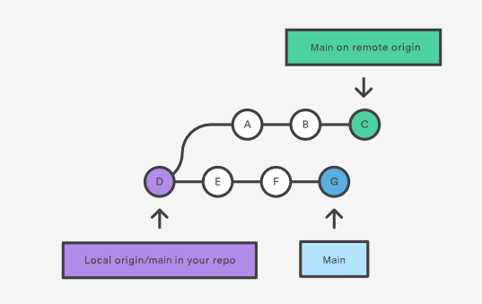

如果执行 merge 方式，则会得到：

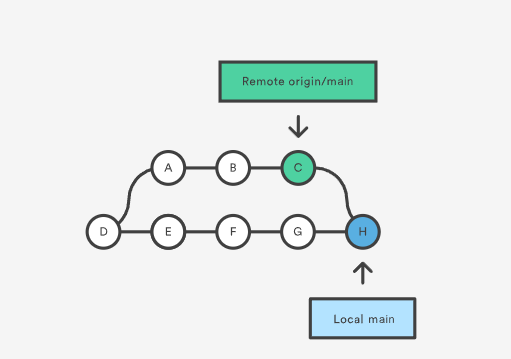

如果执行 rebase 方式，则会得到：

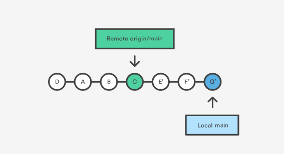

我觉得虽然 `git fetch, git merge` 的方式更加本质，

### 6.4 rebase 的问题

其实这里讨论的并不只是 rebase 的问题，而是一个很有趣的因为并行开发造成的一致性问题。正如前所述，中心化仓库的引用只能向前合并，所以是不支持删除提交操作的，除非提交时使用 `--force`（这是常见的，因为确实有的时候没办法干净利落解决）。

当使用 `--force` 时，如果删除了中心仓库的一些提交，而当其他人基于这些提交有一些新的提交的时候，事情就会变得很混乱，因为被删除的提交又会重新出现。

这个问题在 `rebase` 的时候会变得明显，这是因为 rebase 会大量删除提交（进行变基操作），如果对某个分支执行变基操作，同时其他人也基于这个分支开发，那么就会导致出现重复的提交（变基后的提交，别人没有变基的提交）。所以才有了 rebase 的清规戒律，即“不要在公用分支执行变基操作”。

### 6.5 pr

我们都了解 fork-pullrequest 工作流了，我之前很好奇为啥要费劲 fork 出一个仓库出来，github 不能提供一种机制，使得贡献者并不需要再 fork 出一个仓库提交 pull request，而是直接在仓库中进行“尝试性修改”。

这可能和某种文化有关，上面我的构想按理说是可以实现的，但是这种情况就过于“中心化”了，而 fork 出来的方式，虽然导致贡献者需要浪费时间 fork 仓库，但是会提高其对于所谓的“中心”的威慑力和自主权，是一个很保护贡献者的行为。

---


## 七、查看与调试

### 7.1 status, log

底下这张图恰好说出了两个最为常用的指示信息

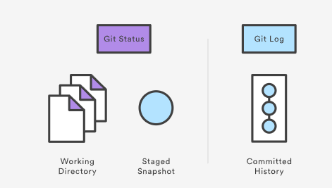

### 7.2 show

`show` 相比于 `status` 和 `log` 要更加底层，他的本质更类似于高级的 `cat-file` ，可以通过给定 SHA Number 来打印其中的内容。有一个很好用的用法是打印特定版本的某个文件，可以先用 `git log` 查询出版本号，然后查询对应的文件。

```shell
git show 6f0e9959a89165000c590657fdb5d700471fda3e:README.md
```

### 7.3 blame

blame 可以查看某个文件中不同作者的更改

```shell
git blame README.MD
```

如果希望限定范围，可以使用 `-L` 参数

```shell
git blame -L 1,5 README.md
```

### 7.4 grep

个人感觉 `git grep` 是一个比 `grep` 更好的工具，其具有 `grep` 的大部分功能，默认搜索的目录是项目目录。

它可以在某个特定版本中查找

```shell
git grep "pattern" <SHA1-number>
```

其实也可以换成 tag 或者是 branch，都是可以查找的。

在搜索结果上加上行号

```shell
git grep -n "pattern"
```

`git grep` 也提供了强大的文件过滤功能

搜索特定文件类型：要仅搜索特定文件类型，可以使用通配符或文件扩展名。例如，要搜索所有扩展名为 `.java` 的文件中的文本模式，可以运行以下命令：

```shell
git grep "pattern" -- "*.java"
```

排除特定文件或目录：如果你希望在搜索时排除特定的文件或目录，可以使用 `:(exclude)`。例如，要搜索所有文件，但排除名为 `config.txt` 的文件，可以运行以下命令：

```shell
git grep "pattern" -- ":(exclude)config.txt"
```

指定特定目录：如果你只想在特定目录下搜索，可以指定目录的路径。例如，要在 `src` 目录下搜索文本模式，可以运行以下命令：

```shell
git grep "pattern" -- "src"
```


---


## 八、配置

设置分页器

```shell
git config --global core.pager cat
```

