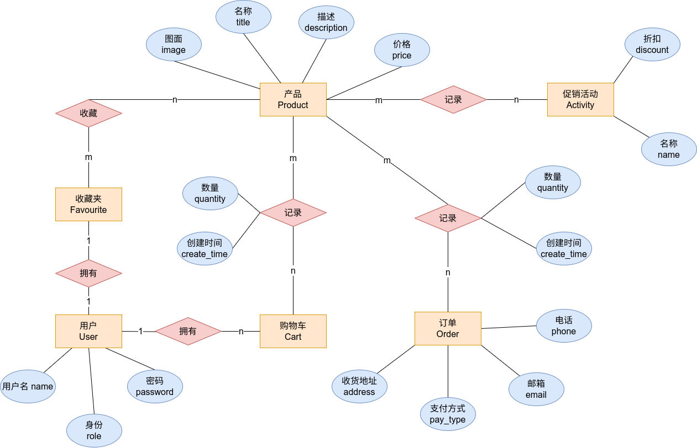

# 设计文档

## 1 设计需求

该项目名为**“魔法补完计划”**，是一个简易的电商平台，针对于一个书商，多个购书用户进行开发。

### 1.1 买家侧需求

#### 1.1.1 浏览商品

用户可以浏览商家上架的所有商品，并且可以了解这些商品的基本信息，包括商品图片，商品描述，商品价格，商品折扣等信息。

#### 1.1.2 购物车

用户可以在浏览商品的时候，选择将商品加入购物车，以为后续的订单操作做准备，用户可以选择购物车中商品的种类和数量。同时购物车应当具有价格指示功能，可以计算当前购物车内商品的价格。

#### 1.1.3 订单

用户可以根据购物车中的内容生成订单，并且填写订单相关的信息，比如说收货人，地址，电话，邮箱等。

#### 1.1.4 收藏夹

用户可以将自己喜欢的产品加入收藏夹，可以浏览自己的收藏夹，可以删除收藏夹中的条目。

#### 1.1.5 促销活动

用户可以浏览促销活动，并且知悉促销活动都涉及哪些商品。

### 1.2 卖家侧需求

#### 1.2.1 CRUD 商品

管理员可以对上平进行增删改查操作。

#### 1.2.2 订单管理

管理员获得所有订单的详细信息，并且可以删除订单信息。

#### 1.2.3 促销管理

可以创建促销活动，并且选择促销的力度，可以选择促销涉及的商品，并且可以取消活动。

### 1.3 网站需求

#### 1.3.1 权限管理

对于不同身份的用户，需要有不同的权限，买家不能随意修改卖家商品的价格......

#### 1.3.2 网站响应性

网站应当具有良好的响应性，可以对用户的操作快速做出反应。

#### 1.3.3 安全性

网站应当保护用户的信息，避免用户信息泄露。

#### 1.3.4 美观

网站应当让用户有舒适自然的体验，同时具有一定的美学风格。

## 2 开发环境

- ruby: 1.2
- rails: 7.0.4
- database: sqlite 4
- pc: manjaro
- IDE: RubyMine

## 3 概念模型



可以看到， ER 图中存在多个“多对多”关系，这是有意为之的，相比原要求中要求的多个属性，我更想体验更加复杂关系的开发，所以实现了**收藏夹**和**促销活动**两个功能，这两个功能都是“多对多”关系的，相应的，消除了原要求中的“颜色，尺寸”等单独成表，这种方式过于冗余，有一种“为了凑个数而凑表”之嫌。

## 4 数据模型

`rails` 方便的提供了数据库的视图在 `projec/db/schema.rb` 中，我的如下所示，可以看到我一共是 9 张表。

```ruby
ActiveRecord::Schema[7.0].define(version: 2023_01_03_154008) do
  create_table "activities", force: :cascade do |t|
    t.string "name"
    t.datetime "created_at", null: false
    t.datetime "updated_at", null: false
    t.integer "discount"
  end

  create_table "carts", force: :cascade do |t|
    t.datetime "created_at", null: false
    t.datetime "updated_at", null: false
  end

  create_table "favor_items", force: :cascade do |t|
    t.integer "product_id", null: false
    t.integer "user_id", null: false
    t.datetime "created_at", null: false
    t.datetime "updated_at", null: false
    t.index ["product_id"], name: "index_favor_items_on_product_id"
    t.index ["user_id"], name: "index_favor_items_on_user_id"
  end

  create_table "line_items", force: :cascade do |t|
    t.integer "product_id", null: false
    t.integer "cart_id"
    t.datetime "created_at", null: false
    t.datetime "updated_at", null: false
    t.integer "quantity", default: 1
    t.integer "order_id"
    t.index ["cart_id"], name: "index_line_items_on_cart_id"
    t.index ["order_id"], name: "index_line_items_on_order_id"
    t.index ["product_id"], name: "index_line_items_on_product_id"
  end

  create_table "orders", force: :cascade do |t|
    t.string "name"
    t.text "address"
    t.string "email"
    t.string "phone"
    t.integer "pay_type"
    t.datetime "created_at", null: false
    t.datetime "updated_at", null: false
  end

  create_table "products", force: :cascade do |t|
    t.string "title"
    t.text "description"
    t.string "image_url"
    t.decimal "price", precision: 8, scale: 2
    t.datetime "created_at", null: false
    t.datetime "updated_at", null: false
  end

  create_table "prompts", force: :cascade do |t|
    t.integer "product_id", null: false
    t.integer "activity_id", null: false
    t.datetime "created_at", null: false
    t.datetime "updated_at", null: false
    t.index ["activity_id"], name: "index_prompts_on_activity_id"
    t.index ["product_id"], name: "index_prompts_on_product_id"
  end

  create_table "users", force: :cascade do |t|
    t.string "name"
    t.string "password_digest"
    t.integer "role"
    t.datetime "created_at", null: false
    t.datetime "updated_at", null: false
  end

  add_foreign_key "favor_items", "products"
  add_foreign_key "favor_items", "users"
  add_foreign_key "line_items", "carts"
  add_foreign_key "line_items", "orders"
  add_foreign_key "line_items", "products"
  add_foreign_key "prompts", "activities"
  add_foreign_key "prompts", "products"
end
```

## 5 设计特色

### 5.1 多对多关系

概念模型中大量采用了多对多关系，这是对于 blog4 中 FollowShip 的拓展。

### 5.2 测试 test

对于增量式开发，基本上每增加一个功能，都完成了一个对应的单元测试，最终可以通过 `test` 。

### 5.3 响应性

利用了 `Ajax` 的知识，尽量提高了页面的响应速度。如下面的代码

```html
<% cache @products do %>
  <% @products.each do |product| %>
    <% cache product do %>
      <div class="entry">
        <%= image_tag(product.image_url) %>
        <h3><%= product.title %></h3>
        <%= sanitize(product.description) %>
        <div class="price_line">
          <!-- 显示价格 -->
          <span class="price"><%= number_to_currency(product.price) %></span>
          <!-- 显示折扣 -->
          <% product.prompts.each do |prompt| %>
            <span> &times; <%= number_to_percentage(prompt.activity.discount, precision: 0) %></span>
          <% end %>
        </div>
        <div class="bt_line">
          <!-- 加入购物车 -->
          <%= button_to '加入购物车', line_items_path(product_id: product), remote:true, class: 'bt' %>
          <!-- 加入收藏夹 -->
          <%= button_to '加入收藏夹', favor_items_path(product_id: product), class: 'bt' %>
        </div>
      </div>
    <% end %>
  <% end %>
<% end %>
```

----

