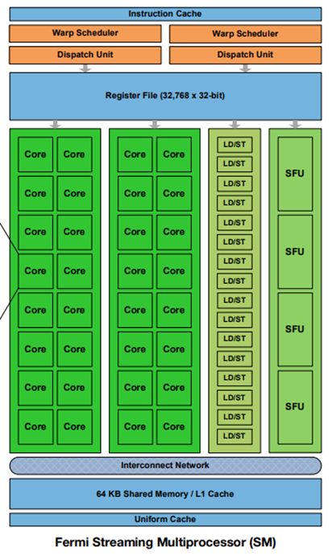
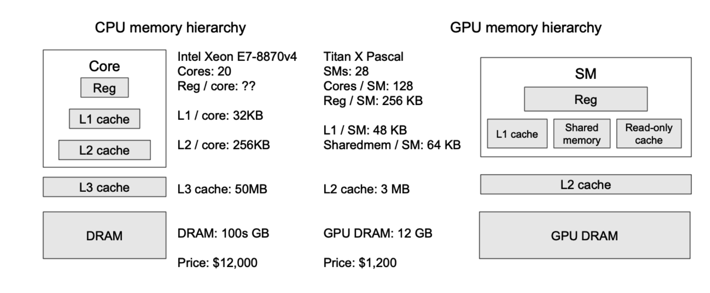
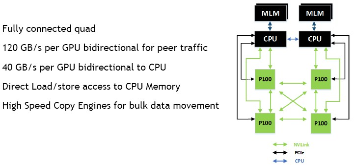

## 一、Hardware

### 1.1 SM

采用我两年半前写下的博文开篇：“**GPU 是一个由多个 SIMD 处理器组成的 MIMD 处理器**。”

这句话的意思是说，GPU 是一个多核系统，它这里说的“核”，指的是像多核 CPU 中的 core，它对应的不是 CUDA Core，而是 SM。而 SM 本身是一个 SIMD 处理器，也就是说，SM 是一个 SIMD 处理器。CUDA Core 其实对应的是一个 ALU 。一个 SM 中有多个 CUDA Core，所以它可以用一条指令进行多个标量的计算（送入不同的 CUDA Core）。

人们常常将 CPU 比作一个无所不知的教授，GPU 比喻成成百上千个小学生。而实际上，GPU 更像是一组长着很多只不协调的手的大学生。这个比喻中，SM 对应“大学生”，而 CUDA Core 等 SM 中的计算单元对应“手”。

SM 才是指令的执行者，而不是 CUDA Core 是指令的执行者。我之所以会产生 CUDA Core 才是执行者的错觉，我猜测是因为在 SIMT 模型中，thread 对应的往往是 CUDA Core 这样的计算单元（其实也不是一一对应），而在 CPU 体系中，thread 和与之对应的 CPU Core 是指令的执行者，这就很容易让人产生，CUDA Core 才是指令的执行者的误解。



每个 SM 核都有自己独立的寄存器文件，L1 Cache/Shared Memory，指令调度单元等。

### 1.2 Schedule

现在 CPU 也有两种趋势，一个是尽可能的增加 CPU Core 的数目，另一个是尽可能的增加 CPU 的向量指令集的能力。这就导致在某种意义上来说，CPU 系统就变成了“一组长着很多只手的教授们”，和 GPU 就非常类似了。那么到底 GPU 有什么其他独特的能力呢？

我觉得有一个方面就是两者在面对 `ld/st` 访存指令导致的延迟的处理思路不同。CPU 通过构建多级 cache，来尽量降低访存指令的延迟（其实还有乱序发射）。而 GPU 并没有构建多级 cache（我猜测是因为多个核心的 cache 的硬件开销过大了），一旦遇到访存指令阻塞的情况，GPU 会立刻切换“另一个指令”来执行，充分利用那些闲置的计算资源（也就是 schedule）。这种设计思路，是一种不降低指令延迟的前提下，提高系统吞吐的方法。

那么 GPU 是如何找到那条在访存阻塞时，可以被调度填充的指令呢？如果是 CPU，CPU 会在当前线程中的后续指令里，找一条与当前指令不存在数据依赖的指令，这依赖于 scoreboard 结构。我不确定 GPU 中能不能也实现相似的功能，毕竟 scoreboard 比较复杂。但是无论如何，CPU 和 GPU 都要面对，找不到一条不存在数据依赖的指令的情况，CPU 一般就选择阻塞等待了，反正在有多级 cache 的情况下，等待时间也不会太久。而 GPU 则不行，在没有 cache 的情况下，一旦等待，那时间可就长了。所以 GPU 选择切换“线程”，从另一个“线程”中找一条指令来执行。显然两条来自不同线程的指令，之间一定是不存在数据依赖的。在 GPU 中，我们称“线程”为 warp 。

这就又引入了一大堆问题。首先，难道切换 warp 本身是没有开销的吗？在 CPU 中，切换线程虽然不用更改地址空间，但是寄存器、PC 这些上下文状态还是要借助内存来保存和恢复的，那这样开销就大了（即使对于 CPU 来说，开销也很大）。那而 GPU 的 warp 切换按理说开销也不会小，甚至更大。这是因为 SM 是一个 SIMD 处理器，涉及到的寄存器数目非常庞大，而且 GPU 的访存延迟更高。

但是实际上，warp 切换基本上是零开销的。这是因为 GPU 根本不借助内存去保存和恢复上下文；而是为每个 warp 准备单独的寄存器文件，无论这个 warp 是否活跃。所以切换 warp，就是单纯的改一下指针就好了。也就是说，虽然 GPU 的 cache 资源非常少，但是寄存器资源非常多。

这种设计更理论的来说，被称作硬件多线程（Hardware Multithreading），每个 warp 相当于是一个 SM 的硬件线程。其实这种设计在 CPU 中也有出现，被称为同步多线程（Simultaneous Multithreading, SMT），在 Intel 中被称为超线程（Hyper-Threading, HT），也就是在一个 CPU Core 中，有多份独立的寄存器文件和 PC，但是只有一份 ALU 等执行单元。HT 的表现就是“逻辑核心”数目大于“物理核心”数目。

最后再介绍一下 SM 中的 Warp Scheduler 和 Dispatch Unit。其中 Warp Scheduler 负责挑选出特定 warp 的特定指令，而 Dispatch Unit 负责将这条指令，发送（issue）给执行单元执行，这主要有两个部分，一个是选择合适的执行单元（比如整数计算就发给 CUDA Core，访存就发给访存单元），另一个是对 warp 进行一定的拆分，这是因为 warp 的数目一般是 32 ，而有些计算资源只有 8 个，那么就需要分 4 次发射。

### 1.3 SIMT

GPU 又在 SIMD 的基础上，实现了更为灵活的 SIMT 的抽象，这同样需要硬件的支持。SIMT 这种灵活性的意味着每个线程都可以进行 **独立访存** 和 **独立控制流** ，这两点都是 SIMD 难以进行的。

独立访存意味着每个线程都可以随机化的访问地址，而不是必须访问一组连贯的地址，牺牲的是 SIMD 整体访存的效率。在实现上，需要为每个 thread 配置一个访存单元，而如果是普通的 SIMD，其实一个 warp 配置一个访存单元就够了。

独立控制流意味着不同 thread 可以执行不同的代码，牺牲的是执行效率。在实现上，采用的是指令掩码（Mask）。

这里我们最后讨论一下 SIMT 的范围。其实很容易就会发现，warp 就是 SIMT 的范围。因为 warp 里有 32 个 thread，也就是 warp 内的每个指令，都会同时对应 32 个线程进行处理。

而如果到了软件范畴，其实 SIMT 的范围扩大了，我们使用 `(ctaid, tid)` 来完成对于 thread 的索引，当 CTA（Cooperative Thread Array）数目和 CTA 内 thread 数目增多时，SIMT 的范围就会扩大。而在底层硬件上，这些扩大的范围，最终还是会被分割成多个 warp SIMT 去执行。

### 1.4 Memory Hierarchy

GPU 的 Memory Hiearchy 如下所示：



GPU 的 L1 Cache 在 SM 内，L2 Cache 在 GPU 片上，由所有 SM 所共享，而显存则在 GPU 片下（围绕 GPU 芯片的一堆小正方形芯片）。

从图上数据可以看出，GPU 的 Reg File 的大小是大于 L1 Cache 的。GPU 的各级 Cache 都远小于 CPU 的各级 Cache。这些现象都反应了我们前面提到的不同的设计思想。

显存在实现上是 HBM（High Bandwidth Memory）。它的带宽大约是 1,000x GB/s 量级的，这比 CPU 使用的 DDR 带宽（一般是 100x GB/s）高一个量级，是无愧 HBM 这个名字的。但是考虑到 GPU 的计算能力是 10,000x GB/s 量级的，又比 HBM 的带宽高一个量级，因此 GPU 在 LLM 任务中，往往是内存瓶颈的。另外强调，这里的的带宽，指的是将数据从显存，搬运到 GPU 上的带宽。

### 1.5 Interconnect

一个完整的 GPU 计算节点的互联图如下所示：



可以看到，如果想要搬运数据从 CPU Memory 搬运到 GPU Memory，需要走较为缓慢的 PCIe 通路（10x GB/s），而 GPU Memory 之间的数据搬运，则可以走 NVLink（100x GB/s）。

现在的 LLM 都非常庞大，而 GPU 显存只有 10x GB 大小，所以很有可能出现显存容纳不下数据的情况。而如果我们将其 offload 到 CPU Memory 上，我们就需要忍受 PCIe 的低带宽，这甚至比 HBM 的低带宽更难以接受。

如果是分布式场景，我们一般会把参数都加载到显存后再开始任务，而不同 GPU 中的数据交换，通过 NVLink 交换，而不是用 CPU Memory 做中转（走 PCIe 太慢了）；而如果是边缘设备，我们就要想办法解决 PCIe 的瓶颈了，比如说稀疏注意力机制。

### 1.6 Terminology

这里整理一下 NVIDIA 和 AMD GPU 的不同术语对比：

| 实体               | NVIDIA                                     | AMD                                 |
| ------------------ | ------------------------------------------ | ----------------------------------- |
| SIMD Processor     | SM (Streaming Processor)                   | CU (Compute Unit)                   |
| Group of Threads   | Warp                                       | Wavefront (Wave)                    |
| ALU                | CUDA Core                                  | SP (Stream Processor)               |
| On-chip Scratchpad | Shared Memory                              | LDS (Local Data Share)              |
| CTA                | Block Group                                | Work Group                          |
| Ecosystem          | CUDA (Compute Unified Device Architecture) | ROCm (Radeon Open Compute platform) |

---


## 二、CUDA

### 2.1 CTA

理解 CTA 的关键，在于理解软件编程模型与硬件之间的对应关系。

是不是有了 warp 这个概念，我们剩下的事情就是在软件层面设计 warp 内的指令就够了。其实并没有，首先，warp 是局限于一个 SM 内的，而且是没有办法在不同的 SM 之间迁移的。所以如果我们希望充分利用不同的 SM，那么就要引入 CTA（Collaborative Thread Array） 的概念，一个 CTA 必须在一个特定的 SM 上，不同的 CTA 可以在不同的 SM 上，一个 SM 上可以有多个 CTA。CTA 是非常像软件 thread 的概念，一个 thread 同时仅能在一个 CPU Core 上运行，不同 thread 可以在不同的 CPU Core 上运行。有了这个概念后，我们就可以利用 `ctaid` 来在软件中使用不同的 SM，当然这种使用，有一部分是依赖于 GPU 内部的硬件调度器，这就像我们没法简单指定某个 thread 一定要与某个 CPU Core 绑定一样。

那是不是 CTA 这个“软件线程”就直接用 warp 这个“硬件线程”来一一对应就好了呢？并不是，这是因为 warp 内的 thread 数目是静态的 32 ，是不可调整的。而在软件编程中，我们希望在一个 SM 中启动的 thread 数目（也就是 CTA 中 thread 的数目）是动态的。这是因为一个 SM 内的许多资源，都不是 warp 独占，而是 warp 共享的，比如说 shared memory，两个不同的 warp 是可以利用同一片资源的。也就是说，如果 CTA 内可以包含多个 warp，那么同一个 CTA 中的不同 warp 就是可以协作的。因此，CTA 中 thread 的数目往往是 32 的倍数。

正如前所述，还有 CTA 名字中的 Collaborative 的暗示，在同一个 CTA 中的 thread 具有很好的协作性，这主要体现在两点：

- 共享内存：如前所述，同一个 CTA 中的 thread 可以读取相同的 shared memory。
- 同步：同一个 CTA 内的线程可以通过 `__syncthreads()` 这样的同步指令（Barrier）来协调彼此的执行进度。不过这点有些多余，因为不同 CTA 往往是在不同 SM 上，资源竞争的可能性小了很多。

在 CUDA 中，CTA 也被称作 Block，而 CTA 组被称为 Grid。如果我们希望定位到一个 thread，我们可以使用如下代码：

```c++
int idx = blockIdx.x * blockDim.x + threadIdx.x;
```

而这段代码如果对应成 PTX 代码，如下所示：

```assembly
mov.u32 %idx, %tid.x;          // idx = threadIdx.x
mov.u32 %r2, %ntid.x;          // r2 = blockDim.x
mov.u32 %r3, %ctaid.x;         // r3 = blockIdx.x
mad.lo.s32 %idx, %r3, %r2, %idx; // idx = r3 * r2 + idx
```

从这点也可以看出，SIMT 模型是从硬件层面支持的，而不是用编译器，从汇编层面支持的。

我们也可以看出，我们在写 kernel 的时候，用 `<<grid, block>>` 二元组来描述并行，是非常必要的，不能只用一个一元组去描述。

### 2.2 Memory Type

不同于简单的 CPU 编程，只用操作一种内存。当我们使用 CUDA 的时候，可以操纵多种不同类型的内存。

CUDA 中的类型如下所示：


CUDA 使用 `__device__` 来声明一个全局变量，可以被所有 kernel 访问。如下所示：

```cpp
__device__ unsigned long long g_total_sum = 0;
```

而局部变量的使用更为复杂。我们在 kernel 中声明的局部变量，优先存放在寄存器中。而如果局部变量如果过多，就会存放到 local memory 中，这种 local memory 也是 thread 独享的。那是不是很快呢？并不是，local memory 是在显存上的一片区域，考虑到 GPU 那孱弱的 cache，local memory 的访问时延非常高。

那有没有什么时延更低的方案呢？有的，就是 Shared Memory，我们可以在局部变量前增加 `__shared__` 来表示放在共享内存中的变量：

```cpp
__global__ void myKernel(...) {
    __shared__ float shared_data[BLOCK_SIZE];
    // ...
}
```

在对共享内存进行计算之前，必须确保所有线程都已经完成了上一步的数据加载。否则，一些线程可能会读到旧的、无效的数据（竞态条件 Race Condition）。使用 `__syncthreads()` 来实现同步。

总结如下：

| Memory   | Location on/off chip | Cached | Access | Scope                | Lifetime        |
| -------- | -------------------- | ------ | ------ | -------------------- | --------------- |
| Register | On                   | n/a    | R/W    | 1 thread             | Thread          |
| Local    | Off                  | Yes    | R/W    | 1 thread             | Thread          |
| Shared   | On                   | n/a    | R/W    | All threads in block | Block           |
| Global   | Off                  | Yes    | R/W    | All threads + host   | Host allocation |
| Constant | Off                  | Yes    | R      | All threads + host   | Host allocation |
| Texture  | Off                  | Yes    | R      | All threads + host   | Host allocation |

### 2.3 Sync and Stream

CPU 和 GPU 协作的方式是异步的，也就是说，CPU 在向 GPU 发送指令后，是不会等待指令返回的，它就会自己往下运行了，所以如果 CPU 想要获得 GPU 的运行结果，需要先执行同步操作：

```cpp
cudaDeviceSynchronize();
```

不过 GPU 本身，默认是串行执行指令的，这就导致 kernel 是没有办法并行执行的，也就没有办法进行一些访存延迟隐藏之类的优化。为了改善这一点，CUDA 提出了 Stream 的概念。

在你不使用 Stream 的情况下，所有 CUDA 操作（比如在 GPU 上计算、在 CPU 和 GPU 之间拷贝数据）都默认放入一个叫做 “默认流”（Default Stream） 的大队列里。我们只需要声明多个 Stream，就可以实现并发。同一个 Stream 内的指令是顺序执行的，而不同 Stream 中的指令是可以并发执行的。

---

 

## 三、Triton

### 3.1 Tiled-Based

与 CUDA 不同，Triton 并不是 SIMT 编程模型，而是 Tiled-Based 编程模型，或者换种说法，是一种 SIMD 模型。我们没有办法像在 CUDA 编程一样，操纵每个线程（或者说每个标量），我们只能操纵一个向量或者一个张量，当然了，此时他们被叫作 Tile。

在 Triton 中我们也有 grid 的概念，我们用 grid 来组织“Program Instance”，每个 Program Instance 负责一个 Tile。需要强调的是，此时的组织，不再是真的硬件映射关系了，往往只是一种算法逻辑上的分块。

（如果要深究的话，一个 Triton 的 PI，对应一到多个 CTA）。

当我们计算一个矩阵加法 $C = A + B$ 时，第 $(m, n)$ 个 PI，负责的就是第 $(m, n)$ 个 Tile 的计算。在启动核函数时，我们指定 grid 参数：

```python
# 定义块大小 (Tile size)
# 可以根据具体硬件和矩阵形状进行调整以获得最佳性能
BLOCK_SIZE_M = 32
BLOCK_SIZE_N = 32
    
# 定义 grid，这里是关键！
# 使用 triton.cdiv (ceiling division) 来确保所有元素都被覆盖
grid_m = triton.cdiv(M, BLOCK_SIZE_M)
grid_n = triton.cdiv(N, BLOCK_SIZE_N)
# 将 grid 定义为一个二元组
grid = (grid_m, grid_n)
    
# 启动核函数
add_kernel[grid](
		a, b, c,                       # 指针
    M, N,                          # 维度
    a.stride(0), a.stride(1),      # 矩阵 A 的步长
    b.stride(0), b.stride(1),      # 矩阵 B 的步长
    c.stride(0), c.stride(1),      # 矩阵 C 的步长
    BLOCK_SIZE_M=BLOCK_SIZE_M,     # constexpr 参数
    BLOCK_SIZE_N=BLOCK_SIZE_N,
)
```

而在算子内部，我们使用 `program_id` 获得 grid 参数：

```python
# 1. 使用二维 program_id 获取当前程序实例负责的块的索引
# axis=0 对应 grid 的第一个维度 (行方向)
pid_m = tl.program_id(axis=0)
# axis=1 对应 grid 的第二个维度 (列方向)
pid_n = tl.program_id(axis=1)
```

那么在 Tiled-Based 的编程模型下，我们是如何操作数据的呢？答案是我们使用“offsets 张量”。offset 可以理解为一个标量数据的地址，而一个 offsets 张量，就可以理解为一组数据的地址。我们用一个 numpy-like 的方法表示这组 offset，如下所示：

```python
# 2. 计算当前块的二维偏移量
# 首先，计算 M 维度 (行) 的偏移量向量
# tl.arange 生成 [0, 1, 2, ..., BLOCK_SIZE_M-1]
offs_m = pid_m * BLOCK_SIZE_M + tl.arange(0, BLOCK_SIZE_M)
# 然后，计算 N 维度 (列) 的偏移量向量
offs_n = pid_n * BLOCK_SIZE_N + tl.arange(0, BLOCK_SIZE_N)

# 3. 计算加载/存储数据的完整二维指针偏移量
#    利用广播机制 (broadcasting) 将一维的行、列偏移量扩展成二维
#    offs_m[:, None] -> [BLOCK_SIZE_M, 1]
#    offs_n[None, :] -> [1, BLOCK_SIZE_N]
#    相加后得到一个 [BLOCK_SIZE_M, BLOCK_SIZE_N] 的偏移矩阵
a_offsets = a_ptr + (offs_m[:, None] * stride_am + offs_n[None, :] * stride_an)
b_offsets = b_ptr + (offs_m[:, None] * stride_bm + offs_n[None, :] * stride_bn)
c_offsets = c_ptr + (offs_m[:, None] * stride_cm + offs_n[None, :] * stride_cn)
```

可以看到在上面式子中，我们得到了最终我们分别得到了 a_tile, b_tile, c_tile 对应的 offsets 张量，他们的形状都是 tile 的形状，也就是 `[BLOCK_SIZE_M, BLOCK_SIZE_N]` 。

当然，在编程中，我们也有一些边界情况，或者控制分支需要处理。在 CUDA 中，我们可以随意使用 `if-else` 这种条件判断，毕竟我们提供的是 SIMT 抽象，但是在 Triton 中，我们并不能进行分支判断，所以我们利用了 mask 张量，如下所示：

```python
# 4. 创建二维掩码 (mask) 以处理边界情况
#    防止因矩阵尺寸不是块大小的整数倍而导致的越界访存
mask_m = offs_m < M
mask_n = offs_n < N
# 使用广播和逻辑与操作合并成二维掩码
mask = mask_m[:, None] & mask_n[None, :]
```

当我们拿到这些 offsets 张量和 mask 张量后，我们就可以在上面应用算子了，比如说 `load, store, dot, +` 等：

```
# 5. 安全地加载数据块
#    mask=mask 确保只加载有效区域的数据
#    other=0.0 指定在掩码为 False 的位置加载 0.0，避免计算错误
a_tile = tl.load(a_offsets, mask=mask, other=0.0)
b_tile = tl.load(b_offsets, mask=mask, other=0.0)

# 6. 执行核心计算
c_tile = a_tile + b_tile

# 7. 将结果安全地写回
tl.store(c_offsets, c_tile, mask=mask)
```

---

