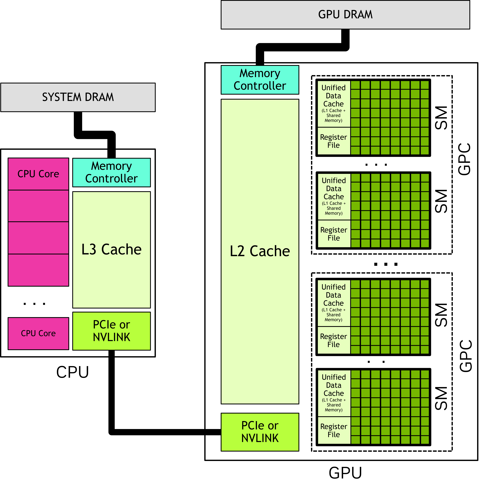
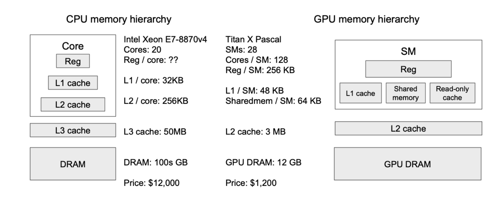
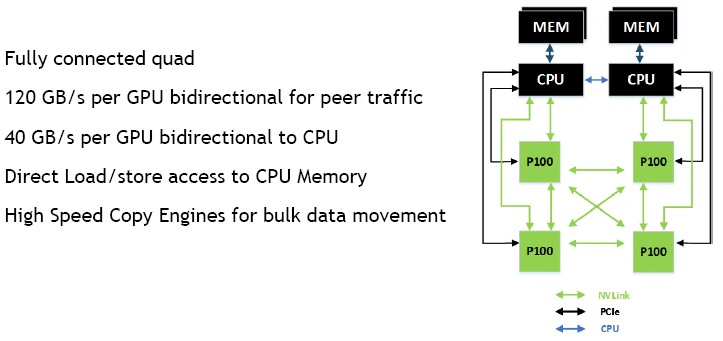
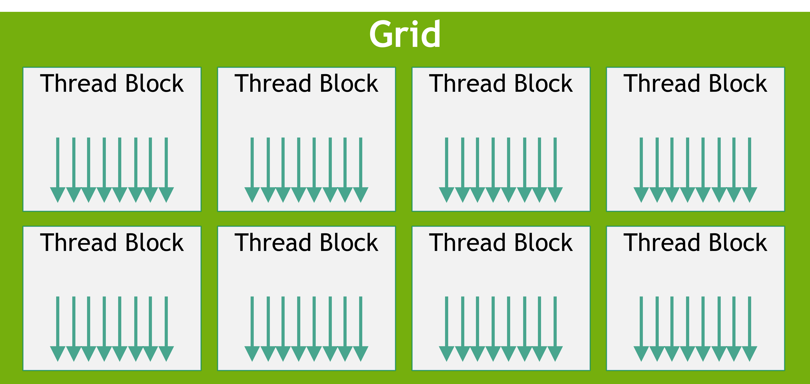
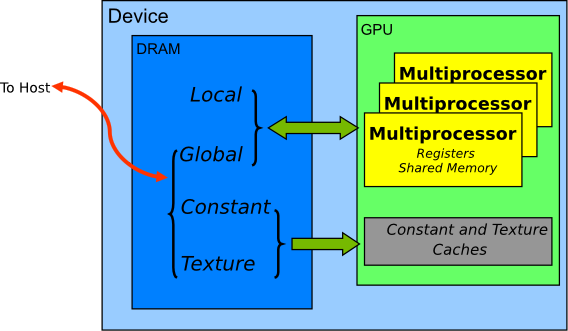
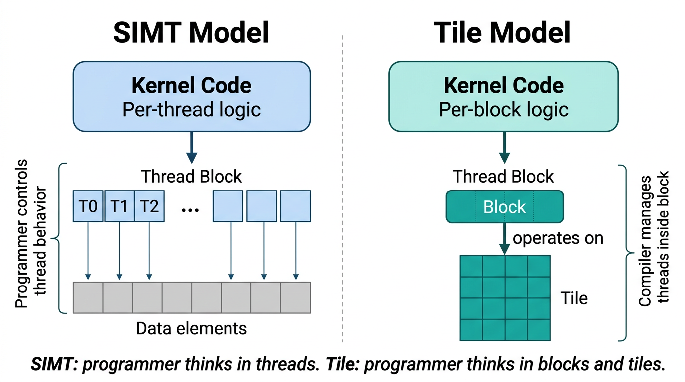

## 一、Hardware

### 1.1 SM

采用我两年半前写下的博文开篇：“**GPU 是一个由多个 SIMD 处理器组成的 MIMD 处理器**。”

这句话的意思是说，GPU 是一个多核系统，它这里说的 “核”，指的是像多核 CPU 中的 core，它对应的不是 CUDA Core，而是 SM。而 SM 本身是一个 SIMD 处理器，也就是说，SM 是一个 SIMD 处理器。CUDA Core 其实对应的是一个 ALU 。一个 SM 中有多个 CUDA Core，所以它可以用一条指令进行多个标量的计算（送入不同的 CUDA Core）。

人们常常将 CPU 比作一个无所不知的教授，GPU 比喻成成百上千个小学生。而实际上，GPU 更像是一组长着很多只不协调的手的大学生。这个比喻中，SM 对应 “大学生”，而 CUDA Core 等 SM 中的计算单元对应 “手”。

SM 才是指令的执行者，而不是 CUDA Core 是指令的执行者。我之所以会产生 CUDA Core 才是执行者的错觉，我猜测是因为在 SIMT 模型中，thread 对应的往往是 CUDA Core 这样的计算单元（其实也不是一一对应），而在 CPU 体系中，thread 和与之对应的 CPU Core 是指令的执行者，这就很容易让人产生，CUDA Core 才是指令的执行者的误解。



每个 SM 核都有自己独立的寄存器文件，L1 Cache/Shared Memory，指令调度单元等。

### 1.2 Schedule

现在 CPU 也有两种趋势，一个是尽可能的增加 CPU Core 的数目，另一个是尽可能的增加 CPU 的向量指令集的能力。这就导致在某种意义上来说，CPU 系统就变成了 “一组长着很多只手的教授们”，和 GPU 就非常类似了。那么到底 GPU 有什么其他独特的能力呢？

我觉得有一个方面就是两者在面对 `ld/st` 访存指令导致的延迟的处理思路不同。CPU 通过构建多级 cache，来尽量降低访存指令的延迟（其实还有乱序发射）。而 GPU 并没有构建多级 cache（我猜测是因为多个核心的 cache 的硬件开销过大了），一旦遇到访存指令阻塞的情况，GPU 会立刻切换 “另一个指令” 来执行，充分利用那些闲置的计算资源（也就是 schedule）。这种设计思路，是一种不降低指令延迟的前提下，提高系统吞吐的方法。

那么 GPU 是如何找到那条在访存阻塞时，可以被调度填充的指令呢？如果是 CPU，CPU 会在当前线程中的后续指令里，找一条与当前指令不存在数据依赖的指令，这依赖于 scoreboard 结构。我不确定 GPU 中能不能也实现相似的功能，毕竟 scoreboard 比较复杂。但是无论如何，CPU 和 GPU 都要面对，找不到一条不存在数据依赖的指令的情况，CPU 一般就选择阻塞等待了，反正在有多级 cache 的情况下，等待时间也不会太久。而 GPU 则不行，在没有 cache 的情况下，一旦等待，那时间可就长了。所以 GPU 选择切换 “线程”，从另一个 “线程” 中找一条指令来执行。显然两条来自不同线程的指令，之间一定是不存在数据依赖的。在 GPU 中，我们称 “线程” 为 warp 。

这就又引入了一大堆问题。首先，难道切换 warp 本身是没有开销的吗？在 CPU 中，切换线程虽然不用更改地址空间，但是寄存器、PC 这些上下文状态还是要借助内存来保存和恢复的，那这样开销就大了（即使对于 CPU 来说，开销也很大）。那而 GPU 的 warp 切换按理说开销也不会小，甚至更大。这是因为 SM 是一个 SIMD 处理器，涉及到的寄存器数目非常庞大，而且 GPU 的访存延迟更高。

但是实际上，warp 切换基本上是零开销的。这是因为 GPU 根本不借助内存去保存和恢复上下文；而是为每个 warp 准备单独的寄存器文件，无论这个 warp 是否活跃。所以切换 warp，就是单纯的改一下指针就好了。也就是说，虽然 GPU 的 cache 资源非常少，但是寄存器资源非常多。

这种设计更理论的来说，被称作硬件多线程（Hardware Multithreading），每个 warp 相当于是一个 SM 的硬件线程。其实这种设计在 CPU 中也有出现，被称为同步多线程（Simultaneous Multithreading, SMT），在 Intel 中被称为超线程（Hyper-Threading, HT），也就是在一个 CPU Core 中，有多份独立的寄存器文件和 PC，但是只有一份 ALU 等执行单元。HT 的表现就是 “逻辑核心” 数目大于 “物理核心” 数目。

最后再介绍一下 SM 中的 Warp Scheduler 和 Dispatch Unit。其中 Warp Scheduler 负责挑选出特定 warp 的特定指令，而 Dispatch Unit 负责将这条指令，发送（issue）给执行单元执行，这主要有两个部分，一个是选择合适的执行单元（比如整数计算就发给 CUDA Core，访存就发给访存单元），另一个是对 warp 进行一定的拆分，这是因为 warp 的数目一般是 32 ，而有些计算资源只有 8 个，那么就需要分 4 次发射。

### 1.3 SIMT

GPU 又在 SIMD 的基础上，实现了更为灵活的 SIMT 的抽象，这同样需要硬件的支持。SIMT 这种灵活性的意味着每个线程都可以进行 **独立访存** 和 **独立控制流** ，这两点都是 SIMD 难以进行的。

独立访存意味着每个线程都可以随机化的访问地址，而不是必须访问一组连贯的地址，牺牲的是 SIMD 整体访存的效率。在实现上，需要为每个 thread 配置一个访存单元，而如果是普通的 SIMD，其实一个 warp 配置一个访存单元就够了。

独立控制流意味着不同 thread 可以执行不同的代码，牺牲的是执行效率。在实现上，采用的是指令掩码（Mask）。

这里我们最后讨论一下 SIMT 的范围。其实很容易就会发现，warp 就是 SIMT 的范围。因为 warp 里有 32 个 thread，也就是 warp 内的每个指令，都会同时对应 32 个线程进行处理。

而如果到了软件范畴，其实 SIMT 的范围扩大了，我们使用 `(ctaid, tid)` 来完成对于 thread 的索引，当 CTA（Cooperative Thread Array）数目和 CTA 内 thread 数目增多时，SIMT 的范围就会扩大。而在底层硬件上，这些扩大的范围，最终还是会被分割成多个 warp SIMT 去执行。

我相信在一开始的时候， warp 这个概念只是属于承载 “schedule 和 SIMT 语义” 的微体系结构细节，但是随着 GPU 越来越变得像 NPU ，warp 这个概念逐渐被软件开发者所熟知，比如说 warp specialization 技术，就是在软件层要求软件开发者去感知 “访存 warp”、“计算 warp” 和 “通信 warp”。此时我们再回看 warp 这个概念，会惊奇的发现，它变成了一种 SM 内特定硬件单元的代称，上述 3 种 warp 就分别对应访存单元、TensorCore 和通信单元。这个时候 warp 的语义是扩大了的。

### 1.4 Memory Hierarchy

GPU 的 Memory Hiearchy 如下所示：



GPU 的 L1 Cache 在 SM 内，L2 Cache 在 GPU 片上，由所有 SM 所共享，而显存则在 GPU 片下（围绕 GPU 芯片的一堆小正方形芯片）。

从图上数据可以看出，GPU 的 Reg File 的大小是大于 L1 Cache 的。GPU 的各级 Cache 都远小于 CPU 的各级 Cache。这些现象都反应了我们前面提到的不同的设计思想。

显存在实现上是 HBM（High Bandwidth Memory）。它的带宽大约是 1,000x GB/s 量级的，这比 CPU 使用的 DDR 带宽（一般是 100x GB/s）高一个量级，是无愧 HBM 这个名字的。但是考虑到 GPU 的计算能力是 10,000x GB/s 量级的，又比 HBM 的带宽高一个量级，因此 GPU 在 LLM 任务中，往往是内存瓶颈的。另外强调，这里的的带宽，指的是将数据从显存，搬运到 GPU 上的带宽。

### 1.5 Interconnect

一个完整的 GPU 计算节点的互联图如下所示：



可以看到，如果想要搬运数据从 CPU Memory 搬运到 GPU Memory，需要走较为缓慢的 PCIe 通路（10x GB/s），而 GPU Memory 之间的数据搬运，则可以走 NVLink（100x GB/s）。

现在的 LLM 都非常庞大，而 GPU 显存只有 10x GB 大小，所以很有可能出现显存容纳不下数据的情况。而如果我们将其 offload 到 CPU Memory 上，我们就需要忍受 PCIe 的低带宽，这甚至比 HBM 的低带宽更难以接受。

如果是分布式场景，我们一般会把参数都加载到显存后再开始任务，而不同 GPU 中的数据交换，通过 NVLink 交换，而不是用 CPU Memory 做中转（走 PCIe 太慢了）；而如果是边缘设备，我们就要想办法解决 PCIe 的瓶颈了，比如说稀疏注意力机制。

### 1.6 Terminology

这里整理一下 NVIDIA 和 AMD GPU 的不同术语对比：

|实体                |NVIDIA                                    |AMD                                |
|------------------|------------------------------------------|-----------------------------------|
|SIMD Processor    |SM (Streaming Processor)                  |CU (Compute Unit)                  |
|Group of Threads  |Warp                                      |Wavefront (Wave)                   |
|ALU               |CUDA Core                                 |SP (Stream Processor)              |
|On-chip Scratchpad|Shared Memory                             |LDS (Local Data Share)             |
|CTA               |Block Group                               |Work Group                         |
|Ecosystem         |CUDA (Compute Unified Device Architecture)|ROCm (Radeon Open Compute platform)|

### 1.7 From GPU to NPU

最近有一种说法，就是说 GPU 越来越像 NPU 了，那么到底像在哪里了？

我觉得其实是像在编程模型上了。原始的 GPU 是 SIMT 模型，也就是承诺，一个 thread 的指令是按照顺序执行的，前一条指令的执行结果决定了后一条指令的地址。这种方式非常容易构建复杂的指令控制流（control flow），也是 SIMT 优于 SIMD 的地方。这很 GPU 。

而 NPU 的编程模型不是这样的。NPU 的编程模型更类似于 DAG 图，或者说数据流图（data flow）。其重点在于数据的依赖关系和流向。有哪些数据处理过程可以并行？数据要流过处理单元，这是 NPU 要考虑的事情。

那么 GPU 是怎么越来越向 NPU 靠拢的呢？我觉得就是通过异步指令实现的。异步指令是一种不遵循控制流的指令，它完全异步于传统的顺序执行模型。正因如此，我们才可以实现类似于 dataflow 中自然的并行效果。

此外 warp speicalization 也是一种站在数据处理单元，而非 thread 视角去思考问题的编程模型。

说白了，从 SIMT Model 到 SIMD Model（在 CUDA 中也叫做 Tile Model），也是一种从 GPU 到 NPU 编程模型的提现。它相当于是放弃了一个 Block 内不同 thread 的 control flow divergence。

---


## 二、CUDA Programing Model

### 2.1 CTA/Block/Tile

CUDA 编程种最重要的就是 `CTA/Block/Tile` 的概念了。这三个概念可以理解成是完全的同义词。注意，是完完全全，一模一样的同义词，而不是近义词。

首先我们来介绍 CTA (Collaborative Thread Array) 的概念。首先它是一个软件概念，它表示一个 kernel 中的一部分任务。Kernel 可以看作是一组 CTA 任务。一个 CTA 任务最终会交给一个 SM 来执行，在执行过程中并不会在 SM 之间迁移。不过 1 个 SM 上面倒是可以有很多个 CTA 。CTA 是有点像软件 thread 的概念，一个 thread 同时仅能在一个 CPU Core 上运行，不同 thread 可以在不同的 CPU Core 上运行。

又因为 SM 上的资源的调度又是以 warp 为单位进行的，所以 CTA 也可以看作是一组 warp 。

那么又有一个问题，那就是为什么在有了 warp 的基础上，还有引入 CTA 的概念。我们就不能直接让 CTA 等于 warp ，也就是一个 CTA 中就包含一个 warp ，也就是 32 个 thread 吗？感觉这样编程都更简洁了呢？

传统的答案会说，warp 的语义实在是离硬件太近了，`32` 这个数字是 SM 内部的微体系结构细节，可能一个 SM 就是 32 个 CUDA Core ，所以一个 warp 刚好可以把所有的 CUDA Core 吃满。而到了软件层次，强制认为一个可以进行 inter-SM parallelism 的任务，一定刚好可以被 `32` 个 thead 所完成，有些没有道理。

但这种说法也不站得住脚，因为完全可以在不引入 CTA 的前提下，分割任务。无非是，原来是将一个任务分给一个 CTA ，这个 CTA 里面有 4 个 warp 。现在是直接将这个任务分给 4 个 warp ，何苦非得要 CTA 呢？这时候就有人又会说，那是因为 CTA 在算法层次上面可以让更多的 thread 进行协同，比如说：

- 共享内存：同一个 CTA 中的 thread 可以读取相同的 shared memory。
- 同步：同一个 CTA 内的线程可以通过 `__syncthreads()` 这样的同步指令（Barrier）来协调彼此的执行进度。

如果是 warp ，那么上述 “有用” 的语义就只能局限在 32 个 thread 之内了。

这点倒是不错，但是我觉得没有回答到本质上。我们仔细一想就会发现，我们为什么要在一个 CTA 共享内存，为什么要同步指令，为什么要交换数据？人们会说，软件就是这么设计的，将一个大型的计算任务，分解成多个可以在 inter-SM 并行的 CTA，这些 CTA 内的线程在计算的算法表示中，就是需要读取共享内存呀，就是需要同步指令呀。

而我们只要了解 LLM workloads 就会发现，里面的矩阵运算是非常容易并行的，你甚至可以 1 个 1 个 vector 的去算，也可以整个矩阵一起去算。当然两者的同步方式和对于共享内存的利用方式是不同的，但是总归是可以算的。也就是说，其实从软件根本不能提供 “一个 CTA 究竟里面应该包含多少个 warp” 的任何提示！也就根本无从谈起，到底有多少 thread 需要共享内存，需要同步线程等协作。

那么 CTA 的大小究竟是谁决定的呢？其实是 GPU 的 “计算 / 访存” 特性决定的。GPU 的计算带宽要远超访存带宽，这就导致我们将数据从显存中搬运到 SM 上，其实是希望尽可能重用（reuse）它算很多次，然后再写回显存中。但是这种 reuse 并不是无节制的，在 reuse 过程中，会产生很多的中间结果，也会产生很多的 reduction 中间值，这些额外产生的数据需要驻留在 SM 上，而 SM 上的 shm，register 和 cache 的空间有限，这就导致 reuse 不能一致扩大，也就是这本质上是 “数据重用次数 vs 片上驻留数据” 的 tradeoff ，是它决定了 CTA 的大小。

### 2.2 Grid

在 CUDA 中， CTA 组被称为 Grid。



如果我们希望定位到一个 thread，我们可以使用如下代码：

```c++
int idx = blockIdx.x * blockDim.x + threadIdx.x;
```

而这段代码如果对应成 PTX 代码，如下所示：

```assembly
mov.u32 %idx, %tid.x;          // idx = threadIdx.x
mov.u32 %r2, %ntid.x;          // r2 = blockDim.x
mov.u32 %r3, %ctaid.x;         // r3 = blockIdx.x
mad.lo.s32 %idx, %r3, %r2, %idx; // idx = r3 * r2 + idx
```

从这点也可以看出，SIMT 模型是从硬件层面支持的，而不是用编译器，从汇编层面支持的。

我们也可以看出，我们在写 kernel 的时候，用 `<<<grid, block>>>` 二元组来描述并行，是非常必要的，不能只用一个一元组去描述。
至于为什么 Grid 和 Block 都是 `(uint, uint, uint)` 的三元组，这跟利用率无关，只是为了方便编程，比如在处理向量的时候，我们可以在只使用 1 个维度，而在处理视频的时候，就需要 3 个维度了。

其实在上一章节讲的有些绝对了，CTA 的大小并不是可以无限再分的，或者仅依靠计算存储特性进行分配。因为不同 CTA 在 SM 上的调度顺序是得不到保证的，这就导致 CTA 的任务之前是不能存在依赖的。也就是说，我们要把存在依赖的部分，放到 CTA 内部，或者放到下一个 kernel 中。

### 2.3 Memory Type

不同于简单的 CPU 编程，只用操作一种内存。当我们使用 CUDA 的时候，可以操纵多种不同类型的内存。

CUDA 中的类型如下所示：



CUDA 使用 `__device__` 来声明一个全局变量，可以被所有 kernel 访问。如下所示：

```cpp
__device__ unsigned long long g_total_sum = 0;
```

而局部变量的使用更为复杂。我们在 kernel 中声明的局部变量，优先存放在寄存器中。而如果局部变量如果过多，就会存放到 local memory 中，这种 local memory 也是 thread 独享的。那是不是很快呢？并不是，local memory 是在显存上的一片区域，考虑到 GPU 那孱弱的 cache，local memory 的访问时延非常高。

那有没有什么时延更低的方案呢？有的，就是 Shared Memory，我们可以在局部变量前增加 `__shared__` 来表示放在共享内存中的变量：

```cpp
__global__ void myKernel(...) {
    __shared__ float shared_data[BLOCK_SIZE];
    // ...
}
```

在对共享内存进行计算之前，必须确保所有线程都已经完成了上一步的数据加载。否则，一些线程可能会读到旧的、无效的数据（竞态条件 Race Condition）。使用 `__syncthreads()` 来实现同步。

总结如下：

|Memory  |Location on/off chip|Cached|Access|Scope               |Lifetime       |
|--------|--------------------|------|------|--------------------|---------------|
|Register|On                  |n/a   |R/W   |1 thread            |Thread         |
|Local   |Off                 |Yes   |R/W   |1 thread            |Thread         |
|Shared  |On                  |n/a   |R/W   |All threads in block|Block          |
|Global  |Off                 |Yes   |R/W   |All threads + host  |Host allocation|
|Constant|Off                 |Yes   |R     |All threads + host  |Host allocation|
|Texture |Off                 |Yes   |R     |All threads + host  |Host allocation|

### 2.4 Sync and Stream

CPU 和 GPU 协作的方式是异步的，也就是说，CPU 在向 GPU 发送指令后，是不会等待指令返回的，它就会自己往下运行了，所以如果 CPU 想要获得 GPU 的运行结果，需要先执行同步操作：

```cpp
cudaDeviceSynchronize();
```

不过 GPU 本身，默认是串行执行指令的，这就导致 kernel 是没有办法并行执行的，也就没有办法进行一些访存延迟隐藏之类的优化。为了改善这一点，CUDA 提出了 Stream 的概念。

在你不使用 Stream 的情况下，所有 CUDA 操作（比如在 GPU 上计算、在 CPU 和 GPU 之间拷贝数据）都默认放入一个叫做 “默认流”（Default Stream） 的大队列里。我们只需要声明多个 Stream，就可以实现并发。同一个 Stream 内的指令是顺序执行的，而不同 Stream 中的指令是可以并发执行的。

### 2.5 Layout

Layout 是 CUDA 编程中的一种专有概念，它指的是如何把一种抽象的张量坐标（tensor coordinate）映射到一个一维空间上面，这个一维空间往往是：

- 地址空间
- 同一时刻的 thread index
- 同一 thread 不同的时刻

正是这在 CUDA 编程中常见的三种 layout ：

- memory layout
- thread layout
- value layout

layout 本质是一种二元组：

```python
layout = (shape, stride)
```

其中 `stride` 决定张量坐标中每个分量对于最终线性坐标的贡献，而 `shape` 决定了分量的范围（我想起来一个函数需要有映射关系和自变量范围）。


layout 之所以重要，正是因为可以说 CUDA 编程的一个很重要的设计部分，就是设计将算法中的张量中的元素，映射到地址空间和 SM 上的计算单元中。而这个部分其实非常 dirty ，所以作为抽象封装起来供编程者使用，是一个非常明智的决定。

---

 

## 三、Triton Programming Model

### 3.1 SPMD

与 CUDA 不同，Triton 并不是 SIMT 编程模型，而是 SPMD (Single Program Multiple Data) 编程模型。也就是说，CUDA 代码是给每个 thread 看的，而 triton 代码是给每个 Program Instance 看的。Program Instance 基本上可以理解成是 CTA/Tile/Block 的同义词。



如果要深究的话，一个 Triton 的 PI，对应一到多个 CTA。至于到底对应多少个 CTA ，那其实是 triton 编译器自动化决策的部分。

因此，在 Triton 中我们只有 grid 的概念，我们用 grid 来组织 “Program Instance”，每个 Program Instance 负责一个 Tile。而我们不再有 BlockDim 的概念了。

这种方式的好处在于，我们忽略了 thread layout 和 value layout 的细节，也就是说，基本上我们不需要考虑如何把张量映射到硬件执行单元上面。

此外 Triton 似乎也不能显式的管理共享内存。

### 3.2 Grid and Program id

当我们计算一个矩阵加法 $C = A + B$ 时，第 $(m, n)$ 个 PI，负责的就是第 $(m, n)$ 个 Tile 的计算。在启动核函数时，我们指定 grid 参数：

```python
# 定义块大小 (Tile size)
# 可以根据具体硬件和矩阵形状进行调整以获得最佳性能
BLOCK_SIZE_M = 32
BLOCK_SIZE_N = 32
    
# 定义 grid，这里是关键！
# 使用 triton.cdiv (ceiling division) 来确保所有元素都被覆盖
grid_m = triton.cdiv(M, BLOCK_SIZE_M)
grid_n = triton.cdiv(N, BLOCK_SIZE_N)
# 将 grid 定义为一个二元组
grid = (grid_m, grid_n)
    
# 启动核函数
add_kernel[grid](
    a, b, c,                       # 指针
    M, N,                          # 维度
    a.stride(0), a.stride(1),      # 矩阵 A 的步长
    b.stride(0), b.stride(1),      # 矩阵 B 的步长
    c.stride(0), c.stride(1),      # 矩阵 C 的步长
    BLOCK_SIZE_M=BLOCK_SIZE_M,     # constexpr 参数
    BLOCK_SIZE_N=BLOCK_SIZE_N,
)
```

而在算子内部，我们使用 `program_id` 获得 grid 参数：

```python
# 1. 使用二维 program_id 获取当前程序实例负责的块的索引
# axis=0 对应 grid 的第一个维度 (行方向)
pid_m = tl.program_id(axis=0)
# axis=1 对应 grid 的第二个维度 (列方向)
pid_n = tl.program_id(axis=1)
```

### 3.3 Offsets

那么在 SPMD 的编程模型下，我们是如何操作数据的呢？答案是我们使用 “offsets 张量”。offset 可以理解为一个标量数据的地址，而一个 offsets 张量，就可以理解为一组数据的地址。我们用一个 numpy-like 的方法表示这组 offset，如下所示：

```python
# 2. 计算当前块的二维偏移量
# 首先，计算 M 维度 (行) 的偏移量向量
# tl.arange 生成 [0, 1, 2, ..., BLOCK_SIZE_M-1]
offs_m = pid_m * BLOCK_SIZE_M + tl.arange(0, BLOCK_SIZE_M)
# 然后，计算 N 维度 (列) 的偏移量向量
offs_n = pid_n * BLOCK_SIZE_N + tl.arange(0, BLOCK_SIZE_N)

# 3. 计算加载/存储数据的完整二维指针偏移量
#    利用广播机制 (broadcasting) 将一维的行、列偏移量扩展成二维
#    offs_m[:, None] -> [BLOCK_SIZE_M, 1]
#    offs_n[None, :] -> [1, BLOCK_SIZE_N]
#    相加后得到一个 [BLOCK_SIZE_M, BLOCK_SIZE_N] 的偏移矩阵
a_offsets = a_ptr + (offs_m[:, None] * stride_am + offs_n[None, :] * stride_an)
b_offsets = b_ptr + (offs_m[:, None] * stride_bm + offs_n[None, :] * stride_bn)
c_offsets = c_ptr + (offs_m[:, None] * stride_cm + offs_n[None, :] * stride_cn)
```

可以看到在上面式子中，我们得到了最终我们分别得到了 a_tile, b_tile, c_tile 对应的 offsets 张量，他们的形状都是 tile 的形状，也就是 `[BLOCK_SIZE_M, BLOCK_SIZE_N]` 。

当然，在编程中，我们也有一些边界情况，或者控制分支需要处理。在 CUDA 中，我们可以随意使用 `if-else` 这种条件判断，毕竟我们提供的是 SIMT 抽象，但是在 Triton 中，我们并不能进行分支判断，所以我们利用了 mask 张量，如下所示：

```python
# 4. 创建二维掩码 (mask) 以处理边界情况
#    防止因矩阵尺寸不是块大小的整数倍而导致的越界访存
mask_m = offs_m < M
mask_n = offs_n < N
# 使用广播和逻辑与操作合并成二维掩码
mask = mask_m[:, None] & mask_n[None, :]
```

当我们拿到这些 offsets 张量和 mask 张量后，我们就可以在上面应用算子了，比如说 `load, store, dot, +` 等：

```python
# 5. 安全地加载数据块
#    mask=mask 确保只加载有效区域的数据
#    other=0.0 指定在掩码为 False 的位置加载 0.0，避免计算错误
a_tile = tl.load(a_offsets, mask=mask, other=0.0)
b_tile = tl.load(b_offsets, mask=mask, other=0.0)

# 6. 执行核心计算
c_tile = a_tile + b_tile

# 7. 将结果安全地写回
tl.store(c_offsets, c_tile, mask=mask)
```

---

## 四、TileLang Programing Model

### 4.1 Layout Inference

我理解 TileLang 是一种比 Triton 更简洁和本质的 DSL 。这很大程度上归功于 Layout Inference 。

正如前面所说，Triton 其实也不需要指定 thread layout 和 value layouot ，但是 offsets 的设计，使得它依然需要由编程人员指定 memory layout 的映射关系。

而 TileLang 就完全不会有这个问题，它也是 Tile-Based ，它只需要在算法上描述这个 Tile 是如何计算的，完全不需要涉及任何的 layout 细节。
