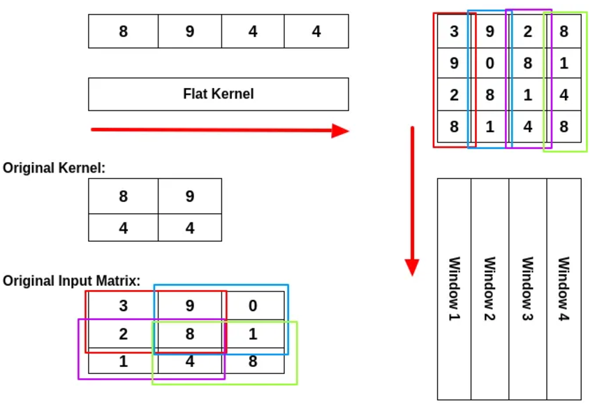

## 一、总论

当我们提到大模型 LLM 的时候，总是和 Transformer 这种架构联系在一起，似乎只有使用了 Transformer 架构的深度学习模型才配叫作大模型。

不过以我目前浅薄的认知，我倒觉得 Transformer 并不是 LLM 的核心特征，因为 LLM 的算法变化很快，Transformer 从 2017 年到现在有了多种变体，也有完全不采用 Transformer 架构的 AI。我个人感觉 LLM 的核心有两点：

- 模型参数极大：我们认为模型参数越多，模型就越智能。这是“涌现”的一种具体体现。
- 采用“预训练-微调-推理”范式：这种范式使得模型的通用性得到了增强，划分了不同的生态位。

我希望在下文中记录一下关于 LLM 或者 Foundation Model 的基础知识，以避免被这个时代抛下太久。

---

## 二、数学基础

### 2.1 张量求导

#### 2.1.1 规律

之前我多次学习张量求导的数学定义，但是总感觉非常生硬和无厘头，因为我不清楚到底要求多少次偏导，导数矩阵的形状是什么（甚至有些都不是矩阵了，而是 3 维张量了），还有如何跟我之前学过的数学分析、线性代数知识联系在一起。

经过又一次的学习，我总结出如下规律：

- 导数矩阵分量的个数，是因变量的分量个数与自变量的分量个数的乘积。这个细想下来非常显然，在求导的时候，当然应该对影响每个因变量的每个自变量求偏导，这样的每个结果就是导数矩阵中的一个分量。我们以最经典的雅各比矩阵举例，一个 $M$ 维的向量函数对于 $N$ 维的自变量向量求导，它的雅各比矩阵形状是 $M \times N$ ，也就是有 $MN$ 个分量。
- 导数矩阵的形状是出于适配链式求导法则等制定的，在梯度下降法中导数矩阵的形状需要与自变量形状相同。由上一条可知，我们已经可以确定导数矩阵中分量具体是什么了，但是如何排列这些分量组成导数矩阵依然不确定。经过我的学习，我觉得形状没有简单的规律可以总结。其核心在于一定要适用于链式法则，也就是要考虑到所有中间变量并求和（下文会有详述）。我又注意到，为了使梯度下降法生效，那么导数矩阵（也就是梯度矩阵），必须和自变量矩阵形状相同，要不然就无法实现矩阵减法了（对应元素相减）。顺便吐槽一下，梯度下降法并不是那么合理，用自变量减去导数，并没有实际意义，它只是在自变量处于极值点时，达到不动点。
- 在 ML 中，张量只是一种表示形式，高维度张量一定最终会被转化成矩阵运算。高维度导数张量是由于因变量是向量或者矩阵导致的，在 ML 中广泛存在向量值函数（比如 $softmax$）或者矩阵值函数（比如 $Attenction \space Score$）。但是不用担心，我们的最终目的是求解损失值函数对各个参数的导数矩阵，因为损失值函数是一个标量函数，所以导数矩阵一定是低维张量（后面有介绍）。

#### 2.1.2 链式法则

在标量世界中，对于 $z = g(y), y = f(x)$ ，链式法则通常写做：
$$
\frac{\partial z}{\partial x} = \frac{\partial z}{\partial y} \frac{\partial y}{\partial x}
$$
那么如果 $x$ 不再是标量，而是一个向量 $X$ 怎么办，那么我们依然可以列出来 $X$ 的任意分量 $x_i$ ，有：
$$
\frac{\partial z}{\partial x_i} = \frac{\partial z}{\partial y} \frac{\partial y}{\partial x_i}
$$
显然如果 $X$ 是一个矩阵，那么情形也是类似的，对于任意分量 $x_{ij}$ ，有：
$$
\frac{\partial z}{\partial x_{ij}} = \frac{\partial z}{\partial y} \frac{\partial y}{\partial x_{ij}}
$$
上面的都很简单且显然，那么我们可以思考一下如果 $y$ 不再是标量，而是一个 $N$ 维向量 $Y$ 怎么办？那么 $X$ 的某个分量 $x_i$ 就可以通过影响 $Y$ 的所有分量 $y_1, y_2, \dots, y_n$ 来影响 $z$ ，所以当我们求 $z$ 对 $x_i$ 的偏导的时候，要考虑到所有的 $y_k$ ，所以其形式如下：
$$
\frac{\partial z}{\partial x_{i}} = \sum_{k = 1} ^ N \frac{\partial z}{\partial y_k} \frac{\partial y_k}{\partial x_{i}}
$$
这个分量形式也可以被整理成更加规整的矩阵乘法形式（毕竟上面就是乘加运算），也就是如下所示：
$$
\frac{\partial z}{\partial \mathbf{X}} = \frac{\partial z}{\partial \mathbf{Y}} \frac{\partial Y}{\partial \mathbf{X}}

\\
= \begin{bmatrix}
\frac{\partial z}{\partial y_1} 
\frac{\partial z}{\partial y_2} 
\cdots 
\frac{\partial z}{\partial y_n}
\end{bmatrix}

\begin{bmatrix}
\frac{\partial y_1}{\partial x_{1}} & \frac{\partial y_1}{\partial x_{2}} & \cdots & \frac{\partial y_1}{\partial x_{m}} \\
\frac{\partial y_2}{\partial x_{1}} & \frac{\partial y_2}{\partial x_{2}} & \cdots & \frac{\partial y_2}{\partial x_{m}} \\
\vdots & \vdots & \ddots & \vdots \\
\frac{\partial y_n}{\partial x_{1}} & \frac{\partial y_n}{\partial x_{2}} & \cdots & \frac{\partial y_n}{\partial x_{m}}
\end{bmatrix}
$$
右边的那个方阵，就是传说中的雅各比矩阵。

我们在“规律”这一节探讨的求导矩阵的形状问题，其实核心就在于求导矩阵的形状，可以在链式法则中直接应用，而不需要经过大量的 reshape。

那如果 $X$ 和 $Y$ 有任一方是一个矩阵怎么办？可以想见，此时的雅各比矩阵就不再是二维的了，而是三维张量或者四维张量了。此时就很难整理成矩阵乘法的形式了，但是分量求和公式依然成立。

而在 ML 实践中，常常因为有些 $\frac{\partial z}{\partial y_k} \frac{\partial y_k}{\partial x_{i}}$ 项为零，进而可以简化高维张量运算。我们来举个例子，以 ML 中常见的全连接层 $Y = WX$ 为例（省略了偏置量 $B$），其中 $X$ 是 $N$ 维向量，$Y$ 是 $M$ 维向量，$W$ 是 $M \times N$ 维矩阵。那么在反向传播中，就有：
$$
\frac{\partial Y}{\partial W} = 
\begin{bmatrix}
\begin{bmatrix}
\frac{\partial y_1}{\partial w_{11}} & \frac{\partial y_1}{\partial w_{12}} & \cdots & \frac{\partial y_1}{\partial w_{1n}} \\
\frac{\partial y_1}{\partial w_{21}} & \frac{\partial y_1}{\partial w_{22}} & \cdots & \frac{\partial y_1}{\partial w_{2n}} \\
\vdots & \vdots & \ddots & \vdots \\
\frac{\partial y_1}{\partial w_{m1}} & \frac{\partial y_1}{\partial w_{m2}} & \cdots & \frac{\partial y_1}{\partial w_{mn}}
\end{bmatrix} 

\\

\begin{bmatrix}
\frac{\partial y_2}{\partial w_{11}} & \frac{\partial y_2}{\partial w_{12}} & \cdots & \frac{\partial y_2}{\partial w_{1n}} \\
\frac{\partial y_2}{\partial w_{21}} & \frac{\partial y_2}{\partial w_{22}} & \cdots & \frac{\partial y_2}{\partial w_{2n}} \\
\vdots & \vdots & \ddots & \vdots \\
\frac{\partial y_2}{\partial w_{m1}} & \frac{\partial y_2}{\partial w_{m2}} & \cdots & \frac{\partial y_2}{\partial w_{mn}}
\end{bmatrix}

\\

\vdots

\\

\begin{bmatrix}
\frac{\partial y_n}{\partial w_{11}} & \frac{\partial y_n}{\partial w_{12}} & \cdots & \frac{\partial y_n}{\partial w_{1n}} \\
\frac{\partial y_n}{\partial w_{21}} & \frac{\partial y_n}{\partial w_{22}} & \cdots & \frac{\partial y_n}{\partial w_{2n}} \\
\vdots & \vdots & \ddots & \vdots \\
\frac{\partial y_n}{\partial w_{m1}} & \frac{\partial y_n}{\partial w_{m2}} & \cdots & \frac{\partial y_n}{\partial w_{mn}}
\end{bmatrix}

\end{bmatrix}
$$
这个式子看着就非常恐怖，再进行矩阵运算不得活活难死（其实还好），但是我们注意到对于任意分量 $y_i$ ，它等于：
$$
y_i = \sum_{j = 0}^N w_{ij} x_j
$$
也就是说，对于特定的 $i$， $y_i$ 不和 $W$ 的所有分量有关，而是只跟 $W$ 第 $i$ 行分量有关，也就是：
$$
\frac{\partial Y}{\partial W} = 
\begin{bmatrix}
\begin{bmatrix}
\frac{\partial y_1}{\partial w_{11}} & \frac{\partial y_1}{\partial w_{12}} & \cdots & \frac{\partial y_1}{\partial w_{1n}} \\
0 & 0 & \cdots & 0 \\
\vdots & \vdots & \ddots & \vdots \\
0 & 0 & \cdots & 0 \\
\end{bmatrix} 

\\

\begin{bmatrix}
0 & 0 & \cdots & 0 \\
\frac{\partial y_2}{\partial w_{21}} & \frac{\partial y_2}{\partial w_{22}} & \cdots & \frac{\partial y_2}{\partial w_{2n}} \\
\vdots & \vdots & \ddots & \vdots \\
0 & 0 & \cdots & 0 \\
\end{bmatrix}

\\

\vdots

\\

\begin{bmatrix}
0 & 0 & \cdots & 0 \\
0 & 0 & \cdots & 0 \\
\vdots & \vdots & \ddots & \vdots \\
\frac{\partial y_n}{\partial w_{m1}} & \frac{\partial y_n}{\partial w_{m2}} & \cdots & \frac{\partial y_n}{\partial w_{mn}}
\end{bmatrix}

\end{bmatrix}

=

\begin{bmatrix}
\begin{bmatrix}
x_1 & x_2 & \cdots & x_n \\
0 & 0 & \cdots & 0 \\
\vdots & \vdots & \ddots & \vdots \\
0 & 0 & \cdots & 0 \\
\end{bmatrix} 

\\

\begin{bmatrix}
0 & 0 & \cdots & 0 \\
x_1 & x_2 & \cdots & x_n \\
\vdots & \vdots & \ddots & \vdots \\
0 & 0 & \cdots & 0 \\
\end{bmatrix}

\\

\vdots

\\

\begin{bmatrix}
0 & 0 & \cdots & 0 \\
0 & 0 & \cdots & 0 \\
\vdots & \vdots & \ddots & \vdots \\
x_1 & x_2 & \cdots & x_n \\
\end{bmatrix}
\end{bmatrix}
$$
其实我们都没有必要再关注这个复杂的 $\frac{\partial Y}{\partial W}$ 的稀疏性质了，我们直接回归本源，我们的核心目的是求解损失函数 $l$ 对 $W$ 的导数，那么按照原本来说，有：
$$
\frac{\partial l}{\partial w_{ij}} = \sum_{k = 0}^M \frac{\partial l}{\partial y_k} \frac{\partial y_k}{\partial w_{ij}}
$$
又因为在 $i,j$ 确定的情况下， $w_{ij}$ 只会影响 $Y$ 的 $y_i$ 分量，所以上面这个式子就会变化成：
$$
\frac{\partial l}{\partial w_{ij}} = \sum_{k = 0}^M \frac{\partial l}{\partial y_k} \frac{\partial y_k}{\partial w_{ij}} = \frac{\partial l}{\partial y_i}\frac{\partial y_i}{\partial w_{ij}} = \frac{\partial l}{\partial y_i}x_j
$$
有了这样的化简后，就可以被整理成新的向量乘法，如下所示：
$$
\frac{\partial l}{\partial W} = \frac{\partial l}{\partial Y} X^T
$$
再次变得简洁优雅。

这件事情很启发我，我之前学习反向传播时，太关注复杂的神经网络的梯度的张量表示了，动不动就会出现三维或者四维的张量，然后陷入停滞。而实际上，就算在数学上产生了这些拦路虎，我们也并不在意，因为这些高维张量本来就不是我们的目的，它只是链式求和公式的一种形式。我们会重新回到链式求和公式，来构建更加简单的矩阵乘法，而不是固守高维张量。

#### 2.1.3 标量-张量

标量对张量进行求导时，生成的导数矩阵和张量（无论张量是标量、向量还是矩阵）的形状完全相同。比如说对于一个 $N$ 维列向量 $X$ ，其导数矩阵如下所示：
$$
\frac{\partial y}{\partial \mathbf{X}} = 
\begin{bmatrix}
\frac{\partial y}{\partial x_1} \\
\frac{\partial y}{\partial x_2} \\
\vdots \\
\frac{\partial y}{\partial x_n}
\end{bmatrix}
$$
而对于 $M \times N$ 维的矩阵求导，其形式也是类似的：
$$
\frac{\partial y}{\partial \mathbf{X}} = 
\begin{bmatrix}
\frac{\partial y}{\partial x_{11}} & \frac{\partial y}{\partial x_{12}} & \cdots & \frac{\partial y}{\partial x_{1n}} \\
\frac{\partial y}{\partial x_{21}} & \frac{\partial y}{\partial x_{22}} & \cdots & \frac{\partial y}{\partial x_{2n}} \\
\vdots & \vdots & \ddots & \vdots \\
\frac{\partial y}{\partial x_{m1}} & \frac{\partial y}{\partial x_{m2}} & \cdots & \frac{\partial y}{\partial x_{mn}}
\end{bmatrix}
$$

#### 2.1.4 张量-张量

当因变量是张量的时候，就是对于因变量张量的每一个分量都应用一遍上文介绍的“标量-张量”方法。因变量分量会组成导数张量的外层维度，每个元素都是一个“标量-张量”导数矩阵。我们举个例子，有 $2 \times 3$ 维的向量 $X$ 和 $3 \times 2$ 维的 $Y$ 相乘得到 $2 \times 2$ 维的 $Z$ ，对于 $\frac{\partial Z}{\partial X}$ 有：
$$
\frac{\partial Z}{\partial X} =

\begin{bmatrix}
\frac{\partial z_{11}}{\partial X} & \frac{\partial z_{12}}{\partial X} \\
\frac{\partial z_{21}}{\partial X} & \frac{\partial z_{22}}{\partial X} \\
\end{bmatrix}

=

\begin{bmatrix}
\begin{bmatrix}
\frac{\partial z_{11}}{\partial x_{11}} & \frac{\partial z_{11}}{\partial x_{12}} & \frac{\partial z_{11}}{\partial x_{13}} \\
\frac{\partial z_{11}}{\partial x_{21}} & \frac{\partial z_{11}}{\partial x_{22}} & \frac{\partial z_{11}}{\partial x_{23}} \\
\end{bmatrix}
& 
\begin{bmatrix}
\frac{\partial z_{12}}{\partial x_{11}} & \frac{\partial z_{12}}{\partial x_{12}} & \frac{\partial z_{12}}{\partial x_{13}} \\
\frac{\partial z_{12}}{\partial x_{21}} & \frac{\partial z_{21}}{\partial x_{22}} & \frac{\partial z_{21}}{\partial x_{23}} \\
\end{bmatrix}

\\

\begin{bmatrix}
\frac{\partial z_{21}}{\partial x_{11}} & \frac{\partial z_{21}}{\partial x_{12}} & \frac{\partial z_{21}}{\partial x_{13}} \\
\frac{\partial z_{21}}{\partial x_{21}} & \frac{\partial z_{21}}{\partial x_{22}} & \frac{\partial z_{21}}{\partial x_{23}} \\
\end{bmatrix}
& 
\begin{bmatrix}
\frac{\partial z_{22}}{\partial x_{11}} & \frac{\partial z_{22}}{\partial x_{12}} & \frac{\partial z_{22}}{\partial x_{13}} \\
\frac{\partial z_{22}}{\partial x_{21}} & \frac{\partial z_{22}}{\partial x_{22}} & \frac{\partial z_{22}}{\partial x_{23}} \\
\end{bmatrix}
\end{bmatrix}
$$
可以看到最后形成了四维 $2 \times 2 \times 2 \times 3$ 的导数矩阵。

如果我们考虑“向量-向量”这种特殊形式的求导，就会生成著名的雅可比矩阵（Jacobian Matrix）。考虑 $M$ 维 $Y$ 向量对 $N$ 维 $X$ 向量求导，有：
$$
J = \frac{\partial \mathbf{Y}}{\partial \mathbf{X}} =
\begin{bmatrix}
\frac{\partial y_1}{\partial x_1} & \frac{\partial y_1}{\partial x_2} & \cdots & \frac{\partial y_1}{\partial x_n} \\
\frac{\partial y_2}{\partial x_1} & \frac{\partial y_2}{\partial x_2} & \cdots & \frac{\partial y_2}{\partial x_n} \\
\vdots & \vdots & \ddots & \vdots \\
\frac{\partial y_m}{\partial x_1} & \frac{\partial y_m}{\partial x_2} & \cdots & \frac{\partial y_m}{\partial x_n}
\end{bmatrix}
$$
这里列出的方阵，横轴是 $x$ 分量，而纵轴是 $y$ 分量。我个人觉得只要保证链式法则的基本要求，似乎转置一下也没有大关系，矩阵形状和矩阵乘法，只不过是一种简写的方式。

在 ML 中因为向量值函数很常见，所以经常可能会出现高维度张量，它们似乎就无法被擅长矩阵这种低维张量计算的 GPU 或者加速器中处理了，而实际上，正如“链式法则”这一章节中提到的，我们很少真正计算高维度张量。

### 2.2 FLOPS

#### 2.2.1 GEMM

GEMM 即 General Matrix Multiply ，就是最为常见的矩阵乘法操作。

对于一个 $M \times K$ 的矩阵与一个 $K \times N$ 的矩阵进行 GEMM 运算，FLOPS 是 $2 MNK$ 。

这是因为结果矩阵中有 $MN$ 个元素，而每个元素都是一个 $K$ 维行向量和一个 $K$ 维列向量的点积结果。而点积需要进行 $K$ 次乘法操作和 $K - 1$ 次加法操作，故总共需要约 $2K$ 次操作（其实我觉得这里存疑，因为如果是 MAC，Multi-Add 的话，其实点积只需要 $K$ 次操作）。进而 GEMM 需要 $2MNK$ 次操作。 

总之在 GEMM 中，FLOPS 分别是 3 个维度的一次函数。

#### 2.2.2 损失函数

在神经网络中的最后一层，往往输出一个 $N$ 维向量 $Z$ ，我们需要根据向量 $Z$ 来计算损失函数 $l$ ，我们考虑一种最常见的损失函数：
$$
l = \sum^{N}_{i = 1} (z_i - t)^2
$$
其中 $t$ 是目标期望值，那么就有：
$$
\frac{\partial l}{\partial Z} = 2(Z - T)
$$
其中 $T$ 是一个每个分量均为 $t$ 的 $N$ 维向量。因为要进行 $N$ 次元素操作，此时的 FLOPS 就是 $N$ 。

#### 2.2.3 隐藏层

我们首先定义一下隐藏层，首先我们有一个 $N$ 维的输入向量 $I$ ，他会先经过线性变换变成一个 $M$ 维向量 $Y$ ，如下所示：
$$
Y = WI + B
$$
 然后经过激活函数 $\sigma(Y)$ 的元素变化进行激活，有：
$$
\sigma(y_i) = \frac{1}{1 + e^{-x}}
$$
我们记录 $M$ 维向量 $O$ 为激活后的值，即：
$$
O = \sigma(Y)
$$
我们首先计算正向传播一个向量的 FLOPS。在计算 $Y$ 这个步骤的 FLOPS 是 $2NM$ ，计算 $O$ 这个步骤是 $M$ ，所以总体的 FLOPS 就是 $2NM + M$  （常数凑活看吧，领会精神）。

然后我们计算反向传播一个向量的 FLOPS。我们还需要定义一些其他辅助计算的符号。反向传播是遵循链式法则的，所以我们在计算当前层时，一定已经有了后面一个隐藏层输入的梯度，而后一个隐藏层的输入就是当前隐藏层的输出，也就是说，我们已知 $\frac{\partial l}{\partial O}$ 的值了。

在这个反向传播的过程中，我们希望求解参数的梯度 $\frac{\partial l}{\partial W}, \frac{\partial l}{\partial B}$ ，此外，我们还需要求解 $\frac{\partial l}{\partial I}$ ，虽然这个值和当前层的参数更新没有关系，但是上一层的反向传播的参数梯度，需要 $\frac{\partial l}{\partial I}$ ，正如我们需要  $\frac{\partial l}{\partial O}$ 一样。

首先我们计算激活值的梯度，有
$$
\frac{\partial l}{\partial Y} = \frac{\partial l}{\partial O} \frac{\partial O}{\partial Y}
$$
又因为有：
$$
\sigma'(x) = \sigma(x) \cdot (1 - \sigma(x))
$$
所以有：
$$
\frac{\partial O}{\partial Y} = 
\begin{bmatrix}
o_1 (1 - o_1) \\
o_2 (1 - o_2) \\
\cdots \\
o_m (1 - o_m)
\end{bmatrix}
$$
计算 $\frac{\partial l}{\partial Y}$ 的过程总 FLOPS 是 $2M$ ，先计算出 $\frac{\partial O}{\partial Y}$ 的 FLOPS 是 $M$ ，然后 $\frac{\partial l}{\partial O}$ 和 $\frac{\partial O}{\partial Y}$ 对应元素相乘，FLOPS 是 $M$ 。

然后我们计算权重矩阵的梯度，有：
$$
\frac{\partial l}{\partial W} = \frac{\partial l}{\partial Y} \frac{\partial Y}{\partial W}
$$
按理说 $\frac{\partial Y}{\partial W}$ 是一个三维张量，比较难处理，但是又因为线性变换的特性（在“链式规则”处证明），有：
$$
\frac{\partial l}{\partial W} = \frac{\partial l}{\partial Y} I^T
$$
因为 $\frac{\partial l}{\partial Y}$ 是 $M$ 维， $I$ 是 $N$ 维，所以总 FLOPS 是 $MN$ （没有加法过程，所以没有常数 $2$）。但是如果还要考虑用 $\frac{\partial l}{\partial W}$ 来修正 $W$ ，那么总 FLOPS 就是 $2MN$ 。

然后我们计算偏置量的梯度，有：
$$
\frac{\partial l}{\partial B} = \frac{\partial l}{\partial Y} \frac{\partial Y}{\partial B}
$$
又因为：
$$
\frac{\partial Y}{\partial B} =
\begin{bmatrix}
1 \\
1 \\
\cdots \\
1
\end{bmatrix}
$$
所以：
$$
\frac{\partial l}{\partial B} = \frac{\partial l}{\partial Y}
$$
FLOPS 直接可忽略，如果算上更新 $B$ ，那么 FLOPS 是 $N$ 。

最后我们还需要计算 $\frac{\partial l}{\partial I}$ ，有：
$$
\frac{\partial l}{\partial I} = \frac{\partial l}{\partial Y} \frac{\partial Y}{\partial I}
$$
又因为：
$$
\frac{\partial Y}{\partial I} = W^T
$$
所以总的 FLOPS 是一次 $M$ 维向量与 $M \times N$ 维矩阵乘法的 FLOPS，也就是 $2MN$ 。

所以总得来看，反向传播的 FLOPS 是 $4MN$ 左右，但是这个值很没有意义，只是说，它的量值依然是正比于输入维度 $N$ 和输出维度 $M$ 。

#### 2.2.4 Attention

Softmax 是一个独特的元素映射函数，这里记录一下它的梯度函数。设 softmax 的输入是一个 $N$ 维向量 $Z$ ，输出是一个 $N$ 维向量 $P$ ，有：
$$
\frac{\partial l}{\partial Z} = \frac{\partial l}{\partial P} \frac{\partial P}{\partial Z}
$$
其中 $\frac{\partial P}{\partial Z}$ 是一个 $N \times N$ 维的雅克比矩阵。有如下定理，当 $i = j$ 时：
$$
\frac{\partial p_{i}}{\partial z_j} = p_i(1 - p_i)
$$
当 $i \ne j$ 时：
$$
\frac{\partial p_{i}}{\partial z_j} = -p_ip_j
$$
那么这里的反向传播的本质也是一个矩阵与向量乘法，FLOPS 大约是 $N^2$ 。

而 Attention 的其他部分用到了在隐藏层中没有出现过的矩阵乘法，比如说 $QK^T$ 计算，看似会产生四维张量，实际上和线性变换类似，非常直观，设：
$$
S = \frac{QK^T}{\sqrt{d_k}}
$$
有：
$$
\frac{\partial l}{\partial Q} = \frac{\partial l}{\partial S} \frac{\partial S}{\partial Q} = \frac{1}{\sqrt{d_k}} \frac{\partial l}{\partial S} K \\
\frac{\partial l}{\partial K} = \frac{\partial l}{\partial S} \frac{\partial S}{\partial K} = \frac{1}{\sqrt{d_k}} \frac{\partial l}{\partial S} Q
$$
因此依然是矩阵与向量乘法的 FLOPS，FLOPS 是 $Q,K$ 维度的乘积，也就是 $seq\_len \times d_{key}$ 。

### 2.3 IM2Col

IM2Col 的意思是 Image To Column，本质是将卷积计算转换成矩阵乘法，然后因为矩阵乘法已经被优化得很好了，所以可以加速计算。如下所示：

但是这种方式并不从理论上减少计算的复杂度，只是比较简单实现，并且效果较好。此外 FFT 也可以用于加速卷积计算，并且是理论上加速。

---

## 三、Transformer

