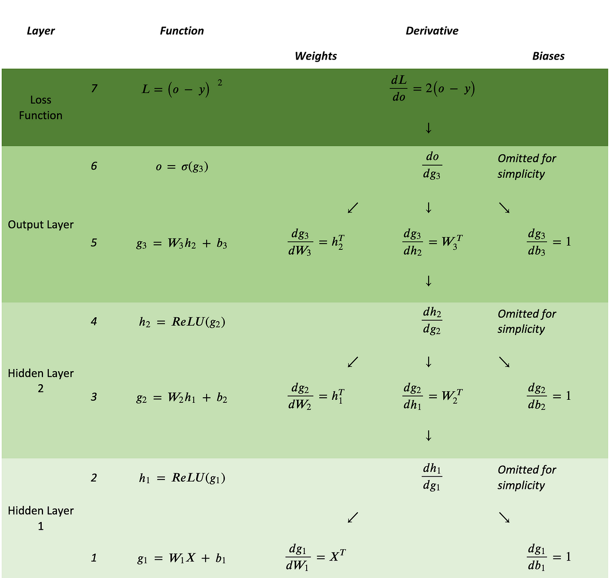
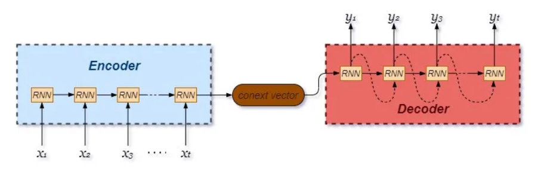
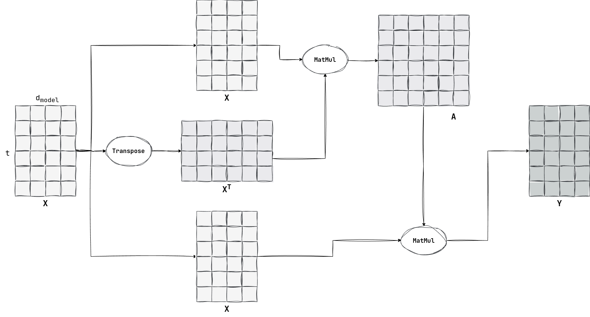
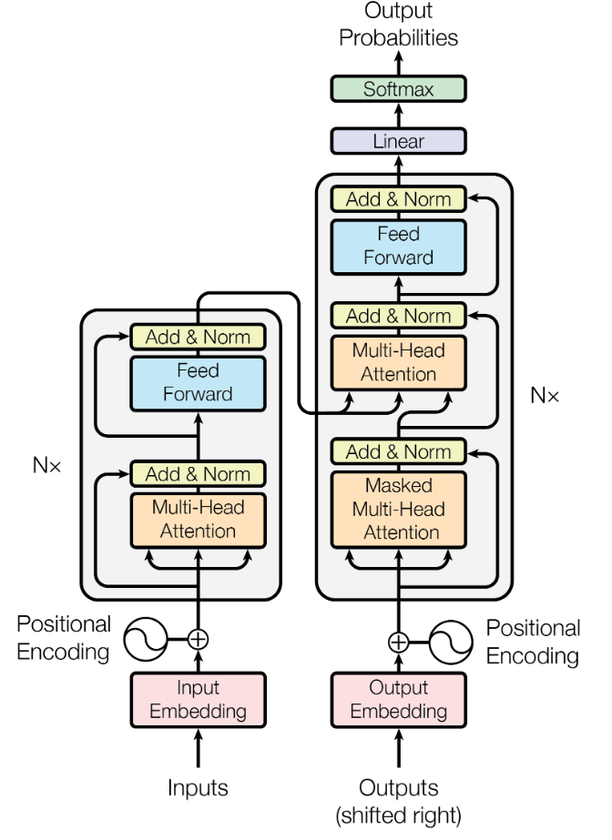
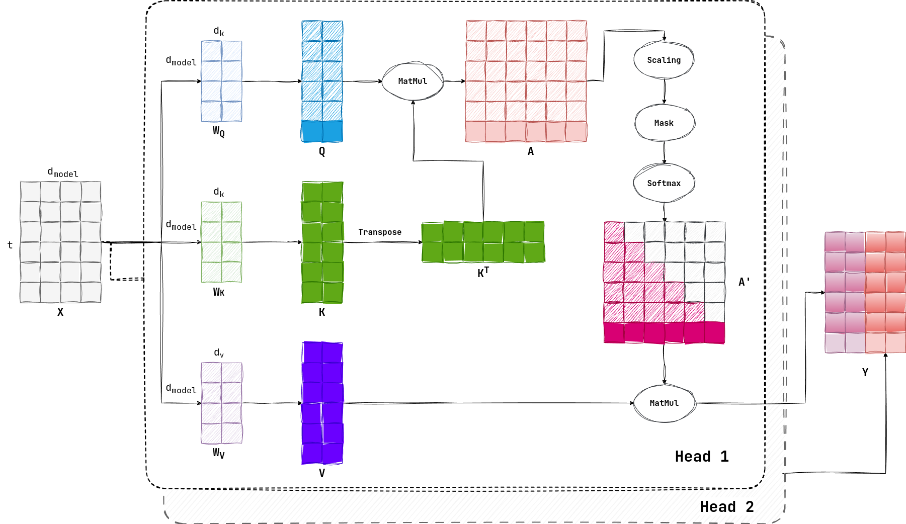

## 一、总论

当我们提到大模型 LLM 的时候，总是和 Transformer 这种架构联系在一起，似乎只有使用了 Transformer 架构的深度学习模型才配叫作大模型。

不过以我目前浅薄的认知，我倒觉得 Transformer 并不是 LLM 的核心特征，因为 LLM 的算法变化很快，Transformer 从 2017 年到现在有了多种变体，也有完全不采用 Transformer 架构的 AI。我个人感觉 LLM 的核心有两点：

- 模型参数极大：我们认为模型参数越多，模型就越智能。这是“涌现”的一种具体体现。
- 采用“预训练-微调-推理”范式：这种范式使得模型的通用性得到了增强，划分了不同的生态位。

我希望在下文中记录一下关于 LLM 或者 Foundation Model 的基础知识，以避免被这个时代抛下太久。

---


## 二、数学基础

### 2.1 张量求导

#### 2.1.1 规律

之前我多次学习张量求导的数学定义，但是总感觉非常生硬和无厘头，因为我不清楚到底要求多少次偏导，导数矩阵的形状是什么（甚至有些都不是矩阵了，而是 3 维张量了），还有如何跟我之前学过的数学分析、线性代数知识联系在一起。

经过又一次的学习，我总结出如下规律：

- 导数矩阵分量的个数，是因变量的分量个数与自变量的分量个数的乘积。这个细想下来非常显然，在求导的时候，当然应该对影响每个因变量的每个自变量求偏导，这样的每个结果就是导数矩阵中的一个分量。我们以最经典的雅各比矩阵举例，一个 $M$ 维的向量函数对于 $N$ 维的自变量向量求导，它的雅各比矩阵形状是 $M \times N$ ，也就是有 $MN$ 个分量。
- 导数矩阵的形状是出于适配链式求导法则等制定的，在梯度下降法中导数矩阵的形状需要与自变量形状相同。由上一条可知，我们已经可以确定导数矩阵中分量具体是什么了，但是如何排列这些分量组成导数矩阵依然不确定。经过我的学习，我觉得形状没有简单的规律可以总结。其核心在于一定要适用于链式法则，也就是要考虑到所有中间变量并求和（下文会有详述）。我又注意到，为了使梯度下降法生效，那么导数矩阵（也就是梯度矩阵），必须和自变量矩阵形状相同，要不然就无法实现矩阵减法了（对应元素相减）。顺便吐槽一下，梯度下降法并不是那么合理，用自变量减去导数，并没有实际意义，它只是在自变量处于极值点时，达到不动点。
- 在 ML 中，张量只是一种表示形式，高维度张量一定最终会被转化成矩阵运算。高维度导数张量是由于因变量是向量或者矩阵导致的，在 ML 中广泛存在向量值函数（比如 $softmax$）或者矩阵值函数（比如 $Attenction \space Score$）。但是不用担心，我们的最终目的是求解损失值函数对各个参数的导数矩阵，因为损失值函数是一个标量函数，所以导数矩阵一定是低维张量（后面有介绍）。

#### 2.1.2 链式法则

在标量世界中，对于 $z = g(y), y = f(x)$ ，链式法则通常写做：
$$
\frac{\partial z}{\partial x} = \frac{\partial z}{\partial y} \frac{\partial y}{\partial x}
$$
那么如果 $x$ 不再是标量，而是一个向量 $X$ 怎么办，那么我们依然可以列出来 $X$ 的任意分量 $x_i$ ，有：
$$
\frac{\partial z}{\partial x_i} = \frac{\partial z}{\partial y} \frac{\partial y}{\partial x_i}
$$
显然如果 $X$ 是一个矩阵，那么情形也是类似的，对于任意分量 $x_{ij}$ ，有：
$$
\frac{\partial z}{\partial x_{ij}} = \frac{\partial z}{\partial y} \frac{\partial y}{\partial x_{ij}}
$$
上面的都很简单且显然，那么我们可以思考一下如果 $y$ 不再是标量，而是一个 $N$ 维向量 $Y$ 怎么办？那么 $X$ 的某个分量 $x_i$ 就可以通过影响 $Y$ 的所有分量 $y_1, y_2, \dots, y_n$ 来影响 $z$ ，所以当我们求 $z$ 对 $x_i$ 的偏导的时候，要考虑到所有的 $y_k$ ，所以其形式如下：
$$
\frac{\partial z}{\partial x_{i}} = \sum_{k = 1} ^ N \frac{\partial z}{\partial y_k} \frac{\partial y_k}{\partial x_{i}}
$$
这个分量形式也可以被整理成更加规整的矩阵乘法形式（毕竟上面就是乘加运算），也就是如下所示：
$$
\frac{\partial z}{\partial \mathbf{X}} = \frac{\partial z}{\partial \mathbf{Y}} \frac{\partial Y}{\partial \mathbf{X}}

\\
= \begin{bmatrix}
\frac{\partial z}{\partial y_1} 
\frac{\partial z}{\partial y_2} 
\cdots 
\frac{\partial z}{\partial y_n}
\end{bmatrix}

\begin{bmatrix}
\frac{\partial y_1}{\partial x_{1}} & \frac{\partial y_1}{\partial x_{2}} & \cdots & \frac{\partial y_1}{\partial x_{m}} \\
\frac{\partial y_2}{\partial x_{1}} & \frac{\partial y_2}{\partial x_{2}} & \cdots & \frac{\partial y_2}{\partial x_{m}} \\
\vdots & \vdots & \ddots & \vdots \\
\frac{\partial y_n}{\partial x_{1}} & \frac{\partial y_n}{\partial x_{2}} & \cdots & \frac{\partial y_n}{\partial x_{m}}
\end{bmatrix}
$$
右边的那个方阵，就是传说中的雅各比矩阵。

我们在“规律”这一节探讨的求导矩阵的形状问题，其实核心就在于求导矩阵的形状，可以在链式法则中直接应用，而不需要经过大量的 reshape。

那如果 $X$ 和 $Y$ 有任一方是一个矩阵怎么办？可以想见，此时的雅各比矩阵就不再是二维的了，而是三维张量或者四维张量了。此时就很难整理成矩阵乘法的形式了，但是分量求和公式依然成立。

而在 ML 实践中，常常因为有些 $\frac{\partial z}{\partial y_k}\frac{\partial y_k}{\partial x_i}$ 项为零，进而可以简化高维张量运算。

我们来举个例子，以 ML 中常见的全连接层 $Y = WX$ 为例（省略了偏置量 $B$），其中 $X$ 是 $N$ 维向量，$Y$ 是 $M$ 维向量，$W$ 是 $M \times N$ 维矩阵。那么在反向传播中，就有：
$$
\frac{\partial Y}{\partial W} = 
\begin{bmatrix}
\begin{bmatrix}
\frac{\partial y_1}{\partial w_{11}} & \frac{\partial y_1}{\partial w_{12}} & \cdots & \frac{\partial y_1}{\partial w_{1n}} \\
\frac{\partial y_1}{\partial w_{21}} & \frac{\partial y_1}{\partial w_{22}} & \cdots & \frac{\partial y_1}{\partial w_{2n}} \\
\vdots & \vdots & \ddots & \vdots \\
\frac{\partial y_1}{\partial w_{m1}} & \frac{\partial y_1}{\partial w_{m2}} & \cdots & \frac{\partial y_1}{\partial w_{mn}}
\end{bmatrix} 

\\

\begin{bmatrix}
\frac{\partial y_2}{\partial w_{11}} & \frac{\partial y_2}{\partial w_{12}} & \cdots & \frac{\partial y_2}{\partial w_{1n}} \\
\frac{\partial y_2}{\partial w_{21}} & \frac{\partial y_2}{\partial w_{22}} & \cdots & \frac{\partial y_2}{\partial w_{2n}} \\
\vdots & \vdots & \ddots & \vdots \\
\frac{\partial y_2}{\partial w_{m1}} & \frac{\partial y_2}{\partial w_{m2}} & \cdots & \frac{\partial y_2}{\partial w_{mn}}
\end{bmatrix}

\\

\vdots

\\

\begin{bmatrix}
\frac{\partial y_n}{\partial w_{11}} & \frac{\partial y_n}{\partial w_{12}} & \cdots & \frac{\partial y_n}{\partial w_{1n}} \\
\frac{\partial y_n}{\partial w_{21}} & \frac{\partial y_n}{\partial w_{22}} & \cdots & \frac{\partial y_n}{\partial w_{2n}} \\
\vdots & \vdots & \ddots & \vdots \\
\frac{\partial y_n}{\partial w_{m1}} & \frac{\partial y_n}{\partial w_{m2}} & \cdots & \frac{\partial y_n}{\partial w_{mn}}
\end{bmatrix}

\end{bmatrix}
$$
这个式子看着就非常恐怖，再进行矩阵运算不得活活难死（其实还好），但是我们注意到对于任意分量 $y_i$ ，它等于：
$$
y_i = \sum_{j = 0}^N w_{ij} x_j
$$
也就是说，对于特定的 $i$， $y_i$ 不和 $W$ 的所有分量有关，而是只跟 $W$ 第 $i$ 行分量有关，也就是：
$$
\frac{\partial Y}{\partial W} = 
\begin{bmatrix}
\begin{bmatrix}
\frac{\partial y_1}{\partial w_{11}} & \frac{\partial y_1}{\partial w_{12}} & \cdots & \frac{\partial y_1}{\partial w_{1n}} \\
0 & 0 & \cdots & 0 \\
\vdots & \vdots & \ddots & \vdots \\
0 & 0 & \cdots & 0 \\
\end{bmatrix} 

\\

\begin{bmatrix}
0 & 0 & \cdots & 0 \\
\frac{\partial y_2}{\partial w_{21}} & \frac{\partial y_2}{\partial w_{22}} & \cdots & \frac{\partial y_2}{\partial w_{2n}} \\
\vdots & \vdots & \ddots & \vdots \\
0 & 0 & \cdots & 0 \\
\end{bmatrix}

\\

\vdots

\\

\begin{bmatrix}
0 & 0 & \cdots & 0 \\
0 & 0 & \cdots & 0 \\
\vdots & \vdots & \ddots & \vdots \\
\frac{\partial y_n}{\partial w_{m1}} & \frac{\partial y_n}{\partial w_{m2}} & \cdots & \frac{\partial y_n}{\partial w_{mn}}
\end{bmatrix}

\end{bmatrix}

=

\begin{bmatrix}
\begin{bmatrix}
x_1 & x_2 & \cdots & x_n \\
0 & 0 & \cdots & 0 \\
\vdots & \vdots & \ddots & \vdots \\
0 & 0 & \cdots & 0 \\
\end{bmatrix} 

\\

\begin{bmatrix}
0 & 0 & \cdots & 0 \\
x_1 & x_2 & \cdots & x_n \\
\vdots & \vdots & \ddots & \vdots \\
0 & 0 & \cdots & 0 \\
\end{bmatrix}

\\

\vdots

\\

\begin{bmatrix}
0 & 0 & \cdots & 0 \\
0 & 0 & \cdots & 0 \\
\vdots & \vdots & \ddots & \vdots \\
x_1 & x_2 & \cdots & x_n \\
\end{bmatrix}
\end{bmatrix}
$$
其实我们都没有必要再关注这个复杂的 $\frac{\partial Y}{\partial W}$ 的稀疏性质了，我们直接回归本源，我们的核心目的是求解损失函数 $l$ 对 $W$ 的导数，那么按照原本来说，有：
$$
\frac{\partial l}{\partial w_{ij}} = \sum_{k = 0}^M \frac{\partial l}{\partial y_k} \frac{\partial y_k}{\partial w_{ij}}
$$
又因为在 $i,j$ 确定的情况下， $w_{ij}$ 只会影响 $Y$ 的 $y_i$ 分量，所以上面这个式子就会变化成：
$$
\frac{\partial l}{\partial w_{ij}} = \sum_{k = 0}^M \frac{\partial l}{\partial y_k} \frac{\partial y_k}{\partial w_{ij}} = \frac{\partial l}{\partial y_i}\frac{\partial y_i}{\partial w_{ij}} = \frac{\partial l}{\partial y_i}x_j
$$
有了这样的化简后，就可以被整理成新的向量乘法，如下所示：
$$
\frac{\partial l}{\partial W} = \frac{\partial l}{\partial Y} X^T
$$
再次变得简洁优雅。

这件事情很启发我，我之前学习反向传播时，太关注复杂的神经网络的梯度的张量表示了，动不动就会出现三维或者四维的张量，然后陷入停滞。而实际上，就算在数学上产生了这些拦路虎，我们也并不在意，因为这些高维张量本来就不是我们的目的，它只是链式求和公式的一种形式。我们会重新回到链式求和公式，来构建更加简单的矩阵乘法，而不是固守高维张量。

#### 2.1.3 标量-张量

标量对张量进行求导时，生成的导数矩阵和张量（无论张量是标量、向量还是矩阵）的形状完全相同。比如说对于一个 $N$ 维列向量 $X$ ，其导数矩阵如下所示：
$$
\frac{\partial y}{\partial \mathbf{X}} = 
\begin{bmatrix}
\frac{\partial y}{\partial x_1} \\
\frac{\partial y}{\partial x_2} \\
\vdots \\
\frac{\partial y}{\partial x_n}
\end{bmatrix}
$$
而对于 $M \times N$ 维的矩阵求导，其形式也是类似的：
$$
\frac{\partial y}{\partial \mathbf{X}} = 
\begin{bmatrix}
\frac{\partial y}{\partial x_{11}} & \frac{\partial y}{\partial x_{12}} & \cdots & \frac{\partial y}{\partial x_{1n}} \\
\frac{\partial y}{\partial x_{21}} & \frac{\partial y}{\partial x_{22}} & \cdots & \frac{\partial y}{\partial x_{2n}} \\
\vdots & \vdots & \ddots & \vdots \\
\frac{\partial y}{\partial x_{m1}} & \frac{\partial y}{\partial x_{m2}} & \cdots & \frac{\partial y}{\partial x_{mn}}
\end{bmatrix}
$$

#### 2.1.4 张量-张量

当因变量是张量的时候，就是对于因变量张量的每一个分量都应用一遍上文介绍的“标量-张量”方法。因变量分量会组成导数张量的外层维度，每个元素都是一个“标量-张量”导数矩阵。我们举个例子，有 $2 \times 3$ 维的向量 $X$ 和 $3 \times 2$ 维的 $Y$ 相乘得到 $2 \times 2$ 维的 $Z$ ，对于 $\frac{\partial Z}{\partial X}$ 有：
$$
\frac{\partial Z}{\partial X} =

\begin{bmatrix}
\frac{\partial z_{11}}{\partial X} & \frac{\partial z_{12}}{\partial X} \\
\frac{\partial z_{21}}{\partial X} & \frac{\partial z_{22}}{\partial X} \\
\end{bmatrix}

=

\begin{bmatrix}
\begin{bmatrix}
\frac{\partial z_{11}}{\partial x_{11}} & \frac{\partial z_{11}}{\partial x_{12}} & \frac{\partial z_{11}}{\partial x_{13}} \\
\frac{\partial z_{11}}{\partial x_{21}} & \frac{\partial z_{11}}{\partial x_{22}} & \frac{\partial z_{11}}{\partial x_{23}} \\
\end{bmatrix}
& 
\begin{bmatrix}
\frac{\partial z_{12}}{\partial x_{11}} & \frac{\partial z_{12}}{\partial x_{12}} & \frac{\partial z_{12}}{\partial x_{13}} \\
\frac{\partial z_{12}}{\partial x_{21}} & \frac{\partial z_{21}}{\partial x_{22}} & \frac{\partial z_{21}}{\partial x_{23}} \\
\end{bmatrix}

\\

\begin{bmatrix}
\frac{\partial z_{21}}{\partial x_{11}} & \frac{\partial z_{21}}{\partial x_{12}} & \frac{\partial z_{21}}{\partial x_{13}} \\
\frac{\partial z_{21}}{\partial x_{21}} & \frac{\partial z_{21}}{\partial x_{22}} & \frac{\partial z_{21}}{\partial x_{23}} \\
\end{bmatrix}
& 
\begin{bmatrix}
\frac{\partial z_{22}}{\partial x_{11}} & \frac{\partial z_{22}}{\partial x_{12}} & \frac{\partial z_{22}}{\partial x_{13}} \\
\frac{\partial z_{22}}{\partial x_{21}} & \frac{\partial z_{22}}{\partial x_{22}} & \frac{\partial z_{22}}{\partial x_{23}} \\
\end{bmatrix}
\end{bmatrix}
$$
可以看到最后形成了四维 $2 \times 2 \times 2 \times 3$ 的导数矩阵。

如果我们考虑“向量-向量”这种特殊形式的求导，就会生成著名的雅可比矩阵（Jacobian Matrix）。考虑 $M$ 维 $Y$ 向量对 $N$ 维 $X$ 向量求导，有：
$$
J = \frac{\partial \mathbf{Y}}{\partial \mathbf{X}} =
\begin{bmatrix}
\frac{\partial y_1}{\partial x_1} & \frac{\partial y_1}{\partial x_2} & \cdots & \frac{\partial y_1}{\partial x_n} \\
\frac{\partial y_2}{\partial x_1} & \frac{\partial y_2}{\partial x_2} & \cdots & \frac{\partial y_2}{\partial x_n} \\
\vdots & \vdots & \ddots & \vdots \\
\frac{\partial y_m}{\partial x_1} & \frac{\partial y_m}{\partial x_2} & \cdots & \frac{\partial y_m}{\partial x_n}
\end{bmatrix}
$$
这里列出的方阵，横轴是 $x$ 分量，而纵轴是 $y$ 分量。我个人觉得只要保证链式法则的基本要求，似乎转置一下也没有大关系，矩阵形状和矩阵乘法，只不过是一种简写的方式。

在 ML 中因为向量值函数很常见，所以经常可能会出现高维度张量，它们似乎就无法被擅长矩阵这种低维张量计算的 GPU 或者加速器中处理了，而实际上，正如“链式法则”这一章节中提到的，我们很少真正计算高维度张量。

#### 2.1.5 实例

最后放一张 MLP 的图来总结一下反向传播过程中的链式求导和常见导数：



### 2.2 FLOPS

#### 2.2.1 GEMM

GEMM 即 General Matrix Multiply ，就是最为常见的矩阵乘法操作。

对于一个 $M \times K$ 的矩阵与一个 $K \times N$ 的矩阵进行 GEMM 运算，FLOPS 是 $2 MNK$ 。

这是因为结果矩阵中有 $MN$ 个元素，而每个元素都是一个 $K$ 维行向量和一个 $K$ 维列向量的点积结果。而点积需要进行 $K$ 次乘法操作和 $K - 1$ 次加法操作，故总共需要约 $2K$ 次操作（其实我觉得这里存疑，因为如果是 MAC，Multi-Add 的话，其实点积只需要 $K$ 次操作）。进而 GEMM 需要 $2MNK$ 次操作。 

总之在 GEMM 中，FLOPS 分别是 3 个维度的一次函数。

#### 2.2.2 损失函数

在神经网络中的最后一层，往往输出一个 $N$ 维向量 $Z$ ，我们需要根据向量 $Z$ 来计算损失函数 $l$ ，我们考虑一种最常见的损失函数：
$$
l = \sum^{N}_{i = 1} (z_i - t)^2
$$
其中 $t$ 是目标期望值，那么就有：
$$
\frac{\partial l}{\partial Z} = 2(Z - T)
$$
其中 $T$ 是一个每个分量均为 $t$ 的 $N$ 维向量。因为要进行 $N$ 次元素操作，此时的 FLOPS 就是 $N$ 。

#### 2.2.3 隐藏层

我们首先定义一下隐藏层，首先我们有一个 $N$ 维的输入向量 $I$ ，他会先经过线性变换变成一个 $M$ 维向量 $Y$ ，如下所示：
$$
Y = WI + B
$$
 然后经过激活函数 $\sigma(Y)$ 的元素变化进行激活，有：
$$
\sigma(y_i) = \frac{1}{1 + e^{-x}}
$$
我们记录 $M$ 维向量 $O$ 为激活后的值，即：
$$
O = \sigma(Y)
$$
我们首先计算正向传播一个向量的 FLOPS。在计算 $Y$ 这个步骤的 FLOPS 是 $2NM$ ，计算 $O$ 这个步骤是 $M$ ，所以总体的 FLOPS 就是 $2NM + M$  （常数凑活看吧，领会精神）。

然后我们计算反向传播一个向量的 FLOPS。我们还需要定义一些其他辅助计算的符号。反向传播是遵循链式法则的，所以我们在计算当前层时，一定已经有了后面一个隐藏层输入的梯度，而后一个隐藏层的输入就是当前隐藏层的输出，也就是说，我们已知 $\frac{\partial l}{\partial O}$ 的值了。

在这个反向传播的过程中，我们希望求解参数的梯度 $\frac{\partial l}{\partial W}, \frac{\partial l}{\partial B}$ ，此外，我们还需要求解 $\frac{\partial l}{\partial I}$ ，虽然这个值和当前层的参数更新没有关系，但是上一层的反向传播的参数梯度，需要 $\frac{\partial l}{\partial I}$ ，正如我们需要  $\frac{\partial l}{\partial O}$ 一样。

首先我们计算激活值的梯度，有
$$
\frac{\partial l}{\partial Y} = \frac{\partial l}{\partial O} \frac{\partial O}{\partial Y}
$$
又因为有：
$$
\sigma'(x) = \sigma(x) \cdot (1 - \sigma(x))
$$
所以有：
$$
\frac{\partial O}{\partial Y} = 
\begin{bmatrix}
o_1 (1 - o_1) \\
o_2 (1 - o_2) \\
\cdots \\
o_m (1 - o_m)
\end{bmatrix}
$$
计算 $\frac{\partial l}{\partial Y}$ 的过程总 FLOPS 是 $2M$ ，先计算出 $\frac{\partial O}{\partial Y}$ 的 FLOPS 是 $M$ ，然后 $\frac{\partial l}{\partial O}$ 和 $\frac{\partial O}{\partial Y}$ 对应元素相乘，FLOPS 是 $M$ 。

然后我们计算权重矩阵的梯度，有：
$$
\frac{\partial l}{\partial W} = \frac{\partial l}{\partial Y} \frac{\partial Y}{\partial W}
$$
按理说 $\frac{\partial Y}{\partial W}$ 是一个三维张量，比较难处理，但是又因为线性变换的特性（在“链式规则”处证明），有：
$$
\frac{\partial l}{\partial W} = \frac{\partial l}{\partial Y} I^T
$$
因为 $\frac{\partial l}{\partial Y}$ 是 $M$ 维， $I$ 是 $N$ 维，所以总 FLOPS 是 $MN$ （没有加法过程，所以没有常数 $2$）。但是如果还要考虑用 $\frac{\partial l}{\partial W}$ 来修正 $W$ ，那么总 FLOPS 就是 $2MN$ 。

然后我们计算偏置量的梯度，有：
$$
\frac{\partial l}{\partial B} = \frac{\partial l}{\partial Y} \frac{\partial Y}{\partial B}
$$
又因为：
$$
\frac{\partial Y}{\partial B} =
\begin{bmatrix}
1 \\
1 \\
\cdots \\
1
\end{bmatrix}
$$
所以：
$$
\frac{\partial l}{\partial B} = \frac{\partial l}{\partial Y}
$$
FLOPS 直接可忽略，如果算上更新 $B$ ，那么 FLOPS 是 $N$ 。

最后我们还需要计算 $\frac{\partial l}{\partial I}$ ，有：
$$
\frac{\partial l}{\partial I} = \frac{\partial l}{\partial Y} \frac{\partial Y}{\partial I}
$$
又因为：
$$
\frac{\partial Y}{\partial I} = W^T
$$
所以总的 FLOPS 是一次 $M$ 维向量与 $M \times N$ 维矩阵乘法的 FLOPS，也就是 $2MN$ 。

所以总得来看，反向传播的 FLOPS 是 $4MN$ 左右，但是这个值很没有意义，只是说，它的量值依然是正比于输入维度 $N$ 和输出维度 $M$ 。

#### 2.2.4 Attention

Softmax 是一个独特的元素映射函数，这里记录一下它的梯度函数。设 softmax 的输入是一个 $N$ 维向量 $Z$ ，输出是一个 $N$ 维向量 $P$ ，有：
$$
\frac{\partial l}{\partial Z} = \frac{\partial l}{\partial P} \frac{\partial P}{\partial Z}
$$
其中 $\frac{\partial P}{\partial Z}$ 是一个 $N \times N$ 维的雅克比矩阵。有如下定理，当 $i = j$ 时：
$$
\frac{\partial p_{i}}{\partial z_j} = p_i(1 - p_i)
$$
当 $i \ne j$ 时：
$$
\frac{\partial p_{i}}{\partial z_j} = -p_ip_j
$$
那么这里的反向传播的本质也是一个矩阵与向量乘法，FLOPS 大约是 $N^2$ 。

而 Attention 的其他部分用到了在隐藏层中没有出现过的矩阵乘法，比如说 $QK^T$ 计算，看似会产生四维张量，实际上和线性变换类似，非常直观，设：
$$
S = \frac{QK^T}{\sqrt{d_k}}
$$
有：
$$
\frac{\partial l}{\partial Q} = \frac{\partial l}{\partial S} \frac{\partial S}{\partial Q} = \frac{1}{\sqrt{d_k}} \frac{\partial l}{\partial S} K \\
\frac{\partial l}{\partial K} = \frac{\partial l}{\partial S} \frac{\partial S}{\partial K} = \frac{1}{\sqrt{d_k}} \frac{\partial l}{\partial S} Q
$$
因此依然是矩阵与向量乘法的 FLOPS，FLOPS 是 $Q,K$ 维度的乘积，也就是 $seq\_len \times d_{k}$ 。

### 2.3 Im2Col

IM2Col 的意思是 Image To Column，本质是将卷积计算转换成矩阵乘法，然后因为矩阵乘法已经被优化得很好了，所以可以加速计算。如下所示：


但是这种方式并不从理论上减少计算的复杂度，只是比较简单实现，并且效果较好。此外 FFT 也可以用于加速卷积计算，并且是理论上加速。

---


## 三、Transformer

### 3.1 Embedding

我们都知道人工神经网络中每一层的神经网络都可以对前一层输入进行一次矩阵运算（如果刨除激活不算的话），从线性代数的知识可知，这其实是在做一次空间映射，如果矩阵是 $M \times N$ 的，那么每经过一层，就是将一个原本在 $M$ 维空间向量映射到一个 $N$ 维的空间中。

人工神经网络的原理是将一段数据先 tokenize ，也就是将原本的字符串之类（比如我们和 chatgpt 说的话）的东西转换成一组一维的向量，每个标量被称为一个 token ，然后将他们映射到一个向量空间中，这个过程叫做“嵌入”（embedding），然后就是对于这个向量的一次次映射。

那么我们这样做的直观理解是什么，我觉得是这样的，人工神经网络是在描述语义。说白了，就是通过构建一个语义空间的方式去掌握各个 token 的语义，语义空间就是一个多维向量空间。那么为什么一个多维向量空间就可以描述语义呢？因为多维向量空间中存在距离，我们可以用距离的方式来描述两个 token 的相似性，而这就构成了语义。比如在一个空间中，当我们观测到“苹果，梨，香蕉”的距离很近，那么可能就是因为她们都具有水果的语义。

语义空间的设计有两个极端，一个是一维标量，另一个是独热码。如果用一维标量的话，有些复杂的语义没有办法表示，比如说“苹果”，它既有“水果”的意思，又有“电子品牌”的意思，那么它应该既和“香蕉”离得近，又和“三星”离得近，但是“香蕉”和“三星”不应该离那么近。而独热码则是尽可能的扩大自己的维度，并只使用一个维度，那么我们很难表示出相近的含义，因为独热码的所有点的距离都是相同的。

Embedding 的维度通常被称为 $d_{model}$ 。

此外，为了将位置信息（Position），也就是当前 token 在序列中的位置考虑在内，我们还要经过一个位置编码（Position Encoding）的过程，说白了就是将位置编码进去，非常显然。

### 3.2 Attention

Transformer 最初开发出来被用于进行机器翻译，其中最有特色的点就在于使用了 Attention 机制。为了理解 Attention 机制，有必要了解一下在 Transformer 提出之前，人们是怎样进行机器翻译的。

我最初的理解是，机器翻译就是存着一个字典，然后一个词一个词的翻译就够了（也就是只进行依次 embedding 和逆向 embedding 的过程）。但是仔细一想就不太可能，这是因为不同语言之间并不是只需要逐词翻译，因为语法的不同，导致不同语言的上下文顺序也是不同的。所以人们最先设计出的机器翻译机制，是让每个句子对应一个向量，被称作 Context Vector，在翻译的时候，先用神经网络将句子编码成 Context Vector，然后再用神经网络解码成另一门语言的句子，如下图所示：



至于为什么要使用 RNN，将 token 一个个喂入神经网络，而不是一股脑将整个句子当作输入一口气喂进去。是因为翻译的难点在于理解上下文，RNN 可以更好的发现序列之间的关系。

但是这种方式也存在缺点，那就是 context vector 的维度是有限的，而句子的量级显然不是 context vector 所能容纳的，所以这种方法的效果并不好，而如果我们减小句子的范围，那么就又不利于长上下文的理解。此外，这个方法的并行度也非常差，是串行输入每一个 token 。

Attention 机制就是解决这个问题的。它的最本质思想是，上下文关系如果存储在隐藏层或者 context vector 中，很容易受到维度的限制，那么我们就专门用一个方阵 $A$ ，用 $a_{ij}$ 记录第 $i$ 个 token 和第 $j$ 个 token 之间的联系，根据这个方阵再结合每个 token 的语义，来确定输出。

那么 Attention 具体是怎样的呢？首先我们需要先介绍 Attention 的输入。经过 Embedding 过程，每个 token 都是一个 $1 \times d_{model}$ 维的行向量。

我们设序列长度为 $t$ ，那么输入可以被整理成一个 $t \times d_{model}$ 的矩阵 $X$。

那么我们如何获得 $A$ 呢（学名叫作 $Attention \space Score$）？很简单，我们可以用向量内积的思想，如果两个向量的内积很大，就说明两个向量离得很近，因为如果二者夹角很小的话，那么内积就会增大。虽然这并不严谨，但是这基本上就是它的思想了。于是我们有了：
$$
A = XX^T
$$
也就是说有：
$$
a_{ij} = x_i x_j^T
$$
所以 $a_{ij}$ 就可以表示第 $i$ 个 token 和第 $j$ 个 token 之间的相似度。$A$ 是一个 $t \times t$ 的方阵。

当然在有了 $A$ 并不够，我们只是获得了不同 token 之间的联系，但是我们并没有考虑原本 token 的语义，所以我们再将 $A$ 与 $X$ 相乘，那么就可以得到一个新的 $t \times d_{model}$ 的矩阵 $Y$ ，如下所示：
$$
Y = AX = XX^TX
$$
我们将 $Y$ 视为多个 token 的集合，那么对于第 $i$ 个 token，也就是第 $i$ 行的行向量，有：
$$
Y_i = \sum^t_{j = 0} a_{ij} X_j  
$$
现在让我们重新回顾这个模型，我们的输入是一个含有 $t$ 个 token 的集合 $X$ ，输出依然是含有 $t$ 个 token 的集合 $Y$ 。此时 $Y$ 中的每个 token，都是 $X$ 中所有 token 的语义的加权和，权重是 $X$ 中对应的 token 与其他剩余 token 的相关性。在 $X$ 中每个 token 的语义都是独立的（每个 token 单独进入网络层），经过 Attention 机制后，具有相似语义的 token 会互相影响，此时 $Y$ 中的每个 token 都是携带上下文信息的。

下面举个例子，有 $d_{model} = 4, t = 6$ ，如下所示： 



这里我有一个有趣的思考，就是并不是所有的模型都可以随着规模增大而性能更好。比如说 RNN 相比于传统的多层感知机，就可以有更多的层数，这是因为 RNN 削弱因层数增多而导致的“梯度消失”现象。但是正如前所述，虽然 RNN 避免了“梯度消失”，但是过于串行化的算法和较低的状态维度（我觉得这点可能可以改进），导致我们无法进一步扩大模型规模。而基于 Attention 机制的 Transformer 模型则有更好的可拓展性，并行化程度高，所以才能在更大规模时有更加智能的表现。

### 3.3 Cross-Attention

上文介绍的 Attention 机制和”Attention is All you Need“这篇论文中的并不太一样，这是因为我在上面只是介绍了最为基础的 Attention 原理，在下文中我会进一步拓展这个机制。

首先我们注意到，上文中计算 $Y$ 的公式，只有一个输入 $X$ ，如下所示：
$$
Y = XX^TX
$$
那么这里面的 $X$ 的含义都一样吗？其实并不应该一样，还是以机器翻译来举例，如果输入只有一个 $X$ ，那么谈什么翻译呢？如果希望将中文翻译成英语，怎么也得有 3 个输入，也就是：

- 待翻译的中文
- 中译英字典（语料库）的索引
- 中译英字典（语料库）的内容

Attention 机制是可以满足这 3 种输入的，正好 $Y$ 的表达式中有 3 个 $X$ ，他们可以被差异化成如下公式：
$$
Y = AV = QK^TV
$$
此时各个字符的含义如下：

- $Q$：Query，即要翻译的中文语句，它的形状是 $t\_{sen} \times d\_{in}$ 。
  - $t_{sen}$ 被理解成语句的长度。
  - $d_{in}$ 是表示一个中文 token 语义所需的分量个数。

- $K$：Key，即中译英字典（语料库）的索引，它的形状是 $t\_{all} \times d\_{in}$ 。
  - $t_{all}$ 可以被理解成所有中文语料的个数。

- $A$：Attention Score，依然是相关性分数，它的形状是 $t\_{sen} \times t\_{all}$ 。
  - 分量 $a_{ij}$ 表示待翻译的中文语句中的第 $i$ 个 token 和语料库中的第 $j$ 个语料的相关性。这很合理，我们查字典的过程，不就是根据待翻译的中文语句中的字，来查询对应的英文吗？
  - Attention 对应的就是”查字典“这个过程，只不过”查字典“可以查到准确的单词，而在复杂的翻译过程中，只能查询到与 token 语义相近的语料。

- $V$：Value，即中译英字典（语料库）的内容，它的形状是 $t\_{all} \times d\_{out}$ 。
  - $d_{out}$ 是表示一个英文 token 语义所需的分量个数。

- $Y$：Output，即翻译好的英文语句，它的形状是 $t\_{sen} \times d\_{out}$ 。
  - 它的每个行向量都是一个英文的 token。
  - 它是 $A$ 和 $V$ 的乘积，也就是每个英文的 token，都是中译英语料库中以相关性为权重形成的加权和。


上面这个中译英的例子可能还不是那么直观，具体的例子很难举，因为语言和数字的对应还是有些难度的。我们举另一个例子，我们进行一个”成绩-能力“的翻译。也就是我们有上一届同学的考试成绩，还有他们的学习能力，我们希望根据当前这届同学的成绩，来推测他们的学习能力是怎样的，完成一个从”成绩“到”能力“的翻译。

考试一共有”数学“和”语文“ 2 个科目，成绩是 5 分制。学习能力一共有”记忆“、”创新“和”勤奋“ 3 种。数据都是我瞎编的，勿杠。

当前这届同学的成绩就构成了 $K$ 矩阵，其中：

-  $t_{sen}$ 为 2，表示这届两名同学 s1 和 s2
- $d_{in}$ 为 2，表示 2 门考试科目。

$K$ 如下所示：

|      | 数学 | 语文 |
| ---- | ---- | ---- |
| s1   | 5    | 2    |
| s2   | 1    | 5    |

往届同学的成绩构成了 $Q$ 矩阵，其中 $t_{all}$ 为 3，表示前一届的 3 名同学 s3, s4 和 s5 。$Q$ 如下所示：

|      | 数学 | 语文 |
| ---- | ---- | ---- |
| s3   | 2    | 5    |
| s4   | 4    | 1    |
| s5   | 3    | 3    |

又因为 $A = QK^T$ ，如下所示：

|      | s3   | s4   | s5   |
| ---- | ---- | ---- | ---- |
| s1   | 20   | 22   | 21   |
| s2   | 27   | 9    | 20   |

 可以看到非常合理，s1 擅长数学而不擅长语文，s4 也是如此，所以在 3 名往届学生中，s4 和 s1 最像，相关性也是最高的（22）。s2 擅长语文而不擅长数学，与 s3 最为相似，可以看到相关性也很高（27）。

往届同学的能力构成了 $V$ 矩阵，其中 $d_{out}$ 为 3，对应 3 种能力，如下所示：

|      | 记忆 | 创新 | 勤劳 |
| ---- | ---- | ---- | ---- |
| s3   | 15   | 6    | 7    |
| s4   | 3    | 12   | 5    |
| s5   | 9    | 9    | 6    |

在我编的这个情景下，”记忆“越好，”语文“成绩就越高；”创新“越好，”数学“成绩就越高；”勤劳“越好，总成绩就越高。可以看到基本上都是合理的，比如 s3 擅长语文，它的”记忆“能力就比”创新“能力好。

然后我们用 $Y = AV$ 来看看当前这届同学的能力，有：

|      | 记忆 | 创新 | 勤劳 |
| ---- | ---- | ---- | ---- |
| s1   | 555  | 573  | 376  |
| s2   | 612  | 450  | 354  |

可以看到基本上还是合理的（当然我们也不能指望着只有 3 个数据的数据集有多准确）。s1 的数学成绩很高而语文成绩很差，按理说他的“创新”能力应该是高于“记忆”能力的；s2 的语文成绩很高而数学成绩很差，按理说他的“记忆”能力是高于“创新”能力的。这些推理都被 $Y$ 体现了。

当然 $Y$ 也存在两个问题：

- 能力绝对值过大了，在 $V$ 矩阵中能力值都是两位数，而在 $Y$ 中都是 3 位数，很夸张。
- 能力相对值不明显，以 s1 同学为例，明明“数学”成绩比“语文”成绩高 3 分，但是“记忆”能力和“创新”能力却相差不大。

第一个问题主要是因为 $A$ 矩阵没有按行归一化导致的，按理说加权和里的权重应该是一个“百分比”，而我们没有归一化，所以绝对值会偏大。而第二个问题是因为在数据集中，只有 s4 一个同学和 s1 一样是“数学比语文高”，而且 s4 还不如 s1 成绩好，所以 s1 的能力很容易被 s3 和 s5 的数据干扰，如果有办法让与 s1 更相似的同学（也就是 s4）相比于不相似的同学更突出。

上述两个问题都可以使用 $softmax$ 来改善，这是一个作用于向量的向量函数，如下所示：
$$
\sigma(\mathbf{z})_i = \frac{e^{z_i}}{\sum_{j=1}^{n} e^{z_j}}
$$
可以看到这是一个归一化函数，所以解决了第一个问题。而 $softmax$ 中使用的指数函数，使得相关性高的分量变得更加明显，所以解决了第二个问题。

我们用 $softmax$ 来修正 $A$ ，$softmax$ 对矩阵作用，本质就是对矩阵中的每一个行向量作用，修正后的 $A$ 如下所示：

|      | s3   | s4   | s5   |
| ---- | ---- | ---- | ---- |
| s1   | 0.09 | 0.67 | 0.24 |
| s2   | 0.99 | 0    | 0    |

可以看到这时的相关性非常完美，按照修正后的 $A$ 计算修正后的 $Y$：

|      | 记忆 | 创新 | 勤劳 |
| ---- | ---- | ---- | ---- |
| s1   | 5.5  | 10.7 | 5.4  |
| s2   | 15.0 | 6.0  | 7.0  |

可以看到非常合理。

此外，$A$ 还有一个问题，就是当 $d_{in}$ 过大时， $QK^T$ 很容易产生数值很大的分量。

所以在实践上，我们需要对每个分量除以 $\sqrt{d_{in}}$ 来避免数据的溢出，这个过程被称为 scale。

综上所述，我们得出了一个和最终版本非常像的算子，如下所示：
$$
Y = softmax(\frac{QK^T}{\sqrt{d_{in}}})V
$$
当 $Q, K, V$ 来源不相同时，我们称之为 Cross-Attention，即交叉注意力机制，常用于机器翻译。而当 $Q, K, V$ 来源相同时，则被称为 Self-Attention 机制，常用于发现上下文联系，理解或者产生新的语义。

我们看一下 Transformer 的架构图：




我们以“中译英”来距离， `inputs` 就是要中译英的语料库，`outputs` 刚开始就是要翻译的中文 ，`output probabilities` 是翻译好的英文（之所以叫作 probalities，应该是因为这里采用了 Self-Regression 架构）。在右上角的橙色 Attention 块中，`inputs` 负责提供 $K, V$ ，而 `outputs` 提供 $Q$。

那么如果在 Self-Attention 中，还有必要区分 $Q, K, V$ 吗？还是说只要像最开始那样，直接使用 $X$ 就好了呢？其实还是有必要区分 $Q, K, V$ 的，在上面的介绍中可以看出， $Q, K, V$ 是各司其职，所以即使在 Self-Attention 中，也是有这样的分工。我们可以使用三个权重矩阵，来使得来源相同的 $Q, K, V$ 有不同的作用，如下所示：
$$
Q = X W_Q 
\\
K = X W_K 
\\
V = X W_V
$$
这样做，还可以改变 $Q, K, V$ 的形状，他们不再必须和 $X$ 保持相同的形状 $t \times d_{model}$ ，而是可以变成 $t \times d_k$ 和  $t \times d_v$ 。之所以没有 $d_q$ ，是因为 $d_q$ 和 $d_k$ 是相等的。

### 3.4 Self-Regression

正如前文所述，Attention 机制最初用于机器翻译，所以其核心部分是 Cross-Attention。而如今大火的生成式（Generative）大模型，则对原始模型的一个改进。也就是“自回归”（Self-Regression）。

自回归的意思是，将输出重新作为输入，用于产生新的输出，周而复始。这个概念还比较好理解，问题在于它和 Attention 机制并不搭配，如下所示：
$$
Y = softmax(\frac{QK^T}{\sqrt{d_{in}}})V
$$
最后生成的是一个 $t \times d_{v}$ 的矩阵 $Y$ ，在机器翻译中，这就是那个翻译好的英文句子。但是在生成式中呢？难道就是把 prompt 翻译了吗？显然不是的，实际上 self-regression 的设计非常“浪费”，它只会选取 $Y$ 的最后一个行向量，作为生成出来的 token 输出，并将这个 token 连接 $X$ 的最后面，其伪代码如下：

```python
def generative(prompt):
    X = prompt             # prompt 是最开始的输入
    R = []                 # Result 最开始为空
    
    while True:
        Y = attention(X)   # 进行 attention 机制
        y = Y[-1:]         # 取最后一个 token
        if y == '<EOS>':   # 如果是 End of Sequence，则退出循环
            break
        R += y             # 记录 token 作为输出
        X += y             # 将 token 作为输入
    
    return R
```

这种“浪费”会被下文的 KV-Cache 缓解。

### 3.5 Encoder Decoder

我们从上面的 Transformer 架构中注意到，上面一共有 3 种 Attention，我们详细介绍过的是位于右上角的 cross attention 块。在左下和右下还有两个 self-attention 快，分别是 encode-attention 和 decode-attention。

这两种 attention 实现的都不是翻译任务，而是一种“让 token 关注上下文语义”的任务。通过 attention，原本独立的 token 语义会在上下文的影响下发生变化，这对之后的 cross-attention 是一种帮助。

但是为什么 decoder-attention 相比于 encode-attention，多了一个 Sequence Mask 机制，它说得是对于 $A$ 矩阵中的 $a_{ij}$ ，如果有 $j > i$ ，那么就会被 $softmax$ 忽略。这样的目的是确保模型在生成当前词时，只能使用当前词及其之前的词，而不能“偷看”未来的词。而 encoder 就没有这个问题，为了获得语料库中的所有语义，Encoder 是允许使用全部上下文的。

这里有个问题，就是在 Self-Regression 中，本来就是逐词生成的，在当前词没有生成的时候，未来的词也肯定没有生成，那么就算模型想偷看，也偷看不成。为了解释清楚，我们就需要理解逐词生成是推理的行为，而在训练的时候，模型是并行处理整个目标序列的，所以才需要掩码。

### 3.5 Multi-Head

除了计算资源的浪费之外，我们还注意到 Self-Attention 的并行度又变差了。本来在机器翻译中，Attention 机制改进了 RNN 每个 token 逐个翻译的缺点，可以并行生成一整个输出语句（也就是 token 集合 $Y$）。但是在这个算法中，并行生成的 $Y$ 只用最后一个 token 的行向量 $y$ ，就又变成串行生成了。

但是这种“串行生成”是 self-regression 的精髓，所以我个人感觉很难改变。但是我们依然有办法加速，那就是每次 attention 的时候通过减少 $$d_k, d_v$$ 来提高速度。这种缩减 $$d_k, d_v$$ 的行为，可以理解为在原本 $$d_{model}$$ 的空间里提取特征。

那么仅提供一个特征，就容易导致精度丧失，所以我们可以使用多个 attention，提取多个不同的特征，最后再将结果拼接在一起，这样提高了并行度和延迟，又不损失精度。我们设模型的 head 数为 $h$ ，通常有：
$$
d_{model} =  h \cdot d_k
$$
我们举一个例子，有参数：

- $d_{model} = 4$
- $t = 6$
- $h = 2$
- $d_k = 2$

示意图如下：


### 3.6 KV Cache

正如前所述，在 Self-Regression 中我们计算 $Y$ 的目的只是为了得到最后一个行向量 $Y_t$ ，在上述计算中，有很多计算是冗余的，我们在上图中用“实心”标出计算 $Y_t$ 所需要的分量：



也就是说，只需要 $Q$ 的最后一个行向量，全部的 $K, V$ 向量，就可以满足计算要求，我们并不需要全部的 $Q$ 。

更进一步，因为 $K, V$ 都是逐步增长的，也就是每次增加最后一个横向量，所以前面的部分都是可以被 cache 的，避免了 $X$ 每次都需要与 $W$ 进行运算，如果对 $K,V$ 进行 cache（用“交叉线”填充），那么计算量会进一步减少：


但是因为 $KV$ 的形状都包括一个 $t$ ，所以在长上下文场景下（也就是 $t$ 很大），会导致缓存的数据很多，这样就会导致 GPU 的访存压力很大。

### 3.7 Prefill & Decode

在了解完 KV Cache 后，我们可以来计算一下 Attention 机制的复杂度。对于一个 decode 阶段的 token 的时间复杂度而言：

使用 $W_Q$ 对输入进行投影得到 $q$ ，时间复杂度是：
$$
2 d_{model}d_k
$$
利用 $q$ 与 $K$ 相乘得到注意力得分，时间复杂度是：
$$
2d_{k}t
$$
对于一个 $t$ 个元素的注意力得分与 $V$ 进行计算，时间复杂度是：
$$
2d_{k}t
$$
也就是说，这是一个与 $t$ 呈线性时间复杂度的算法。

不过这么好的方法并不适用于整个算法。在我们生成第一个 token 的时候，是将整个 prompt 进行计算的，所以还是会需要计算出一个注意力方阵，而非一个注意力向量。

那么在 prefill 阶段，那么注意力得分的时间复杂度是：
$$
2d_kt^2
$$
而与 $V$ 进行计算的时间复杂度为：
$$
2d_kt^2
$$
都是 $O(t^2)$ 的算法。
