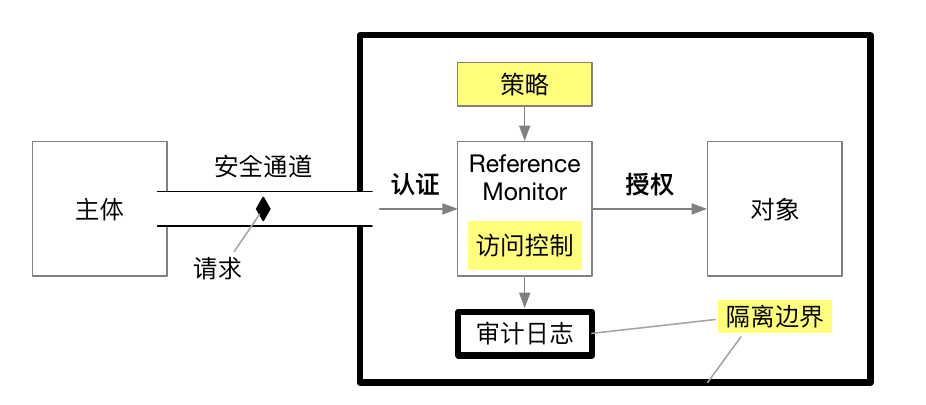

## 一、安全目标

### 1.1 总论

系统安全有 3 个目标：

- **机密性（Confidentiality）**：又称隐私性（Privacy），是指数据不能被未授权的主体窃取（即恶意读操作）。
- **完整性（Integrity）**：是指数据不能被未授权的主体篡改（即恶意写操作）。
- **可用性（Availability）**：是指数据能够被授权主体正常访问。

合称 CIA 。

### 1.2 机密性 (Confidentiality)

#### 1.2.1 含义

完整性是指保护数据不被未授权的主体篡改，确保数据的准确性、一致性和信任度。

#### 1.2.2 实现手段
- **加密**：对数据进行加密，只有持有正确解密密钥的主体才能读取数据。
- **访问控制**：通过访问控制列表（ACL）和权限设置来限制数据的访问。
- **身份验证**：确保数据只能由经过身份验证的用户或系统访问。

#### 1.2.3 示例
- **加密通信**：使用 HTTPS 协议对网络通信进行加密，防止第三方窃取传输中的数据。
- **数据加密存储**：在文件系统或数据库中对敏感信息进行加密存储。
- **访问控制**：设定文件或数据库记录的访问权限，只允许具备相应权限的用户访问。

### 1.3 完整性 (Integrity)
#### 1.3.1 含义
完整性是指保护数据不被未授权的主体篡改，确保数据的准确性、一致性和信任度。

#### 1.3.2 实现手段
- **校验和和哈希**：使用校验和或哈希函数来生成数据的唯一摘要，接收方可以通过比较摘要来验证数据是否被篡改。
- **数字签名**：使用数字签名对数据进行签名，以确保数据在传输中的完整性和来源的可靠性。
- **版本控制**：使用版本控制系统记录数据的变更历史，防止未经授权的修改。

#### 1.3.3 示例
- **哈希校验**：下载文件后检查文件的哈希值，确认其未被篡改。
- **数字签名**：邮件或文档使用数字签名，收件人可以验证其来源和内容的完整性。
- **文件权限**：设置敏感文件为只读，防止未经授权的用户进行修改。

### 1.4 可用性 (Availability)
#### 1.4.1 含义
可用性是指确保数据和系统在需要时能够被授权的主体正常访问和使用。

#### 1.4.2 实现手段
- **冗余和备份**：通过数据冗余和定期备份来确保数据在特殊情况下（如硬件故障）仍然可用。
- **容错和高可用架构**：设计容错和高可用系统架构，使用负载均衡、多路径等技术，确保系统在故障情况下仍然能够提供服务。
- **DoS/DDoS 保护**：通过防火墙、入侵检测系统（IDS）和流量管理等手段防止拒绝服务（DoS）或分布式拒绝服务（DDoS）攻击。

#### 1.4.3 示例
- **云备份**：定期将数据备份到云存储，确保在本地数据损坏时可以恢复。
- **高可用性集群**：使用高可用性集群和负载均衡器分配流量，确保一个节点出现故障时，其他节点可以继续提供服务。
- **流量管理**：部署防火墙和负载均衡器，防止由于流量异常导致的服务中断。

### 1.5 三者的区别
- **机密性 vs. 完整性**：机密性关注的是防止数据被窃取，而完整性关注的是数据未经授权被篡改。机密性主要解决“谁能看到”的问题，而完整性解决的是“它是否被改变”的问题。
- **完整性 vs. 可用性**：完整性确保数据的准确和一致性，而可用性确保数据和系统在需要时是可访问的。完整性保证数据未受未经授权的修改，可用性保证在正确时间提供正确的服务。
- **机密性 vs. 可用性**：在某些情况下，机密性和可用性可能需要权衡。例如，高度加密的数据可能需要更多的计算资源解密，从而影响系统的可用性。机密性和可用性关注的是不同的方面，前者注重安全访问，后者注重无障碍访问。

----

## 二、访问控制

### 2.1 总论

访问控制（Access Control）是按照访问主体的身份（Identity）来限制其访问对象的一种方法。它由两个基本过程组成，即：

- 认证（Authentication）：验证某个发起访问请求的主体的身份。
- 授权（Authorization）：授予某个身份一定的权限以访问特定的对象。

访问控制是这样的一件事，资源的请求方被称为主体，认证干的事情是确定你真的是这个主题，而不是一个人化妆了伪造出来的人，换句话说，认证干的是“主体 => 身份”的工作；授权则干得是“身份 => 权限”的工作，需要强调，授权并不只局限于“赋予”某个身份一定的权限，他还包括这个权限的正确执行，违法权限的行为的发现。

打给比方，认证就是“火眼金睛”，而“授权”则是天条和天兵。

### 2.2 认证

认证过程旨在建立发起请求的主体与系统中某个 ID 之间的绑定关系。例如，用户登录操作系统时，首先要选择用户名（即 ID），然后输入密码或口令完成登录过程。

认证过程中,判断某一个主体身份的方法主要有三种：

- 你知道什么（Something you know）：例如密码/口令（password）、手势密码、某个问题的答案等。
- 你有什么（Something you have）：例如 USB-key、密码器等实物；电子令牌（token）
- 你是什么（Something you are）：例如指纹、虹膜、步态、键盘输入习惯等，属于人的一部分。

总的来说，由上到下主体和身份（ID）的相关性在增强，进而安全性就在增强。主体知道的东西很容易被窃取，比如一个用生日做的密码，即使不是主体，也很容猜到。而主体的指纹，就没那么容易搞到了。

Token 和 Password 都用于身份验证但用途和特性不同。Password 是用户在登录时输入的静态字符组合，用于初次验证身份。而 Token 则是在用户通过密码验证后，由服务器生成并发给客户端的动态凭证，用于在后续请求中证明身份。与 Password 不同，Token 通常有时效性，可以减少频繁传递 Password 的安全风险，并且适合分布式系统中的认证场景。

### 2.3 授权

授权，是判断某个主体是否有权限访问某个对象的过程。授权机制主要考虑以下三个问题：

1. **用何种数据结构来表达主体与对象之间的权限关系**：
   
   确定如何存储和表示主体与对象之间的权限关系，如使用访问控制列表（ACL）、角色权限矩阵或权限表等。
   
2. **如何设置和修改这种权限关系**：
   
   确定权限的分配和调整机制，例如通过管理员手动配置、角色分配系统或自动化策略等。
   
3. **如何强制保证这种权限关系**：
   
   确保系统能够正确执行权限检查和访问控制，防止未经授权的访问。可以通过身份验证、访问控制检查和安全审计等手段来实现。
