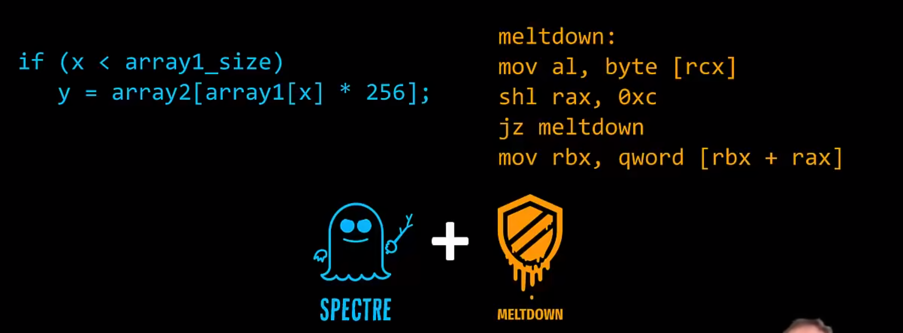
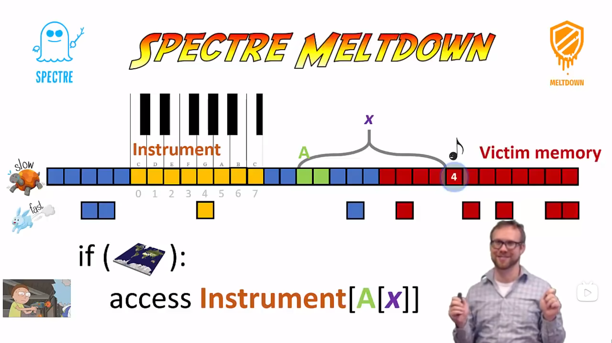

## 一、总论

旁路攻击（Side Channel Attack）指的是利用计算机通信过程中产生的“副作用”发起的攻击。也就是说，攻击者没有选择像监听信道或者破解密码等“正面手段”，而是利用通信时的时延、电压变化、能耗变化、JTag、异常等“边缘特征”等来发起攻击，是一种“侧面突破”。

我个人感觉旁路攻击利用的边缘特征，往往都是在根本上无法避免的特征，我们并不能为了避免时延旁路攻击，就放弃使用 Cache，或者为了 JTag 旁路攻击，就放弃使用硬件调试，甚至为了避免能耗攻击，就不用电了？这也就意味着，不像加密一样，只要提出了一个破密复杂度极高的加密算法，就可以一劳永逸。旁路攻击的防范是不能停歇的，任何一个计算机系统运行产生的效果，都会导致一次可能的攻击。

为了解释一下定义，旁路实际上是因为边缘特征产生的信息通道，就叫旁路。

---


## 二、时延旁路攻击

缓冲时延（Cache Timing）旁路是通过内存访问时间的不同来产生的旁路。这个原理也非常好理解，在现代体系结构中，Cache 可以加速 CPU 对于内存的访问，只要 CPU 访问过一个地址的数据，Cache 就可以加载这次的数据，当下次 CPU 再访问这个地址的数据时，Cache 就可以快速地把这个数据递交给 CPU。

所以我们其实是可以知道 CPU 前一段时间访问了**哪个地址**，这是因为如果我们再次访问的话，会发现访问的时延很短，这是因为之前访问过了，数据在 Cache 中。这种“知晓”是不受到普通的隔离机制防范的，用户可以借此查看内核之前访问过的地址，或者是查看另一个用户访问的地址（当然还需要一些辅助构造手段）。因为隔离机制往往只隔离了内存和 CPU，而对于 Cache，则没有隔离效果。

朴素地想，知道地址并不是一件很危险的事情，比如说我知道了我想要窃取的数据 `secret` 的地址是 `0x0030` ，那我也无计可施，我又没有 `0x0030` 对应的页表（内核页表或者另一个用户程序的页表），Cache 中就算预存了 `secret` ，我也拿不出来。

不过换一个角度去想，如果攻击方可以诱导被攻击方用 `secret` **作为地址**去访问数据就好了，这样攻击方就可以直接知道 `secret` 内容了。那么应该怎么诱导呢？凭什么被攻击方就听攻击者的了？根据实现的不同，又分为了 Meltdown 和 Spectre 两种实现。Meltdown 从用户程序攻击内核，Spectre 则更加通用，也可以从用户程序攻击另一个另一个用户程序。总结如下：



其中 Meltdown 利用的是，在异常发生时，CPU 会立刻切换到内核态，但是因为乱序执行的缘故，攻击者在异常发生后的紧邻的几条指令会在内核态得到执行，只是它们不会被提交，它们会在后续被 CPU 作废处理，但是已经在 Cache 中留下痕迹了，这就足够发动攻击了。

具体代码如下：

```assembly
; [rcx] is kernel secret
; rbx is probe base
meltdown:
mol al, byte [rcx] ; rax = secret, raise excption
shl rax, 0xc ; rax *= 4096, sparse the cache line
jz meltdown ; meltdown for unzero secret
mov rbx, qword [rbx + rax] ; read probe[secret], cache remeber! 
```

其中第 2，3 条指令都是具体优化，核心是第 1，4 条指令，可以看到我们先访问了一个内核的机密数据，这个机密数据的地址是 `rcx`，当然内核肯定不让我们访问，会触发异常，但是没有关系，在触发异常后虽然我们得不到具体的 `secret` 也就是 `[rcx]`，但是因为乱序执行的缘故，第 4 条指令有可能会被执行，也就是说，攻击者程序中的 `probe[secret]` 这一个元素会被访问，下次我们再访问这个 `probe[secret]` 的时候，我们的访问速度就会变快，我们只需要遍历 `probe` 所有元素测试访问速度，找到最快的元素，它的编号就是 `secret` 。

其中第 2 条指令用于放大 `secret` “信号”，避免 cache 加速了多个 `probe` 元素的访问，使 Cache 只能加速一个元素的访问。第 3 条指令用于判断第 4 条指令是否执行，因为如果 CPU 反应快，会立刻将 `rax` 注销清 0，那么就需要再次尝试，所以这里有个循环。

按 Meltdown 论文的说法，他们在 Intel 的 CPU 上可以用五百多 K 每秒的速度 Dump 内核映像！

Sepecture 基于类似的原理



利用数组越界访问来诱导 CPU 执行指令。这幅图中的 `Instrument` 就是 Meltdown 中的 `prob` 。`A[x]` 对应 `secret`。
