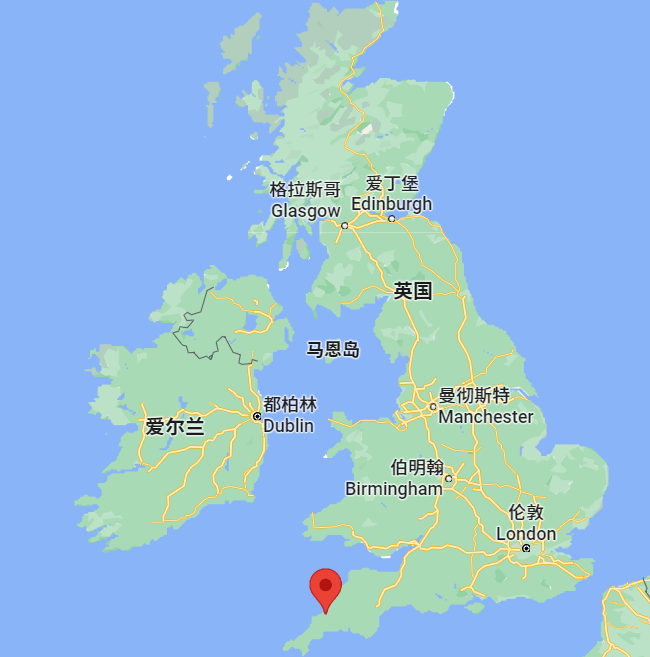
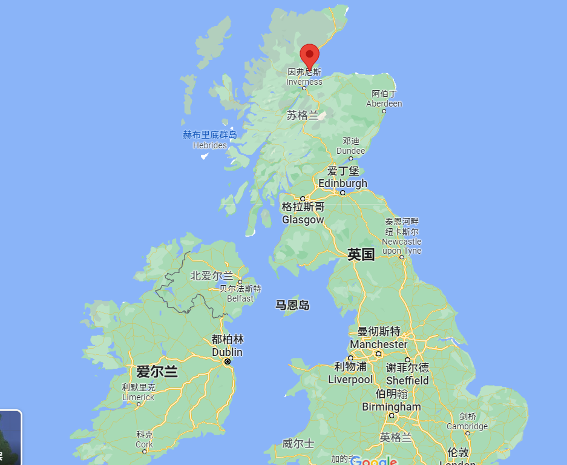
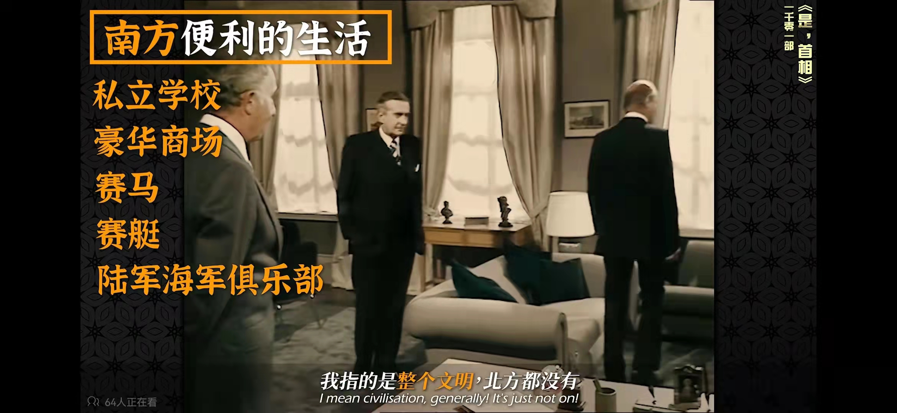
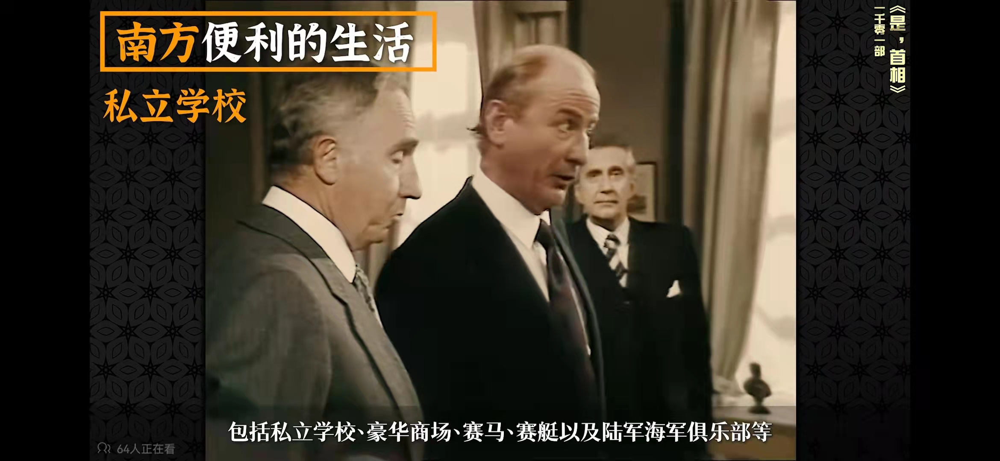
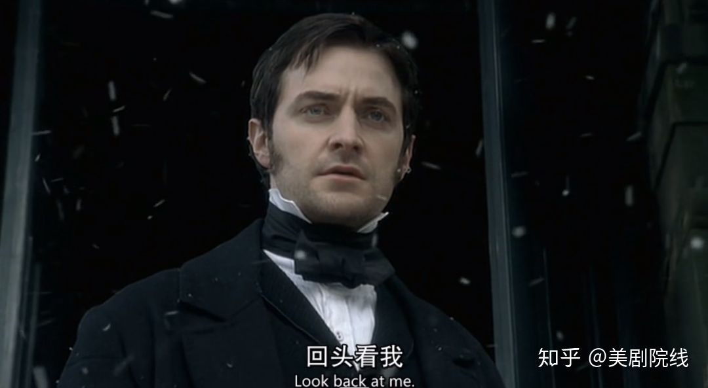

# North & South

## 1. 刻板印象

我看的是 2004 年的英剧，这个迷你剧是伊丽莎白·盖斯凯尔的原著小说改编的。豆瓣上评价她是一直被低估，但从未被超越的英国古典文学作家。（当然，基本的装逼说法）。

故事是发生在工业革命初期（剧里面有），然后女主来自赫尔斯通，是南方人，大致可以理解为他来自一个很田园，和农业化的地方

男主来自北方，米尔顿（也有人就是曼彻斯特的化名），是一个新兴的工业城市，故事大部分都在这个地方展开，就各种纺织工厂，男主就是一个厂长（也是剧迷对男主的爱称）。

当然这种介绍不痛不痒，让我们来一点刺激的（好尴尬，差点找不到了）：

>我指的是整个文明，北方都没有
>
>包括私立学校、豪华商场、赛马、赛艇以及陆军海军俱乐部。

感觉似乎北方重工业落寞的感觉，就是很荒废啊，毕竟官僚是最会享受的。

---

## 2. 文化分析

这部剧发生的年代是在工业革命初期，剧中出现了万国工业博览会（1851）的情节，所以时间就是在这个节点附近。在影片中最具有戏剧张力的点就是男女主的之间的地域文化差异。尽管故事大部分都是在讲工厂中资本家和工人的斗争的故事，但是作品只是采用了一种阶级调和的观点，并没有讨论并且升华这种矛盾，这应该是具有作者的生活年代的局限性。

失去了尖锐的批判，并不意味着这个作品就不再有闪光点。相反，这部作品被誉为《傲慢与偏见》的姊妹篇。在这部作品中，我们可以看到女主因为来自美丽富饶的南方，对粗鲁荒凉，没有人情味的北方的傲慢。而可以看到男主因为一步一步地从底层打拼到社会的顶端，对不谙世事，附庸风雅的南方的偏见。

为了完成我的作业，我特地找了一篇帖子来对比一下英国南北方的差异 https://www.sohu.com/a/215861198_563929

|          | 南方           | 北方           |
| -------- | -------------- | -------------- |
| 代表城市 | 伦敦、南安普顿 | 约克、曼彻斯特 |
| 经济     | 发达           | 发达过         |
| 民风     | 快节奏         | 热情淳朴       |

---

## 3. 最后总结

地域差异一定是一个一个普遍的话题，这个问题不仅会发生在工业革命时期，也会发生在我们这个已经由互联网连缀起来的世界。这个问题不仅会发生在英国，也同样会发生在我们生活的中国。如果米尔顿真的是曼彻斯特的话，其实男女主的故乡只是成都到重庆的距离（没有细致求证过）。但是即使这样的距离，依然足以让两个互相吸引的灵魂彼此错过。

地域问题只是一种表象，人们真正的悲哀被王家卫总结的很好。他在《重庆森林》说

>我跟她之间的距离只有 0.01 公分，57 个小时之后，我爱上了这个女人。

哪怕是0.01公分的距离，爱上一个人还需要57个小时。所谓的“人心隔肚皮，知人知面不知心”。真的很悲凉。

不过最让人感动的是，尽管人有种种傲慢与偏见，但是自从人类诞生之初，总会有勇者尝试跨越这看似无解的鸿沟，勇敢的向着岸的那一边的人招手，这才是真正的伟大，正如剧中玛格丽特离去时，桑顿先生的呢喃：

---

## 4. 作业

> The film our group watched was South and North, a love story that takes place at the beginning of the industrial revolution. The heroine from the South moves to the North for some reasons, and therefore befriends the hero, who is from the North.
>
> The cultural issue I want to discuss in this review is the economy of the North during the Industrial Revolution in England. During the first industrial revolution, the North seized the opportunity of textile machines and stepped into industrialization in one fell swoop. So we can see that the background of the film has been gray and dreary, and murmurs appear in the background at times. This is because in the North at that time, there was a large demand for coal burning in factories, so it made the North enter the foggy capital era earlier than London in the South. When the hero and heroine first met, it was obviously indoors, but beautiful snowflakes floated, this is because the heroine has never seen such a spectacular textile factory, the flying cotton lint as snowflakes. In addition to a general background like the cotton textile industry, there are two other important backgrounds that need attention. One of them is the conflict of labor relations portrayed in the play, in which the workers hold several strikes because of the poor working conditions and low wages. This actually reflects a demand for capitalist dumping and expansion, where a large number of products are manufactured and the domestic market has long been in greater supply than demand. When there is no way to dump, not only the workers will feel the exploitation, even the capitalists will also feel the difficulties, the film in the latter part of the hero bankruptcy, factory closure, can also be said to be the fulfillment of this law of economics. Another important background is the U.S. cotton into the British market in large quantities, the British cotton processing more efficient, so the U.S. South of the farm owners chose to offer higher prices in the United Kingdom, rather than the U.S. mainland. This is also reflected in the dinner party of the hero.
>
> It is because of this environment in the North that there has always been a stern, cold and tough quality among the hero's characters. These qualities make it difficult for the heroine from the South to get close to the hero, which can be seen as a symptom of cultural differences. This phenomenon is not only limited to this play, but also happens in our lives. As Mr. Thornton murmurs in the play when Margaret leaves: look back at me. I believe that in reality, there will also be countless lovers, defiantly swimming through the flood of differences and embracing the arms of their lovers.
>

> Zheng Xin not only analyzed the Scottish issue and related it to the Chinese reality, which I think is a very creative analysis. However, I do not think that China's national identity was shaped entirely by the anti-Japanese war, probably because Zheng Xin adopted the concept of a modern nation. I agree more that "China is a civilization disguised as a nation", which means that the emergence of Chinese identity should be much earlier.

---

# 西蒙的选择

如果我真的有了那种情况的话，我不会去做安乐死。生命本来就是一个慢慢繁荣，又慢慢衰败的过程。刻意回避衰败的部分，就好像在鲜花快要枯萎的时候就把他掐断。我认为不同的生命阶段具有不同生命体验。我所理解的强大，就是从容地吃完命运摆在我面前的每一道餐品。

> I wouldn't have gone through euthanasia if I did have that situation. Life is supposed to be a process of slow prosperity and slow decay. To deliberately avoid the decaying part is like cutting off a flower when it is about to wilt. I think different stages of life have different life experiences. What I understand by being strong is to eat every meal that fate puts in front of me with ease.

我会坚持安乐死的想法。我无法想象这世上还有我爱的人的时候，我会产生安乐死的想法。不过我既然已经产生了，说明真的有很好的理由支持我做这个决定。说不定那一边还会有更多我爱着、思念着的人在等着我。

> would hold on to the idea of euthanasia. I can't imagine that the idea of euthanasia would have occurred to me when there were people I loved in this world. But the fact that I have already had it means that there are really good reasons to support me in this decision. Maybe there will be more people I love and miss waiting for me on that side.

我不认为安乐死应该合法化，因为这真的很危险。这不是一个个人的问题，而是一整个社会的问题。不是每个人都可以坚强的面对死亡的，社会不应该为他们提供逃避的手段，而是应该提供有效的帮助。

> I don't think euthanasia should be legalized because it's really dangerous. It is not a problem of an individual, but a problem of a whole society. Not everyone can be strong enough to face death, and society should not provide them with a means of escape, but rather with effective help.

---

# 我们需要谈谈凯文

这周我们看的电影是《我们需要谈谈凯文》，这个电影讲述的是一个具有反社会人格的16岁少年屠杀同学的故事。虽然被定义为惊悚片，但是与普通的惊悚片不同，影片没有聚焦于屠杀的血腥，而是花费了大量的笔墨去刻画凯文的成长环境。可以看出，导演是希望通过这样的一部影片来与观众讨论家庭教育问题的，这就是“我们需要谈谈凯文”的谈话内容。

> The movie we watched this week was "We Need to Talk About Kevin," a film about a 16-year-old with a sociopathic personality who slaughters his classmates. Although it is defined as a thriller, but unlike ordinary thrillers, the film does not focus on the massacre, but spends a lot of time to portray Kevin's environment growing up. It is clear that the director wants to discuss education with the audience through such a film, which is the "we need to talk about Kevin" conversation.

故事中的凯文的母亲爱娃在影片中被刻画成一个热爱自由，讨厌家庭束缚的女性形象。因此在教育凯文的过程中，爱娃经常表现出不耐烦的情绪。爱娃虽然尽力履行一个作为母亲的职责，但是总可以在细节处流露出那种对儿子的嫌弃。而凯文的父亲总是一味的溺爱凯文，并不关心凯文的情绪，甚至也不愿意理解妻子。这其中种种原因导致了凯文的爆发。

> Kevin's mother, Ava, is portrayed in the film as a woman who loves freedom and hates the bondage of her family. Therefore, in the process of educating Kevin, Ava often shows impatience. Although Ava tries her best to fulfill her duties as a mother, she can always reveal her dislike for her son in details. Kevin's father, on the other hand, always coddled Kevin, did not care about Kevin's emotions, and was not even willing to understand his wife. All these reasons led to Kevin's outburst.

我之前对英国的家庭观念和教育观念并不了解，为此，我特意查阅了一些资料。我本以为英国的家庭教育是那种放养式的教育，父母给予子女充分的自由权来帮助他们发展。但是我了解到，英国的中产阶级对于子女的教育十分严苛，教育被规划成一个完美无缺的方案，子女的未来充满了计划性。这样的教育观念，不仅是对子女的一种严苛，同样将压力置于家长之上。家长同样被要求称为一种理想的家长，必须尽职尽责，必须细致耐心。在故事中我们可以从凯文的房子和其他生活环境中不难推断出，凯文的家庭正处于我们上面提到的这样的社会观念下。

>​	I didn't know much about the British concept of family and education before, and for that reason, I consulted some information. I had thought that British family education was the kind of laissez-faire education where parents give their children full freedom to help them develop. However, I learned that the British middle class is very strict about the education of their children, and education is planned into a perfect program, and the future of their children is full of planning. Such a concept of education is not only a harsh one for the children, but also puts pressure on the parents. Parents are likewise required to be called a kind of ideal parent, who must do his or her duty and must be meticulous and patient. In the story we can easily infer from Kevin's house and other living environment that Kevin's family is under such a social concept that we mentioned above.

但是不幸的是，不是所有的家庭都可以保持这样的一种教育观念。我们从剧中可以知道，这种繁缛的教育，跟凯文父母的爱好自由的天性是矛盾的。因此当这种观念与现实出现矛盾的时候，要么是像凯文的母亲一样，努力扮演但是不尽如人意，要么是像凯文的父亲一样选择逃避，一味放纵溺爱儿子。我个人对于教育的看法，是教育不应该有一个固定的最优解，不同性格的父母可以培养出不同性格的孩子。如果为了强行去迎合某个主流的标准，难免就会有拔苗助长的嫌疑。严重的时候，可能就会在现实中重现凯文的悲剧。

> ​	But unfortunately, not all families can maintain such a kind of educational concept. We know from the play that this kind of red tape education is contradictory to the freedom-loving nature of Kevin's parents. So when this concept contradicts reality, either they try to play hard but not as hard as they should, like Kevin's mother, or they choose to avoid it, like Kevin's father, and just indulge and spoil their son. My personal view on education is that there should not be a fixed optimal solution to education, and that parents with different personalities can raise children with different personalities. If you try to force yourself to meet some mainstream standard, you will inevitably be suspected of pulling the plug. In serious cases, the tragedy of Kevin may be repeated in reality.

我觉得钱爱杰同学的影评非常的好，不仅有影片内容的陈述，还有自己观点的表达。要是能介绍一些英国的文化背景就更好了。

---

# 锅匠，裁缝，士兵，间谍

> Love is whatever you can still betray. Betrayal can only happen if you love.

《锅匠，裁缝，士兵，间谍》是一部悬疑剧。我们小组主要讨论了剧中的男主角和内奸的形象。剧中的男主 Smiley 是一个低调并且坚韧的人。面对发现奸细这种错综复杂的任务，即使受到了各种人身安全的威胁和妻子背叛带来的羞辱，Smiley 也没有失去冷静，仔细地分析线索，最终发现了间谍。

> TTSS is a spy drama. I want to focus on the portrayal of the hero and the mole. The main character, Smiley, is a low-key and tough man. Faced with the intricate task of discovering the spy, Smiley does not lose his calmness, analyzes the clues carefully, and finally discovers the spy, even after being threatened to his personal safety and humiliated by his wife's betrayal.

剧中的内奸 Bill 并没有像传统的谍战剧反派一样十分虚伪和狡诈。相反，导演塑造了一个有血有肉的内奸形象。Bill 曾经是大英帝国最杰出的间谍，年轻的他充满了帝国的荣誉感。但是随着大英帝国的衰败，Bill 见识了资本主义制度的丑陋，最终选择了背叛自己的祖国，出卖情报给苏联。

> The mole, Bill, is not as hypocritical and cunning as the traditional spy villain. Bill was once the most prominent spy in the British Empire, and as a young man he was filled with a sense of imperial honor. But with the decline of the British Empire, Bill saw the ugliness of the capitalist system, and eventually chose to betray his country, selling information to the Soviet Union.

我觉得谍战剧与其他类型剧的最大差别就是里面会有更多对于信仰的讨论。这是因为谍战剧中充满了怀疑与背叛，特工必须是具有坚定信仰的人，否则很容易称为自私自利的双面间谍，或者沦为斗争的失败品。TTSS 中特工需要面对的信仰选择是意识形态的选择。大英帝国殖民地的缩减，物质生活的下降，腐朽冗余的官僚制度，这些丑恶无时不刻地在挑战英国特工的信仰，最终导致了有些特工的叛逃。从这部剧我们可以看出，信仰需要现实的支持，否则就像纸糊的神像一样脆弱不堪。

> I think the biggest difference between spy dramas and other types of dramas is that there is more discussion of faith in them. This is because spy dramas are full of suspicion and betrayal, and agents must be people of strong faith, otherwise they can easily become self-serving double agents or fall victim to the struggle. the choice of faith that agents in TTSS have to face is an ideological one. The shrinking colonies of the British Empire, the decline in material life, the decaying and redundant bureaucracy, these ugly evils challenge the faith of British agents all the time and eventually lead to the defection of some agents. From this play we can see that faith needs the support of reality, otherwise it is as fragile as a papier-mache idol.

在最后我想以原著的一句话收尾

> At the end I would like to close with a quote from the original. Love is whatever you can still betray. Betrayal can only happen if you love.

我觉得颜同学的影评非常的好，不仅有影片内容的陈述，还有自己观点的表达。我注意到颜同学在最后讨论了剧中的情况在中国的对应情况。我觉得是一个很好的创意，可以很好的比较英国文化与中国文化在家庭教育方面的差异。

>I thought Yan's review was very good, not only in her presentation of the content of the film, but also in its expression of her own opinion. I noticed that Yan discussed the Chinese counterpart of the situation in the play at the end. I think it is a good idea to compare the differences between British culture and Chinese culture in terms of home education.

# 诺丁山

在观看《诺丁山》这部电影的时候，我除了醉心于浪漫感人的爱情故事，我还对于剧中出现的诺丁山的取景很赶兴趣。因为在我的印象里，英国的城市给人一种经典的雾都形象--灰蒙蒙的、陈旧、古典，就像《神探夏洛克》中的伦敦一样。

> When I watched the film Notting Hill, apart from being enthralled by the romantic and touching love story, I was also interested in the location of Notting Hill, which appears in the play. Because I had the impression that British cities gave a classic image of a foggy city - grey, old-fashioned and classical, like London in Sherlock.

但是《诺丁山》的取景跟我的固有印象很不同。它的颜色很鲜艳，甚至空气中都充斥着轻松欢快的氛围。无怪乎这里会发生经典的爱情故事了。我于是搜集了一些资料来进一步了解诺丁山这个地方的历史与文化。

> But the setting for Notting Hill is very different from my inherent impression. It was brightly coloured and even the air was filled with a light and cheerful atmosphere. No wonder the classic love story took place here. I then gathered some information to learn more about the history and culture of this part of Notting Hill.

最让我感到惊喜的是，《诺丁山》中讲的故事并不是诺丁山这个地方唯一的爱情故事。相传 18 世纪维多利亚时代，伦敦的王公贵族、花花公子，有在诺丁山一带私筑爱巢、密养情人的风俗。所以这个地方是有传统的浪漫情结的。

> What surprised me most was that the story told in Notting Hill was not the only love story in the area. It is said that during the Victorian era in the 18th century, London's princes and dancers used to build private nests and keep lovers in the Notting Hill area. So this place is traditionally romantic.

诺丁山不仅有浪漫的传统，其民风也不像伦敦大都市一样刻板陈旧。在二十世纪五六十年代，它是是加勒比海一带移民刚到英国时落脚的地方，这里是一个移民聚居区。这里的移民有拉美人、美国人、印度人、巴基斯坦人。所以这里的文化呈现出一种兼容并包的特点。不同的文化在这里共存、碰撞、交融，产生了独特的“诺丁山文化”。每年诺丁山都会举办民族风格鲜明的狂欢节。这个狂欢节每年都有百万人参加，已成为欧洲规模最大的狂欢节。

> Not only does Notting Hill have a romantic tradition, but its folklore is not as stereotypical as that of metropolitan London. In the 1950s and 1960s, it was a settlement for immigrants from the Caribbean who had just arrived in Britain. The immigrants here were Latin Americans, Americans, Indians and Pakistanis. So the culture here is characterised by an eclectic mix. Different cultures have coexisted, collided and mingled to create the unique Notting Hill culture. Every year, Notting Hill hosts an ethnic carnival. With millions of people attending each year, it has become the largest carnival in Europe.

----

# BJ 单身日记

今天我们要聊的电影是《BJ 单身日记》，这是一部英国的爱情喜剧。这部剧讲述了一个大龄的单身女性 Bridget Jones 追寻爱情的故事。这部剧是一个很好的分析“英国剩女”现象的契机，从中可以进一步探讨英国的婚恋观念等文化现象。

> The film we are talking about today is BJ's Singles Diary, a British romantic comedy. It tells the story of Bridget Jones, an older single woman in search of love. The play is a great opportunity to analyse the phenomenon of the 'leftover British woman' and to explore the cultural phenomenon of marriage in the UK.

但是我决定并不沿着这个思路去讨论，而是希望更进一步去讨论一个更加普遍的、超越国度的文化现象，就是怎么追求到爱情？也就是俗称的"脱单技巧"。我将从三个方面去讨论。

> But I decided not to go along with this line of thought, and instead wanted to go further and discuss a more general, transcendent cultural phenomenon, which is how to pursue love. This is also known as the 'breakout technique'. I will discuss this in three ways.

首先是关于外貌方面，想要脱单，美丽，苗条的身材并不是必选项，因为剧中的 BJ 就是一个丰满、笨憨憨的女孩。但是干净、得体的打扮和自信的姿态是一定要有的。剧中的 BJ 一开始要么在平时打扮的很沉闷，要么就会打扮得像一个“花地毯”一样。后来的她打扮的时候开始注重细节，并且通过健身来获得一种健康的美感。正是因为有了这些改变，才能让 BJ 的气质在外貌没有明显改变的前提下，有了极大的提升。

> Firstly, in terms of appearance, being beautiful and slim is not a must if you want to get laid, as BJ in the play is a plump, dumb  girl. But clean, well-groomed and confident posture is a must. BJ starts out either dressed in a dull way or dressed like a 'flower rug'. Later on she started dressing with attention to detail and working out to gain a healthy aesthetic. It was these changes that allowed BJ to improve her look without significantly changing her appearance.

其次是要有足够的自尊，剧中的 BJ 一开始爱上了她的上司，后来发现她的上司是一个极其花心的人，同时与多个女性保持着暧昧关系，于是 BJ 果断分手，并没有迷失自我。一个离开渣男上司之后找到电视台的工作的自尊自爱的女孩，谁不爱呢？

> The second thing is to have enough self-respect. In the play, BJ initially falls in love with her boss, but later finds out that her boss is an extremely philandering person who keeps an affair with several women at the same time, so BJ breaks up decisively and does not lose herself. Who wouldn't want to love a self-respecting girl who finds a job in television after leaving her scumbag boss?

最后，就是在一段感情中要有真情实感，就像剧中 BJ 那样，在达西不小心看到了 BJ 之前的日记而对 BJ 产生误解，BJ就在雪花飘飘的大冬天只穿内裤追回他解释。所以说“遇到误会就主动解释，遇到真爱就主动出击”是恋爱的秘籍。

> Lastly, it's important to be truthful in a relationship, just like BJ in the play, when Darcy accidentally reads BJ's previous diary and misunderstands him, BJ chases him back in her underwear in the middle of a snowy winter to explain. This is the secret of love: "When you have a misunderstanding, take the initiative to explain; when you have true love, take the initiative".

最后祝愿大家都能找到自己的真爱。

> Finally, I wish you all the best in finding your true love.
