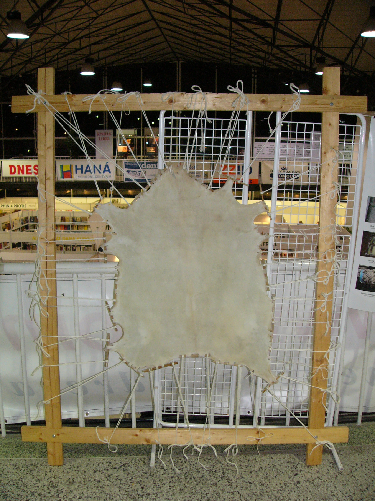

## 一、字体介绍

### 1.1 演变历史

- 最早的字体是“帝国大写体”（Imperial Capitals），也被称为“罗马大写体”，古罗马时期字体，用于在石碑上记录重大事件。
- 然后是“卡洛林小写体”（Carolingian Minuscule），这种字体在中世纪早期出现，这种字体字间距大，结构清晰简单，但是已经具有了一定的宗教色彩。
- 中世纪后期西欧出现了“哥特体”（Gothic），是卡洛林小写体的演化体，这种字体更加复杂和华丽，字间距小，笔画厚重而末端尖锐，具有强烈的宗教色彩。
- “人文主义体”是“文艺复兴之父”彼特拉克提倡发明的字体，受启发于卡洛林小写体字间距大，方便阅读的特点，是文艺复兴早期的字体，风格比较圆润轻松，字轴比较倾斜。
- “意大利斜体”受启发于“人文主义体”，这种字体更加自由畅快，同时由于斜体的特点，可以兼顾辨认和节省空间的特点，是当时印刷业的新宠。
- “印刷罗马体”是活字印刷术发明后在意大利发明的，这种字体受启发于“人文主义体”和“帝国大写体”，这种字体字轴中正，笔画圆润，书写痕迹浅，成为了“人文主义体”的淘汰者。

### 1.2 具体介绍

介绍的这三种字体是“三种主流字体”，也被称为“标准体”。

#### 1.2.1 哥特体

“哥特体”来自于曾于公元 3~5 世纪侵略意大利并瓦解罗马帝国的德国哥特族人，这种字体在继承了卡洛林小写体的基础上在中世纪成为了教会专用的字体。

因为这种字体极其规整和华丽，具有相当繁复的排版和注意事项，所以需要培养专业的抄写员来使用这种字体，书写难度极大；而因为这种字体笔划十分厚重，字间距和行间距都十分逼仄，所以阅读难度也是极大的。

#### 1.2.2 印刷罗马体

德国人古登堡发明了现代印刷术，他工厂的工人将这种技术传到了意大利，为了迎合人文主义者的偏好，他们在人文主义体的基础上创造了“前印刷罗马体”，斯皮拉兄弟从“罗马大写体”吸收了衬线，大写字体，字符断写等多种特色，创造出了“印刷罗马体”。

印刷罗马体的最为显著特点是“直立，正写”。这本是碑文字体的特征，恰巧满足了印刷的需求，同时还使得字体变得大气和规整，阅读变得轻松。此外，印刷罗马体的字形支持更全，支持大小写字母、数字和多种特殊符号标点。

#### 1.2.3 意大利斜体

“文艺复兴之父”彼特拉克借鉴了卡洛林小写体清晰易辨的特点，创造了用于自己平常书写的手写体，这种字体后来发展成了“人文主义草体”，当其传入意大利后，被固化成了一种印刷字体。

意大利斜体与“手写”密不可分，它“斜体”，“轻快”，“飘逸”的特点正是从手写字体中汲取的，同时也给人在阅读时一种“亲切感”。此外，手写体非等宽的特征也使得在同一行可以容纳更多的字符，对于印刷更为经济。

### 1.3 对比总结

#### 1.3.1 设计

需要强调这些方面是直观朴素的，因为字体设计的专业名词是十分繁复，不利于科普的：

|    字体    |      风格      |        结构        |             排版             |
| :--------: | :------------: | :----------------: | :--------------------------: |
|   哥特体   | 繁复，宗教性强 | 笔划厚重而末端尖锐 | 字间距小，行间距小，双栏排版 |
| 印刷罗马体 |   大气，厚重   |     衬线，正写     | 字间距大，行间距大，单栏排版 |
| 意大利斜体 |   飘逸，手写   |        斜体        | 字间距小，行间距大，单栏排版 |

#### 1.3.2 经济基础

正如文艺复兴中发生的其他变革一样，字体演变也与文艺复兴时期发生的科学和技术进步有关。

在中世纪，纸张使用的是羊皮纸，这种材料极为昂贵，为降低书写材料的费用，哥特体压缩字间距和行间距，在同样的篇幅下容纳更多的字而产生的字体。同时因为没有印刷术，所以只能将“抄写员”作为一个专业的职业去培养，这也是极其花销大的事情。

正是因为材料和抄写的昂贵，所以使得书本变得极为昂贵，这种昂贵又呈现了某种“待价而沽”的卖方市场特征，在羊皮纸的选择上要求更加稀有的品种，在抄写员的培养上也带有了某种宗教仪式色彩。这无疑形成了恶性循环，最终导致的结果就是字体的设计权被宗教垄断。

造纸术由阿拉伯传入欧洲，相比于原先的羊皮纸方案，成本低廉，材料广泛，降低了知识传播的成本，被生产资料垄断的教育资格有了流向普罗大众的可能。德国人古登堡发明了现代印刷术，由三个部分组成：铅活字印刷，印刷油墨，印刷机。这项技术加速了文字流通的速度，促进了文字传播的需求。

这些新兴技术首先在技术上要求字体做出变革，因为原有哥特体字间距狭窄，末端尖锐的特点与活字印刷术并不匹配，反而适用于碑文的罗马体与铅活字更为类似。而另一个方面，由于成本降低，打破了教会对于文字的垄断，字体成为了许多平民的常客，更加亲民，接地气的字体设计成为时兴的思想。

#### 1.3.3 思想

在思想层面，“哥特体”不止形式繁缛，在内涵上也有很强的宗教色彩。“将每一次落笔，都视为对于魔鬼的回击”淋漓尽致的表现了这一点。这种思想性质使得哥特体很难承载一些表达人本主义倾向的文字，用哥特体记录日常生活就像穿西装吃沙县小吃一样。不过需要强调，哥特体并没有在历史中湮没，它成为了一种表示“郑重权威”的字体，常用于设计报社的 logo 。

印刷罗马体效仿帝国大写体，其设计思想是与文艺复兴提倡的“对希腊和古罗马的黄金年代的复现”一致，甚至本就在这种复古精神的指引下开创了这种字体。另外这种字体的贡献者多为印刷厂工人，所以他们对于规格化，全面化，普适化的工业审美也注入到了这款字体里。

意大利斜体起源于手写字体，发明的初衷是为了创造一种更加适合快速书写和阅读的字体，这种需求是文艺复兴人文主义的一种反映。写字”的权利得到下放，在此诉求上诞生的“意大利斜体”要更加舒展和自由，适合快速的书写。另外，大部分手写体都有轻便简洁的诉求，但是意大利斜体之所以著名，与其被印刷商人设计成固定的字体有一定的关系。

## 二、分析

### 2.1 解放

**字体是文字的实现，文字是思想的镜像。**文艺复兴运动是一场思想解放运动。“解放”指的是摆脱限制自身的枷锁，文艺复兴是一场让人们摆脱思想上宗教上的禁欲主义枷锁，回归人本的运动。

中世纪采用繁复的字体可以看做是一种对于文字这种稀缺资源的垄断和对于思想的准入壁垒。当社会生产力发展到了不适应封建社会的生产方式时，字体这个看似十分形式化和鸡肋的小东西，也可以发挥“朗基努斯之枪”的作用，成为了从宗教下解放人性的利器。

### 2.2 繁城之下

> 我很想在历史找到一个“反派”，但是很多时候我只能够竭尽全力地去认识某一坐标下的“过去”和“未来”。

需要强调的是，哥特式并不是完全的落后的宗教字体，即哥特式并非一种固定的形态，而是表现出一种状态，一种过程，是历经中世纪漫长思想禁锢过程后人们开始对世界重拾思考的迹象，可能体现了一种“虽然真理永不可得，但仍旧要追求不息”的精神。这点在哥特体的多种变体中有所体现，有些字体已经呈现了简化趋势。

此外，新兴的“印刷罗马体”和“意大利斜体”并不是平地起高楼，他们的诞生同样吸收了哥特体或者卡洛林小写体这些中世纪字体的长处。

此外，虽然随着造纸术和活字印刷术的出现，大大降低了文字的使用成本，打破了教会对于文字的垄断，但是印刷术将字体设计推上了更加崇高的位置，一款好的字体可以低成本地占据平民生活的每个角落，相似风格的字体往往只有一个字体幸存下来。在那时字模和活字的制作都是要耗费大量的时间和成本的，任何一套字模和活字都是一份实实在在的不小的资产，人们不能因为不喜欢某种字母形式随意地抛弃它和替换到另一种。字体重新被垄断，这次不是教会，而是商人。

## 三、现代启示：中文字体

### 3.1 稀缺性

电子中文字体，无论是商用还是开源，都是极其稀少的。这是多种原因造成的：

- 中文字体不像英文字体一样只有不到 100 个字符，中文有七万左右的字符，涉及繁体、简体、生僻字、标点等类别，设计的工作量极大。
- 英文字体的设计可以和数学曲线联系起来，而中文字体因为独特的书法美感，无法用数学表达式简单概括。
- 字体设计追求多个字符之间的统一感，对于有着七万多字符，并且每个字差距极大的中文而言，这是极其困难的事情。
- 现有的中国书法理论的建立是基于手写体的，所以设计的理论积累并不高，很多时候只能借鉴日本的成熟字体设计方案和思路。

中文字体的稀缺性使得其具有很高的商业价值，常见的中文字体均为微软等巨头企业开发的商业字体，这些字体有可能对于普通用户免费，但是对于海报设计，网站开发等商业行为往往收取高额的版权费用，这无疑是一种商业垄断行为。此外商用字体禁止使用者自行修改，因为修改字形导致的商业纠纷屡见不鲜。

### 3.2 重要性

无论时代如何发展，思想的表达总要落实到文字上，而文字总是要借助字体来呈现。字体依然是思想的“最后一道关隘”，“字体资源”依然是重要资源。

对于中文字体而言，不同于英文字体，多个字符编码一个单词的设计，中文的每个字都表达了一定的含义，禁掉任何一个字不仅会导致意思的表达出现障碍，甚至会导致文字本身承载的意思在文化中丢失。

同时对于任何一种字体，不断地更新迭代是其发展维持活力的最重要因素。电子字体同样也当具有演变的能力，文字的演变本身反映着思想的演变，而演变的权利应当归属于每一个文字的使用者。

### 3.3 中文开源字体

针对上文对于中文字体的现状分析，我们认为中文开源字体或许是改善现状的一个方案：

- 开源避免了复杂的版权纠纷，使得用户使用字体变得更加轻松。
- 开源字体依赖社区协作，使得用户的意见变得更加重要。每个用户都可以方便地修改字体。
- 开源字体避免了商业寡头的垄断行为。
- 开源的本质同样是解放生产力。

