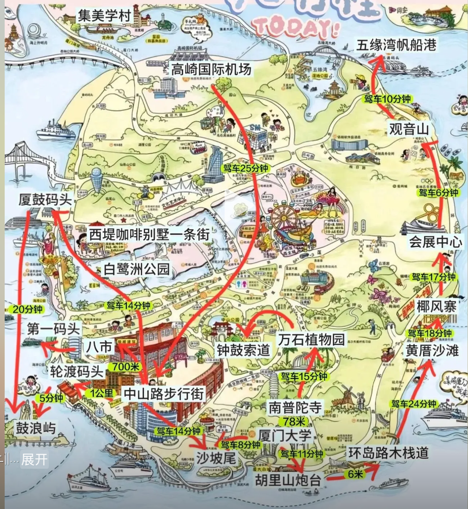
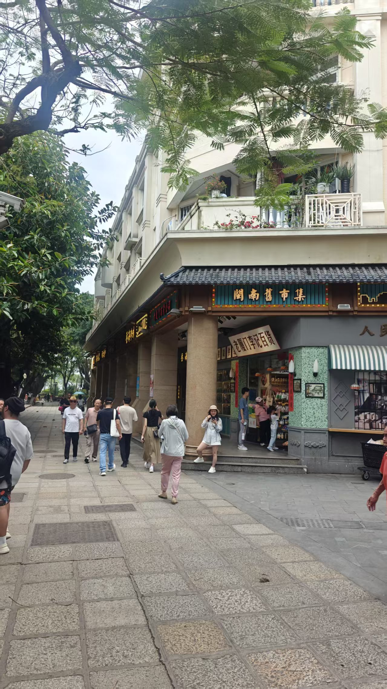

> 这么多人我不知道还算不算流浪，
>
> 可是从沙茶汤上刮起的风只掠过了我。
>
> 我急匆匆走过地图上标记的每一个浪漫角落，
>
> 自己却永远走不出地图。
>
> 我还记得凤凰花别在你耳朵上的样子。
>
> 所以现在你的波希米亚长裙去了哪里？

## 一、感受

这次出游是实验室组织的团体活动，我有幸担任了旅游的组长。但是因为组长的缘故，在景点和美食的选择上并不能随心所欲，而是更要考虑大家的需求。不过这也并不是什么坏事情，如果由着我的性子，我一定会在宾馆躺三天。

厦门文旅给人的最直观印象就是“浪漫”。宣传里的十里长堤、海上列车、曾厝垵和鼓浪屿，是这座城市的浪漫名片。不过我倒没有明显感觉出很浪漫的地方，这里的浪漫似乎因为旅游开发的缘故，显得有些模式化。更感慨的是，沙坡尾，明明在小红书中被形容成“漫画感”，在我看来，十分萧条落寞：那些本应鲜艳的油漆，在离开了镜头后，显得斑驳和衰老。

但是那又如何呢？我相信它是浪漫的，不是因为那些景点，而是因为它在我的脑海里本来就是浪漫的。我相信那里每个姑娘都穿着各式各样的波西米亚长裙，海风会将裙摆轻轻吹起。凤凰花会像火红的瀑布一样，溢满整个巷子。

如果抛去浪漫这个元素，厦门是非常惊喜的，无论是历史文化还是自然景色，都非常好；当然吃得也非常好，除了姜母鸭！

---

## 二、地理

厦门是福建省的一个城市，它直面大海，岛屿众多。

而且向东远眺，就可以看到台湾省的金门岛。

厦门市是有思明岛和周围的半岛组成的，主要的景点都集中于思明岛：

更具体而言，思明岛上有 3 个景点群，集美学村有 1 个景点群：

鼓浪屿单独有一个景点地图（景点实在是太密集了）：

厦门市内的共享单车和电动车并不是很多，地铁好像也不是太发达（当然可能也跟我没有深入探索有关系），我们多采用出租的形式，不过一个景点群里的景点，也可以采用步行的方式。

最后放一张厦门地图：

---

## 三、景点

### 3.1 沙坡尾

我们就住在了沙坡尾边儿上，所以到了以后的第一天我们就打算去沙坡尾看看。我非常期待这个地方，因为它在攻略里是长成这个样子的：

只可惜我们当天去的时候，攻略中的焦糖玛奇朵滤镜直接换成 BBC 阴间滤镜了：

路上淅淅沥沥几家商户，卖的还都是景区套餐，我觉得就算是在模式化商业街里面，它也是排在南锣鼓巷后面的主儿。

我们去沙坡尾的时候会路过小区，这里的小区有一种“城中村”的感觉，与周星驰《功夫》里的猪笼城寨有点类似，但是要更加具有生活气息。

不过我真的理解不了他们为什么不整整齐齐的建楼房，平原人的强迫症神烦。

### 3.2 鼓浪屿

鼓浪屿是思明岛旁的一个小岛，在鸦片战争后，各国相继在岛上设置领事馆，所以这是一个充满异域风情的小岛，也是厦门文旅最耀眼的名片。

从思明岛去鼓浪屿要坐船，船票有 35 的也有 80 的，似乎没有什么区别，早到一些可以上二楼，有座位，而且景色也更好：

在船上可以看到鼓浪屿上立着的郑成功雕像，据说面向的方向就是台湾的方向：

一进鼓浪屿就是网红打卡点 —— 最美转角，我其实很不理解这种打卡点存在的意义，没有逻辑啊：

然后按照推荐路线我们应该向这个转角的左侧走去，而我们毅然决然地选择了右侧，主要原因是我觉得右侧有更多漂亮的穿裙子姑娘。我们的下一站是月光岩，这是鼓浪屿上的第二高峰，我们之所以去这里，也很简单，因为第一高峰日光岩要 50 块钱的门票，而我们并没有这个钱。在去月光岩的路上需要走这种山路阶梯：

其实避开“规定路线”后，鼓浪屿的景色很美，热带植物层出不穷，民宿建筑和西式建筑有一个很好的融合，而且甚至这里还有一种烟火气和旅游气的融合（明明这两者是冲突的）：

月光岩上的风景也很好，可以看到思明岛，只可惜月光岩在正中间，不如日光岩，可以看到金门岛。但是它不要钱，所以它就是最好的（除了笔架山很难找到入口外）：

下山的路上开满了凤凰花，就像燃烧的瀑布一样：

有些凤凰花落到了地上，就像瀑布溅出来的水洼：

在下山路的尽头是第二转角，我没有感觉出它和第一转角的区别，也没有感觉出它和任意一个楼角的区别：

如果往人流更多的地方去走，就会遇到一些经典商业街，感觉要比普通的商业街要更加“商业”一些：

另一些商业街：

这里的榕树都好大啊：

沙滩也看过了，但是天气不怎么好，此外似乎沙子也没有那么细软（但是踩上去也很舒服了）：

在沙滩上发现了一个水母，人生或许就跟这个一样易逝，或者说被海浪卷上岸后，离彻底蒸发干净还需要过去很久：

我们还尝试了一下踩着礁石往海里面走去，哈哈哈哈我们太怂了：

另外就是鼓浪屿上的小姐姐好多都穿着裙子啊。

### 3.3 八市 & 中山路

我们是离开鼓浪屿以后去的八市和中山路（两个地方离得挺近，可以步行）。因为我打错车的缘故，所以八市我没有进去，直接到了中山路。不过据去的同学说，八市确实只是一个菜市场，并不是一个商业街，所以可能买生食材的比较多，而饭店比较少。最后我们是在八市的街尾汇合的，可以看到这里还是没有商业街的那种浮华的：

而中山路就是正经商业街的，街道两旁的油漆都很新：

这两侧的楼都被叫作骑楼，也就是第一层是街面，而第二层及以上都是完全盖住第一层街面的设计，这样的目的主要是为了避雨。也不知道是幸运还是不幸运，我们去中山路的时候大雨倾盆，我就在骑楼下来回穿梭，结结实实体验了一下这个建筑的妙用。

这里的商铺的招牌都还挺有改开时的年代感，可以看出厦门作为桥头堡的历史痕迹：

### 3.4 索道

我在找攻略的时候就看上这个索道了，能够在索道上俯瞰厦门，感觉非常酷。因为我和我的朋友实在是太沉了，没法共用一个车厢，所以因祸得福获得了独立车厢：

但是我是真没想到，它居然这么高，孩子恐高啊，而且我们去的那天，又是刮风，又是下雨的，那个车厢就晃晃悠，晃晃悠；雨点嘀嘀嗒，嘀嘀嗒，吓都把我吓死了：

不过上面的景色还是很好的，可以看到很多热带特色植物：

还可以看到一些在平原城市中难以看到的景色：

还可以远眺双子塔（上塔居然要 250 多块钱，好贵啊）：

### 3.5 集美学村

集美学村在思明岛外，要到集美学村可以做网红的“海上列车” —— 地铁一号线。而实际效果，就是普通的轻轨，并没有乘风破浪的感觉，因为从窗户向外望去，大部分的都是其他轨道，能看到的海面，也并不是很壮阔：

下了地铁就是龙舟池，临近端午，有人在练习龙舟：

再往前走就是集美中学，是爱国华侨陈嘉庚先生建立的学校，建筑非常有特点：

不过一想到上这个学校的人居然还要高考，我就想笑：

在集美中学后就是陈嘉庚先生为爱国华侨修建的归来堂：

离开了归来堂就是陈嘉庚先生故居：

故居里有一个沙发，据说是为了方便陈嘉庚先生办公，加装了桌板：

最后我们还去参观了大社，不知道为什么，总感觉有种民俗朋克的感觉：

### 3.6 十里长堤

我之前一直以为十里长堤是一个“自古以来”存在的景点，没有想到居然是 2011 年左右才炒起来的景点，所以直接看上去，居然有点像石家庄音乐节：

十里长堤本身似乎也平平无奇：

海上列车如果从岸边的角度去看，似乎好看了一些？

然而就在我们离开十里长堤，就成功错过了最美晚霞，我是真急了：

在飞机上看似乎也不错：

----

## 四、美食

### 4.1 鹦哥楼

鹦哥楼是我在沙坡尾找到的一个非常经济实惠的饭店，本身是一个历史建筑物，因为顶楼上有一个鹦鹉雕塑，所以被叫作鹦哥楼。

但是遗憾的是，里面的饭菜真的很难吃。能吃得下的都是一些哪里都有的菜，比如说鲍汁山菌、虾球、茶香脆骨。但是一旦涉及了一些本地特色，似乎都带上了一种“寡淡诡异”的感觉：

- 蒜香手工豆腐：豆腐有些发酵带来的酸口，但是我觉得为了一点特殊的滋味，牺牲了豆腐本身的口感（软的近似液体了）不值当。
- 黑蒜文蛤炖中排：非常清单，只有肉本身的腥味，而黑蒜有让食物带上了一种腻糊糊的感觉。
- 五花肉夹馍：五花肉非常肥，确实一咬就可以香得流油儿，但是有些过于腻，甚至都腻得发甜了。
- 酸菜筒骨：非常腥，而且酸菜非常难吃，我没有吃过这么难吃的酸菜。
- 醋肉：本来是冲着这个名字去点的，以为是那种有清爽醋香，能开开胃，但是实际上更像是酵酸味儿，而且肉汁也并不紧实。
- 沙茶烩：这个汤里面的每一个东西，还没有清汤锅里煮出来的咸。

当然这几个难吃就难吃了，好歹还是特色的，有两样菜非常气人。一个是姜母鸭，这个是厦门的名菜，但是实际上非常难吃，鸭子很大，所以肉质很柴，而且并不入味，我感觉我像是在吃一只白水煮鸭子，而且这只鸭子本身也不嫩，肉是肉，油是油的。

另外一个就是底下这碗红菇猪肉汤了，卖整整 36 块大洋，跟涮锅水没有任何区别，红菇没有常见菌类的香气，猪肉真的就是白水煮猪肉。

结合后面几次吃到的饭，我觉得可能也不止是这家店的问题，我觉得可能整个厦门在对于“大肉”的处理上都没有办法契合我一个北方人的口味，在来之前，我实在是想象不到有人可以把排骨、五花肉、里脊这种怎么做都好吃的肉做得这么诡异，也想象不到居然一整只鸭子能做成没有一个地方是好吃的，鸭脖子、鸭腿、鸭内脏、鸭掌、鸭胸这些哪哪都不一样的肉是怎么给做成一样的难吃的啊？不过反过来说，只要不涉及大肉，福建的菜还都挺好吃的。

不过这里的服务很好，而且感觉很有闽南特色。

### 4.2 鲨鱼丸

我们在沙坡尾附近的一家店吃吃到的，按照店家的说法是纯手动制作的鲨鱼丸，我一个北方人对于鱼丸真的没有抵抗力。而且真的很好吃。鲨鱼丸的肉要比普通的鱼丸更加紧实弹牙，而且肉的颗粒感会更加明显。

而且里面还是有馅儿的，甚至馅儿的口感也很有层次，而不是那种超市的预制撒尿牛丸里的软趴趴的馅料可以相比的：

除了丸子本身好吃以外，这个看似平平无奇的汤也非常好喝，鲜到它能直接顺着嗓子眼儿滑下去，舌头怎么搂都搂不住。

唯一的缺点就是稍微有点贵，我忘记是 25 还是 30 了。

### 4.3 火参果

在鼓浪屿上看到的，一个 10 块钱就买了，老板娘还特意帮我挑了一个红的：

味道也没有很独特，类似于百香果，没有特别酸，但是也没有特别甜，而且汁水也不是很多（嘬吸管累死我了）：

### 4.4 上屿水产

上屿水产是我们在鼓浪屿上找的一家海鲜店，经济实惠（均 150）的同时服务也很好。一扫我对于闽南菜很难吃的担心。

蛰头没有什么稀奇的，我看重的是这个是用永春醋来泡的。永春醋是闽南的特色醋，所以我很想尝一尝是什么味道。颜色方面是比普通的醋要棕一些，口感上要更加醇厚，而味道上不怎么香，也不怎么甜。

豉油蒸乌耳鳗是这里面最好吃的一道菜，这是刚上桌的样子，等过了一轮再转回来的时候，连一瓣鱼肉都没有了。我觉得相比于日料店里的鳗鱼，它没有过于紧实；而相比于黄花鱼这种一筷子刀下去，肉彻底散了的鱼，有可以将汤汁紧紧锁在鱼肉里面。

再加上这里的鱼皮也没有像日料中的鳗鱼一样和鱼肉泾渭分明，以至于单独吃过腻，合在一起吃会在口腔里解体。

皮皮虾也很常见，反正就只是不难吃，没有那种非常应时的皮皮虾的甜美。

五香卷是闽南的特色美食，它是用油豆皮裹上肉、荸荠、洋葱，然后过油炸。就这个做法光听起来，就知道肯定难吃不了！

事实也确实如此，这个非常好吃。但是吃到后面，我总感觉有一种在吃“羊肠衣”而不是“油豆皮”的感觉，应该是因为里面掺了过量的肥肉，导致吃到最后有些腻人和腥气了（甚至有种吃羊肉串的感觉），不过也没有那么夸张，吃起来还是很好吃的。我在后面几次吃饭的时候，也点了这个菜。

右边的那个酱并不是普通的甜辣酱，而是这里特色的一种甜辣酱，相比于普通的甜辣酱，要更加的酸，而且有酵香（为什么这里什么东西都有酵香）。辣度也会弱一些，本来我是很喜欢吃不怎么辣的甜辣酱的，但是这个酱我是真的吃不惯，吃多了就有一种在干嚼呕吐物的感觉。

同安封肉，是蒸肉的一种，我觉得并不好吃，一个原因是因为这个五花肉肥的太多，瘦的太少。另一个原因是这个肥肉的口感非常奇怪，没有一点油脂的香气，更像是冬瓜和果粒爽里面的果粒的混合体，没有肉味也没有肉的口感。

小青龙，非常普通，不过我也没吃过啥好的龙虾，反正我觉得味道和普通的虾差不多。

干煎膏蟹，超级有特色且好吃的一道菜。我们平时吃的螃蟹都是蒸的，所以肉质会更加润滑松弛一些。而这道菜恰恰相反，采用干煎的手法，让蟹肉和蟹黄收缩到一起，提供新奇口感的同时紧紧锁住了蟹香。

而且不知道是怎么处理的，这个蟹的蟹肉吃完后口腔内会有一种干辣的涩感，让人食欲大开。

最后还能说什么呢？干杯！

### 4.5 厚生林

上屿水产一出来就是厚生林，是一个买类似于冰镇甜粥的饮品店。

我最喜欢吃里面的蜜藕了，枣红色的蜜藕，吃起来虽然不脆，但是紧实绵密（我似乎用了好多次“紧实”这个词了），咬下去以后不会被腌渍过的藕心儿腻住，反而是蜜味儿随着藕的纤维组织一点点在口腔里润开，加上藕是拿冰镇过的，所以完全不粘牙，实在是难得。

其他的配料，比如说银耳、莲子、百合，也非常好吃，这些配料和北方的八宝粥里面的类似，但是八宝粥是热的，而且是用大米来做基底，而这里是用糖水做基底，然后再冰镇。所以八宝粥喝起来黏黏糊糊，多种配料都混合交织在了一起，而这里的甜粥，则是用冰隔离了不同配料的口感，甚至锁住了不同配料的口感。

### 4.6 夏氏沙茶面

这是我们在中山路上找到的一家店，完全没有预谋，看店门口说是上过电视，所以就进来尝一尝。

这家的老板真的非常 nice，我们因为经费的原因，六个人只点了两碗沙茶面，结果人家老板愣是拿了六个碗乘这两碗沙茶面，每碗都跟下面这碗一样满满当当的卤和面。

这家做得沙茶面是真的非常好吃，沙茶因为里面含有虾米的缘故，所有很喇嗓子而不够醇厚，而麻酱呢，虽然醇厚但是糊嗓子。这里调的卤子，不但没有传统沙茶酱的尖涩感，而且还有一种不同于麻酱的厚重，也就是并不黏糊的同时，还有一些重量感，温吞的整体口感里包裹着一些海鲜的刺激。

蛤仔煎，也是特色没事，应该是把蛤蜊、韭菜和鸡蛋摊在一起。蛤蜊的口感被韭菜和鸡蛋中和了很多，没有很明显的腥味和涩味。但是相应的，蛤蜊的咸鲜味也弱了一些，只剩下蛤蜊的口感被完整保留下来，甚至和韭菜鸡蛋形成了新的范式。不过他们又在上面洒上厦门特有甜辣酱了（甚至有一整桶甜辣酱摆在桌子上）。

蟹黄汤包就是烂大街的那种，在上海呆久了，我已经对这种东西去魅了：

店家还赠送了五香卷，味道和在上屿水产吃到的类似：

吃完以后我又在街边买了四果汤，别看名字取得很好听，但是完全不如冰粥好喝，都是预制品和添加剂。

不过我查了查四果汤指的是“红豆、绿豆、莲子、薏仁”，我当时喝到的并没有这些东西，可能并不是四果汤不好喝，而是这家店偷工减料坑人。

### 4.7 此食此茶

这趟旅行最好的一家店，不但经济实惠，而且吃得最偏向于北方口味，而且不失闽南特色。

最关键是环境非常好，可以看到那种在宋词里面才会出现的廊庭：

二楼还有天台，虽然只能看见对面的幼儿园：

鱼豆腐非常弹牙，而且有一种炸物一般没有的新鲜（怎么又有甜辣酱呀）：

羊肚菌酿虾滑是我吃过最好吃的羊肚菌，没有菌干那种突出的土腥味儿：

厦门特色咸饭，反正我觉得比上海菜泡饭好吃：

其他的饭也都很好吃，就来不及拍照了。不过我又不死心点了姜母鸭，发现即使在这个非常好吃的饭店里，姜母鸭依然很难吃。鸭子外面有姜的辛辣，而鸭肉依然不入味儿。我在鼓浪屿上看到了姜母鸭的做法，说的是用老姜（也就是“姜母”）炖整只鸭子，整只鸭子可是一刀不剁啊，怪不得外面辣得要死，里面不入味儿呢。

---

