> 对于“死猪不怕开水烫”这句话，似乎每个人的理解是不同的：
>
> 有的人是“小太爷告诉你，咱得是猪，可不是那鸡鸭的便宜玩意儿”；
>
> 有的人是“跟嫩么说，别听前面的猪渍歪，介玩意儿就没带怕的”；
>
> 还有的人是“俺得用开水，不是开水可不瞻”。
>
> 但是很少有人想过”为什么我是死猪，为什么要用开水烫我“。

## 一、观感

天津真的很像十年前的石家庄。我指的不是发展程度，而是市容市貌。在街上随处可见将背心挽到胸口的大爷，拿着火钳子捅咕炉子，炭火上是一两只烤鸡翅或者烤虾。旁边的饭店有踩着趿拉板儿的姐姐拎着水管往街上滋着黑水。一个个脸上都是泥渍和晒疮的小孩子，将砖头揉碎了倒到书包里，两三个人拥着一辆比人都高的华丽的变速自行车，向着挤满三轮的岔路口奔去。而石家庄，可能是因为我不常回家的缘故，早已昏沉沉地睡去。

这是西北角的景象，而在五大道，我见过了最新奇的建筑群，洋房子里长出了商户，丝毫没有嫁接或者“捏到一起”的感觉。秃头或者蓬蓬头的胖大妈从一个漂亮的西式木头窗后探出头，这如果不是发生在天津，又能发生在哪里？

来到天津以后，我才感觉到，似乎我的一部分是在天津的。这个地方没有小红书上说得那么俏皮或者幽默，而更像是我小时候读到的《神鞭》一样，这里的人为了某种传统的生活方式，而憋着一口气，他们迫不及待地向别人证明，更向自己证明，我们这么活没有错。

在华北平原上，人们惧怕没有“活儿”，因为没活儿才意味着真正的死去。

---

## 二、地理

天津地理变化似乎有些剧烈，很多地区都在反复地划入河北，或者从河北划出（甚至建国后天津还成为过河北省的省会，甚至反复省会和直辖反复横跳）。关于天津建国后地理范围的具体变化，可以参考[这里](https://www.douyin.com/zhuanti/7283922349697697850)。

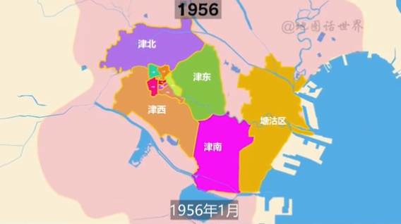

从历史角度分析，其实天津可以被分为两个“源”，一个是沿海的塘沽，另一个是不沿海，而是在海河三岔口附近的天津城。也就是上图东侧的部分和西侧的部分。这两个部分其实是承担了不同的城市职责。塘沽非常好理解，他临近渤海湾，是天然的海运港口。不好理解的是天津城，因为它不沿海，为什么要在内陆发展出这样的一个城市。

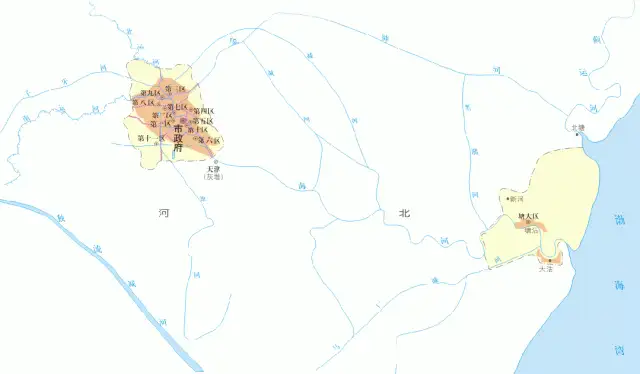

这有两个原因：自然原因和经济原因。自然原因是黄河改道与渤海海侵。现在的黄河是从山东入海，但是黄河泛滥的时候，会导致决堤更改河道，有的时候是会从天津入海的。黄河从天津入海携带的大量泥沙让天津形成了沿海的冲积平原，也就是塘沽地区，但是这片地区过于低洼，土质松软，很容易被渤海淹没，所以不适合建立大城市。而稍微靠近内陆的天津城。则没有这种担忧。

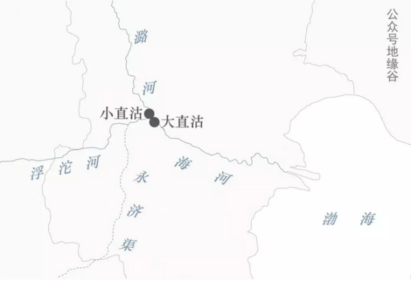

经济原因是除了海运，天津城还承担了河运的职责。天津城位于海河、滹沱河和潞河的三岔口处，同时还有京杭大运河的的永济渠也在此处交汇，在这个位置围绕直沽修建天津城就很合理了。

到了近代，天津的行政规划不断扩大，原本的塘沽变成了滨海新区，而天津城逐渐成了一个卷心菜中菜心的部分，别周围的郊县包围，形成了“市内六区，四郊五县”的格局，其中：

- 市内六区： 河北，南开，河东，红桥，河西，和平
- 四郊： 津南，北辰，东里，西青
- 五县： 蓟县，武清，宝坻，宁和，静海

最后放一张现在天津的行政规划：

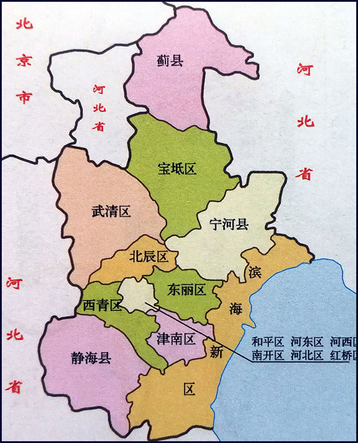

或者这张更形象一些：

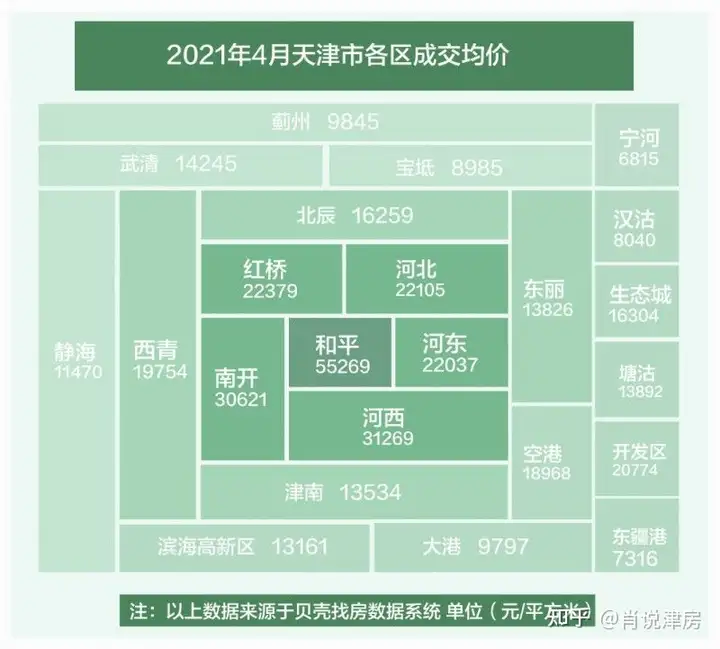

而从旅游角度来说，天津的景点集中于市内六区（如果不去海边玩的话），其实是很小的一片地方，我在知乎找到这样一个评论形容市内六区，大概可以概括一下天津的风土人情：

>因为每个区人的来源不同，河东区是本土漕运人，南开区是城里人，红桥区是回族人，和平区是外地人，河西是庄家人，河北是铁路人。然后各个区领地意识很强，你也听说过天津媳妇不外嫁，跨区算外嫁吧。
>
>市内六区打的不可开交，在他们眼里，郊区不配拥有姓名。“出了和平都是郊区”，别说四郊五县了，就连市内其他五区都看不上。
>
>市里居民对于四郊五县人排斥 ，本质上是城市文明市民文化对于传统农业文明的一种排斥。
>
>市里的和四郊五县本来就不是一个祖宗，市里的是江淮浙闽晋这五省移民后裔，主要从事工商业，是比较完整的市民社会模式。而四郊五县则是冀鲁民系后裔，主要从事农业，是传统的农业社会模式。
>
>市区因为骨子里面是移民后代，家庭结构更加原子化，日常生活中更加遵守规则，而四郊五县是冀鲁农民后代，家庭关系更加紧密，更喜欢走人际关系。市区刀子嘴但是内心很包容，四郊五县看似嘴不如市区厉害，但是骨子里面更加排外。
>
>像武清宝坻宁河汉沽蓟县四县一区是上世纪六七十年代划给天津的，这些地方之前一直是跟着北京或者唐山混的，对于天津没有什么认同感，反而对天津认同度高的沧州划给了河北省，德州归了山东省。

这次旅行因为被学校 push 得太紧了，所以并没有好好逛天津的旅游景点，只是将想吃的天津美食吃了吃，所以下文只有关于美食的介绍，没有太多关于景点的介绍。

---

## 三、美食

### 3.1 昱德来

昱德来并不是小红书或者知乎等攻略里推荐的天津传统菜馆，那些传统菜馆都在市内的东北侧，而我住在了鼓楼（也就是市中心），所以就找了宾馆附近的昱德来，发现味道还不错。这可能是因为天津菜非常传统，并没有很多的外地特色，不同的菜馆之间不会有明显差异导致的。

我最爱吃的是鸭卷，这可以说是我吃过最好吃的鸭子的烹饪方式。鸭子肉被撕成细丝，在保留肥美汁水的同时又避免了鸭肉柴硬的口感。鸭肉被鸡蛋皮和豆皮裹着下锅炸，要比北京烤鸭用荷叶饼或者面皮的方式融合得更好，更能保留鸭香。

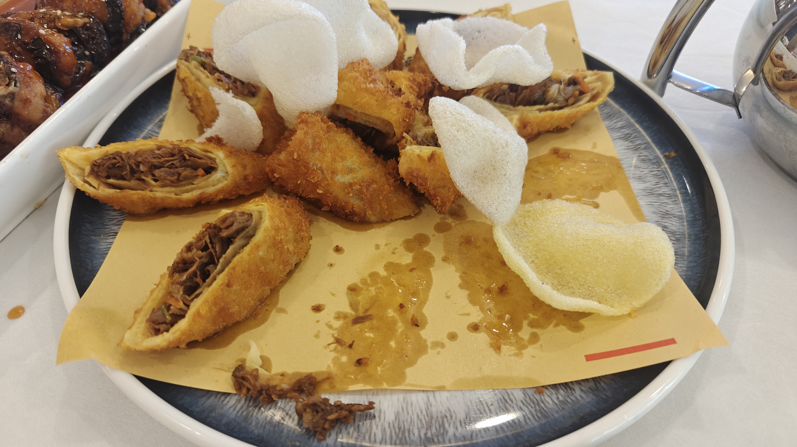

鲜虾茄盒是酸甜口的，做得中规中矩，并没有非常惊艳我。其实我一开始真的最想吃的就是这个，因为它有非常闪亮光泽的芡，看着就很下饭。实际吃上去吧，有点糊嗓子。

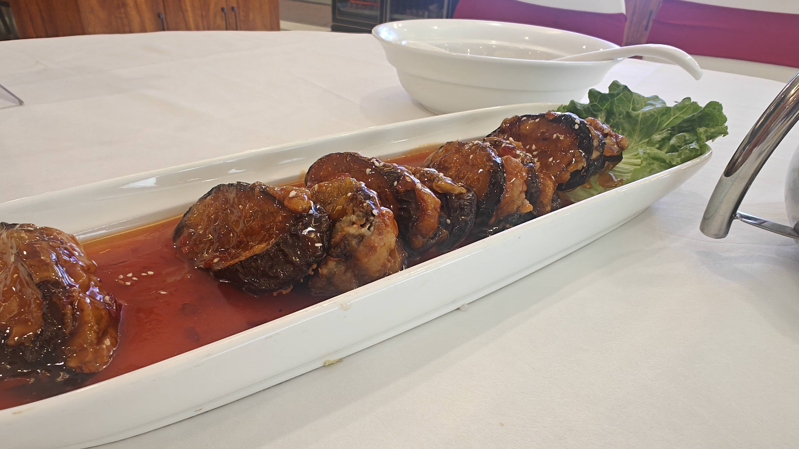

我还吃了老爆三（也就是传统爆三样），确实处理得不错，没有什么脏器味儿或者腥膻味儿，但是依然不好吃。

### 3.2 利德顺小老饭店

这家是我在西北角逛街时遇到的，是传统回民馆子，人非常火爆。我听旁边一个食客大哥说是天津非常好吃的一家传统菜馆，但是因为从不上美团或者大众点评，所以曝光率不是很高。

我个人感觉确实我吃到的菜品堪称惊艳！无论是从好吃的角度，还是从特色的角度来看。但是服务员真的好凶啊，我进了饭店也不领我去饭桌（人是真的多），好不容易坐下来也没人点菜，我去找前台就说让我等着。点菜的时候来了一个说着很重天津话的牛眼睛大爷，看我点了一个面筋，然后扯着嗓子嘟嘟囔囔（真的是这样，又大声又小声的）说太多油了，我吃不惯。把我吓得差点都直接不吃了。

虾仁独面筋真的超级好吃，面筋被完全浸泡在一个超绝的油里，那个油最少有白花椒油，菜籽油和椒麻油三种口感。面筋浸入在里面，又香又有嚼劲，而且油似乎有隔热的作用，当你将面筋吃进去的时候。面筋里被油阻隔的温度会在口腔里炸开，类似于在口腔里进行油泼面的淋油操作，那种蛋白质瞬间变性的口感，真的是绝了！这道菜就是我心中天津最好吃的菜！

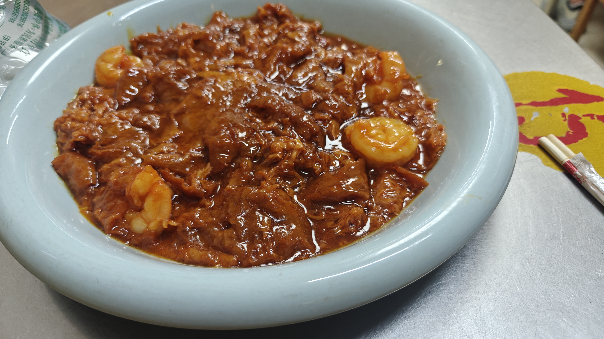

我去的时候就只有自己一个人，怕吃不完就点了这一份菜，但是白嘴吃似乎有些寡淡，就要了一个主食，一个服务员给我推荐了回头，我一看好贵啊，独面筋 40，这个东西也 40，但是我怕那个牛眼睛大爷又来，所以就点了：

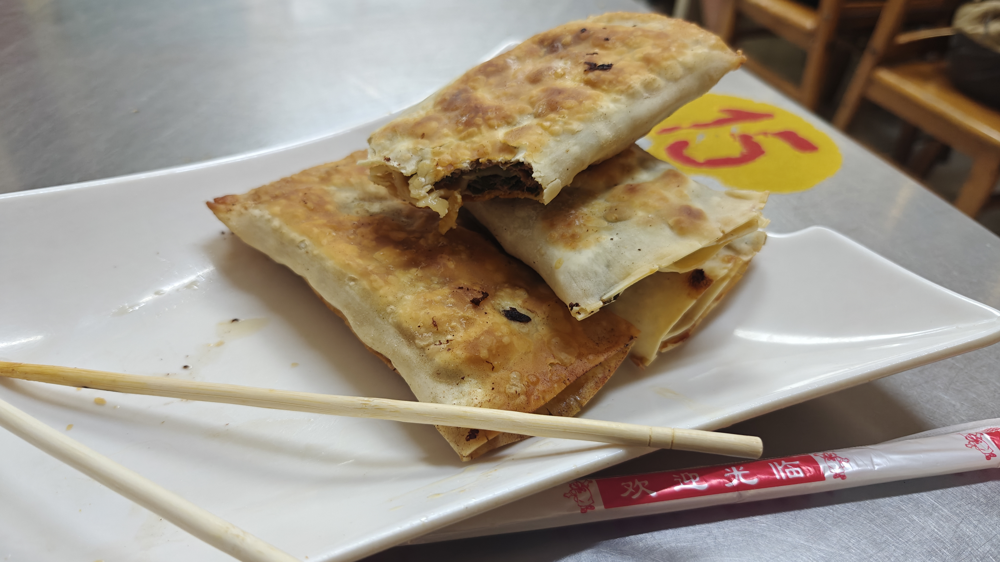

结果等了一个小时才上，这个东西其实要我说，非常有特色，而且不难吃，它类似于牛肉馅饼或者牛肉火烧，不同的是他的面没有刷的油更少，面皮更薄，烤制的时间更长。吃起来的口感更像是饼干而非饼，甚至让我有种吃比萨的错觉。

### 3.3 西北角

西北角在旅游攻略上被传成了一个网红早餐街，我还以为会跟北京的南锣鼓巷一样，都是骗外地人的“塑料美食”呢。但是实际上这里确实非常生活化，东西也不贵，有很多居民区的大爷大妈都来这里吃。我来这里吃了两天，基本上把这面墙上的东西都吃了个遍：

我早餐都是在利民餐厅吃的，主要是大夏天的，能有个能坐下吃饭还有空调的地方实在是太爽了：

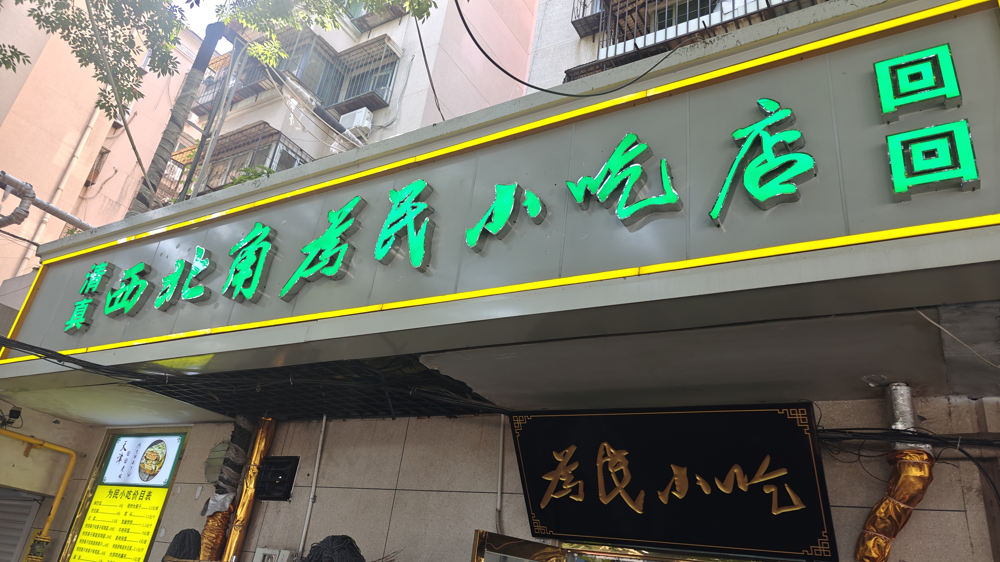

煎饼真的是太失望了，我听了那么久的天津相声，听了那么久天津人对于外地煎饼馃子的嘲弄，但是我自己吃的时候，真的味道是一样的，甚至天津的煎饼还更难以下咽。我小时候从书上看到过枣红色的油条，结果我转了很多的摊子，发现卖的都是黄色的油条，而且还很难吃（另外说一嘴，还是永和豆浆的油条最好吃，写得时候馋死我了），就像一个简单的面棍一样。

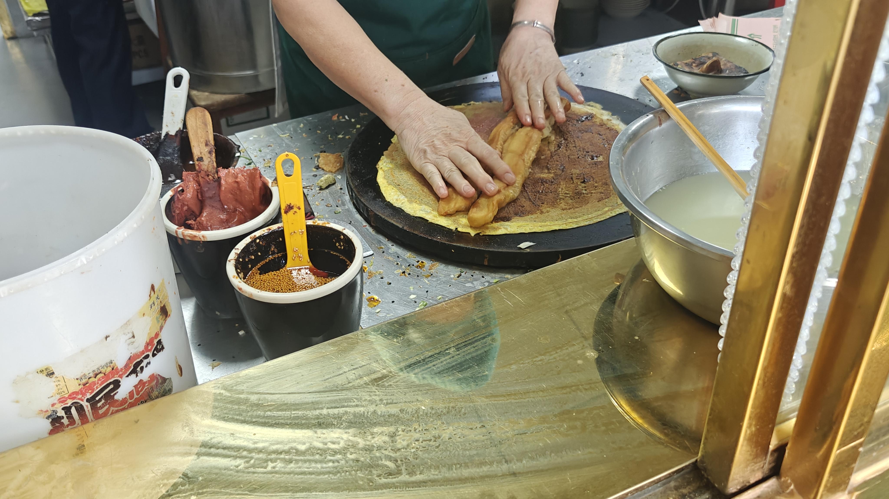

嘎巴才倒是挺好吃的，嘎巴菜是面片片上面淋上麻酱腐乳和某种特制的黏糊糊的汤汁，是咸口的，我觉得挺香的，而且面片的口感哏啾啾的，不像煎饼那么浮囊。

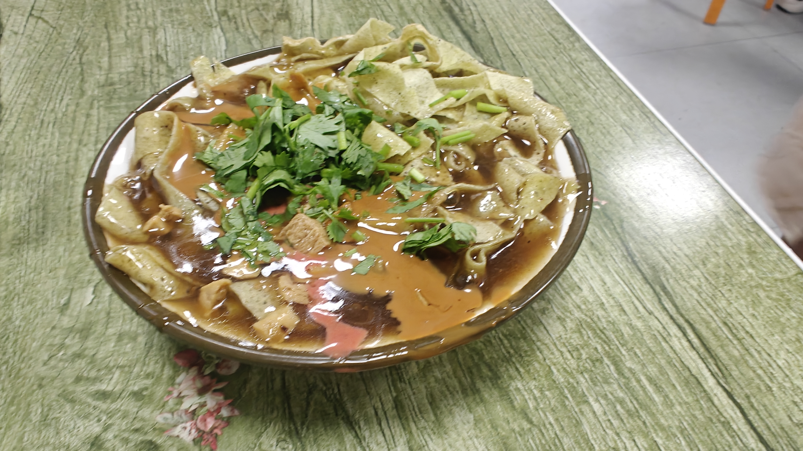

面茶跟嘎巴菜的味道差不多，真的像《俗世奇人》里描述的一样，先加半碗茶汤，再加一层芝麻，然后再加半碗茶汤，再撒一层芝麻。茶汤并不是固体，而更像是芝麻糊那样的固液交融的状态。我打算先攉拢攉拢再吃，但是旁边的天津大姨教给我不要搅和，而是要拿勺子溜着碗沿儿㧟着吃。

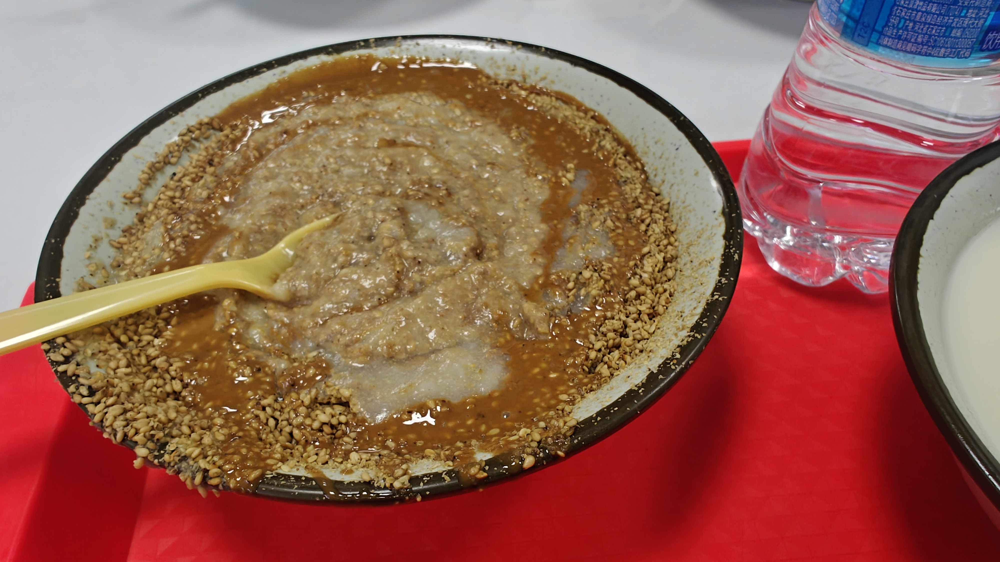

卷圈的腐乳味、油渣味儿和豆芽菜的水汽味儿交织在一起，形成了一种神秘的味觉体验，这种味道甚至都有些刺鼻了（腐乳有点发酸）：

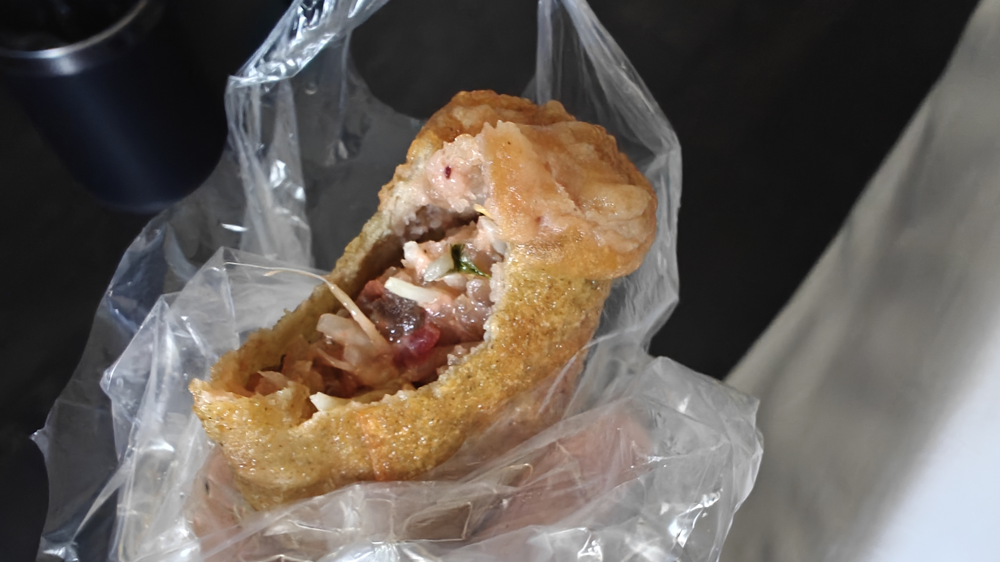

在西北角还常见熟梨膏，但是其实和梨这种水果没啥关系，我查了查，据说是“熟哩”的音译。其做法上很类似陕西的镜糕，但是要更加难吃一些，酱料𫫇甜𫫇甜的，而糯米过于粉了，这可能是由于它并不是在一个像蒸锅一样的密闭容器，而是在一个小碗里制作的。

### 3.4 起士林

非常有名的西餐馆，我觉得更难得是价格还算合理，而且服务员态度很好（感觉五大道这边市井气少一些，更加工业城市了一些）。可惜的是，这里的大列巴是要钱的（《师父》骗人！）：

店内的装潢有一种中西混合的感觉，西式的主体和中式的繁复装饰：

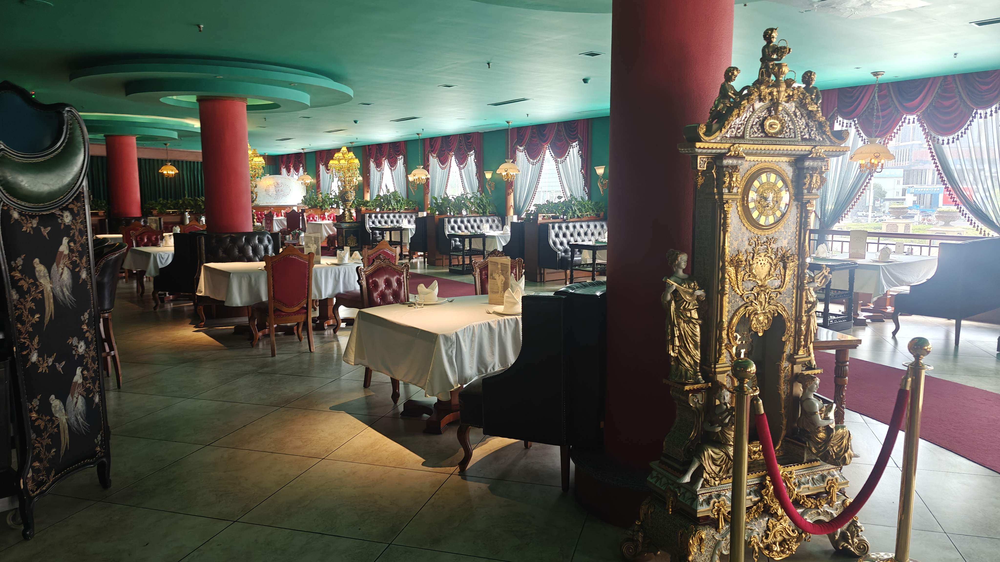

我在想耿良辰是不是原本比武赢了后就是要在这张楼梯口的大桌子上吃饭：

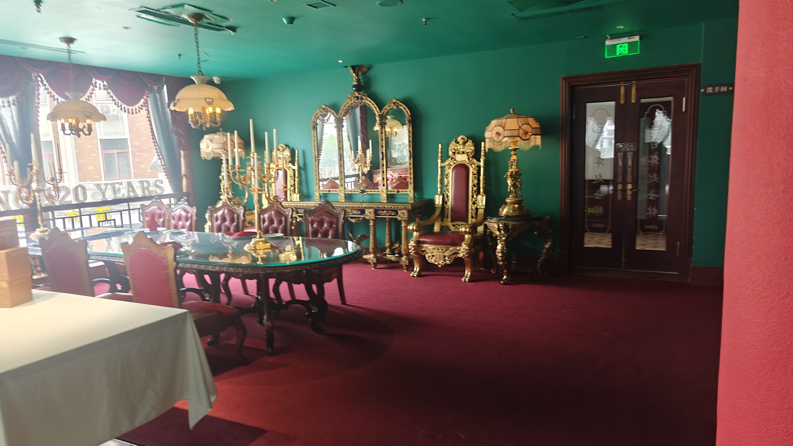

这个吧台也很漂亮：

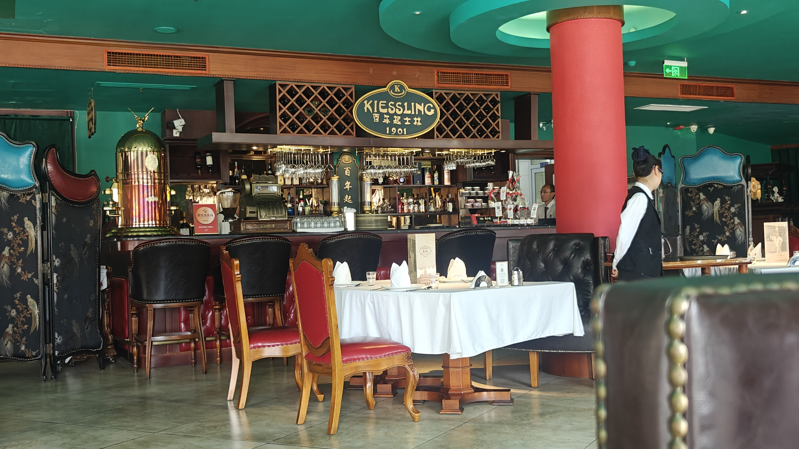

坐下来窗外是一个外国风情的音乐厅：

我看门口介绍说是德国餐厅，居然意外的好吃（什么刻板印象，我该死），红汤有很浓郁的酵香，而且还不酸𫫇：

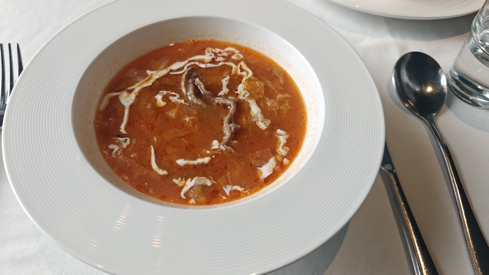

奶油芝士杂拌芝士量很足，拉丝很明显，各种肉类都很好吃：

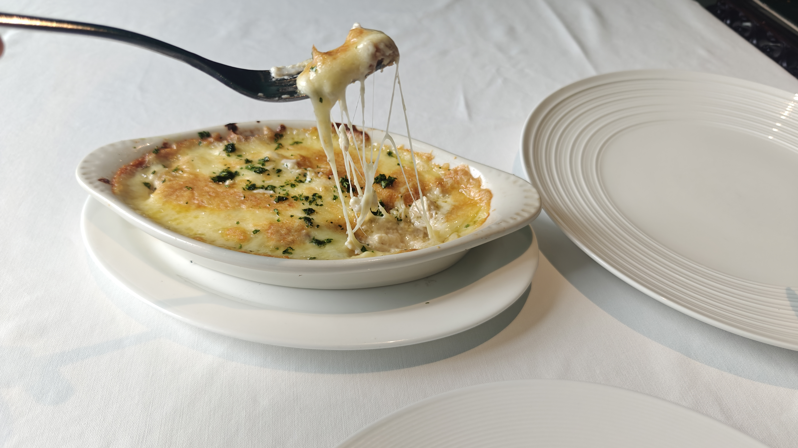

我平时并不喝酒，不知道是不是心理因素，我觉得这杯金汤力非常清冽，没有酸锈味儿：

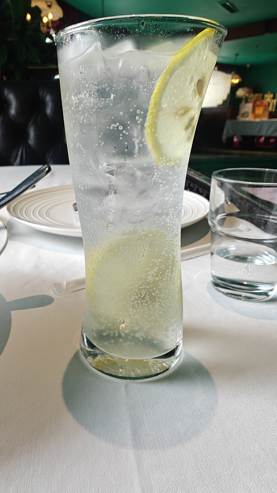
