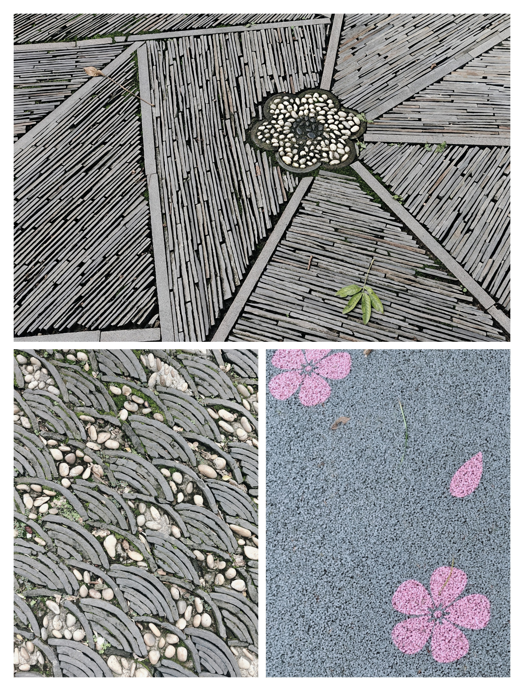
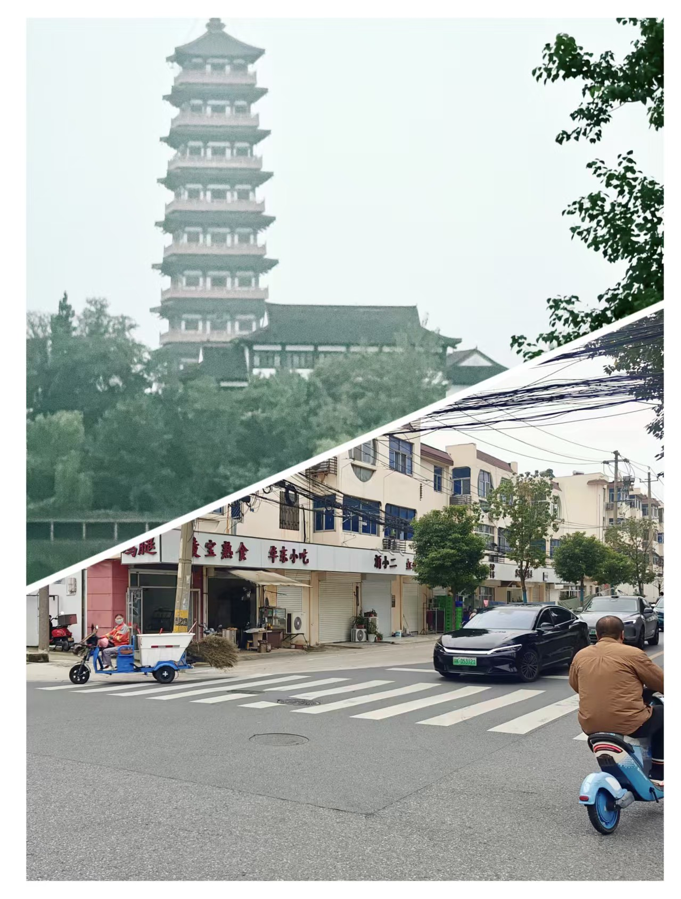
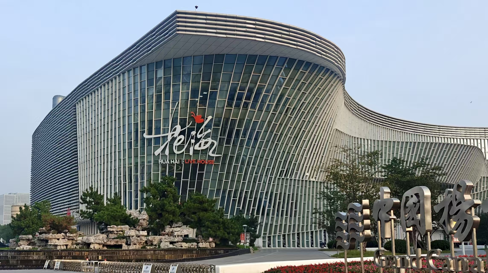
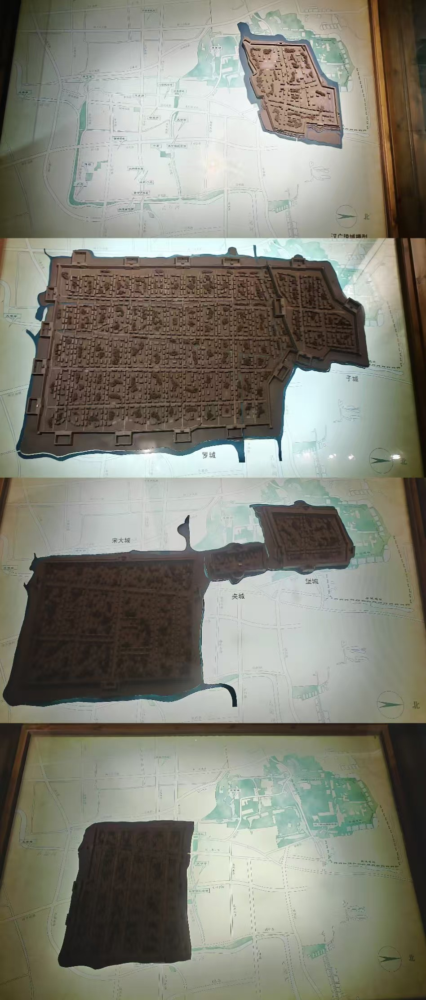
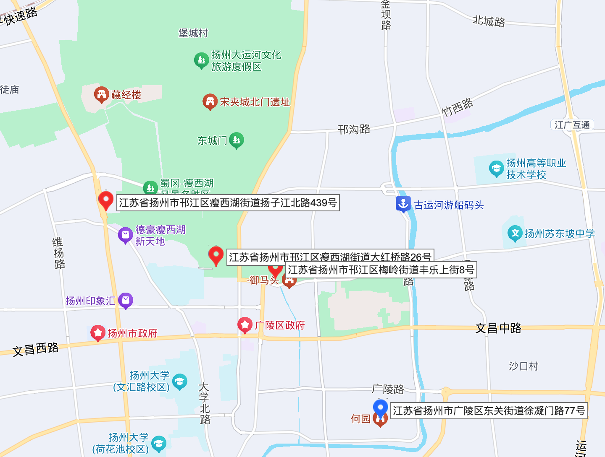
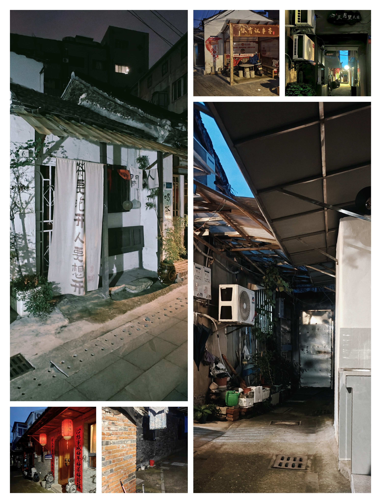
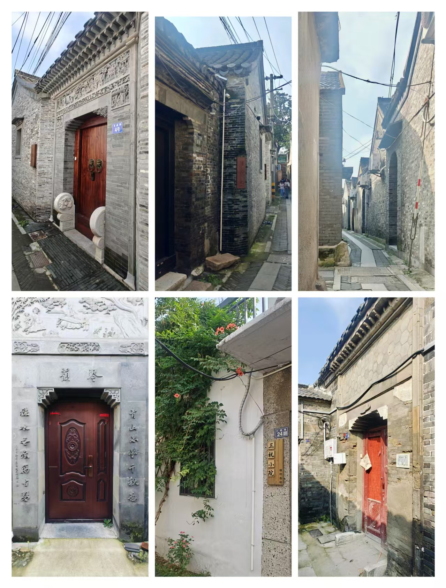
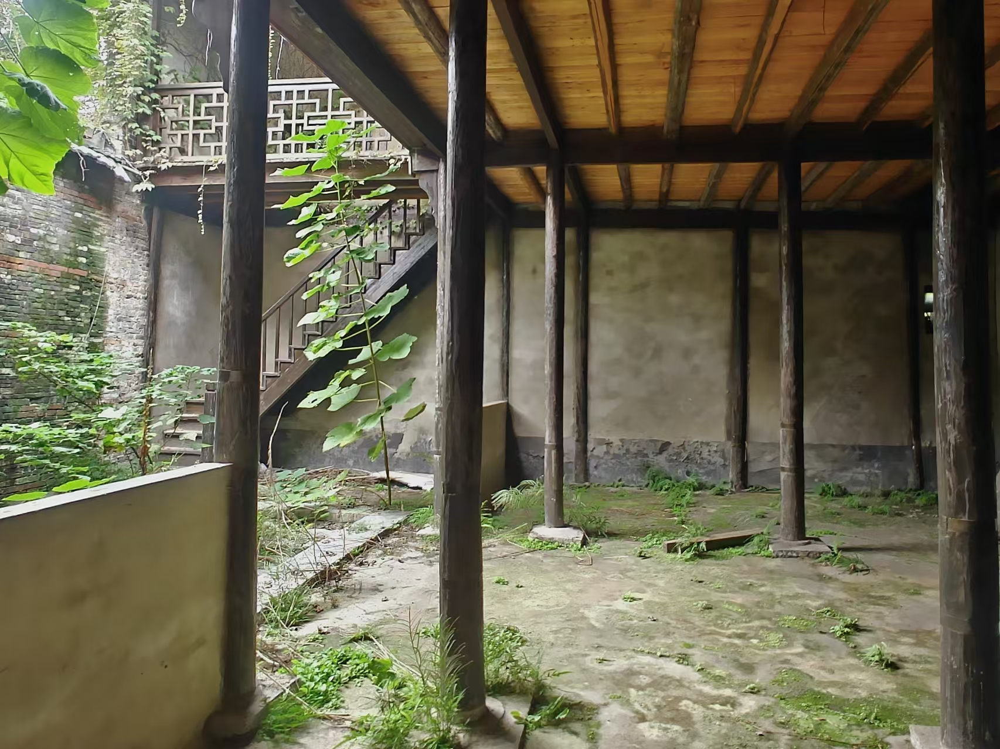
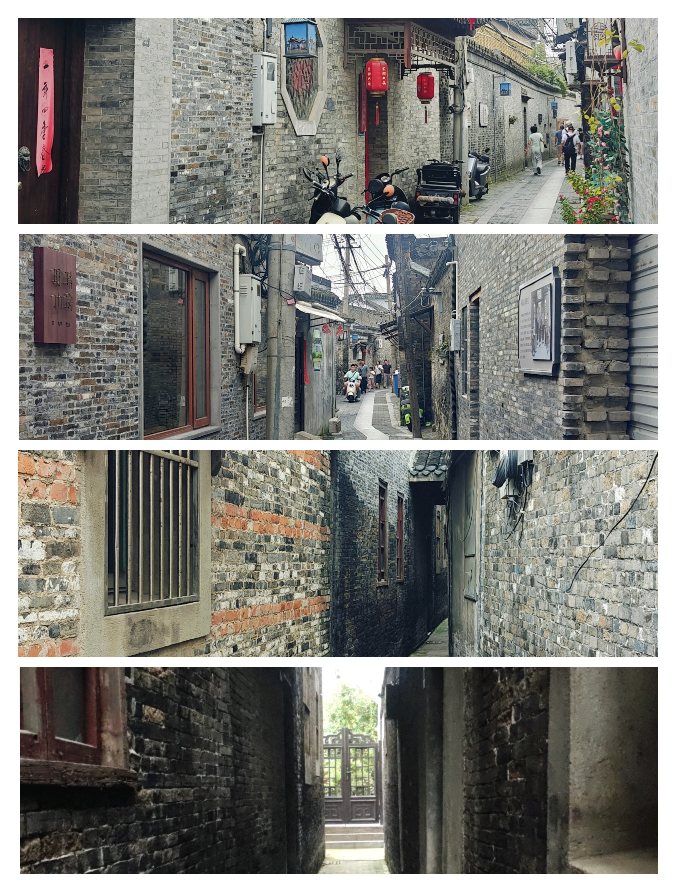
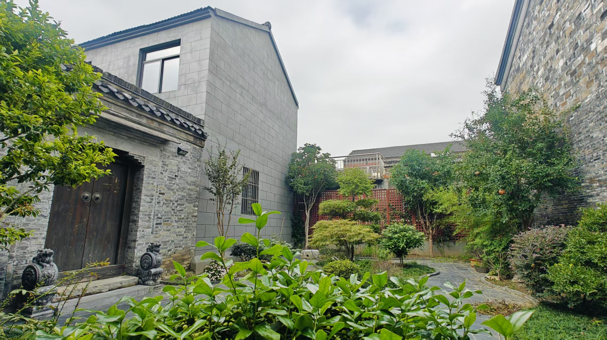

## 一、流浪

> 生活是无可避免的对抗，它是对无意义的对抗的对抗。
>
> 人一直在不可避免地流浪。

这次国庆出游只有我一个人。排除去天津那次单纯的为了干饭，这次的扬州之行可以说是我第一次自己一个人出游。

之所以选择自己一个人，是我感觉我之前对于旅游这件事情给予了太高的期望，需要一个人破一破妄。我希望旅游能够与爱人或者朋友一起去；还希望能玩遍所有著名的景点，吃遍所有的美食；还希望能深入了解本地人，在旅游滤镜扫射不到的地方，真实的生活文化；甚至还矛盾地期望着不期而遇的浪漫。**我希望通过旅游，为我无意义的生活赋予意义，对抗虚无**。

冷静分析下来，这几项基本上是矛盾的，在多个人的前提下，就会出现众口难调的情况。之前的我一直不肯认清这一点，我一直在等待，等待着那个恰好满足所有条件的天赐良机的出现。

也不知道是不是因为长大了的因素，我感觉到其实本质上，即使是多个人出游，也会存在无可避免的孤独，而孤独的旅游，本质上就是流浪。那或许我可以主动选择一个人。

不过这件事情仔细想想，也很荒唐。在多人出游的情况下，那些构造出来的意义，因为不同的意志存在，是那么的庸俗和脆弱；而在单人出游的情况下，构造出的意义，是那么的封闭和意淫。**在与无意义的对抗中，似乎输家永远都是我**。

这次的旅游的经历似乎也暗示了这一点。无论我如何自视自己是一个品味很高，很遗世独立的人，我都需要打开大众点评，去里面寻找吃饭的地方，这当然很没有道理，因为游客去的饭店的排名是一个很遵守马太效应的事情。当一个饭店的排名变高的时候，就会吸引游客去打卡，而这种打卡又会增加饭店的排名。就算游客吃了觉得不好吃，有多少人愿意承认自己的品味欣赏不了一个排名很高的饭店呢？就算游客非常实诚，那又有多少其他的游客，会相信真的是饭店不好吃，而不是这些实诚的游客没有品味呢？

但是如果不去那些排名很高的饭店，难道要去那些排名很低的饭店吗？就算我能忍受挑错饭店的失败，那我能接受错过真正的美食的代价吗？我为了我证明我是一个很清醒的，看透了大众点评愚蠢逻辑的人，就要冒着错过一个真正美食的风险？错过真正美食，是万万不能接受的，其实也能接受，只要我把锅甩给大众点评就行了，所以我最终还是打开了大众点评。

所以最终的结果就是，我选择了一个大多数人都会选择的方案，这个方案是庸俗的。**所谓的庸俗，就是无可避免的同义词**。“不好不坏”、“大多数人的选择”这些词语是庸俗的特性，但不是庸俗的本质。庸俗就是“不可避免”。就是生活会堵死你的每个角落，然后告诉你，你所有企图“高雅”的行为，不过是另一种形式的“庸俗”；所有与无意义的对抗，其本身都是滑稽的，失败或许是理想主义者的勋章，但是滑稽不是；那些在海滩上堆砌的沙堡，会被海水完全吞没；用竹篮子打水，不仅打不到水，而且还会把篮子弄得更加黏腻。

事情就像那滚滚东逝的水一样，任何企图拦下它的行为，只会让它更加激荡。**一切的一切，都在不可避免的走向溃败；任何企图力挽狂澜的行为，都会招致更加宏伟的庸俗**。底线这种东西的存在，就是为了告诉人们，突破它可能会发生一些事情，但是我们依然可以接受。而生活，与其是说对于庸俗的对抗，倒不如说是对于这种对抗本身的对抗。人无法对抗庸俗，但是可以对抗那种企图高雅（其本质是“可以避免”）的念头。

对我来说，我的一个很大的“高雅”的念头，就是我可以不用再流浪，我可以有很多人在我身边，我本想用旅游来对抗虚无。而我现在希望，要用这次的流浪，对抗这种对抗。

在去往扬州的列车上，我嗅到了汪曾祺说的和连顺的茶干的香气，听到了韦小宝的“辣块妈妈不开花”（我还搜了一下，扬州土语里是没有这句话的，“辣块”应该是“哪块”的意思，后面的就是纯粹捏造出的死妈嘴臭）的暗骂声和水银骰子的撞击声，停止了思考，然后头也不回的扎进了人头攒动的无意义洪流中。

---

## 二、观感

正如前所述，我对于这次旅行是非常上心的，态度非常端正。所以可能有些美化扬州了。

国庆假期出游确实非常影响游玩体验，哪里都是一堆人磨肩接踵，照相的时候人都要从屏幕里挤出来了。更不要说稍微火一点的馆子，都要等位 100 ~ 200 桌了。

抛开这些非常主观且不可复现的因素来看，扬州文旅给我最为印象深刻的点，其实是它的“诡异”。

### 2.1 意趣

一方面，扬州是我见过非常有“意趣”的一个城市。我们形容任天堂，会说“任天堂总会回应你的想象力”，这是因为任天堂的游戏总是在各种细节处反复打磨。扬州也是这样的，扬州总会回馈你的注意力，只要你漫步城市，你会发现无论你瞥到什么小东西，似乎都有一种“巧思”在里面，让你感觉：“嗯，不愧是扬州，实在是太有文化了”。这种感觉有点像是我精心配置的 emacs，可能在别人看来只是一个普通的 breadcrumb，而只有我知道，上面的 icon 是我花了多少心思做出来的。

举个例子，扬州的地砖不仅漂亮，而且各式各样，每个都非常有特色。基本上随时低头一瞅，就会感慨一下，原来还可以铺成这样：

所以在这个角度上来说，我是真的很喜欢扬州。

### 2.2 寒意

但是从另一个方面来说，扬州有很让我感到一种寒意。尤其是这种寒意与上文提到的意趣交织在一起的时候，就让我感到很诡异了。

一个很初见时让我觉得很有趣的点，就是只要出了扬州的景区，就会发现直接到了北方的大农村。简直完全没有过渡。下面这张照片，就是路的右侧和左侧，会发现右侧还是绿水高塔，左侧直接变成批发熟食店。右边仿佛还是烟雨江南，而左边直接变成石家庄村子了（可以看到连路灯也没有）。

我倒不是不能接受景区周围是农村，让我觉得诡异的是，为什么是北方农村（好歹是个水乡啊）？而且为什么要这么突然？这种感觉就像是一个在田间风吹雨打的老汉，脖子上居然是璀璨精致的钻石项链。这个老汉哪怕是带金链子呢，或者这个钻石项链哪怕是在一个满脑袋卷发棒的包租婆油腻的脖子上呢？我都可以接受的。这种反差感甚至开始让我怀疑扬州风光的真实性了。

而且这边的人的恶意也给我一种奇怪的寒意。我倒是能接受人是有恶意的，看我是一个单独的外地大学生，长得也很老实，想着宰几刀，或者糊弄一下，这是人之常情。但是扬州人的恶意，真的让我有些毛骨悚然。

举个例子，我会把共享电动车停在民宿门口，那天我推车离开的时候，就有一个在民宿门口的伺候菜地（是的，我的民宿门口是块菜地）的大娘，跟我说：“你要在这里停车？”，她的语气非常可爱和淳朴，似乎就是好奇我是如何启动这辆车的。我当时也很开心呀，说：“这个电动车真的很方便，晚上回来的时候还可以照明，黑灯瞎火的”。然后她说：“你为什么要在这里停车？”，语气依然很可爱，只是语速变快了一些，我当时一懵，然后想了想，嗷，她是不是觉得我在这里停车，占了她的门口，她是民宿的前台吗？我怎么没有见过她。所以我试着问了一下：“我是不是不可以在这里停车呀？”她回答到：“不可以。”，当时情景很诡异，就三个字，语气也很平，我也不知道该怎么接，所以我只好又问到“为什么不可以呀？”，她回答道：“车搁在这里不容易被运走。”，也没有很生气，也没有很热情，似乎只有一种嫌弃。我大概明白她的逻辑了，民宿离主干道有些远，所以如果我把车骑过来，而没有人骑回去，那么这个车可能就会滞留在这里，也没有人回收。但是我有些不明白，这是个正常现象呀，共享单车就是这样骑来骑去的呀，而且民宿门口如果不能停住户自己的车，也很奇怪啊，就算退一步来说，她真的不希望这里有车，而且不愿意付出一定的代价（比如联系一下共享单车的运营人员或者立个牌子啥的），就想折腾折腾我，也大可以大大方方地讲出来：“我是民宿的工作人员，您的行为不利于民宿的运营。”，起码不会让我感到这么奇怪。

当然也不止这一件事情，我在扬州还经历了：纪念品商店老板按着收银台算错账多收钱；餐厅服务人员把我刚吃了一口的饭，当着我的面收走；足疗店排队的时候，当着钟的面儿，撒谎快弄完了；等了一个多小时的扬州炒饭，催了一下立马甩脸子等诸多情形。这些事情其实我都能理解并且接受的，毕竟开门做生意，坑点骗点的不叫个事情；在旺期里，事情多人又累的，糊弄失误一些也是没有办法的事情。但是这些事情真的在扬州发生的时候，真的让我不寒而栗。

后来我想明白了一些，景区的人，简直和我农村家乡的人是一样的！在外面，我习惯了那种被礼貌虚伪包裹的恶意，也习惯了那种被热情和自来熟粉饰的恶意。但是我真的没有习惯我家乡的那种，笨拙、小心眼，没道理甚至还有些摆烂的恶意。这里的寒意，无论是来自市容市貌，还是人本身，都是来自我家乡农村的那种寒意。

一想到我心中江南文化，温柔乡的代表——扬州，居然毫不掩饰的存在这种故乡的气息，都觉得有些滑稽和荒唐。

当然我也要为扬州文旅辩解几句，我这次国庆出游，确实贪便宜，选的是均 300 的民宿，没有选 600 左右的正规宾馆。所以地理位置稍微偏一些（离瘦西湖只有不到 1km，只是位置靠西），服务态度稍微差一些，是可以接受的。

### 2.3 回归

不过后来的扬州双博馆之行，缓解了一部分的扬州的诡异质感。这是因为双博馆离其他景点都很远，骑电动车过去要 50 分钟左右，然后在这 50 分钟的旅程中，我发现越往双博馆去，城市的样貌越显现出来，这里也是有高楼，有小区，有路灯。游客常来的瘦西湖，东关街-皮市街，似乎是扬州的郊区。

双博馆周边就很城市化：

也挺奇怪的，我还以为扬州和南京或者西安一样，景点和市中心是重合的呢。不过细想也挺合理，西安出名的是古城，古城和现代城市重合也很正常；但是扬州出名的是瘦西湖，本质是个自然风光（其实是人工风光），那在郊区也说得过去。

---

## 三、地理

这次的地理知识，关键的都来自扬州双博馆，真的是很有趣、很本分的一个博物馆。

### 3.1 轮廓

扬州之所以繁华，是因为在古代的时候，这里是京杭大运河的尾部，运河带动得经济蓬勃发展。而现代人们有了更高效的海运，所以扬州相比于古时候，要更加落寞一些。

从图中可以看到，京杭大运河是在扬州汇入长江的。严格意义上来说，扬州应该算是“江北”而非“江南”。运河从北往南穿过扬州，基本上所有的景点都在运河的西面，在东面河岸上的，只有扬州东站。

下图是历史上各个时期扬州城的变化，在最开始的时候（应该是吴越在这里）是在瘦西湖的东侧建立的，在唐朝（应该哈），扩大了版图，变得和现在的扬州市差不多了。而到了宋代的时候，扬州成了抗金的边境线，所以东北方成了前线的堡城，而西南方成了后方的大城，连接二者的走廊被称为夹城。等到了明清时候，就只剩下大城部分了，其实这样说也不严谨，应该说是靠近瘦西湖的部分，变成了富贵盐商的私人庭院，而普通百姓则聚集在了西侧。这么看，这和北京的“西富东贵”的格局也很像了。

### 3.2 景点

扬州景点分布如下图所示：

总体来说扬州老城区里面景点最多，也最具特色，也因为分散的特点，比较适合 citywalk。不过里面的何园和个园，需要花一些时间来欣赏。

瘦西湖可以被理解成一个巨大的“皇家园林”，如果指向从南面走到北面，大概需要 3 个小时，如果希望全逛完，可能就要奔着一天去了。不过瘦西湖周边并不适合 citywalk（因为比较荒，我那张对比图就是在这附近拍摄的），只有平山堂和观音寺两个景点。

扬州双博馆在各种旅游攻略中经常被忽略，但是实际上我觉得非常好，紧挨着的美术馆也很有意思。而且正如我上面提到的，我觉得那里才是更像市中心的地方。

大运河博物馆我没有去过，就不评价了。

扬州是没有地铁的，出行主要靠腿、电动车和公交。在老城区 citywalk 非常合理，因为里面有很多的旧巷子和景点。在瘦西湖附近骑车也很合理，因为瘦西湖附近的路更稀疏一些，而且路上也不好看。公交需要提前充值，最少 10 元，我就做了两次（不过旺季车上也没什么人，还不错）。

### 3.3 丽春院

接下来就是最重要的环节了！让我们分析一下《鹿鼎记》中主人公、大清国一等鹿鼎公、一床七美三中的记录保持者、扬州最著名的无赖——韦小宝的故居丽春院在哪里？

首先在第二回，在韦小宝出场前，有提到丽春院是在瘦西湖畔的鸣玉坊。经过查证，鸣玉坊是金庸捏造的，但是瘦西湖畔可以保留。

> 清朝康熙初年，扬州**瘦西湖畔的鸣玉坊**乃青楼名妓汇集之所。这日正是暮春天气，华灯初上，鸣玉坊各家院子中传出一片丝竹和欢笑之声，中间又夹着猜枚行令，唱曲闹酒，当真是笙歌处处，一片升平景象。

其次在第三十九回，韦小宝回乡，行辕设置在了何园，而丽春院离何园不远，走一会就到了。行辕在何园肯定是金庸杜撰的，因为何园是由清光绪年间何芷舠所造，而韦小宝是康熙年间的人。不过我们得知了关键信息，就是丽春院离何园不远。

> 韦小宝心想倒也有理，笑道：“依你说，那行辕设在何处才是？”那道台道：“扬州盐商有个姓何的，他家的**何园**，称为扬州名园第一。他有心巴结钦差大人，早就预备得妥妥贴贴，盼望大人光临。只是他功名太小，不敢出口。大人若不嫌弃，不妨移驾过去瞧瞧。”
> 这姓何的盐商家财豪富，韦小宝**幼时常在他家高墙外走过**，听到墙里传出丝竹之声，十分羡慕，只是从无机缘进去望上一眼，当下便道：“好啊，这就去住上几天，倘若住得不适意，咱们再搬便是。扬州盐商多，咱们挨班儿住过去，吃过去，也吃不穷了他们。”
>
> 扬州的大街小巷他无不烂熟，几乎闭了眼睛也不会走错，**不多时便来到瘦西湖畔的鸣玉坊**，隐隐只听得各处门户中传出箫鼓丝竹，夹着猜拳唱曲、呼幺喝六。这些声音一入耳，当真比钧天仙乐还好听十倍，心中说不出的舒服受用。走到丽春院外，但见门庭依旧，跟当年离去时并无分别。他悄悄走到院侧，推开边门，溜了进去。

到了扬州以后，我又走访了一些扬州的本地人，他们给出的说法中有一个很有趣的，那就是丽春院就是冶春茶社。虽然我不知道这种说法是怎么起来的，但是我觉得有一定的合理性。根据资料显示，冶春茶社兴建于明末（有点子地狱笑话了，扬州十日后不可能保留），距今有 200 年的历史了，时间是对上了。

不过还有一个问题是，冶春有多家分店，到底哪个是呢？首先我们可以根据原文的描述，把那些离瘦西湖较远的都排除掉。但是还剩下三家，分别是西湖西店、西湖南店和御马头店（红色坐标是冶春茶社，蓝色的是何园）。

到这里似乎陷入僵局了，因为我没法确定到底是哪一家，而且就算确定了，我也没有办法确定冶春茶社就是丽春院。

但是我又想了想，毕竟丽春院是杜撰的，所以肯定是没有现实对照的，我探究的目的，只是为了给丽春院找到一个现实原型，大可不必在真实性上这么较真，而是应该领会金庸的创作意图。

于是我又读了一下原文，获得了一个灵感，那就是丽春院一定不高档，但是客流量不错。这是因为高档的妓院很难容忍韦春花这种生了孩子（韦小宝）、业务能力非常糟糕（翻来覆去只会唱两三首曲子）且年老色衰的妓女。但是丽春院的客流一直不错，这从文章末韦小宝问韦春花自己的爸爸是谁时，韦春花那一连串的“报爹名”可以看出来。而其这在经典的“儿媳阿珂嫖丈母娘”的情节上也可以得到印证，如果不是一个很火的窑子，那么为什么偏偏各种人物都会聚在这里。这虽然有情节冲突设计的考量，但是丽春院客流量很大也是剧情合理的一个保证。

那么综上所述，我们得到了以下线索：

1. 丽春院在瘦西湖畔
2. 丽春院离何园不远
3. 丽春院的原型有可能是冶春茶社
4. 丽春院是一个“快捷窑子”

在这些线索里面，第 2 点和第 4 点有些矛盾，这是因为何园这一片乃是富贵盐商和官员的居所，在这种地方开窑子，显然是不合理的。而且第 4 点本身也很难解释，就是有什么妓院，是不高档的同时，还客流量很好呢？

这些疑问在我读到朱自清的《扬州的夏日》时，得到了灵感，里面写到：

> 北门外一带，叫做下街，茶馆最多，往往一面临河，船行过时，茶客和乘客可以随便招呼说话，船上人若高兴时，也可以向茶馆中要壶茶或一两种小点心，在河中唱着、吃着、谈着，回来时再将茶壶和所谓小笼连价款一并交给茶馆中人。

这里面对于茶馆的描述，是粗俗的，而之所以会这样，有可能是因为这些茶馆挨着运河。运河的正常运转离不开船工，这些人都是非常底层的劳动者，受教育水平不高，因此会有粗鄙的特性。而扬州又不可能剥离它们存在，这是城市繁荣不得不容忍的“代价”。如果丽春院是坐落在运河边上呢？那是不是就很合理了，它的格调自然不如那些皇亲贵胄常去的青楼高，其主要客户就是河工和船工，或者外地来的乘客，那自然客流量就会很高，而且客人也不挑剔。

当我们得到了这个猜测后，再结合第 1 和第 3 点，就会发现冶春茶社御马头店非常合适。它离西湖和何园都很近，它坐落在运河边上，繁华且世俗，只有这样的地方才会诞生韦小宝这样的扬州无赖。

---

## 四、景点

### 4.1 皮市街的巷子

皮市街是在古代是商人贩卖皮毛的地方，现在变成了扬州第二大的商业街（第一大商业街是东关街）。

我着重逛了这条街，是因为我第一天的民宿就在皮市街旁。我在预订的时候非常开心，因为上面写的是就在皮市街旁边，我还以为花低价订到了一个商业街旁的豪华民宿呢，简直是兼顾游玩和体验风情。然后我就发现，要从皮市街到达我的民宿，需要先走一条非常狭窄的巷子（大概只有两辆电动车那么宽），然后再拐入一个只有一辆电动车那么宽的巷子，然后走到最里头，才是我的民宿，就离我不到一米的地方，就是人家居民炒菜的厨房，在民宿内，我甚至可以听到外面做菜时油点子迸溅出来的声音。

虽然我很希望我的民宿是左下角挂着红灯笼的房子，但是实际上我的民宿是右下角这个。

不过我倒没有很抵触这个事情，相反，我觉得这正是体验民俗的一个好机会，住在这里，反而脱离了传统商业街的那种预制菜的味道，更具烟火气。我觉得这边的巷子有点像电视剧里面演的北京胡同了，因为也是有些拥挤，而且生活气息和古城建筑文化很好地交织在了一起。相较于现实中的北京胡同，我觉得这边的特点是更加“干净”，虽然在这里也能看到水桶、水壶、煤气罐和晾晒的外衣内衣，但是就是要比北京胡同感觉更加整洁一些。

我猜测是因为这边的墙要比北京的更漂亮，北京的红墙还是带着一股子北方的土气，而这里的墙都是灰色的石砖垒砌的，积年累月，又有了青黑色的青苔，看上去就非常有文化氛围（即使同样是红砖垒的，这里的也比北京的好看，可以看上图左下角第二张图）。而这种斑驳的墙，削弱了其他物品的杂乱（墙就已经够乱了）。此外这边的细节也做得更好一些，比如说这里的排水渠就比北京的要更加漂亮和整洁，都是上面有盖而且不反味的，而北京的经常缺少盖子，房上的瓦一般也都是有漂亮图案的。

我是晚上到的，等我到了早晨也是一头扎进各个胡同里面，发现白天更漂亮一些，非常有感觉（我真觉得这里比北京还北京），巷子里就是普通的人家，可以看到也不是什么富贵人家（不过可能就跟北京二环似的，就算富贵我也看不出来），有普通的自行车，电动车，有的人家还养了鸽子。不过他们都尽可能地捯饬自己的门楣，走过这些巷子，你会看到非常漂亮的对联、门、花草树木和石头。石头这个肯定是精心做的，我没见过哪个北方人家，会专门摆一个像山的石头在自己门口的。

不得不感慨扬州这个地方的生态确实就带这股“诗情画意”的味道，也不知道是古代的诗画家从生态中汲取了灵感，还是诗画家的灵感指导了生态的建设。我在走街串巷的时候，发现了一个荒废的院子，这如果是在石家庄，我敢肯定里面一定是充斥着碎玻璃渣子、塑料广告皮和各种猫狗人的粪便，但是这里看上去，具有有种“苔痕上阶绿，草色入帘青”的风雅感，你说气不气：

经过我不断地走街串巷，串巷走街：

终于在一个非常非常深的巷子尽头，发现了让我震惊的一幕，居然在这么深的巷子里，藏着这么漂亮的一个院子！我都能想到院主在修建这个房子时开心的情绪，是不是有一种“大隐隐于市”的装逼感！

---

## 五、美食

### 5.1 皮市街
