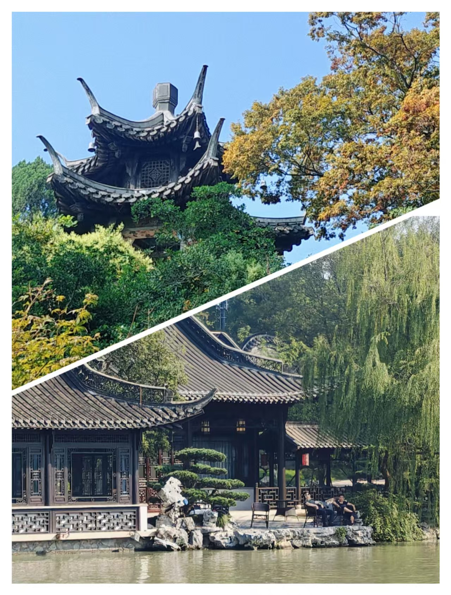

## 一、流浪

> 生活是无可避免的对抗，它是对无意义的对抗的对抗。
>
> 人一直在不可避免地流浪。

这次国庆出游只有我一个人。排除去天津那次单纯的为了干饭，这次的扬州之行可以说是我第一次自己一个人出游。

之所以选择自己一个人，是我感觉我之前对于旅游这件事情给予了太高的期望，需要一个人破一破妄。我希望旅游能够与爱人或者朋友一起去；还希望能玩遍所有著名的景点，吃遍所有的美食；还希望能深入了解本地人，在旅游滤镜扫射不到的地方，真实的生活文化；甚至还矛盾地期望着不期而遇的浪漫。**我希望通过旅游，为我无意义的生活赋予意义，对抗虚无**。

冷静分析下来，这几项基本上是矛盾的，在多个人的前提下，就会出现众口难调的情况。之前的我一直不肯认清这一点，我一直在等待，等待着那个恰好满足所有条件的天赐良机的出现。

也不知道是不是因为长大了的因素，我感觉到其实本质上，即使是多个人出游，也会存在无可避免的孤独，而孤独的旅游，本质上就是流浪。那或许我可以主动选择一个人。

不过这件事情仔细想想，也很荒唐。在多人出游的情况下，那些构造出来的意义，因为不同的意志存在，是那么的庸俗和脆弱；而在单人出游的情况下，构造出的意义，是那么的封闭和意淫。**在与无意义的对抗中，似乎输家永远都是我**。

这次的旅游的经历似乎也暗示了这一点。无论我如何自视自己是一个品味很高，很遗世独立的人，我都需要打开大众点评，去里面寻找吃饭的地方，这当然很没有道理，因为游客去的饭店的排名是一个很遵守马太效应的事情。当一个饭店的排名变高的时候，就会吸引游客去打卡，而这种打卡又会增加饭店的排名。就算游客吃了觉得不好吃，有多少人愿意承认自己的品味欣赏不了一个排名很高的饭店呢？就算游客非常实诚，那又有多少其他的游客，会相信真的是饭店不好吃，而不是这些实诚的游客没有品味呢？

但是如果不去那些排名很高的饭店，难道要去那些排名很低的饭店吗？就算我能忍受挑错饭店的失败，那我能接受错过真正的美食的代价吗？我为了我证明我是一个很清醒的，看透了大众点评愚蠢逻辑的人，就要冒着错过一个真正美食的风险？错过真正美食，是万万不能接受的，其实也能接受，只要我把锅甩给大众点评就行了，所以我最终还是打开了大众点评。

所以最终的结果就是，我选择了一个大多数人都会选择的方案，这个方案是庸俗的。**所谓的庸俗，就是无可避免的同义词**。“不好不坏”、“大多数人的选择”这些词语是庸俗的特性，但不是庸俗的本质。庸俗就是“不可避免”。就是生活会堵死你的每个角落，然后告诉你，你所有企图“高雅”的行为，不过是另一种形式的“庸俗”；所有与无意义的对抗，其本身都是滑稽的，失败或许是理想主义者的勋章，但是滑稽不是；那些在海滩上堆砌的沙堡，会被海水完全吞没；用竹篮子打水，不仅打不到水，而且还会把篮子弄得更加黏腻。

事情就像那滚滚东逝的水一样，任何企图拦下它的行为，只会让它更加激荡。**一切的一切，都在不可避免的走向溃败；任何企图力挽狂澜的行为，都会招致更加盛大的庸俗**。底线这种东西的存在，就是为了告诉人们，突破它可能会发生一些事情，但是我们依然可以接受。而生活，与其是说对于庸俗的对抗，倒不如说是对于这种对抗本身的对抗。人无法对抗庸俗，但是可以对抗那种企图高雅（其本质是“可以避免”）的念头。

对我来说，我的一个很大的“高雅”的念头，就是我可以不用再流浪，我可以有很多人在我身边，我本想用旅游来对抗虚无。而我现在希望，要用这次的流浪，对抗这种对抗。

在去往扬州的列车上，我嗅到了汪曾祺说的和连顺的茶干的香气，听到了韦小宝的“辣块妈妈不开花”（我还搜了一下，扬州土语里是没有这句话的，“辣块”应该是“哪块”的意思，后面的就是纯粹捏造出的死妈嘴臭）的暗骂声和水银骰子的撞击声，停止了思考，然后头也不回的扎进了人头攒动的无意义洪流中。

---

## 二、观感

正如前所述，我对于这次旅行是非常上心的，态度非常端正。所以可能有些美化扬州了。

国庆假期出游确实非常影响游玩体验，哪里都是一堆人磨肩接踵，照相的时候人都要从屏幕里挤出来了。更不要说稍微火一点的馆子，都要等位 100 ~ 200 桌了。

抛开这些非常主观且不可复现的因素来看，扬州文旅给我最为印象深刻的点，其实是它的“诡异”。

### 2.1 意趣

一方面，扬州是我见过非常有“意趣”的一个城市。我们形容任天堂，会说“任天堂总会回应你的想象力”，这是因为任天堂的游戏总是在各种细节处反复打磨。扬州也是这样的，扬州总会回馈你的注意力，只要你漫步城市，你会发现无论你瞥到什么小东西，似乎都有一种“巧思”在里面，让你感觉：“嗯，不愧是扬州，实在是太有文化了”。这种感觉有点像是我精心配置的 emacs，可能在别人看来只是一个普通的 breadcrumb，而只有我知道，上面的 icon 是我花了多少心思做出来的。

举个例子，扬州的地砖不仅漂亮，而且各式各样，每个都非常有特色。基本上随时低头一瞅，就会感慨一下，原来还可以铺成这样：

所以在这个角度上来说，我是真的很喜欢扬州。

### 2.2 寒意

但是从另一个方面来说，扬州有很让我感到一种寒意。尤其是这种寒意与上文提到的意趣交织在一起的时候，就让我感到很诡异了。

一个很初见时让我觉得很有趣的点，就是只要出了扬州的景区，就会发现直接到了北方的大农村。简直完全没有过渡。下面这张照片，就是路的右侧和左侧，会发现右侧还是绿水高塔，左侧直接变成批发熟食店。右边仿佛还是烟雨江南，而左边直接变成石家庄村子了（可以看到连路灯也没有）。

我倒不是不能接受景区周围是农村，让我觉得诡异的是，为什么是北方农村（好歹是个水乡啊）？而且为什么要这么突然？这种感觉就像是一个在田间风吹雨打的老汉，脖子上居然是璀璨精致的钻石项链。这个老汉哪怕是带金链子呢，或者这个钻石项链哪怕是在一个满脑袋卷发棒的包租婆油腻的脖子上呢？我都可以接受的。这种反差感甚至开始让我怀疑扬州风光的真实性了。

而且这边的人的恶意也给我一种奇怪的寒意。我倒是能接受人是有恶意的，看我是一个单独的外地大学生，长得也很老实，想着宰几刀，或者糊弄一下，这是人之常情。但是扬州人的恶意，真的让我有些毛骨悚然。

举个例子，我会把共享电动车停在民宿门口，那天我推车离开的时候，就有一个在民宿门口的伺候菜地（是的，我的民宿门口是块菜地）的大娘，跟我说：“你要在这里停车？”，她的语气非常可爱和淳朴，似乎就是好奇我是如何启动这辆车的。我当时也很开心呀，说：“这个电动车真的很方便，晚上回来的时候还可以照明，黑灯瞎火的”。然后她说：“你为什么要在这里停车？”，语气依然很可爱，只是语速变快了一些，我当时一懵，然后想了想，嗷，她是不是觉得我在这里停车，占了她的门口，她是民宿的前台吗？我怎么没有见过她。所以我试着问了一下：“我是不是不可以在这里停车呀？”她回答到：“不可以。”，当时情景很诡异，就三个字，语气也很平，我也不知道该怎么接，所以我只好又问到“为什么不可以呀？”，她回答道：“车搁在这里不容易被运走。”，也没有很生气，也没有很热情，似乎只有一种嫌弃。我大概明白她的逻辑了，民宿离主干道有些远，所以如果我把车骑过来，而没有人骑回去，那么这个车可能就会滞留在这里，也没有人回收。但是我有些不明白，这是个正常现象呀，共享单车就是这样骑来骑去的呀，而且民宿门口如果不能停住户自己的车，也很奇怪啊，就算退一步来说，她真的不希望这里有车，而且不愿意付出一定的代价（比如联系一下共享单车的运营人员或者立个牌子啥的），就想折腾折腾我，也大可以大大方方地讲出来：“我是民宿的工作人员，您的行为不利于民宿的运营。”，起码不会让我感到这么奇怪。

当然也不止这一件事情，我在扬州还经历了：纪念品商店老板按着收银台算错账多收钱；餐厅服务人员把我刚吃了一口的饭，当着我的面收走；足疗店排队的时候，当着钟的面儿，撒谎快弄完了；等了一个多小时的扬州炒饭，催了一下立马甩脸子等诸多情形。这些事情其实我都能理解并且接受的，毕竟开门做生意，坑点骗点的不叫个事情；在旺期里，事情多人又累的，糊弄失误一些也是没有办法的事情。但是这些事情真的在扬州发生的时候，真的让我不寒而栗。

后来我想明白了一些，景区的人，简直和我农村家乡的人是一样的！在外面，我习惯了那种被礼貌虚伪包裹的恶意，也习惯了那种被热情和自来熟粉饰的恶意。但是我真的没有习惯我家乡的那种，笨拙、小心眼，没道理甚至还有些摆烂的恶意。这里的寒意，无论是来自市容市貌，还是人本身，都是来自我家乡农村的那种寒意。

一想到我心中江南文化，温柔乡的代表——扬州，居然毫不掩饰的存在这种故乡的气息，都觉得有些滑稽和荒唐。

当然我也要为扬州文旅辩解几句，我这次国庆出游，确实贪便宜，选的是均 300 的民宿，没有选 600 左右的正规宾馆。所以地理位置稍微偏一些（离瘦西湖只有不到 1km，只是位置靠西），服务态度稍微差一些，是可以接受的。

### 2.3 回归

不过后来的扬州双博馆之行，缓解了一部分的扬州的诡异质感。这是因为双博馆离其他景点都很远，骑电动车过去要 50 分钟左右，然后在这 50 分钟的旅程中，我发现越往双博馆去，城市的样貌越显现出来，这里也是有高楼，有小区，有路灯。游客常来的瘦西湖，东关街-皮市街，似乎是扬州的郊区。

双博馆周边就很城市化：

也挺奇怪的，我还以为扬州和南京或者西安一样，景点和市中心是重合的呢。不过细想也挺合理，西安出名的是古城，古城和现代城市重合也很正常；但是扬州出名的是瘦西湖，本质是个自然风光（其实是人工风光），那在郊区也说得过去。

---

## 三、地理

这次的地理知识，关键的都来自扬州双博馆，真的是很有趣、很本分的一个博物馆。

### 3.1 轮廓

扬州之所以繁华，是因为在古代的时候，这里是京杭大运河的尾部，运河带动得经济蓬勃发展。而现代人们有了更高效的海运，所以扬州相比于古时候，要更加落寞一些。

从图中可以看到，京杭大运河是在扬州汇入长江的。严格意义上来说，扬州应该算是“江北”而非“江南”。运河从北往南穿过扬州，基本上所有的景点都在运河的西面，在东面河岸上的，只有扬州东站。

下图是历史上各个时期扬州城的变化，在最开始的时候（应该是吴越在这里）是在瘦西湖的东侧建立的，在唐朝（应该哈），扩大了版图，变得和现在的扬州市差不多了。而到了宋代的时候，扬州成了抗金的边境线，所以东北方成了前线的堡城，而西南方成了后方的大城，连接二者的走廊被称为夹城。等到了明清时候，就只剩下大城部分了，其实这样说也不严谨，应该说是靠近瘦西湖的部分，变成了富贵盐商的私人庭院，而普通百姓则聚集在了西侧。这么看，这和北京的“西富东贵”的格局也很像了。

### 3.2 景点

扬州景点分布如下图所示：

总体来说扬州老城区里面景点最多，也最具特色，也因为分散的特点，比较适合 citywalk。不过里面的何园和个园，需要花一些时间来欣赏。

瘦西湖可以被理解成一个巨大的“皇家园林”，如果指向从南面走到北面，大概需要 3 个小时，如果希望全逛完，可能就要奔着一天去了。不过瘦西湖周边并不适合 citywalk（因为比较荒，我那张对比图就是在这附近拍摄的），只有平山堂和观音寺两个景点。

扬州双博馆在各种旅游攻略中经常被忽略，但是实际上我觉得非常好，紧挨着的美术馆也很有意思。而且正如我上面提到的，我觉得那里才是更像市中心的地方。

大运河博物馆我没有去过，就不评价了。

扬州是没有地铁的，出行主要靠腿、电动车和公交。在老城区 citywalk 非常合理，因为里面有很多的旧巷子和景点。在瘦西湖附近骑车也很合理，因为瘦西湖附近的路更稀疏一些，而且路上也不好看。公交需要提前充值，最少 10 元，我就做了两次（不过旺季车上也没什么人，还不错）。

### 3.3 丽春院

接下来就是最重要的环节了！让我们分析一下《鹿鼎记》中主人公、大清国一等鹿鼎公、一床七美三中的记录保持者、扬州最著名的无赖——韦小宝的故居丽春院在哪里？

首先在第二回，在韦小宝出场前，有提到丽春院是在瘦西湖畔的鸣玉坊。经过查证，鸣玉坊是金庸捏造的，但是瘦西湖畔可以保留。

> 清朝康熙初年，扬州**瘦西湖畔的鸣玉坊**乃青楼名妓汇集之所。这日正是暮春天气，华灯初上，鸣玉坊各家院子中传出一片丝竹和欢笑之声，中间又夹着猜枚行令，唱曲闹酒，当真是笙歌处处，一片升平景象。

其次在第三十九回，韦小宝回乡，行辕设置在了何园，而丽春院离何园不远，走一会就到了。行辕在何园肯定是金庸杜撰的，因为何园是由清光绪年间何芷舠所造，而韦小宝是康熙年间的人。不过我们得知了关键信息，就是丽春院离何园不远。

> 韦小宝心想倒也有理，笑道：“依你说，那行辕设在何处才是？”那道台道：“扬州盐商有个姓何的，他家的**何园**，称为扬州名园第一。他有心巴结钦差大人，早就预备得妥妥贴贴，盼望大人光临。只是他功名太小，不敢出口。大人若不嫌弃，不妨移驾过去瞧瞧。”
> 这姓何的盐商家财豪富，韦小宝**幼时常在他家高墙外走过**，听到墙里传出丝竹之声，十分羡慕，只是从无机缘进去望上一眼，当下便道：“好啊，这就去住上几天，倘若住得不适意，咱们再搬便是。扬州盐商多，咱们挨班儿住过去，吃过去，也吃不穷了他们。”
>
> 扬州的大街小巷他无不烂熟，几乎闭了眼睛也不会走错，**不多时便来到瘦西湖畔的鸣玉坊**，隐隐只听得各处门户中传出箫鼓丝竹，夹着猜拳唱曲、呼幺喝六。这些声音一入耳，当真比钧天仙乐还好听十倍，心中说不出的舒服受用。走到丽春院外，但见门庭依旧，跟当年离去时并无分别。他悄悄走到院侧，推开边门，溜了进去。

到了扬州以后，我又走访了一些扬州的本地人，他们给出的说法中有一个很有趣的，那就是丽春院就是冶春茶社。虽然我不知道这种说法是怎么起来的，但是我觉得有一定的合理性。根据资料显示，冶春茶社兴建于明末（有点子地狱笑话了，扬州十日后不可能保留），距今有 200 年的历史了，时间是对上了。

不过还有一个问题是，冶春有多家分店，到底哪个是呢？首先我们可以根据原文的描述，把那些离瘦西湖较远的都排除掉。但是还剩下三家，分别是西湖西店、西湖南店和御马头店（红色坐标是冶春茶社，蓝色的是何园）。

到这里似乎陷入僵局了，因为我没法确定到底是哪一家，而且就算确定了，我也没有办法确定冶春茶社就是丽春院。

但是我又想了想，毕竟丽春院是杜撰的，所以肯定是没有现实对照的，我探究的目的，只是为了给丽春院找到一个现实原型，大可不必在真实性上这么较真，而是应该领会金庸的创作意图。

于是我又读了一下原文，获得了一个灵感，那就是丽春院一定不高档，但是客流量不错。这是因为高档的妓院很难容忍韦春花这种生了孩子（韦小宝）、业务能力非常糟糕（翻来覆去只会唱两三首曲子）且年老色衰的妓女。但是丽春院的客流一直不错，这从文章末韦小宝问韦春花自己的爸爸是谁时，韦春花那一连串的“报爹名”可以看出来。而其这在经典的“儿媳阿珂嫖丈母娘”的情节上也可以得到印证，如果不是一个很火的窑子，那么为什么偏偏各种人物都会聚在这里。这虽然有情节冲突设计的考量，但是丽春院客流量很大也是剧情合理的一个保证。

那么综上所述，我们得到了以下线索：

1. 丽春院在瘦西湖畔
2. 丽春院离何园不远
3. 丽春院的原型有可能是冶春茶社
4. 丽春院是一个“快捷窑子”

在这些线索里面，第 2 点和第 4 点有些矛盾，这是因为何园这一片乃是富贵盐商和官员的居所，在这种地方开窑子，显然是不合理的。而且第 4 点本身也很难解释，就是有什么妓院，是不高档的同时，还客流量很好呢？

这些疑问在我读到朱自清的《扬州的夏日》时，得到了灵感，里面写到：

> 北门外一带，叫做下街，茶馆最多，往往一面临河，船行过时，茶客和乘客可以随便招呼说话，船上人若高兴时，也可以向茶馆中要壶茶或一两种小点心，在河中唱着、吃着、谈着，回来时再将茶壶和所谓小笼连价款一并交给茶馆中人。

这里面对于茶馆的描述，是粗俗的，而之所以会这样，有可能是因为这些茶馆挨着运河。运河的正常运转离不开船工，这些人都是非常底层的劳动者，受教育水平不高，因此会有粗鄙的特性。而扬州又不可能剥离它们存在，这是城市繁荣不得不容忍的“代价”。如果丽春院是坐落在运河边上呢？那是不是就很合理了，它的格调自然不如那些皇亲贵胄常去的青楼高，其主要客户就是河工和船工，或者外地来的乘客，那自然客流量就会很高，而且客人也不挑剔。

当我们得到了这个猜测后，再结合第 1 和第 3 点，就会发现冶春茶社御马头店非常合适。它离西湖和何园都很近，它坐落在运河边上，繁华且世俗，只有这样的地方才会诞生韦小宝这样的扬州无赖。

---

## 四、景点

### 4.1 皮市街的巷子

皮市街是在古代是商人贩卖皮毛的地方，现在变成了扬州第二大的商业街（第一大商业街是东关街）。

我着重逛了这条街，是因为我第一天的民宿就在皮市街旁。我在预订的时候非常开心，因为上面写的是就在皮市街旁边，我还以为花低价订到了一个商业街旁的豪华民宿呢，简直是兼顾游玩和体验风情。然后我就发现，要从皮市街到达我的民宿，需要先走一条非常狭窄的巷子（大概只有两辆电动车那么宽），然后再拐入一个只有一辆电动车那么宽的巷子，然后走到最里头，才是我的民宿，就离我不到一米的地方，就是人家居民炒菜的厨房，在民宿内，我甚至可以听到外面做菜时油点子迸溅出来的声音。

虽然我很希望我的民宿是左下角挂着红灯笼的房子，但是实际上我的民宿是右下角这个。

不过我倒没有很抵触这个事情，相反，我觉得这正是体验民俗的一个好机会，住在这里，反而脱离了传统商业街的那种预制菜的味道，更具烟火气。我觉得这边的巷子有点像电视剧里面演的北京胡同了，因为也是有些拥挤，而且生活气息和古城建筑文化很好地交织在了一起。相较于现实中的北京胡同，我觉得这边的特点是更加“干净”，虽然在这里也能看到水桶、水壶、煤气罐和晾晒的外衣内衣，但是就是要比北京胡同感觉更加整洁一些。

我猜测是因为这边的墙要比北京的更漂亮，北京的红墙还是带着一股子北方的土气，而这里的墙都是灰色的石砖垒砌的，积年累月，又有了青黑色的青苔，看上去就非常有文化氛围（即使同样是红砖垒的，这里的也比北京的好看，可以看上图左下角第二张图）。而这种斑驳的墙，削弱了其他物品的杂乱（墙就已经够乱了）。此外这边的细节也做得更好一些，比如说这里的排水渠就比北京的要更加漂亮和整洁，都是上面有盖而且不反味的，而北京的经常缺少盖子，房上的瓦一般也都是有漂亮图案的。

我是晚上到的，等我到了早晨也是一头扎进各个胡同里面，发现白天更漂亮一些，非常有感觉（我真觉得这里比北京还北京），巷子里就是普通的人家，可以看到也不是什么富贵人家（不过可能就跟北京二环似的，就算富贵我也看不出来），有普通的自行车，电动车，有的人家还养了鸽子。不过他们都尽可能地捯饬自己的门楣，走过这些巷子，你会看到非常漂亮的对联、门、花草树木和石头。石头这个肯定是精心做的，我没见过哪个北方人家，会专门摆一个像山的石头在自己门口的。

不得不感慨扬州这个地方的生态确实就带这股“诗情画意”的味道，也不知道是古代的诗画家从生态中汲取了灵感，还是诗画家的灵感指导了生态的建设。我在走街串巷的时候，发现了一个荒废的院子，这如果是在石家庄，我敢肯定里面一定是充斥着碎玻璃渣子、塑料广告皮和各种猫狗人的粪便，但是这里看上去，具有有种“苔痕上阶绿，草色入帘青”的风雅感，你说气不气：

经过我不断地走街串巷，串巷走街：

终于在一个非常非常深的巷子尽头，发现了让我震惊的一幕，居然在这么深的巷子里，藏着这么漂亮的一个院子！我都能想到院主在修建这个房子时开心的情绪，是不是有一种“大隐隐于市”的装逼感！

### 4.2 皮市街

皮市街是我见过非常优秀的商业街。不知道是不是因为我住在这里，并且在这里仔细挑选纪念品，我对于这里非常熟悉，所以没准会更加有好感一些。

我觉得它的优秀主要在于如下几点：

1. 没有预制美食
2. 没有太多的预制纪念品，甚至有几家非常有特色
3. 有很多足够出片的打卡点（虽然假期实在是人多到完全没法打卡）
4. 因为附近巷子的加持，所以商业气息没有那么重
5. 没有很吵闹喧哗，也没有很多的光污染

只可惜实在是人太多了。

我还体验了一下扬州的足疗，这是我第一次做，感觉真的没有什么特别的，完全不惊艳：

而且有一说一，服务态度也没有很好。

### 4.3 何园

何园被认为是晚清第一园林。也是我第一个逛的江南园林。我觉得园林的设计，就是在较为有限的空间内，将花、草、树、石、亭、房、廊、水、窗和路这些元素组合在一起，尽可能构造出更加美丽的场景。而一个元素的好看是有上限的，更体现设计思想的，其实是元素之间的组合。因此，像亭、廊、窗和路这些组合元素的设计就非常重要，他们要么作为其他元素的“画框”，要么作为其他元素的“连接器”。那么什么是好看呢？我觉得除了元素本身的美丽外，尽可能的增加组合的个数，就是好看的一种体现。

何园里的片山石房据说是石涛的孤本，大概意思就是说，乾隆年间的著名画家石涛就留下来了这么一个太湖石景观。鉴于我并不认识石涛，所以我也没有感觉有多厉害。

这种曲里拐弯的就是太湖石。这个片石房里有个彩蛋，就是“镜花水月”，这张图的角度看不出来，可以在下张图中看出来：

可以看到左边有一个镜子，据说当花开的时候，镜子里就会出现花，是为“镜中花”；而在画面的右下角，有一个圆形的倒影，是为“水中月”。

我们可以再看一个更近的水中月：

我个人对于这种“小巧思”其实挺哭笑不得的，也不知道是不是导游编出来的。

我比较喜欢的是底下这幅，可以透过窗子看景色，窗子就像画框一样：

我个人非常喜欢何园里的廊与窗的，因为它们将各个不同的元素组合到了一起，虽然在照片上似乎并没有一个完整的景色震撼（当然也跟人多有关系！），但是现在确实非常有趣：

### 4.4 个园

个园的占地面积要远大于何园，不过我觉得还是何园的观感更好一些。何园的园林是一个完整的整体，回环往复，相映成趣；而个园的景致非常零散，甚至都有一种附庸风雅之感，不知道是不是因为是盐商的宅邸之故。

个园之所以以“个”为名，是因为里面有很多竹子，而多簇竹叶就会呈现“个”字的形状，我在一件店铺里找到了一个非常形象的帘子：

个园的南部是住宅，而北部是花园，我觉得这也是他落了下乘的地方，我觉得还是个园这种住宅和花园融为一体的设计更为得当。南部住宅非常压抑，可以看到基本上墙都是这种灰砖甚至是黑砖，连窗户都是暗棕色的，整体的饱和度非常低。而且道路非常狭窄，仅容一人通过，不知道为什么要修得这么窄。

个园的竹子都是遮天蔽日的，甚至有有些阴森了：

我还拍了一些竹子的特写，看着也不像“个”呀哈哈哈哈，底下这幅图据说是个园的一种特色竹子，好像叫龟背竹，说是摸了可以长寿：

还有人在竹子上刻字：

个园里面还有著名的四季石，四种不同的石头，刚好可以跟四季对上。春石形如竹笋，我觉得最妙的是，上面还有竹叶的纹路：

夏石是太湖石，我没有太理解它跟夏天的关系是什么，我觉得可能是因为夏石紧挨着池塘，让人有种夏天池塘凉意的感觉吧：

秋石是黄石，颜色是橙土色的，看上去就非常得秋意盎然：

冬石也非常形象，灰色的石头上面覆着一层白色的石头，两种石头的颜色和材质都不同，远远看上去，就像是落满了雪的普通石头。石头后面的墙上有二十四个墙洞，据说冬天西风呼啸，吹过墙洞，变可起报春的作用：

### 4.5 史可法祠堂

从东关街走出来，往瘦西湖那边 citywalk，一路上有很多的小景点，非常的有趣，甚至记忆点还远超过个园何园这种大景点。尤其是在国庆这种背景下，著名景点都是人挤人的，而这些小景点非常的清静，能感受到一种淡季时扬州的美感。

史可法祠堂真的很漂亮，我从祠堂出来的时候，刚好看见一个大爷向着史可法的画像拜了拜：

祠堂后面是一个漂亮的小公园，我感觉园林造诣真的与个园不遑多让：

出了祠堂以后我又逛到了一个寺庙，全黑的寺庙，真的非常森森寒意，有压迫感：

侧边也非常漂亮：

在寺庙旁边是郑板桥的纪念堂，只可惜里面没有什么文物：

### 4.6 观音寺

只可惜平山堂/相国寺要门票，实在是穷得进不去了，一怒之下去了旁边的观音寺，没有想到竟然意外的漂亮和震撼。

全金的、闪耀的佛像藏在森严的、寒冷的寺庙中，这个意境太绝了：

还有一个非常有匠心的设计，就是寺庙看上去散发着淡淡的黄色佛光：

实际上是因为寺庙的墙都是非常明亮的黄色，经过太阳光的反射，就形成这种淡淡的佛光。

### 4.7 文昌阁

文昌阁虽然是一个景点，但是是在环形路的中间，没法进去参观：

文昌阁再走一段就是扬州大学，既然喝了它的酸奶，还是给它留张照片吧：

最后放一张宋夹城，非常差评，纯公园，甚至园林都不好看，现代化和游乐园的混合体：

### 4.8 瘦西湖

瘦西湖的门票要 100 元，还是有点小贵的。

我去的那天，扬州气温最高 38 度，所以可能我有些没有耐心了，逛得很快。我就觉得只要睁开眼，就全是漂亮的景色，但是你要说有什么非常有记忆点的，确实比较少，有一种每个景点都是 80 分的美。不过当我回看照片的时候，感觉每个都有 90 分，可能真的是因为当天的高温让人心浮气躁吧。

我想将瘦西湖这种皇家园林（没错，相比于一个自然景观，它更像是一个有围墙的园林）与个园何园这种私人园林进行一个比较。首先就是瘦西湖里面的水要更加宽阔了，是一整个湖，而不是一点小池子，是可以泛舟其上的：

但是又说回来，瘦西湖还是太空旷了，所以有些过于静态了，以至于我看到了一股活水，都感觉非常有生命力。

另外园子中的动物也很多：

漂亮的花树，植物也不少：

而其园子一空旷了，水榭楼台这种比较占地方的建筑才有了表现的空间：

水多了，桥就也多了：

当然，除了这些普通的景点外，还有著名景点，就放在下面了：

白塔真是，emmm，又大又白！：

---

## 五、美食

### 5.1 皮市街

皮市街的小吃真的很有特色，基本上没有那种“商业街预制小吃”，比如说长沙臭豆腐，北京糖葫芦啥的。这可能是因为扬州小吃真的种类非常繁多，各种奶制品、豆制品、饮料层出不穷。

按理说哦，我是不会买锅盔吃的，因为锅盔已经基本上算是“预制小吃”了，但是架不住小姑娘睁着圆滚滚的大眼睛提溜提溜的看我呀：

而且这个锅盔真的没有让人失望，我刚好买的是刚出锅的，锅盔又脆又香，咬开后馅料的香热气（这大概就是“锅气”吧）充斥整个口腔。

熏鸡腿的点排的队很长，我听锅盔老板说，每天就他们家能排起来长队，我等了 20 分钟终于获得了一只：

果然是盛名之下无虚士，这个鸡腿最大的特点是爆汁，只要一口咬下去，那个汁水能直接把牙缝全给冲一遍。而且像这种熏鸡腿，往往在鸡皮的部分，都会有一种鸡油的腥味儿，这个非常好，完全没有。

只可惜这只鸡腿因为我喝了下面这款啤酒，被我突然其来的醉意弄掉地上了：

这款汉森熊扬州菠萝啤酒真的非常非常好喝，已经算是我喝过的最好喝的啤酒了（或者如果只有 5 度的话，严格意义上讲应该是酒味饮料）。传统的啤酒总有一种发酵的酸味和苦涩味，这款啤酒使用菠萝做了一个非常好的中和，完全喝不出来异味。而且菠萝与酒混合后会有一种黏糊糊的，甜滋滋的，趋于舌头（虽然有些恶心，但是是褒义的）和果冻之间的口感，**简直就像在和酒接吻一样**。

不过我的酒量一如既往的稳定，在我喝了半易拉罐以后，我成功昏睡过去，并将我的大鸡腿掉在了地上。

### 5.2 扬州大排档

第一天到了以后，房东小姐姐好心的给我推荐了在皮市街南口的“大毛”、“大个子烧烤”和“大淮潮”，遗憾的是，实在是太火了，整条街都排满了，所以我只能退而求其次，选择了这家扬州大排档，但是即使落座很快，上菜依然很慢，我等了足足一个小时，足以见得扬州餐馆的火爆。

汪豆腐我似乎之前点过，之前点好像就是因为看着跟“汪曾祺”挺像的，但是没想到是“毛血旺”的意思。是豆腐和鸭血炖在一起，再在上面撒上白胡椒面。鸭血处理得不错，没有那种腥味，但是似乎也丧失了某种香味，不过这种东西怎么也不会难吃的，只是没有那么亮眼。

我还点了一份扬州炒饭，这个菜等得巨长时间，不过从后面蒋家桥的扬州炒饭对比来看，这家确实是“扬州特色炒饭”。这里面料给得很充足，而且不再有豌豆这个我觉得非常难吃的配料。吃起来米饭非常非常硬，嚼得我太阳穴生疼，而且这并不是个例，我吃完后在街上遇到一个刚从大淮潮出来的一家三口，妈妈也在吐槽这个扬州炒饭嚼得脑壳发昏。口味方面也没有很惊艳，就是普通炒饭的味道，只是更加干爽一些，各式各样的食材，并没有引入太多的杂味儿（比如说虾仁没有腥味儿，葱花没有生味儿，木耳没有水汽味儿）。

我最遗憾的事情就是，没有去更加高档的餐厅再吃一次，使我没法知道到底最好吃的扬州炒饭是什么样子的。

### 5.3 九炉分座

因为三春三园这样非常经典的早茶都在排大队，所以这家也是我咨询了房东小姐姐后得出的答案。

烫干丝这道菜肯定不难吃，尤其是对我一个豆腐脑袋来说。干丝蘸着下面的酱油料汁，既不腻人，也没有豆腐干常见的那种豆腥味儿。不过我其实是有点失望的，因为这个菜并没有因为把豆腐丝切得很细，而在口感上获得质变。而且烫干丝是温热的，所以即使不腻，也没有很爽口。

在吃过一次后，如果把它和黄瓜拌鸡蛋干放在一起，我大概率会选择后者。

大蟹黄汤包这个非常糟糕！把这个东西做得这么大，真的只是为了美丽，没有任何的道理，完全没有办法用除了吸管，完全没有办法夹起来，所以从逻辑上来说，我就是喝了一瓶蟹汤，又吃了一个包子皮。

是的，是没有馅儿的，在我不小心却必然地将汤包捅破以后，剩下的就只有一些蟹屑，而没有馅儿了：

那蟹汤和包子皮好不好吃呢？非常遗憾，并不好吃。蟹汤非常的烫嘴而且腥气，而吸管无疑又放大了这两个特性。为什么不能等凉了再吃呢？因为盛汤的是死面包子皮，不是玻璃杯，热气根本散不出去，就算凉下来了，那只会更加腥气。

死面包子皮被蟹汤泡过以后，感觉就像在吃一口痰一样，而且我觉得为了让汤包不破，它都没有被完全蒸熟就给端上来了。

三丁包（鸡丁、肉丁、笋丁）和五丁包（参丁、鸡丁、肉丁、笋丁、虾丁）都非常好吃。我觉得他们和普通包子的最大的区别，是馅儿和皮儿的交融状态更好。普通包子的馅儿往往是抱团紧实的，而皮儿是发面喧腾的，这就导致两者是非常独立的两种口感，但是这两种口感本身又都很乏味，我们包包子，不就是期望二者是融合的吗？这就是我们为什么更喜欢汤包的原因，汤包里的汤，作为中介，可以将两者联系在一起，不过在喝完汤后依然有些割裂。

三丁包和五丁包是真正做到了**馅儿和皮儿的融合**，从图上可以看出，它的皮儿要更加喧腾绵软，而且跟馅料也交融地更好，甚至馅儿和皮儿都没有完全的界限了，而且馅料之间也没有抱团，而是呈现一种固液混合的特点，这就比汤包里的汤要更加持久一些。

而且笋丁的清香气也很好的浸入了包子，这种清香气是由内向外的，而不是传统的蒸包子的笼屉清香的那种由外向内。

### 5.4 大淮潮

大淮潮也是房东姐姐推荐的店，蟹粉狮子头并不好吃，感觉口感上非常的“面”和松垮，而且没有什么肉味。不过汤比较好喝，而且上面撒的豆子口感非常好，给我印象很深，应该不是豌豆，更像是荷兰豆：

文思豆腐也非常常见，就，我没有喝出来它和普通的豆腐汤有什么区别。写到这里的时候其实我有点恍惚，因为我在扬州似乎吃到的东西，最后的评价都是“普通”，就是并没有很惊艳我，但是也没有很难吃。后来我想了想，觉得是因为淮扬菜的流传实在是太广了，对于一个不能吃辣的我来说，我在外面最常吃的就是淮扬菜。就拿这个文思豆腐来说，我可能之前已经吃过无数次这种比较黏稠的豆腐汤了，这里的文思豆腐，只是刀功更好了，当然就谈不上惊艳了：

有一个宫保鸡丁我没有拍照，点它的目的是为了看看是不是淮扬菜的宫保鸡丁更好吃。实际上并没有，鸡丁反而有些没有挂满酱汁，有些柴和寡淡了。不过一个比较有特点的事情是，吃了以后嘴巴会回甘，尤其是一喝茶就更加明显了。

其实我还点过一次大淮潮的外面，非常好吃。有一道虾仁瑶柱茄丁，里面的瑶柱肉嘟嘟的，非常筋道鲜嫩。其实我后来有点反应过来了，从“大淮潮”这个名字推断，似乎我应该多点一些河鲜类的菜品。另外有一道炒藕丝，也很有特点，因为藕一般是切片嘛，而且炒藕很容易炒面了，但是这道菜都没有这些缺点。BTW，藕似乎也是扬州的一个特色（也算是河鲜吧），只可惜我没有尝太多。

### 5.4 淮扬春

这又是一家因为我早晨起不来，而且不想排队，临时选的早茶店。相比于九炉分座，淮扬春要更加平民化一些，但是不用担心它用预制菜糊弄，它非常具有烟火气，包子啥的都是需要等的。

干拌面、猪肝汤和肉馄饨是扬州人早茶的常客，但是一次都点完，还是有点太难为我的大胃袋了。干拌面就是碱水面拌酱油和香油，面条本身的口感会比较筋道，酱油香油的比例很合适，但是也没有很惊艳我，我觉得可能是因为它不是武汉热干面的那种“酱面”，不会更加下饭。猪肝汤真的是一点也不腥气（虽然我感觉“不腥”这个词在我这里都用烂了），有一个很有趣的特点，就是猪肝会被切得很薄，所以口感不会发韧，而是会发脆。肉馄饨就很普通了。

紧接着就是我来扬州最喜欢的美食了 —— 蟹黄小笼包。注意，和上面的蟹黄大汤包完全不一样！除了做到了汤儿一点也不蟹腥这个基本点外，蟹黄和蟹肉是抱团弹牙的，蟹肉颗粒分明，而且螃蟹和猪肉的口感交织在一起，让层次更加丰富的同时，还融合出了新的味觉体验。

### 5.5 大毛

大毛是真的火，我晚上 8 点多去得，到的第一家，光 A 座就要等 200 桌，后来又连续换了两家（最后一家已经非常偏了），才在排了 50 多分钟以后等到入座，但是真的非常值。只是可惜因为我只有一个人，所以点一个菜我就吃饱了。

我点的是江团煲，它把江团、鸡爪和鱼豆腐炖一起。然后下酥脆的油条蘸着吃。那个油条蘸满了鱼汤儿，半边酥，半边韧，又有油香，又有鱼香。而且那个江团，贼鲜，是顺着嗓子眼滑下去；不同部位的口感也非常丰富，吃的我差点把舌头吞进去。

### 5.6 扬大酸奶

似乎扬大在扬州就是最好的食材店的存在，我看见无论是酸奶还是奶，甚至矿泉水，都喜欢打上扬大的标签。

扬大酸奶确实是网红食品，房东小姐姐还送了我两杯，我觉得茉莉花的口味更好喝（另一个是樱花的）。酸奶入口轻轻一抿，就可以感到茉莉花花瓣，唇间还有一股子花的清香。除此之外，酸奶本身很普通。

### 5.7 其他

在出了双博馆的外面，我找到了汪曾祺的茶干，花了 10 块钱买了 6 包（唉，总感觉有些坑人），上面确实是有字的。味道嘛，就是普通的豆腐干，唯一的区别就是回甘。我还特意找了茶水来就着吃，也没有什么独特的：

想到这里有些遗憾，放一段汪曾祺的文字过过瘾：

> 茶干是连万顺特制的一种豆腐干。豆腐出净渣，装在一个一个小蒲包里，包口扎紧，入锅，码好，投料，加上好抽油，上面用石头压实，文火煨煮。要煮很长时间。煮得了，再一块一块从蒲包里倒出来。这种茶干是圆形的，周围较厚，中间较薄，周身有蒲包压出来的细纹，每一块当中还带着三个字：“连万顺”，——在扎包时每一包里都放进一个小小的长方形的木牌，木牌上刻着字，木牌压在豆腐干上，字就出来了。这种茶干外皮是深紫黑色的，掰开了，里面是浅褐色的。很结实，嚼起来很有咬劲，越嚼越香，是佐茶的妙品，所以叫做“茶干”。连老大监制茶干，是很认真的。每一道工序都不许马虎。连万顺茶干的牌子闯出来了。车站、码头、茶馆、酒店都有卖的。后来竟有人专门买了到外地送人的。双黄鸭蛋、醉蟹、董糖、连万顺的茶干，凑成四色礼品，馈赠亲友，极为相宜。

肴（xiáo）肉也是我非常想吃的一个美食，毕竟被 B 站上的《乾隆下江南》里面的肴肉馋到了。据说是因为往猪蹄肉里面加了硝盐，致使这种肉颜色有好看，肉质又紧实，还防腐，后来因为“硝”这个字不雅，就改成了“肴”。我是在蒋家桥吃的，这确实不是一个上档次的地方。整体吃下来，跟普通的火腿肉，或者卤肉也没有啥大的区别。我后来想了想，可能在古代，往肉里面加硝盐还是“无心插柳柳成荫”的行为，到了现代，硝盐已经变成了一个非常常见的食品添加剂，因为这个菜品就没有那么惊艳了（又是一个淮扬菜因为过于 popular，以至于丧失惊喜的例子）。

出了瘦西湖太口渴了，我在路边买了小吊柿，我发誓没有 P 图，它真的就长得这么漂亮。拧开上面的芥子，就可以直接嘬出里面的汁水，汁水非常甜，稍微有点腻人，里面还混着柿子种子，有点像奶茶珍珠的感觉。

在扬州东站等车时吃的锅贴，味道本身很正常，比较有特色的点在于锅贴没有被煎得很老，以至于黏牙；而且回口有些甘甜（好像提过很多遍了），但是这个是很明显的荸荠的清甜。

---

## 六、艺术

### 6.1 盆景

扬州的盆景自成一派，扬派的盆景会将枝叶扎成“云片”状，也就是非常扁平（与之形成对比的是苏派的“云朵”状）；而且讲究的是“一寸三弯”，也就是非常像太湖石一样，非常曲里拐弯：

我来扬州，其实很期待看扬州的芍药花，因为《鹿鼎记》里韦小宝就曾经拔过禅智寺的芍药。不过芍药是立夏开花，而其不像牡丹（虽然它俩长得几乎一模一样），它是草本的，所以很快就枯萎了，也就看不到了。不过我看到了非常漂亮的菊花：

不过在盆景中，我最喜欢的山水盆景（就是其实没有什么植物，只有石头的盆景）：

但似乎带植物的盆景才是妙品，因为植物同样会随着季节气候的变化而变化，也就是说，赋予了盆景更强的动感。盆景不再一直是一个样子的了。据说扬州有种紫色叶子的植物的盆景很好看，但是我去看的时候，就只有绿色叶子，就很普通，普通到我现在都记不起它的名字了。

### 6.2 工笔

#### 6.2.1 静物

之前我对于工笔其实一直没有什么好感，因为它画得再精细，也难以超越西方素描的写实。不过这次先后在徐震画展（在史可法祠堂的后面，偶然碰到的）和美术馆上的参观，让我改变了这种看法。“意趣”才是工笔的重点，也就是将对平凡的事物注入精致的视角，赋予生活独特的韵味。

比如说我最喜欢的螃蟹图，明明螃蟹就是很平常的食物，但是经过工笔的滤镜，甚至都有了一种秋天丰收的感觉。虽然西方素描静物，也应该有这种“韵味”，但是确实只有工笔才能更好地将这个情愫更加深刻得表现出来了。

当然这个石榴图更明显，普通的石榴，通过增加裂开的部分，表达了它的成熟韵味。更妙的是，爬上果篮的螳螂，更是明示了果实的甜美诱人（旁边的柿饼也暗示了这一点），甚至增加了动态的风情：

下面这幅图会更加明显一些，蟋蟀暗示了柿饼的香甜，而柿饼本身就是甜的，再加上这种暗示后，就会有种“腻人”的感觉。而旁边的茶壶和太湖石，给画面带来了清香和镇定，缓解了腻人的感觉。

当然也有没啥静物组合的巧思在里面，就是单纯好玩的，比如我最爱的大鹅：

#### 6.2.2 现代

除了这种比较传统的工笔之外，我还在扬州美术馆看到了将目光对焦到现代场景的工笔。不止是打破了传统的选题，还不再满足于“静物”的描写，尝试了类似于“风景画”的设计：

最让我惊喜的，是一张非常繁复，非常洛可可风格的工笔猫，也算是“中西融合”了（这顶贵妇礼帽实在是太漂亮了）：

此外我还看到甚至工笔的范围不再局限于“真实”了，她开始描绘梦境和想象了。这真的有种反差的震撼，“工笔”所代表的那种“事无巨细的逼近真实与复杂的极限”的精神，与“梦境”所代表的那种“驰骋感性与想象力奔向脑海的天际线”的内核，居然能交汇在一起，也就是用显微镜记录一个虚幻的泡沫，实在是太棒了！

#### 6.2.3 印刷

突然说起来，扬州的雕版印刷非常出名，或许扬州工笔是借鉴了版画更加有力的线条和更加开放的气象（毕竟市场说印什么就得印什么），才有了今天的卓越成绩。这里摆一张我很喜欢的版画：

我觉得它的配色和 Kanagawa 主题非常相似，而且要更加大胆和激情：

### 6.3 扬州水墨

#### 6.3.1 西方

很多时候，我都很喜欢“徐悲鸿式”的中西结合的水墨画，这种水墨画吸取了西方绘画中的结构、透视和光影，要更加符合现代人的审美。而中国水墨画的泼墨和写意，其实是有些被西方技法限制住了，这种限制是很难突破的。

我在美术馆看到不少现代水墨作品，都是上面的思路，比如说下面这幅风景画：

透视和光影都很西方技法的逻辑。另外不得不感慨一句，这里的白墙看似非常“泼墨写意”，实际上非常“写实”。我估计是气候原因，扬州的有年头的白墙，真的是上面这样斑驳的感觉，不信你可以去前面翻照片。

不知道是不是在扬州这种“现实即写意”的风貌下浸润旧了，我并没有像之前一样非常欣赏这种思路下创作的画作，而是觉得这种作品有一种“匠气”，它似乎再说“诶呀，我写实又写意了，你看我好不好”。但是给我的感觉是，它没有把扬州的意趣给说透了。这点在下面这张作品中要更加明显：

按理说，这里画的美人，已经是比很多工笔人物要漂亮很多了，里面有着结构正确的五官和身材，甚至还有水墨所带来的“风韵”，带式我依然觉得有些“假”。似乎那扬起的水袖，不是被风吹起的，而是塑料定型在了那里。

当然这种遗憾没有持续 1 分钟，因为我立刻就看到了更符合我那时候心里所想的画作 —— 真正的水墨。

#### 6.3.2 动物

其实如果问我，到底什么是真正的水墨，我也不能很好的回答，但是我觉得水墨想表达的是“有意思”的感慨中的那个“意思”。这个“意思”并不是具体的细节，我们就算说一道物理题是有意思的，但是我们应该不是在说重力加速度 $g = 9.8m/s^2$ 这种具体的细节是有意思的，而是说这道题目本身是有意思的。这种东西是可以不依赖于任何真实的细节和理性，而成为人们一种“共通的语言”的。

这种东西有点像“情绪”，但是并不是情绪，而是一种与情绪正交的东西，似乎是一种脑子在运动过后的酸爽感（就像肌肉在运动过后的感觉一样）。或者是脑子运动中完成一个高难度动作的成就感。

比如这幅猫，虽然画得不如上面的工笔猫精细，跟现实中的猫也不像。但是真实的猫在面对逗猫棒时狡黠的眯眼神态，被忠实地记录了下来：

这幅鸟图也很有意思，眼神很像人的眼神，但是为什么要像人的眼神，那就很难思考出来了：

无独有偶：

#### 6.3.3 女人

当然了，说了这么多，就是为了给这些女性肖像水墨画铺垫。我觉得下面这幅画，就是“女人如水”的最好注脚：

另一幅画更有意思，里面的眼神与上面那副猫的眼神非常像，这使得这个女人带上了一种同样的狡黠和慵懒：

桌子上的静物也让人有种很安神的感觉。

#### 6.3.4 孩子们

除了画家们的展品，在扬州美术馆还展览了小朋友们的画作，我看了以后大受震撼，真的，小朋友们什么时候这么厉害了。

这个素描水平，实在是不像十几岁的水平呀。

这个设计感，也非常棒：

我甚至在里面发现了 Morty：

### 6.4 工艺品

扬州人的意趣同样贯注到了工艺品的设计上，在扬州博物馆我看到了许多非常有意思的展品。

写到这里突然感慨一下，其实我看到的最为精妙的工艺品是在故宫里的，那真的是精妙的巅峰。而扬州的工艺品，则更加的娇憨一些，别有一番风味。

拿这个举例，我记得它似乎是女子的一个发饰，这么漂亮且活灵活现的小龙虾，趴在一个女生的头发上，想一想，就很有意思。

这个杯子也是，虽然异型杯的设计不算是什么独特的东西，借助宝石的颜色展开雕刻也是常理，但是能将二者都落实到位，还是挺难得的。尤其是非常自然合理，谁不想饮上一口鲜花的花露呢？

这个盘子看着似乎就是普通的画，但是实际上这并不是画上去的，而是用刻刀刻上去的：

扬州人在工艺品的材质上也很考究，这个上面的墨玉龙，我真的是越看越喜欢。

---

