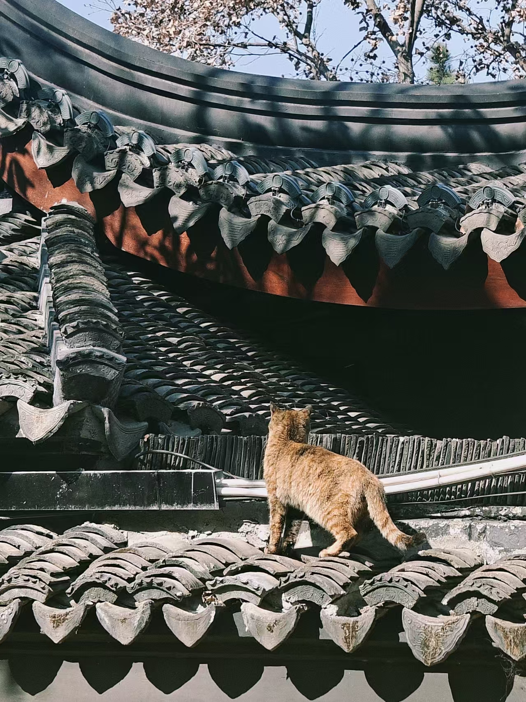
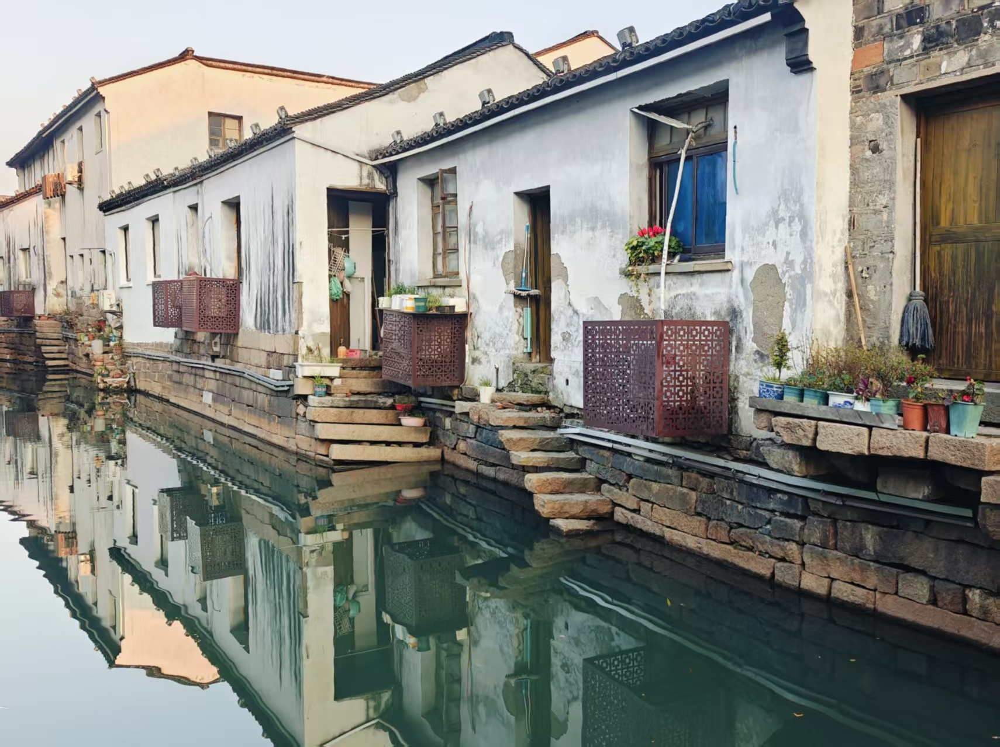
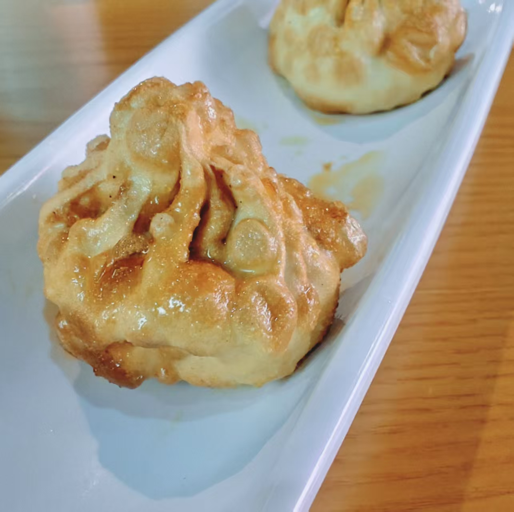
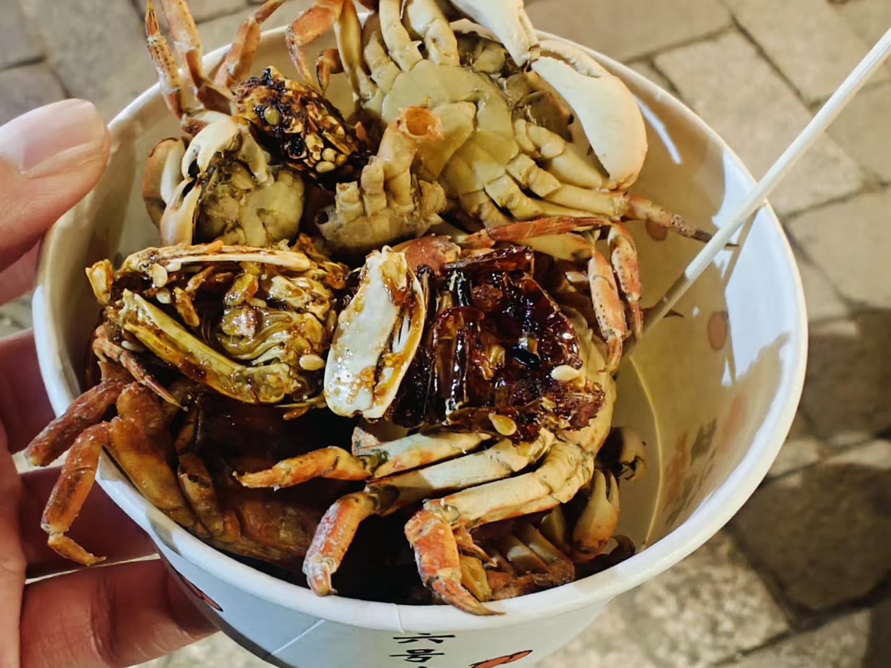
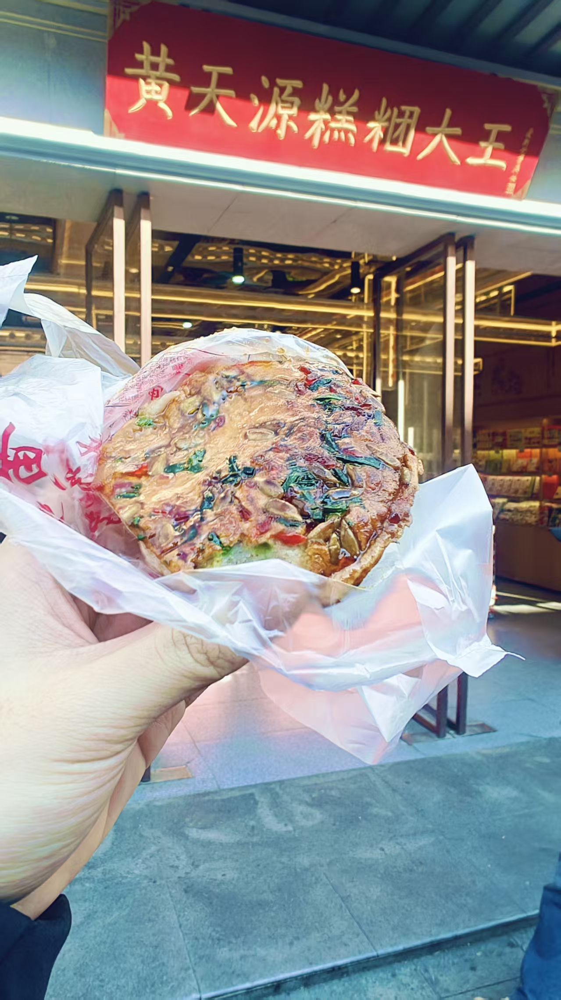
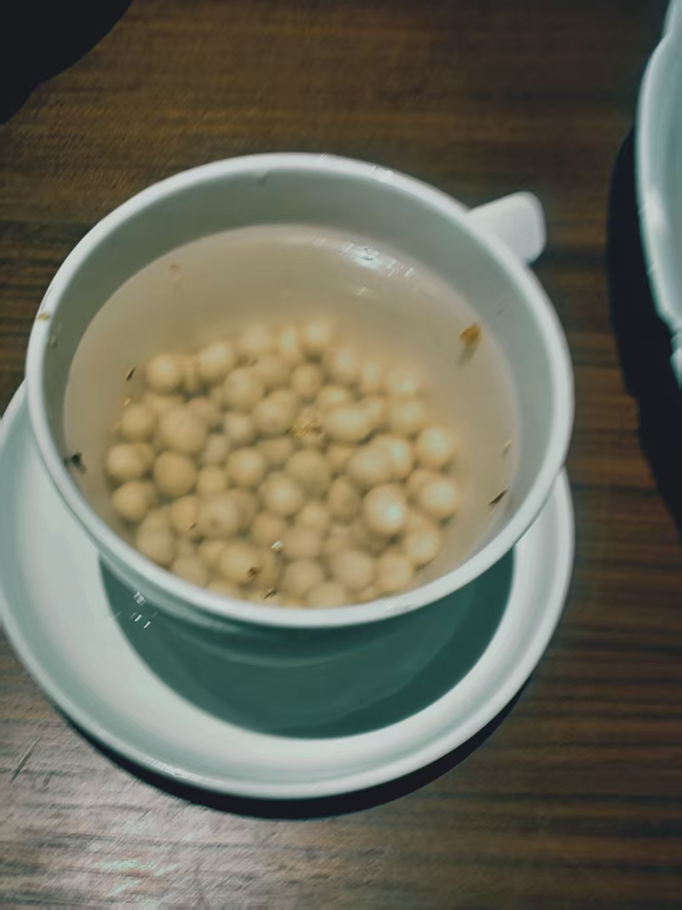
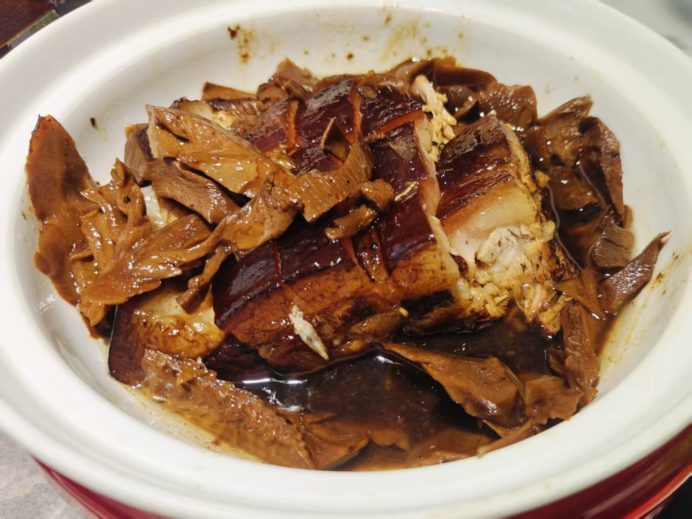
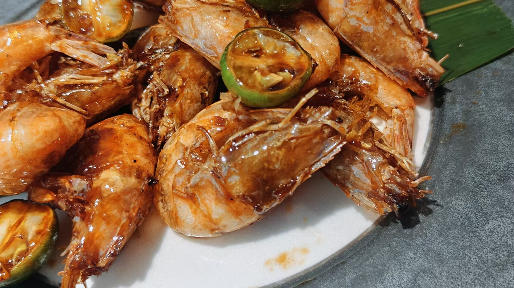

## 一、友情

> 莫愁前路无知己，天下谁人不识君。

我很少谈起朋友，真的很少谈起。或许在我的潜意识里，我一直都不是一个好朋友。我的意思是，我总是不断的挣扎，直到把所有人远远的推开。但是在偶然的相遇，和必然的分离之间，依然有一些值得称道的情谊。

酸了这么多，大概只是为了说一下，这次去苏州是和马博一起去的，然后体验非常不错。跟着马博去最大的好处就是，不用动脑子想去哪里，马博都规划好了。当然最大的缺点就是，我现在完全想不起来苏州我们玩过哪里了，真的是一点也记不住了。

---

## 二、观感

苏州是我见过最友善的城市，哇，简直跟扬州形成了非常鲜明的对比。

我们一路上见到的人，每一个人都非常喜气洋洋的，而且都非常热情，善于聊天。我和马博两个 I 人，从未主动找人攀谈，但是基本上每顿饭服务员都会与我们聊上两句，问问我们有没有去看什么演出，并给我们推荐一些要去的地方，或者直接非常大方地教我们怎么点菜才能更便宜。

而且他们的热情不带丝毫的虚伪或者造作，就感觉是完全发自肺腑的。可能是太习惯虚伪的社交礼仪了，我甚至都想戳破这种如梦似幻的真诚了。但是非常遗憾，我完全找不到任何破绽。

我遇到很多上海人，他们都提到他们会在苏州买房子，我觉得除了经济原因之外，可能这里如此热情真诚的民风有关吧。

除了民风的问题之外，我觉得这边和扬州类似，都是属于古建筑和现代风格交织，自然而且纯粹。而交通方面，虽然有地铁，但是还是有一些地铁覆盖不到的路程，而苏州的共享单车非常少（比较有特点的是，它们会上车牌），导致步行的时间有点长了。

最后，民宿房东姐姐确实**人美心善**！

---

## 三、景点

元旦假期我们没有订票，所以很多知名的景点都去不成了。但是众所周知，马博会找到真正的景点，或者说，马博现在去过的景点，在未来都会变成知名景点。马博是真正的时间刺客！

### 3.1观前街

到了那里之后，我们就直接去往观前街去逛了。观前街作为商业街，我觉得其实没有什么出奇的，不过这个壁画我确实很喜欢：

比较有特点是，一直有条河穿越其中，所以会显得非常水乡气质：

### 3.2 报恩寺

在逛完观前街之后，就已经很晚了，但是我和马博游兴未减，所以又沿着平江路走，逛到了报恩寺：

我们也没有进去看（早就关门了），不过报恩寺里的塔是真的很壮观，这可能跟周围没有其他高耸的建筑物有关，有一种独一无二的震撼感：

### 3.3 寒山寺 - 枫桥

我们第二天一早晨起来就去寒山寺了，但是看到 20 一位的票价，我们还是犹豫了，最终选择在寺院外面看猫猫：

枫桥就在寒山寺的后面，我觉得风景很好很有古诗的意境，只可惜假期人实在是太多了：

穷鬼只能遥遥眺望寒山寺：

### 3.4 西园寺

我们从寒山寺离开后，有往西园寺奔，只可惜去得太晚了，素斋的队排得很长：

我们只好逛了逛就出来了。我觉得西园寺作为寺庙景点来说，不如扬州的寺庙有趣庄严。

### 3.5 东方之门

我一直以为东方之门这种地标性建筑物，会建在苏州的市中心呢，没有想到它建在苏州的郊区，不过一出地铁口就感觉到非常的震撼：

当然晚上看也是别有风味：

其实我很好奇东方之门上面有什么，而实际上经过 web search，发现原来东方之门是一栋烂尾楼，高层完全没有被开发。我们按照小红书的介绍去到的最高楼层是 138 层，只可惜原本说的消防通道关闭了，而 138 层的唯一一家商户（理发店），不让我们照相。最后只在 35 层照一张相：

东方之门是我少见的看见苏州衰败一面的建筑。苏州给我的感觉一直是完美无暇的。

### 3.6 金鸡湖

在东方之门下面，就是金鸡湖，金鸡湖马博一直想坐水上公交，只可惜那天水上公交关停了。

小红书说，在日落的时候，从金鸡湖畔的大相框看过去，可以看到落日穿过东方之门。但是并没有，三点并不共线，所以“豆包，启动！”：

夜景的美丽，甚至超过了晚霞，让我和马博感慨，不应该在室内休息这么久的：

### 3.7 音乐喷泉

再次赞美马博，他居然知道金鸡湖只在节日举办的音乐喷泉。

音乐喷泉真的好好看呀：

### 3.8 火车站

谁家火车站临江而建啊，实在是太漂亮了：

这个江上的行船是真的可以乘坐啊，15 块钱就可以从火车站坐到山塘街：

### 3.9 山塘街

山塘街的商业化特征非常明显，我觉得不如观前街好。但是它附近的居民区倒是很自然：

---

## 四、美食

### 4.1 聚新春

我们是晚上到的，在酒店磨叽了一会儿，本来说去榜上有名的同德兴吃苏式面，结果这家店七点就打烊了，我们去问得时候，还以为没有开餐呢？结果店员跟我们说，她们这边是“早七晚七”，所以已经要收拾收拾下班了。

没有办法我们只好转向旁边的聚新春，看上去也是一家特色的苏式面馆。不过其实并没有那么好吃。

我点的是焖肉虾仁双拼面。焖肉就是那种非常肥的五花肉，而且有那种炖肉的平淡的感觉。瘦肉的部分确实烂糊，但是依然有种柴的感觉，而且不香。

虾仁按照店员的说法，都是她们大早上起来手工剥的河虾，说是苏州的河多虾才能好，到别的地方可都吃不上。我倒是觉得只是普通的虾仁罢了，给得倒是不少。

苏式面的面汤倒是受到了马博的好评，我也觉得不错，只不过没有那么惊艳罢了。

此外我们还尝试了他家的特色，紧酵馒头（名为“馒头”，是为“包子”）：

长得确实非常可口诱人，不过吃上去就跟河南的水煎包一样，是发面的，而且是甜口的，甚至汤汁里面还带着一股菜籽油的味道，我不是很喜欢。

### 4.2 观前街小吃

观前街上的苏式小吃还是很多样的，我和马博就感觉每一个甜品店都非常香甜。

我选了一个正在做活动的血糯米吃，这个名字真的深得我心。它的口味非常独特，上面是那种蛋香味儿非常足的，中间那层奶香味也很好，底下的糯米和红豆也非常的香甜，并且不腻（它是怎么做到把这三个这么甜的东西做到一起还不腻人的）。

煎小螃蟹也是这边的特色，我第一次吃，我觉得非常好吃，但是吃多了就会有一种嚼海盐石灰的感觉。店主说这些螃蟹也是从小河里面捞上来的，先煎后炒，只可惜我不能吃太辣的。

在观前街上有一家名叫“黄天源”的苏式点心店，是“聚新春”的服务员推荐的。它家真的是很合适的一家礼品店。下图是他家的海棠酥。在口感上跟面包差不多，但是长得真的好漂亮：

南京的卤货也很出名呀，而且真的非常好吃，卤汁都吸得饱饱的。

### 4.3 吴记味缘楼

这家专门做松鼠鳜鱼的，甚至门口立着一块牌子，上面记录着他们这一个季度一共卖出了多少条松鼠鳜鱼。

老板娘非常的人美心善，她跟我们说不要点那个 188 的鳜鱼，而是要点那个 128 的松鼠鲈鱼，口味都是一样的，还更便宜。

我在很多地方都吃过松鼠鳜鱼，但是无疑这一家做得是最好吃的。很多地方的鱼在炸过以后，就只剩下那种酥皮的味道了，甚至都有些发苦了。而这家的鱼在炸完后，表皮酥，中层有一种咸蛋黄芝士一样的粉状感，内层还是大块鱼肉的紧致和鲜美。再配上这个酸甜口的酱汁（并没有番茄酱的那种𫫇酸味道），简直就是完美！

### 4.4 马头巷

非常好的一家餐馆！非常有特色：

这个龙虾非常的香，哇，真的，这个红油调配的，是怎么做到，既有酒的清冽，又有麻油的刺激，又有虾黄的醇香。

这个饭比排骨好吃，有种黏糊的香味儿。

似乎苏州的鸡头米很好吃，我就尝了尝，我觉得跟莲子的口感很像，但是要比莲子更加的牙碜一些：

### 4.5 苏三姑

这家店的预制菜现象很明显，点完菜不到五分钟菜就上齐了。

稻草扎肉这个名字真的很好听。但是它就跟那个焖肉面的口感很相似，都非常的腻，而且没有味道：

这个柠檬虾很好吃呀，清爽甘洌：

