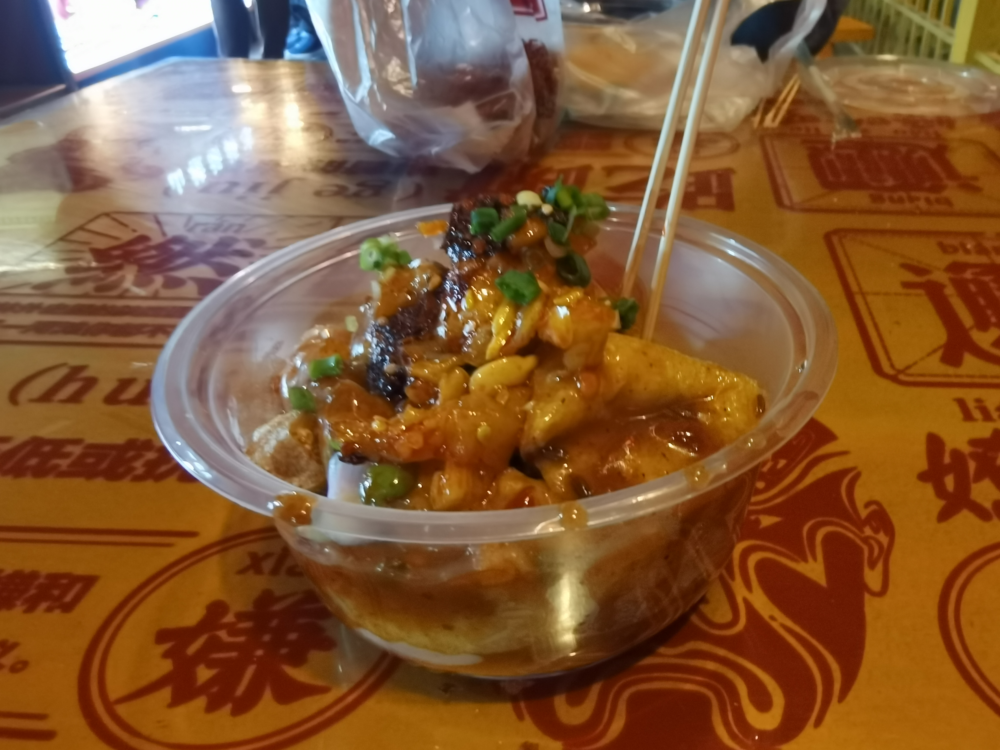

## 一、总论

十分让人成长的一次旅行，如果说上一次的南京让人觉得“旅行的意义是遇到意料之外的喜悦”，这次的西安则是“旅行的态度是昂扬向上的”。这次的旅行是匆忙的，我没有做很多的攻略，香老师也有一些积压的事情，导致我们在第一天的时候手忙脚乱的，但是可以骄傲地说，我们凭借着自己的勇气和智慧，让我们的旅途变得妙趣横生起来。或许这就是某种启示：“没有人可以确保意外不发生，但是人们却可以做到在意外发生后依然乐观生活，甚至浪漫诗意的生活”。

人生百年，白驹过隙，苦难和欢乐都是短暂的。我个人觉得，因为苦难而放弃追寻“新奇的体验”的想法，是不太可取的。苦中作乐或许才是正确的人生态度。

---

## 二、地理交通

十分的失败，做攻略的第一步其实就应该是找张地图，然后在上面标注出景点和地铁线，然后根据这些地点去安排宾馆和出行计划，但是显然我都没干。

这次我们游玩的地方主要集中于市区，也就是下面的图

可以看到景区主要分布在我用蓝色圈起的两个部分，靠北的圈以西安城墙为边界，主要的景点有西安城墙，靠西是洒金桥，中间是钟鼓楼，靠东是永宁坊。靠南的圈可以分为两个部分，靠西是小寨赛格商圈，是西安比较商业化，比较繁华的地方，靠东的可以理解成一条直线的步行街，其中最北部的是大雁塔和慈恩寺，中间是长安不夜城，南边是大唐芙蓉园。

在直观理解上，只要意识到各种很繁华的东西是有可能不在西安城墙内的，就可以避免以西安中心为旅游中心的错误。至于为啥大明宫，大雁塔还有商圈这类东西不在西安内城里，诚哥提出了一种解释：因为西安中心的地势低，所以夏天潮气重，冬天阴冷，所以并不宜居，相反城外的地势高，更加宜居。

很多人基于上图的观察，选择将宾馆挑选在两个景点圈之间，这主要有两处缺点：从图上看到，西安的地铁是比较稀疏的，如果没有办法恰好靠着地铁，那么需要走一定的距离才能到达地铁站，而西安旅游会有大量的“步行”特色，所以长时间的步行是十分乏味的；同时，西安的商业小吃做得并不是太好，如果住的离景点太近，就容易有每天吃塑料的感觉。

所以我更推荐在横贯南北的 4 号线或者 2 号线处选址。即使远离景点，也可以有很方便的交通体验。

---

## 三、美食

首先说我并不吃得太惯，因为西安的美食大多都是独立的，比如说 biangbiang 面就没法就着羊肉泡馍吃，也没人可以在吃完一个肉夹馍和一个菜夹馍后，再炫一碗擀面皮，而我的饮食习惯是尽可能一顿饭吃很多种类的东西，这就导致我十分不理解一个人可以一顿饭只吃一碗面，而且这碗面上甚至还没有十八种卤，只有一勺调料，就很难让我接受。

但是虽然我吃不惯，但是不得不说，是真的好吃，西安对与面食的烹调，可以说是登峰造极，三合一是一个味，biangbiang 面又是一个味，擀面皮又是一个味，饸烙面也是不同的味道，而且每一种都有一种独特的美，即便是加了相似的调料，但是味道也是完全不一样的，我只是觉得应当把钻研变化的心思放到菜而不是主食上，所以稍微有点不习惯。

西安食物的另一个缺点是纯正的小吃对游客（起码对我）并不是很友好，我是不喜欢吃景点的食物的，它们总有一股子塑料味，我想吃的是地地道道的西安美食，但是似乎是因为西安规划对于旅游事业投入了大量的资金，基本上我去的任何景区（洒金桥除外）全是没有烟火气的，全都是在一个个规规矩矩的门脸里，买着十块十五块这种景区标准的价格，而且吃起来十分的同质化情况严重，这种现象基本上给全都是，甚至是在离景区有一定距离的地方，依然可以看到那种“工业化，标准化”严重的摊位，相反，触目之处，没有一家的墙壁上有油烟，有人做菜的时候不带透明的口罩，这个地方真是让人失望啊。

但是洒金桥是绝对的美好，洒金桥大麦市街是真的烟火气，里面吃的很好，而且种类多还实惠，下面我会介绍。在这里的总论中，只是建议如果想要每天都吃上好吃的、“有锅气”的美食，我建议每顿饭都去洒金桥吃，绝对不会吃腻，也绝对不会后悔，这就要求选择宾馆的时候尽量靠近地铁线，因为洒金桥靠近地铁线。无论是二号线还是六号线的都可以，两者都可以直接进入洒金桥。

其实我一直期盼西安是因为一直看“小贝饿了”，结果到了西安发现她探的店都是在大学城（也就是更加南边）附近，在景区附近的几乎没有，但是考虑到地铁的便利性，乘地铁去吃饭也不是不可行。

其实西安也没有那么大毛病，只是带着香老师，我俩交集剩下的可以吃的东西，就没有多少了，所以吃得比较刁钻。

---

## 四、具体

### 4.1 洒金桥-大麦市

让我来歌颂这条街道，我一开始以为洒金桥是一个很短很短的美食街，就好像南京的夫子庙或者北京的南锣鼓巷一样，但是完全不一样，洒金桥的头部确实有一点商业街的味道，但是这个长度绝对不超过 20 米。

之后一股子浓厚的生活气息，而且还是西安特有的生活气息就会扑面而来，道路不再平整，铺面不再规律，取而代之的是一种“热气腾腾”，我知道在冬天说热气腾腾十分夸张，但是任谁看到回族打扮的小姑娘穿着套袖在路边卖“旋香旋香”的牛肉饼，生牛羊肉的摊子前挤满了揣着兜来置办年货的顾客，两轮车，三轮车，四轮车在吆喝的声音河流中争先强渡，又钻进羽绒服和塑料布形成的坞口，都会感觉到一股子暖腾腾的热乎气儿。

当你身边划过红柳羊肉串、肉丸胡辣汤、擀面皮、油泼面、牛肉饼、马记小炒泡馍、香酥牛肉丸、小酥肉、甑糕、镜糕之后，你就进入了一个更加神奇的地方，这就是大麦市。我来过西安三次，只有两次让我感受到“这个城市真牛逼，这才叫长安”，一次是我去小雁塔，想到这个塔就是一个僧人一辈子工作的地方，它为了弘扬佛法，在一个小小的地方呆了一辈子（和尚的青春也是青春啊）。还有一次就是看到大麦市街，这里大概是这个样子的

很难想象这个地方是西安，陕西的省会，这个地方简直比农村的大集还要热闹。当然了，如果仅仅是农村的大集，也不至于让我如此的吃惊，从图上可以看到，这一条街，基本上都是商铺，而非大集的撂地摊，也就是说，这个热闹的地方，是可以支持商品街级别的消费的，而这里严格意义上说，游客已经很少了（被嘈杂的人声和四处乱窜的三轮劝退了），这里的生命力，就好像那种千年的榕树，看上去已经全身是死皮，但是只要你仔细观瞧，看到它翠绿的叶子，就会震惊于其磅礴的生机。

除此之外，这个地方简直就是规规矩矩的西安里的一个异类，西安即使是在高原之上，也是尽力将路修的又正又平又宽，这似乎是都城的骄傲，就好像我们的出租车司机大姐，指着一个 6 车道的路抱怨这个路真的是太窄了一样，把路修好似乎是西安人的骄傲。但是这里是不同的，我从来没有看过这么“曲折”的道路，就好像盆景里的树枝一样，又宽又窄，还遒劲有力，甚至感觉在拐弯的时候都需要憋一口气一样。不只是路，这类的建筑也是，简直就是踩扁的肥皂盒一样，各种形状的都有，而且真的是有人在这里面生活的。

我一直很喜欢“都城景象”，看到这一幕我也在想我到底喜欢“都城”的什么？我似乎是爱的并不是整整齐齐的街道，万国来朝的威仪，天子脚下的自豪，我只是很喜欢那种流动的生命感，而这里，无疑是我理想的最好实例。另外香老师也很喜欢这里，香老师的人生理想是住在这里卖炒酸奶。

我们吃的东西还挺多的（因为来了两次），第一次的时候我先吃了“肉夹馍+擀面皮”，主要是太眼花缭乱了，想留着肚子多吃一些小吃。肉夹馍感觉并没有很惊艳，就普通肉夹馍的味道，其实我感觉我可能更喜欢吃我家门口卖的。

擀面皮十分好吃，面皮筋道弹牙、爽滑面香，在具有面筋的口感的同时，不至于像面筋一样吸满料汁以至于失去本味。我们一开始怕辣所以点的是不要辣的，上来后发现非常好吃，擀面皮拌着老豆腐、葱花、豆芽、芹菜等辅料，增加了口感多样性的同时，也为面皮增加了一股蔬香，料汁也没有因为缺少辣子而逊色分毫，料汁酸咸得当，不会有过酸或者过咸的情况，而且还有很浓的蒜香味，这是真的，就是几乎所有的味道都是为了“香味”服务的，不会有其他味道过于突出，以至于破坏了食物的香味。之后我们为了体验更加“本质”的擀面皮，又加了一些辣子，可以说对于我这个不能吃辣的人是十分友好的，并不是很辣，但是超级香，强推：

香老师吃的是凉拌饸烙，就可以吃辣的了，我尝了一口，也是十分好吃，而且饸烙本身的荞麦味很香，只是在筋道程度上略有下降，口感偏硬，这是饸烙压制的制作方式导致的：

然后我们还吃了炒酸奶，口感有一些冰，很好吃，另外解锁了香老师最想从事的工作——炒酸奶。

其次我还来了一碗肉丸胡辣汤，暖呼呼的，肉丸兼具了筋道和肉香，和我吃过的所有丸子的口感都不同：

我们还买了甑糕和桂花糕，都是糯米口感，挺好吃的，一共是 10 块钱

### 4.2 安定门

本来中午逛完洒金桥后，我们是打算回宾馆休息一会儿的，但是发现西边有一个好大好大的城楼，所以我们就想过去看看，结果去了才知道原来是西安城墙的西大门，所以我们就上去去玩了。

其实这个决定挺仓促的，因为古代习惯“坐北朝南”，所以南侧的城门“永定门”更加豪迈，加上东侧的城门可以去永兴坊吃小吃，所以一般的游览顺序都是从南城门上城墙，从东城门下。但是谁让洒金桥附近是西城门呢，所以我们是从西城门上的城墙，感觉虽然可能不如南门繁华，但是已经很宏伟了，我登上去的第一句话就是“西风残照，汉家陵阙”，这么说是有道理的，因为再往西就是霸陵了（这里被诚哥指正了，霸陵是在东边，我之所以犯这个错误是因为我看的某一张地图是上边是南边，所以定位错了，太愚蠢了），虽然从城墙往外看只能看到护城河，但是已经很满足了，因为当真是“雄关”啊。

可以看到不但墙体厚，而且是那种“夹心式”的设计，另外补充一下，从西面才可以看到夕阳啊，什么是“残阳熔乡关”啊。

### 4.3 城墙上

因为墙体很厚，所以城墙上是十分宽敞的，加上城墙确实很长，所以租一个自行车就成了良好的选择，我和香老师租了一个双人的自行车，是 90 块钱，单人自行车是 45 块钱，我觉得如果不是为了情侣间的亲密关系，大可以租两个单人的，因为双人自行车前座离车把很远，而后座离脚蹬子很近，很难伸开腿，如图所示

在城墙骑车的时候真的是感受到了西安政府在旅游上的财政投入，从城墙向内看，沿途所有的楼房，都是那种特别漂亮的房檐，emmmm，感觉有点用力过猛了。

不过城墙是真的好看

### 4.4 灯会

我是在租车的时候才知道南门那里会有灯会，但是因为我们下午到的，但是灯会需要到晚上才有，所以只能在星巴克等天黑（甚至香老师还要学习，这个人太坏了），城墙的门票是一个时间段（最多到六点）的，我们当时问人家，人家说是可以在规定时间内随意的上下城墙，但是 app 上就显示只能使用一次门票，所以我到最后也没有搞清楚机制，不过感觉西安景点的服务人员都好好，所以我们五点半的时候到达，他们直接给我们放行了。

我们一直在等城墙里的那只兔子亮，结果一直没有等到，生气。

灯会是办在城墙上的，全景大概是这样（一半）

灯会真的是，太震撼了，真的是，以后我心中的“大唐夜景”有了具体的指代对象，真的，比想象得甚至还好，根本不会腻，香老师给我总结是“就喜欢这种花花绿绿的东西”。

最后我们从灯会结束后的某个城门下来，拍到了我认为这次来西安最美的景色

### 4.5 永兴坊

在下了城楼后，本来打算叫个外卖的，但是奈何我和香老师游兴正浓，所以又租了个车去永兴坊，永兴坊是个小吃街，所以也比较商业化，所以看到景点设置还是比较适合拍照的：

里面也就那种，比较的塑料的古街道，我不是太感兴趣，但是其实相比于其他地方的商业街，这里已经很好了，起码风格是统一的，而且各种细节处也可以看到是十分用心的，比如说我很喜欢它的桌子上都画着很漂亮的习俗年画：

然后里面有比较网红的“摔碗酒”，大概就是这样了：

这里的吃的虽然有些小贵，但是还是在可接受的范围内，一般都是 10 块钱一份，味道绝对不难吃，但是也不太给人惊艳之感（不如洒金桥）：

我们吃了小酥肉，感觉就和鸡柳一个味道

还有鸡汁豆腐，感觉没有南京的好吃，就只是普通的咸鲜口，而且豆腐还有一点糟：

我们的主食是擀米皮，我第一次吃，可能由于是黑米的缘故，所以总觉得有一股芝麻的糊味，米皮要比面皮更加粘稠弹压，更加难咬断，吃下去会有一种糊嗓子的感觉，而且感觉油加多了，有一些腻，香老师和我都吃出了鸡汤的味道，但是问服务人员说没有加鸡汤，那可能就是鸡粉之类的加多了

### 4.6 小寨赛格

就是个商业中心，也没啥可说的，跟石家庄万达差不多，感觉十分的同质化。可能如果在西安生活，会很喜欢这里。

### 4.7 西安美术馆

我吹爆！！！西安美术馆在长安不夜城的街头（长安不夜城可以看成一条商业步行街，比较的好看），占地面积并不大，所以里面只有四个展，但是真的每一个展都相当的戳我心巴。

第一个展是《十面埋伏》和《英雄》的特展，真的，我就纯纯手办迷，整个一个桃花眼，逛得时候幸福死了，我真的看到牡丹台了

藏经阁也有展示，虽然很塑料，但是真的感觉和电影中的场景好像：

而且看到电影名场面，都是在分镜中设计好的，真的浑身激灵一下（国师画工是真的可以）：

然后我要强推的就是就是年味展，里面有一个是社火泥塑展，哇塞，真的是绝了，可以看到做工十分的细致，而且身体结构比例是正确的的

同时是充满趣味性的，充满动感的，比如说下面这幅图，看似是一家人在磕头，但是仔细观察发现，后面的两个小孩儿已经对无聊的仪式感到不耐烦了，开始打闹起来了

然后最大的一个展品就是一整个的社火游行图，是真的太漂亮了，人杂多而且不显得繁乱，虽然是静态的泥人，但是可以明显感到流动的热情，就好像《清明上河图》一样：

这是头部的旗队：

这是中间的高跷表演：

这是大鼓表演

这是观众：

比较遗憾的是，没有照相街道的内部，里面有杀猪的、吃饭的、喂牛的、打牌的，同样栩栩如生、妙趣横生。

二楼有一个小展是青年艺术家李蕾的展览，用红绳捆绑镜子材质的姓氏悬吊于天花板下，姓氏形状和捆绑方式都很有意思。突然觉得美术馆似乎是一个比博物馆更佳的打卡地点。

当然最大的展是邵泳的水墨心相展，只能说太震撼了，所以没有拍照片：

我是这么理解这个事情的，

- 这次的主题是“新水墨”，水墨不等同于中国画，也不等同于用毛笔画画，它是一种颜料，其特点是极易晕染，和其他水墨相重叠。
- 水墨的精髓或许不是像水墨，而是有意境。
- 意境就是画家构建的，虚假又真实的一种环境。
- 为了让观众身临其境，邵泳的一些画的篇幅很大，甚至有六米以上。
- 虚假来自于在原有的三维平面上构建一个“复三维空间”，利用的是光的“错误”透视。
- 真实来自于虚实关系的巧妙把握，引导观众注意真实的地方，忽略一些虚假的地方。
- 邵泳的画是需要凝视的。
- 五色真的好好看。
- 好多材料都可以用来作画，感觉他的画作十分的“立体”，疙疙瘩瘩的。
- 粉色的竹子绝了。
- 我不太懂佛教，但是深蓝色和深红色真的太有佛气了。

### 4.8 大雁塔

也是属于商业化比较严重的地方，感觉没有小雁塔更加纯粹。

我走了两次大雁塔，一次是经过它去地铁，一次是匆忙去买东西，要是我还小，我可能不会驻足，也不会欣赏，但是我这一次，尽管匆忙，但是依然让我的眼睛享受了一下风景。事实证明是对的，因为我们确实没有时间去细致的逛了，而且在这短短的游玩中，我们见到了当时给我们种草的“诗树”：

也看到了夜色和喧嚣中的大雁塔：

买了好吃的蛋筒镜糕，呜呜，香老师都给吃了

而且还收获了我觉得香老师目前为止最漂亮的一张照片（奥对，我还和香老师一起和卖花灯的商贩讨价还价了，超有趣）

---

## 五、行程安排

- Day0：香老师看量子计算
- Day1：上午和香老师参加冯如杯组会，中午洒金桥，下午城墙，然后香老师看量子计算，我们等到晚上游灯会，最后去永兴坊吃晚饭。
- Day2：我去西安美术馆，香老师看量子计算，我们一起逛大雁塔。
- Day3：阿巴阿巴阿巴
