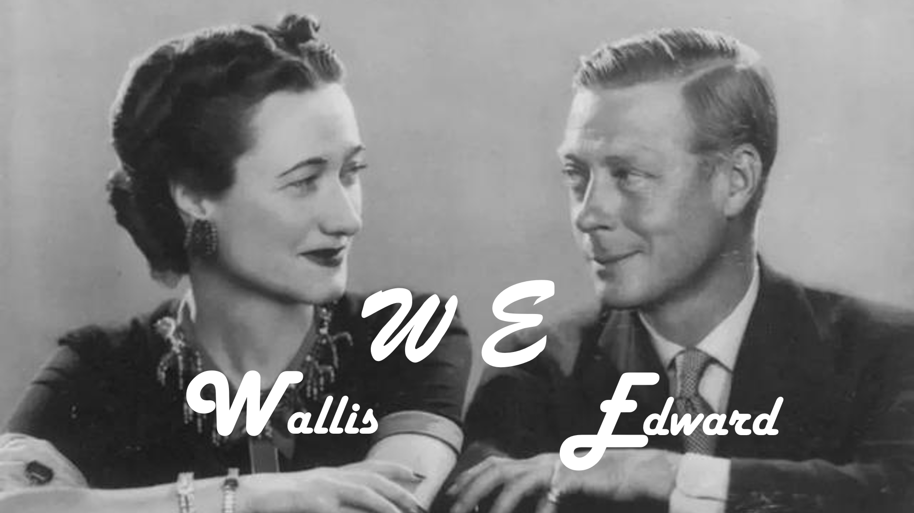

Just like the picture on this PowerPoint, today we are going to tell a romantic love story, the main characters of the story are Wallis (that is, the lady on the left side of the picture) and Edward (that is, the gentleman on the right side of the picture). Interestingly, even their initials together are the romantic "WE". But believe me, their story is far more legendary than the coincidence of names.

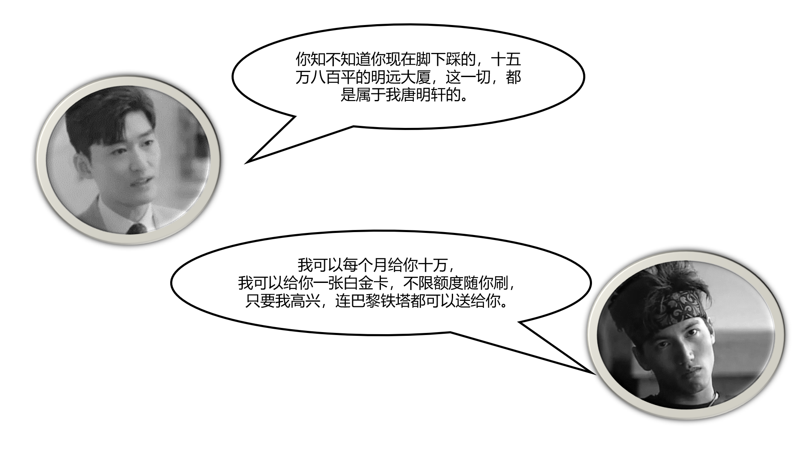

I believe that we have more or less seen Qiong Yao's novels or idol dramas, in which the heroes are very outstanding, they can give more than 100,000 dollars of money to the girl of their choice.They often talk about sending the Eiffel Tower and large square feet of the building.

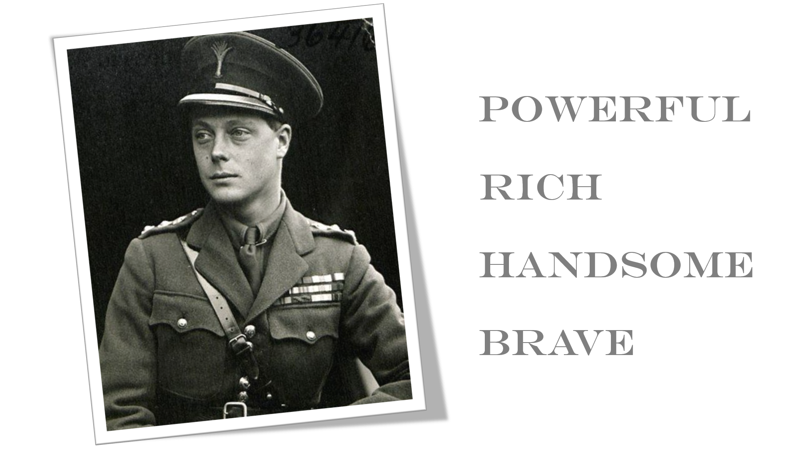

But the above people are nothing compared toEdward we are talking about today.

Edward can't give away the Eiffel Tower, but he can take Wallis to dinner with the British Prime Minister, the King of England, the future King of England and another future King of England. He could give away a fur worth a thousand ponds. Edward can give Wallis the whole Britain. And it must be mentioned that Edward was not only a brave pioneer in the battlefield, but also handsome.

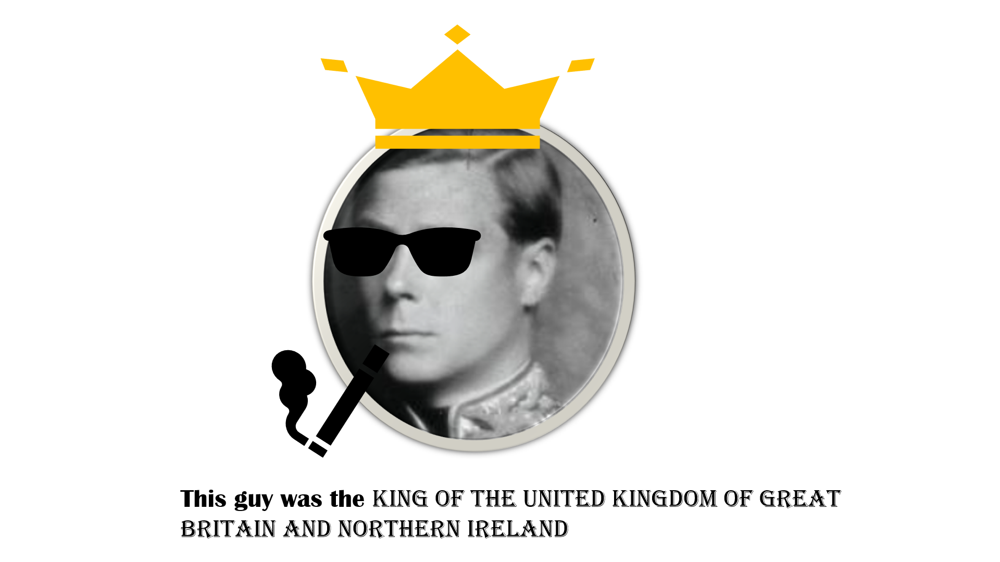

I'm sure everyone listening this will have questions, why is Edward so powerful? This is because he is the Prince of England, that is, the future king of the British Empire. The answer is both simple and effective.

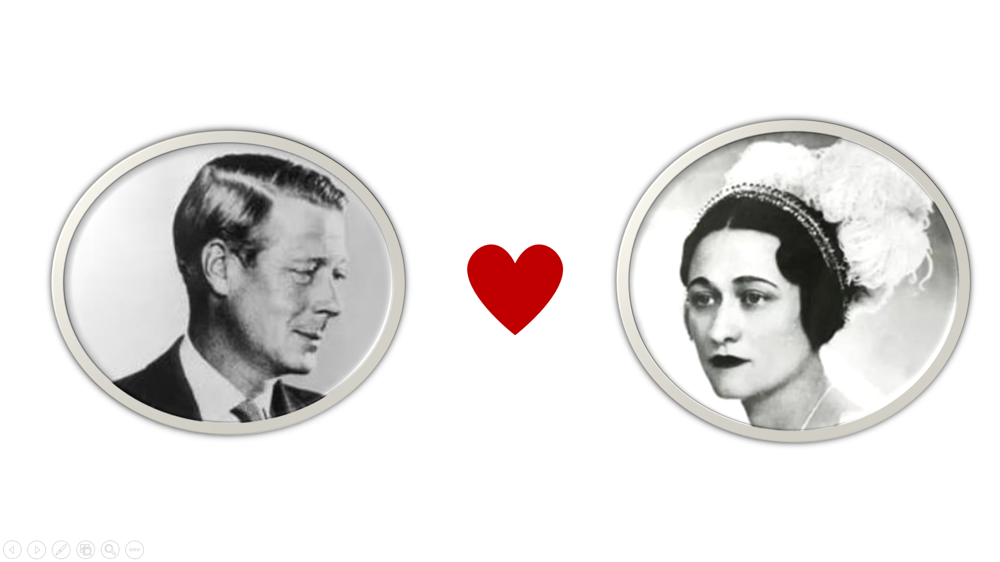

When we listened to fairy tales as kids, we were always talking about the prince falling in love with the princess. I didn't think that this kind of thing would really happen. The handsome prince Edward fell in love with the beautiful and kind Wallis, and it can be called the light of the ideal shining into the corner of reality.

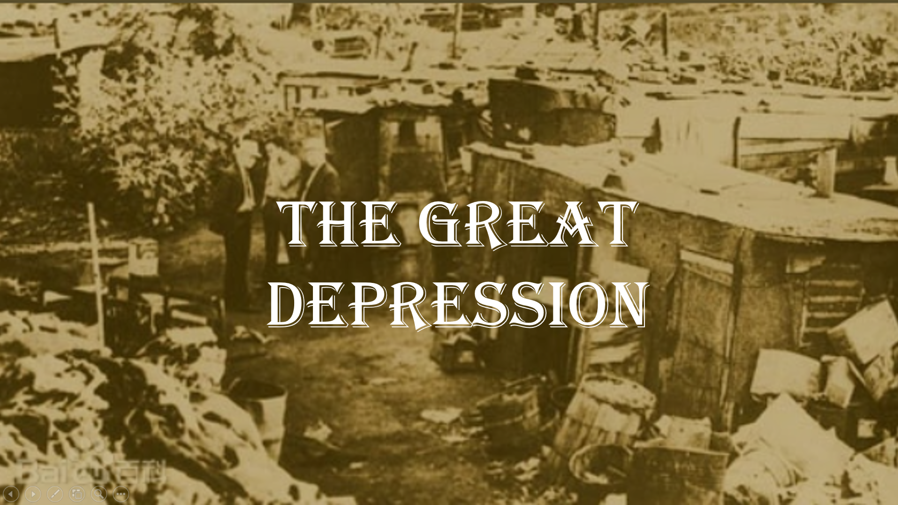

But if things were really that simple, then there would be no need for us to discuss them. Unfortunately, their love took place on the eve of the Second World War. As we all know, one of the major causes of the Second World War was the Great Depression.

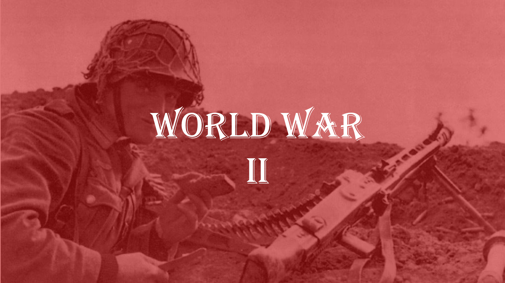

We all know that whether in times of economic crisis or in times of war, rallying people and boosting morale is always a very important aspect.

The King of England is not only the leader of the British people, but also the leader of the entire Sunset Empire. It can be said that the role he played was a matter of life and death for a large part of humanity. The synonym for king is responsibility.

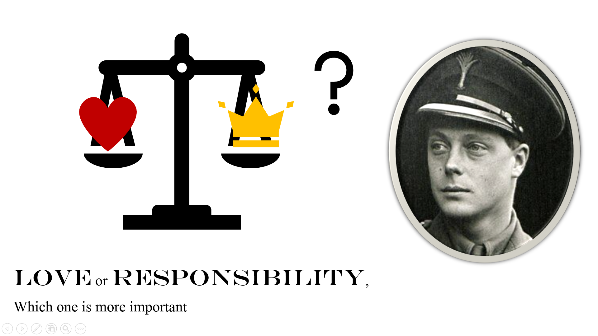

Tragically, Wallis was not accepted by the British royal family (in a way, not by the English), and they would not allow Edward to marry Wallis as king. So Edward gave up his throne in order to marry Wallis.

One of the two reasons why Wallis was not accepted was that she was a third marriage, she had two husbands before Edward. British society at the time did not discriminate against second marriages, but the king could not, because one could not say in the street, I slept with the king's wife. This would certainly be degrading to the nation. The second reason was that Wallis was a Nazi sympathizer and was even suspected of being a German spy, a person who obviously could not marry into the British royal family.

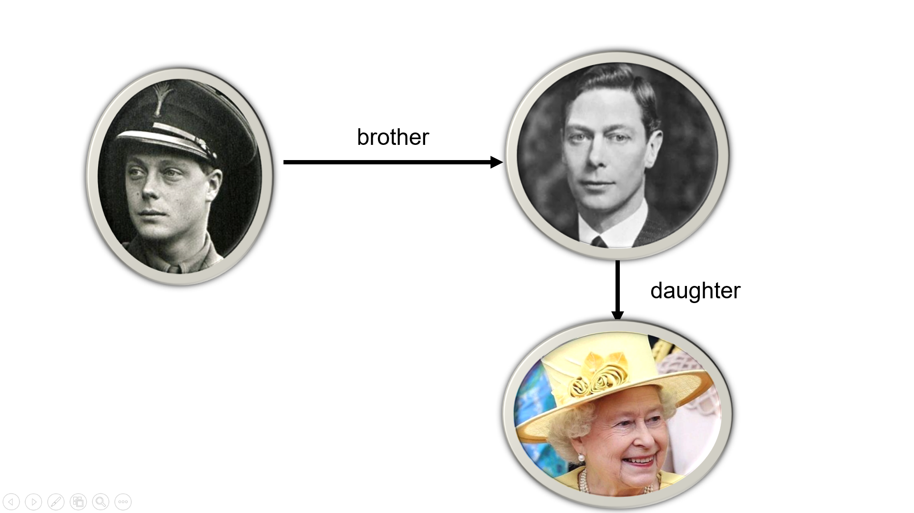

That's the end of this story, Edward VIII, who reigned for less than a year. His younger brother took over the mess left by his brother and led the British people to victory in World War II. His niece, who we know today as Elizabeth II, is the current Queen of England.

The story is told. Let's talk about what the King of England really means. I always thought that the King of England was a puppet and that the real power belonged to the Cabinet. But in reality the king and the cabinet are more like a partnership. The cabinet is responsible for the government, and the king is responsible for uniting the people. So the King of England has a lot of power. 

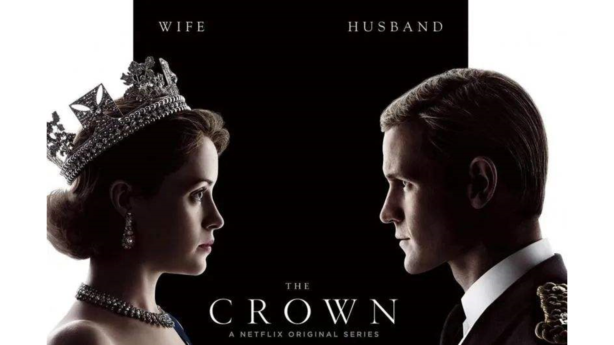

In other words, the crown can be called a cage, which restricts the freedom of the king. But we also need to realize that the king is provided for by the people, and he has a responsibility to his people. From the point of view of a reasonable person, this act of Edward could be considered a very irresponsible act, and he failed his people.

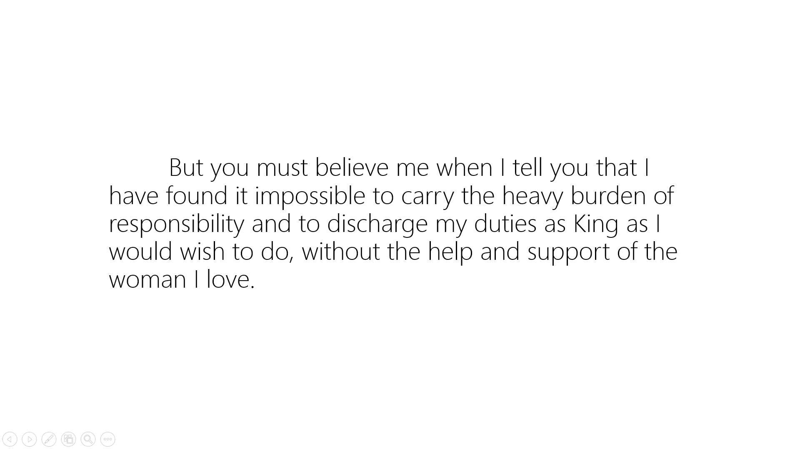

At Edward's abdication speech, he said the above passage. Please allow me to read it.

Some say that Wallis fell in love with Edward only for the riches of the King of England, while others say that Edward abdicated because of the childishness of his nature. My reason tells me that they are right. But I still want to believe that Wallis was a woman worthy of love, and Edward gave up the throne for his lady. 

There are many things happening in this world every day, and more people will analyze and criticize these things. In the face of big events, people speak of morality, ideals, and measure interests, but no one starts with love. 

But I think that perhaps a place should be kept for love in history, for no reason other than that it is love.
