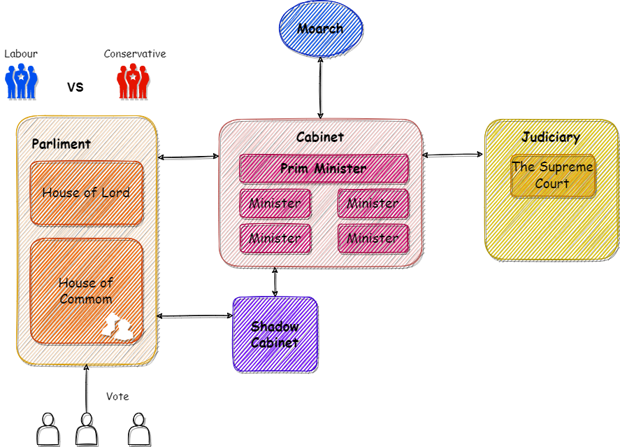

# Civil Service in Britain

## Sketch of System of Government	

The political system of Britain is constitutional monarchy, which has two main characteristics, namely "parliamentary sovereignty" and "separation of powers".

"Parlimentary sovereignty" means that parliamentary has absolute and ultimate power within the British system. Parliament can pass, repal and alter any of Britain's laws.

The principle of dividing the functions of government is known as "the separation of powers". And the principle behind it is to ensure that there is no excessive use of abuse of power by any small group people.

Based on the above two principles, we can better understand the British political structure, as shown in the following figure:

As can be seen from the above figure, the leader of the country is the king or queen. The people elect members of Parliament(MP) through elections. MP exercise democratic power in parliament on behalf of the voters. The dominant party in the parliament will form a cabinet to handle state affairs, while the opposition parties will form a shadow cabinet to criticize and supervise the cabinet. The judicial system is not affected by elections.

It can be seen that such a system fully implements the above two principles.

## Civil Service

We found that there is no organization responsible for the implementation of specific government affairs in the above figure. This is because I didn't draw it on the diagram. This is civil service, which is the focus of today's introduction.

Civil servants are officials who serve the elected political government of the day. They themselves are not elected. They are career officials who remain in office despite changes in goverment.

Although the civil service does not seem to attract as much attention as the cabinet and Parliament. But it is undeniable that the civil service system has a great influence on politics. On the one hand, because the civil service system is the executor of the decree, it can greatly affect the effect of the decree. On the other hand, the civil service system has a long term of office, is not directly controlled by parliament, and its number is far more than that of politicians, which makes it very strong in the political game. As the famous saying in "Yes, Prime Minister"

>**Bernard**: But surely the citizens of a democracy have a right to know.
>
>**Sir Humphrey Appleby**: No. They have a right to be ignorant. Knowledge only means complicity in guilt; ignorance has a certain dignity.
