## 一、Kuromi & Melody

Kuromi 是 AJ 送我的第一个礼物，好像是在五道口地下一层买的，当时我们好像还没有正式确立关系，在回去之前，她走进商店买了 Kuromi，然后挂在了我书包的后面。后面很多的日子里我背上书包，都感觉似乎有一只手在牵着我。

Melody 是后来我送给 AJ 的，琢磨着可以凑一对。

嗷对了，AJ 还不相信我能把挂着玩偶的链子解开后再挂到书包上去。

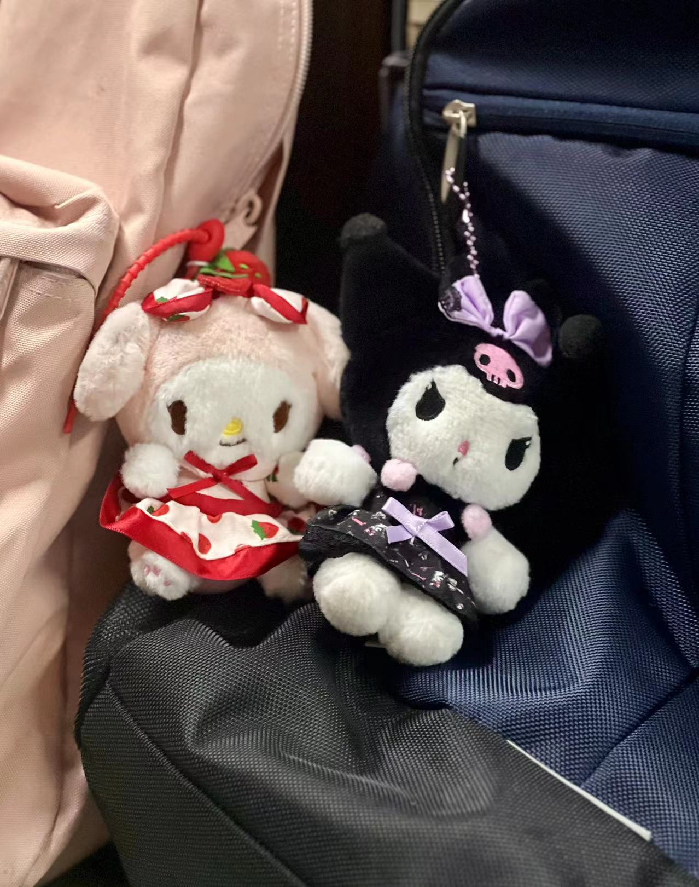

我电脑充电器上也有 Kuromi & Melody 的贴纸，也是 AJ 贴上去的。

## 二、200 Days

这是保存在 AJ 手机的一个恋爱计时软件，不过这似乎是我唯一一次见到它。好像 100day 的时候我俩都忘了啥时候开始的了。

后来好像 300day 的时候关系就有些恶化了，好像就没有再一起过过了。

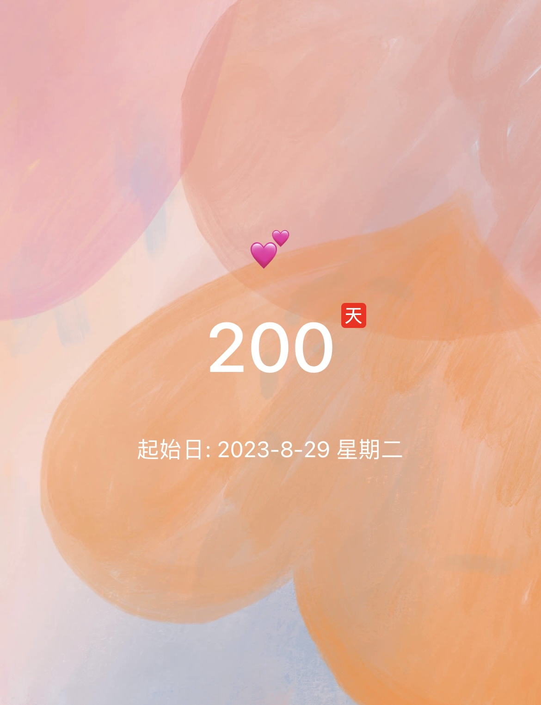

我倒是在 org-mode 中设置了一个 org-habit 来提醒，经常在某些时间点出现在 org-agenda 的第一行。写完这篇文章，我去把它彻底关上。

## 三、Tux

AJ 的生日礼物，小企鹅，本来想送只小鸭子的，但是找半天也没有找到。

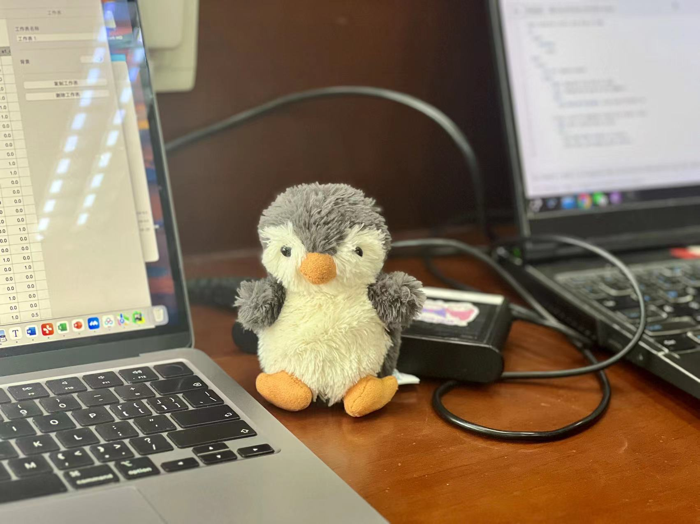

其实我也不知道送些什么合适，其实我不觉得这个礼物很能代表我的心意。我在害怕。

后来这只企鹅被 AJ 放在考研的那个桌斗里，时不时会拿出来。

## 四、地坛

和 AJ 吃到了心心念念的打卤面，在雍和宫附近的“锅儿挑”吃得。不过有一说一只是普通的一碗面条，并没有想象中的好吃。不过他家的老豆腐超级好吃，豆腐紧致，豆香浓郁，蘸着调好的酱油醋非常鲜：

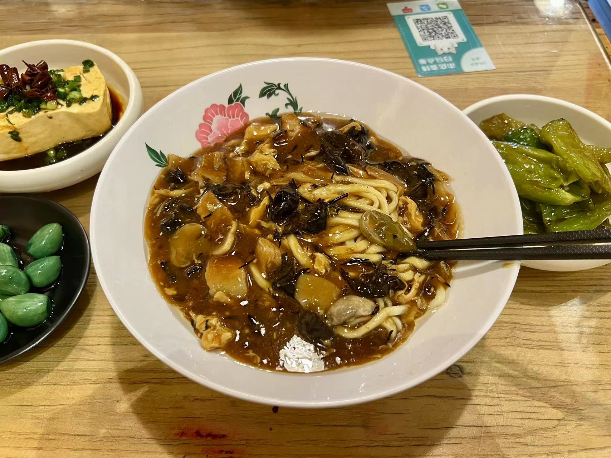

这面确实不如我姥姥家里面做得好吃，店主人谱子还大，AJ 只是吐槽了几句，我念着 AJ 没有直接拂袖而去，也没有很生气。

不知道为什么，似乎我心里的“北京”在有 AJ 在场的时候总是很丢脸。

在地坛边上吃了三元梅园的豆沙奶卷，第一口觉的有些淡，但是后面混合甜甜的豆沙吃非常好吃：

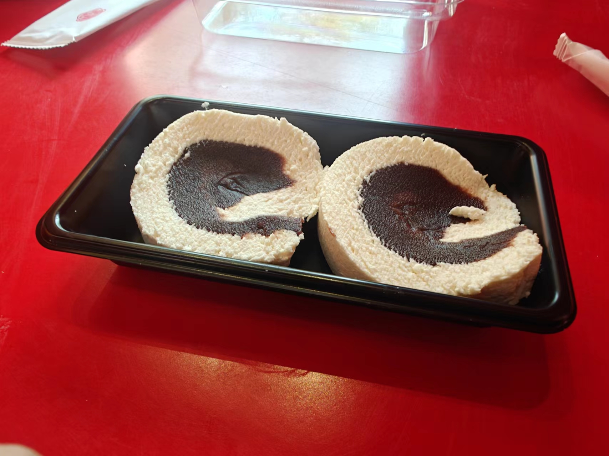

这个豆沙现在想起来实在是太好吃了，惹得我直流哈喇子。哦对了我想起来当时 AJ 吃得时候两只腿摆来摆去的，我当时一直在想为什么不是在地坛那里摆。

去了史铁生提到的地坛，在那个台子上坐了很久：

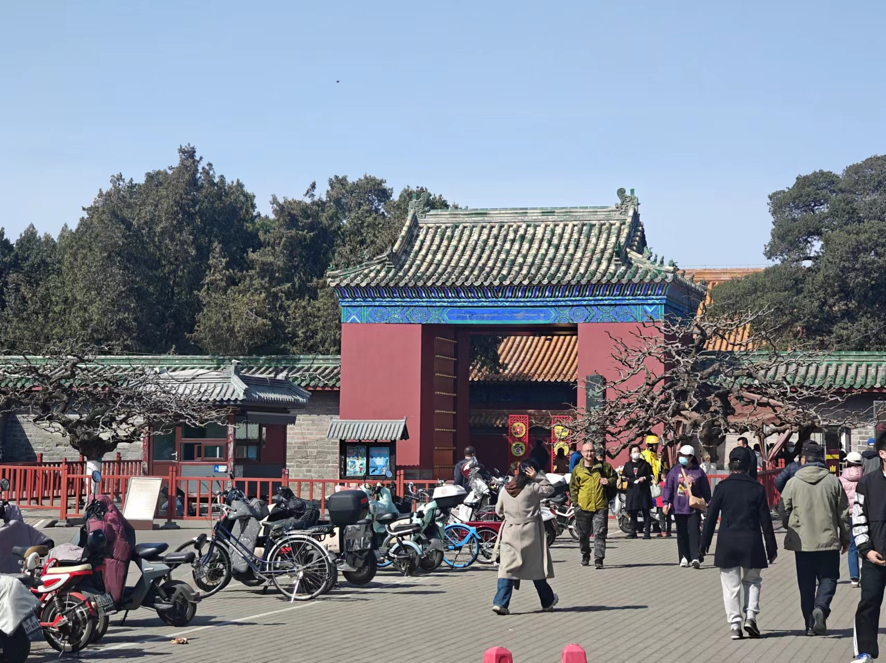

那段时间我因为学习的事情一直心情不好，现在回看，似乎心情一直没有再好起来过。

## 四、Free Gundam

情人节 AJ 送的强袭自由，我还记得我小时候玩 SD 的时候，觉得它们的头都好大，现在玩起来感觉头也不是那么大，可能是手大了的缘故吧。

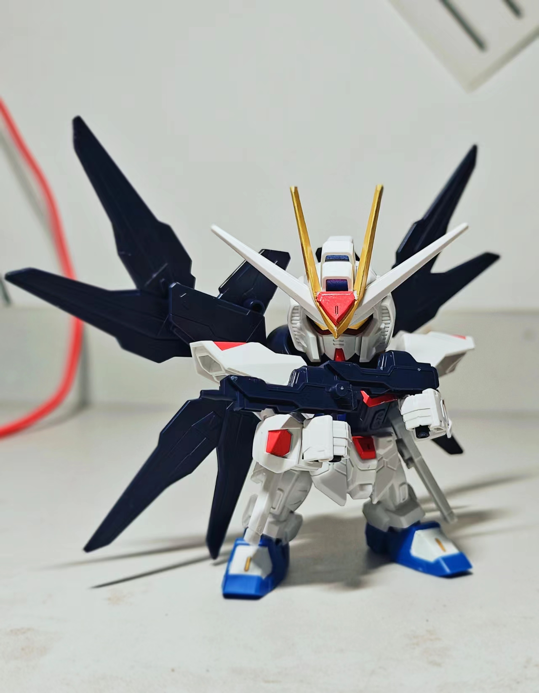

其实当时我最担心的是她买成了 MGSD，那个好贵的。

所以人是没有办法走进对方的内心的，你跟别人形容你是怎么样的，别人就会把你当成什么样子。

（上面这句话就是我在放屁，AJ 最后真的送了我一个 MGSD 的巴巴托斯，我最喜欢的模型）所以人还是有办法走进对方的内心的，只需要许多许多的努力和坚持。

## 五、安妮意大利餐厅

AJ 选得餐厅总是很好吃。我总觉得无论饭菜如何好吃或者难吃，都会过去的，最关键的是要把当时的味道和情感记录下来。但是我当时在写文章的时候，却总有一种落寞之感，我突然觉得我的文字不过是一个酸儒的矫饰，我无法让感情变得更加真挚，也无法让食物变得更加美味。

超级好吃的意餐（我甚至对着这张照片调了很久，因为果子的颜色被光掩盖了）：

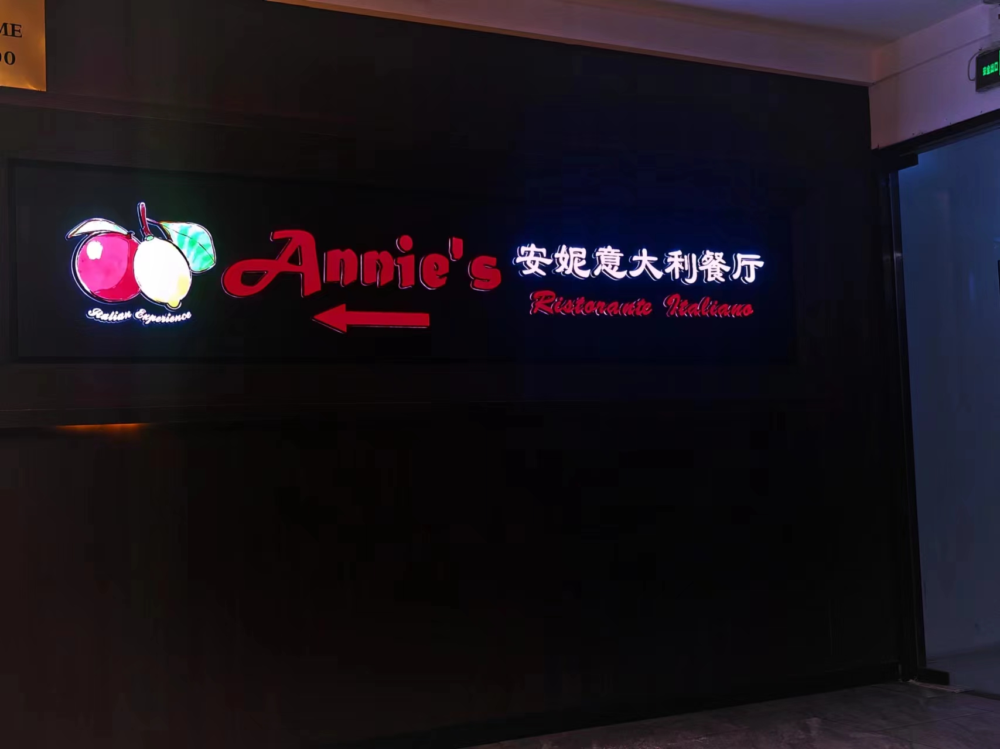

最好吃的是它的蜜瓜火腿，薄火腿片裹着哈密瓜，是一种非常创新的吃法。火腿的咸鲜渗透到哈密瓜瓤的甜蜜中，火腿的果木香与哈密瓜的果气儿缠绵，火腿的绵密和哈密瓜的脆爽交织，给味蕾留下了非常惊艳的记忆。

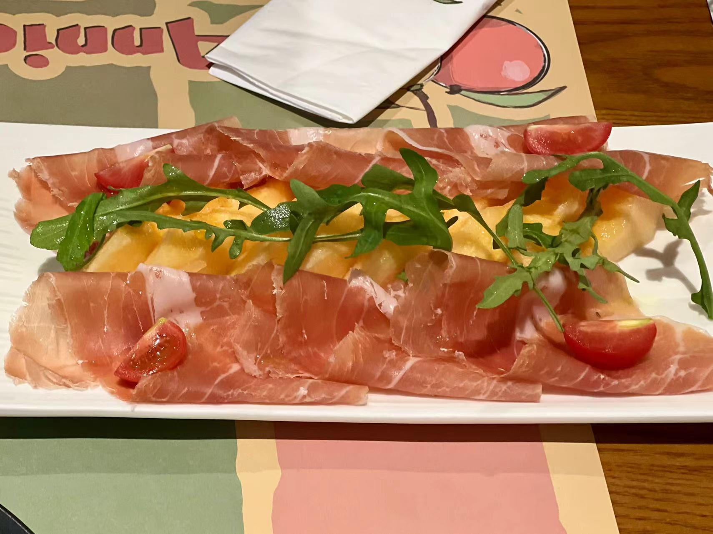

我第一次见火腿还是在《鹿鼎记》中，韦小宝用云南宣威火腿调戏小郡主的情节，配合上太监的旁白，就感觉非常好吃。虽然故事里是煮火腿，我们吃得是生火腿，但是其中意趣，也未必没有异曲同工的地方。

> 韦小宝用筷子挟了一片鲜红喷香的宣威火腿，凑到小郡主口边，笑道：
>
> “张开嘴来！”
>
> 小郡主牙齿咬实，紧紧闭嘴。
>
> 韦小宝将火腿在她嘴唇上擦来擦去，擦得满嘴是油……
>
> 小太监又送饭菜过来，道：
>
> “桂公公，这宣威火腿是用蜜饯莲子煮的，煮得急了，或许不很软，请公公包涵。”

与火腿相比，吃千层面主要是图个新鲜，很好奇加菲猫最爱吃的食物是什么样子的。千层面和千层饼并不像，实际上一层肉酱一层面饼，大概有个三四层，上面在铺一层芝士：

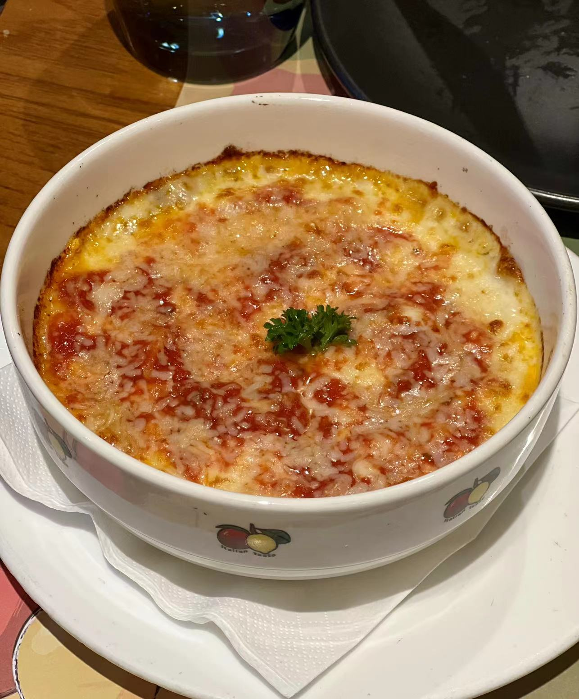

我们还点了一个海鲜米饭，里面的虾和蛏子处理得很好，没有什么腥味，AJ 说起意餐的米饭总是要多煮一会儿，糯唧唧的就像粥泡饭一样，这我倒是不知道了，我只是觉得千层面，海鲜米饭和意大利面的味道都很近似，都是那种芝士奶油皮香和番茄肉酱的酸咸味儿。因为有火腿珠玉在前，便觉得后面两道菜逊色了一些：

其实餐前还上了免费的面包，可以蘸着紫苏酱、黄油和一种红红的酱吃。我觉得口感有些过于“粉”了，我不是很喜欢。

为了查那种红红的酱是啥，我翻了翻评论，没想到翻到了高晓松似乎是这里的常客。不过我查了查，《同桌的你》是 1993 就写完了，安妮是 1996 年才创建的，所以应该是假的？

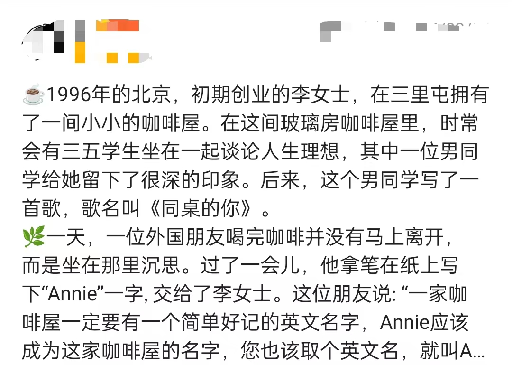

我已经很久不和人说我喜欢听《同桌的你》了。

## 六、B-Robot

这个铁甲小宝本来是我在贵州就看上了，就在 AJ 念高中对面的那个商场。

后来好像快毕业的时候我买了它。当时 AJ 很激动，我也不知道为什么，就拉着我在旗杆下面拼完了

拿起来也超级可爱（谁能想到左边才是我的手呢）：

## 七、真爱小熊

过生日 AJ 送的真爱小熊。巧克力很好吃，嘎嘎嘎！

唉，哈哈哈哈哈哈。

---

## 八、总结

光标悬了很久，我也不知道打什么字。

可能缺少一些运气和默契吧。
