波尔共振实验作为2021年的新增实验，是我做过的所有实验中最简单的。

造成其简单的原因是这个实验全是交由仪器处理的，不存在因为操作失误而造成实验失败的情况。

<!-- more-->

# 波尔共振实验

## 一、总论

第一次选实验就选到了英文实验，还是一个新实验，就十分崩溃，所以确实投入了不少心血在这里面。总的来说这个实验室比我认识的人做的实验好像简单一些。我会在下面列举准备的措施，只要按照顺序阅读并践行，我认为开开心心通过不成困难。我现在能写这篇博客，离不开很多好朋友的帮助，特意在这里对对他们表示感谢。

**鸣谢名单**（按姓名字典序）

- 郭哥哥
- 梦拓小姐姐
- 向哥哥

## 二、实验组成

这个实验虽然看上去是一个，但其实由三个小实验组成，分别是**自由振动**、**电磁阻尼振动**和**受迫振动**，三个实验还是十分独立的，但是也是需要按顺序进行的，因为**自由振动实验**会得出**固有频率**，**阻尼振动**会计算出 $\beta $ ，这两个值都是要在第三个实验用到的。

## 三、实验的数学原理

$$
J\frac{d^2\theta}{dt^2} = -k\theta - b\frac{d\theta}{dt} - M_0\cos\omega t
$$

这是本实验的最重要的一个式子，不要看这个式子结构这么复杂，其实只是因为涉及了**转动**而不是**平动**的原因，这其实就是**转动**版的**牛顿第二定律**，把右侧的每一项都弄懂就很容易明白这个式子的意义了。

我们可以看出这个这个式子是**二阶微分方程**的形式，所以可以知道，他的解一定是一个指数形式，所以为了让它更加和蔼可亲，我们用对两侧**求对数**的方法将其变为**线性**，进而就可以对其进行**逐差法**处理。
$$
\theta = \theta_{tem}e^{-\beta t}\cos\omega_t t
$$
求对数就可以得到
$$
ln\theta = -\beta t + \cdot\cdot\cdot
$$
虽然严格的说，还有一项带着 t ，但是已经可以看出是存在**近似线性关系**的。这样就可以用逐差法来处理了，其中的因变量就是 $ln\theta$ ，而自变量就是 t。

所以这个式子就显得很显然了。（上面的**线性处理**，都是在阻尼振荡实验中用的）
$$
\frac{ln\theta_{i+n}}{ln\theta_i} = -n\beta \bar{T}
$$
另外，在**受迫振动**的实验中，提供的参考资料里面用了**归一化处理**，如果不对频率进行**归一化处理**，也是可以完成实验的。对于没有受过相应的数学训练的人，第一次看到归一化处理的时候，会觉得莫名其妙，进而放弃（我就是）。

这里讲一下归一化处理，以考试举例，比如由A考试满分1000分，小明得了600分，B考试满分10分，小明考了9分，我们不能因为9 < 600， 就说小明更擅长A科，我们应该对两个考试采用统一的评判标准，比如**得分率**，小明A是0.6，B是0.9，所以小明B学科学的更好。我们可以看到归一化就是一个**做比**的过程。那么什么东西可用来做**分母**呢？总分可以，最高分也可以，平均分也可以。在这个实验中，我们为了说明在接近**固有频率**的时候（严格的说不是固有频率，因为会受到电磁阻尼的影响），受迫振动的振幅达到最大，所以我们用接近固有频率的那个值 $\omega_r$​ 来做分母，所有的频率都需要与它做比。在拓展实验中也有类似操作，做分母的是最大振幅 $\theta _ r$。

## 四、实验操作

基础的实验操作其实不需要看发的教材，因为不太直观，这里给大家安利一个B站视频，堪称**保姆级教程**，网址如下：

https://www.bilibili.com/video/BV1tB4y1F7Hp?p=4

此外，对于闪光灯，不要闲的没事拿起来，就让它放在那里就好了，不要像我一样，像拿个手机拍照一样，影响读数。

## 五、英文授课

作为一个英语废物，感觉**英语授课**友好程度还挺高的。我的老师是lb，他就是轮流问问题，答得上来就答，答不上来就过，当然我依然翻车了。这里给大家准备了一些资料。

常用词汇：

- Bohr resonance experiment 波尔共振实验
- amplitude 振幅
- frequency 频率
- phase-difference 相位差
- vibration 振动
- free vibration 自由振动
-  damped vibration 阻尼振动
- oscillation 振荡器
- eletromagnetic 电磁的
- wheel 转轮
- period 周期
- equation 等式
- natural frequency 固有频率
- exponent 指数
- motor 电机

老师问过的问题：

- 第一/二/三个实验是什么？
- 第一/二/三个实验都需要记录哪些变量？都是怎样测量的？
- 第一/二/三个实验的关键点是啥?
- 你对第一/二/三个实验结果有何预期？
- 第一个实验你要怎样让转轮动起来？
- 在第一个实验中，周期与振幅有什么关系？
- 第一个实验为啥转轮会慢慢停下来？（我的翻车回答，到最后只能用中文说能量转换过程中会变成内能丧失，然后我就又被问了一波电磁阻尼的物理学原理，还有微分方程求解，幸亏考前看了一波）
- 第二个实验为啥比第一个实验更快停下来？
- 第二个实验的阻尼是哪种类型，为啥可以阻碍运动？
- 第三个实验怎么样测相位差？
- 第三个实验，你打算做几组数据，怎样选取数据点？
- 怎样改变电机的频率？

## 六、数据处理

这个大家都说要当堂处理，但是好像只要把数据记在纸上，让老师签字就可以走了，但是我不确定是不是这样的，因为我当时太害怕处理数据翻车，就写了一个matlab脚本，来帮我处理数据，老师也看过我的程序了，所以可能是我这样也叫过了？

以下是源代码分享

```matlab
%计算固有周期的平均值
T0 = xlsread('1.xlsx', 'B2: B13');%读取所有的自由振动T值
T0_bar = mean(T0)%对读取的T值求平均

%计算beta的第一种算法
theta = xlsread('2.xlsx', 'A2: A11');%读取所有的振幅
for i = 1:5
    ln_theta(i) = log(theta(i) / theta(i + 5));%进行取对数处理以后用逐差法
end
T1 = xlsread('2.xlsx', 'B2: B11');%读取所有电磁阻尼振动T值
T1_bar = mean(T1);%对T求平均
beta1 = sum(ln_theta)/25/T1_bar%第一种求beta的算法，逐差法

%绘制幅频曲线和相频曲线
w0 = 2 * pi / T0_bar;%求出固有频率
wr = sqrt(w0^2 - 2 * beta1^2);%求出极值点
T2 = xlsread('3.xlsx', 'B2 : B24');%读取出受迫振动的周期
w = 2 * pi ./ T2;%计算出受迫振动的周期
rate1 = w ./ wr;%用极值点进行对频率进行归一化处理
thetas = xlsread('3.xlsx', 'C2: C24');%读取所有受迫振动的振幅
phi = xlsread('3.xlsx', 'D2: D24');%读取所有受迫振动的相位差
plot(rate1, thetas), figure, plot(rate1, phi);%绘制幅频和相频图

%计算beta的第二种算法
thetar = max(thetas);%取出最大振幅
rate2 = thetas ./ thetar;%利用最大振幅进行归一化处理
sp = csapi(w, rate2);%三次样条插值拟合
fnplt(sp), hold on, plot([min(w), max(w)], [1/sqrt(2), 1/sqrt(2)]), set(gca, 'XMinorGrid','on'), grid on;%绘制图像 
w2 = 4.08, w1 = 3.955;%曲线与直线的两个焦点对应的两个频率即为所求
beta2 = (w2 - w1) / 2%第二种方法求beta

%计算beta1的不确定度
beta_group = ln_theta ./ (5 * T1_bar);
mean(beta_group)
std1 = std(ln_theta)/(5 * T1_bar)%可以中间接法测量theta的不确定度
std2 = std(beta_group)%也可以直接测beta，两者无明显差异

%误差分析改进

%选做实验，不同beta

```

这段程序可以实现注释中提到的功能，效果大概就是这样的：

为了保证脚本的正常运行，需要把脚本所在的文件夹如下配置：

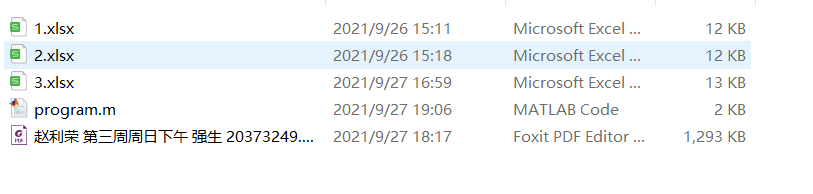

同时还需要对每个表格里内容具有如下限制（我的那个变量登记在哪列了，大家做实验的时候也要登记到相同的那一列，数据组数也不能多或者少），当然也可以修改我的脚本，很好改的：

截图里面的数据就是我做实验的数据，大家可以自己用来试试。

注释里不仅有功能说明，还有**数据处理**的方法，即使不用电脑处理数据，我觉得注释也是有一定的参考价值的。	

考虑到有人不会matlab，其实用excel也可以做数据处理，就不在这里写VBA程序了（因为我不会，一步步截图太麻烦了）。

## 七、拓展实验

这个实验有两个拓展实验，一个是 $\beta$ 的第二种测量方法，我已经写在脚本里了，其中交点对应的频率 $\omega_1, \omega_2$ 需要从图中读出。是很简单的。

另一个是多个 $\beta$ 值的幅频和相频曲线，这个也很好做，只要有时间就可以做，脚本用用一个就可以了，但是一定要注意要做第二次第二个实验，不要以为只需要做第二次第三个实验，因为绘制图像需要第二问求出的 $\beta$ 的值，我就只做了第三个实验两次，就没法完成这个拓展实验了。

## 八、实验报告

就不放了，写的太烂太丢人。我只能说，对于英语废物，**谷歌翻译YYDS！**（快考试了，还是放出来吧）

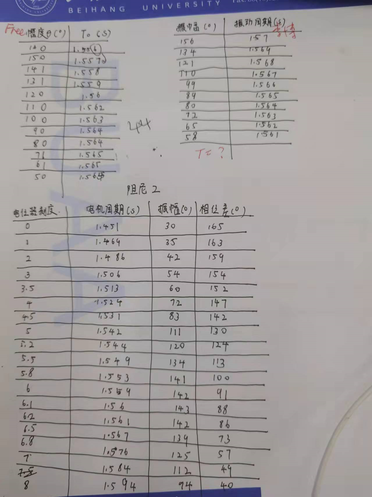

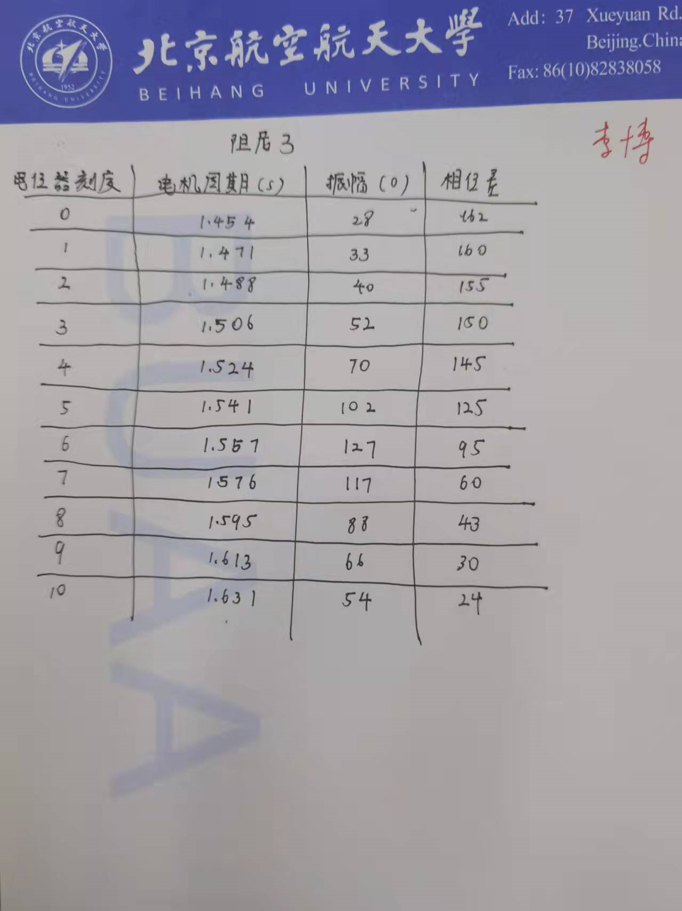

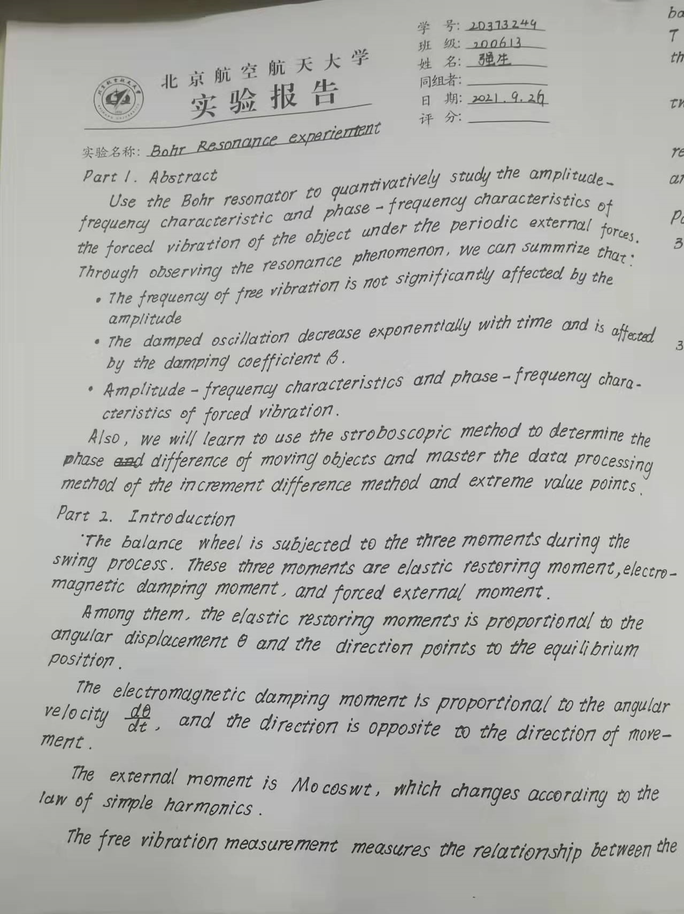

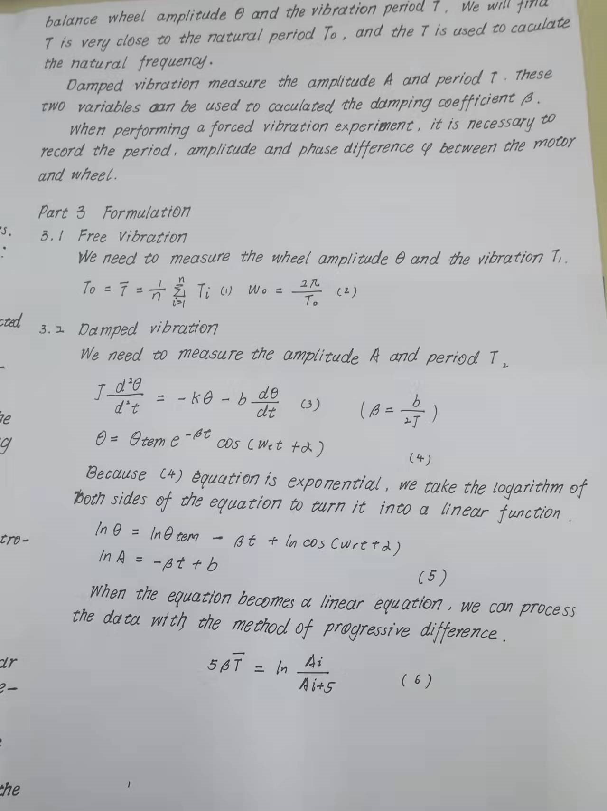

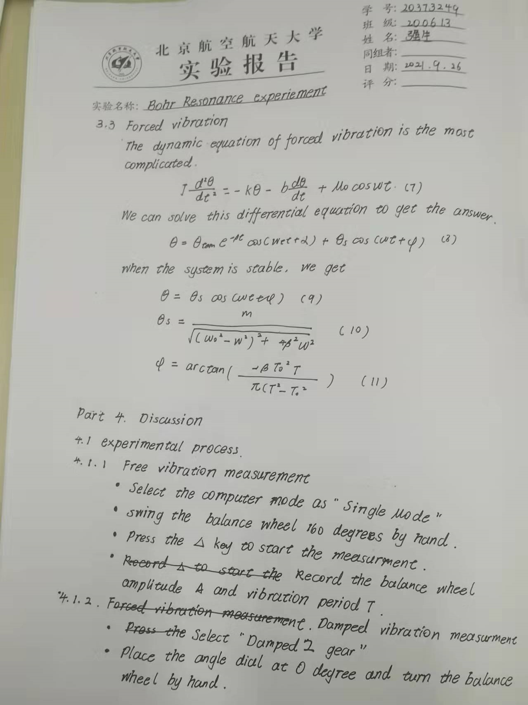

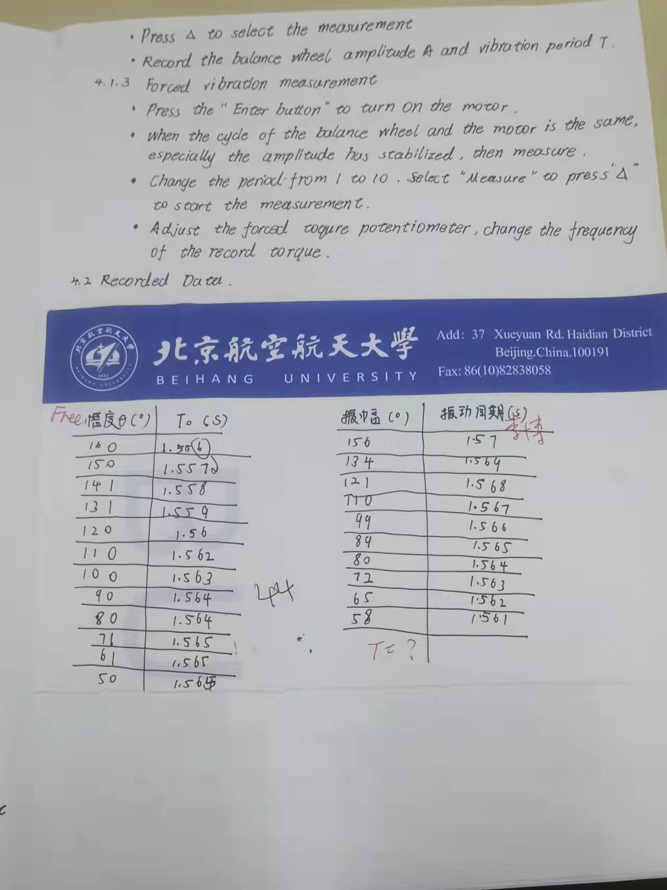

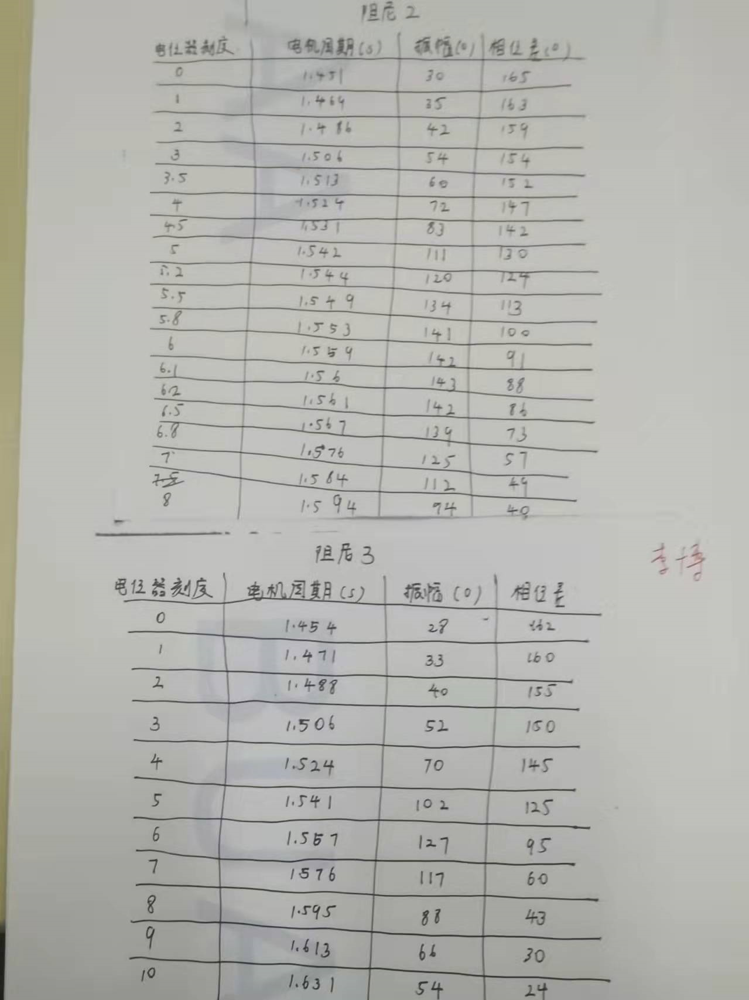

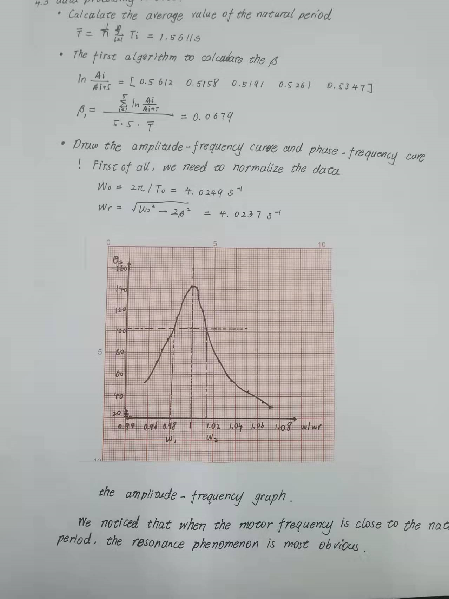

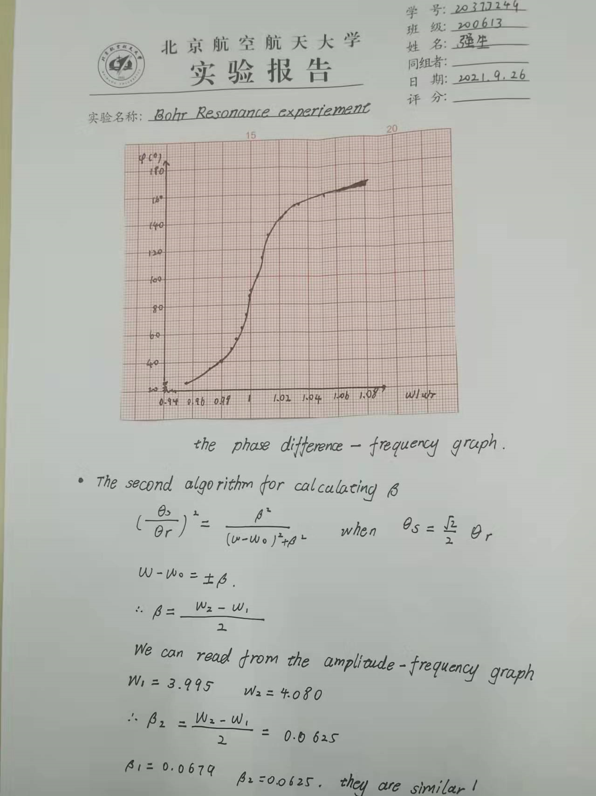

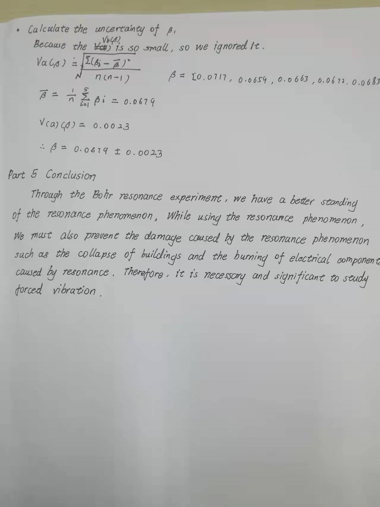
