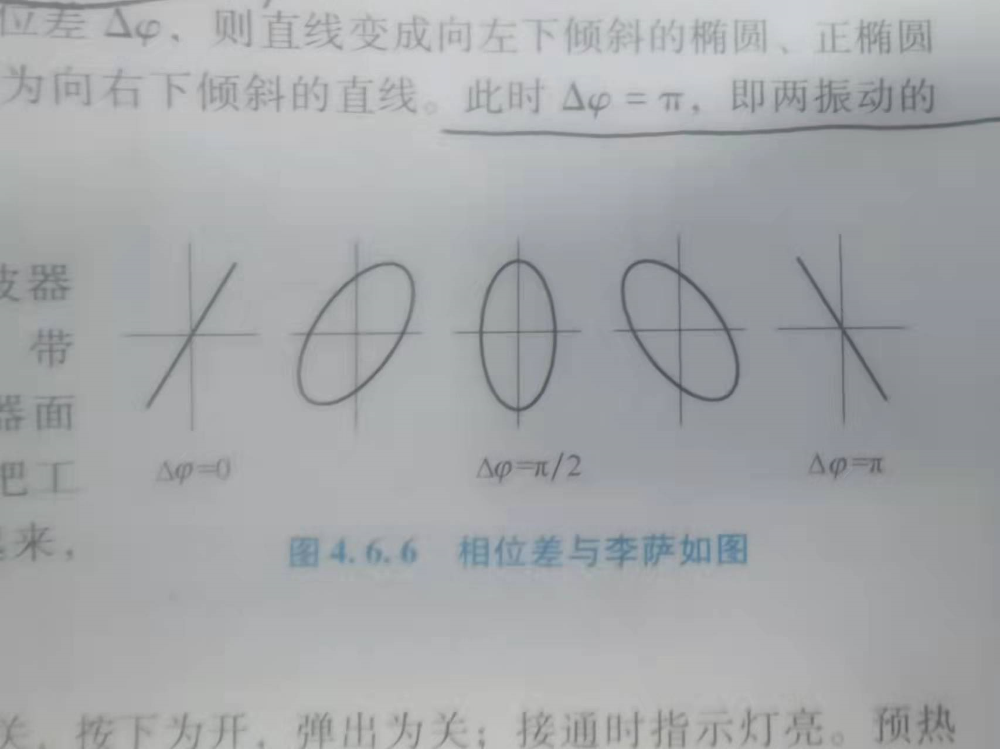
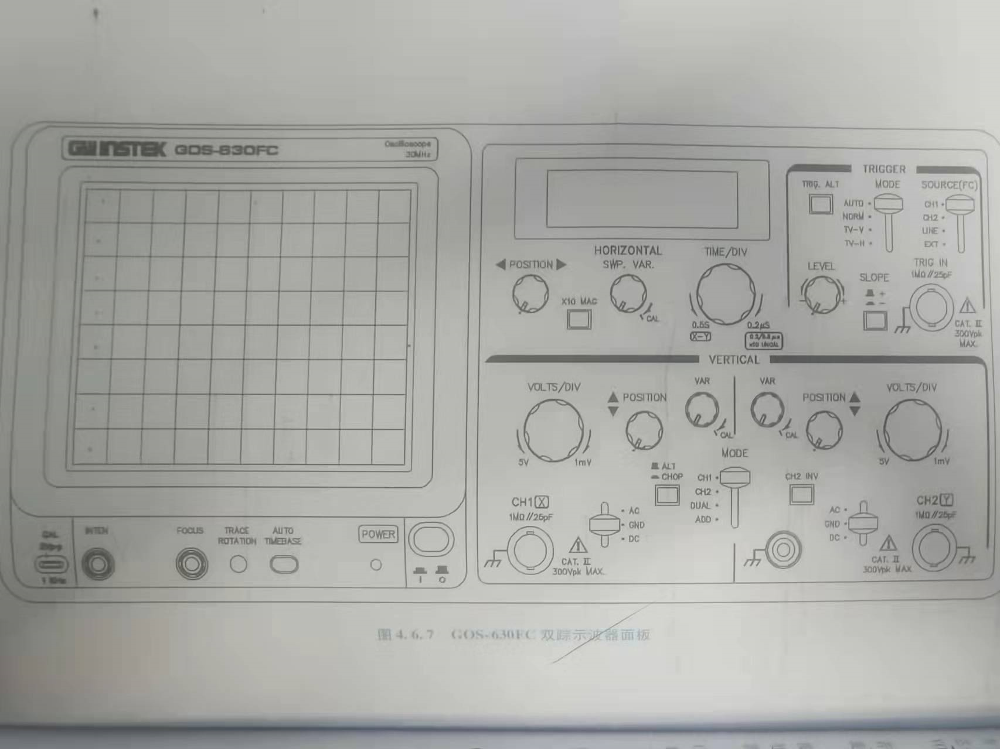
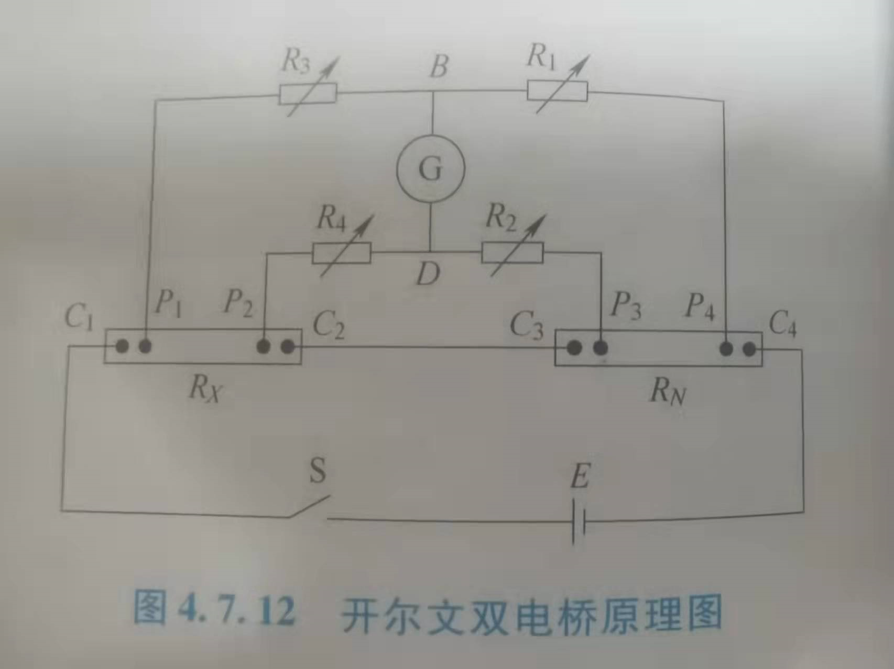
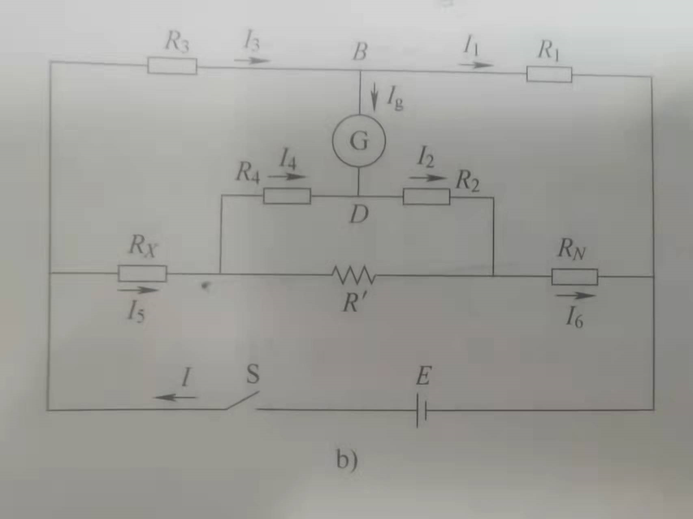
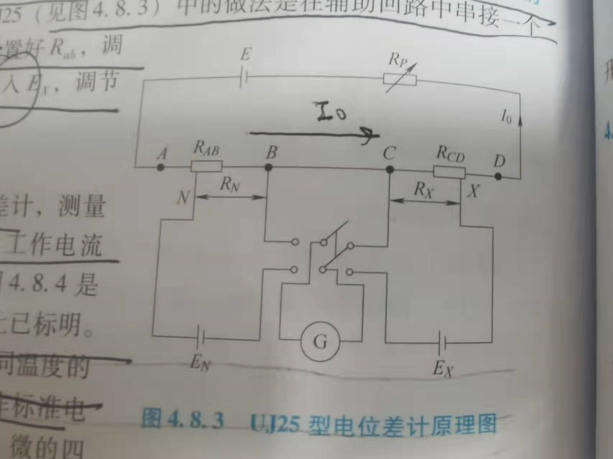
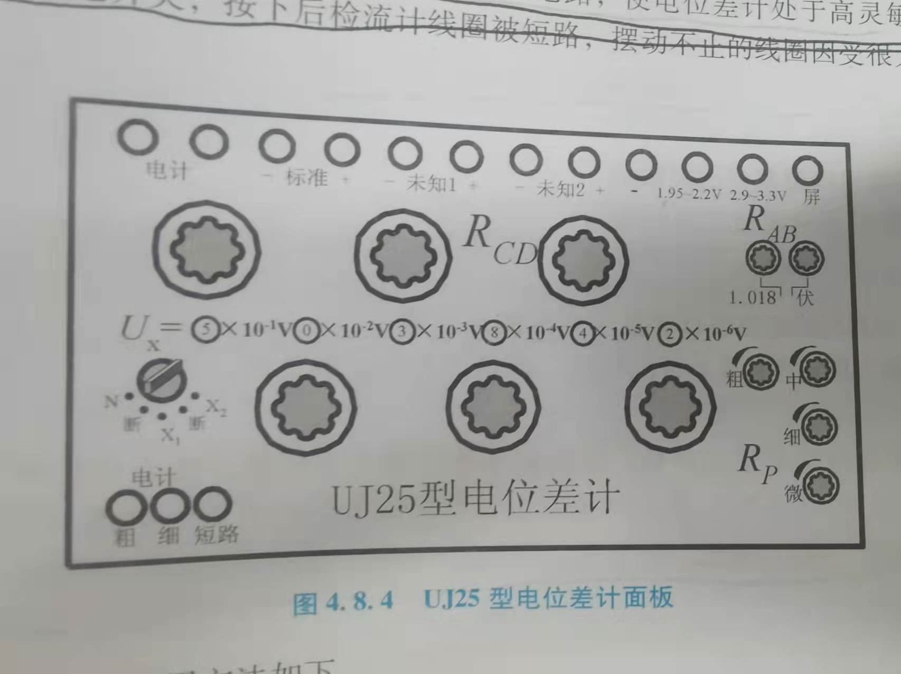
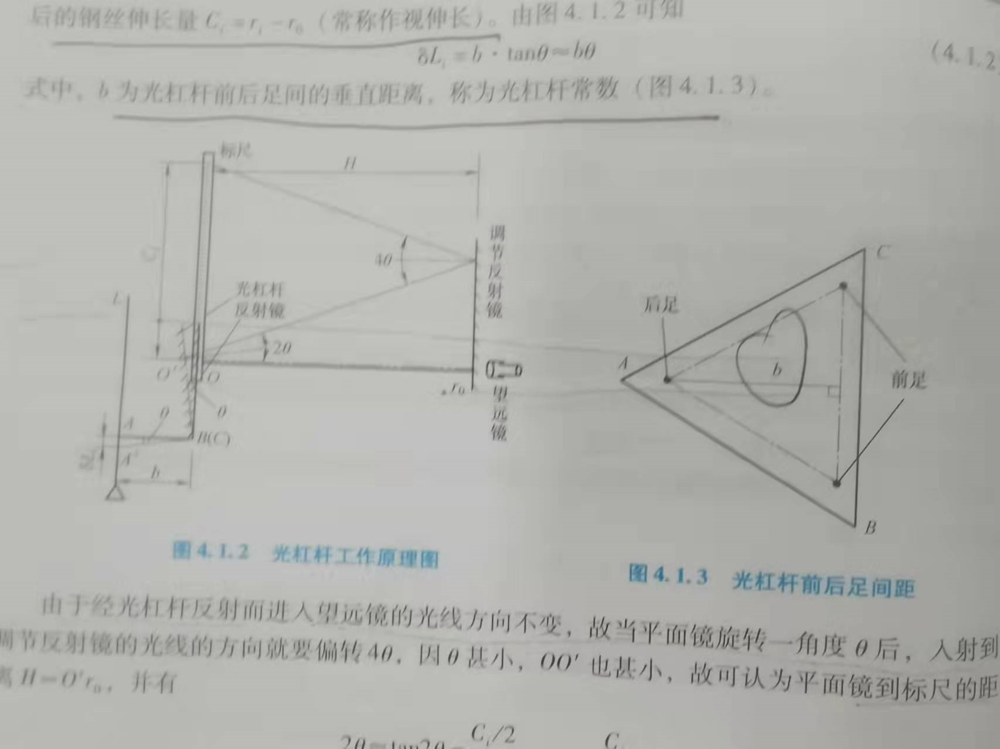

按照说明文件，**考试范围是前三章和开设的所有实验**，往年的选做题目中涉及了很多没有在这个学期开设的实验。

这个部分主要是讲解基物实验期末考试中选做题实验的基本常识，主要包括：

- 测量物体的转动惯量
- 示波器及其应用
- 开尔文电桥法测电阻
- 电位差计及其应用
- 分光仪的调整及其应用
- 光杠杆法测量弹性模量

<!-- more-->

## 一、测量刚体的转动惯量

### 1.1 实验原理

测量转动惯量最本质的办法是**直接积分**。但是因为很多物体很不规则，所以直接积分存在障碍，所以我们采用了一种新的方法，叫做**转换测量法**，也就是说，不直接算，而是通过测量其他的一些物理量，来把我们想要的物理量求解出来的方法（利用各物理量之间的变换关系来测量某一物理量）。

我们是利用**扭摆法**来测量刚体的转动惯量的。核心公式是这个
$$
I\frac{d^2\theta}{dt^2} = -K\theta
$$
扭摆就类似于一个弹簧，只不过是提供的是力矩而不是力。我们通过测定扭摆的周期（上面是一个微分方程，解出来是一个三角函数的形式），进而测定转动惯量，即
$$
T = 2\pi\sqrt{\frac{I}{K}},\quad I = \frac{KT^2}{4\pi^2}
$$
所以如果我们知道 $K$ 并且可以测出 $T$ 。事情就解决了，但是事实上，我们不知道 $K$ 。所以我们得求 $K$ 。其实我们也不想求，所以我们采用的是**比值测量法**，我觉得其核心的是把某一个中间变量（在这里是 $K$ ）用比值的数学方法消掉，这样就可以提高计算的精度。比如说我们首先会测量一个**金属载物台（没办法，很多其他待测物体都得放在上面）**，记录他的周期为 $T_0$ ，然后测量一个**塑料圆柱体（作为标准物体）**的周期 $T_1$ 。然后我们考虑一个放在载物台上的待测物体，若其周期为 $T_2$，其转动惯量可以表示为
$$
I_2 = \frac{T_2^2 - T_0^2}{T_1^2-T_0^2}I_1
$$
可以看到，这样就避免了 $K$ 的测量。

在这一节里，我们还验证了**中心轴定理**，我们采用的是滑块，其理论公式如下
$$
I = \frac{1}{16}m(D_1^2 + D_2^2) + \frac{1}{12}mh^2
$$
这个公式是滑块如果为放在中轴线上的时候的转动惯量，其中 $D_1,D_2 $分别是滑块的内外径，很好理解。

### 1.2 实验操作

- 安装时要旋紧**止动螺丝**，否则摆动数次后摆角可能会明显减少甚至会停下。
- 光电探头（用来测周期）宜放置在挡光杆的平衡位置，挡光杆不能与它接触，否则会增大摩擦力矩。
- 弹簧的扭转常数不是固定常数，它与摆动角度略有关系，摆角在 $40\sim90$ 度的时候基本保持不变，在小角度的时候会变小。
- 在称量圆球和金属细长杆的质量的时候，要取下支架，因为质量对其会有影响，但是在测量转动惯量的时候，是不需要考虑的，因为影响较小。（也就是说，在算转动惯量理论值的时候，需要去掉，测量实际值的时候，不需要去掉）。

---

## 二、示波器及其应用

### 2.1 数学原理

> ​	示波器除了能直接直观的显示波形之外，其测量内容可以归结为两类——**电压和时间的测量**，而电压和时间的测量最终又归结为屏上波形长度的测量。

从上面这段话可以看出，要想获得电压和时间，最重要的掌握长度（更直接的是**格数**）和这两个量的换算关系。而这两个比例系数（被称为灵敏度），一个由 $VOLTS/DIV$（即灵敏度调节按钮）和其**微调旋钮**调节，另一个由 $TIME/DIV$和其微调旋钮调节。

除了这个关键以外，还有关于李萨如图的两个应用，一个是用于测量**频率比**，有公式如下，其中 $n_x,n_y$ 分别是水平线与图形相交的最大点数，竖直线与图形相交的最大点数。
$$
f_yn_y = f_xn_x
$$
另一个应用是用来测量两个输入波形的**相位差**，有公式如下，其中 $x$ 是椭圆与 x 轴的交点坐标，$x_0$ 是最大水平偏转距离。
$$
\Delta\phi = \arcsin(\frac{x}{x_0})
$$
有以下典型图：

### 2.2 仪器结构

在这个部分，我会将各个按钮按照功能进行划分，恰好这个面板的按钮布局也是按照这个思路来的。

#### 2.1.1 开机

在开机部分我们的功能按键都集中在**左下面**：

- power：用于开机。
- inten：用于调节**辉度**，辉度就是亮度的意思。不可将其调的过量，伤眼而且会使荧光屏变黑，还会损失示波器寿命
- focous：调节清晰度。

#### 2.1.2 输入信号

这个部分集中于**中下部和右下部**，可以看到，这个部分有明显的对称结构，这是因为这款示波器是**双通道**（也就是说，可以接受两个输入信号波）的。

关于对于**一个信号波的控制**，有如下按钮：

- 调节**灵敏度**：volta/div用于调节灵敏度，这个可以获得我们在2.1中说的灵敏度，var用于灵敏度的微调（据说当示波器图像不稳定的时候，可以调节这个旋钮），如果真的要进行定量测量，那么就必须将其顺时针旋转到“CAL”校准位置。“CHOP”好像是灵敏度探针，可以将灵敏度提高10倍
- 调节**垂直位移**：用position可以调节垂直位移
- 调节**耦合方式**：输入信号与示波器有3种连接方式：
  - AC：**交流耦合**，阻断直流成分。
  - DC：**直流耦合**，阻断交流成分。
  - GND：输入端接地，常用于**测量基准或寻迹**。

关于对两个信号波的联合控制：

- 调节**工作方式**：MODE
  - CH1：屏幕只显示1通道信号。
  - CH2：屏幕只显示2通道信号。
  - DUAL：双踪，即屏幕同时显示两个通道信号。
  - ADD：叠加，显示两个通道信号之和，如果想显示差，可以将CH2反向（通过CH2 INV）

#### 2.1.3 内置扫描波

这个部分集中于中上部：

- 调节**灵敏度**：与输入信号的调节类似。
- 调节**水平位移**：与输入信号类似。
- 转变**X-Y模式**：需要将time/div逆时针旋转到最右侧，触发源选择CH1或者EXT

#### 2.1.4 触发调节

只有当输入电压的频率是扫描电压的频率的整数倍的时候，图像才能稳定，不然每一次的扫描的图形的起始位置不同，屏幕上显示的是多个图形在不同位置的叠加，无法观测到稳定的图形。

为了解决这个问题，我们采用了**同步触发**的方式，即“只有当Y轴信号（或者与Y轴信号严格同步的信号）到达确定的某一状态（极性和幅度）后，才触发X轴开始扫描”。那么就设计到一个**控制触发的问题**。这个部分主要集中在**右上部**：

- 选择**触发源**：trigger source
  - CH1：以1通道信号为触发信号
  - CH2：以2通道信号为触发信号
  - LINE：以电源信号为触发信号
  - EXT：以外接信号为触发信号，外部信号由TRIG IN接入
- 选择**触发电平**：level，向“+”旋转，启动扫描的触发电平上升，反之，下降。调节这个会影响波形的起始位置。
- 选择**触发极性**：slope，安如为负极性，即下降沿触发，反之，上升沿触发。
- 选择**触发方式**：MODE
  - auto：没有信号输入或信号没有触发同步，依然显示扫描线
  - norm：只有触发信号会触发扫描，否则没有扫描线
- **交替耦合**：trig alt 应该是双踪模式用的。

### 2.3 实验操作

- 测量二极管伏安特性的时候，用的是X-Y模式，在一个并联电路中
- 测声速的本质是在测波长，有**振幅法**和**相位法**两种方法。

---

## 三、开尔文电桥法测电阻

### 3.1 实验原理

惠斯通电桥法测量的一般是中值电阻（$10\sim10^6$） 。对于小电阻，因为接触电阻和导线都会有电阻，所以测试就会很不准确。所以我们给出了**开尔文双电桥法**来测量**低值电阻**。

这个方法的核心思想有两点：

- 将 $R_N,R_x$ 的**导线电阻**和**接触电阻**巧妙地转移到了电源内阻和阻值很大的桥臂电阻上
- 利用 $\frac{R_3}{R_1} = \frac{R_4}{R_2}$ 和 $R^\prime \approx 0$ ，就可以忽略修正值的影响。

开尔文双电桥法的原理如图：

其中 $P_1,P_2,P_3,P_4$ 被称为**电压接点**， $C_1,C_2,C_3,C_4$ 被称为**电流接点**。然后经过一顿细致的分析，我们会得到下面这张图：

  

依然是让检流计示数为0，可以推出等式
$$
R_x = \frac{R_3}{R_1}R_N + \frac{R^\prime R_2}{R_2 + R_4 + R^\prime}(\frac{R_3}{R_1} - \frac{R_4}{R_2})
$$
当我们让$\frac{R_3}{R_1} = \frac{R_4}{R_2}$ 的时候，就可以获得跟单电桥一样的公式了，即
$$
R_x = \frac{R_3}{R_1}R_N
$$
最后只有一个问题，就是让$\frac{R_3}{R_1} = \frac{R_4}{R_2}$ 可以有很多种方式，我们选择让 $R_1 = R_2,\quad R_3 = R_4$ ，然后**联合调节** $R_3,R_4$，求出待测电阻的值，即
$$
R_x = \frac{R_N}{R_1}R_3
$$
此时 $R_3$ 被称为**比较臂电阻**，$\frac{R_N}{R_1}$ 被称为**电桥倍率系数**。实验室提供的**QJ19**型单双电桥用的就是这种方法。

### 3.2 一些问题

- 附加热电动势消除方法：电流正向反向测量取平均值。

---

## 四、电位差计及其应用

### 4.1 实验原理

电位差计是为了精密的测量**电压或者电动势**（虽然这个实验是测量电动势，但是它也可以测电压），其等价于一个内阻无穷大的电压表。原理图如下：

这个图上面的那个回路被称为**辅助回路**，而下面这两个应该被叫做**补偿回路**。底下这两个回路，如果是测量状态，那么通过他们的电流应该是0（被补偿了）。

电位差计之所以复杂，还在于除了上面描述的**补偿法**之外，它还用了**比较测量法**，所以这就是为啥底下是两个回路的原因了，因为是需要比较，所以肯定不是测试一个。（其实一个就够了，只需要在辅助回路里安装电流表，让电流乘电阻，就可以得出电动势了）在这个题目中，可以说他先用左下角的那个电路把辅助回路里的电流算了出来（没有真算），然后再求解的右下角，我们真正想知道的电路。

另一个复杂的点是它将辅助回路里的电流**标准化**了，也就是说，它又绕了一个弯，我们之前说左下角的式子是这个用法
$$
I = \frac{E_N}{R_{AB}}
$$
因为 $E_N,R_{AB}$ 都是已知的，所以电流就可以被算出来了，但是这里变得更负责了。我们要控制 $I$ 的值。但是一旦控制了这个值。整个辅助回路的总组织就必须确定了，所以我们又引入了 $R_p$ 来帮助我们控制。

那么整个实验的步骤是这样的（只是逻辑步骤，会与现实有出入）

- 先由 $E_N$ 的值（用温度修正了）确定了 $R_{AB}$ 
- 瞎估计一个 $R_{CD}$ 
- 将检流计接入左下电路，此时肯定会有偏转（因为 $V_{AB}$ 不等于 $E_N$） 。所以就调节 $R_p$ 让检流计不发生偏转（之后就不调节 $R_p$ 了）
- 将检流计接入右下电路，此时**联合调节** $R_{AB},R_{CD}$ ，联合的要求是它俩的和不能变（因为要保证电流不变）
- 得到 $R_{AB}^\prime,R_{CD}^\prime$ ，此时检流计示数变为了0

### 4.2 实验仪器

实验仪器如图所示：

我们分开介绍：

- 上面那一排接线柱
  - **电计**是用来接入检流计的。
  - **标准**是用来接入标准电池（应该不是电池）的，提供标准电动势。
  - **未知12**都是用来接入待测的电压的（我们只用一个）
- $R_{AB}$ 是用根据 $E_N$ 来调节第一次的 $R_{AB}$ 的
- $R_p$ 是用来调节 $R_p$ 的。
- $R_{CD}$  不只是用来调节$R_{CD}$（$R_{CD}$是蒙的，粗略估计一下就好了） ，它主要负责**联合调节** $R_{AB}^\prime,R_{CD}^\prime$ 。说这一不要造成理解上的困难。
- 右面的旋钮是用来控制检流计接入哪一个电路的，断路就是都不接入，N就是接入左下角电路，X使用测量未知电路。
- 最右下面的按钮是将检流计接入电路的（上面那个旋钮只是为检流计选定了接入的目标电路，还没有真的接进去）。因为检流计过于敏感，所以直接接太冒失了，所以不能直接接入，有粗接（就是往检流计上串电阻，这样电流就小了）和细接（就是直接接）的区别。短路主要是为了让检流计指针赶快**复位**。

### 4.3 灵敏度分析

我还没有弄得太明白，应该是说自己组装的仪器，都需要测一下这个东西，具体的方法就是让检流计偏转一定的个数，然后看此时的结果与原来没偏转时得到的结果的差值的大小，有一个公式
$$
S = \frac{n}{Result_{error} - Result_{true}}
$$
$n$ 是偏转的个数。那么其灵敏度误差为
$$
\Delta_{灵} = 0.2div/S,\quad u_{灵} = \Delta_{灵}/\sqrt3
$$
为啥用0.2格呢？因为这是人眼能分辨的最小格数。

### 4.4 一些问题

- 如果 $R_{CD}$ 怎么调节，检流计均偏向一边？电路无法补偿比如正负极串联或是一方电压过小。
- 检流计均保持不动？可能是开路（好敷衍）。
- 两次补偿的灵敏度一样吗？不一样，$E_N$ 的内阻会大一些，所以灵敏度会差一些。

---

## 五、分光仪的调整及其应用

### 5.1 调整过程

#### 5.1.1 粗调

#### 5.1.2 调整望远镜

- 调焦于无穷远：根据**自准直原理**，改变目镜与叉丝分划板之间的距离（我不知道为啥），目标是清晰无视差的看清小绿十字。
- 望远镜光轴与仪器主轴垂直：来回旋转反射镜，利用**半调法**。目标是绿十字一直在上叉丝处。
- 调整叉丝分划板里的纵丝与仪器主轴平行：转动目镜镜筒，让小绿十字与上叉丝重合。

#### 5.1.3 调整平行光管

- 使平行光管产生平行光：前后移动狭缝套筒，在望远镜目镜中无视差地看到边缘清晰的狭缝像的时候，调节完成。
- 光管主光轴与仪器主轴垂直：让其与望远镜光轴重合，使狭缝像中点与中心叉丝重合。

#### 5.1.4 调整三棱镜

- 不能用半调法，因为此时望远镜已经符合要求了。
- 目标都是小绿十字与上叉丝重合。

### 5.2 误差消除

#### 5.2.1 偏心差

分光仪的**主刻度盘**和**游标盘**不可能完全同心，这被称为偏心差。这是仪器本身的系统误差，消除办法是采用**对径读数法**。

#### 5.2.2 主刻度盘刻度不均匀

消除方法是在刻度盘不同部位进行多次测量。

---

## 六、光杠杆法测量弹性模量

### 6.1 实验原理

弹性模量的公式如下
$$
E = \frac{4FL}{\pi D^2\Delta L}
$$
可以看到，无论是力，还是长度，还是直径，都是可以测出来的。但是只有 $\Delta L $ 是一个难以测量的量（因为它太小了），所以我们实验的重点就是采用**光杠杆法**将这个微小的形变量测量出来。

### 6.2 实验仪器

实话实说，这个部分我自己也没弄明白，我搞不清楚到底光线构成的平面是水平的，还是垂直的。实验仪器如图：

大致意思是说，待测量的钢丝连着后足，如果它伸长了（钢丝底下还连着秤砣，用来算 $F$ ），那么后足就向后倾，那么就会让光杠杆反射镜扭转一个角度，然后又通过调节反射镜又扭转了一个角度，最后标尺上的光斑就会移动一个较大的距离，这个被放大过的距离就用来计算伸长量。

最后有公式：
$$
\Delta L = \frac{b}{4H}C
$$
其中 $C$ 是标尺读数差，$\frac{4H}{b}$ 被称为光杠杆的**放大率**。增大 $H$ （也就是望远镜到反射镜的距离），就可以提高放大率。

### 6.3 实验操作

- 首先是光学系统的调整，因为我没有看懂，所以就不列了。
- 需要在**增加拉力和减少拉力**过程中各测量一次取平均值，是因为**弹性滞后效应**。
- 测量结束后，要把拉力全部释放，不然加力装置会受损。
