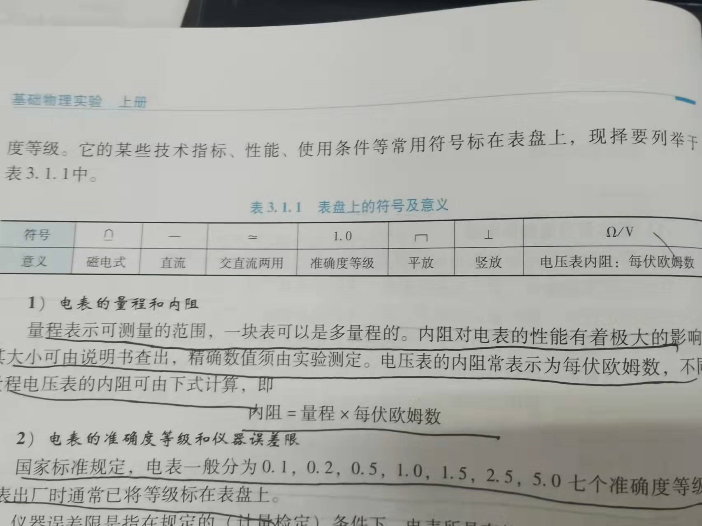
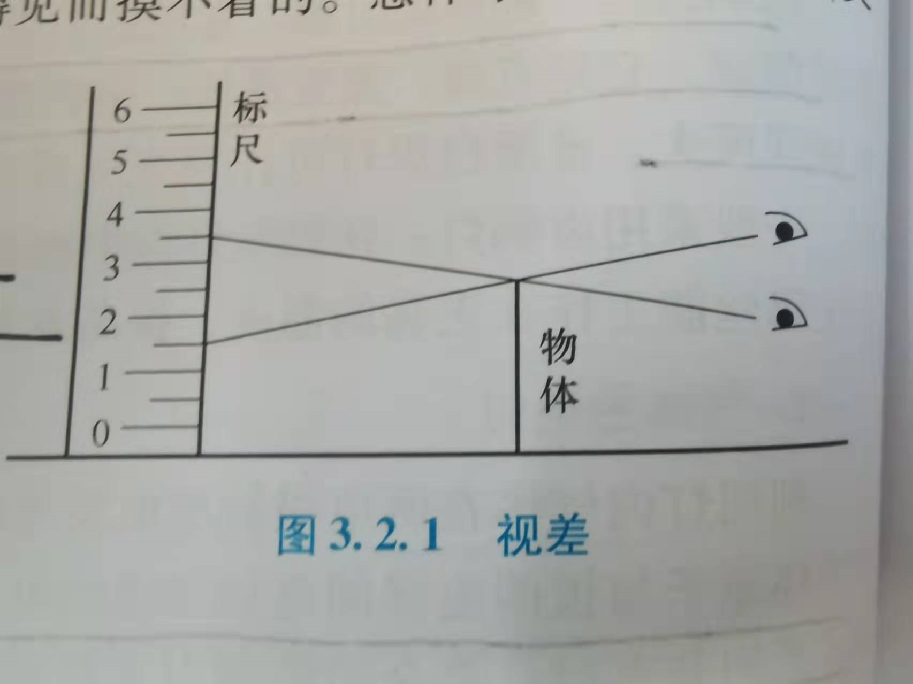
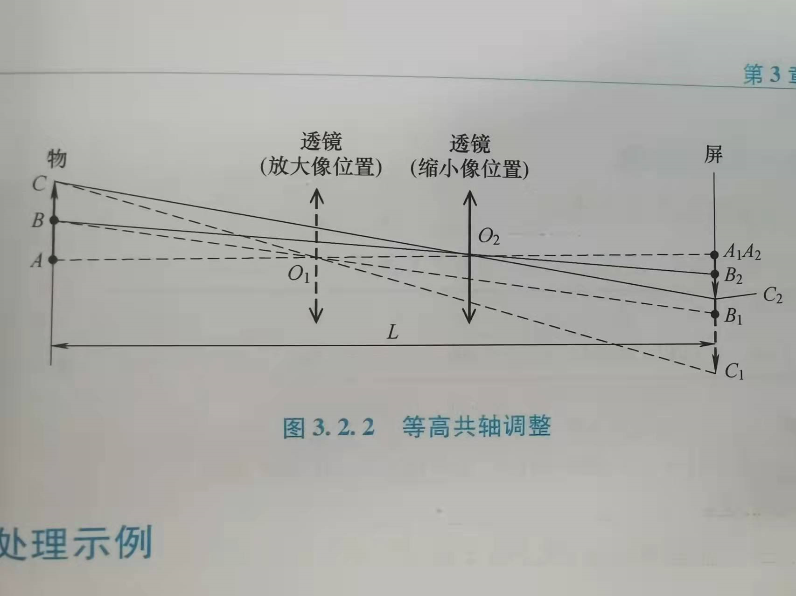

这个部分也是应该早看，里面有很多可以在实验中应用到的知识，但是我只是复习的时候才看见，太可惜了。
<!-- more-->

## 一、电学实验

### 1.1 操作规程

- 线路一般分为：**电源部分、控制部分、测量部分**。
- 把需要经常操作的仪器放在手边，需要读数据的仪表放在眼前
- **回路接线法**：布置好仪器后，将线路图分解为若干个回路，由第一个回路的高电位点开始连线，循回路连至电位最低点，然后再接第二个回路。
- 接线的时候，电源要先空出一端，在所有开关打开的情况下最后连入电路。
- 检查**仪器零点**和**安全位置**：在接电源之前要检查各个电表指针是否指零。并检查安全位置，包括：
  - 电键处于“开”。
  - 滑动变阻器处于使电路中电流最小的位置或者电压最低位置（注意这个是需要分类讨论的，不能无脑放到阻值最大处，比如在分压电路中）
  - 电阻处于预估值
  - 电表量程合适
- **瞬态试验**：连线完毕后，先**跃接**电源开关（就是按下以后立马弹起来）如无异常，才能继续试验
- **宏观初测**：粗调**控制电路**，宏观全面地查看测量仪器的变化
- 实验完毕：实验结束后，要将仪器按钮拨到安全位置断开开关。等老师检查实验数据完毕后才能拆线。拆线的时候要先断开电源。

### 1.2 电学仪器

#### 1.2.1 电源

- **晶体管稳压电源**内阻小，输出电压长期稳定性好，瞬时稳定性较差。
- **干电池**内阻小，电压瞬时稳定性好，但是长期稳定性较差，有寿命限制，长期使用后电压降低，内阻增加。
- **直流稳流电源**内阻很大，可以在一定负载范围内输出稳定的电流，电流大小可以调节。
- 对稳压电源和干电池，要特别防止短路。

#### 1.2.2 直流电表

##### 1.2.2.1 指针式磁电仪表

表盘符号及意义：

内阻计算：
$$
内阻 = 量程 \times 每伏欧姆数
$$
仪器误差限：
$$
\Delta_m = N_m\cdot a_m\%
$$
其中 $N_m$ 是量程，$a_m$ 是电表的等级。

相对不确定度：
$$
E = \frac{\Delta_m}{N_x} = \frac{N_m}{N_x}a\%
$$
这里需要注意的是，尽管是**不确定度**，但是并没有除**包含因子**$\sqrt3$ 。

电表读数：

只有指针与镜面中的像重合，才是正确的读数位置。

##### 1.2.2.2 数字电压表

- 能显示出 $0\sim9$ 这十个数字的称为一个**整位**，最高位能显示 0 和 1 的称为一个**半位**。

- 仪器误差限的第一种形式
  $$
  \Delta = a\%U_x + b\%U_m
  $$
  其中 a 是误差的**相对项系数**，即数字电压表的准确度等级（这里与指针式不同），b 是误差的**绝对项系数**。$U_x$ 是测量值，$U_m$ 是量程。

- 仪器误差限的第二种形式
  $$
  \Delta = a\%U_x + n字
  $$
  **字**是最小量化单位。

#### 1.2.3 电阻箱

电阻箱仪器误差计算式
$$
\Delta(R) = \sum_i (a_i\%\cdot R_i) + R_0
$$
$a_i$ 是各电阻箱的准确度等级（但是电阻箱铭牌上标注的一般都是直接是比例，而不是百分比例），$R_i$ 是各示值盘的示值，$R_0$ 是参与电阻。

---

## 二、光学实验

### 2.1 器件保护

- 不使用的光学元件应随时装入盒中
- 严禁用手触摸光学元件的表面
- **光学表面**不能加压擦拭，**镀膜面**不能触碰和擦拭

### 2.2 消视差

要测准物体的大小，必须将度量标尺与被测物体紧靠在一起，处于同一平面。

如果标度尺远离被测物体，读数将随着眼睛位置的改变而有所改变，这就被成为**视差**。

当上下左右晃动眼睛的时候，叉丝与像将有相对位移，出现“视差”，一边调节面位置或者叉丝位置，一边微微晃动眼睛观察，知道“视差”消失，此称“消视差调节”。

消视差的最终目的是将**待测像**（相当于图中的“物体”）和**叉丝**（相当于图中的“标尺”）调节到同一平面。上面介绍的方法只是其中的一种，我感觉在调整分光仪的时候消视差的方法应该不是上面这种。

### 2.3 等高共轴调节

先进行**目测粗调**，然后再进行**细调**（依靠**成像规律**）。

这幅图中，目的是让 B 与透镜中轴共轴，但是一开始调节的时候是 A 与中轴共轴，所以当透镜在不同位置的时候，会出现 $A_1B_1$ ，$A_2B_2$ 两种像，通过调节透镜或者物体的高度，实现“大像追小像”的过程。最终让两个像重合，那么调节就完成了。

如果是激光光源，那么只要加入元件的时候，光斑在光屏上的位置依然保持不变即可。