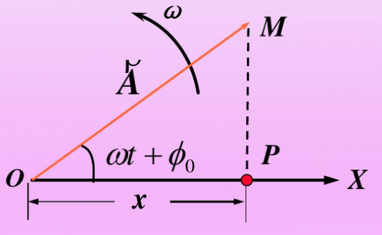
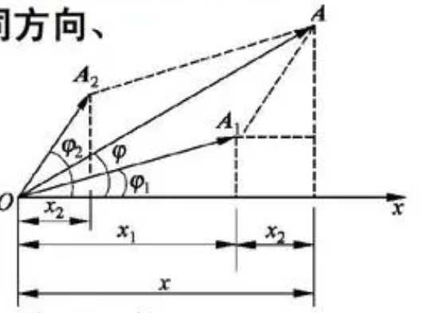
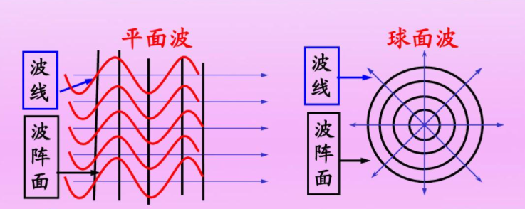

这章的组织其实是一个失误，因为在教材或者真的逻辑体系下，振动和波都是应该分为两个章节来讲的，但是因为这是我在授课期间匆忙之中完成的总结，所以将两个部分合到了一起，但是其实两章有明显的不同。

在振动这一章，我们的逻辑是简单的，复杂的是计算，拥有了微分方程等工具的我们，不仅可以可以考虑谐振动这种简单的情况，还可以考虑阻尼振动，受迫振动，合成振动，二维振动多种形式。

在波这一章，计算是简单的，最难的只是和差化积公式，但是有一大堆新的概念需要理解，比如驻波，波的强度，波的能量，半波损失，惠更斯原理。这些新引入的概念为后面的波动光学打下来基础。	

矢量作图法是一个很好的方法。

<!-- more -->

## 一、谐振动

### 1.1 公式

$$
\omega = \sqrt{\frac km}\\
x = A\cos(\omega t + \phi_0)
$$

可以看到在最原始的式子里，角频率的求解是直接从牛顿第二定理中推出的，求解一个二次微分方程，因为特征方程仅有虚根，所以解呈现三角函数的形式。

直观的看，当质量比较小，弹性系数比较大的时候，角频率是会变大的，也就是说，质量小、弹性系数高的振子振动的更快，这也与直观认识相符合。

但是这个式子里面还有振幅和初相没有求解，我们给定位移和速度，其实只可以列式子，还是没有办法求出的，书上的公式如下，是给错了
$$
A = \sqrt{x_0^2 + \frac{v_0^2}{\omega x_0}}\\
\phi_0 = \arctan(-\frac{v_0}{\omega x_0})
$$
主要是初相不确定，正确的应该写成
$$
\phi_0 = \arctan(-\frac{v_0}{\omega x_0}) + k\pi
$$
这是因为初相的范围区间是 $2\pi$，这里我约定初相的范围是 $(-\pi,\pi]$ ，所以初相仅凭借两个已知量存在多解的情况（如果范围是 $\pi$ ，那么就完全不存在这个问题，这个是反三角函数的局限性）。如果想要确定这个式子，还需要知道速度的方向（也就是要知道**速度向量**和**位移向量**，就可以求解振动方程）。

如果想要得到速度与时间的关系，或者是加速度与时间的关系，直接对时间求导即可，需要注意的是**速度幅值**和**加速度幅值**的概念，即最大速度和最大加速度，有
$$
v_m = \omega A, \quad a_m = \omega^2A
$$

### 1.2 谐振动的能量

$$
E_k = \frac 12 m v^2 = \frac 12 m \omega^2 A^2\sin^2(\omega t + \phi_0)\\
E_p = \frac 12 k x^2 = \frac 12 k A^2 \cos^2(\omega t + \phi_0)\\
E = E_k + E_p = \frac 12 k A^2
$$

可以看到推导还是很简单的，比较直观的是尽管动能和势能都是三角变化（可以降幂，周期缩小一倍）。但是总能量不变，这是因为自由振动是遵循**能量守恒**的。

### 1.3 矢量作图法

之所以说矢量作图法很好，我觉得其优点有两点，第一个一张图，就可以表示振动几乎所有的信息，举个例子，有图

对于以下信息：

- 位移大小，即向量在x轴的投影
- 位移方向，即向量在x轴投影的正负
- 速度大小，虽然不能直接读出，但是可以知道向量终点到x轴的距离为 $h = \frac v\omega$ ，所以距离越大，速度越大
- 速度方向，规定振动矢量图一般沿逆时针旋转，那么位移变化的方向就是速度的方向
- 相位，即向量与x轴的夹角，这里规定相位的取值范围是 $(-\pi,\pi]$
- 能量：投影越大，势能越大，相应的动能越小。也可以直接看向量终点到x轴的距离

矢量作图还有一个优势在于处理多振动合成的时候，十分简洁，在后面介绍。

### 1.4 常见的谐振动

#### 1.4.1 单摆

$$
T = 2\pi \sqrt{\frac lg}
$$

可以看到，还是挺直观的，单摆的绳子越长，周期就越长。

除了**单摆**和**弹簧**以外，还有一种常见的单摆是**船的竖直振动模型**。**浮力**作为回复力，方程也很好列。
$$
T = 2\pi\sqrt\frac{m}{\rho S g}
$$
其中 $\rho$ 是水的密度，$S$ 是船的平均水平截面积。

#### 1.4.2 复摆

一个可以绕固定轴摆动的刚体称为**复摆**，也叫做物理摆。其中 $h$ 是重心到转轴的距离，$J$ 是转动惯量。
$$
T = 2\pi \sqrt{\frac{J}{mgh}}
$$

这个公式也用到了 $\theta = \sin\theta$ 的近似，但是要说全部自己推，在考场上难度我觉得有一点大，只是记下了。
$$
\frac{d^2\theta}{dt^2} = \frac{mgh}{J}\theta = -\omega^2\theta
$$
第一个式子表明，复摆的周期完全取决于振动系统本身的性质。由复摆的公式知，如果测出摆的质量，重心到转轴的距离，以及摆的周期，就可以求得此物体的转动惯量，如果数学方法计算存在困难，可以用振动方法来测定转动惯量。

### 1.5 振动的合成

#### 1.5.1 两个振动同频率合成

$$
A = \sqrt{A_1^2 + A_2^2 + 2A_1A_2\cos(\phi_{02} - \phi_{01})}\\
\tan \phi_0 = \frac{A_1 \sin\phi_{01} + A_2 \sin \phi_{02}}{A_1 \cos\phi_{01} + A_2 \cos\phi_{02}}
$$

虽然这两个式子看着都很复杂，其实利用矢量图作图都很好获得，第一个是利用余弦定理，第二个就更摆烂，是利用坐标化，求斜率的方法获得的。

#### 1.5.2 多个振动同频率合成

处理方法还是利用矢量法，这里仅记一下结论。对于同一个方向上N个同频率的谐振动，它们的振幅a相等，初相分别为 $0, \phi_0, 2\phi_0, 3\phi_0, \cdots$，它们的合振动，有振幅和初相分别为
$$
A = a \frac{\sin\frac{N\phi_0}{2}}{\sin\frac{\phi_0}{2}} \\
\phi_0^\prime = \frac{N - 1}{2}\phi_0
$$

#### 1.5.3 两个不同频率的谐振动合成，拍

$$
x = 2 A \cos(\frac{\omega_2 - \omega_1}{2}t)\cos(\frac{\omega_2 + \omega_1}{2}t + \phi_0)
$$

这个是利用和差化积公式求得的，可以看道，振幅是在不断变化的，振幅变化的频率称为**拍频**
$$
\tau = \frac{2\pi}{|\omega_2 - \omega_1|}\\
\nu^\prime = \nu_2 - \nu_1
$$
$\nu$ 也是频率的符号，念做nu。

---

## 二、 阻尼振动和受迫振动

### 2.1 阻尼振动

$$
f = -\gamma v\\
\delta = \frac{\gamma}{2m}\\
x = A_0 e^{-\delta t} \cos(\sqrt{\omega_0^2 - \delta^2}t + \phi_0^\prime)
$$

$\gamma$  是阻力系数，$\delta$ 是阻尼系数，可以看到，阻尼系数还与质量有关，这也很好理解，毕竟惯性大的，阻尼系数会小。

当满足 $\delta = \omega_0$ 的时候，称此时的阻尼系数为**临界阻尼**，在过阻尼和减幅振动状态，振动从运动到静止都需要较长的时间（过阻尼时，可能因为阻尼过大，阻碍运动了），临界阻尼回到平衡位置所需要的时间是最短的。

### 2.2 受迫振动与共振

受迫振动的公式
$$
x = A_0 e^{-\delta t} \cos(\sqrt{\omega_0^2 - \delta^2}t + \phi_0^\prime) + A cos(\omega_d t + \phi)\\
A = \frac{F_0}{m \sqrt{(\omega_0^2 - \omega_d^2) + 4 \delta^2\omega_d^2}}\\
\tan \phi_0 = -\frac{2\delta\omega_d}{\omega_0^2 - \omega_d^2}
$$
求解起来也不是太难，前半部分与阻尼振动相同，是因为阻尼振动属于齐次通解，后面是特解。

对于A的考察很重要，因为主要研究的是共振，**位移共振**和**速度共振**都需要靠这个式子获得（只对分母求导，可以很轻松获得第一个式子）
$$
\omega_1 = \sqrt{\omega_0^2 - 2\delta^2}\\
\omega_2 = \omega_0
$$

---

## 三、波

### 3.1 波的产生与传播

#### 3.1.1 波的几何描述

常把某一时刻振动相位相同的点连成的面称为波振面，波的传播方向称为波线。波线总是与波振面垂直。

#### 3.1.2 波速

机械波的波速仅决定于介质的弹性和惯性。当弹性越大，惯性越小的时候，波速越快，也就是说，波速就是介质的函数，所以在同一个介质的时候，波速是不会发生变化的。所以当频率提高的时候，波长会减小，波长是最后的因变量。

此外，在不同介质传播的时候，频率是不会发生改变的。波长会发生改变，这是因为介质不同，波速不用，进而才总成了波长不同。

### 3.2 波动方程

我们在这里仅考虑波沿x轴正方向传播的情况：

$$
y = A \cos{[}2\pi(\frac tT - \frac x\lambda) + \phi_0]
$$
之所以写成这样，是因为周期和波长都是比较好观测的量。

另外说一下
$$
\frac{2\pi}{\lambda}
$$
这个量被称为**空间角频率**，在习题中应用很多，将它乘上位移，就是相位变化的一部分（位移部分，还有一部分由时间引起）。

### 3.3 波的能量与强度

对于平面简谐波，其**线元**的动能是
$$
\Delta E_k = \frac{1}{2}\Delta x \rho_l \omega^2A^2\sin^2[\omega(t - \frac xu) + \phi_0]
$$
其线元的势能是
$$
\Delta E_k = \frac{1}{2}\Delta x \rho_l \omega^2A^2\sin^2[\omega(t - \frac xu) + \phi_0]
$$
可以看出线元的动能和势能的时间关系式是相同的，两者不仅同向，而且大小相等。当动能达到最大的时候，线元位于最高点，此处的波形**较缓**，所以势能最小。

介质中单位体积的波动能量，称为波的**能量密度**
$$
w = \rho \omega^2A^2\sin^2[\omega(t - \frac xu) + \phi_0]
$$
其中 $\rho$ 是体密度。可以看到，能量是会随着时间和空间而变化。同时，能量密度与角频率和振幅都有关系。

能量密度的平均值，即**平均能量密度**：
$$
\bar{\omega} = \frac 12 \rho \omega^2  A^2 
$$
通过与波动传播方向垂直的单位面积的平均动能，称为**平均能流密度**，又称**波的强度**：
$$
I = \bar{\omega} u = \frac 12 \rho u \omega^2 A^2
$$
波的强度应该在后面还会出现很多次。$u$ 是波速

### 3.4 波的叠加，干涉，驻波

#### 3.4.1 波的叠加

分析方法类似于振动的叠加，同样适用矢量图进行合成处理，在波的各种叠加状态中，合振幅最大的点和合振幅最小的点颇受关注。

对于合振幅最大的点，有
$$
\Delta\phi = \phi_{02} - \phi_{01} - 2\pi\frac{\delta}{\lambda} = 2k\pi
$$
在这个式子中，$\delta$ 是波程差，也就是说，当相位差为 $2\pi$ 的整数倍的时候，振幅达到最大，同时，如果从波的强度分析，可以看到此时波的强度达到最大，是之前的四倍（如果发生干涉的波原来强度相同）。
$$
\delta = k\lambda
$$
同时，我们还会有上面这个式子，这个式子是当两列波初相相等的情况，那么对角度的计算，可以转化为对波程差，也就是距离的计算。而波初相相等这个条件还是十分常见的，这是因为大多研究的就是光学问题，而产生相干光的方法是**分波振面法**，两个相干光来自同一波振面，所以相位差是相同的。	

对于合振幅最小的点，有
$$
\Delta\phi = \phi_{02} - \phi_{01} - 2\pi\frac{\delta}{\lambda} = 2k\pi +\pi
$$
此时波的强度为0，同样，如果有初相相等的条件，可以获得
$$
\delta = (k + \frac 12)\lambda
$$

#### 3.4.2 驻波

驻波的产生条件是**振幅相同的相干波，在同一直线上，沿相反方向传播时所产生的叠加结果**被称为驻波。

合成波的各质元都以相同的频率但不同的振幅做振动，其中有些质元总是不动的，被称为波节，具有最大振幅的质元，被称为波腹。

这种合成波中各质元一各自确定的不同振幅在各自平衡位置附近振动，且没有振动状态或相位传播的波叫做驻波。

介质在振动过程中，驻波的动能和势能不断地转换，在转换的过程中，能量不断地由波腹附近转移到波节附近，再由波节附近转移到波腹附近。

关于驻波和行波到底区别是什么？我想了很久，都没有想明白，但是我现在觉得，只是观察到的现象不同，或者数学表达形式不同，有驻波有这样的形式
$$
y = (2A\cos\frac{2\pi}{\lambda}x)\cos\frac{2\pi}{T}t
$$
这个式子很有意思，可以看到，驻波的振幅变成了原振幅的二倍，第一个函数的参数是**空间角频率**，第二个函数的参数是**角频率**，都是很具有美感的。	

比较直观的就是**振幅是位移的函数**。

> 驻波（standing wave）就是行波在前进过程中受到了阻挡，产生了反射，然后反射波和入射波叠加导致的。入射波和反射波频率相同，振幅相同，当然它们的相位存在区别，不然就是相同波，而不是相干波了。驻波因为叠加的缘故，在某些点处形成波节（nodes），振幅一直是零。还有某些点形成波腹（antinodes), 其振幅绝对值一直是最大。驻波的能量无法定向传播。就像你看到水波在行波状态可以把东西（比如树叶）向前移动，但在驻波状态就只能把东西在原地上下振动。这是因为东西在原地的动能和势能相互转换，但不存在向前的能量。
>
> 驻波是由行波在行进过程中受到阻挡而产生的，这种现象发生的非常频繁。大部分情况下我们都拒绝这种现象，比如电路里如果匹配不好就会产生反射从而形成驻波，白白造成了传输能量的损失。但有时我们也会应用它，比如谐振腔体，就是通过驻波来增大特定频率的振幅。

#### 3.4.3 半波损失

当波从波疏介质传播到波密介质而字分界面处发生反射的时候，反射点出现波节（出现波节的要求是入射波和反射波时刻相位相反），发生了**半波损失**。当波从波密介质传播到波疏介质时，入射波和反射波在反射点相位相同，反射点出现波腹（出现波腹的要求是入射波和反射波时刻相位相同）

### 3.5 多普勒效应

关于这个式子，其实要解释的不多（因为最后还是记公式，而且还挺好记的），只需要知道， $u$ 是**波速**，$v_R$ 是接受者向发出者移动的速率， $v_S$ 是接受者向发出者移动的速率。
$$
\nu_R = \frac{u + v_R}{u - v_S}\nu_s
$$

