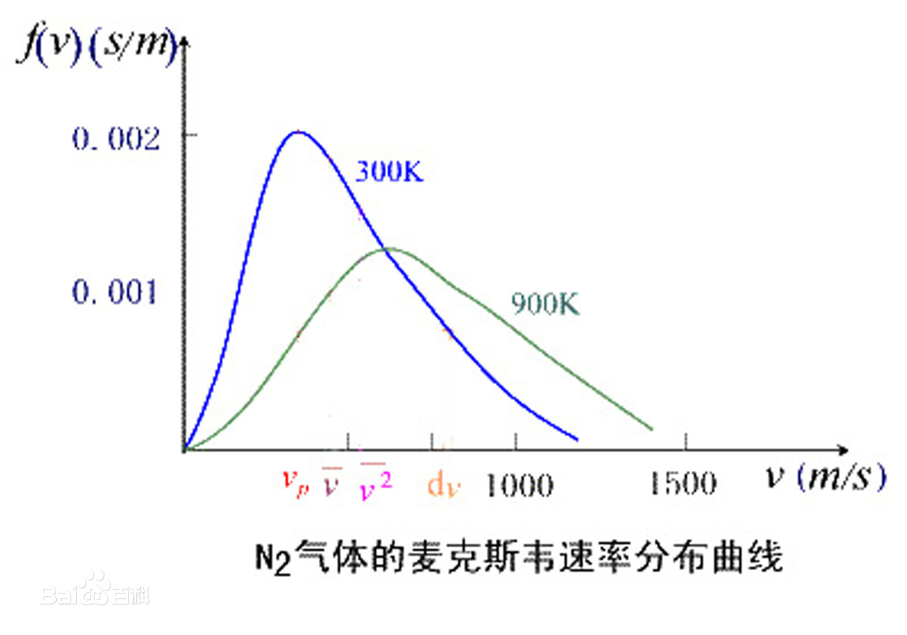

气体动理论是**统计物理学**的部分内容，那么是怎么体现统计的呢？

每个运动着的分子都有**大小、质量、速度、能量**等，这些用来表征个别分子性质的物理量的叫做**微观量**。一般在实验中测得是表征大量分子集体特征的量，叫做**宏观量**，气体的**温度、压强、热容等**就是宏观量。气体动理论就是运用统计方法，求出大量分子的某些微观量的统计平均值，并用以解释在实验中直接观测到的物体的宏观性质。

<!-- more -->

## 一、理想气体状态方程

$$
pV = \frac{m}{M}RT
$$

在这个公式里，需要三点需要强调：

- $\frac{m}{M}$ 不可以简写为 $n$ ，这是因为在这本教材里，$n$ 是**分子数密度**，不是分子的物质的量

- $M$ 是以 **Kg** 为单位的，所以需要比常见的化学单位制小三个数量级，不要在计算的时候出错

- $R$ 是**普适气体常量**，$R = 8.31J/(mol\cdot K)$​ 

  理想气体状态方程还有另一个形式，这个形式好像更加强调气体的**微观特征**。
  $$
  p = nkT
  $$
  其中：

  - $n$ 是分子数密度
  - $k$ 是**玻尔兹曼常量**，有 $k\cdot N_A = R$，$k = 1.38 *10^{-23}J/K$ 
  - 有 $k$ 出现的地方好像都很微观。

----

## 二、压强，平动动能与温度的关系

我们可以用统计规律推导出**压强与分子动能**的关系，有
$$
p = \frac{2}{3}n\bar{\varepsilon_k}
$$
这是一个**统计规律**，而不是一个**力学规律**。对于这个式子要多说几句，这个式子看似很**简洁本质**，但是你会发现，能够影响压强 $p$​ 的因素是多个，有**分子数密度**和**分子平均动能**，而且，分子数密度还是跟物质的量和体积两个变量有关，也就是说，这个式子很不本质，起码不简洁（这是一个新的概念）。我们能从这个式子能得出的最有效结论只有**压强跟分子密度和分子动能（或者温度）成一定的正相关**。只是一个直观认识。

当然再结合我们的理想气体状态方程，就会导出**动能和温度**的关系
$$
\bar{\varepsilon_k} = \frac{3}{2}kT
$$
这个公式好就好在，是一个单元的函数，这说明**气体的温度是气体分子平均平动动能的量度**。

上面这两个式子的推导，都用到了统计学的技巧。

---

## 三、自由度与内能

理想气体的内能不只包括**平动动能**还包括**转动动能**和**振动动能**。所谓的平动动能能，就是指我们之前算的 $v_x,v_y,v_z$ 算出的能量，一共是三份。所谓的**转动动能**是分子转动的能量。这个是因不同分子而异的，比如说单原子分子，就没有转动动能（一个球体现不出转动），对于双原子分子，就有两份转动动能（定轴转动），对于多原子分子，就有三份转动动能（定点转动）。所谓**振动动能**，就是同一个分子原子间的距离在原子间的相互作用下，会发生变化，分子内部会出现振动。

一般在低温的时候，只有平动起作用，在室温的时候，可能有平动和转动起作用，在高温的时候，可能有平动，转动，振动起作用。但是也要结合具体的**分子种类**进行考量。

为了更好的概括我们得到的统计规律，我们提出了**自由度**的概念，**即确定物体运动状态所需要的参量数**，平动因为是在三维空间中，所以是3个自由度，转动如果是定轴转动，那么是2个自由度，如果是定点转动，那么就是3个自由度。振动自由度也要考虑进去。自由度的符号为 $i $。

**能量按自由度均分定理**告诉我们：**在温度为 T 的平衡态下，气体分子任一自由度的平均动能都等于 $\frac{1}{2} k T$ **，但是需要注意的是，对于每个振动自由度，每个分子除了一份**平均振动动能**，还有一份**平均弹性势能**。

按照这个理论，我们有公式
$$
E_0 = N_A(\frac i 2 kT)=\frac i 2 RT
$$
这是 1 mol 理想气体内能的表达式。

需要注意的是，**理想气体**是没有**分子间势能**的。所以动能就是内能。这句话的意思就是，**理想气体的内能是温度的单值函数**，这个甚至可以作为理想气体的定义。

---

## 四、麦克斯韦速率分布律

最重要的一点，本节讨论的都是**速率**，也就是**速度**的模长，这是因为**速度**的均值一定是0。
$$
f(v) = 4\pi (\frac{m_0}{2\pi kT})^{\frac{3}{2}}\cdot e^{-\frac{m_0 v^2}{2kT}}\cdot v^2
$$

这是最基础的形式，其实只需要意识到这是一个 v 的一元函数就好了 $f(v) = a\cdot e^{-bv^2}\cdot v^2$​​ 。这个式子虽然形式复杂，但是其实他很简洁，因为是一个单变量函数。这个形式有点像黑体辐射的公式，都是有一个极大值点的**凸包**函数。

其本质是速度分量都是服从**正态分布**，而且彼此独立。
$$
v_x \sim N(0,\frac{kT}{m_0}),\quad v_y \sim N(0,\frac{kT}{m_0}),\quad v_z \sim N(0,\frac{kT}{m_0})
$$

这个分布律其实严格的说，应该是**概率密度分布函数**。也就是说，这是一个**概率论**的应用，可以看到下面求平均速率，就是在求期望，而求方均根速率，就是在二阶矩的平方根，方法都是相同的。

由这个式子，我们可以得出一些特殊的值
$$
\bar v = \int^\infty_0 vf(v)dv=\sqrt\frac{8RT}{\pi M} = 1.60\sqrt{\frac{RT}{M}}
$$

$$
\bar{v^2} = \int^\infty_0 v^2f(v)dv = \frac{3RT}{M}
$$

$$
v_{rms} = \sqrt{\bar {v^2}} = \sqrt\frac{3RT}{M} = 1.73\sqrt{\frac{RT}{M}}
$$
$$
v_p = \sqrt\frac{2RT}{M} = 1.41\sqrt{\frac{RT}{M}}
$$
其中，$v_p$ 是**最概然速率**，是用**求导**获得的，另外两个都可以用**分部积分**获得。

最概然速率的物理意义是，在一定的温度下，速度大小与 $v_p$ 相近的气体分子的百分率最大，也就是说，以相同的速率间隔来说，气体分子中的速率在 $v_p$ 附近的概率最大。它的物理意义是，在一定温度下，速度大小与 $v_p$ 相近的气体分子的百分率为最大。

为了估算一个狭窄区间的分子数百分比，可以将上式转换成另一种形式，即
$$
\frac{\Delta N}{N} = f(W)\Delta W = \frac{4}{\sqrt{\pi}}\cdot W^2 e^{-W^2}\Delta W
$$
其中 $W=\frac{v}{v_p}$​，其实就是**以直代曲**的思想。

其实上面的公式还不是最本质的公式，最本质的公式是
$$
\Delta N = n_0(\frac{m_0}{2\pi kT})^\frac 3 2 e^{-\frac{\varepsilon}{kT}}\Delta v_x \Delta v_y\Delta v_z\Delta x\Delta y\Delta z
$$
其中 $n_0$ 是某个基准点的气体分子密度。$\Delta N$ 是分子数。	 	

在麦克斯韦能量分布律中，将 $\varepsilon$ 视为 $\varepsilon_k$​ ，并且只对**位置分量**进行积分，就可以得到最上面的式子。

---

## 五、玻尔兹曼能量分布律

玻尔兹曼是将**速度量**进行积分，就可以得到玻尔兹曼分布律
$$
\Delta N = n_0 e^{-\frac{\varepsilon_p}{kT}}\Delta x\Delta y\Delta z
$$
注意这里的 $\varepsilon_p$ 是分子的势能，但是不是**分子间势能**，所以这依然是相对于理想气体而言的。将其转换为更常见的形式（结合重力势能表达式）
$$
n = n_0e^{-\frac{m_0gz}{kT}}
$$
如果再结合 $p = nkT$ 就可以得到
$$
p = p_0e^{-\frac{Mgz}{RT}}
$$
这个用宏观量压强 $p$ 代替分子数密度 $n_0$ 的操作之后还有，这可能是一种思想吧。

## 六、分子碰撞和自由程

自由程的意思就是分子没发生与其他分子碰撞的路程，也就是每两次连续碰撞间分子自由运动的平均距离（注意这里也是用到了统计的思想）。当自由程变大的时候，说明要么是碰撞频率减少了，要么是分子运动速度快了。平均自由程的符号用 $\bar{\lambda}$ 表示。

为了计算平均自由程，我们首先要计算**平均碰撞频率**，计算它的思想就是假设除一个分子外的其他分子都静止不动，只有那一个分子一平均相对速度 $\bar{v_r}$ ，那么每秒这个运动的分子扫过的体积就可以求出来，然后在这个体积内的其他分子数目也可以求出来，这些其他分子都是会被碰撞到的，所以其数目就是平均碰撞频率。我们有公式
$$
\bar{Z} = \pi d^2 \bar{v_r} n
$$
我们又有**平均相对速率**与**平均速率**的关系：
$$
\bar{v_r} = \sqrt2 \bar{v}
$$
于是就可以推导出来了，我们之所以再次进行变换，引入压强 $p$ ，可能是因为压强是一个宏观量
$$
\bar Z = \sqrt2 \pi d^2 \bar v n =\sqrt2 \pi d^2 \bar v \frac{p}{kT}
$$

$$
\bar\lambda = \frac{\bar{v}}{\bar{Z}}=\frac{kT}{\sqrt{2}\pi d^2 p}
$$

可以看出，当温度一定的时候，$\bar{\lambda}$ 与 $p$ 成反比，压强越小，则平均自由程越长。

当分子相距极近的时候，他们之间的相互作用力是斥力，分子间的相互斥力开始起显著作用的时候，两分子质心间的最小距离的平均值就是 $d$ 。所以 $d$ 叫做分子的有效直径。
