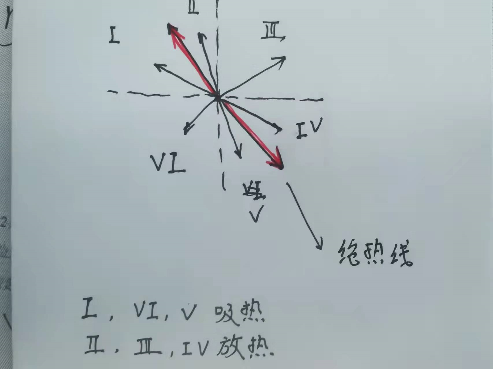

热力学仅从**能量观念**出发，研究热力学系统状态变化中**热功转换**（两种过程能量）的关系与条件。

热力学定律的意义

- 第零定律：热平衡定律，定义了**温度**的概念。
- 第一定律：包括热现象在内的能量守恒与**转化**（转化的思想容易被忽视）定律，指明了热力学过程中热功转化之间的数量关系。
- 第二定律：熵增定律，指明了热力学过程进行的**方向与条件**。
- 第三定律：指明绝对零度不可到达。

<!-- more -->

## 一、热力学第一定律

### 1.1 定律内容

热力学第一定律写作：
$$
Q = \Delta E + \int^{V_2}_{V1}pdV
$$
这里需要有以下几点解释：第一，Q如果是正的，那么就是系统吸热，反之，则是系统放热。第二、做功A如果是正的，那么是系统对外做功，反之，则是系统被做功，与Q是相反的，之所以写成这样，是因为这是一个由1到2的过程。第三，只有E是一个**状态函数**（$Q，\Delta E$ 都是与**过程**息息相关），他是一个状态函数的原因是他是**温度的单值函数**，而温度是一个**状态量**，有以下关系：
$$
E_0 =\frac i 2 RT
$$
但是需要注意的时，在这一节中，还有一个公式写成
$$
E_0 =C_{V,m}T
$$
上面两个式子其实是一个式子，因为有 $C_{V,,m} = \frac{i}{2}R$ 。正因为如此，下面这个本来由**等体过程**推导出来的式子，可以用来计算任何过程的 $\Delta E$ 。这本质是因为这是一个状态函数，才有了这种神奇的性质。

### 1.2 公式计算

在热力学第一定律的公式中，可以看出 $\Delta E$ 的计算相对固定（也就是利用**温度**进行计算），而Q是没有其他公式可以与之关联的，所以要计算Q，就要算 $\Delta E$ 和做功A，那么A又是积分，所以总的来说，就是在处理A的积分，同时，A的积分还对应了**p-v图的面积**，正负由起始与终止描述。对于A的描述，我们一般会获得一个**过程方程**，这个过程方程在p-v图上对应一条线，气体状态就沿这条线变化，这个方程一般作为解题的重要条件。

我们在具体处理的时候，因为有理想气体状态方程，所以我们经常进行**换元积分**。

### 1.3 热功转换

我平时很喜欢从右往左看这个公式，就是说将内能和功视为**因**，吸放热视为**果**，这其实是不对的，这个公式写成这个样子（我说的其他样子是通过移项得到的），是因为它描述的是**热机**。左侧是因，右侧是果。

热机的意思是**将热量转化成功的机器**。热机吸收热量，但是却不能完全转化为对外作功，这是因为有一部分热量被用来使热机自身的温度升高了，这就是这个公式的意思，它指出了吸收的热量的两个去处。用这个角度理解，就可以明确的知道正负的含义了。

在系统状态变化的过程中，功与热的转化不可能是直接的，而是通过物质系统来完成的。向系统传递热量可使系统的内能增加，再由系统内能减少对外做功；或者外界对系统做功，使系统内能增加，再由内能减少，系统对外界传递能量。

所谓的第一类永动机说的就是如果 $Q = 0$ 的情况下，依然可以对外做功，这显然是不可能的。

---

## 二、准静态过程

### 2.1 等体过程

等体过程的意思就是吸收的热量全部转化为内能，而不对外做功，有
$$
\delta Q = \frac{m}{M}C_{V,m}dT
$$

$$
C_{V,m} = \frac{i}{2}R
$$

其中 $C_{V,m}$ 是**定容热容**，角标的 $V$ 表示是等体过程，而 $m$ 表示是 1 $molor$ .

### 2.2 等压过程

等压过程的意思是吸收的热量不仅转化为热能，而且还有一部分转化为对外做功，不仅转化为对外做功，而且还是以等压的形式对外做功。这就表示做功的积分求法很容易。

有**迈耶公式**
$$
C_{p,m} = C_{V,m} + R = \frac{i+2}{2}R
$$
再引入绝热系数的概念：
$$
\gamma = \frac{i+2}{i}
$$

### 2.3 等温过程

有做功
$$
A = \frac{m}{M}RTln\frac{V_2}{V_1}=\frac{m}{M}RTln\frac{p_1}{p_2}
$$
这里回顾一下，对于一个指定气体的状态，有三个**状态变量**，只要知道了其中的两个，**确定整个状态**。

这其实就是个**双曲线积分**，过程函数与状态曲线**重合**了。

### 2.4 绝热过程

有重要**过程方程**
$$
pV^\gamma =const
$$
这个公式不太好推导，所以最好记住，这是一条比**等温线**更加陡峭的曲线。关于这个结论，有如下推导。首先推导等温线的斜率，有
$$
pV = C_1,\quad \frac{dp}{dV} = -\frac{C_1}{V^2} = -\frac{pV}{V^2} = -\frac{p}{V}
$$
然后推导绝热线的斜率
$$
pV^{\gamma} = C_2,\quad \frac{dp}{dV} = -\gamma\frac{C_2}{V^{\gamma+1}} = -\gamma\frac{p}{V}
$$
可以看出，绝热线的斜率更大。

当我们有了这个式子以后，在结合**理想气体状态方程**，可以推导出其他的等式
$$
pV = \frac{m}{M}RT
$$
上下两式直接做比，就可以得到
$$
TV^{\gamma-1} = const^\prime
$$
其他等式推导类似。

### 2.5 多方过程

介绍多方过程主要是为了引出一个重要的二级结论：**“绝热线是区分吸放热的界限，在足够短的一段过程中，在绝热线以下的简单过程（即没有圆之类的）是放热的，在绝热线以上的简单过程是吸热的。（图里写反了）”**。如果用图像表示，即

关于这个定理的证明，需要用到**多方过程**的结论。

多方过程描述的是一小段足够短的过程，他可以用方程来描述
$$
pV^{n} = const
$$
其在 $(p,V)$ 处的斜率是 $n\frac{p}{V}$。

其中 $n$ 被称为多方指数，然后我们有它的摩尔热容是（已知定理）
$$
C_{n,m} = C_{V,m} + \frac{R}{1 - n}
$$
显然，如果这个值是个正数，那么就是吸热，反之，则是放热，讨论 $V$ 区域，可以看到 $V$ 区域的斜率要大于绝热线，所以有 $n>\frac{i+2}{i}$ ，那么可以知道
$$
C_{n,m} = C_{V,m} + \frac{R}{1 - n} > C_{V.m} - \frac{i}{2}R = 0
$$
升高温度需要吸热，而 $V$ 区域变化是像下降温度去的，所以是**放热**。

---

## 三、循环过程

### 3.1 循化过程

一个热力学系统从某一个状态出发，经过一系列变化过程，最后又回到了初始状态。这样的一个过程称为**循环过程**。

系统沿闭合曲线顺时针方向的循化称为**正循环**，做正循环的设备叫做**热机**，它从高温热源吸收热量，对外做功并且对低温热源放热。系统沿闭合曲线逆时针方向的循环称为**逆循环**，做逆循环的设备叫做**制冷机**，他从低温热源吸收热量，外界对其做功，最终对高温热源放热。

循环过程的一个特征是**系统经历一个循环后内能不变**，也就是说，系统吸收的净热量等于系统对外所做的净功。有
$$
\Delta E = 0,\quad Q = A
$$

### 3.2 热机与制冷机

对于热机来说，要从高温热源吸收热量，这个热量会转化为向低温热源传递的热量和对外做的功。所以有等式
$$
Q_1 = A + Q_2
$$
那么**热机效率**应该看的是热能比值，即
$$
\eta=\frac{A}{Q_1} = \frac{Q_1 - Q_2}{Q_1} = 1 - \frac{Q_2}{Q_1}
$$
对于制冷剂而言，要对制冷剂**做功**，使其能够从低温热源吸收热量 $Q_2$ ，并将热量传导给高温热源 $Q_1$ ，所以有等式
$$
Q_2  + A = Q_1
$$
对于效率，人们一点也不关心垃圾桶（在热机中是低温热源，制冷机是高温热源）。人们只关心自己的**投入**和**产出**，所有的效率都是产出比投入。对于制冷系数，有
$$
\omega=\frac{Q_2}{A} = \frac{Q_2}{Q_1 - Q_2}
$$

### 3.3 卡诺循环

卡诺循环是一种具有**最高效率**的理想循环。他的循环如图

我们先来直观的感受一下他为啥是最高效的，我将热机分为两个功能，一个是**工作**：在高温热源处的吸热膨胀或者在低温热源处的放热收缩，这是热机的**本职工作**，另一个是**衔接**：也就是说，热质在工作的时候会有一个温度的变化，那么就需要一个过程来完成从高温到低温，再由一个过程完成由低温到高温。

对于工作的过程，肯定是**等温过程**最好，这是因为只有等温过程吸收的热量全部转换为了功，而不会使内能增加。对于衔接过程，肯定是绝热过程最好，因为绝热过程保证了热量不会逸散，也就是说，由于温度下降导致的内能减少，全部用作了对外做功。以**奥托循环**（现实热机循环）做比

因为用的是等压过程，所以一部分的内能转换为热能，就有所损失。

在卡诺循环中，经过复杂的推导（所以就不列了）有恒等关系
$$
\frac{Q_1}{T_1} = \frac{Q_2}{T_2}
$$
这其实也是**可逆过程**的熵恒等。

----

## 四、热力学第二定律

### 4.1 热力学第二定律

一切与热现象有关的实际宏观过程都是不可逆的。

有一个有意思的表述：**两条绝热线不能相交**。因为这样就可以让两条绝热线，一条等温线构成一个循环，这样热机的效率就是 100% 了。

### 4.2 卡诺定理

- 在同样的高低温热源之间工作的一切可逆机，其效率都是 $1 - \frac{T_2}{T_2}$。
- 在同样的高低温热源之间工作的一切不可逆机，效率不可能高于可逆机。

### 4.3 可逆过程与熵

设存在一个过程，使物体从状态 A 变为状态 B，对它来说，如果存在另一个过程，它不仅使物体反向变化，从状态 B 变为状态 A，而且当物体回到状态 A 的时候，周围的一切各自恢复到原状，则从状态 A 进行到状态 B 的过程是一个可逆过程。

需要注意的是，**可逆**只是过程的一种性质，可逆过程不需要一定是一个**循环过程**。

只有非常缓慢的亦即**准静态的**膨胀/压缩过程，才是可逆的膨胀/压缩过程。所有的宏观热现象都是不可逆的。

对于熵，我们有这样的一种算法
$$
S_2 - S_1 = \int^2_1(\frac{\delta Q}{T})_{可逆}
$$
其中 $\delta Q$ 是在各无限短的过程中吸收的微小热量。有趣的是，尽管熵是一个状态量，但是其计算依赖于这个过程一定要是一个可逆过程。否则这个公式就不能应用。比如我们在计算气体自由膨胀的时候，这个式子就不能用了，需要我们将这个过程转换为一个等温膨胀才能够使用。

所以我们又提出了**玻尔兹曼关系**作为补充，有
$$
S = k\ln W
$$
其中 $W$ 是系统所包含的微观状态数，被称为**热力学概率**。