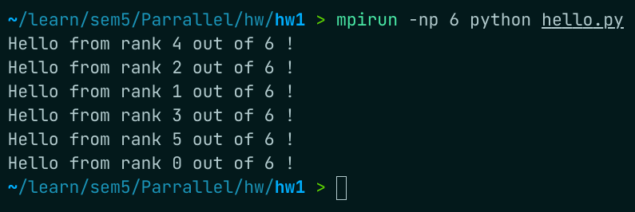
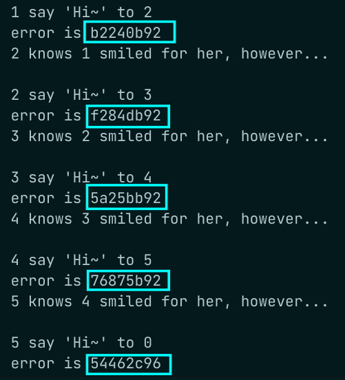
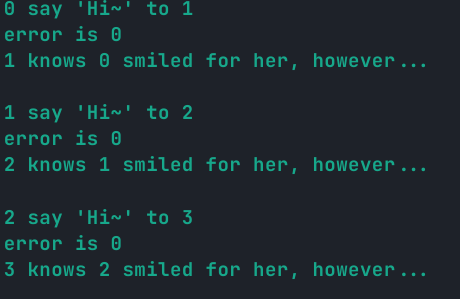
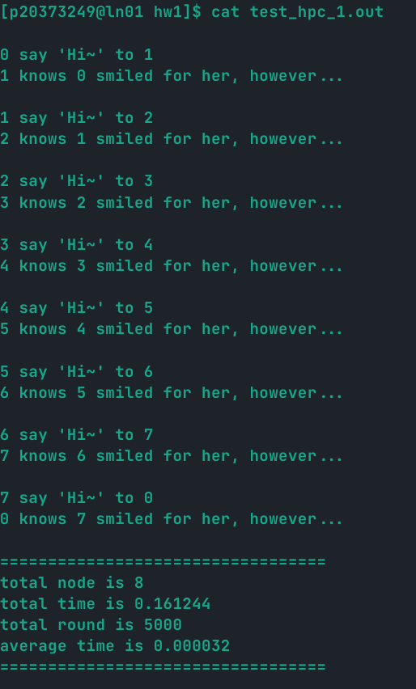
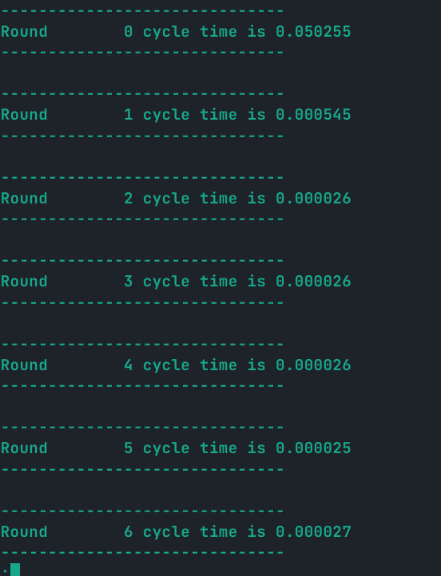
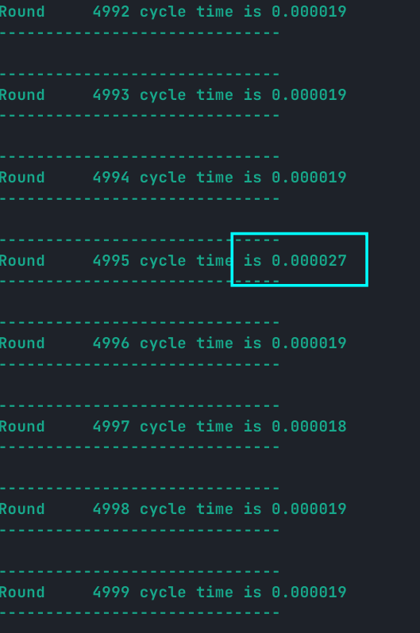
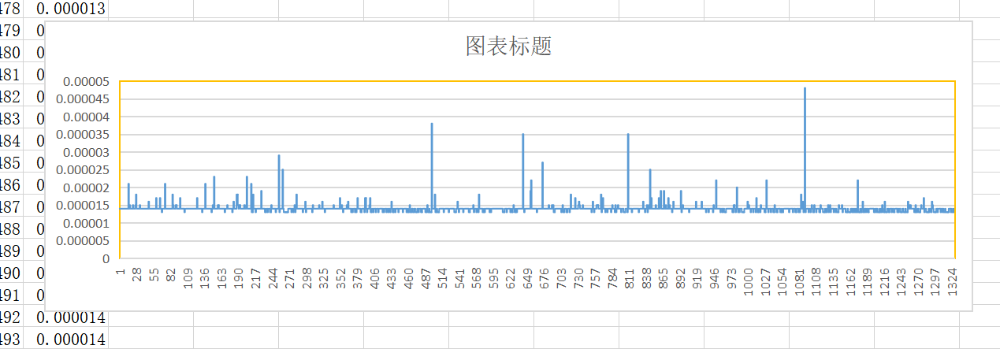

# hw1: Ring 实验报告

## 一、个人信息

| 条目 | 信息     |
| ---- | -------- |
| 姓名 | Thysrael |
| 学号 | xxxxxxx  |
| 学院 | xxxxxx   |

---


## 二、题目分析

本题是让多个进程**依次**接收和发送信息，最终形成一个消息传递的闭环。

在程序设计方面，采用不太明显的**主从模式**，第 0 个进程作为主进程，首先发送信息，然后接收。而对于从进程，首先接受信息，其次发送信息，最后循环时间等信息由主进程进行汇总统计。信息考虑到必须依次传递，所以在消息传递的过程中采用阻塞传递的方式，这样可以保证顺序的依次执行。

----


## 三、代码实现

### 3.1 多种语言

采用 CPP 和 C 实现。采用两种语言分别实现的原因是验证**“是一个跨语言的通讯协议”**的观点。最终两种程序都可以在本地和实验平台进行运行。

在本地的时候，我采用的是 `mpicc, mpic++` 两款编译器，具体的编译指令如下

```shell
mpic++ -o ring ./ring.cpp
mpicc -o ring ./ring.c 
```

运行指令都是相同的，即

```shell
mpirun -np 6 ./ring
```

在计算平台上面，编译采用的编译器都是 `mpiicc` 可以编译两种语言。运行采用的是 `mpiexe` ，据我的调研，`mpiexe, mpirun` 没有本质区别。

后来了解到 `python` 也有很好的库用于实现 MPI，所以又试了试 python 版的 `HelloWorld` 程序，如下所示

```python
from mpi4py import MPI
comm = MPI.COMM_WORLD

print("Hello from rank %d out of %d !" %(comm.rank, comm.size))
```

在终端中运行

```shell
mpirun -np 6 python hello.py
```

结果如图所示



### 3.2 计时的实现

在 ring 中的每个节点基本上是等价的，在一次循环中，每个节点从发送信息到接受信息的时间间隔是一样的，所以可以任选一个节点进行时间的测量，为了方便，选择了 0 号进程。实现如下

```cpp
// 在主进程进行计时，开始时间
double start_time = MPI_Wtime();

// ....

// 结束时间
double end_time = MPI_Wtime();
// 本轮时间间隔
double time_gap = end_time - start_time;
```

为了避免偶然因素，所以进行了多轮的测量，最后累加起来求平均值，所以在多轮测量的外部，有一个变量负责记录总的时间间隔，最后计时的架构如下所示

```cpp
int main(int argv, char *argc[])
{
 	...
    // 总的运行时间
    double total_time = 0;
    for (int i = 0; i < ROUND; i++)
    {
        // 每次运行开始时同步一次，保证计时准确
        MPI_Barrier(MPI_COMM_WORLD);  /* 调用函数时进程将处于等待状态，直到通信子中所有进程都调用了该函数后才继续执行 */
        // 主进程
        if (my_id == 0)
        {
            // 在主进程进行计时，开始时间
            double start_time = MPI_Wtime();
            ....
            // 结束时间
            double end_time = MPI_Wtime();
            // 本轮时间间隔
            double time_gap = end_time - start_time;
            // 总时间加上二者之差
            total_time += time_gap;
			...
        }
        // 从进程
        else
        {
            
            ....
        }
    }

    // 最终在主进程进行消息的汇总，输出总运行时间及轮平均时间等信息
    if (my_id == 0)
    {
        printf("total time is %lf\n", total_time);
        printf("total round is %d\n", ROUND);
        printf("average time is %lf\n", total_time / ROUND);
    }
	...
    return 0;
}
```

### 3.3 环传递的实现

正如第二章的分析，我们需要用**阻塞消息传递**来实现环形传递，所以我们要使用 `MPI_Send` 和 `MPI_Recv` 两个函数来实现。

对于主进程，需要先发出信息，然后接收信息。而对于从进程，要先接收信息，然后发送信息，具体如下所示

```cpp
// 主进程
// 发送信息
send_message_to_next(my_id, size, i);
// 接收信息
recive_message_from_pre(my_id, size, i);

// 从进程
// 接收信息
recive_message_from_pre(my_id, size, i);
// 发送信息
send_message_to_next(my_id, size, i);
```

在代码细节方面，用两个函数封装了 `MPI_Send, MPI_Recv` 操作，如下所示

```cpp
/**
 * @brief 首先制造包含 source 和 destination 的信息 
 * 利用 MPI_Send 向其后的节点发送这条信息
 * @arg my_id 当前节点的 rank
 * @arg size，全部节点的个数  
 * @arg round，进行的轮数
 */
void send_message_to_next(int my_id, int size, int round)
{
    // 缓存要传输的信息
    char message[MESSAGE_LEN];
    // 利用 sprintf 制造要发送的信息
    sprintf(message, "\n%d say 'Hi~' to %d", my_id, next(my_id, size));
    // 只有 display 为 0 的时候
    if (!round)
    {
        printf("%s\n", message);
    }

    // 利用 MPI_Send 向其后的节点发送这条信息
    MPI_Send(
        message,               // message buffer
        MESSAGE_LEN,           // message length
        MPI_CHAR,              // message type
        next(my_id, size),     // message dst
        MESSAGE_TAG,           // message tag
        MPI_COMM_WORLD         // message communicator
    );
}

/**
 * @brief 利用 MPI_Recv 接受前一节点发送的信息
 * 并且利用 MPI_Status 校验信息
 * @arg my_id 当前节点的 rank
 * @arg size，全部节点的个数  
 * @arg round，进行的轮数
 */
void recive_message_from_pre(int my_id, int size, int round)
{
    // 缓存要接收的信息
    char message[MESSAGE_LEN];
    // 用于获得消息接收后的状态
    MPI_Status status;

    // 利用 MPI_Recv 接受前一节点发送的信息
    MPI_Recv(
        message,               // message buffer
        MESSAGE_LEN,           // message length
        MPI_CHAR,              // message type
        pre(my_id, size),      // message dst
        MESSAGE_TAG,           // message tag
        MPI_COMM_WORLD,        // message communicator
        &status                // communicate status
    );

    if (!round)
    {
        printf("error is %x\n", status.MPI_ERROR);
        // printf("source is %d\n", status.MPI_SOURCE);
        printf("%d knows %d smiled for her, however...\n", my_id, status.MPI_SOURCE);
    }
}
```

### 3.4 MPI_Status

`MPI_Status` 作为**信息接收者**可以利用的一个传递信息，用于显示这次消息传递的各个参数。如果没有使用需求的话，可以直接使用 `mpi.h` 中定义的宏 `*MPI_STATUS_IGNORE` 来占位。

本着给了就要用的思想，我对于 `MPI_Status` 做了初步调研，其在 `mpi.h` 库中如下

```cpp
typedef struct _MPI_Status {
  int count;		// 收到的条目数
  int cancelled;	// 指示是否取消了相应的请求
  int MPI_SOURCE;	// 消息的源
  int MPI_TAG;		// 消息的标记值
  int MPI_ERROR;	// 与消息关联的错误
} MPI_Status, *PMPI_Status;
```

其中我主要利用了 `MPI_SOURCE, MPI_ERROR` 两个

```cpp
printf("source is %d\n", status.MPI_SOURCE);	// 获得消息的源
printf("error is %x\n", status.MPI_ERROR);		// 获得错误码
```

其中 `SOURCE` 正常工作，但是 `ERROR` 作为错误码，即使正常运行，但是也会出现随机数（可能也不那么随机），如下所示



我找不到具体原因，只找到相关文献说 `STATUS_ERROR` 在阻塞通信中没有意义

> [MPI_ERROR](https://rookiehpc.github.io/mpi/docs/mpi_error/index.html) is the member of the [MPI_Status](https://rookiehpc.github.io/mpi/docs/mpi_status/index.html) structure that contains the error code of the corresponding receive operation. Although in practice it has no use for a blocking receive ([MPI_Recv](https://rookiehpc.github.io/mpi/docs/mpi_recv/index.html)) since the error code is returned directly by the routine, it does have uses for its non-blocking counterpart ([MPI_Irecv](https://rookiehpc.github.io/mpi/docs/mpi_irecv/index.html)) where the [MPI_Status](https://rookiehpc.github.io/mpi/docs/mpi_status/index.html) cannot be obtained until the [MPI_Request](https://rookiehpc.github.io/mpi/docs/mpi_request/index.html) collected is waited on ([MPI_Wait](https://rookiehpc.github.io/mpi/docs/mpi_wait/index.html), [MPI_Waitall](https://rookiehpc.github.io/mpi/docs/mpi_waitall/index.html), [MPI_Waitany](https://rookiehpc.github.io/mpi/docs/mpi_waitany/index.html), [MPI_Waitsome](https://rookiehpc.github.io/mpi/docs/mpi_waitsome/index.html)) or tested ([MPI_Test](https://rookiehpc.github.io/mpi/docs/mpi_test/index.html), [MPI_Testall](https://rookiehpc.github.io/mpi/docs/mpi_testall/index.html), [MPI_Testany](https://rookiehpc.github.io/mpi/docs/mpi_testany/index.html), [MPI_Testsome](https://rookiehpc.github.io/mpi/docs/mpi_testsome/index.html)).

然后在 `mpi4py` 中实践，发现成功错误码python是 `0`

```python
>>> from mpi4py import MPI
>>> print(MPI.SUCCESS)
0
```
后记，在我不知道改了啥之后，似乎 `error_code` 在成功情况下又变成了 `0`



## 四、实验成果

### 4.1 基本成果

| 条目         | 内容      |
| ------------ | --------- |
| 节点数       | 8         |
| CPU 数       | 8         |
| 运行轮数     | 5000      |
| 总运行时间   | 0.161244s |
| 每轮运行时间 | 0.000032  |

运行截图：



### 4.2 冷启动和溢出猜想

如果打印每一轮的测试信息，就会发现两个有趣的现象：

- 前几轮的时间会明显很大。
- 时间在趋于平稳后会有周期性（待定）的长时间传递出现

如图所示：



从上图可以看出前几个周期明显要长很多。



从这里可以看出会出现一个“尖刺”。如果绘图（感谢陈凝香的图表）：



可以更加明显的观测到这种现象。

在于小组同学商讨后，我个人倾向于这样的一种解释：这可能与某种“高速缓存机制（cache）”有关，对于一开始，位于路由中或者其他关键节点的高速缓存存在常见的“冷启动”现象，需要填充缓存来达到增加命中率的目的，而这个过程会伴随这缺失的代价，这就导致一开始的时候的缓慢，而之后的周期性缓慢，可能是 cache 中某一缓存行被换出的过程，当一个缓存行被换出，需要发生一次缺失，才能更新 cache，这就导致了一次长的周期。

当然也可能就是普通的网速问题，具组内某同学说，这个一点也不周期，我就是在强行解释，嗯嗯，有道理。

---


## 五、附录

### 5.1 C 实现

```c
#include<stdio.h>
#include<string.h>
#include<stdlib.h>
#include"mpi.h"

// 循环次数，即消息传递多少轮
#define ROUND 5000
// 发送消息的长度
#define MESSAGE_LEN 256
// 消息标签，为消息的标识符
#define MESSAGE_TAG 314

// 用于计算在环形结构中下一节点的 id
int next(int cur, int size)
{
    return (cur + 1) % size;
}

// 用于计算在环形结构中上一节点的 id
int pre(int cur, int size)
{
    return (cur + size - 1) % size;
}

/**
 * @brief 首先制造包含 source 和 destination 的信息 
 * 利用 MPI_Send 向其后的节点发送这条信息
 * @arg my_id 当前节点的 rank
 * @arg size，全部节点的个数  
 * @arg round，进行的轮数
 */
void send_message_to_next(int my_id, int size, int round)
{
    // 缓存要传输的信息
    char message[MESSAGE_LEN];
    // 利用 sprintf 制造要发送的信息
    sprintf(message, "\n%d say 'Hi~' to %d", my_id, next(my_id, size));
    // 只有 display 为 0 的时候
    if (!round)
    {
        printf("%s\n", message);
    }

    // 利用 MPI_Send 向其后的节点发送这条信息
    MPI_Send(
        message,               // message buffer
        MESSAGE_LEN,           // message length
        MPI_CHAR,              // message type
        next(my_id, size),     // message dst
        MESSAGE_TAG,           // message tag
        MPI_COMM_WORLD         // message communicator
    );
}

/**
 * @brief 利用 MPI_Recv 接受前一节点发送的信息
 * 并且利用 MPI_Status 校验信息
 * @arg my_id 当前节点的 rank
 * @arg size，全部节点的个数  
 * @arg round，进行的轮数
 */
void recive_message_from_pre(int my_id, int size, int round)
{
    // 缓存要接收的信息
    char message[MESSAGE_LEN];
    // 用于获得消息接收后的状态
    MPI_Status status;

    // 利用 MPI_Recv 接受前一节点发送的信息
    MPI_Recv(
        message,               // message buffer
        MESSAGE_LEN,           // message length
        MPI_CHAR,              // message type
        pre(my_id, size),      // message dst
        MESSAGE_TAG,           // message tag
        MPI_COMM_WORLD,        // message communicator
        &status                // communicate status
    );

    if (!round)
    {
        printf("error is %d\n", status.MPI_ERROR);
        // printf("source is %d\n", status.MPI_SOURCE);
        printf("%d knows %d smiled for her, however...\n", my_id, status.MPI_SOURCE);
    }
}

int main(int argv, char *argc[])
{
    int size, my_id;
    // 初始化 MPI
    MPI_Init(&argv, &argc);
    // 获取总结点数
    MPI_Comm_size(MPI_COMM_WORLD, &size);
    // 获取本节点 id
    MPI_Comm_rank(MPI_COMM_WORLD, &my_id);

    // 总的运行时间
    double total_time = 0;

    for (int i = 0; i < ROUND; i++)
    {
        // 每次运行开始时同步一次，保证计时准确，可能没有什么必要，因为 send-recive 模型是阻塞的
        MPI_Barrier(MPI_COMM_WORLD);  /* 调用函数时进程将处于等待状态，直到通信子中所有进程都调用了该函数后才继续执行 */
        
        // 主从模式的一种体现，0 号进程作为主进程，担任了先发送信息，后接受信息的职责，与其他的进程不同
        // 也就是说，0 号进程是主进程，ring 结构并不完全对称
        if (my_id == 0)
        {
            // 在主进程进行计时，开始时间
            double start_time = MPI_Wtime();
            // 发送信息
            send_message_to_next(my_id, size, i);
            // 接收信息
            recive_message_from_pre(my_id, size, i);
            // 结束时间
            double end_time = MPI_Wtime();
            // 总时间加上二者之差
            total_time += (end_time - start_time);
        }
        // 其他进程作为从进程，负责先接受信息，后发送信息的职责
        else
        {
            // 接收信息
            recive_message_from_pre(my_id, size, i);
            // 发送信息
            send_message_to_next(my_id, size, i);
        }
    }

    // 最终在主进程进行消息的汇总，输出总运行时间及轮平均时间等信息
    if (my_id == 0)
    {
        printf("\n==================================\n");
        printf("total node is %d\n", size);
        printf("total time is %lf\n", total_time);
        printf("total round is %d\n", ROUND);
        printf("average time is %lf\n", total_time / ROUND);
        printf("==================================\n\n");
    }

    // 结束通信
    MPI_Finalize();

    return 0;
}
```

### 5.2 CPP 实现

```cpp
#include<cstdio>
#include<cstring>
#include<cstdlib>
#include"mpi.h"

using namespace std;

// 循环次数，即消息传递多少轮
const int ROUND = 5000;
// 发送消息的长度
const int MESSAGE_LEN = 256;
// 消息标签，为消息的标识符
const int MESSAGE_TAG = 314;

// 用于计算在环形结构中下一节点的 id
inline int next(int cur, int size)
{
    return (cur + 1) % size;
}

// 用于计算在环形结构中上一节点的 id
inline int pre(int cur, int size)
{
    return (cur + size - 1) % size;
}

/**
 * @brief 首先制造包含 source 和 destination 的信息 
 * 利用 MPI_Send 向其后的节点发送这条信息
 * @arg my_id 当前节点的 rank
 * @arg size，全部节点的个数  
 * @arg round，进行的轮数
 */
void send_message_to_next(int my_id, int size, int round)
{
    // 缓存要传输的信息
    char message[MESSAGE_LEN];
    // 利用 sprintf 制造要发送的信息
    sprintf(message, "\n%d say 'Hi~' to %d", my_id, next(my_id, size));
    // 只有 display 为 0 的时候
    if (!round)
    {
        printf("%s\n", message);
    }

    // 利用 MPI_Send 向其后的节点发送这条信息
    MPI_Send(
        message,               // message buffer
        MESSAGE_LEN,           // message length
        MPI_CHAR,              // message type
        next(my_id, size),     // message dst
        MESSAGE_TAG,           // message tag
        MPI_COMM_WORLD         // message communicator
    );
}

/**
 * @brief 利用 MPI_Recv 接受前一节点发送的信息
 * 并且利用 MPI_Status 校验信息
 * @arg my_id 当前节点的 rank
 * @arg size，全部节点的个数  
 * @arg round，进行的轮数
 */
void recive_message_from_pre(int my_id, int size, int round)
{
    // 缓存要接收的信息
    char message[MESSAGE_LEN];
    // 用于获得消息接收后的状态
    MPI_Status status;

    // 利用 MPI_Recv 接受前一节点发送的信息
    MPI_Recv(
        message,               // message buffer
        MESSAGE_LEN,           // message length
        MPI_CHAR,              // message type
        pre(my_id, size),      // message dst
        MESSAGE_TAG,           // message tag
        MPI_COMM_WORLD,        // message communicator
        &status                // communicate status
    );

    if (!round)
    {
        // printf("error is %x\n", status.MPI_ERROR);
        // printf("source is %d\n", status.MPI_SOURCE);
        printf("%d knows %d smiled for her, however...\n", my_id, status.MPI_SOURCE);
    }
}

int main(int argv, char *argc[])
{
    int size, my_id;
    // 初始化 MPI
    MPI_Init(&argv, &argc);
    // 获取总结点数
    MPI_Comm_size(MPI_COMM_WORLD, &size);
    // 获取本节点 id
    MPI_Comm_rank(MPI_COMM_WORLD, &my_id);

    // 总的运行时间
    double total_time = 0;

    for (int i = 0; i < ROUND; i++)
    {
        // 每次运行开始时同步一次，保证计时准确，可能没有什么必要，因为 send-recive 模型是阻塞的
        MPI_Barrier(MPI_COMM_WORLD);  /* 调用函数时进程将处于等待状态，直到通信子中所有进程都调用了该函数后才继续执行 */
        
        // 主从模式的一种体现，0 号进程作为主进程，担任了先发送信息，后接受信息的职责，与其他的进程不同
        // 也就是说，0 号进程是主进程，ring 结构并不完全对称
        if (my_id == 0)
        {
            // 在主进程进行计时，开始时间
            double start_time = MPI_Wtime();
            // 发送信息
            send_message_to_next(my_id, size, i);
            // 接收信息
            recive_message_from_pre(my_id, size, i);
            // 结束时间
            double end_time = MPI_Wtime();
            // 本轮时间间隔
            double time_gap = end_time - start_time;
            // 总时间加上二者之差
            total_time += time_gap;
            printf("\n------------------------------------\n");
            printf("Round %5d cycle time is %lf\n", i, time_gap);
            printf("------------------------------------\n");

        }
        // 其他进程作为从进程，负责先接受信息，后发送信息的职责
        else
        {
            // 接收信息
            recive_message_from_pre(my_id, size, i);
            // 发送信息
            send_message_to_next(my_id, size, i);
        }
    }

    // 最终在主进程进行消息的汇总，输出总运行时间及轮平均时间等信息
    if (my_id == 0)
    {
        printf("\n==================================\n");
        printf("total node is %d\n", size);
        printf("total time is %lf\n", total_time);
        printf("total round is %d\n", ROUND);
        printf("average time is %lf\n", total_time / ROUND);
        printf("==================================\n\n");
    }

    // 结束通信
    MPI_Finalize();

    return 0;
}
```

### 5.3 提交脚本自动化

 虽然提交可以有脚本，但是提交脚本本身却需要自己编写，十分的不自动，所以我又重新自己写了一份 `python` 脚本，可以根据需求自动生成提交脚本，并且完成自动编译和提交工作

`makefile` 文件

```python
SHELL:=/bin/bash

all:
	module load intel/19.0.5.281; \
	python3 ./auto.py
clean:
	rm *.err *.out machinefile* script
```

`auto.py` 文件

```python
import os 
import time

src_name = input("the Source File: ")
batch_name = input("the Name of this Batch (default name is src file name): ") or src_name.split('.')[0]
partition = input("the Partition (default partition is cpu-quota): ") or "cpu-quota"
node_num = input("the Number of Nodes (default num is 4): ") or "4"
core_num = input("the Number of Core (default num is 32): ") or "32"
clear_machinefile = input("Clear Machinefile[y/n] (default is 'y'): ") or 'y'
clear_machinefile = True if clear_machinefile == 'y' else False

os.system('mpiicc -o ' + batch_name + " ./" + src_name)

# fb = open("script", 'w', encoding="utf-8")
with open(file="script",mode="w",encoding="utf-8") as fb:
    fb.write('#!/bin/bash\n\n')

    fb.write('#SBATCH -J ' + batch_name + "\n")
    fb.write('#SBATCH -p ' + partition + "\n")
    fb.write('#SBATCH -N ' + node_num + '\n')
    fb.write('#SBATCH -n ' + core_num + '\n')
    fb.write('#SBATCH -o ' + batch_name + '.out\n')
    fb.write('#SBATCH -e ' + batch_name + '.err\n\n')

    fb.write('srun hostname | sort > machinefile.${SLURM_JOB_ID}\n')
    fb.write('NP=`cat machinefile.${SLURM_JOB_ID} | wc -l`\n')
    fb.write('module load intel/19.0.5.281\n')
    fb.write('export I_MPI_HYDRA_TOPOLIB=ipl\n')
    fb.write('mpirun -genv I_MPI_FABRICS shm:dapl -np ${NP} -f ./machinefile.${SLURM_JOB_ID} ./' + batch_name + "\n")

os.system('sbatch script')

while not os.path.exists('./' + batch_name + '.out'):
    print("Still in the queue...")
    time.sleep(1)

os.system('less ' + './' + batch_name + '.out')
if clear_machinefile:
        os.system("rm ./machinefile.*")
```

