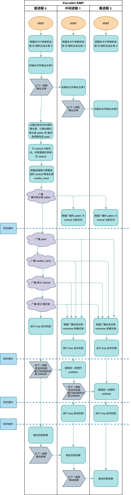
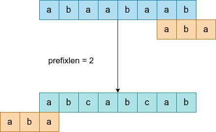

## 一、个人信息

| 条目  | 内容       |
| ----- | ---------- |
| 学号  | xxxxxx     |
| 姓名  | Thyrsael   |
| 学院  | 计算机学院 |
| JobID | 7991086    |

---


## 二、实验过程

对于模式串的生成，调用 `gen_ped` 程序，生成长度为 3，周期长度为 2，随机种子为 1。调用命令如下

```shell
./gen_ped 3 2 1 pattern.dat
```

生成字符串：

```
nwn
```

然后运行主程序，采用 4 个 node 运行最终输出如下

```shell
The Text on node 0 is nwnw .
The Text on node 1 is nwnw .
The Text on node 2 is ebeb .
The Text on node 3 is gvgv .
This is the match result on node 0 
(0)  +
(1)  -
This is the match result on node 1 
(2)  +
(3)  -
(4)  +
(5)  -
This is the match result on node 2 
(6)  -
(7)  -
(8)  -
(9)  -
This is the match result on node 3 
(10)  -
(11)  -
(12)  -
(13)  -

```

---


## 三、算法流程

### 3.1 泳道图

该泳道图过长，如果在 PDF 中不方便查看，还可以看文件中附带的图片



在绘制泳道图的时候，需要注意 `MPI_Send, MPI_Recv, MPI_Bcast` 都是阻塞通信。

### 3.2 段内匹配和段间匹配

段间比配指的是，可能存在主串中的模式串横跨两个进程的段的情况，所以需要每个进程都需要向后一进程传递 `prefixlen` 信息，并利用前一进程传递的 `prefixlen` 信息进行段间匹配。也就是这样的图



### 3.3 还原 nextvalue

为了节省开支，我们在首进程中计算出的 `nextval` 和读取的 `pattern` 并不会完全广播，而是只广播一部分，然后利用周期信息完成还原，这就要求周期信息可以作用于还原，我们看到，主进程一般发送 `pped.pedlen * 2` 模式串周期长度的两倍，这是因为对于周期循环而言，两个周期就可以概括 `nextval` 信息。

```c
if (numprocs > 1) 
{
    // 重复了不到两个周期
    if (pped.pednum == 1)
    {
        // nextlen_send 是要发送的 next 的长度
        nextlen_send = patlen;
    }
    else
    {
        nextlen_send = pped.pedlen * 2;
    }
}
```

如 `abaabaabaaba` 这个串，其 `nextval` 为

| a    | b    | a    | a    | b    | a    | a    | b    | a    | a    | b    | a    | a    |
| ---- | ---- | ---- | ---- | ---- | ---- | ---- | ---- | ---- | ---- | ---- | ---- | ---- |
| -1   | 0    | -1   | 1    | 0    | -1   | 1    | 0    | -1   | 1    | 0    | -1   | 1    |

经过多次实验，确实有这个规律：其周期重复第二个周期的 nextval 值，实验代码片段如下：

```c
#define VARNAME(var) (#var)
#define MAX_LEN 500

int next[MAX_LEN];
int nextval[MAX_LEN];

void print_array(char *array_name, int *array, int len)
{
    printf("%s:\n", array_name);
    for (int i = 0; i < len; i++)
    {
        printf("%4d", array[i]);
    }
    printf("\n");
}

void gen_nextval(char *pattern)
{
    // 模式串长度
    int pattern_len = strlen(pattern);
    // nextval 填写指针，逐个递增，我们会逐个填写 nextval[nextval_cur]
    int nextval_cur = 1;
    // nextval[0] = -1，因为在 pattern[0] 前没有字符串
    nextval[0] = -1;
    // 求解 nextval
    while (nextval_cur < pattern_len)
    {
        // 这里的迭代都是与 next 相同的
        // 完全一样的意思是必须采用 next 数组迭代
        int same_len = next[nextval_cur - 1];
        while (!(same_len == -1 || pattern[nextval_cur - 1] == pattern[same_len]))
        {
            same_len = next[same_len];
        }

        // 只有这里发生了变化
        if (pattern[nextval_cur] == pattern[same_len + 1])
        {
            nextval[nextval_cur] = nextval[same_len + 1];
        }
        else 
        {
            nextval[nextval_cur] = same_len + 1;
        }

        nextval_cur++;
    }
    print_array(VARNAME(nextval), nextval, pattern_len + 1);
}
```

### 3.4 并行计算比

#### 3.4.1 实验记录

对于 `gen_pat` 采用参数 `32 4 1` 。

**第一次实验**

对于主串，采用的是 256 长度，8 周期长度的主串。

对于并行程序，采用 4 node，16 core 的配置，结果如下

```
The programmed has run 1.317340s
```

对于串行程序，结果如下

```
The programmed has run 0.003251s
```

可以看到串行程序的运行速度更快。

**第二次实验**

对于主串，采用的是 65536 长度，8 周期。

并行为 4 node，16 core

```
processor num = 16 
textlen = 65536
patlen= 32
The programmed has run 1.168861s
```

串行为

```
processor num = 1 
textlen = 65536
patlen= 32
The programmed has run 0.020678s
```

依然是串行更优。

**第三次实验**

对于主串，采用 16777200 长度，8 周期。

并行1：4 node, 16 core

```
processor num = 16 
textlen = 16777200
patlen= 32
The programmed has run 3.852234s
```

串行：

```
processor num = 1 
textlen = 16777215
patlen= 32
The programmed has run 1.999268s
```

并行2：1 node, 8 core

```
processor num = 8 
textlen = 16777208
patlen= 32
The programmed has run 0.451285s
```

并行3：4 node, 32 core

```
processor num = 32 
textlen = 16777184
patlen= 32
The programmed has run 6.018055s
```

并行4：4 node, 8 core

```
processor num = 8 
textlen = 16777208
patlen= 32
The programmed has run 3.350692s
```

并行5：1 node, 16 core

```
processor num = 16 
textlen = 16777200
patlen= 32
The programmed has run 0.278959s
```

#### 3.4.2 结论

当数据规模小的时候，优化并不明显。而且不同节点的传输效率比较低，所以尽量采用一个节点。最终最大加速比为 `7.167`。

---


## 四、源码的修改

源码在这个位置的指针类型错误，修改即可

```c
// error
void GetFile(char *filename, char *place, int *number)
// correct
void GetFile(char *filename, char **place, int *number)
```

最终源码为

```c
#include <malloc.h>
#include <sys/stat.h>
#include <sys/types.h>
#include <stdio.h>
#include <string.h>
#include <mpi.h>
#include <stdlib.h>

#define  MAX(m, n)    (m > n? m : n)

typedef struct
{
    int pedlen;     // 模式串内部的周期长度
    int psuffixlen; // 模式串后缀长度
    int pednum;     // 模式串重复周期个数
} pntype; // ped 应该是 period 周期之意  pntype 应该是 pattern type 的意思


/**
 * @brief 对模式串进行周期分析，并计算相应的 new 和 newval 值 
 * 
 * @param W 模式串 
 * @param patlen 模式串的长度
 * @param nextval nextval 数组
 * @param pped 返回值
 */
void Next(char *W, int patlen, int *nextval, pntype *pped)
{
    int i, j, plen;
    int *next;

    if ((next = (int *) malloc((patlen + 1) * sizeof(int))) == NULL)
    {
        printf("no enough memory\n");
        exit(1);
    }

    /* 计算 next 和 nextval */
    next[0] = nextval[0] = -1;
    j = 1;
    while (j <= patlen)
    {
        i = next[j - 1];
        // 没有找到，不断递进的过程
        while (i != (-1) && W[i] != W[j - 1]) 
        {
            i = next[i];
        }
        // 从循环中出来，意味着找到了
        next[j] = i + 1;

        // 利用 next 数组生成 nextVal 数组
        if (j != patlen)
        {
            if (W[j] != W[i + 1])
            {
                nextval[j] = i + 1;
            }
            else
            {
                nextval[j] = nextval[i + 1];
            }
        }

        // 递进游标
        j++;
    }
    // 更新 pped 结构体
    pped->pedlen = patlen - next[patlen];
    pped->pednum = (int) (patlen / pped->pedlen);
    pped->psuffixlen = patlen % pped->pedlen;
    // 释放 next 空间
    free(next);
}

/**
 * @brief kmp 算法
 * 
 * @param T 主串
 * @param W 模式串
 * @param textlen 主串长度
 * @param patlen 模式串长度
 * @param nextval nextval 数组
 * @param pped 模式串的周期信息
 * @param prefix_flag 当 prefix_flag 被置 1 的时候，只要模式串剩余的部分比主串剩余的部分多了，那么就结束算法
 * @param matched_num 从哪里开始匹配的意思
 * @param match 一个数组，当 match[index] == 1 时，表示主串的 index 位是符合匹配的开始
 * @param prefixlen 前缀的长度
 */
void kmp(char *T, char *W, int textlen, int patlen, int *nextval, pntype *pped, 
            int prefix_flag, int matched_num, int *match,int *prefixlen)
{
    int i, j;

    // 主串游标
    i = matched_num;
    // 模式串游标
    j = matched_num;

    while (i < textlen)
    {
        // 当 prefix_flag 被置 1 的时候，只要模式串剩余的部分比主串剩余的部分多了，那么就结束算法
        if ((prefix_flag == 1) && ((patlen - j) > (textlen - i)))
        {
            break;
        }

        // 没有匹配上的情况
        while (j != (-1) && W[j] != T[i]) 
        {
            j = nextval[j];
        }
        // 匹配完成了
        if (j == (patlen - 1))
        {
            // 这里应该是在主串中匹配好的模式串的首字符处置 1
            match[i - (patlen - 1)] = 1;
            // 应该说的是 pednum == 1 && psuffixlen == 0 的情况
            if (pped->pednum + pped->psuffixlen == 1)
            {
                // 复位到最开始
                j = -1;
            }
            else
            {
                // 这里是将 j 复位到了最后一个一个模式串周期的开始处
                j = patlen - 1 - pped->pedlen;
            }
        }

        // 移动游标
        j++;
        i++;
    }

    // prefixlen 会记录下在 kmp 函数结束的时候，模式串游标的位置
    (*prefixlen) = j;
}

/**
 * @brief 重构模式串以及 nextval 函数
 * 
 * @param patlen 模式串长度
 * @param pped 模式串周期信息
 * @param nextval nextval 数组
 * @param W 模式串
 */
void Rebuild_info(int patlen, pntype *pped, int *nextval, char *W)
{
    int i;
    // 如果模式串周期是 1
    if (pped->pednum == 1)
    {
        // 从 W 的起始位置向 W[pedlen] 拷贝 suffixlen 个字符
        memcpy(W + pped->pedlen, W, pped->psuffixlen);
    }
    else
    {
        // 第二个周期只需要拷贝模式串，不需要拷贝 nextValue
        memcpy(W + pped->pedlen, W, pped->pedlen);
        // 这里其实改成 i = 2 更好理解 
        for (i = 2; i < pped->pednum; i++)
        {
            memcpy(W + i * pped->pedlen, W, pped->pedlen);
            memcpy(nextval + i * pped->pedlen, nextval + pped->pedlen, pped->pedlen * sizeof(int));
        }
        // 拷贝后缀
        if (pped->psuffixlen != 0)
        {
            memcpy(W + i * pped->pedlen, W, pped->psuffixlen);
            memcpy(nextval + i * pped->pedlen, nextval + pped->pedlen, pped->psuffixlen * sizeof(int));
        }
    }
}

/**
 * @brief 生成文本串
 * seed 是每个进程的 ID，所以每个进程的生成的字符串是不一样的
 */
void gen_string(int strlen, int pedlen, char *string, int seed)
{
    int suffixlen, num, i, j;

    srand(seed);
    // 按照 pedlen 随机生成一个串
    for (i = 0; i < pedlen; i++)
    {
        num = rand() % 26;
        string[i] = 'a' + num;
    }
    // 将 ped 复制多次
    for (j = 1; j < strlen / pedlen; j++)
    {
        strncpy(string + j * pedlen, string, pedlen);
    }
    // 如果没有复制完，那么就在后缀补充一部分
    if ((suffixlen = strlen % pedlen) != 0)
    {
        strncpy(string + j * pedlen, string, suffixlen);
    }
}

/**
 * @brief Get the File object 从文件读入模式串信息
 * 
 * @param filename 文件名
 * @param place 文件的信息存储于其指向的内存
 * @param number 文件的大小
 */
void GetFile(char *filename, char **place, int *number)
{
    FILE *fp;
    struct stat statbuf;

    if ((fp = fopen(filename, "rb")) == NULL)
    {
        printf("Error open file %s\n", filename);
        exit(0);
    }
    // fileno 可以获得文件描述符，就是 stdin = 0, stdout = 1 的那个 int 值
    // 获得文件的状态
    fstat(fileno(fp), &statbuf);
    // st_size 是文件的大小，这里按照文件的大小给 place 分配空间
    if (((*place) = (char *) malloc(sizeof(char) * statbuf.st_size)) == NULL)
    {
        printf("Error alloc memory\n");
        exit(1);
    }
    // 1 个字节 1 个字节读入，读入 st_size 次
    if (fread((*place), 1, statbuf.st_size, fp) != statbuf.st_size)
    {
        printf("Error in reading num\n");
        exit(0);
    }
    fclose(fp);
    (*number) = statbuf.st_size;
}

/**
 * @brief 清空文件（因为其他写文件操作都是 a 追加，所以会导致重复运行的时候多次结果重复）
 * 
 * @param filename 文件名
 */
void ClearFile_info(char *filename)
{
    FILE *fp;

    if ((fp = fopen(filename, "w")) == NULL)
    {
        printf("Error open file %s\n", filename);
        exit(0);
    }

    fclose(fp);
}

/**
 * @brief 打印运行参数信息
 * T 是要打印的信息
 * id 是进程编号
 */
void PrintFile_info(char *filename, char *T, int id)
{
    FILE *fp;

    if ((fp = fopen(filename, "a")) == NULL)
    {
        printf("Error open file %s\n", filename);
        exit(0);
    }

    fprintf(fp, "The Text on node %d is %s .\n", id, T);

    fclose(fp);
}


/**
 * @brief 打印匹配结果
 * 
 * @param filename 文件名
 * @param t match 数组，置 1 说明匹配成功
 * @param len match 长度
 * @param init 起始位置，因为需要一个统一的标号
 * @param id 进程 id
 */
void PrintFile_res(char *filename, int *t, int len, int init, int id)
{
    FILE *fp;
    int i;

    if ((fp = fopen(filename, "a")) == NULL)
    {
        printf("Error open file %s\n", filename);
        exit(0);
    }

    fprintf(fp, "This is the match result on node %d \n", id);
    for (i = 0; i < len; i++)
    {
        if (t[i] == 1)
        {
            fprintf(fp, "(%d)  +\n", i + init);
        }
        else
        {
            fprintf(fp, "(%d)  -\n", i + init);
        }
    }

    fclose(fp);
}

void main(int argc, char *argv[])
{
    // T 是主串的一部分，W 是模式串全部
    char *T, *W;
    // nextval 是 kmp 的关键，match 记录着匹配好的首下标
    int *nextval, *match;
    // textlen 是部分主串的长度，patlen 是模式串长度，pedlen 是模式串重复周期长度，nextlen_send 是广播的 nextvalue 的长度
    int textlen, patlen, pedlen, nextlen_send;
    // 记录着模式串的周期信息
    pntype pped;
    // prefixlen 是已经完成匹配的长度
    int i, myid, numprocs, prefixlen, ready;
    // 记录时间
    double start_time, end_time;
    MPI_Status status;

    // 初始化进程间通信 
    MPI_Init(&argc, &argv);
    MPI_Comm_size(MPI_COMM_WORLD, &numprocs);
    MPI_Comm_rank(MPI_COMM_WORLD, &myid);

    if (myid == 0)
    {
        start_time = MPI_Wtime();
    }

    nextlen_send = 0;
    ready = 1;

    // 读取命令行参数，计算文本的长度
    textlen = atoi(argv[1]);
    textlen = textlen / numprocs;
    pedlen = atoi(argv[2]);

    // 分配空间
    if ((T = (char *) malloc(textlen * sizeof(char))) == NULL)
    {
        printf("no enough memory\n");
        exit(1);
    }
    // 生成字符串, T 中存着生成的字符串，这个字符串应该是主串
    // 因为 seed 是 myid，所以每个进程生成的主串是不同的
    gen_string(textlen, pedlen, T, myid);
    // 依次打印每个进程生成的主串
    if (myid == 0)
    {
        ClearFile_info("match_result");
        PrintFile_info("match_result", T, myid);
        // 如果进程大于 1，那么就发送信息
        if (numprocs > 1)
        {
            MPI_Send(&ready, 1, MPI_INT, 1, 0, MPI_COMM_WORLD);
        }
    }
    else
    {
        // 接受来自上一个进程的 ready 信息，然后发送给下一个进程
        MPI_Recv(&ready, 1, MPI_INT, myid - 1, myid - 1, MPI_COMM_WORLD, &status);
        PrintFile_info("match_result", T, myid);
        // 只要不是最后一个进程，都发送信息
        if (myid != numprocs - 1)
        {
            MPI_Send(&ready, 1, MPI_INT, myid + 1, myid, MPI_COMM_WORLD);
        }
    }
    printf("\n");

    // 每个主串的匹配信息被记录于此
    if ((match = (int *) malloc(textlen * sizeof(int))) == NULL)
    {
        printf("no enough memory\n");
        exit(1);
    }

    /* 处理器 0 读入模式串，并记录运行参数 */
    if (myid == 0)
    {
        printf("processor num = %d \n", numprocs);
        // 从这里可以看出，本质上的主串是每个进程生成主串后拼接在一起的
        printf("textlen = %d\n", textlen * numprocs);
        // 从 pattern.dat 中读取信息，字符串存储在 W 中
        GetFile("pattern.dat", &W, &patlen);
        printf("patlen= %d\n", patlen);

        if ((nextval = (int *) malloc(patlen * sizeof(int))) == NULL)
        {
            printf("no enough memory\n");
            exit(1);
        }

        /* 对模式串进行分析，对应于算法 14.6步骤（1）*/
        Next(W, patlen, nextval, &pped);
        if (numprocs > 1)
        {
            // 重复了不到两个周期
            if (pped.pednum == 1)
            {
                // nextlen_send 是要发送的 next 的长度
                nextlen_send = patlen;
            }
            else
            {
                nextlen_send = pped.pedlen * 2;
            }
        }
    }

    /*向各个处理器播送模式串的信息，对应于算法 14.6步骤（2）*/
    if (numprocs > 1)
    {
        // 主进程广播出去了模式串长度
        // Bcast 是阻塞的
        MPI_Bcast(&patlen, 1, MPI_INT, 0, MPI_COMM_WORLD);
        // 对于从进程
        if (myid != 0)
        {
            // 按照广播得到的模式串长度 patlen 给 nextVal 和 W 模式串分配空间
            if (((nextval = (int *) malloc(patlen * sizeof(int))) == NULL)
                || ((W = (char *) malloc(patlen * sizeof(char))) == NULL))
            {
                printf("no enough memory\n");
                exit(1);
            }
        }
        // 同步
        MPI_Barrier(MPI_COMM_WORLD);
        // 主进程向从进程广播各种信息
        // 3 是因为 pntype 的大小就是 3 个 int
        MPI_Bcast(&pped, 3, MPI_INT, 0, MPI_COMM_WORLD);
        MPI_Bcast(&nextlen_send, 1, MPI_INT, 0, MPI_COMM_WORLD);
        // nextVal 串一般只发送了两个周期
        MPI_Bcast(nextval, nextlen_send, MPI_INT, 0, MPI_COMM_WORLD);
        // 模式串只发送了一个周期的长度
        MPI_Bcast(W, pped.pedlen, MPI_CHAR, 0, MPI_COMM_WORLD);
    }

    MPI_Barrier(MPI_COMM_WORLD);

    /*调用修改过的 KMP 算法进行局部串匹配，对应于算法14.6步骤（3）*/
    if (numprocs == 1)
    {
        kmp(T, W, textlen, patlen, nextval, &pped, 1, 0, match + patlen - 1, &prefixlen);
    }
    else
    {
        // 对于从进程，还原模式串和 nextval 数组
        if (myid != 0)
        {
            /*各个处理器分别根据部分串数据以及周期信息重构模式串*/
            Rebuild_info(patlen, &pped, nextval, W);
        }
        // 进行段内匹配
        if (myid != numprocs - 1)
        {
            kmp(T, W, textlen, patlen, nextval, &pped, 0, 0, match + patlen - 1, &prefixlen);
        }
        else
        {
            // 只有尾进程的 prefix_flag 为 1，表示只有最后一个进程不需要保留 prefixlen 信息
            kmp(T, W, textlen, patlen, nextval, &pped, 1, 0, match + patlen - 1, &prefixlen);
        }

        MPI_Barrier(MPI_COMM_WORLD);

        // 开始进行段间匹配
        // 除了最后一个进程，都需要向后发送处理信息，这里发送的是 prefixlen
        if (myid < numprocs - 1)
        {
            MPI_Send(&prefixlen, 1, MPI_INT, myid + 1, 99, MPI_COMM_WORLD);
        }

        // 除了第一个进程，都需要向前接受处理信息
        if (myid > 0)
        {
            MPI_Recv(&prefixlen, 1, MPI_INT, myid - 1, 99, MPI_COMM_WORLD, &status);
        }

        MPI_Barrier(MPI_COMM_WORLD);

        // 除了第一个进程，都需要进行段间匹配 
        if ((myid > 0) && (prefixlen != 0))
        {
            kmp(T - prefixlen, W, prefixlen + patlen - 1, patlen, nextval, &pped, 1, prefixlen,
                match + patlen - 1 - prefixlen, &prefixlen);
        }

        MPI_Barrier(MPI_COMM_WORLD);
    }

    // 输出匹配结果
    if (myid == 0)
    {
        PrintFile_res("match_result", match + patlen - 1, textlen - patlen + 1, 0, myid);
        if (numprocs > 1)
        {
            MPI_Send(&ready, 1, MPI_INT, 1, 0, MPI_COMM_WORLD);
        }
    }
    else
    {
        MPI_Recv(&ready, 1, MPI_INT, myid - 1, myid - 1, MPI_COMM_WORLD, &status);
        PrintFile_res("match_result", match, textlen, myid * textlen - patlen + 1, myid);
        if (myid != numprocs - 1)
        {
            MPI_Send(&ready, 1, MPI_INT, myid + 1, myid, MPI_COMM_WORLD);
        }
    }

    free(T);
    free(W);
    free(nextval);

    if (myid == 0)
    {
        end_time = MPI_Wtime();
        printf("The programmed has run %lfs\n", end_time - start_time);
    }

    MPI_Finalize();
}
```

