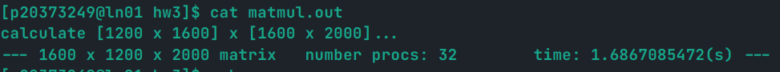
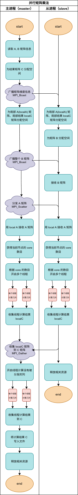
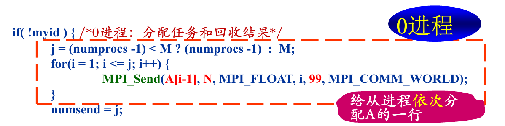
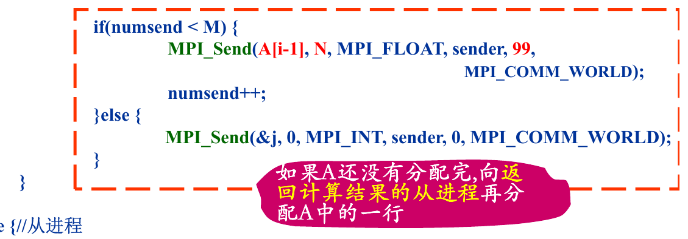
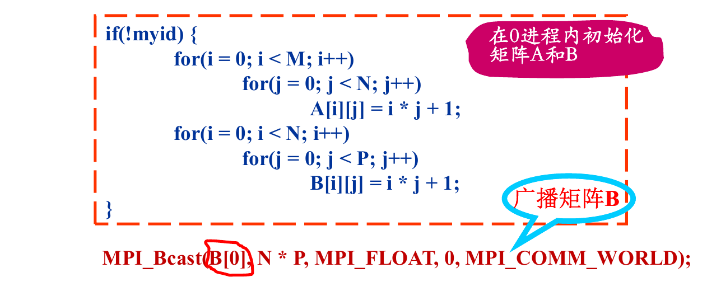
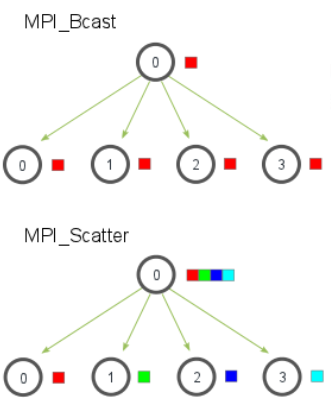
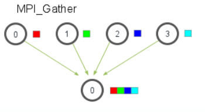
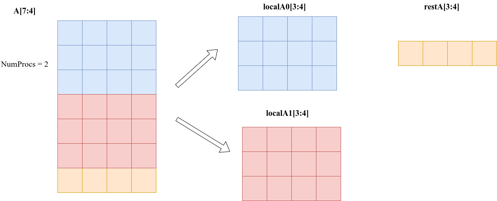

## 一、个人信息

| 条目  | 内容       |
| ----- | ---------- |
| 学号  | xxxxx      |
| 姓名  | Thyrsael   |
| 学院  | 计算机学院 |
| JobID | 7995268    |

---


## 二、实验过程

首先用矩阵生成程序生成 $matrixA[1200 : 1600]$ 和 $matrixB[1600:2000]$ 两个矩阵

```shell
./matrixgen 1200 1600 matrixA
./matrixgen 1600 2000 matrixB
```

 然后用串行程序进行计算求得时间，需要注意的是开启了 `O2` 编译优化以减小常数使结果更为客观

```shell
gcc -o tserial -O2 ./Tserial.cxx
./tserial matrixA matrixB matrixSC
```

输出为

```shell
Serial algrithm: multiply a 1200x1600 with a 1600x2000, use 16.8556230068(s)
```

然后采用并行程序进行计算，依然需要开启 `O2` 优化，最后结果为

```shell
--- 1600 x 1200 x 2000 matrix   number procs: 32        time: 1.6867085472(s) ---
```

实验截图如下



验证两个计算结果的一致性

```shell
cmp matrixPC matrixSC
```

发现结果一致，检验了程序的正确性。

最后计算加速比
$$
\tt{acc\_rate = 16.8556230068 \div 1.6867085472 = 9.997}
$$
可以看到加速了近 10 倍，足以见到并行计算的威力。

----


## 三、流程分析

### 3.1 泳道图



**采用的是广播模式，所以与提供的源码（为点对点通信）显示的流程差异较大，我会在下面介绍具体的算法。**

### 3.2 源码错误分析

**死锁问题**



在这里，没有考虑到当 `numprocs > M` 的情况，这会导致主进程没有给 `id >= M` 的进程发送任何信息 这些进程会一直处于等待中，造成死锁。

```
---1600x1200x2000 matrix       number procs: 32        time: 2.5864(s)---
```

如果采用原有代码的架构，可以考虑给 `id >= M` 的进程发送一条“约定信息”，当这些进程收到“约定信息”的时候，就会自动退出，不会造成死锁。大致如下

```c
// 主进程
for (i = 1; i <= numprocs - 1; i++)
{
    if (i - 1 < M)
    {
        MPI_Send(A + (i - 1) * N, N, MPI_DOUBLE, i, 99, MPI_COMM_WORLD);
    }
    // 发送一条“约定信息”
    else
    {
        int dev_null;
        MPI_Send(&dev_null, 0, MPI_INT, i, 0, MPI_COMM_WORLD);
    }
}

// 从进程，收到“约定信息”后退出
if (status.MPI_TAG == 0)
                break;
```

**再分配问题**



这里再次发送的 $A$ 的行，不再是 `i - 1` ，而应该是 `numsend`。只有这样才可以将剩余的行逐行分发。可以考虑如下修改

```c
MPI_Send(A + numsend * N, N, MPI_DOUBLE, sender, 99, MPI_COMM_WORLD);
```

**释放资源问题**

从进程没有释放这两个分配空间（补上即可）

```c
free(A_row);
free(C_row);
```

### 3.3 源码性能分析

**点对点通信**

点对点的通信代价过大，如果用广播形式会优化传播的效率，因为节点的通信形式可以变成网状或者树状。

**定长数组**



因为此题改成了从文件中读出矩阵，在读出之前，$A, B$ 的维度信息是不知道的。如果想使用定长数组，就必须要将其两个维度都赋一个极大的值，这就导致了在通信的时候传输的数据过大（每次都要传输一个大于实际矩阵的数组），造成了性能的低下。

可以考虑用 `malloc` 和宏来动态分配和访存，如下所示

```c
/**
 * 宏定义，取矩阵中的某个元素
 * 申请空间 malloc
 * 只能得到一维数组，需要用下标计算得到数组中的每个元素，使用宏比较方便
 */
#define _A(i, j) (*(A + i * N + j))
#define _B(i, j) (*(B + i * P + j))
#define _C(i, j) (*(C + i * P + j))
#define _LOCAL_A(i, j) (*(localA + i * N + j))
#define _LOCAL_C(i, j) (*(localC + i * P + j))

// 分配空间
double *matrix = (double *)malloc((*pm) * (*pn) * sizeof(double));
```

在使用的时候，可以这样使用

```c
// C[i][j] += A[i][k] * B[k][j];
_C(i, j) += _A(i, k) * _B(k, j);
```

**通信流程**

该程序的流程是多次分发的，首先给每个进程都分发一行，这是一个顺序过程，而不是一个并行的，这是第一个性能损失，如下所示

```c
// 串行发送
for (i = 1; i <= numprocs - 1; i++)
{
    if (i - 1 < M)
    {
        MPI_Send(A + (i - 1) * N, N, MPI_DOUBLE, i, 99, MPI_COMM_WORLD);
    }
    else
    {
        int dev_null;
        MPI_Send(&dev_null, 0, MPI_INT, i, 0, MPI_COMM_WORLD);
    }
}
```

而且这次分发并没有结束，这就导致了再次需要通信的需求，这是第二个性能损失。

而且第二次分发必须要等到第一次分发**顺序结束**之后才可以继续分发，这就导致了分发的串行化，可能第 5 个进程早就完成了第一次的任务，但是必须等到前 4 个进程都领到第二次的任务，才可以领到第二次的任务。这导致了第三个性能损失。如下所示：

```c
// 第二次分发，造成了损失
for (i = 1; i <= M; i++)
{
    sender = (i - 1) % (numprocs - 1) + 1;
    // 阻塞式接受信息，导致了串行，降低了效率
    MPI_Recv(C + (i - 1) * P, P, MPI_DOUBLE, sender, 100, MPI_COMM_WORLD, &status);
    if (numsend < M)
    {
        MPI_Send(A + numsend * N, N, MPI_DOUBLE, sender, 99, MPI_COMM_WORLD);
        printf("numsend: %d\n", numsend);
        numsend++;
    }
    else
    {
        // 发送标志为 0 的信息，让进程停止执行
        MPI_Send(&j, 0, MPI_INT, sender, 0, MPI_COMM_WORLD);
    }
}
```

正是因为有了上面的诸多问题，才有了新的模式的开发。

### 3.4 Scatter-Gather 模式

#### 3.4.1 原理介绍

`MPI_Scatter` 和 `MPI_Gather` 都是 `MPI` 广播函数，其签名如下

```c
MPI_Scatter(
    void* send_data,//存储在0号进程的数据，array
    int send_count,//具体需要给每个进程发送的数据的个数
    //如果send_count为1，那么每个进程接收1个数据；如果为2，那么每个进程接收2个数据
    MPI_Datatype send_datatype,//发送数据的类型
    void* recv_data,//接收缓存，缓存 recv_count个数据
    int recv_count,
    MPI_Datatype recv_datatype,
    int root,//root进程的编号
    MPI_Comm communicator)

MPI_Gather(
    void* send_data,
    int send_count,
    MPI_Datatype send_datatype,
    void* recv_data,
    int recv_count,//注意该参数表示的是从单个进程接收的数据个数，不是总数
    MPI_Datatype recv_datatype,
    int root,
    MPI_Comm communicator)
```

其实例图如下





在并行矩阵乘法中，我们利用 `MPI_Scatter` 进行对矩阵 $A$ 进行**块状（block）划分**，如图所示：



对于大部分的矩阵 $A$ ，都可以均匀的分配给每个进程，对于无法均分的部分，最后将有主进程处理。还有一种思路是对于 $A$ 进行**行补零**操作，使其变成一个可以均匀分配的矩阵。但是依然需要主进程操作。

#### 3.4.2 问题解决

**死锁错误**

当 `numprocs > M` 的时候，原有程序会死锁，但是在新的程序中，这只会导致主进程自己进行计算，分发的矩阵大小为 0，每个进程都会收到大小为 0 的局部矩阵，所以不会死锁。，如下所示

```c
// 利用的是向下取整，那么有可能 localM * numprocs < M，也就是 A 矩阵没有被分配完
localM = M / numprocs;	// 当 numprocs > M 的时候这里会取 0
// 这里分发的大小也为 0
MPI_Scatter(A, localM * N, MPI_DOUBLE, localA, localM * N, MPI_DOUBLE, 0, MPI_COMM_WORLD);
```

**再分配错误**

只需要一次分配，所以自然没有再分配错误。

**点对点通信优化**

抛弃了点对点通信，采用了广播通信的形式，这就使得信息的传递路径更短，复用率更高。

**通信流程优化**

完全消除了之前源码中的形式，可以简洁优雅的进行单次通信，**进程间的串行减少**。

---


## 四、结果分析

### 4.1 线程问题

我们利用混合编程，利用了线程，所以最好将节点的数目调大，这样每个进程分布在不同的节点上，每个进程都可以利用其节点上的多个处理器核，达到加速的目的。

### 4.2 广播模式优化

借来小组同学的用 `Send-Recv` 程序进行测试，发现相同条件下（32 node，32 core，[1200 x 1600] x [1600 x 2000]），其时间为

```shell
time: 2.1495252177(s)
```

所以 `Scatter-Gather` 模式相对于 `Send-Recv` 程序的加速比为
$$
\tt{acc\_rate = 2.1495252177\div 1.6867085472 = 1.27}
$$
可以看到还是有一定优化效果的。


## 五、程序源码

```c
#include <mpi.h>
#include <pthread.h>
#include <stdio.h>
#include <stdlib.h>
#include <sys/stat.h>
#include <sys/sysinfo.h>

// 程序计算 A[M x N] x B[N x P] = C[M x P]
double *A, *B, *C, *localA, *localC;
int M, N, P, localM;
int myid, numprocs;

/**
 * 宏定义，取矩阵中的某个元素
 * 申请空间 malloc
 * 只能得到一维数组，需要用下标计算得到数组中的每个元素，使用宏比较方便
 */
#define _A(i, j) (*(A + i * N + j))
#define _B(i, j) (*(B + i * P + j))
#define _C(i, j) (*(C + i * P + j))
#define _LOCAL_A(i, j) (*(localA + i * N + j))
#define _LOCAL_C(i, j) (*(localC + i * P + j))

/**
 * 从进程在计算的时候用这个结构体给线程传递参数
 * 这里削减了原有例程的参数，充分利用了线程的共享全局变量的特性
 */
struct threadArg
{
    int tid;
    int numthreads;
};

/**
 * @brief 线程要执行的内容，一个线程用于计算矩阵 C 一行的第 id + k * thread_num
 * (k = 0,1,...) 个元素
 *
 * @param arg 是一个 threadArg 结构体
 * @return void*
 */
void *worker(void *arg)
{
    int i, j, k;
    struct threadArg *myarg = (struct threadArg *)arg;

    for (i = 0; i < localM; i++)
    {
        for (j = myarg->tid; j < P; j += myarg->numthreads)
        {
            // localC[i][j] = 0.0;
            _LOCAL_C(i, j) = 0.0;
            for (k = 0; k < N; k++)
            {
                // localC[i][j] += localA[i][k] * B[k][j];
                _LOCAL_C(i, j) += _LOCAL_A(i, k) * _B(k, j);
            }
            // printf("%f\n", _LOCAL_C(i, j));
        }
    }

    return NULL;
}

/**
 * @brief 用于计算剩余行，计算的结果直接保存在 C 中
 *
 * @param arg 是一个 threadArg 结构体
 * @return void* NULL
 */
void *worker2(void *arg)
{
    int i, j, k;
    struct threadArg *myarg = (struct threadArg *)arg;
    int mod = M % numprocs;
    for (i = M - mod; i < M; i++)
    {
        for (j = myarg->tid; j < P; j += myarg->numthreads)
        {
            // C[i][j] = 0.0;
            _C(i, j) = 0.0;
            for (k = 0; k < N; k++)
            {
                // C[i][j] += A[i][k] * B[k][j];
                _C(i, j) += _A(i, k) * _B(k, j);
            }
            // printf("%f\n", _LOCAL_C(i, j));
        }
    }

    return NULL;
}

/**
 * @brief 从规定格式文件中读取矩阵
 *
 * @param filename 文件名
 * @param pm 指向行数的指针
 * @param pn 指向列数的指针
 * @return double* 读取出的矩阵首指针
 */
double *read_matrix(char *filename, int *pm, int *pn)
{
    FILE *fp;
    if (!(fp = fopen(filename, "r")))
    {
        printf("Can't open file %s\n", filename);
        exit(1);
    }

    // 读取维数
    fread(pm, sizeof(int), 1, fp);
    fread(pn, sizeof(int), 1, fp);
    // 为矩阵分配空间
    double *matrix = (double *)malloc((*pm) * (*pn) * sizeof(double));
    // 读取矩阵
    fread(matrix, sizeof(double), (*pm) * (*pn), fp);
    fclose(fp);

    return matrix;
}

/**
 * @brief 打印数组，主要用于调试
 *
 * @param matrix 待打印数
 * @param m 行数
 * @param n 列数
 */
void print_array(double *matrix, int m, int n)
{
    int i, j;
    for (i = 0; i < m; i++)
    {
        for (j = 0; j < n; j++)
        {
            printf("%10.4f", *(matrix + i * n + j));
        }
        printf("\n");
    }
}

/**
 * @brief 向文件中写矩阵
 *
 * @param filename 文件名称
 * @param m 矩阵行数
 * @param n 举着列数
 * @param matrix 指向矩阵的指针
 */
void write_matrix(char filename[], int m, int n, double *matrix)
{
    // buffer 是缓冲区，先把矩阵存入缓冲区再写入文件
    int bufsize = 2 * sizeof(int) + m * n * sizeof(double);
    char *buffer = malloc(bufsize);
    int i;

    // 向缓冲区写入矩阵的大小
    ((int *)buffer)[0] = m;
    ((int *)buffer)[1] = n;

    // dptr : double pointer，是 double 类型的指针，从 (int *) buffer + 2
    // 之后开始存储矩阵的元素
    double *dptr = (double *)(((int *)buffer) + 2);
    for (i = 0; i < m * n; i++)
    {
        dptr[i] = (double)matrix[i];
    }
    FILE *file;

    /**
     * 打开文件，写入 buffer
     */
    if (!(file = fopen(filename, "w")))
    {
        printf("Can't open file %s\n", filename);
    }

    fwrite(buffer, sizeof(char), bufsize, file);
    fclose(file);

    free(buffer);
}

int main(int argc, char *argv[])
{
    int i, j;
    MPI_Init(&argc, &argv);
    MPI_Comm_rank(MPI_COMM_WORLD, &myid);
    MPI_Comm_size(MPI_COMM_WORLD, &numprocs);
    // 计时器
    double start_time, end_time;
    // 线程个数
    int numthreads;
    // struct MPI_Status status;

    // 对于主进程，读取矩阵
    if (!myid)
    {
        A = read_matrix(argv[1], &M, &N);
        // print_array(A, M, N);
        B = read_matrix(argv[2], &N, &P);
        // print_array(B, N, P);
        // 输出读出信息
        printf("calculate [%d x %d] x [%d x %d]...\n", M, N, N, P);
        // 为结果矩阵分配空间
        C = (double *)malloc(M * P * sizeof(double));
    }

    // 发送 M，N，P 到从进程
    MPI_Bcast(&M, 1, MPI_INT, 0, MPI_COMM_WORLD);
    MPI_Bcast(&N, 1, MPI_INT, 0, MPI_COMM_WORLD);
    MPI_Bcast(&P, 1, MPI_INT, 0, MPI_COMM_WORLD);

    // 计算局部 A 数组相关信息
    // 利用的是向下取整，那么有可能 localM * numprocs < M，也就是 A 矩阵没有被分配完
    localM = M / numprocs;
    // 分配局部 A 空间
    localA = (double *)malloc(localM * N * sizeof(double));
    // 分配局部 C 空间
    localC = (double *)malloc(localM * P * sizeof(double));
    // 为从进程的 B 分配空间
    if (myid)
    {
        B = (double *)malloc(N * P * sizeof(double));
    }
    // 主进程计时，且在这里计时十分合理，计算了通信时间
    else
    {
        start_time = MPI_Wtime();
    }

    // 广播 B 矩阵
    MPI_Bcast(B, N * P, MPI_DOUBLE, 0, MPI_COMM_WORLD);
    // 分发 A 矩阵
    // 可以看到 Scatter 的参数和 Bcast 的参数很像
    MPI_Scatter(A, localM * N, MPI_DOUBLE, localA, localM * N, MPI_DOUBLE, 0, MPI_COMM_WORLD);

    // 获得每个进程的线程数目，其实这个获得的是处理器上核的个数，我的电脑就是 12 核的
    // 从这个角度看，想要算得快，可能需要分散开，每个进程都分布在不同的处理器上，才可以获得较好的表现
    // 但是这样通信的代价就会提高
    numthreads = get_nprocs();
    // 分配一组线程 id
    pthread_t *tids = (pthread_t *)malloc(numthreads * sizeof(pthread_t));
    struct threadArg *targs = (struct threadArg *)malloc(numthreads * sizeof(struct threadArg));

    for (i = 0; i < numthreads; i++)
    {
        targs[i].tid = i;
        targs[i].numthreads = numthreads;
        pthread_create(&tids[i], NULL, worker, &targs[i]);
    }
    // 等待线程计算完成
    for (i = 0; i < numthreads; i++)
    {
        pthread_join(tids[i], NULL);
    }
    // 收集结果
    MPI_Gather(localC, localM * P, MPI_DOUBLE, C, localM * P, MPI_DOUBLE, 0, MPI_COMM_WORLD);

    // 对于主进程而言，还需要计算剩余行和释放独有的资源
    if (!myid)
    {
        for (i = 0; i < numthreads; i++)
        {
            // 此时处理的行数减少到剩余行
            pthread_create(&tids[i], NULL, worker2, &targs[i]);
        }
        // 等待线程计算完成
        for (i = 0; i < numthreads; i++)
        {
            pthread_join(tids[i], NULL);
        }

        // print_array(C, M, P);
        end_time = MPI_Wtime();
        // 写入结果文件
        write_matrix(argv[3], M, P, C);
        // 输出时间
        printf("--- %d x %d x %d matrix\tnumber procs: %d\ttime: %.10f(s) ---\n", N, M, P, numprocs, end_time - start_time);
        // 只有主进程独有这两个资源，故独有的释放
        free(A);
        free(C);
    }

    // 每个进程都有这些资源，都需要释放
    free(localA);
    free(B);
    free(localC);
    free(tids);
    free(targs);
    // 结束通信
    MPI_Finalize();
}
```

