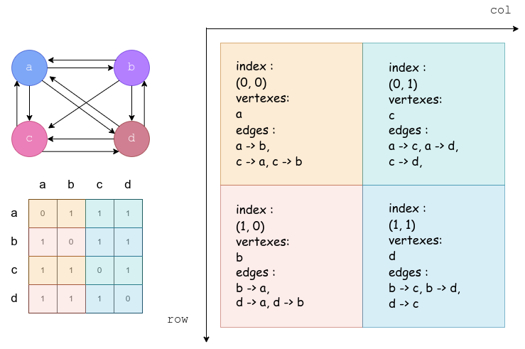
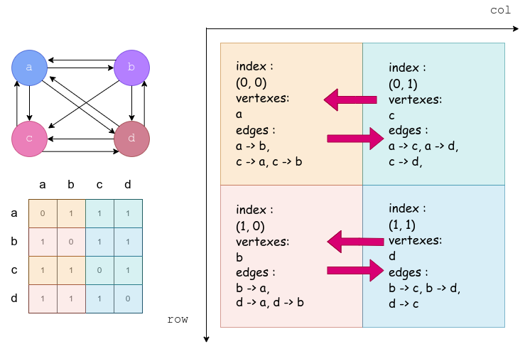
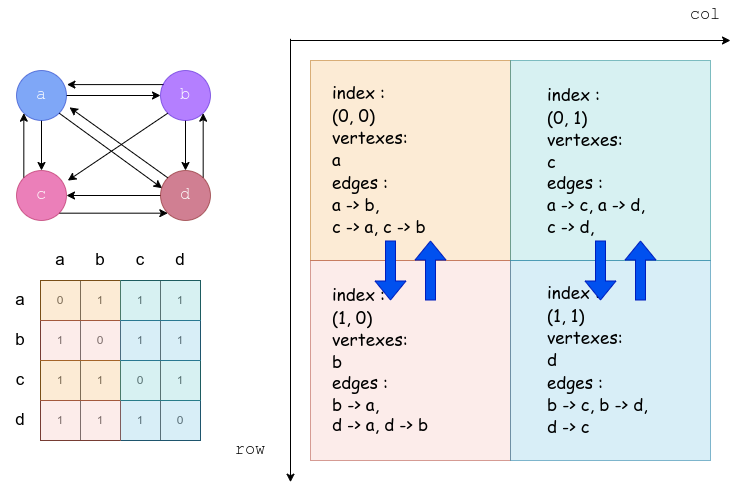
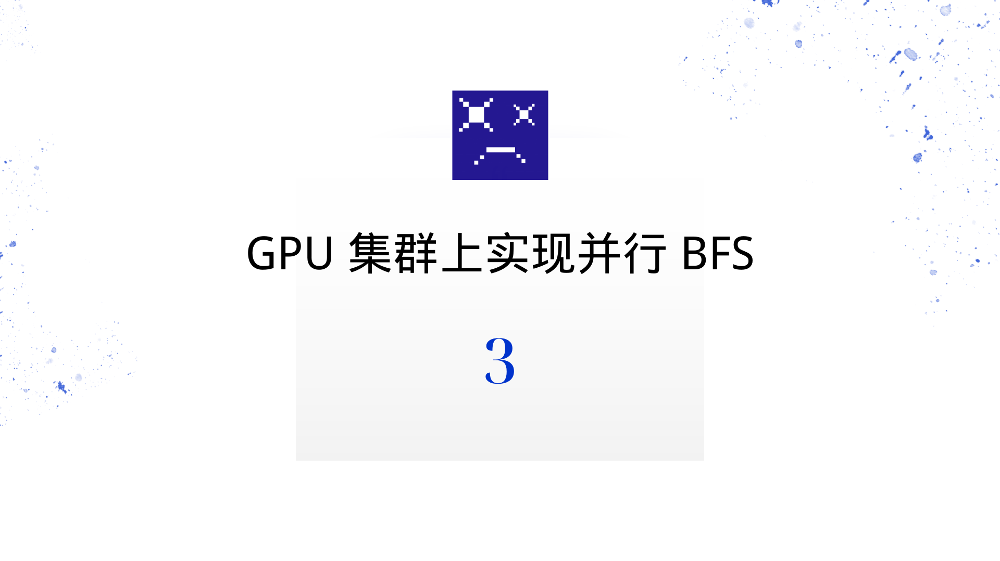
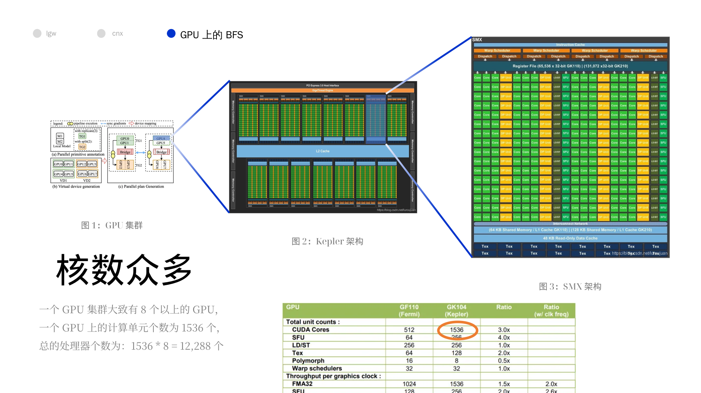
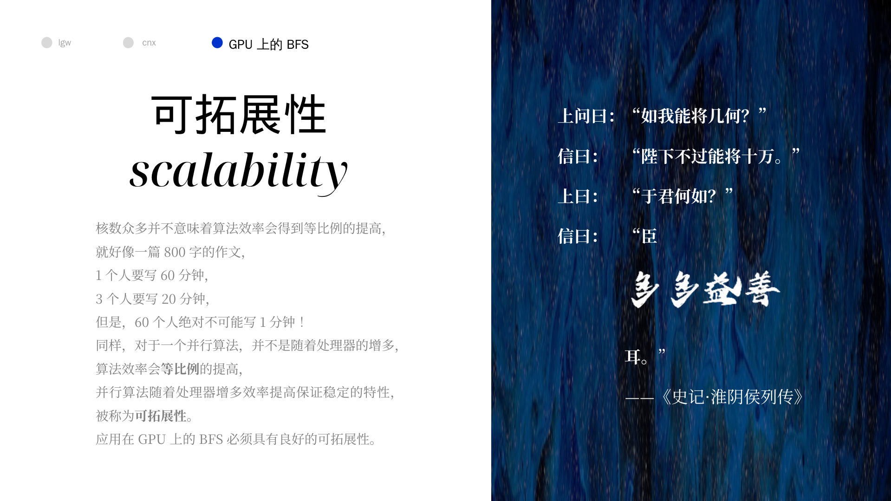
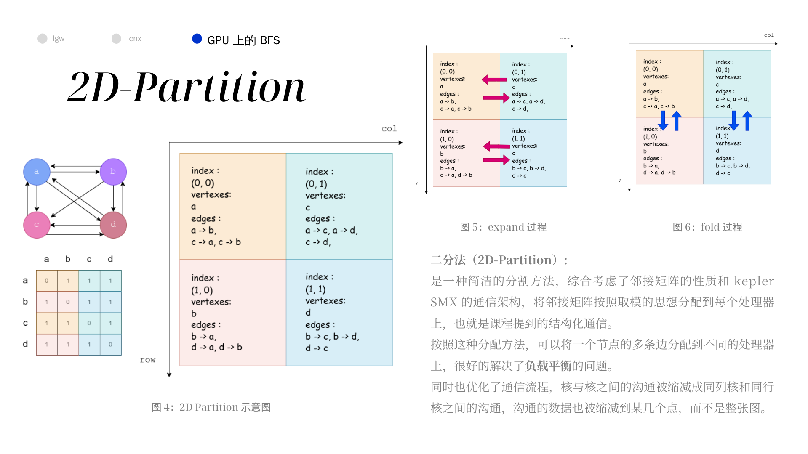
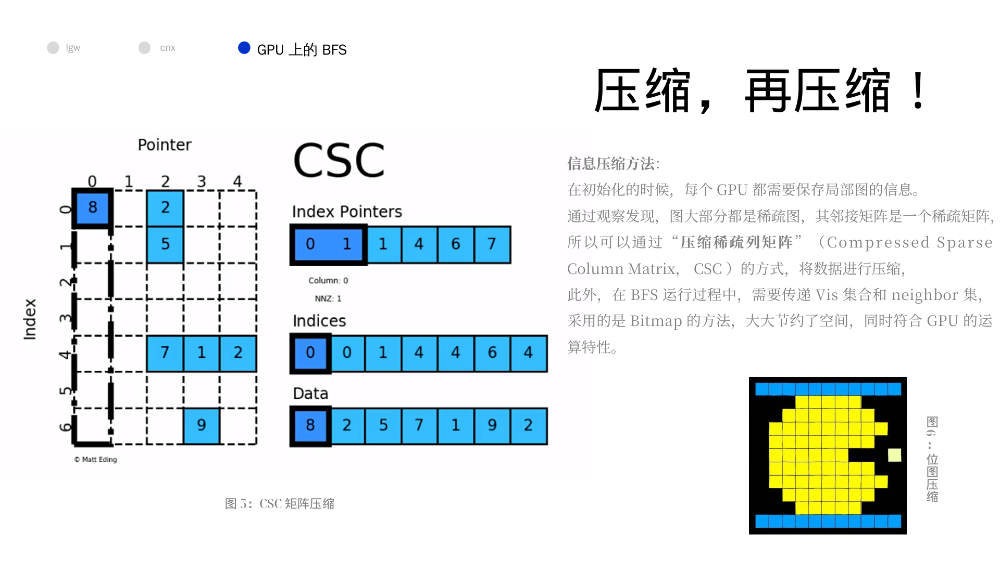
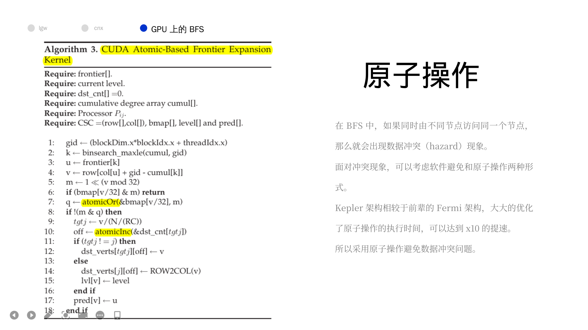
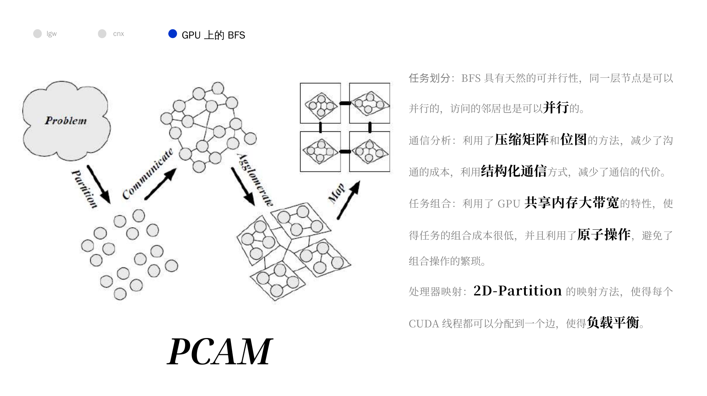

## 一、摘要

我们介绍了一种**广度优先搜索大型图**的算法，这种算法是**基于 CUDA** 的一种改进算法。

最新的版本极大的**利用了 Kepler 架构的性能**，并且依赖于**多个 GPU 交流数量**和**交换数据量**的减少。

最终的结果是代码可以在 4096 Tesla K20X GPUs 上使用一个集群在一秒内遍历超过 800,000,000,000 条边。

---


## 二、导论

它提到了这个算法的三个优点：

- 利用了 **Kepler** 架构更加高效的**原子运算 (atomic operation)**，这更好的利用了 GPU。
- **基于临接矩阵的 2D 分解**图分解方法，我猜测并行或者其他东西，关键是对于一个复杂的图分解成多个简单的子图，当其分解完成的时候，信息的交流会减少。
- 交换数据的时候采用了**位图 (bitmap)** 的数据结构，减少了交流数据的大小。

后面部分的概述

- Section 2：回顾前人工作
- Section 3：介绍当前工作
- Section 4：今昔对比
- Section 5：介绍位图法
- Section 6：介绍与工作相关的技术
- Section 7：未来展望


## 三、背景

### 3.1 GPU 系统上的分布式 BFS

为了更好的看懂论文，里面的 BFS 专有名词需要更新一波

```python
"""
level 字典，保存每个 vertex 的层级信息
frontier 列表用来保存上一层级遍历过的 vertex
parent 字典用来保存每个 vertex 的上一个 vertex
"""

"""
初始化：level，frontier，parent 保存初始顶点
遍历frontier的所有顶点：
	定义next列表，保存下一次需要遍历的顶点
	遍历所有与frontier中顶点相连的其他顶点：
		如果不在level中即没有遍历：
			更新level，parent，next
	frontier = next
	层级加一
"""

def bfs(graph, start):
    """
    return: 被遍历的顶点次序和level字典
    """
    level = {start: 0}
    parent = {start: None}
    i = 1
    frontier = [start]
    node_visited = [start]
    while frontier:
        next = []
        for u in frontier:
            for v in graph.get_connected_nodes(u):
                if v not in level:
                    level[v] = i
                    parent[v] = u
                    next.append(v)
                    node_visited.append(v)
        frontier = next
        i += 1
    return node_visited, level
```

大致看上去，应该是先将图的子部分分给不同的处理器，然后每个处理器进行 BFS，最后直到其孩子都被遍历过为止，似乎是没有队列结构的（也就是上面的算法）。

分解图的策略是最关键的部分，因为他关系到计算（compute）和通信（communication）的负载平衡问题。通信一直是分布式 BFS 的主要瓶颈。似乎使用 GPU 是一个很好的方法，因为 GPU 有共享存储（shared memory）可能可以降低通信代价。

对于图结构来说，可能会 visit 一个点多次，消除这些多余的访问，可以消减数据沟通的成本，是十分重要的（removel of duplicates）。可以使用 CUDA 中的原子操作消除它们，但是之前它们的工作中，这个的代价（penalizing）很大，所以它们采用了温和的（benign）竞态条件（race condtion ，即竞争冲突，race hazard，因多线程读同一个地方造成），采用的整数映射（Integer map）和一条并行契约（compact）源语。这就导致程序的可扩展性提高不起来，最多跑在 1024 个核上。

此外我还找到了一篇文档简介，他是如是描述的：

> 用 CUDA 实现 BFS 算法源码。CUDA 是 NV 公司基于 GPU 的统一计算架构，BFS 复杂度由 CPU 上的 $O(V+E)$ 降为 $O(diameter)$，直径 diameter 即图中 root 到 leaf 的最长距离。

### 3.2 二分法的 BFS

这个部分可以分为两个部分来理解，一个是二分法（2D-Partitioning）对于矩阵和处理器的分配（本质上是并行算法的构造），一部分是建立在二分法上的 BFS 算法。

关于二分法，值得注意的就是他在描述处理器阵列的时候，认为 row 是一个垂直方向的，而 col 是水平方向的。总的来说，就是很混乱的一个关系，我没法保证和图上的是契合的，只能保证我的图和我的算法伪代码是契合的。



对于这种分法，他提出了两种性质：

- 起点共列，指某个处理器的所有边的起点一定是该处理器所在列的处理器的点的子集。
- 终点共行，也就是一个处理器的所有边的终点是同行的处理器的节点的集合的子集。

按照这两个性质，每个处理器只会从固定的其他处理器中收到起点信息，而且只会向固定的其他处理器传递信息，这就大大减少了通信的代价。

在算法层面，并行可以这样理解，并行减少了原来的迭代的代价，但是增加了通信的代价，如果并行的优势可以弥补通信的损失，那么就应当采用并行算法。更进一步的说，如果并行是可以拓展的（scalability），那么就更好了（也就是随着并行规模的增大，并行带来的优势依然可以弥补通信带来的损失），因为我们不缺少硬件，而是缺少时间。

通信的代价一个是本身造成的，另一个是顺序造成的，有的时候必须要求通信的顺序，这就导致了在通信时的并行化。

这个算法主要利用了两个性质，一个是

- expand，也就是收集起始节点的过程，利用的是起点共列的性质。
- fold，也就是发送终止节点的过程，利用的是终点共行的性质。

本质上，并行用在了将原来的迭代遍历子节点的过程变成了多个处理器进行。最终伪代码如下（这份伪代码是我在原来的基础上修改过的，在 fold 过程上与源码略有差异）

```python
from numpy import *

class Processor:
    """
    一个处理器有自己的二维索引，自己负责的点，自己负责的边
    """
    def __init__(self, i, j):
        # i 是阵列的行坐标，j 是阵列的列坐标
        self.index = (i, j)
        # N / (R * C) 是将 N 个点分成 (R * C) 份（相当于将节点交给不同的处理器负责）
        vertexsDiv = (N // (R * C))
        # 这里需要注意，并不是按照 i * R + j 的方式分配的，而是按照 j * R + i 分配的，本质是因为论文的 row 是纵的，col 是横的
        self.vertexs = range(vertexsDiv * (j * R + i), vertexsDiv * (j * R + i) + 1)
        # 这里先不写了，因为描述起来太困难了，图中画得也很清楚
        self.edges = []
        # 前驱节点，不是固有性质，而是随着 BFS 而改变
        self.front = []
        # 收到的边，表示实际遍历了
        self.receivedEdges = []
    
    def has_vertex(self, v):
        """
        检验该处理器是否处理这个点
        """
        pass
    
    @staticmethod
    def owner(v):
        """
        很简单的方法，不实现了，就是获得 v 对应的处理器
        """
        pass
    @staticmethod
    def allProcessorsFrontEmpty():
        """
        所有的处理器的前驱节点列表都空了
        """
        pass

# N 是图节点的个数
N = 1200 
# R 是处理器阵列的行数
R = 16
# C 是处理器阵列的列数
C = 25
# adjacencyMatrix 邻接矩阵
adjacencyMatrix = array((N, N))
# 一个二维列表，表示存储器阵列
processors = [[]]

def parallel_BFS(r, i, j):
    level = []
    pred = []
    # 相当于位图版的 visitied
    bmap = []
    processors[i][j].front = []
    # 对于根节点处理器的处理
    if (processors[i][j].has_vertex(r)):
        level[r] = 0
        pred[r] = r 
        bmap[r] = 1
        processors[i][j].front.append(r)

    lvl = 1

    while True:
        # 搜集同一列的 front 当成新的 front
        # 相当于将上一次边的终点当成新的起点
        # expand comm
        for colCur in range(0, j):
            processors[i][j].front += processors[i][colCur].front
        
        # 遍历前向点，然后遍历与之相连的边，将边发送给边终点的处理器
        # fold comm
        for u in processors[i][j].front:
            for (u, v) in processors[i][j].edges:
                row = Processor.owner(v)
                processors[row][j].receivedEdge.append((u, v))

        # 前向边列表置空
        processors[i][j].front = []    
        for (u, v) in processors[i][j].receivedEdge:
            if (bmap[v] == 0):
                bmap[v] = 1
                pred[v] = u 
                level[v] = lvl 
                processors[i][j].front.append(v)
        
        lvl = lvl + 1
        
        if (Processor.allProcessorsFrontEmpty()):
            break 
```

以上图举例，从 a 节点开始遍历，则为

**初始化**

初始化的时候是对于根节点进行登记

|              | (0, 0) | (1, 0) | (0, 1) | (1, 1) |
| ------------ | ------ | ------ | ------ | ------ |
| front        | a      |        |        |        |
| receivedEdge |        |        |        |        |

**第 1 轮**

|              | (0, 0) | (1, 0) | (0, 1) | (1, 1) |
| ------------ | ------ | ------ | ------ | ------ |
| front        | a      |        | a      |        |
| receivedEdge |        |        |        |        |

算了，鸽了，反正确实是可以的（大概吧）。

如果有 $P$ 个处理器，那么每一个 level 只需要 $2 \times O(\sqrt{P})$ 次沟通。这体现了二分法的优异性。

需要说明的是，利用二分法进行并行，已经是他们之前的工作了，他们当前的工作可能是将其放到 Kepler 架构的 GPU 上，并且可以注意到，会存在多个边的终点同时 visit 的情况（对于 `bmap` 的读取和修改），那么在这里原子操作也是必不可少的，显然这些都是可以优化的点。

---


## 四、结论

我们介绍了我们全新的、用于在大型图上进行分布式 BFS 操作的代码。这个代码利用了**邻接矩阵的二分法（2D partitioning）**来实现高效的沟通，还利用了 **CUDA** 来加速局部运算。计算核（core）的特点是在**各个 GPU 线程间实现了最佳负载平衡**，利用了 Kepler 架构高效的原子计算能力。

更进一步的，我们在 BFS 代价最高的步骤，用一个**位图（bitmap）**减少了处理器之间的数据交换。这个优化使得在 4096 GPU 上性能提高了 2 倍。

最终的成果是一个在 4096 Nvidia K20X GPU 上具有良好的拓展性，每秒在一张具有 $2^{33}$ 个定点、830,000,000,000 条有向边的 R-MAT 图上遍历 830,000,000,000 条边的源码。我们在同一个 GPU 集群上，将我们的算法与原始的，依靠并行原语的组合来代替原子操作的算法进行比对，我们的算法的速度较原始代码快 8 倍。

---


## 五、展示 PPT

















