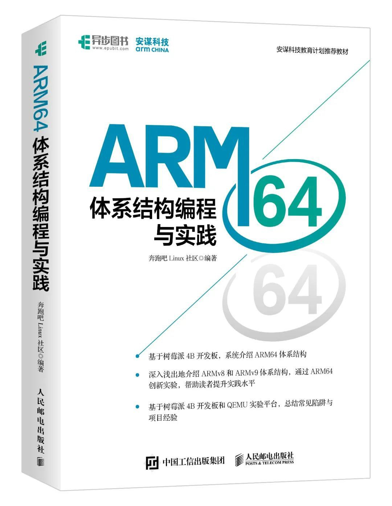
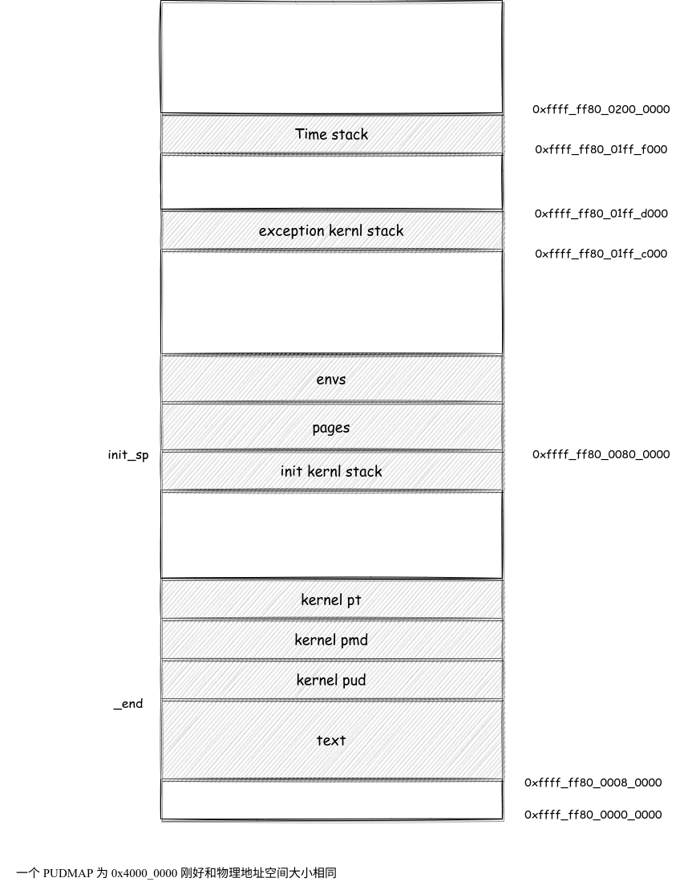
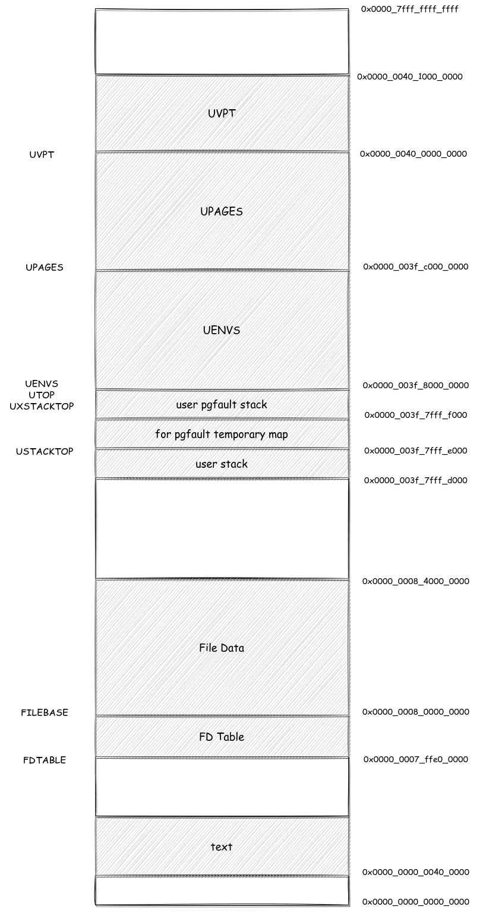
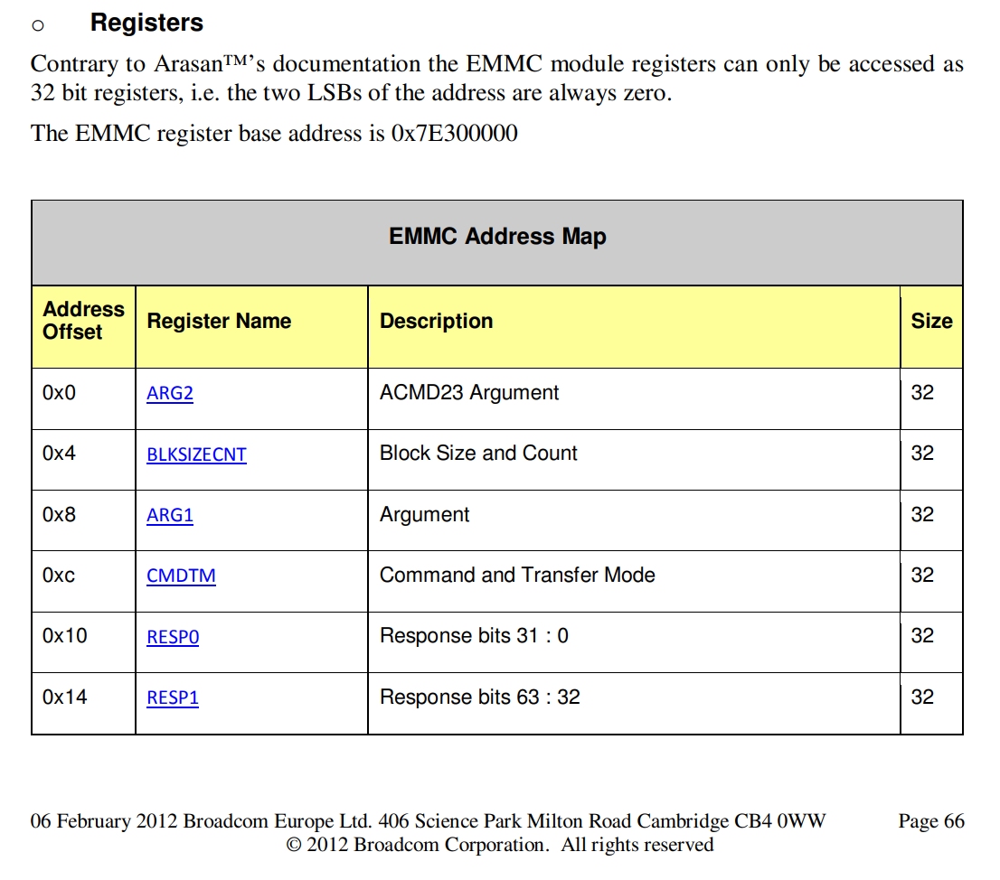

## 一、个人感受

### 1.1 权衡

在我写这份报告的时候，已经是 6 月 30 号了，经历了一个学期的“折磨”，我面对终点，已经没啥感觉了，就想着赶快呼噜完了就完事了。其实做这个项目最大的体会就是“人力有穷，一切皆权衡”。我当时选择这个项目，其实就两个原因：

- 做出来贼装逼
- 据说可以从中体会很多知识

现在看来，确实这两点都达到了，对于装逼层面而言，确实只要跟人提起“我是做移植操作系统”的，基本上就没人可以在装逼方面压过你了。从中学到的知识也是很多很丰富的，可以说指导书许诺的东西，我已经拿到了，但是我从来没有想过，我会付出以下代价：

- 用在其他课业上面的时间会很少，分数可能会下降
- 每个月都有那么几天被程序折磨的情绪失常
- 编译比赛没办法从头到尾投入
- 每天活在完成不了挑战性任务的恐惧里
- 经常睡不着或者睡不了
- 陪不了女朋友

当然很多情况都是因为我个人原因导致的，可能我再聪明一点，再勤奋一点，再坚强一点，可能这些问题都不会发生。或者再大气一点，发生了这些问题之后并不彷徨。不过我觉得哈，其实这个时候统计规律最说明一切了，从身边统计学来看，在移植操作系统任务下达后，我身边几乎每个人都摩拳擦掌，跃跃欲试，然后大概过了一个月，真正想做的人我认识的还剩下 10 个，当然跟我认识的人不多有关。到现在，从助教哥哥处获得的消息，整个 6 系和 21 系，进行 armv8 移植的人可能只有我和哲哥了（当然也有可能有大佬全程没问助教）。从这些数据可以看出，放弃才是常态，而且是一种很理智的选择。

在我打算介绍具体的知识和实验经过之前，我选择先写下这些话，虽然有一部分是矫情，但是更多的是，我意识到，最难解决的 bug 不在电脑上，而是在心态上。有的时候再坚持一下，再多做一个测试，再多想一种可能，再多问一个人，或许就 de 出来了。但是真的完全就不想再动了，因为自己内心知道自己就算做出来了，也是得不偿失的，就很难下笔了。

### 1.2 无问西东 

这是哲哥教给我的，就是即使像上面说的一样，是一件很得不偿失的事情。但是是我觉得很多事情不能太计较利益得失，斤斤计较就让生活变得没意思的。就好像我跑步一样，没人逼我跑，我也不求跑得比谁快，我就是享受跑步那种感觉。移植操作系统我就不是很这样，我很担心，很害怕，没写的时候害怕，写了也害怕，写完 lab1 害怕，写完 lab2 也害怕。但是哲哥就很淡然，就感觉他是真的享受整个过程，他从不担心结果如何，他就很享受。

### 1.3 移植概述

移植其实就是解决一系列 ABI 的问题。我们之前的的操作系统是建立在 mips 处理器上的，现在我们要把它移植到armv8 上，所以很多与硬件接壤的地方都需要有改动。这里粗浅的罗列一下，详细内容会在后面介绍

| lab  | 内容                                        |
| ---- | ------------------------------------------- |
| lab0 | 新的交叉编译器的使用                        |
| lab1 | 汇编的学习，arm 的异常处理等级              |
| lab2 | arm 的mmu和硬件三级页表查询方式（万恶之源） |
| lab3 | arm 的异常处理                              |
| lab4 | 用软件实现 COW 和 Library 机制              |
| lab5 | SD 的读写                                   |
| lab6 | armv8 的压栈方式                            |

---


## 二、Aarch64 汇编

### 2.1 学习资料

这里简要介绍一下。我们使用的是 armv8 的 A64 指令集（Aarch64 叫执行模式，总是就是一种 64 位的东西），是一种 64 位的指令集（armv8 还支持其他的模式，比如 32 位的 A32）。

汇编学习官方提供的就是文档，但是众所周知，文档太难了。所以这里安利这本书，可以对于汇编还有异常处理体系有一个初步的了解。如下




### 2.2 寄存器

#### 2.2.1 通用寄存器

##### 2.2.1.1 函数 ABI

通用寄存器 x0 ~ x7 是传参寄存器，只要函数的参数少于等于 8 个，那么都会通过这些这些寄存器来传递，第一个参数会被写入 x0，第二个参数写入 x1，以此类推。

同时，对于返回值，我们也是存储在 x0 中的，也就是说，x0 在函数中有两个作用，一个是传递第一个参数，一个是传递返回值。

对于函数的返回地址会存在 x30 中，类似与 mips 中的 ra。

##### 2.2.1.2 异常处理寄存器

arm 中的 x16 和 x17 类似于 mips 中的 k0 和 k1。都可以被利用为异常处理寄存器（就是在异常处理中可劲造，不用担心）。

##### 2.2.1.3 调用者保存和被调用者保存

`X9 ~ X15` 是调用者保存寄存器，所以需要调用者进行保存和恢复，类似于 `MIPS` 中的 `t` 寄存器。

`X19 ~ X29` 是被调用者保存寄存器，所以需要被调用者进行保存和恢复，类似于 `MIPS` 中的 `s` 寄存器。

#### 2.2.2 特殊寄存器

##### 2.2.2.1 零寄存器

xzr 是 64 位的零寄存器。

##### 2.2.2.2 pc

就是 pc，但是对于我们的实验没啥用，因为我们没有指令可以读写这个寄存器。

##### 2.2.2.3 sp

栈指针寄存器，与 mips 不同的是，这个有很多个这样的栈指针，比如 `sp_el0, sp_el1....` 。也就是说在 EL0 （用户态）的时候的栈指针使用的是 `sp_el0` ，EL1 （内核态）使用的栈指针是  `sp_el1`。这其实对应了用户态和内核态的使用的栈是不同的。

##### 2.2.2.4 elr

存放返回地址，类似于 mips 中的 epc

##### 2.2.2.5 CurrentEL

可以查看当前的异常等级。

#### 2.2.3 系统寄存器

##### 2.2.3.1 SCR

异常等级为 3 的时候的配置寄存器，具体的参数如下

```c
// 这位与安全内存有关，但是我不知道啥意思
#define SCR_NS              1
// 这位置 1 说明是 Arch64 而置 0 说明是 Arch32
#define SCR_RW              (1 << 10)
```

更加详细的可以参照白书的 P144 页。

##### 2.2.3.2 HCR

异常等级为 2 的时候的配置寄存器，具体参数如下

```c
#define HCR_RW              (1 << 31)
// SWIO hardwired on Pi3, 我不知达到哦啥意思
#define HCR_SWIO            (1 << 1)
```

更加详细的可以参照白书的 P144 页。

##### 2.2.3.3 SPSR

**Saved Process Status Register**。armv8 应该会维护一个状态寄存器 PSTATE ，当发生异常的时候，会把状态寄存器的值存储到 SPSR 当中。当异常返回的时候，会把 SPSR 的值拷贝到 PSTATE 中。我个人感觉已经可以把二者划等号了。

具体参数如下

```c
// 对应 [9:6] DAIF 意思是关闭中断
#define SPSR_MASK_ALL       (15 << 6)
// 对应 [3:0] 设置异常返回哪一个等级，我不知道具体的对应规则
#define SPSR_EL2H           (9 << 0)
#define SPSR_EL1H           (5 << 0)
```

另外可以分开访问，比如说 `daifset` 指的就是 SPSR 的 `[9:6]` 位。

##### 2.2.3.4 SCTLR

系统控制寄存器，指导书给出了完整配置。

##### 2.2.3.5 TCR

**Translation Control Register** 翻译控制寄存器，用于控制 TLB 的行为。具体的配置如下

```c
#define TCR_IGNORE1         (1 << 38)
#define TCR_IGNORE0         (1 << 37)
// 内部共享 TTBR1_EL1
#define TCR_ISH1            (3 << 28)
// 内部共享 TTBR0_EL1
#define TCR_ISH0            (3 << 12)
// TTBR1_EL1 外写通达可缓存
#define TCR_OWT             (2 << 26)
// TTBR1_EL1 内写通达可缓存
#define TCR_IWT             (2 << 24)
// 25 位掩码
#define TCR_T0SZ            (25)
#define TCR_T1SZ            (25 << 16)
// TG2 的页面是 4K
#define TCR_TG0_4K          (0 << 14)
// TG1 的页面是 4K
#define TCR_TG1_4K          (0 << 30)
```

##### 2.2.3.6 TTBR

一级页表的起始地址存储在这里。需要注意是物理地址。

##### 2.2.3.7 FAR

far 寄存器里存的就是 BADDR。

##### 2.2.3.8 ESR 

esr 寄存器就是同步异常的错误原因，类似与 MOS 中的 Cause。可以在 P150 查到。

### 2.3 汇编指令

这个部分非常的冗杂，但是我觉得只需要记住两点，就可以轻松解决

- 看白书，书上介绍的很详细
- 用的时候查，不需要啥都会

这里总结一下用到的指令 `ldr, str, msr, mrs, orr, and, cmp, bne, adr, eret, bl, b, br, lsr` 等，基本上跟机组的 P7 的量差不多。

### 2.4 内联汇编

其实这个项目不用内联汇编也可以实现（我就没用），但是还是顺手学了一下，记录如下

这个函数将 `value` 的值加上 p 指向的值，并且将结果存储在 result 中

```c
void my_add(unsigned long val, void *p)
{
    unsigned long tmp;
    int result;
    asm volatile
    {
        "1: ldxr %0, [%2]\n"
        "add %0, %0, %3\n"
        "stxr %w1, %0, [%2]\n"
        "cbnz %w1, 1b\n" 
        : "+r"(tmp), "+r"(result)
        : "r"(p), "r"(val)
        : "cc", "memory"
    };
}
```

首先这个部分叫做指令部分，其实就是一条一条的汇编

```c
"1: ldxr %0, [%2]\n"
    "add %0, %0, %3\n"
    "stxr %w1, %0, [%2]\n"
    "cbnz %w1, 1b\n" 	
```

会发现这些汇编里面有 `%0, %w1, %2` 这类的东西，这被称为样版操作数，其实就是 C 语言中变量的“化身”。

我们在下面这两个语句中声明这种样版关系

```c
: "+r"(tmp), "+r"(result) 	// output
: "r"(p), "r"(val)			// input
```

可以看到这里出现了 C 语言的变量，`output` 代表要对变量进行写操作，而 `input` 表示只对变量进行读操作，其中就有 `tmp -> %0, result -> %1, p -> %2, val -> %3` 的对应关系。

至于 `"+r"` 就表示要关联一个可读可写的寄存器，而 `"=r"` 则表示一个只写的寄存器。之后类似

因为在这个函数中，我们修改了状态寄存器（通过 `cbnz` 指令），所以要在最后一个部分声明 `cc`，因为改变了内存，所以要声明 `memory` 这最后的部分叫做“损坏部分”，大致是为了维护寄存器不破坏原意形成的。

---


## 三、开发工具

### 3.1 manjaro

这个必须要强调，真的是重中之重，因为没有有一个 Linux 的开发环境，就意味着你要使用虚拟机完成挑战性任务。咱不说这个意味着一般情况只能使用命令行，咱就说开发的时候能忍，但是读代码的时候呢？移植操作系统的很强调对于 MOS 源码的理解，我觉得只有像 vscode 这种工具才可以方便代码的阅读，vim 的局限性还是太大了一些（不排除大佬）。

本地开发也可以利用 manjaro + docker 实现，然后挑战性任务也可以在 manjaro 上做，而且之后学习也会用得到，我觉得是个很好的东西。

我第一次装 manjaro 是叶哥哥帮我装的，这个人号称 30 分钟结束战斗，然后花了 3 个小时，不过是真的强悍，100G 的 manjaro 陪伴了我这个学期。明天我就要卸掉它了，十分感慨。明天我要自己装一个，可能会写一个攻略。

### 3.2 交叉编译器

直接在应用商店就有装的，所以我也没上官网去看

| 条目       | 环境                        | 备注               |
| ---------- | --------------------------- | ------------------ |
| 交叉编译器 | aarch64-none-elf-gcc        | 在应用市场下载安装 |
| 硬件模拟器 | QEMU emulator version 5.0.0 | 命令行安装         |
| 编辑器     | vscode                      |                    |

---


## Lab 0

### manjaro

虽然指导书说可以使用 WSL 或者其他的命令行界面进行项目开发，但是从我这个菜鸡的角度来看，如果没有 `vscode` ，我是不可能完成整个的移植操作系统开发的。而且为了装这个 manjaro，花费的时间要远远比装交叉编译器之类的东西要花的时间久（要是没有叶哥哥和哲哥的帮助，这步就卡死了）。不过自从装上之后，开发真的势如破竹。而且 OS 实验也可以本地开发了，堪称我这个学期做过作为明智的决定。

### 实验环境

| 条目         | 环境                        | 备注               |
| ------------ | --------------------------- | ------------------ |
| 本机操作环境 | manjaro                     |                    |
| 交叉编译器   | aarch64-none-elf-gcc        | 在应用市场下载安装 |
| 硬件模拟器   | QEMU emulator version 5.0.0 | 命令行安装         |
| 编辑器       | vscode                      |                    |

### 思考题

**Linux Targeted 和 Bare-Metal 分别有怎样的含义呢?**

这说的是交叉编译器的两种模式，Bare-Metal 是裸机模式（这里不会）

**大小端的差异是由什么决定的？**

大小端是 CPU 实现的访存接口限制，同时需要，编译器将高级的 C 语言编译成机器语言，在这过程中调整了大小端。

---


## Lab 1

### 内核编译运行

内核的编译运行需要采用新的交叉编译器，可以采用 MOS 提供的方法，写一个 `include` 文件优化代码接口

```makefile
// include.mk
CROSS_COMPILE   := aarch64-none-elf-
CC              := $(CROSS_COMPILE)gcc
CFLAGS          := -Wall -ffreestanding -g
LD              := $(CROSS_COMPILE)ld
# OC is used to transfer the file from one format to another format
# We use it to transfer the kernel from the elf to img
OC				:= $(CROSS_COMPILE)objcopy
```

需要注意的是，`qemu` 模拟器需要烧录 `img` 文件，所以相比于 `gxemu` 的直接烧录 `.elf` 文件，需要利用 `objcopy` 工具将 `elf` 格式转换为 `img` 格式后完成烧录，语句如下

```makefile
// MAKEFILE
vmlinux: $(modules)
	$(LD) -o $(vmlinux_elf) -T $(link_script) $(objects)
	$(OC) $(vmlinux_elf) -O binary $(vmlinux_img)
```

此外，在之后的实践中，我发现将目标文件的符号表打印出来，可以方便定位 bug，故有了新的命令

```makefile
// MAKEFILE
all: $(modules) vmlinux
	$(CROSS_COMPILE)objdump -alD $(vmlinux_elf) > ./kernel.symbol
```

### UART

这里参考了指导书提供的方案，我把和GPIO相关的宏放到了`gpio.h` 中, UART 的宏定义和 uart 的函数放在 `uart.c` 中。最后也需要在模拟器中声明

```makefile
// MAKEFILE
run:
	qemu-system-aarch64 -M raspi3 -serial null -serial stdio -kernel $(vmlinux_img)
```

这里需要强调的是，因为没有开启 mmu 此时我的 `MMIOBASE` 是一个物理地址，在之后开启以后，需要修改到高地址区

```c
// old
#define MMIO_BASE       (0x3F000000)
// new
#define MMIO_BASE       (0x3F000000 + 0xffffff8000000000)
```

 ### 内核启动

因为处理器有四个核，我们只需要一个核，所以首先先选出一个核进行运行（0 号核）

```assembly
.section ".text.boot"
_start:
	// X1 will store the ID of processor, different processor has different ID
    mrs     X1,			MPIDR_EL1
	and		X1,			X1,			#3
	// Only the processor who has the ID equals 0 can jump to the _start_master, others will wait
	cbz		X1,			_start_master
```

然后进行异常等级的配置

```assembly
_start_master:    
    // 从这里看异常等级，CurrentEL 的 [3:2] 是异常等级
    mrs     X0, 		CurrentEL
	and     X0, 		X0, 		#12 
    // 如果是 EL2 那么就会发生跳转
    cmp     X0, 		#12
    bne     judge_EL2
    // 下面是处理 EL3，但是这种情况一般不会发生
    // 异常处理路由指的是异常发生时应当在哪个异常等级处理，SCR_EL3 和 HCR_EL2 都相当于配置寄存器
    ldr     X2, 		=(SCR_VALUE)
    msr     scr_el3,	X2
    ldr     X2, 		=(SPSR_EL3_VALUE)
    msr     spsr_el3, 	X2
    adr     x2, 		judge_EL2
    msr     elr_el3, 	X2
    eret


judge_EL2:  
	// 如果是 EL1 就会发生跳转
    cmp     X0, 		#4
    beq     clear_bss
	// TODO 这里顺序
	adr     X1, 		_start
	msr     sp_el1, 	X1
    
    // 底下的寄存器在普通手册里没有，但在专有手册中有，也是设置，似乎不用看
	// disable coprocessor traps
    mov     X0,         #0x33FF
    msr     cptr_el2,   X0          //essential! give access to SIMD, see reference 1891
    msr     hstr_el2,   xzr         //seems not so useful. reference P1931
    mov     X0,         #0xf<<20    //essential! give access to SIMD,see reference 3808
    msr     cpacr_el1,  X0

    // 设置 HCR
    ldr 	X0,			=(HCR_VALUE)
    msr     hcr_el2, 	X0
    // 设置 SCTLR，但是此时没有开启 MMU
    ldr		X0,			=(SCTLR_VALUE)
    msr     sctlr_el1, 	X0
    
    ldr     X0, 		=(SPSR_EL2_VALUE)
    msr     spsr_el2, 	X0
    adr     X0, 		clear_bss
    msr     elr_el2, 	X0
    eret
```

在配置寄存器中，我们规定了 EL2 异常返回后会返回 EL1。然后配置完成后进行 `eret` 异常返回，返回 EL1 进行后续操作

```assembly
clear_bss:
    adr     X1, 		__bss_start
    ldr     W2, 		=__bss_size
clear_loop:
	cbz     W2, 		en_mmu
    str     xzr, 		[X1], 			#8
    sub     W2, 		W2, 			#1
    cbnz    W2, 		clear_loop
```

最后跳到主函数中即可。首先进行 `uart` 的初始化

```c
uart_init();
```

### 链接脚本

经过文档查询，发现入口是 `.0x80000` 所以修改之后就可以运行

```c
// kernel.lds
. = 0x80000;
```

### 思考题

**我们的内核为什么从 EL3/EL2 异常级启动而不是 EL1 异常级启动?**

我觉得是因为安全性和配置性更高，在 EL2 可以对 EL1 的行为和权限进行配置，比如

> 在EL1（EL0）状态的时候访问physical counter和timer有两种配置，一种是允许其访问，另外一种就是trap to EL2。

---


## Lab 2

### 内存地址布局

内核的地址布局：



用户进程的地址布局



### Arm 的地址映射与重定向 

与 MOS 在高地址区提供直接映射不同，Arm 并不提供直接的虚拟地址到物理地址的映射，所有的映射都需要依靠页表进行，同时地址映射是一个硬件过程，相比于 MOS 在 TLB 中找不到就触发异常，然后软件查表，Arm 只需要页目录的物理地址即可自动完成查找，报异常的原因是页表项权限位错误，异常处理只需要修改页表项即可。

但是因为没有原生的直接映射，所以在开启 MMU 之前，只能使用物理地址，这里我们做出创新，利用汇编指令的相对寻址，避免了在开启 MMU 之前访问高地址区，在开启 MMU 之后，重新将 `PC` 重定位到高地址，解决了 `bootloader` 的难题

```assembly
en_mmu:
    msr 	spsel,		#1
    adr     X0, 		init_page_table
    blr     X0
    adr     X0, 		enable_mmu
    blr     X0
	// 这就是重定向
    ldr     X0, 		=jump_main
    br      X0

jump_main:  
	// TODO 重新设置栈指针
    ldr 	X0, 		=(init_sp)
    mov 	sp, 		X0
    bl 		main
    b 		pro_hang
```

### 开启 MMU

开启 MMU 的设置如下

```assembly
#define TCR_VALUE   (TCR_T0SZ | TCR_T1SZ | TCR_TG0_4K | TCR_TG1_4K | TCR_IGNORE1 | TCR_IGNORE0 | TCR_ISH1 | TCR_ISH0 | TCR_OWT0 | TCR_IWT0 | TCR_OWT1 | TCR_IWT1)
#define MAIR_VALUE  (0x440488)
#define SCTLR_VALUE (0x30d01825)

.global enable_mmu
enable_mmu:
    ldr	    x0,             kernel_pud
    ldr	    x1,             user_pud				
	msr	    ttbr0_el1,      x1			
	msr	    ttbr1_el1,      x1

    ldr     x0,             =(MAIR_VALUE)
    msr     mair_el1,       x0


    ldr	    x0,             =(TCR_VALUE)		
	msr	    tcr_el1,        x0

    mrs     x0,             sctlr_el1
    orr     x0,             x0,             #0x1
    msr     sctlr_el1,      x0
    
    ret
```

除了要移入两个页表以外，还需要设置间接属性寄存器 `mair`，tlb 控制寄存器 `tcr`，最后在系统控制寄存器 `sctlr` 中将 MMU 打开。

### 三级页表

我们采用 arm 三级页表 4KB 页面设置，需要有一个人工建立高地址区到物理地址线性映射的过程，具体如下

```c
void init_page_table()
{
    uint_64 *pud, *pmd, *pmd_entry, *pte, *pte_entry;
    uint_64 i, r, t;

    if (freemem == 0)
    {
        freemem = (uint_64)_end;
        freemem = ROUND(freemem, BY2PG);
    }
    // 分配第一级页表
    pud = (uint_64 *)freemem;
    freemem += BY2PG;
    // 在第一级页表上登记上 _end 对应的这一项，需要 user 的原因是可能暴露内核的时候需要
    pud[PUDX(pud)] = (freemem | PTE_VALID | PTE_TABLE | PTE_AF | PTE_USER | PTE_ISH | PTE_NORMAL);
    // 分配第二级页表
    pmd = (uint_64 *)freemem;
    freemem += BY2PG;

    // 我们在外循环填写第二级页表项
    int n_pmd_entry = PHY_TOP >> PMD_SHIFT;
    for (r = 0; r < n_pmd_entry; r++)
    {
        // 填写二级页表项
        pmd_entry = pmd + r;
        // 暴露内核的时候可能需要设置为 PTE_USER
        *pmd_entry = (freemem | PTE_VALID | PTE_TABLE | PTE_AF | PTE_USER | PTE_ISH | PTE_NORMAL);

        // 分配第三级页表
        pte = (uint_64 *)freemem;
        freemem += BY2PG;
        for (t = 0; t < 512; t++)
        {
            pte_entry = pte + t;
            // 填写三级页表项
            i = (r << 21) + (t << 12);
            // 这里确实只有当设置成 ReadOnly 的时候能跑起来，我不知道为啥
            // 这个 if 里的是内核的程序段，这么看似乎用户进程可能也有这个问题
            if (i >= 0x80000 && i < (uint_64)(_data))
            {
                (*pte_entry) = i | PTE_VALID | PTE_TABLE | PTE_AF | PTE_NORMAL | PTE_USER | PTE_RO;
            }
            else
            {
                (*pte_entry) = i | PTE_VALID | PTE_TABLE | PTE_AF | PTE_NORMAL | PTE_USER;
            }
        }
    }

    // 将这个二级页表填完
    for (r = n_pmd_entry; r < 512; r++)
    {
        pmd[r] = ((r << 21) | PTE_VALID | PTE_AF | PTE_USER | PTE_NORMAL);
    }

    // 这里是 MMIO 的一种表现形式
    pud[PUDX(0x40000000)] = (freemem | PTE_VALID | PTE_TABLE | PTE_AF | PTE_USER | PTE_ISH | PTE_NORMAL);
    // 又分配了一个二级页表
    pmd = (uint_64 *)freemem;
    freemem += BY2PG;
    pmd[0] = (0x40000000 | PTE_VALID | PTE_AF | PTE_USER | PTE_DEVICE);

    kernel_pud = pud;
    user_pud = pud;
    
    return;
}
```

### 页表权限位

只记录一些易错点

- `PTE_TABLE` ：每个页表项都需要有这位
- `PTE_AF`：每个页表项都需要有
- `PTE_RW` ：和 `PTE_RO` 是同一位，常规方法只能检测 `PTE_RO` 

这个页表权限位是真的狗，因为移植操作系统最大的难度就是处理硬件接口，而这里基本上就是最复杂的硬件接口，稍有一个不慎，系统就有可能出现很多莫名其妙的 bug 。所以一定要慎之又慎。

### TLB 刷新

虽然似乎可以按照虚拟地址“定点清除”，但是为了稳妥起见，最终选择全部清除 tlb 代码如下

```assembly
.globl tlb_invalidate
tlb_invalidate:
    dsb     ishst               // ensure write has completed
    // tlbi    vmalls12e1is       // invalidate tlb, all asid, el1.
    tlbi    vmalle1is
    dsb     ish                 // ensure completion of tlb invalidation
    isb                         // synchronize context and ensure that no instructions
                                // are fetched using the old translation
    ret
```

其中 `dsb` 是数据同步屏障，`isb` 是指令同步屏障，`tlbi` 用于使指令失效。

有趣的是，不知道上面注释掉的这个为什么不可以

```assembly
// tlbi    vmalls12e1is       // invalidate tlb, all asid, el1.
```

### 内存测试测试

测试函数如下

```c
void debug_print_pgdir(uint_64 *pg_root)
{
    debug("start to retrieval address: %lx\n", pg_root);
    // We only print the first 16 casting
    int limit = 2048;
    for (uint_64 i = 0; i < 512; i++)
    {
        // First Level
        uint_64 pg_info = pg_root[i];
        if (pg_info & PTE_VALID)
        {
            debug("|-Level1 OK %lx|\n", pg_info);
            // So we should go to level 2
            uint_64 *level2_root = (uint_64 *)KADDR(PTE_ADDR(pg_info));
            for (uint_64 j = 0; j < 512; j++)
            {
                uint_64 level2_info = level2_root[j];
                if (level2_info & PTE_VALID)
                {
                    debug("|-|-Level2 OK|\n");
                    // So we should go to level 3
                    uint_64 *level3_root = (uint_64 *)KADDR(PTE_ADDR(level2_info));
                    for (uint_64 k = 0; k < 512; k++)
                    {
                        uint_64 level3_info = level3_root[k];
                        if (level3_info & PTE_VALID)
                        {
                            debug("|-|-|-Level3 OK|\n");
                            // We should print our info here.
                            uint_64 va = ((uint_64)i << PUD_SHIFT) | ((uint_64)j << PMD_SHIFT) | ((uint_64)k << PTE_SHIFT);
                            uint_64 pa = level3_info;
                            if (limit--)
                                debug("cast from ...0x%016lx to 0x%016lx... %d %d %d\n", va, pa, i, j, k);
                            else
                                return;
                        }
                    }
                }
            }
        }
    }
}

void test_pgdir()
{
    printf("\n---test pgdir---\n");
    printf("Stage 1 - build up a page table");
    uint_64 *pgdir;
    uint_32 *data;
    struct Page *lut_page;
    page_alloc(&lut_page);
    pgdir = (uint_64 *)page2kva(lut_page);
    struct Page *data_page;
    page_alloc(&data_page);
    data = (uint_32 *)page2kva(data_page);

    for (int i = 0; i < 1024; i++)
    {
        data[i] = i; // Fill data into the data page
    }

    // Insert data_page into lut_page
    extern uint_64 *kernel_pud;
    extern uint_64 *user_pud;
    uint_64 *kernel = (uint_64 *)KADDR((uint_64)kernel_pud);
    uint_64 *user = (uint_64 *)KADDR((uint_64)user_pud);
    debug("Kernel pud is %lx , User pud is %lx\n", kernel, user);
    debug("kernel pud value is %lx\n", kernel[0]);
    page_insert(pgdir, data_page, 0x400000, 0);
    // page_insert(pgdir,lut_page,PADDR(pgdir),PTE_ISH | PTE_RO | PTE_AF | PTE_NON_CACHE);
    // page_insert(user,data_page,0x80000,PTE_ISH | PTE_RO | PTE_AF | PTE_NON_CACHE);
    debug_print_pgdir(pgdir);
    set_ttbr0(page2pa(lut_page));
    // set_ttbr0(PADDR(user));
    tlb_invalidate();
    data = (uint_32 *)0x400000;
    debug("data is %d:%d @0x%lx,0x%lx\n", 800, data[800], data, page2pa(data_page));
}
```

### 思考题

**在 “标准” MIPS 实验中,是如何进行地址翻译的呢?**

对于高地址区，MIPS 提供直接映射，对于低地址区，硬件查询 TLB，如果没有办法完成，那么就会触发异常调用 `do_refill` 函数完成 TLB 的填充和物理页面的插入。

----


## Lab 3

### 开启异常

原有 MOS 是用软件完成的异常分发，通过异常编号用汇编语言查找异常向量表。在 arm 中，初步的分发是通过硬件实现的，我们只需要构建好异常向量表，如下所示

```assembly
.align 11
.global vectors
vectors:
    handler	sync_invalid_el1t			// Synchronous EL1t
	handler	irq_invalid_el1t			// IRQ EL1t
	handler	fiq_invalid_el1t			// FIQ EL1t
	handler	error_invalid_el1t			// Error EL1t

    // EL1 异常陷入 EL1 处理
	handler	el1_sync			        // Synchronous EL1h
	handler	el1_irq					    // IRQ EL1h
	handler	fiq_invalid_el1h			// FIQ EL1h
	handler	error_invalid_el1h			// Error EL1h

    // EL0 异常陷入 EL1 处理
	handler	el0_sync		            // Synchronous 64-bit EL0
	handler	el0_irq			            // IRQ 64-bit EL0
	handler	fiq_invalid_el0_64			// FIQ 64-bit EL0
	handler	error_invalid_el0_64	    // Error 64-bit EL0

	handler	sync_invalid_el0_32			// Synchronous 32-bit EL0
	handler	irq_invalid_el0_32			// IRQ 32-bit EL0
	handler	fiq_invalid_el0_32			// FIQ 32-bit EL0
	handler	error_invalid_el0_32		// Error 32-bit EL0
```

然后只需要设置相应寄存器，就可以实现硬件查找异常向量表

```assembly
.globl irq_vector_init
irq_vector_init:
	ldr	x0,         =vectors		// load VBAR_EL1 with virtual
	msr	vbar_el1,   x0		        // vector table address
	ret
```

除此之外，还需要利用 `MMIO` 打开平台的中断控制器，代码如下

```c
void enable_interrupt_controller()
{
    // enable all kind of exception!
    // as for the register mapping,see guidebook.
    put32((0xffffff8040000040), (0xf));
    put32((0xffffff8040000044), (0xf));
    put32((0xffffff8040000048), (0xf));
    put32((0xffffff804000004c), (0xf));
}
```

### 时钟中断

时钟中断为 `IRQ `，分发后即可处理，对接 `env_sched` 即可。对于设置时钟，如下所示：

```assembly
.global reset_timer
reset_timer:
    mov x0,             #0x3
    msr cntkctl_el1,    x0
    ldr x0,             =(0x3b9aca0 >> 6)
    //when the qemu start,the frequency is 0x3b9aca0 HZ
    //i don't know why i cannot change the frquency of it
    //doing so to so set 1s per exception
    msr cntp_tval_el0,  x0
    mov x0,             #0x1
    msr cntp_ctl_el0,   x0
    ret
```

### 同步异常

同步异常一共有三种，分别是系统调用，缺页异常，写时复制。三者属于同一种异常，所以需要进一步的分发，进一步的分发需要依靠 `ESR`，他类似与 `Cause` 寄存器，可以根据他来分析原因，具体方法如下

```c
void handle_sync(struct Trapframe *tf, uint_64 *ttbr0, uint_64 *ttbr1)
{
    uint_64 far = tf->far;
    uint_64 esr = tf->esr;
    uint_64 EC = esr >> 26;

    // 异常是系统调用
    if ((EC) == 0x15)
    {
        uint_64 syscall_id = tf->x[0];
        debug("Handling the syscall. Syscall id is %ld\n", syscall_id);

        // 这里保存一个系统调用的值, x0 承担了第一个参数和返回值两个任务
        int r = 0;
        switch (syscall_id)
        {
        	...
        }
        // 将返回值修改
        tf->x[0] = (long)r;
    }
    else if (EC == 0x20 || EC == 0x21 || EC == 0x24 || EC == 0x25)
    {
        uint_64 DFSC = esr & 0x3f;
        debug("DFSC is %ld,\n", DFSC);
        // 异常是页表缺失
        if (DFSC >= 4 && DFSC <= 7)
        {
            debug("Handling the page lost.\n");
            if (far > KERNEL_BASE)
            {
                pageout(far, ttbr1);
            }
            else
            {
                pageout(far, ttbr0);
            }
        }
        // 异常是 cow
        else if (DFSC >= 13 && DFSC <= 15)
        {
            debug("Hanlding the copy on write.\n");
            page_fault_handler(tf);
        }
        else
        {
            panic("Unknown data sync.\n");
        }
    }
    else
    {
        panic("Unkown sync\n");
    }
}
```

根据 `EC` 域区分出系统调用，再用 DFSC 域区分是缺页异常还是写时复制。

### 栈帧的设计

与 MOS 的设计基本上类似，如下所示

```c
struct Trapframe
{
    uint_64 x[31];
    uint_64 sp;
    uint_64 elr;
    uint_64 pstate;
    uint_64 far;
    uint_64 esr;
};
```

除了 31 个通用寄存器外，还保存着

-  `sp` 栈指针
-  `elr` 异常返回地址
- `pstate`状态寄存器
- `far`错误地址
- `esr`同步异常的错误原因寄存器

当时只是优化了掉了没用的 `pc`，但是后面发现似乎 `pstate` 也没用。

对于弹栈和压栈，一般有三个情景，不一一列举了。

```c
// stp 是同时存储两个寄存器值的意思，store pair 
.macro SAVE_ALL
    sub	sp, sp,     #TF_SIZE

	stp	x0, x1,     [sp, #16 * 0]
	stp	x2, x3,     [sp, #16 * 1]
	stp	x4, x5,     [sp, #16 * 2]
	stp	x6, x7,     [sp, #16 * 3]
	stp	x8, x9,     [sp, #16 * 4]
	stp	x10, x11,   [sp, #16 * 5]
	stp	x12, x13,   [sp, #16 * 6]
	stp	x14, x15,   [sp, #16 * 7]
	stp	x16, x17,   [sp, #16 * 8]
	stp	x18, x19,   [sp, #16 * 9]
	stp	x20, x21,   [sp, #16 * 10]
	stp	x22, x23,   [sp, #16 * 11]
	stp	x24, x25,   [sp, #16 * 12]
	stp	x26, x27,   [sp, #16 * 13]
	stp	x28, x29,   [sp, #16 * 14]

    // store the LR
	str	x30,        [sp, #8 * 30]
    // store the SP
	mrs x16,        sp_el0
	str x16,        [sp, #8 * 31]
    // store the ELR
	mrs x16,        elr_el1
	str x16,        [sp, #8 * 32]
    // store the PSTATE
	mrs x16,        spsr_el1
	str x16,        [sp, #8 * 33]
    // store the FAR
    mrs x16,        far_el1
    str x16,        [sp, #8 * 34]
    // store the ESR
    mrs x16,        esr_el1
    str x16,        [sp, #8 * 35]
.endm

.macro RESTORE
    ldp	x0, x1,     [sp, #16 * 0]
	ldp	x2, x3,     [sp, #16 * 1]
	ldp	x4, x5,     [sp, #16 * 2]
	ldp	x6, x7,     [sp, #16 * 3]
	ldp	x8, x9,     [sp, #16 * 4]
	ldp	x10, x11,   [sp, #16 * 5]
	ldp	x12, x13,   [sp, #16 * 6]
	ldp	x14, x15,   [sp, #16 * 7]
	ldp	x16, x17,   [sp, #16 * 8]
	ldp	x18, x19,   [sp, #16 * 9]
	ldp	x20, x21,   [sp, #16 * 10]
	ldp	x22, x23,   [sp, #16 * 11]
	ldp	x24, x25,   [sp, #16 * 12]
	ldp	x26, x27,   [sp, #16 * 13]
	ldp	x28, x29,   [sp, #16 * 14]

    // restore LR
	ldr	x30,        [sp, #8 * 30]
    // restore SP，这里应该没有问题，因为恢复的是 sp_el0，而现在用的是 sp_el1
	ldr x16,        [sp, #8 * 31]
	msr sp_el0,     x16
    // restore ELR
	ldr x16,        [sp, #8 * 32]
	msr elr_el1,    x16
    // restore PSTATE
	ldr x16,        [sp, #8 * 33]
	msr spsr_el1,   x16
    // 这里似乎没有必要恢复这俩寄存器
    // restore FAR
    // ldr x16,        [sp, #8 * 34]
    // msr far_el1,    x16
    // restore ESR
    // ldr x16,        [sp, #8 * 35]
    // msr esr_el1     x16
	add	sp, sp,     #TF_SIZE		
.endm
```

 ### ELF 64

因为是 64 位的机子，所以 ELF 的格式也由原来的 32 位变成了 64 位，有一个明显的区别，这里给出一个示例：

```c
typedef struct
{
    uint_8 e_ident[EI_NIDENT];          /* Magic number and other info */
    uint_16 e_type;                     /* Object file type */
	uint_16 e_machine;					/* Architecture */
	uint_32 e_version;             		/* Object file version */
	Elf64_Addr e_entry;					/* Entry point virtual address */
	Elf64_Off e_phoff;					/* Program header table file offset */
	Elf64_Off e_shoff;                	/* Section header table file offset */
    uint_32 e_flags;               		/* Processor-specific flags */
    uint_16 e_ehsize;              		/* ELF header size in bytes */
    uint_16 e_phentsize;           		/* Program header table entry size */
    uint_16 e_phnum;               		/* Program header table entry count */
    uint_16 e_shentsize;           		/* Section header table entry size */
    uint_16 e_shnum;               		/* Section header table entry count */
    uint_16 e_shstrndx;            		/* Section header string table index */
} Elf64_Ehdr;
```

### 思考题

**什么时候会发生 EL1 异常并陷入 EL1 来处理 EL1 的异常的情况?**

其实原有 MOS 中不会发生这种情况，因为在所有的中断和异常操作都是原子的，有 `CLI` 和 `STI` 保证，在 arm 中，考虑会发生内核栈过大导致的缺页异常。

---


## Lab 4

### 系统调用

在 MOS 中系统调用需要通过系统调用表分发，在 arm 中，可以直接用 C 语言分发

```c
switch (syscall_id)
{
    case SYS_putchar:
        debug("syscall is sys_putchar\n");
        sys_putchar(tf->x[1]);
        break;
    case SYS_getenvid:
        debug("syscall is sys_get_envid\n");
        r = sys_getenvid();
        break;
    case SYS_yield:
        debug("syscall is sys_yield\n");
        sys_yield();
        break;
    case SYS_env_destroy:
        debug("syscall is sys_destroy\n");
        r = sys_env_destroy((u_int)tf->x[1]);
        break;
    case SYS_set_pgfault_handler:
        debug("syscall is sys_set_pgfault_handler\n");
        r = sys_set_pgfault_handler((u_int)tf->x[1], tf->x[2], tf->x[3]);
        break;
    case SYS_mem_alloc:
        debug("syscall is sys_mem_alloc\n");
        r = sys_mem_alloc((u_int)tf->x[1], tf->x[2], tf->x[3]);
        break;
    case SYS_mem_map:
        debug("syscall is sys_mem_map\n");
        r = sys_mem_map((u_int)tf->x[1], tf->x[2], (u_int)tf->x[3], tf->x[4], tf->x[5]);
        break;
    case SYS_mem_unmap:
        debug("syscall is sys_mem_umap\n");
        r = sys_mem_unmap((u_int)tf->x[1], tf->x[2]);
        break;
    case SYS_env_alloc:
        debug("syscall is sys_env_alloc\n");
        r = sys_env_alloc();
        break;
    case SYS_set_env_status:
        debug("syscall is sys_set_env_status\n");
        r = sys_set_env_status((u_int)tf->x[1], (u_int)tf->x[2]);
        break;
    case SYS_set_trapframe:
        debug("syscall is sys_set_trapframe\n");
        r = sys_set_trapframe((u_int)tf->x[1], (struct Trapframe *)tf->x[2]);
        break;
    case SYS_panic:
        debug("syscall is sys_panic\n");
        sys_panic((char *)tf->x[1]);
        break;
    case SYS_ipc_recv:
        debug("syscall is sys_ipc_recv\n");
        sys_ipc_recv(tf->x[1]);
        break;
    case SYS_ipc_can_send:
        debug("syscall is sys_ipc_can_send\n");
        r = sys_ipc_can_send(tf->x[1], (u_int)tf->x[2], tf->x[3], tf->x[4]);
        break;
    case SYS_read_sd:
        debug("syscall is sys_read_dev\n");
        r = sys_read_sd(tf->x[1], tf->x[2]);
        break;
    case SYS_write_sd:
        debug("syscall is sys_read_dev\n");
        r = sys_write_sd(tf->x[1], tf->x[2]);
        break;
    case SYS_cgetc:
    default:
        printf("Unknown syscall id %d.\n", syscall_id);
        break;
}
```

### 用户态弹栈

弹栈最重要的问题是将栈指针从异常处理栈重定位回用户栈，可以用 `x16, x17` 寄存器作为中转，他们的作用类似于` k1,k2`。这里有一个至关重要的问题，就是在用户态下，是没有办法使用 `msr` 指令的，所以在调整栈指针的时候，需要这样

```assembly
mov sp,         x16			// right
msr sp_el0,		x16			// wrong
```

### 用户态页表

改掉了让人深恶痛绝的指针的指针，改成指针，可以正常访问，如图所示

```c
(vpt[(i << 18) + (j << 9) + k] & PTE_VALID)
```

### 写时复制机制实现

首先，我们利用三重循环遍历所有的页表项

```c
for (j = 0; j < 512; j++)
{
    if ((vmd[(i << 9) + j] & PTE_VALID) == 0)
    {
        continue;
    }
    for (k = 0; k < 512; k++)
    {
        if ((vpt[(i << 18) + (j << 9) + k] & PTE_VALID) == 0 || (i << 18) + (j << 9) + k >= USTACKTOP)
        {
            continue;
        }
        duppage(newenvid, (i << 18) + (j << 9) + k);
    }
}
```

然后对于可以读写且不为共享页面的页面，需要打上 `RO` 和 `COW` 两个标记

```c
if ((perm & PTE_RO) == 0 && !(perm & PTE_LIBRARY))
{
    perm |= PTE_RO;
    perm |= PTE_COW;
    flag = 1;
}
```

其中 `RO` 是为了触发异常，`COW` 是为了与真正的 `RO` 进行区分。

### fork 的检验

用以下测试程序即可完成检验。

```c
#include "lib.h"

void umain()
{
    int a = 0;
    int id = 0;

    if ((id = fork()) == 0)
    {
        if ((id = fork()) == 0)
        {
            a += 3;

            for (;;)
            {
                writef("\t\tthis is child2 :a:%d\n", a);
            }
        }

        a += 2;

        for (;;)
        {
            writef("\tthis is child :a:%d\n", a);
        }
    }

    a++;

    for (;;)
    {
        writef("this is father: a:%d\n", a);
    }

    // if (fork() == 0)
    // {
    //     writef("this is child.\n");
    // }
    // else
    // {
    //     writef("this is father.\n");
    // }
}
```

----


## Lab 5

### EMMC(SD卡)驱动

在树莓派中,我们不在拥有ide控制器了,取而代之的是树莓派soc内部的EMMC控制器.

Emmc是一个通用性比较强的flash memory控制传输协议,其具体内容非常复杂.有一大部分比较通用的emmc协议,其实是借助spi的接口实现的,而这种实现的控制也会比较复杂.好在树莓派的soc内部,提供了EMMC的控制器,可以通过soc的总线读写EMMC控制器的寄存器,实现对树莓派上sd卡/emmc闪存的读写.

具体关于树莓派的EMMC控制器信息,树莓派3使用的是BCM2837 soc, 我并没有找到这款soc的手册(BCM2837 ARM Peripherals), 但根据树莓派论坛上获得的信息,BCM283X系列的soc,使用的EMMC控制器都是相同的,区别只在于其MMIO映射的基址不同.于是我查看了BCM2835的手册`https://www.raspberrypi.org/app/uploads/2012/02/BCM2835-ARM-Peripherals.pdf`

在手册中,可以知道,BCM283X系列EMMC控制器相关控制寄存器的mmio偏移地址. (BCM2835-ARM-Peripherals Pages 66)



BCM2837与BCM2835的差别还在于MMIO的基准地址. BCM2835的mmio基地址为0x7E000000,而BCM2837的则为0x3F000000. 故BCM2837控制Emmc控制器的基准地址是在0x3F300000.我们只需要这一点就可以完成EMMC驱动的适配.

虽然EMMC控制器大幅度减少了控制的复杂性,但EMMC的控制复杂度依然超高,很难短时间完成.因此,我们使用了针对树莓派1(BCM2835)开发的emmc驱动,并进行了简单的移植,使其能在树莓派3上正常的工作.(来源https://github.com/jncronin/rpi-boot)

(相关代码在drivers/emmc.c中)

### 字节序问题

之前MOS开发,是针对MIPS R3000这款古董处理器进行的.而MIPS R3000,与今天的主流设备不同,是Big-Endian的处理器.我们开发机的x86_64,和目标平台的AARCH64,在绝大多数情况下,都是使用Little-Endian的.故在生成MOS使用的文件镜像所使用的fsformat程序中,专门进行了字节序的转换.

而这个转换,在我们的实现中就完全没有必要了,因此我们修改了fsformat程序,将其中反转字节序的函数修改为不进行任何操作直接返回,就可以保证目标平台AARCH64中读写sd卡的功能完全正常.

### 用户态emmc控制

在之前的MOS实现中,实际上IDE的驱动是在fs_serv进程中实现的,只借助了读写设备内存的两个系统调用.这一点符合微内核系统的设计理念.但在我们的实现中这样进行移植,虽然确实是可以做到的,但是工作量会非常之大.因此,我们使用了传统宏内核的设计方式,将emmc的驱动在内核态中运行,并通过系统调用实现用户态的访问(系统调用分别为写sd卡和读sd卡).

```c
int sys_write_sd(uint_64 blockno, void *data_addr)
{
    sd_write_fixed(blockno, data_addr);
    return 0;
}

int sys_read_sd(uint_64 blockno, void *data_addr)
{
    sd_read_fixed(blockno, data_addr);
    return 0;
}
```

### fs_serv的移植

在实现之前那些前置准备之后,移植fs_serv就基本没有问题了.需要进行的工作主要是为文件系统重新划定内存的区域,并将之前设计用户态页表操作的位置从原有二级页表转换为三级页表,将原有文件读写对用户态ide驱动的依赖转为对内核态emmc驱动的依赖.

```c
void ide_read(u_int diskno, u_int secno, void *dst, u_int nsecs)
{
	for (int i = 0; i < nsecs; i++)
	{
		syscall_read_sd(secno + i, dst + 512 * i);
	}
}

void ide_write(u_int diskno, u_int secno, void *src, u_int nsecs)
{
	for (int i = 0; i < nsecs; i++)
	{
		syscall_write_sd(secno + i, src + 512 * i);
	}
}

```

### 关于用户态驱动和内核态驱动优缺点的探讨

众所周知,在MOS系统中实现的文件系统, 对磁盘的读写是靠建立在fs_serv中的用户态ide驱动完成的.而在arm64的移植任务中,虽然也可以实现成用户态的emmc驱动,但可能会过于复杂,所以实际上我们是在内核中完成驱动,并通过系统调用传递数据的.

这两种关于驱动的不同实现思路,其实部分反应这操作系统的微内核路线与宏内核路线.微内核将系统的各种功能抽象化为服务的用户程序,包括驱动程序. 程序运行在用户态,通过系统调用与硬件进行交互,通过ipc向其他用户进程提供服务.这种实现的主要优势在于高稳定性.

用户态驱动的优势在于,如果某一服务程序崩溃了,系统内核还是可以正常工作的.只需要将崩溃的服务程序结束,并重新启动即可,并不会影响整个系统的稳定性.而宏内核在某一内核态驱动崩溃后,就完蛋了.但用户态驱动也存在劣势,驱动程序会频繁的访问硬件外设,而访问硬件外设往往需要进行系统调用.也就是用户态驱动会发出非常非常多的系统调用请求. 哪怕只是往硬件上写一个字节,也需要很多个周期.用户态驱动对于控制较为复杂的外设,很容易产生overhead的syscall,造成严重性能问题.而内核态驱动不存在这种问题.用户程序只需要将请求一次送达内核态驱动,内核态驱动执行是很快的.

可以看出,用户态驱动与内核态驱动,可以说优缺点是一个互补的关系.现代操作系统,往往驱动的实现是两者的结合,有一部分用户态驱动,有一部分内核态驱动.比如Windows NT下关于显卡驱动的WDDM模型,定义了用户侧负责处理图形接口(DX/OPENGL/VULKAN/CUDA)的用户侧驱动,用户侧会进行大部分的处理,包括对着色器的编译等等.处理完之后,需要发送的指令队列通过系统调用传递给内核态驱动,由内核态驱动进行对硬件的直接控制.Linux这边也是同样,NVIDIA的显示驱动也被分为了用户侧和内核侧两部分.不论是微内核操作系统还是宏内核,最后是殊途同归的.

这样,既不会因为复杂的驱动功能造成系统的易崩溃,不稳定,也不会因为用户态驱动频繁的系统调用产生过大的系统负载影响性能,在图形这种对性能非常敏感的场合,是非常有效的.	

---


## Lab 6

### arm 的压栈方式

armv8是一个比较现代的指令集,而对应他的abi,也是比较复杂的.

在我们设计的MOS中,实际这种复杂性是可以大大降低的,因为我们并不使用armv8的浮点数以及其向量拓展功能,我们仅仅需要考虑整数参数.

具体特化到我们需要实现的功能,我们需要实现用户程序动态的加载,并带参数执行另一个用户程序.在这个过程中,需要手工的控制的实际上只有使用参数初始化另一个用户程序的寄存器值以及栈的内容.

具体而言,我们是要给下面这个函数传参

```c
void umain (int argc, char **argv)
```

可以看到参数分别为一个4字节的整型和一个8字节的指针.

传递这两个参数,在armv8的abi规定中,比较平凡,只需要使用x0寄存器的低32位存储argc参数,x1寄存器存储argv即可.相比与mips,主要的变化在于,mips的abi(mips32)中会由调用者为每一个参数分配栈空间,以保证被调用方存储参数值的需求. armv8的要求,对于放在寄存器中的参数,不会额外提供栈空间.

因此,在我们的需求中,只需要向栈中从高到低的填写参数字符串,参数指针数组,并保证参数指针数组开始位置按照16字节对齐(armv8推荐保持sp指针16字节对齐避免不必要的不对齐访问异常),最后将参数数量,指针数组地址填入寄存器即可。

### 利用变长参数解决变长参数

因为 arm 的压栈方式，所以原有的直接从栈上获取变长参数是不可能的，因为有很多参数之在寄存器上，而不在栈上，所以这种写法行不通

```c
int spawnl(char *prog, char *args, ...)
{
    return spawn(prog, &args);
}
```

但是可以用变长参数来获得

```c
int spawnl(char *prog, ...)
{
    va_list ap;
    char *buf[512];
    va_start(ap, prog);
    char *args;
    int i = 0;

    while ((args = (char *)va_arg(ap, uint_64)) != NULL)
    {
        buf[i++] = args;
    }
    buf[i] = NULL;
    va_end(ap);

    return spawn(prog, buf);
}
```

### 寄存器传递值

因为较小的参数传递都是依靠寄存器的，第一个参数存储在 `x0` 中，第二个参数存储在 `x1` 中，所以只需要把这两个值写入栈帧即可，这样被运行的时候就可以回复到寄存器中，因为 `spawn` 是从用户态调用的，所以是没有直接修改栈帧的，所以需要增添一个系统调用，具体演示如下

```c
void sys_init_stack(uint_32 envid, uint_64 esp, uint_64 argc_in_reg, uint_64 argv_in_reg)
{
    struct Env *e;
    int r;
    r = envid2env(envid, &e, 0);

    if (r < 0)
    {
        panic("sys_init_stack : Can't get env\n");
    }

    e->env_tf.elr = 0x00400000;
    e->env_tf.sp = esp;
    e->env_tf.x[0] = argc_in_reg;
    e->env_tf.x[1] = argv_in_reg;
}
```

