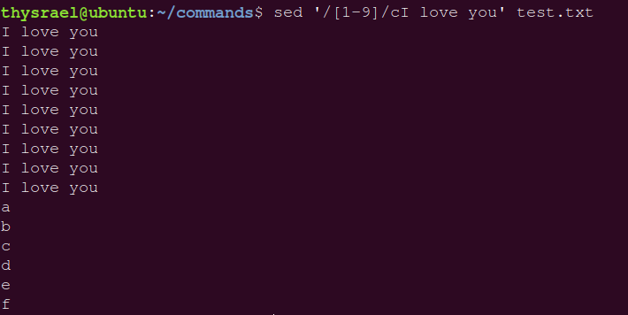

## 一、shell 总论

shell 就是“壳程序”，这个名字是针对 kernel 来说的，也就是在操作系统外围的程序（严格的讲，已经不是操作系统了）。宏观上的 shell 是所有的应用程序，而狭义上的 shell，指的是命令行方面的操作系统界面。我们通过 shell 将我们输入的命令与内核沟通，好让内核可以控制硬件来正确无误地工作。

我们在终端上经常敲的 `ls` 、`cd` 等命令，其实都是一组一组得引用程序（存放在 `\bin`） 里，我们通过 shell 调用这些程序来执行我们的指令。

bash 是 shell 的一种，linux 上还可以有多种 shell 程序。

关于 shell 本身的使用，只有两点需要强调，就是如果一个命令过长，那么可以使用反斜杠 `\` 进行换行输出。此外，如果觉得输入命令太麻烦，可以使用别名设置，比如强大需求的 `ll`。

```bash
alias="ls -al"
```

---


## 二、变量

### 2.1 使用、声明与取消

变量的使用用的是如下格式

```bash
echo ${name}
echo $name
```

其中 `echo` 是**在控制台界面打印变量**的意思，`$` 是引用内容的意思。

bash 的赋值变量有点像**弱数据类型**语言的赋值，赋值的时候可以不指定类型（默认**字符串**）。赋值的时候，需要注意整个语句一般是不能有空格的，所以只有下面这种是对的：

```bash
name=Thysrael
```

然后以下的都是错误的

```bash
name = Thysrael
name=Thysrael I miss you
```

如果，真的想要进行有空格的赋值，那么应该采用双引号或者单引号的形式，两者的区别如下

```bash
name=Thysrael
sayhi="$name I miss you"
sayhello='$name I miss you'
```

可以看出，在双引号里的变量会有进行内容引用，而当引号内只是单纯的字符串。

按照这样的声明方法声明出的变量，都是字符串类型的（但是似乎在 bash 上，字符串类型就已经有很强大的功能了）。我们还可以采用如下命令来声明其他类型的变量：

```bash
declare [-aixr] variable_name
```

其中参数的意义如下表：

| 参数 | 意义                                         |
| ---- | -------------------------------------------- |
| `-a` | 数组                                         |
| `-i` | 整型                                         |
| `-x` | 设置为环境变量                               |
| `-r` | 即 `readonly` ，不能被更改，也不能被 `unset` |

累加内容的写法有两种：

```bash
name="$name"Shaw
name=${name}Shaw
```

如果想要取消变量，有如下写法

```bash
unset name
```

### 2.2 作用范围

变量的作用范围分为三种，**环境变量、全局变量、局部变量**。局部变量是指在脚本**函数体**中声明的变量，其作用域只有函数体内，因为脚本的知识是在后面涉及的，所有就不在此处介绍了。

全局变量就是像上面 `name` 这样变量，他的作用范围是整个进程（也就是 shell 程序的一个“实例化”）。如果在 bash 里面输入：

```bash
bash
```

就可以开启一个子进程，（虽然不会开启一个新的终端，但是确实是启动了一个新进程）

`$` 是一个环境变量（应该是吧），其内容是当前的进程号（PID），我们可以用命令 `echo $$` 打印来看看我们是否重新创建了一个进程，来佐证我们的观点，此外，还需要知道该命令

```bash
exit
```

这个命令是退出当前进程。


具体呈现的就是这样的结构：


所谓的全局变量，就是只能在当前进程中起作用。比如下面的例子：


只能在父进程里面打印出 `name` 变量，而在子进程中并没有 `name` 变量。

而**环境变量**指的就是在父进程和其所有衍生出的进程里都可以使用的变量。我们可以用 `export` 或者 `env` 命令进行查看。

如果我们想把一个全局变量变成环境变量，可以使用如下命令：

```bash
export variable
```


可以发现，是可以在子进程中使用的。但是需要强调的是，这个变量在其他无关进程中依然是没法使用的，比如说我新开一个终端，那么会发现之前终端上定义的各种变量都消失了。

如果想要定义的变量在每个终端中都预定义，那么就必须把这种变量写到 bash 的配置文件中，这样的变量一般都是大写的。

### 2.3 读取

采用如下命令

```bash
read variable_name
```

输入这个命令以后，bash 会等待输入，为了提示用户进行交互，还可以添加提示字符参数：

```bash
read -p "Please input the content of this variable: " variable_name
```

### 2.4 删除

这里说的删除是指删除字符串变量的一个子串，如果想要快速删除一个子串，当然最快的方法是使用**通配符**（退化版的正则表达式）。删除一次只能删除一个子串，那么就是涉及两个问题：

- 从前面开始删还是从后面开始删
- 当采用通配符的时候，是贪婪模式还是非贪婪模式

首先先看一个标准的例子：


可以看到，用这种格式 `{path 命令符/目标子串}` 可以起到删除目的。其中 `命令符` 有以下几种：

| 命令符 | 解释                                           |
| ------ | ---------------------------------------------- |
| `#`    | 采用非贪婪模式从左到右开始匹配（前缀必须匹配） |
| `##`   | 采用贪婪模式从左到右开始匹配（前缀必须匹配）   |
| `%`    | 采用非贪婪模式从右到左开始匹配（后缀必须匹配） |
| `%%`   | 采用贪婪模式从右到左开始匹配（后缀必须匹配）   |

实验结果如下：


### 2.5 空串替换

这里说的是一个很有趣的问题，对于一个字符串变量名。有三种状态：

- A：未被声明
- B：被声明，但是被声明为空串
- C：被声明，但是不为空串

有如下表格：

| 变量设置方式       | A                   | B                   | C              |
| ------------------ | ------------------- | ------------------- | -------------- |
| `var=${str-expr}`  | `var=expr`          | `var=`              | `var=$str`     |
| `var=${str:-expr}` | `var=expr`          | `var=expr`          | `var=$str`     |
| `var=${str+expr}`  | `var=`              | `var=expr`          | `var=expr`     |
| `var=${str:+expr}` | `var=`              | `var=`              | `var=expr`     |
| `var=${str=expr}`  | `str=expr,var=expr` | `str 不变,var=`      | `str 不变,var=` |
| `var=${str:=expr}` | `str=expr,var=expr` | `str=expr,var=expr` | `str 不变,var=` |

做了一些实验：


### 2.6 整数计算

因为变量的默认形式都是字符串，所以对于这种代码，会有很不尽如人意的输出


所以需要采用特定的写法，如下


还有用命令写的：


---


## 三、重定向

其实没有想象的那么难，首先有下面的图


其实这幅图只是在说明，当 bash 运行的时候，同时打开是三个文件。我们在重定向中，用 `0` 代表 `stdin`，`1` 代表 `stdout` ，`2` 代表 `stderr` 。

当我们想要把指令的输出内容重定向的时候，可以采用如下命令

```bash
command 1> file
```

此时 `e.txt` 的内容就变成了：


如果接着运行其他重定向命令，那么就会有如下结果：


会发现原来 `ll` 的输出被 `pwd` 掩盖了。如果我们想要进入追加模式，那么应该有如下命令

```
command 1>> file
```


其次是其实 `1` 是可以省略的，比如：

```bash
ls >e.txt
```

如果想要把标准错误重定向，也是类似，如：

```bash
find /home -name .bashrc > list_right 2> list_error
```

如果想要标准输出和标准错误同时输入一个文件，可以采用以下写法：

```bash
find /home -name .bashrc > list_right 2> list_error 1>&2
```

这个指令的意思是，先将**标准错误**重定向到 `list_error` ，然后再将**标准输出**重定向到标准错误重定向的文件。

还有一个有意思的东西是，如果不想要输出信息了，可以考虑将输出重定向到一个特殊的文件中，这个特定的文件可以当垃圾桶

```find
command > /dev/null
```

---


## 四、多条命令关系

### 4.1 命令执行的判断根据

如果想要一条语句执行多条命令，那么可以采用这种写法

```bash
cmd1; cmd2; cmd3
```

但是这种写法其实就是把三行命令写到了一起，其实没啥逻辑关系。可是如果是这种

```bash
cmd1 && cmd2
```

这个语句的意思是只有 `cmd1` 成功执行，`cmd2` 才能成功执行。这个的底层意思可以这样理解：首先介绍一个变量（可能是个变量吧）：`?` 。这个的意思是**上一条指令的执行结果如何**，如果执行成功，则有 `$? = 0`。这条语句的意思就是当 `cmd1` 的 `$?=0` 的时候，才执行 `cmd2` 。最后实现的效果就是，`cmd_n` 会按照顺序一条一条的执行，直到执行完成，或者有一个指令报错。

与之相对的，有如下命令

```bash
cmd1 || cmd2
```

意思是当第一条指令执行错误的时候，第二条指令才会执行，这个已看上去会有点难以理解，不过其实这句话说得有点类似于一个 `try{}catch{}` 结构。

### 4.2 管道命令

管道命令的意思就是通过连接符 `|` ，使前一条指令的标准输出作为后一条指令的标准输入。下面这张图很好的描述了这个概念：

但是可以接受 `stdin` 的命令并不多，我们进行以下总结：


但是其实能接受 `stdin` 的命令本来就不多，这里介绍几个用法：

#### 4.2.1 阅读指令

这两个指令其实不应该在这里讲，这个应该属于是在**文件**那里讲的，这两个命令与 `cat` 类似，都是用于阅读文本文件的（`vim` 与他们的区别在于不仅可以阅读，还可以修改）。`more` 和 `less` 都是按页阅读文件，也就是说，当文本文件的内容过多的时候，用 `cat` 就没有办法显示全了（只会显示一个屏幕，想看上面的必须用滚轮去捯）。这时就引入了 `more` 和 `less`。我将他们理解为一种文本阅读器，这么说的理由是他们不止有阅读的功能，还有**查找，光标移动**等功能。此外，`more` 可以看成 `less` 功能的一个子集，`more` 的功能更少，而 `less` 更多一些，所以我在日常中使用 `less` 。不存在权衡的问题。

演示如下，输入命令：

```bash
less /etc/debconf.conf
```

可以看到如下场景：


这个界面其实是很像 `vim` 的界面的。而且实际上也很像，有如下操作

- `Space` ：向下翻一页
- `Enter`：向下滑一行
- `/查找内容`：向下寻找内容
- `?查找内容`：向上寻找内容
- `n`：向下重复上次的查找操作
- `N`：向上重复上次的查找操作（上面这四条查找相关，都是与 vim 中相同）
- `q`：退出（也可以是 `ZZ`，这也是与 vim 相同的地方）
- `g`：到文本的第一行去
- `G`：到文本的最后一行去

正是因为其强大的阅读器功能，`less` 常常作为管道命令的接受者，即阅读某个命令的输出信息，有如下示例：


可以看到，我把我的博客的 generate 的输出信息输入到了 `less` 中，这样我就可以用 `less` 来查看我的产生信息了。 


#### 4.2.2 选取指令

##### 4.2.2.1 head tail

这里介绍四种命令，第一个是 `head` ，用来截取信息的前面的几行，如下示例：

```bash
head -n [num]
```

就是显示头部 num 行


第二个是 `tail` 就是显示尾部信息

```bash
tail -n [num]
```


##### 4.2.2.2 grep	

第三个是 `grep` 。如果说前面查找行是按照**行号**，`grep` 则是依靠查找内容来进行行的检索，其格式如下

```bash
grep [-acinv] '查找字符串' filename
```

其中参数有：

- `-a`：将二进制文件按照文本文件的方式查询
- `-c`：计算找到查找字符的次数
- `-i`：忽略大小写的不同
- `-n`：输出查找内容的行号
- `-v`：反向选择，即输出没有查找字符的行

举例如下：


比较高阶一点的用法是将**查找字符串**用**正则表达式的形式表示**，这样的话，查找会更加快一些。

##### 4.2.2.3 sed

`sed` 是一个按行处理文本的工具，前三个还比较局限于**检索功能**，而 `sed` 的编辑功能是强大的。其本质如下

> sed 是一种流编辑器，他是文本处理中的工具，能够完美配合正则表达式使用。处理时，把当前处理的行存储在临时缓存区中，称为“模式空间”(pattern space)，接着用 sed 命令处理缓冲区中的内容，处理完成后，把缓冲区中的内容送往屏幕。接着处理下一行，这样不断重复，直至文件结尾。

其实需要注意的是，就是 `sed` 不会修改目标文件的内容，而只是将改变后的信息输出到屏幕上。

`sed` 的命令由三部分组成（如果用作管道命令的话，就不需要后面的文件了），即

```bash
sed [参数] '查找 1 操作 1;查找 2 操作 2;查找 3 操作 3...' filename
```

**参数**如下

| 字符 | 含义                                                   |
| ---- | ------------------------------------------------------ |
| `-n` | 沉默模式，仅显示处理后的结果，一般打印的时候都需要开着 |
| `-i` | 直接修改文件内容，而不是由屏幕输出                     |
| `-r` | 使用扩展正则表达式的语法                               |
| 其他 | 不重要，就不总结了                                     |

这是开不开沉寂模式的对比


**查找**的方法有很多：

- 按行数查找
  - 一个特定的行数：`1` 表示第一行
  - 一个范围的行数：`1,3` 表示第 1,2,3 行
  - 一个范围的行数，到结尾：`2,$` 表示从第 2 行开始到结尾行
- 正则表达式查找：`/正则表达式/`。似乎正则有一些是没有办法使用的，示例如下


**操作**的功能也有很多，如下表

| 符号 | 解释                                                         |
| ---- | ------------------------------------------------------------ |
| d    | 删除                                                         |
| a    | 追加，会追加到搜索到的下一行                                 |
| p    | 打印，就是把搜索到的内容打印出来（以行为单位）               |
| i    | 插入，会插入到搜索到的上一行                                 |
| s    | 替代，`/old/new`，但是只会找一个，如果想要全局替代，需要写成 `/old/new/g` |
| c    | 取代，会把范围内的行全都替换掉                               |




##### 4.2.2.4 awk

相较于 `sed` 常常用作于一个整行的数据处理，`awk` 则比较倾向于一行当中分成数个字段来处理。

其基本的处理模式如下：

```bash
awk '条件类型 1{操作 1} 条件类型 2{操作 2}...' filename
```

`awk` 会默认按空格将一行中的内容分割成多个**字段**，我们可以用字段变量来表示获得的字段。其中 `$0` 代表一整行数据，`$1` 代表第一个个字段，`$2` 代表第二个字段，以此类推。

此外，`awk` 还有许多内置变量，用以更好的完成工作

| 变量 | 意义                               |
| ---- | ---------------------------------- |
| `NF` | 每一行拥有的字段总数               |
| `NR` | 目前 awk 所处理的是第几行数据      |
| `FS` | 分割字符，可以通过设置它来分割字符 |

前两个变量常常用于构建条件，如下，就是把偶数行取了出来，可以看到这种变量使用的时候，不需要使用 `$`


第三个可以用于指定分隔符，可以把 `BEGIN` 看成一种特殊的条件

##### 4.2.2.5 cut	

`cut` 是弱化版的 `awk` 实现的是行内信息的切割，有如下格式，`-d` 说明要声明分割字符，`-f ` 说明要挑选字段

```bash
cut -d '分割字符' -f num1,num2
```

这条命令表示按照分割字符进行切分，并将切分的结构构成的子串，挑选出第 num1 到第 num2 个子串输出。

还有另外一种格式，即：

```bash
cut -c num1-num2
```

意思是挑选每一行从第 num1 到第 num2 个字符进行输出。效果如图：


---


## 五、脚本

### 5.1 解释器

这里想谈一下我对**解释型语言**和**编译型语言**的理解。我们常说解释型语言写出来的源码叫做**脚本**。我觉得二者的区别在于是否经过编译。对于脚本语言（比如 python，java，matlab），他们是不直接编译生成一个可执行文件的，他们会将源码交到一个叫做**解释器**的程序手里，由解释器读取相关的信息，并执行相关的操作。这个解释器在 python 里叫 python 解释器，在 java 里叫 java 虚拟机。如果说的再彻底一点，可以说解释器是脚本和操作系统之间的一个新的抽象层，就好像一个功能不太健全的虚拟机一样。而编译型语言并没有这个抽象的中间层，它直接编译生成可执行文件，这个文件可以直接运行，而不是通过解释器。

shell 脚本就是发挥了 shell 作为一个解释器的功能，开发出的很多个程序。

shell 脚本第一行会有一个固定的写法，来声明所用的 shell 程序，被叫做 shebang 行，如

```bash
#!/bin/bash
```

### 5.2 基础

脚本一般后缀名为 `.sh` 。想要运行脚本，可以使用命令

```bash
bash sh_name.sh
```

脚本中经常出现分号 `;` 。在实践的过程中，我发现去掉几个也没有啥关系（主要是不去真的很丑），然后发现网上有一个结论是 **“如果写成单行，需要用分号进行区分，如果写成块，那么则用换行符替代了分号”**。不知道对不对。

### 5.3 条件判断

条件判断有两种格式，但是都是一种条件判断的格式，表格如下

判断**文件类型**，其格式为（注意 `[\space\space]` 必须与里面的内容有两个空格的间隔 ）

```bash
test -arg filename
[ -arg filename ]
```

| 参数（arg） | 意义                         |
| ----------- | ---------------------------- |
| `-e`        | 该文件名是否存在             |
| `-f`        | 该文件名是否是文件           |
| `-d`        | 该文件名是否是目录           |
| `-S`        | 该文件是否是一个 socket 文件 |
| `-L`        | 该文件名是否是一个链接文件   |

判断**文件权限**，格式如下

```bash
test -arg filename
[ -arg filename ]
```

| 参数（arg） | 意义                         |
| ----------- | ---------------------------- |
| `-r`        | 判断该文件名是否具有可读性   |
| `-w`        | 判断该文件名是否具有可写性   |
| `-x`        | 判断该文件名是否具有可执行性 |

**比较两文件**，格式如下

```bash
test file1 -arg file2
[ file1 -arg file2 ]
```

| 参数（arg） | 意义                                                         |
| ----------- | ------------------------------------------------------------ |
| `-nt`       | newer than 判断 file1 是否比 file2 新                        |
| `-ot`       | older than 判断 file1 是否比 file2 旧                        |
| `-ef`       | 判断 file1 与 file2 是否是同一文件，判定文件是否均指向同一个 inode |

**比较两个整数**，格式如下

```bash
test num1 -arg num2
[ num1 -arg num2 ]
```

| 参数（arg） | 意义                       |
| ----------- | -------------------------- |
| `-eq`       | equal， 两数相等           |
| `-ne`       | not equal， 两数不等       |
| `-gt`       | greater than ，n1 大于 n2  |
| `-lt`       | less than，n1 小于 n2      |
| `-ge`       | greater than or equal than |
| `-le`       | less than or equal than    |

**判断字符串的数据**，格式如下

```bash
test -arg string
[ -arg string ]
```

| 参数 | 意义                              |
| ---- | --------------------------------- |
| `-z` | zero，判断字符串是空字符串        |
| `-n` | not zero， 判断字符串不是空字符串 |

**判断两字符串是否相等**，格式如下（注意空格问题）

```bash
test str1\space==\spacestr2
test str1\space!=\spacestr2
[\spacestr1\space==\spacestr2\space]
[\spacestr1\space!=\spacestr2\space]
```

**多条件判定**

其实就是逻辑判断符：

| 参数 | 意义   |
| ---- | ------ |
| `-a` | 即 and |
| `-o` | 即 or  |
| `!`  | 即 not |

### 5.4 默认变量

默认变量就是输入脚本后跟的内容，有点类似于 C 程序的 `main`函数的 `argv`，然后还有一些约定的变量：

- `$#`：表示参数的个数
- `$@`：表示所有参数，即 `["\$1" "\$2" "\$3" "\$4" ...]`
- `$$`：表示脚本进程 ID
- `!!`：表示完整的上一条命令，包括参数。当你因为权限不足执行命令失败时，可以使用 `sudo !!` 再尝试一次。

光说没意思，还是放一个脚本的代码和运行结果吧：

```bash
#!/bin/bash

echo "The script name is ${0}"
echo "Total parameter number is $#"
[ "s#" -lt 2 ] && echo "The number of parameter is less than 2. Stop here." && exit 0
echo "Your whole parameter is $@"
echo "The 1st parameter is ${1}"
echo "The 2nd parameter is ${2}"
```


### 5.5 条件分支语句

第一种是简单的 `if` 语句，有格式：

```bash
if [ condition ]; then
	commands
fi
```

有示例：

```bash
#!/bin/bash

read -p "Please input (Y/N): " yn
if [ "${yn}" == "Y" ] || [ "${yn}" == "y" ]; then
    echo "Ok, continue."
    exit 0
fi

if [ "${yn}" == "N" ] || [ "${yn}" == "n" ]; then
    echo "Oh, interupt."
    exit 0
fi

echo "I don't know what your choice is'" && exit 0

```

第二种是 `if-else` 语句，格式如下

```bash
if [ condition1 ]; then
	commands1
elif [ condition2 ]; then
 	commands2
else
	commands3
fi
```

示例如下：

```bash
#!/bin/bash

read -p "Please input (Y/N): " yn
if [ "${yn}" == "Y" ] || [ "${yn}" == "y" ]; then
    echo "Ok, continue."
elif [ "${yn}" == "N" ] || [ "${yn}" == "n" ]; then
    echo "Oh, interupt."
else
    echo "I don't know what your choice is"
fi

```

第三种是 `case` 语句，格式如下

```bash
case $variable_name in
	"value1")
		command1
		;;
	"value2")
		command2
		;;
	"value3")
		command3
		;;
	*)
		command4
		;;
esac
```

示例如下：

```bash
#!/bin/bash

case ${1} in
    "one")
        echo "Your choice is ONE."
        ;;
    "two")
        echo "Your choice is TWO."
        ;;
    "three")
        echo "Your choice is THREE."
        ;;
    *)  
        echo "Usage ${0} {one|two|three}"
        ;;
esac

```

### 5.6 循环语句

跟 C 的思路挺像的，分为**不定循环**和**固定循环**。

对于不定循环，有两种写法

```bash
while [ condition ]
do
	commands
done

until [ condition ]
do
	commands
done
```

其中，`until` 语句的意思当 `condition` 为真的时候，退出循环（与· `while` 相反），有如下示例

```bash
#!/bin/bash

while [ "{yn}" != "yes" -a "{yn} != "YES" ]
do
	read -p "Please input yes/YES to stop this program: " yn
done
```

这个脚本的意思是输入 yes 就可以停止程序，如果用 `until` 来写的话（相同需求），为如下写法

```bash
#!/bin/bash

while [ "{yn}" == "yes" -o "{yn} == "YES" ]
do
	read -p "Please input yes/YES to stop this program: " yn
done
```

固定循环就是一般为 `for` 也同样有多种形式

最为常见的**数值 for** 循环

```bash
for (( i=1; i<=n; i=i+1 ))
do 
	commands
done
```

有如下示例：

```bash
#!/bin/bash

read -p "Please input a number, I will count for 1+2+3+...+your_input" n

s=0
for (( i=1; i<=n; i=i+1 ))
do 
	s=$(( S{s}+s{i} ))
done

echo "The result is ${s}"
```

还有一种形式的 for 循环，格式如下

```bash
for var in con1 con2 con3 ...
do
	commands
done
```

`var` 会分别取 `con1,con2,con3...` 进行执行。

如果想要构造一个连续序列，可以按如下写法

```bash
for c in {a..z}
do 
	echo $c
done
```

此时 c 就会取遍小写字母表。

### 5.7 函数

函数的格式如下:

```bash
function fname() 
{
	commands	
}
```

需要注意的是，不需要声明函数参数，而是直接使就好了，比如 `${1}` 就代表第一个参数，这种使用方法是与脚本的默认变量冲突的，我们认为函数的参量会覆盖脚本的默认变量，有如下示例

```bash
#!/bin/bash

function printIt()
{
    echo "Your choice is ${1}"
}

echo "This program will print your choice."

case ${1} in
    "one")
        printIt 1
        ;;
    "two")
        printIt 2
        ;;
    "three")
        printIt 3
        ;;
    *)  
        echo "Usage ${0} {one|two|three}"
        ;;
esac
```

