## 一、总论

### 1.1 写在前面的话

这已经是我第三遍学Git相关操作了，可以说这个玩意是真的狗，因为确实用不到，不知道下个学期会不会用到，直到现在我刚刚学完，处于知识水平的巅峰，知道Git的具体功能，我也觉得真没啥必要学。我一开始学Git，是因为以为这个跟Github有啥关系似的，其实对于个人来说，使用Github完全没有必要学习Git。

这就引出了Git最重要的一个认识了，就是Git的基本上所有的功能都是为了**团队协作**开发的，而不是所谓的**版本控制**（当然也可能是，反正我理解的不是）。Github上面那些看似唬人的branch，tag，respository，ssh key，token之类的概念，其实都是为了团队协作设计的，而不是为了版本控制，或者其他啥目的，简而言之，就是与我现在的需求无关。

对于Git的学习，大致分为两个部分，即**版本控制**和**团队协作**。之后会详细介绍。

所有的版本控制系统，只能跟踪文本文件的改动，比如txt文件，网页，所有程序的代码等，Git也不列外，版本控制系统可以告诉你每次的改动，但是图片，视频这些二进制文件，虽能也能由版本控制系统管理，但没法跟踪文件的变化，只能把二进制文件每次改动串起来，也就是知道图片从1kb变成2kb，但是到底改了啥，版本控制也不知道。所以我当时搭博客的时候，希望能够回退到没有安装某个插件的版本，应该是不可能了，不过我应该可以控制配置文件的版本。

### 1.2 一个比喻

为了理解三个概念，即**工作目录，暂存区和版本库**，我们进行一个比喻。我们在工作台上工作，当我们做出一个东西的时候，就可以考虑把他放到一辆货车上。我又做了一个东西，做完以后把他扔货车上了，但是做别的时候突然觉得不行，我得重新做，于是我就把第二个东西从货车上取下来，重新做。当我们做了一系列东西以后，我们的货车相当于就装载了我们一系列的东西，我们看了看，觉得没啥毛病，就开着货车把这一个系列的东西都放到仓库里去了。为啥要放到仓库里，是因为我们恋旧，保不齐哪天就想把之前的东西拿出来看看呢。

在这个比喻里，工作台就相当于我们的工作目录，货车就相当于我们的暂存区，仓库库就相当于我们的版本库。

我一开始学的时候，觉得暂存区贼没有，因为反正版本库可以记录，那么为什么还得要个中间层在这里碍事，这是因为**版本**是一个很大的概念，修改一份代码，一般不值当作为一个版本，就好像没人做一个东西，就风尘仆仆地让仓库里去，而是应该攒一堆东西一起放入仓库。而暂存区就是提供这样一个攒东西的容器。相当于一个小而精的版本库，虽然只能存储一个版本，但是可以一个一个文件的取回。

在 git 中，有一组名词叫做**检入（checkin）**和**检出（checkout）**，所谓的检入，就是把工作台上的东西放到货车上，或者把货车上的的东西放到仓库中的过程，而检出与之相反，是把货车上的一个文件取到工作台上，或者把仓库里一系列东西取到工作台上的过程。

### 1.3 版本库管理

最难理解的就是这个，我花了很久才明白这是一个什么样子的结构。我们看看我们的需求是什么，我觉得版本控制，就是在我们的工作进行到了一定程度以后（比如说实现了某个功能以后），我们存一个档（有一说一，我觉得存档这个词比快照更加方便理解），这样之后的工作的时候，哪怕搞砸了，还是能够恢复的，就跟过BOSS前存个档，这样就随便浪一样。

那么其实就暴露了一个问题，就是对于**存档的管理问题**，我们在游戏中，一般是有存档限制的，比如只能存五个档，存多了就覆盖原来的存档了。但是想想也知道，我们当然不希望自己做版本控制的时候，也有数量限制，当然实现一个无限制的版本控制，肯定不难啊。我们假设已经实现了，那么怎么管理呢？面对很多的版本，怎么去检索出自己想要的版本呢？如果用一个数组去存版本，检索起来不会容易的，比如我们在开发的时候，希望维持一个既有的稳定版本的同时，又可以有一个分支快速开发，那么也就是说，需要标记这个稳定版本，又是如何标记的呢？这就是一个问题。还有一个问题，就是我们有的时候是不希望存档是完全覆盖的，就比如我打游戏的时候，虽然最后死在了BOSS，我前期打小怪的经验还是希望保留的，当然一般游戏如果是存档的话，那就是直接覆盖了。如果我们进行版本控制的时候，可以挑选两个存档的长处，进行融合，那么显然是很好的功能，这个功能又如何实现呢？

那么针对上面的三个问题（无限存档，查找存档，融合存档），git 给出了自己的方案，他用了一个有向图结构来存储版本库，而且采用了指针来进行版本的查找，一张比较标准的版本库的数据结构就是下面这样

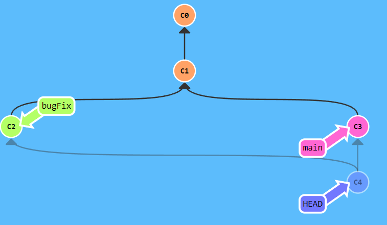

里面的一个个圆圈就是一个个存档，也就是一个个版本；里面的标签，也就是指针；版本之间会用黑色的箭头相连。我们来解释一下是啥意思。无限存储面临的一个问题是显然是不能每个版本就把所有内容全都复制一遍，我做过一个项目，一个项目就 1 个G，这要是一个256G 的硬盘，顶多存档 256 次。显然是不能满足需求的。可是如果在版本之间建立逻辑关系，那么就不一样了，相当于我们记录的是**版本间变化**，而不是一个独立的版本。这样说其实不准确，git 采用的是，如果版本中的一个文件没变化，就记录上一个版本，如果有变化，就记录这个版本，如图

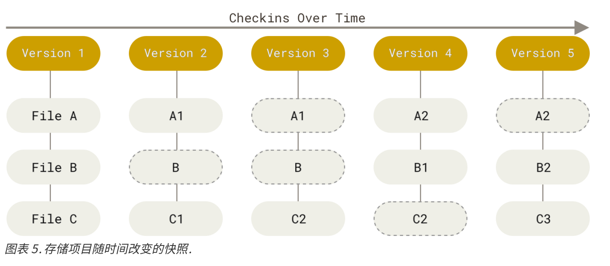

为了实现**前一个版本**的概念，我们用了黑色箭头来指明这种逻辑关系。	

那种标签一样的东西可以帮助我们快速查找特定版本，比如说我们想要 C3 版本了，那么只需要说检出 main 就好了。在诸多标签中，有一个标签最重要，就是我们的 `HEAD` ，我们可以说，**我们只能操纵HEAD和HEAD指向的标签，而不能操作其他标签**。

此外，还需要强调的是，这只是 git 的版本库的内部数据结构，而不是他给用户的抽象结构，他的抽象结构更像是这样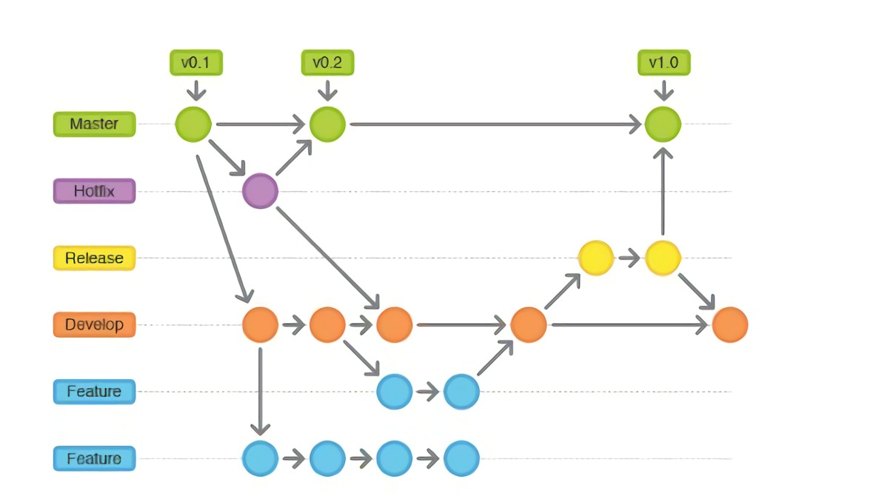

**分支**的概念被引入，版本被串联成了不同的分支，这会使版本的管理更加容易理解，因为我们相当于对版本进行了一个在不同分支上的分类。所谓分支，就是同名可变指针的移动路径。

之前我老觉得每一条分支就是一个“分支”，这句废话的意思是，就像上面的图一样，比如说 Develop 是一条分支（橙色），那么它就对应的是由橙色的版本库连接起来的东西，其实是不是的，由版本库做节点的树结构（因为合并操作的存在，其实不是严格的树结构）是存在的，但是一个分支并不代表一个路径（也就是一串相连的节点们），而只是一个指针，指向了具体的一个节点。具体图景如下：


从图中可以看到，尽管main应该是个“分支”，但它其实就是个指针。指向了某个节点而已。

### 1.4 Github 

对于如何使用Github，其实我觉得就当成**网盘**那样使就可以了，可以自己将各种资料上传到网上，也可以从网上下载各种资源，可能跟网盘不太一样就是有搜索功能，还有提问功能吧，如果不涉及团队协作，那么理解到这个层次，我绝对对我自己是够用了。其唯一与网盘不同的是，对于删除操作似乎不太方便，我没有细致研究，不敢妄下断语，似乎只用网页端是没有办法完成删除操作的。

---


## 二、建库

### 2.1 建库方式

一共有两种建库方式，一种是直接在本地建库，在所处的文件夹下输入以下代码，就可以完成建库，建立的库文件夹就是所处文件夹。

```bash
git init
```

然后这样的仓库需要通过下面这条命令与远程仓库进行关联：

```bash
git remote add origin https://github.com/Thysrael/仓库名
```

需要注意，origin也只是一个名字，我们用它来指代关联的远程仓库。

还有一种是通过clone Github上的库进行建库，也就是在Github里面建好了库，然后在clone到本地，输入以下命令，建立的库会以文件夹的形式出现在Git bash所在的目录，换句话说，git bash所在的目录不是库，而是其中的一个子文件夹是，这是与前一种方法不同的地方。这个子文件夹的名字就是github的仓库名。

此外需要强调的是，clone下来的仓库拥有所有分支，可能只是不显示，但是是可以进行切换的。

```bash
git clone url
```

可能是我学业不精，我还是觉得第二种方法更好，是因为第一种方法建立的分支叫做master，而github默认的分支是main，按照理论来讲，可能可以由本地不同名的分支向github的分支提交，但是我捣鼓了很久，都发现只能向同名的分支提交更新，所以第一种方法就很废物，因为它会在远端产生一个新的分支master，而过去的main分支则没有更新。

### 2.2 .gitignore

建完库以后第一件事情要做的就是先把 `.gitignore` 文件写了，这个文件的作用是当执行 `git add .` 操作的时候，可以把这个文件里列出的内容屏蔽掉（也就是并不追踪这些文件）。具体写法如下

```.ignore
### Example user template template
### Example user template

# IntelliJ project files
.idea
*.iml
*.txt
out
gen
```

举例：

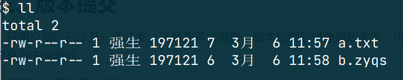

此时我有两个文件，然后我的 `.gitignore` 文件写法如下

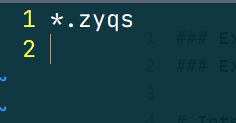

也就是会忽略所有的 `.zyqs` 文件，我们进行一个 `git add .` 操作

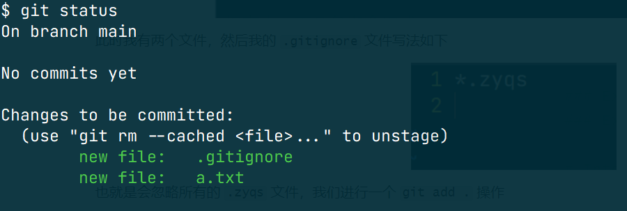

可以看到，`b.zyqs` 文件并没有被提交到暂存区。

---


## 三、暂存区的使用

### 3.1 直观理解

之前我一直忽略了这个方面，是因为我平时就直接

```bash
git add .
```

类似于我先把一个版本里所有东西都做好了，然后直接进行一次装车，然后开着车就把所有东西都运仓库里去了。但是这是因为当时比较年轻啊，当我开始做学校布置的作业的时候，一个仓库里有四道题，我做完第一二三题，想着，回头一起交，就这么先撂这了，开始做第四道题，结果一不小心，把前三道题都删了，呜呜呜，麻了。但是其实有两种预防手段，一种是我交三个版本，但是这也不合逻辑啊，我的第一个版本只能获得四分之一的分数（只做了一道题），我认为每个版本都应该是具有满分的可能性的，就跟每个项目版本都具有可运行的可能性一样。所以应该选择另一个手段，也就是完成一道题，就把一道题移到暂存区，这样就可以起一个比较便捷的存档作用。

### 3.2 原理

只是工作原理，有下面这张图

 

所谓 **stage** 就是已经提交到**暂存区**了。

- **Untracked**: 未跟踪, 此文件在文件夹中, 但并没有加入到git库, 不参与版本控制. 通过`git add` 状态变为`Staged`.
- **Unmodify**: 文件已经入库, 未修改, 即版本库中的文件快照内容与文件夹中完全一致. 这种类型的文件有两种去处, 如果它被修改, 而变为`Modified`. 如果使用`git rm`移出版本库, 则成为`Untracked`文件
- **Modified**: 文件已修改, 仅仅是修改, 并没有进行其他的操作. 这个文件也有两个去处, 通过`git add`可进入暂存`staged`状态, 使用`git checkout` 则丢弃修改过, 返回到`unmodify`状态, 这个`git checkout`即从库中取出文件, 覆盖当前修改
- **Staged**: 暂存状态. 执行`git commit`则将修改同步到库中, 这时库中的文件和本地文件又变为一致, 文件为`Unmodify`状态. 执行`git reset HEAD filename`取消暂存, 文件状态为`Modified`

这些状态都可以用下面的命令查询

```bash
git status
```

这种命令输出的信息太乱了，可以用下面的命令完善

```
git status -s
```

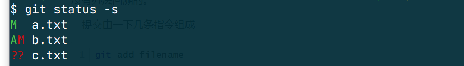

其中 `?` 表示未被追踪，`M` 表示被修改，`A` 表示是新增文件。左侧那一列是暂存区相对于版本库前一版，可以看出，`a.txt` 在暂存区中是相对于版本库是修改过的，`b.txt` 是相对于前一个版本库新增的，而 `c.txt` 是未被追踪的 。右侧的一列是工作目录相对于暂存区的，可以看出 `a.txt ` 在工作目录中是与暂存区相同的，`b.txt` 相对于暂存区是修改过的，而 `c.txt` 是未被追踪的 。

### 3.3 命令

我们用这条命令可以把某些文件加入暂存区

```bash
git add <filename>
```

关于恢复，其实有两种操作

一种这样

```bash
git restore <filename>
```

另一种是这样

```bash
git checkout -- filename
```

据说 `restore` 可以应用的范围更广，但是我做了好多实验，没发现它俩有啥区别

如果想要将暂存区的记录撤销，也有两种方法，

第一种会让暂存区的操作回归到修改状态

```bash
git restore --staged <filename>
```

第二种会让暂存区的文件，直接变成未追踪状态

```bash
git rm --cached <filename>
```

具体效果如下图，其中对 `a.txt` 使用的是第一条命令，对 `b.txt` 使用的是第二条命令。

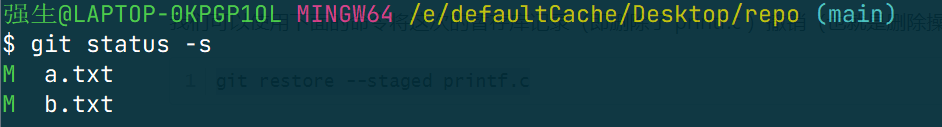

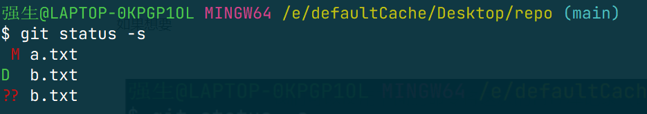

---


## 四、版本控制

### 4.1 提交版本

我们一般是整个文件夹中的内容一起上传，也就是下面这条指令

```bash
git add .
```

当我们把需要用的文件交到了暂存区，就可以用下面这条指令提交到版本库

```bash
git commit -m "注释"
```

里面的 -m 就是为了添加注释，注释相当重要。

如果写好了 `.gitignore` 那么，其实可以将 `commit` 和 `add` 命令进行一个合并

```bash
git commit -a -m "注释"
```

那么为什么要设置一个暂存区呢？我个人理解是由本地目录向暂存区提交的时候是可以一件一件的提交的，那么就存在新版本中还有与老版本一样的文件，这时候，如果没有提交，那么就用老版本文件代替，暂存区提供了一个全是新文件的地方，让我们可以看清楚我们的修改。只不过我们习惯于全部提交，所以这个功能就很鸡肋了。

### 4.2 版本查看

我们还可以用下面这条指令看我们的提交版本记录

```bash
git log
```

但是只有 `git log` 会显得比较单调乏味，但是如果用的是这条命令，会显得好看很多（只是好看）

```bash
git log --graph
```

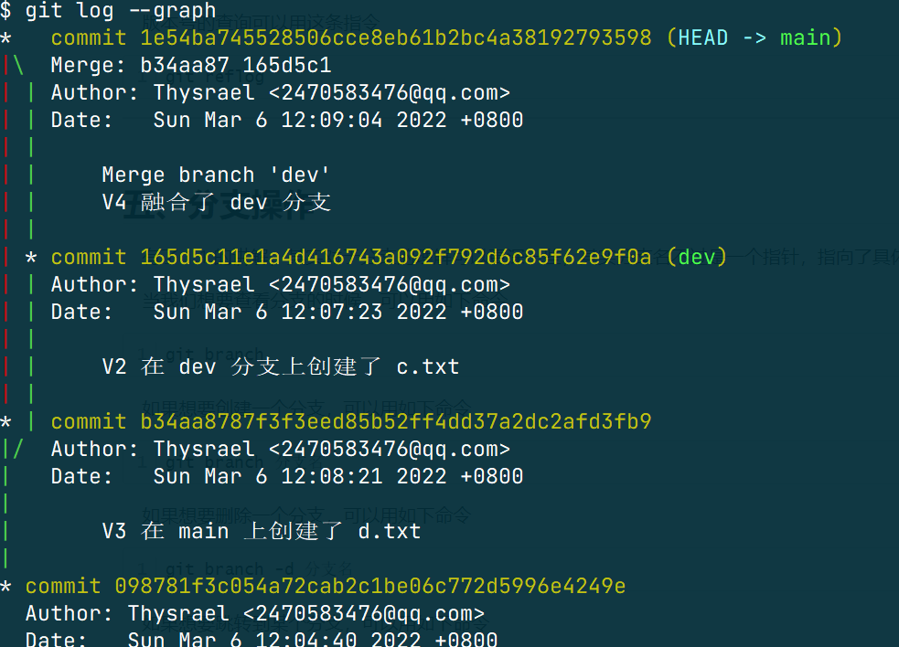

`git log` 只能看当前版本所在分支，并且位于当前版本之前的版本记录，所以我更习惯下面这条指令，提供的信息更多

```bash
git reflog
```
### 4.3 版本控制

有了 1.3 的讲解，其实对于分支的理解可以更深一些，其实分支名不过是一个指针，指向了具体的版本库。当然，众多指针中有一个比较特殊的，就是 `HEAD` 指针。我现在对它的理解是，我们大部分的操作都是针对与 `HEAD` 指针而言的。`HEAD`就是当前的意思。

所谓的 `checkout` 其实就是改变 `HEAD` 的指向，使工作目录变成  `HEAD` 指向的版本。那么其实 `HEAD` 有两种指向，一种是指向具体的版本库，一种是指向分支（也就是 `HEAD` 指针指向了一个分支指针）。当指向分支的时候，呈现这种形式

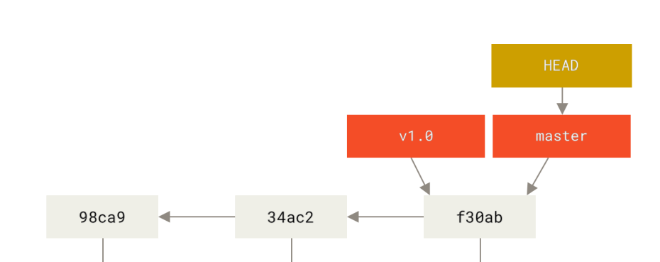

当指向具体的版本库的时候，呈现这种形式：

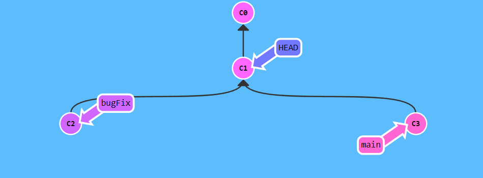	此时 `HEAD` 指向C1版本库（也被称为 `HEAD` 分离状态)。

如果想要 `HEAD` 重新指向一个分支，可以使用命令

```bash
git checkout <branch-name>
```

如果想让某个分支强制指向 `HEAD` 所指向的目录，可以用命令（平时分支指针的移动需要 HEAD 指在其上面，一般只能前进和后退，不能跳转）：

```bash
git branch -f <branch-name> HEAD
```

其实，只要熟悉了上边的操作，我们就可以在任何版本之间进退自如了。当然，如果利用上git的树结构节点是有父节点信息的（与之相对，没有子节点信息，所以回退的时候会发生版本丢失）。可以用 `reset`  命令（其实就是顺着数向上回溯）。

如果想要实现版本回退，可以使用如下命令，其中 n 是

```bash
git reset --hard HEAD~n
```

然后如果只是一个版本的回退（两个版本就是两个^），可以用下面的指令来实现。从上面这两条指令可以看出，HEAD其实是一个指向不同版本的指针，指向谁，就显示哪个版本。

```bash
git reset --hard HEAD^
```

如果想实现版本的跳转，那么可以用下面的指令

```bash
git reset --hard 版本号
```

版本号的查询可以用这条指令

```bash
git reflog
```

### 4.3 分支操作

当我们想要查看分支的时候，可以用如下命令

```bash
git branch
```

如果想要创建一个分支，可以用如下命令

```bash
git branch 分支名
```

如果想要删除一个分支，可以用如下命令

```bash
git branch -d 分支名
```

如果想要跳转到某个分支，可以用如下命令

```bash
git checkout 分支名
```

如果想要创建并跳转到这个分支，可以用如下命令

```bash
git checkout -b 分支名
```

关于分支的合并，其实应当这样理解，两个版本之间存在差距，执行如下命令可以让其合并，即在当前分支融合某一分支

```bash
git merge 分支名
```

当然经常融合不了，这个时候需要重新提交，然后仔细修改，然后提交版本，就没有问题了，有问题的时候控制台会在分支名后跟一个“merging”。

还有一种操作叫做变基，其实也很与merge很类似，如下命令

```bash
git rebase <branch-name>
```

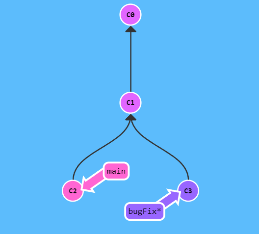

执行

```bash
git rebase main
```

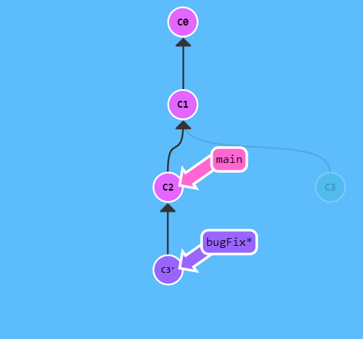


---


## 五、远程仓库

### 5.1 分布式管理

对远程仓库的处理其实可以引出 git 的另一个重要特性，那就是**分布式管理**，他的意思是说，任何一台电脑上的版本库都存着这个版本库的全部版本信息，也就是保存着那个树结构。这样相对于**集中式管理**，丢失全部版本数据的概率小多了。但是同样的，每台机子上的版本库都必须与中心库保持一致，这无疑增加了学习的难度。

其中最重要的一个思想是，有一组**远程分支指针**出现在**本地版本库**中，来记录本地版本库与远程库的差距，我们一般的移动分支指针的操作是没有办法对远程分支指针使用的。换句话说，远程分支指针的移动条件更为苛刻，大概就像这样：

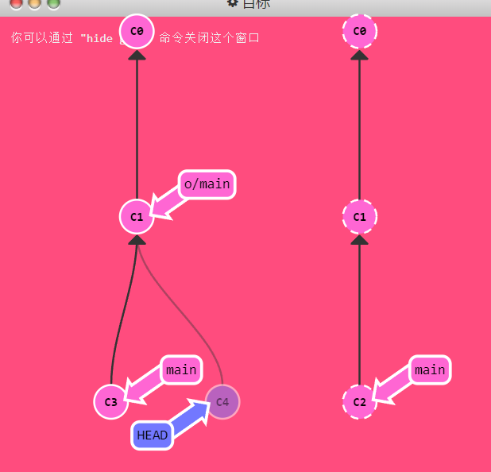

### 5.2 命令

远程仓库的命令呈现就是基础的命令没人用，常用的命令都是由几条命令复合而来的。

比较基础的 `fetch` ，他可以把远端仓库的版本全都拷贝下来，而且还会移动远端指针到相应位置，示例如下

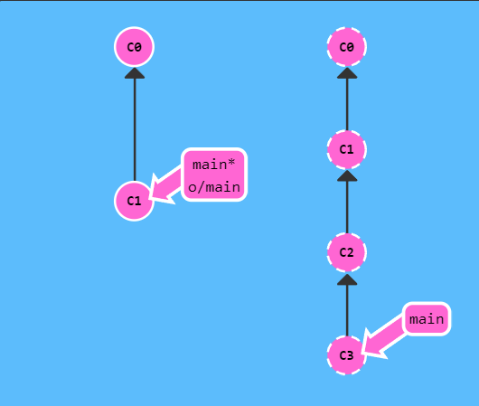

```
git fetch
```

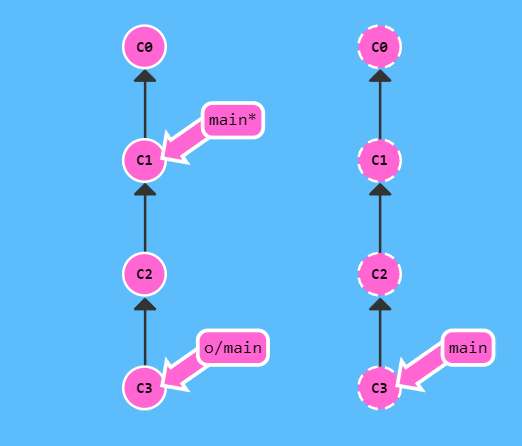

但是 fetch 并不会移动本地的指针。所以我们为了比较自然的操作，其实是需要把本地指针更新一下的，那么更新就一般会涉及 merge 操作（因为版本分支问题，如果不 merge，没法移动指针），这是没有操作的时候

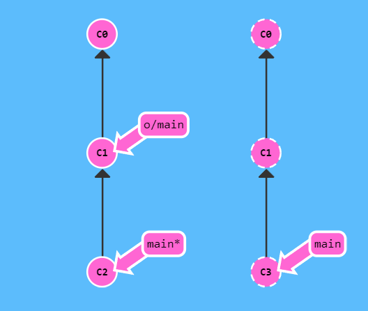

进行如下命令

```bash
git fetch && git merge o/main
```

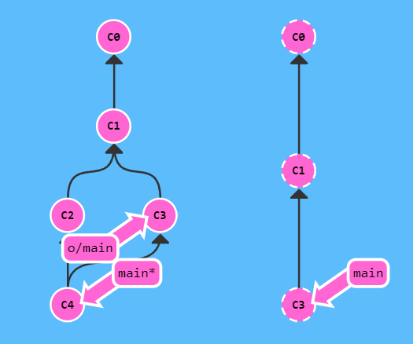

上面两条指令可以合成一条，就是我们熟悉的

```bash
git pull
```

`push` 是另一个可以更新远端分支指针的操作，未使用命令前

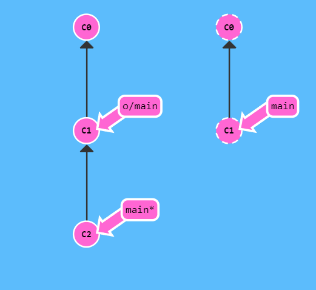

```bash
git push
```
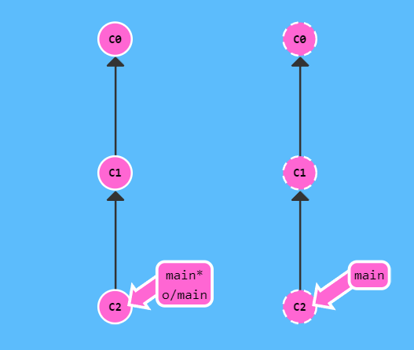

如果提交不成功，那么就是因为本地的版本落后与远端版本了（别人也在修改这个分支），所以需要先把远端的版本从新拉取过来，在拉取的过程中可能会需要解决冲突，解决完应该就可以提交了。

```bash
git pull && git push
```


## 六、其他操作

### 6.1 tag

git 提供标签系统，有如下命令：

展示所有的 tag

```shell
git tag
```

创建一个轻量标签（也就是没有注释信息的标签）

```shell
git tag <tag_name>
```

创建一个附注标签（附加注释信息的标签），其中用 -`a` 表示有附加信息，用 `-m "attached message"` 表示添加的附注信息。 

```shell
git tag -a v1.4 -m "my version 1.4"
```

删除标签

```shell
git tag -d <tag_name>
```

将标签推向远端

```shell
git push origin <tag_name>
git push origin tags
```

将远端标签删除

```shell
git push origin --delete <tagname>
```

### 6.2 amend

这是一种对于前一个 `commit` 的修正操作，如果在进行玩 `commit` 后比较后悔，希望再改一些然后再 `commit`，或者只是单纯的希望改一下前一个 `commit` 的 `commit message`，就可以使用

```shell
git commit --amend
```

### 6.3 abort

当我们进行 rebase 或者 merge 的时候，经常出现一种特殊的“合并进行中”状态，在 `zsh` 中用红色表示

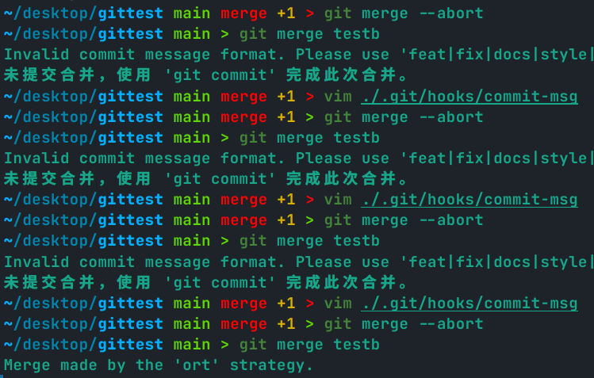

这表示有需要手动解决的冲突，但是如果实在是太多了，或者就是不想进行了，可以用如下命令退出。

```shell
git merge --abort
git rebase --abort
```

### 6.4 撤销合并

如果想要撤销一个合并，有两种方式，首先看例子

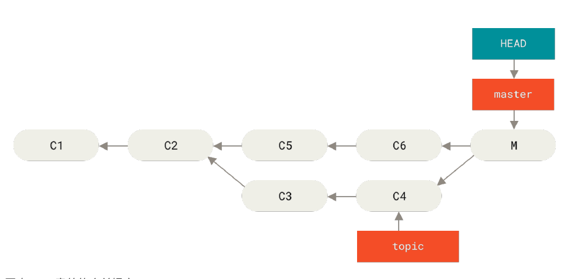

我们的目的是撤销 `M` 这个提交。

第一种方法是用 `reset` 

```shell
git reset --hard HEAD~
```

执行完这条命令后，就成了这个样子

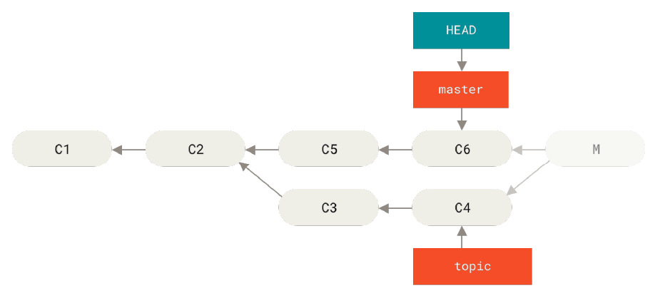

看上去解决问题了，但是如果不幸已经将 `M` push 到了远端，那么也可以使用强制 push 来修正远端错误，只是别人也需要配合你。

```shell
git push -f
```

第二种方法是使用 `revert`

```shell
git revert -m 1 HEAD
```

`revert` 会生成一个新的提交，这个提交里面去掉了 `M` 的一个父节点（这是通过 `-m 1` 标记指出 “mainline” 需要被保留下来的父结点做到的），之后就会如图所示：

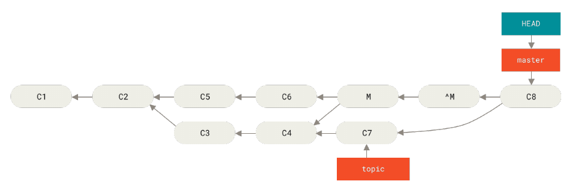

但是因为 `^M` 这个提交是基于 `M` 的，所以当再次合并的时候（也就是 `C8` ），只有 `C7` 的改变会被合并，而 `C3, C4` 不会，所以如果希望全都被合并，还需要撤销原来的 `^M` ，也就是再次进行 `revert`

```shell
git revert ^M
```

真是麻烦的方法呀。

### 6.5 ~ 和 ^

`~, ^` 都是一种相对移动的方式，其中 `HEAD~2` 是“父提交的父提交”，而 `HEAD^2` 是第二个父提交（一个节点可能有多个父亲）。

### 6.6 stash

如果想立刻存储 `working directory` 和 `index` （也就是 `staged`）的状态，可以用 

```shell
git stash push
```

可以用以下命令恢复

```shell
git stash pop # 弹栈
git stash apply # 不弹栈
```

所有存储的 `stash` 展示

```shell
git stash list
```

移除一个 stash

```shell
git stash drop
```

### 6.7 blame

超级有用的命令，可以用来看代码是谁写的（没准是 IDEA  Author 补全的机理）。

以下方法是最为全面的方法。

```shell
git blame -C -L <start_line_num>, <end_line_num> <file_path>
```

### 6.8 规范的 commit message

对于规范的 commit message，可以首先用如下命令安装一个 message 生成工具

```shell
npm install -g commitizen 
npm install -g cz-conventional-changelog
echo "{ "path": "cz-conventional-changelog" }" > ~/.czrc
```

然后再使用

```shell
git cz
```

就可以规范提交了。

然后可以在客户端建立一个钩子函数，用于检测 `commit` 信息，在 `.git/hooks/commit-msg` 文件内写入如下内容即可

```shell
#!/bin/sh
commit_msg_file=$1

commit_msg=$(cat "$commit_msg_file")

if ! echo "$commit_msg" | grep -qE "^(feat|fix|docs|style|refactor|test|chore)(\(\w+\))?: .{1,50}$|^Merge branch.*"; then
    echo "Invalid commit message format. Please use 'feat|fix|docs|style|refactor|test|chore(scope)?: message' format."
    exit 1
fi
```

