> 因为笔者鸽了，所以这里的代码就截止到 lab2 了，lab3 和 lab4 的代码在异常处理流那篇文章中有

# MOS 源码解读

[TOC]

## boot/

### start.S

#### .data

在这个里面声明了数据段的结构

```assembly
.data
            .globl mCONTEXT
mCONTEXT:
            .word 0

            .globl delay
delay:
            .word 0

            .globl tlbra
tlbra:
            .word 0

            .section .data.stk
KERNEL_STACK:
            .space 0x8000
```

可以看到，`mCONTEXT，delay,tlbra` 都是 `.data` 段的起始地址。里面的 `tlbra` 是 `tlb return address` 的意思，应该是 tlb 缺失异常处理结束后，就会返回这个地址。

#### _start()

set，如注释所言

```assembly
/*.set is used to instruct how the assembler works and control the order of instructions */
     .set	mips2
	.set	reorder
```

关于设置协处理器装填，有

```assembly
/* Disable interrupts */
mtc0	zero, CP0_STATUS
```

该条指令将CP0_STATUS寄存器的所有可写位置零。

所以将该寄存器置零的主要作用是：**禁用所有中断**

```assembly
mtc0    zero, CP0_WATCHLO
mtc0    zero, CP0_WATCHHI
```

在R30XX系列处理器中并没有实现这两个寄存器。查阅MIPS32文档，这两个寄存器实现的是调试功能，置零表示禁用调试功能。

```assembly
	/* disable kernel mode cache */
	mfc0	t0, CP0_CONFIG
	and		t0, ~0x7
	ori		t0, 0x2
	mtc0	t0, CP0_CONFIG
```

查阅MIPS32文档，该操作将config寄存器的低三位置为010.低三位叫做K0域，控制kseg0的可缓存性与一致性属性。置为010代表uncached，即不经过cache。

其实让我们干的只有这件事

```assembly
	/*
	To do: 
	set up stack 
	you can reference the memory layout in the include/mmu.h
	*/
	lui		sp, 0x8040
	jal		main
```

由内存图可以知道，只要把栈指针设置成 `0x8040_0000` 然后跳到 main 就可以了。设置栈指针是极其有必要的，因为我们后面会调用各种函数，而这些函数存储局部变量的位置就在栈上（下面这幅图画的有些不严谨，栈顶指针应该在栈顶）

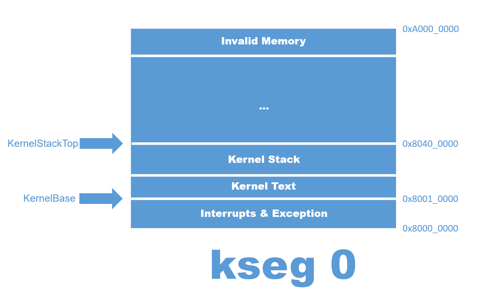

后面还有一个经典的刻意死循环

```assembly
loop:
	j		loop
```

然后对于这段代码，我没看懂

```assembly
			.section .data.stk
KERNEL_STACK:
			.space 0x8000
```

我问叶哥哥，叶哥哥说没用，似乎重构的时候把他删了也不影响。

总的来说，这个文件里存了用汇编语言实现的 `_start` 这个函数。这个函数的功能是设置 CP0 和栈指针，然后跳到 `main` 中。。

---


## init/

### main.c

#### main()

```c
int main()
{
	printf("main.c:\tmain is start ...\n");

	mips_init();
    
	panic("main is over is error!");
	return 0;
}
```

这个函数主要的功能就是调用 `mips_init()` 函数。很容易理解

### init.c

#### mips_init()

```c
void mips_init()
{
	printf("init.c:\tmips_init() is called\n");

	// Lab 2 memory management initialization functions
    // configure some constant for the memory
	mips_detect_memory(); 
	mips_vm_init();
	page_init();

	physical_memory_manage_check();
	page_check();

	panic("^^^^^^^^^^^^^^^^^^^^^^^^^^^^^^^^^^^^^");
	while (1);
	panic("init.c:\tend of mips_init() reached!");
}
```

这次的内容与 lab 1时有所不同，因为增加了对存储系统的设置，主要通过三句话:

这句话设置了物理存储（即主存）的诸多参数，比如说物理存储的地址范围，空间，是否有拓展存储。

```c
mips_detect_memory(); 
```

这句话设置了虚拟存储系统。

```c
mips_vm_init();
```

这句话设置了物理存储系统：

```c
page_init();
```

后面两个函数只是为了检验 lab1 的正确性，不属于操作系统

```c
physical_memory_manage_check(); 	// 检查虚拟存储系统
page_check();						// 检查物理存储系统
```

后面三句话应该只是一种捣乱，目的是为了终止这个函数的运行

```c
panic("^^^^^^^^^^^^^^^^^^^^^^^^^^^^^^^^^^^^^");
while (1);
panic("init.c:\tend of mips_init() reached!");
```

#### bcopy()

```c
// byte copy
void bcopy(const void *src, void *dst, size_t len)
{
	void *max;

	max = dst + len;

	// copy machine words while possible
	while (dst + 3 < max) 
    {
		*(int *)dst = *(int *)src;
		dst += 4;
		src += 4;
	}

	// finish remaining 0-3 bytes
	while (dst < max) 
    {
		*(char *)dst = *(char *)src;
		dst += 1;
		src += 1;
	}
}
```

这是一个按字节拷贝的函数，按字节拷贝的意思就是基本上啥内容都可以拷贝，因为啥内容都可以分割成字节。

函数声明中指明了拷贝源的起始地址 `src` ，拷贝目标的起始地址 `dst` ，拷贝的内容的字节数 `len` 。有趣的是，拷贝源的起始地址用修饰符 `const` 修饰，这说明其指向的内容是不可以修改的。

```c
// byte copy
void bcopy(const void *src, void *dst, size_t len)
```

后面拷贝的方法也很有意思，先是 4 个字节 4 个字节的拷贝，然后才是 1 个字节 1 个字节的拷贝，可能这样比较高效吧，不过为什么不用 `long long` 就可以 8 个字节为单位拷贝了。经过陈同学指正，因为 32 位的系统一个字就是 4 个字节，用 long long 去存取，其实应该就是在汇编层面被拆成了两个指令。

```c
	void *max;
	max = dst + len;

	// copy machine words while possible
	while (dst + 3 < max) 
    {
		*(int *)dst = *(int *)src;
		dst += 4;
		src += 4;
	}

	// finish remaining 0-3 bytes
	while (dst < max) 
    {
		*(char *)dst = *(char *)src;
		dst += 1;
		src += 1;
	}
```

#### bzero()

```c
// b is the head address of the memory need to be clear to 0
// len is the length of the memory need to be clear
void bzero(void *b, size_t len)
{
	void *max;

	max = b + len;

	// zero machine words while possible
	while (b + 3 < max) 
    {
		*(int *)b = 0;
		b += 4;
	}

	// finish remaining 0-3 bytes
	while (b < max) 
    {
		*(char *)b++ = 0;
	}

}
```

参数和方法与 `bcopy() ` 类似，就不说了。

---


## include/

### types.h

#### typedef

主要是完成了数据类型别名的声明，这样可以提高兼容性，而且往往可以通过别名来推断数据的字节数

```c
typedef unsigned __attribute__((__mode__(QI))) u_int8_t;
typedef int      __attribute__((__mode__(HI))) int16_t;
typedef unsigned __attribute__((__mode__(HI))) u_int16_t;
typedef int      __attribute__((__mode__(SI))) int32_t;
typedef unsigned __attribute__((__mode__(SI))) u_int32_t;
typedef int      __attribute__((__mode__(DI))) int64_t;
typedef unsigned __attribute__((__mode__(DI))) u_int64_t;

typedef int32_t         register_t;

typedef	unsigned char	u_char;
typedef	unsigned short	u_short;
typedef	unsigned int	u_int;
typedef	unsigned long	u_long;

typedef	u_int64_t		u_quad_t;	/* quads */
typedef	int64_t			quad_t;
typedef	quad_t 			*qaddr_t;

typedef u_int32_t        size_t;
```

最后一个 `size_t` 可以理解为通用数据类型，大概意思就是要是没事就用他吧。

#### MIN

MIN 这个宏，写的也很复杂，有一篇文章解释这个

```c
#define MIN(_a, _b)	\
	({		\
		typeof(_a) __a = (_a);	\
		typeof(_b) __b = (_b);	\
		__a <= __b ? __a : __b;	\
	})
```

https://www.cnblogs.com/sunyubo/archive/2010/04/09/2282179.html

关于 `typeof`，它可以取得变量的类型，或者表达式的类型。

对于这句话

```c
typeof(_a) __a = (_a)
```

就是声明一个叫做 `__a` 的变量，他的数据类型与 `_a` 相同。

#### ROUND, ROUNDDOWN

下面这两个宏

```c
/* Rounding; only works for n = power of two */
#define ROUND(a, n)	(((((u_long)(a))+(n)-1)) & ~((n)-1))
#define ROUNDDOWN(a, n)	(((u_long)(a)) & ~((n)-1))
```

会输出 a 在 n 的几倍数之间，比如下面

```c
#include <stdio.h>
typedef	unsigned long	u_long;
#define ROUND(a, n)	(((((u_long)(a))+(n)-1)) & ~((n)-1))
#define ROUNDDOWN(a, n)	(((u_long)(a)) & ~((n)-1))

int main() 
{
    printf("%d\t%d\n", ROUND(25, 4), ROUNDDOWN(25, 4));
}

```

会输出 `28	24` 因为 25 在 $4\times6 \sim 4\times 7 $ 之间。

具体的原理从这里看

```c
#define ROUNDDOWN(a, n)	(((u_long)(a)) & ~((n)-1))
```

- `~((n)-1)` 是一串 1 以后有几个 0。比如 4 是 111……1100
- 再拿这个数去与 a 进行**与**操作，就会让低位都变成 0。

#### offsetof

```c
#define offsetof(type, member)  ((size_t)(&((type *)0)->member))
```

一个基本的**无符号整数**的C / C + +类型，它是sizeof操作符返回的结果类型，该类型的大小可选择。因此，它可以存储在理论上是可能的任何类型的数组的最大大小。

他的意思是

- `(type *)0` 将内存空间的 0 转换成需要的结构体指针
- `(type *)0)->member` 利用这个结构体指针指向某个成员
- `(&((type *)0)->member)` 取这个成员的地址
- `((size_t)(&((type *)0)->member))` 将这个成员的地址转化成 `size_t` 类型

有如下示例

```c
#include <stdio.h>

typedef struct node
{
    int a;
    double b;
    long long c;
    double d;
}node;


int main() 
{
    printf("%d", ((size_t)(&((node *)0)-> c)));
}
```

这个会输出 16 （可能与我的电脑有关，理解即可）

#### static_assert

```c
#define static_assert(c) switch (c) case 0: case(c):
```

没看懂，遇到再说

### mmu.h

正如这个文件一开始说的，这个文件分为三个部分，第一个部分是一些内存管理的常量，第二个部分是一个虚拟地址空间的分布，第三个部分是一些辅助性的函数

```c
/*
 * This file contains:
 *
 *	Part 1.  MIPS definitions.
 *	Part 2.  Our conventions.
 *	Part 3.  Our helper functions.
 /
```

#### Memory Constant

首先定义了页面的大小，我们知道无论是虚拟页面，还是物理页框，大小都是相同的，我们看到 MIPS 一页的大小是 4 KB。有意思的是，这个宏的名字的意思是 “Byte Per Page”。因为有两个首字母是 P，所以是 2P

```c
#define BY2PG		4096		// bytes to a page
```

在虚拟内存管理中，我们采用的是两级页表的方式，我们的第一级页表叫做“Page Dictionary”，一共有 1024 个条目（entry），每个条目都对应一个二级页表。第二级页表叫做“Page Table”，也有 1024 个条目，每个条目对应一个虚拟页。我们的虚拟地址一共是 32 位，呈现如下结构：

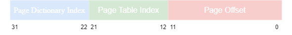

由此我们知道，一个 page directory entry 对应 1 个 page table，一个 page table 又有 1024 个 Page，一个 Page 的大小是 $2^{12}$ 字节。 所以一个 page directory entry 对应的虚拟地址空间的大小就是 PDMAP。

```c
#define PDMAP		(4 * 1024 * 1024)	// bytes mapped by a page directory entry
```

然后我们定义了两个偏移量，这两个偏移量可以方便利用位运算求解各种东西。意义见注释

```c
#define PGSHIFT		12       // log2(BY2PG)
#define PDSHIFT		22		 // log2(PDMAP)
```

#### Index

分别是 Page Dictionary Index 和 Page Table Index。

```c
#define PDX(va)		((((u_long)(va))>>22) & 0x03FF)
#define PTX(va)		((((u_long)(va))>>12) & 0x03FF)
```

可以用下面的图来表示


#### PTE

**PTE_ADDR**

用于将 pte 前面的物理地址取出来，示意图如下

```c
#define PTE_ADDR(pte) ((u_long)(pte) & ~0xFFF)
```


**Page Dictionary/Table Flags**

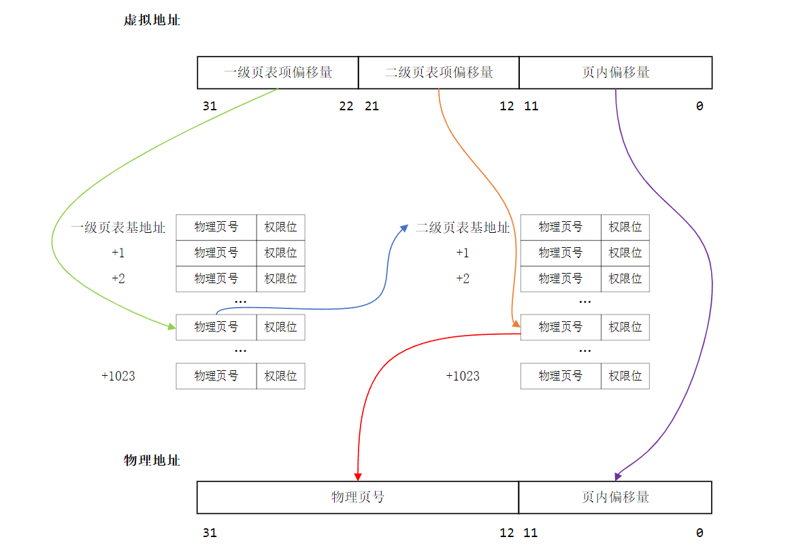

所谓的 flag 就是**权限位**，一共有 12 位，可以通过给不同的位置 1 来表示**物理页**的权限，具体解释如下

```c
#define PTE_G			0x0100	// 0001_0000_0000	Global bit
#define PTE_V			0x0200	// 0010_0000_0000	Valid bit
#define PTE_R			0x0400	// 0100_0000_0000	"Dirty", but really a write-enable bit. 1 to allow writes, 0 and any store using this translation will be trapped.
#define PTE_D			0x0002	// 0000_0000_0010	fileSystem Cached is dirty
#define PTE_COW			0x0001	// 0000_0000_0001	Copy On Write
#define PTE_UC			0x0800	// 1000_0000_0000	unCached
#define PTE_LIBRARY		0x0004	// 0000_0000_0100	share memmory
```

现在我知道的

有效位，即存在位，当其被置 1 的时候，说明这个物理页框已经与虚拟页之间建立映射

```c
#define PTE_V			0x0200	// 0010_0000_0000	Valid bit
```

可写位，只有这个位置 1，我们才可以往这个物理页面内写数据。

```c
#define PTE_R			0x0400	// 0100_0000_0000	"Dirty", but really a write-enable bit. 1 to allow writes, 0 and any store using this translation will be trapped.
```

**pte typedef**

```
typedef u_long Pde;
typedef u_long Pte;
```

定义了页表项的本质就是 32 位整型数。

#### Virtual Space Constant

这些宏主要是描述虚拟地址空间的各个坐标，或者是各个距离用的，最好结合内存图来理解

```c
/*
 o     4G ----------->  +----------------------------+------------0x100000000
 o                      |       ...                  |  kseg3
 o                      +----------------------------+------------0xe000 0000
 o                      |       ...                  |  kseg2
 o                      +----------------------------+------------0xc000 0000
 o                      |   Interrupts & Exception   |  kseg1
 o                      +----------------------------+------------0xa000 0000
 o                      |      Invalid memory        |   /|\
 o                      +----------------------------+----|-------Physics Memory Max
 o                      |       ...                  |  kseg0
 o  VPT,KSTACKTOP-----> +----------------------------+----|-------0x8040 0000-------end
 o                      |       Kernel Stack         |    | KSTKSIZE            /|\
 o                      +----------------------------+----|------                |
 o                      |       Kernel Text          |    |                    PDMAP
 o      KERNBASE -----> +----------------------------+----|-------0x8001 0000    | 
 o                      |   Interrupts & Exception   |   \|/                    \|/
 o      ULIM     -----> +----------------------------+------------0x8000 0000-------    
 o                      |         User VPT           |     PDMAP                /|\ 
 o      UVPT     -----> +----------------------------+------------0x7fc0 0000    |
 o                      |         PAGES              |     PDMAP                 |
 o      UPAGES   -----> +----------------------------+------------0x7f80 0000    |
 o                      |         ENVS               |     PDMAP                 |
 o  UTOP,UENVS   -----> +----------------------------+------------0x7f40 0000    |
 o  UXSTACKTOP -/       |     user exception stack   |     BY2PG                 |
 o                      +----------------------------+------------0x7f3f f000    |
 o                      |       Invalid memory       |     BY2PG                 |
 o      USTACKTOP ----> +----------------------------+------------0x7f3f e000    |
 o                      |     normal user stack      |     BY2PG                 |
 o                      +----------------------------+------------0x7f3f d000    |
 a                      |                            |                           |
 a                      ~~~~~~~~~~~~~~~~~~~~~~~~~~~~~~                           |
 a                      .                            .                           |
 a                      .                            .                         kuseg
 a                      .                            .                           |
 a                      |~~~~~~~~~~~~~~~~~~~~~~~~~~~~|                           |
 a                      |                            |                           |
 o       UTEXT   -----> +----------------------------+                           |
 o                      |                            |     2 * PDMAP            \|/
 a     0 ------------>  +----------------------------+ -----------------------------
 o
*/
```

这个是内核的起始地址，注意不是 `0x8000_0000`

```c
#define KERNBASE 0x80010000
```

这个是用户地址空间的上界，即 user limit。

```c
#define ULIM 0x80000000
```

#### Address translate

下面两个宏可以完成从 kernel 虚拟地址到物理地址的转换和由物理地址到 kernel 虚拟地址的转换，其实转换的方法很简单，就是监区或者加上 `0x80000000` 说白了就是最高位置 0。

```c
// translates from kernel virtual address to physical address.
#define PADDR(kva)						                    \
	({								                        \
		u_long a = (u_long) (kva);				            \
		if (a < ULIM)					                    \
			panic("PADDR called with invalid kva %08lx", a);\
		a - ULIM;						                    \
	})

// translates from physical address to kernel virtual address.
#define KADDR(pa)                                                    \
    ({                                                               \
        u_long ppn = PPN(pa);                                        \
        if (ppn >= npage)                                            \
            panic("KADDR called with invalid pa %08lx", (u_long)pa); \
        ((u_long)(pa)) + ULIM;                                       \
    })

```

### queue.h

我们用内存管理中的链表举例：

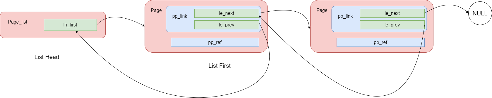

#### List Declare

**LIST HEAD**

这个宏很有意思，因为它不是会当一个**函数**来使，就是完成某个功能，然后给出一个返回值。它的作用是定义一个结构体，这个结构体是链表的表头。

```c
// this macro define a struct
#define LIST_HEAD(name, type)                                           	    \
        struct name                                                             \
        {                                                                       \
            struct type *lh_first;  /* first element */                     	\
        }
```

**LIST_ENTRY**

与 `LIST_HEAD` 类似，这个宏也定义了一个结构体，这个结构体里面包含两个指针，就是实现双向链表的那两个指针。

```c
#define LIST_ENTRY(type)                                                	    \
        struct                                                                  \
        {                                                                       \
            struct type *le_next;   /* next element */                      	\
            struct type **le_prev;  /* address of previous next element */  	\
        }
```

#### List Find

**LIST_FIRST**

这里要区分两个概念，一个是链表的头（head），一个是链表的首节点，在前面的图中就可以很好的搞懂

```c
/*
 * Return the first element in the list named "head".
 */
#define LIST_FIRST(head) 		((head)->lh_first)
```


**LIST_NEXT**

这个其实跟单向链表那个挺像的，但是就是非得多了一个 `field` ，这是因为这种结构体把所有的链接指针都分装到了一起，所以不是结构体里面有指针，而是结构体里面有指针结构体，指针结构体里面有指针，所以我们需要用 `field` 来指定访问哪个指针结构体，比如

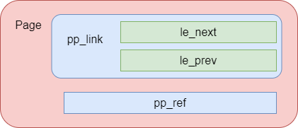

我们就需要指定 `field = pp_link` 

```c
#define LIST_NEXT(elm, field) 	((elm)->field.le_next)
```

#### List Operate

这些操作只要有了上面那张链表的示意图，就是很好理解的。

在后面的操作中经常出现 `do{...}while(0)` 结构，那么为什么要使用这种结构呢，是因为宏在展开的时候经常出错，所以我们要用这种结构，具体的原因见这个网址 https://zhuanlan.zhihu.com/p/357839758?utm_source=wechat_session&utm_medium=social&utm_oi=1198576333020692481&utm_campaign=shareo

**LIST_INIT**

初始化链表的方法就是把链表的首节点赋值为 NULL。

```c
/*
 * Reset the list named "head" to the empty list.
 */
#define LIST_INIT(head) 											\
		do 															\
		{                                            				\
            LIST_FIRST((head)) = NULL;                              \
        } while (0)
```

**LIST_INSERT_HEAD**

```c
/*
 * Insert the element "elm" at the head of the list named "head".
 * The "field" name is the link element as above.
 */
#define LIST_INSERT_HEAD(head, elm, field)                                \
	do                                                                    \
	{                                                                     \
		if ((LIST_NEXT((elm), field) = LIST_FIRST((head))) != NULL)       \
			LIST_FIRST((head))->field.le_prev = &LIST_NEXT((elm), field); \
		LIST_FIRST((head)) = (elm);                                       \
		(elm)->field.le_prev = &LIST_FIRST((head));                       \
	} while (0)
```

**LIST_INSERT_TAIL**

```c
/*
 * Insert the element "elm" at the tail of the list named "head".
 * The "field" name is the link element as above. You can refer to LIST_INSERT_HEAD.
 * Note: this function has big differences with LIST_INSERT_HEAD !
 */
#define LIST_INSERT_TAIL(head, elm, field)                                           \
	do                                                                               \
	{                                                                                \
		if (LIST_FIRST((head)) == NULL)                                              \
		{                                                                            \
			LIST_INSERT_HEAD((head), (elm), field);                                  \
		}                                                                            \
		else                                                                         \
		{                                                                            \
			LIST_NEXT((elm), field) = LIST_FIRST((head));                            \
			while (LIST_NEXT(LIST_NEXT((elm), field), field) != NULL)                \
			{                                                                        \
				LIST_NEXT((elm), field) = LIST_NEXT(LIST_NEXT((elm), field), field); \
			}                                                                        \
			LIST_NEXT(LIST_NEXT((elm), field), field) = (elm);                       \
			(elm)->field.le_prev = &LIST_NEXT(LIST_NEXT((elm), field), field);       \
			LIST_NEXT((elm), field) = NULL;                                          \
		}                                                                            \
	} while (0)
```

**LIST_INSERT_AFTER**

```c
/*
 * Insert the element "elm" *after* the element "listelm" which is
 * already in the list.  The "field" name is the link element
 * as above.
 */
// Note: assign a to b <==> a = b
// Step 1, assign elm.next to listelm.next.
// Step 2: Judge whether listelm.next is NULL, if not, then assign listelm.next.pre to a proper value.
// step 3: Assign listelm.next to a proper value.
// step 4: Assign elm.pre to a proper value.
#define LIST_INSERT_AFTER(listelm, elm, field)												\
        do                                                                                  \
        {                                                                                   \
            LIST_NEXT((elm), field) = LIST_NEXT((listelm), field);                         	\
            if (LIST_NEXT((listelm), field) != NULL)                                       	\
            {                                                                              	\
                LIST_NEXT((listelm), field)->field.le_prev = &LIST_NEXT((elm), field); 		\
            }                                                                              	\
            LIST_NEXT((listelm), field) = (elm);                                           	\
            (elm)->field.le_prev = &LIST_NEXT((listelm), field);                           	\
        } while (0)

```

**LIST_INSERT_BEFORE**

```c
/*
 * Insert the element "elm" *before* the element "listelm" which is
 * already in the list.  The "field" name is the link element
 * as above.
 */
#define LIST_INSERT_BEFORE(listelm, elm, field) 							\
		do 																	\
		{		                											\
            (elm)->field.le_prev = (listelm)->field.le_prev;                \
            LIST_NEXT((elm), field) = (listelm);                            \
            *(listelm)->field.le_prev = (elm);                              \
            (listelm)->field.le_prev = &LIST_NEXT((elm), field);            \
        } while (0)
```

**LIST_REMOVE**

```c
#define LIST_REMOVE(elm, field)                                  				\
        do                                                       				\
        {                                                        				\
            if (LIST_NEXT((elm), field) != NULL)             					\
                LIST_NEXT((elm), field)->field.le_prev = (elm)->field.le_prev;  \
            *(elm)->field.le_prev = LIST_NEXT((elm), field); 					\
        } while (0)
```

### pmap.h

#### Page

我们首先来看 `Page` 结构体的定义：

```c
typedef LIST_ENTRY(Page) Page_LIST_entry_t;

struct Page 
{
	Page_LIST_entry_t pp_link;	/* free list link */

	// Ref is the count of pointers (usually in page table entries)
	// to this page.  This only holds for pages allocated using
	// page_alloc.  Pages allocated at boot time using pmap.c's "alloc"
	// do not have valid reference count fields.

	u_short pp_ref;
};
```

涉及到的宏

```c
#define LIST_ENTRY(type)                                                	    \
        struct                                                                  \
        {                                                                       \
            struct type *le_next;   /* next element */                      	\
            struct type **le_prev;  /* address of previous next element */  	\
        }
```

`Page` 这个结构体可以看做是链表的一个节点，其结构如下


那么 `Page` 到底是什么，我们说这个东西不是一个页面（显然这个东西没有 4KB 大小），他只是一个记录页面信息的东西，如果说得更确切些，它是一个**记录物理页框信息**的数据结构。他的官方属于叫做**内存控制块**，我们把空闲的内存控制块放进链表中，当我们需要分配物理内存的时候，就取出链表里的一些内存控制块，表示我们占用这些物理内存。

然后它又定义了一个链表，

```c
LIST_HEAD(Page_list, Page);
```

涉及的宏如下

```c
// this macro define a struct
#define LIST_HEAD(name, type)                                           	    \
        struct name                                                             \
        {                                                                       \
            struct type *lh_first;  /* first element */                     	\
        }
```

可以看出这个链表的表头不是原来的 Page 结构体，而是一个新的结构体，结构如下


#### Map

这里会有一些各种数据结构的转化，这里用一张图总结一下各个数据结构之间的转化关系

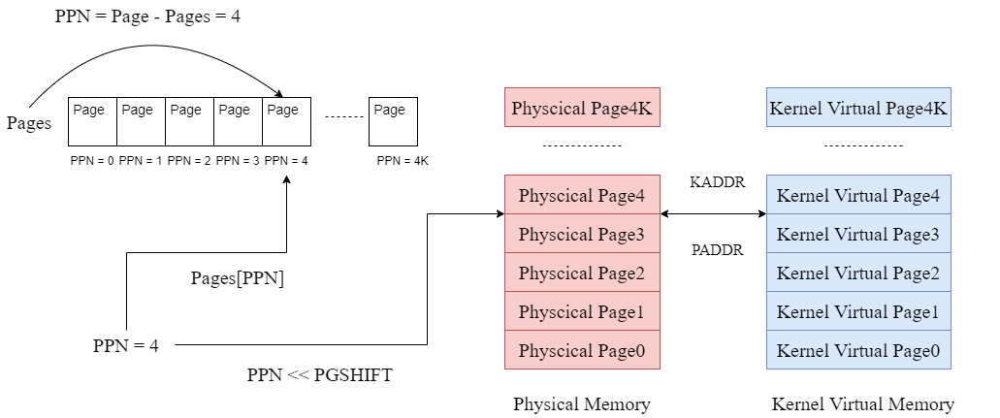

```c
extern struct Page *pages;

static inline u_long
page2ppn(struct Page *pp)
{
	return pp - pages;
}

/* 
 * Get the physical address of Page 'pp'.
 */
static inline u_long
page2pa(struct Page *pp)
{
	return page2ppn(pp) << PGSHIFT;
}

/* 
Get the Page struct whose physical address is 'pa'.
 */
static inline struct Page *
pa2page(u_long pa)
{
	if (PPN(pa) >= npage) 
    {
		panic("pa2page called with invalid pa: %x", pa);
	}
    // PPN(pa) we can get the phsical page number
    // 'pages' is the array of physical pages
	return &pages[PPN(pa)];
}

/* Get the kernel virtual address of Page 'pp'.
 */
static inline u_long
page2kva(struct Page *pp)
{
	return KADDR(page2pa(pp));
}

/* Transform the virtual address 'va' to physical address.
 */
static inline u_long
va2pa(Pde *pgdir, u_long va)
{
	Pte *p;

	pgdir = &pgdir[PDX(va)];

	if (!(*pgdir & PTE_V)) {
		return ~0;
	}

	p = (Pte *)KADDR(PTE_ADDR(*pgdir));

	if (!(p[PTX(va)]&PTE_V)) {
		return ~0;
	}

	return PTE_ADDR(p[PTX(va)]);
}
```

### printf.h

#### panic

其实就是一个宏包装了一个函数，使其更加适合标准输出，比如可以直接打印 bug 的文件名，出错的行数

```c
#define panic(...) _panic(__FILE__, __LINE__, __VA_ARGS__)
```

### asm.h

#### stack frame

首先补充一下栈和栈帧的知识：

我们都知道，汇编一旦发生函数调用的时候，一般就会借助内存中的栈结构，我们在学计组的时候，学习到了栈的操作是通过 `$sp` 寄存器实现的。当栈指针减小的时候，就相当于分配出一块栈空间。反之，则是栈消减了。我们每调用一个函数（其实不严谨，应该是每一个调用别的函数的函数，即非叶子函数），都需要在栈上开辟出一个栈空间来辅助函数的使用（在调用子函数的时候寄存器需要保存）。其实到这里跟我们计组知识是吻合的。

但是这样不利于回溯，栈在我们眼里是同质性的，根本分不清子函数和母函数的界限在哪里。所以我们又规定了一个寄存器 `$fp`，这个寄存器会指向栈帧的第一个字，这样我们就可以回溯了，具体的示意图如下：

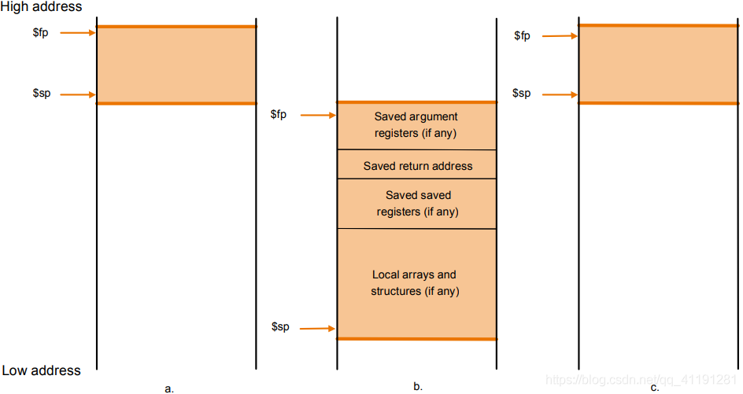

#### function declare

我们都知道，汇编的函数是用**标签**声明的，函数的结尾会有一个 `jr $ra` 。就像这样

```assembly
sum:
#入栈过程
sw $t0, 0($sp)
addi $sp, $sp, -4
#传参过程
move $t0, $a0
move $t1, $a1
#函数过程
add $v0 $t0, $t1
#出栈过程
addi $sp, $sp, 4
lw $t0, 0($sp)
#return
jr $ra
```

但是这个依然是很朴素的，因为这个对于编译器很混乱，因为标签不止可以干表示函数的事情，编译器识别不出来这个函数。所以这要求我们写汇编函数的时候**对于函数声明这件事情更加复杂一点**。

这个函数声明的格式，是在这个文件中定义的，他希望我们写一个函数的时候，呈现这种格式（以上面那个函数为例）

```assembly
LEAF(sum)
    #入栈过程
    sw $t0, 0($sp)
    addi $sp, $sp, -4
    #传参过程
    move $t0, $a0
    move $t1, $a1
    #函数过程
    add $v0 $t0, $t1
    #出栈过程
    addi $sp, $sp, 4
    lw $t0, 0($sp)
    #return
    jr $ra
END(sum)  
```

我们先看 `LEAF`

```assembly
/*
 * LEAF - declare leaf routine
 */
#define LEAF(symbol)                                    \
                .globl  symbol;                         \
                .align  2;                              \
                .type   symbol,@function;               \
                .ent    symbol,0;                       \
symbol:         .frame  sp,0,ra
```

这句话的意思就是定义了一个全局（是对链接器而言的）的符号 `symbol`

```assembly
.globl  symbol;
```

这句话的意思是按照 2 字节的方式填充边界，`.align` 相当于一个对齐操作符，底下这句话的意思就是按照 $2^2$ 个字节进行对齐，注意只对其后面那一个变量

```assembly
.align  2; 
```

这句话定义了一个函数，`.type` 的格式：`.type <name> @<type>`

```assembly
.type   symbol,@function; 
```

这条语句说明了函数的开始，但是后面的参数 0 我不知道啥意思

```assembly
.ent    symbol,0; 
```

下面这条语句才是我们最熟悉的**函数标签**

```assembly
symbol:         .frame  sp,0,ra
```

但是后面还是跟了个 `.frame` ，他的三个参数分别为栈指针，栈帧大小（因为叶子函数没有回溯的必要，所以不需要分配栈帧？），返回寄存器，存储返回地址。

然后再看 `NESTED`

```assembly
/*
 * NESTED - declare nested routine entry point
 */
#define NESTED(symbol, framesize, rpc)                  \
                .globl  symbol;                         \
                .align  2;                              \
                .type   symbol,@function;               \
                .ent    symbol,0;                       \
symbol:         .frame  sp, framesize, rpc
```

会发现与 `LEAF` 基本上一样，唯一的区别是最后一句

```assembly
symbol:         .frame  sp, framesize, rpc
```

显然母函数是需要栈帧的。但是返回寄存器变得可调了，我也不知道为啥，可能用的多了？

最后看 `end`

```assembly
#define END(function)                                   \
                .end    function;                       \
                .size   function,.-function
```

这句是函数的结尾

```
.end    function;
```

这句不会，摆了

```assembly
.size   function,.-function
```

#### export

`asm.h` 还涉及一个引入问题 `EXPORT`。

这是引入一个变量

```assembly
#define	EXPORT(symbol)                                  \
							.globl	symbol; 				\
				symbol:
```

这是引入一个函数

```c
#define FEXPORT(symbol)					\
						.globl	symbol; 			\
						.type	symbol,@function;		\
				symbol:
```

### cp0regdef.h

#### CP0reg Declare

```c
#define CP0_INDEX $0
#define CP0_RANDOM $1
#define CP0_ENTRYLO0 $2
#define CP0_ENTRYLO1 $3
#define CP0_CONTEXT $4
#define CP0_PAGEMASK $5
#define CP0_WIRED $6
#define CP0_BADVADDR $8
#define CP0_COUNT $9
#define CP0_ENTRYHI $10
#define CP0_COMPARE $11
#define CP0_STATUS $12
#define CP0_CAUSE $13
#define CP0_EPC $14
#define CP0_PRID $15
#define CP0_CONFIG $16
#define CP0_LLADDR $17
#define CP0_WATCHLO $18
#define CP0_WATCHHI $19
#define CP0_XCONTEXT $20
#define CP0_FRAMEMASK $21
#define CP0_DIAGNOSTIC $22
#define CP0_PERFORMANCE $25
#define CP0_ECC $26
#define CP0_CACHEERR $27
#define CP0_TAGLO $28
#define CP0_TAGHI $29
#define CP0_ERROREPC $30
```

#### SR flags

还定义一些 SR 寄存器的标志位信息

```c
#define STATUSF_IP4 0x1000
#define STATUS_CU0 0x10000000
#define	STATUS_KUC 0x2
```

###  regdef.h

#### regdef

声明了通用寄存器的别名

```c
#ifndef __ASM_MIPS_REGDEF_H
#define __ASM_MIPS_REGDEF_H

/*
 * Symbolic register names for 32 bit ABI
 */
#define zero    $0      /* wired zero */
#define AT      $1      /* assembler temp  - uppercase because of ".set at" */
#define v0      $2      /* return value */
#define v1      $3
#define a0      $4      /* argument registers */
#define a1      $5
#define a2      $6
#define a3      $7
#define t0      $8      /* caller saved */
#define t1      $9
#define t2      $10
#define t3      $11
#define t4      $12
#define t5      $13
#define t6      $14
#define t7      $15
#define s0      $16     /* callee saved */
#define s1      $17
#define s2      $18
#define s3      $19
#define s4      $20
#define s5      $21
#define s6      $22
#define s7      $23
#define t8      $24     /* caller saved */
#define t9      $25
#define jp      $25     /* PIC jump register */
#define k0      $26     /* kernel scratch */
#define k1      $27
#define gp      $28     /* global pointer */
#define sp      $29     /* stack pointer */
#define fp      $30     /* frame pointer */
#define s8		$30		/* same like fp! */
#define ra      $31     /* return address */
```

### stackframe.h

#### Set Interupt

中断可以通过设置 CP0 协处理器中的 SR 寄存器设置，最低一位被称为 IE，当其被置 1 时，启用中断功能，而当其被置 0 的时候，禁用中断，我们可以看下面两个宏

```assembly
.macro STI
	mfc0	t0,	CP0_STATUS
	li		t1, (STATUS_CU0 | 0x1)
	or		t0, t1
	mtc0	t0, CP0_STATUS
.endm


.macro CLI
	mfc0	t0, CP0_STATUS
	li		t1, (STATUS_CU0 | 0x1)
	or		t0, t1
	xor		t0, 0x1
	mtc0	t0, CP0_STATUS
.endm
```

`STI` 把 IE 置为 1，所以是开启中断（set interrupt），而 `CLI` 把 IE 置为0，所以是清除中断（clear interrupt）。

#### Save and Restore

当进入中断的时候，或者是进入函数之前，有的时候是有必要保留寄存器中的数据到栈中，当函数调用结束或者异常处理过后，需要恢复寄存器中的数据，因此才有了这些宏

`SAVE_ALL` 就是保存所有寄存器的值

```assembly
.macro SAVE_ALL                                   
		mfc0	k0, CP0_STATUS                   
		sll		k0, 3      /* extract cu0 bit */  
		bltz	k0, 1f                            
		nop       
		/*                                       
		 * Called from user mode, new stack      
		 */                                      
1:				
		move	k0, sp 
		get_sp      
		move	k1, sp                     
		subu	sp, k1,TF_SIZE                    
		sw		k0, TF_REG29(sp)                  
		sw		$2, TF_REG2(sp)                   
		mfc0	v0, CP0_STATUS                    
		sw		v0, TF_STATUS(sp)                 
		mfc0	v0, CP0_CAUSE                     
		sw		v0, TF_CAUSE(sp)                  
		mfc0	v0, CP0_EPC                       
		sw		v0, TF_EPC(sp)
		mfc0	v0, CP0_BADVADDR        
		sw		v0, TF_BADVADDR(sp)            
		mfhi	v0                               
		sw		v0,TF_HI(sp)                     
		mflo	v0                               
		sw	v0,TF_LO(sp)                     
		sw	$0,TF_REG0(sp)
		sw	$1,TF_REG1(sp)                    
		//sw	$2,TF_REG2(sp)                   
		sw	$3,TF_REG3(sp)                   
		sw	$4,TF_REG4(sp)                   
		sw	$5,TF_REG5(sp)                   
		sw	$6,TF_REG6(sp)                   
		sw	$7,TF_REG7(sp)                   
		sw	$8,TF_REG8(sp)                   
		sw	$9,TF_REG9(sp)                   
		sw	$10,TF_REG10(sp)                 
		sw	$11,TF_REG11(sp)                 
		sw	$12,TF_REG12(sp)                 
		sw	$13,TF_REG13(sp)                 
		sw	$14,TF_REG14(sp)                 
		sw	$15,TF_REG15(sp)                 
		sw	$16,TF_REG16(sp)                 
		sw	$17,TF_REG17(sp)                 
		sw	$18,TF_REG18(sp)                 
		sw	$19,TF_REG19(sp)                 
		sw	$20,TF_REG20(sp)                 
		sw	$21,TF_REG21(sp)                 
		sw	$22,TF_REG22(sp)                 
		sw	$23,TF_REG23(sp)                 
		sw	$24,TF_REG24(sp)                 
		sw	$25,TF_REG25(sp)                 
		sw	$26,TF_REG26(sp) 				 
		sw	$27,TF_REG27(sp) 				 
		sw	$28,TF_REG28(sp)                 
		sw	$30,TF_REG30(sp)                 
		sw	$31,TF_REG31(sp)
.endm
```

里面还嵌套了一个宏，但是我困了，不想分析了，有意思的是，这个宏没有大写

```assembly
.macro get_sp
	mfc0	k1, CP0_CAUSE
	andi	k1, 0x107C
	xori	k1, 0x1000
	bnez	k1, 1f
	nop
	li		sp, 0x82000000
	j		2f
	nop
1:
	bltz	sp, 2f
	nop
	lw		sp, KERNEL_SP
	nop

2:	nop
.endm
```

`RESTORE_SOME` 应该是恢复了某些寄存器的值，没有恢复栈指针寄存器，我不知道为啥。 

```assembly
/*
 * Note that we restore the IE flags from stack. This means
 * that a modified IE mask will be nullified.
 */
.macro RESTORE_SOME                                      
		.set	mips1                            
		mfc0	t0, CP0_STATUS                    
		ori		t0, 0x3                          
		xori	t0, 0x3                          
		mtc0	t0, CP0_STATUS                    
		lw		v0, TF_STATUS(sp)             
		li		v1, 0xff00 				 
		and		t0, v1 					 
		nor		v1, $0, v1 				 
		and		v0, v1 					 
		or		v0, t0 					 
		mtc0	v0, CP0_STATUS 		 
		lw		v1, TF_LO(sp)                                       
		mtlo	v1                               
		lw		v0, TF_HI(sp)                     
		lw		v1, TF_EPC(sp)                    
		mthi	v0                               
		mtc0	v1, CP0_EPC                       
		lw	$31,TF_REG31(sp)                 
		lw	$30,TF_REG30(sp)                 
		lw	$28,TF_REG28(sp)                 
		lw	$25,TF_REG25(sp)                 
		lw	$24,TF_REG24(sp)                 
		lw	$23,TF_REG23(sp)                 
		lw	$22,TF_REG22(sp)                 
		lw	$21,TF_REG21(sp)                 
		lw	$20,TF_REG20(sp)                 
		lw	$19,TF_REG19(sp)                 
		lw	$18,TF_REG18(sp)                 
		lw	$17,TF_REG17(sp)                 
		lw	$16,TF_REG16(sp)                 
		lw	$15,TF_REG15(sp)                 
		lw	$14,TF_REG14(sp)                 
		lw	$13,TF_REG13(sp)                 
		lw	$12,TF_REG12(sp)                 
		lw	$11,TF_REG11(sp)                 
		lw	$10,TF_REG10(sp)                 
		lw	$9,TF_REG9(sp)                   
		lw	$8,TF_REG8(sp)                   
		lw	$7,TF_REG7(sp)                   
		lw	$6,TF_REG6(sp)                   
		lw	$5,TF_REG5(sp)                   
		lw	$4,TF_REG4(sp)                   
		lw	$3,TF_REG3(sp)                   
		lw	$2,TF_REG2(sp)                   
		lw	$1,TF_REG1(sp)                   
.endm
```

还有两个 `RESTORE` 

```assembly
.macro RESTORE_ALL							 
		RESTORE_SOME								 
		lw	sp,TF_REG29(sp)  /* Deallocate stack */  
.endm

.set	noreorder
.macro RESTORE_ALL_AND_RET					 
		RESTORE_SOME							 
		lw	k0, TF_EPC(sp) 				 
		lw	sp, TF_REG29(sp)  /* Deallocate stack */  
		jr	k0 								 
		rfe 								 
.endm
```


---


## mm/

### pmap.c

#### mips_detect_memory()

```c
/* These variables are set by mips_detect_memory() */
u_long maxpa;            /* Maximum physical address */
u_long npage;            /* Amount of memory(in pages) */
u_long basemem;          /* Amount of base memory(in bytes) */
u_long extmem;           /* Amount of extended memory(in bytes) */

/* Overview:
   Initialize basemem and npage.
   Set basemem to be 64MB, and calculate corresponding npage value.
*/
void mips_detect_memory()
{
	// Initialize basemem.
    // the max limit of user physical memory
    maxpa = 0x4000000;
    // the count of bytes in physical memory, is the size of physcial memory.
    basemem = 0x4000000;
    // extern memory size
    extmem = 0x0;
    // Calculate corresponding npage value.
    npage = basemem >> PGSHIFT;
    // print the memory information.
    printf("Physical memory: %dK available, ", (int)(maxpa / 1024));
	printf("base = %dK, extended = %dK\n", (int)(basemem / 1024),
			(int)(extmem / 1024));
}
```

`maxpa` 就是物理地址的上界，可以看到，我们的物理地址的最大值是 `0x3FFFFFF` 。`basemem` 是物理内存的大小，所以是 64 MB。`extmem` 是该是扩展内存，盲猜是加装内存条之类的操作，所以我们是 0。

`npage` 就是物理页框的数目，其实就是物理内存大小除以页框大小，但是此时计算用到的是位运算，借助了在 `mmu.h` 中的常量 `PGSHIFT`。我们有
$$
npage = 2^{14} = 4 K
$$
最后是一个打印信息，打印的信息是内存大小，因为单位是 KB，所以除了 1024。

#### alloc()

```c
static u_long freemem;
/* 
Overview:
   Allocate `n` bytes physical memory with alignment `align`, if `clear` is set, clear the
   allocated memory.
   This allocator is used only while setting up virtual memory system.

Post-Condition:
   If we're out of memory, should panic, else return this address of memory we have allocated.
*/
static void *alloc(u_int n, u_int align, int clear)
{
	extern char end[];
	u_long alloced_mem;

	/* Initialize `freemem` if this is the first time. The first virtual address that the
	 * linker did *not* assign to any kernel code or global variables. */
	if (freemem == 0) 
    {
		freemem = (u_long)end;
	}

	// Step 1: Round up `freemem` up to be aligned properly 
	freemem = ROUND(freemem, align);

	// Step 2: Save current value of `freemem` as allocated chunk. 
	alloced_mem = freemem;

	// Step 3: Increase `freemem` to record allocation. 
	freemem = freemem + n;

	// Check if we're out of memory. If we are, PANIC !! 
	if (PADDR(freemem) >= maxpa) 
    {
		panic("out of memory\n");
		return (void *)-E_NO_MEM;
	}

	// Step 4: Clear allocated chunk if parameter `clear` is set. 
	if (clear) 
    {
		bzero((void *)alloced_mem, n);
	}

	// Step 5: return allocated chunk. 
	return (void *)alloced_mem;
}
```

`freemem` 是一个地址，这个地址之下都是已经被分配过的虚拟地址，而上面则是没有被分配过的虚拟地址空间，在这个函数里，我们通过对 `freemem` 进行累加操作，来表示分配一些地址区域。

看一下第一步的判断

```c
	extern char end[];
	/* Initialize `freemem` if this is the first time. The first virtual address that the
	 * linker did *not* assign to any kernel code or global variables. */
	if (freemem == 0) 
    {
		freemem = (u_long)end;
	}
```

这个要结合 `tools/scse0_3.lds` 理解，`scse0_3.lds` 的最后一句话声明了一个地址指针 `end` 它的值就是 `0x8040_0000`，他代表初始化结束后内核栈的栈顶，我们让 `freemem` 等于这个值，就说明我们分配的起点就是 `0x8040_0000`，其实分配虚拟内存空间，就是堆（可能是叫这个名字吧）增长的一个过程。

然后我们来看一下分配是如何操作的：


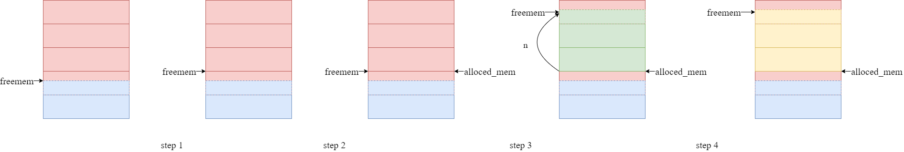

还是很好理解的。

这个函数只在内存控制块相关数据结构没有建立好之前使用（也就是 pages_init() 之前），当空闲链表的结构建立好了，那么就用 page_alloc() 分配页面。

#### mips_vm_init()

这个函数还是比较复杂的，我们先来看一下与两级页表相关的部分

```c
// pages is an array. The elememts of it are the physical page frames.
struct Page *pages;
	// Step 1: Allocate a page for page directory(first level page table). 
	pgdir = alloc(BY2PG, BY2PG, 1);
	printf("to memory %x for struct page directory.\n", freemem);
	pages = (struct Page *)alloc(npage * sizeof(struct Page), BY2PG, 1);
	printf("to memory %x for struct Pages.\n", freemem);
```

分配空间用的是 `alloc` 函数，而这个函数就是一个在虚拟地址空间上工作的函数，而不是在物理地址空间上工作的函数。这两个语句首先分配出一个虚拟页面来存放第一级页表，然后分配了 `npage` 个（也就是物理页框的数目）个内存控制块大小的空间来放置 `Pages` 数组。这些语句完成后的虚拟地址空间如图

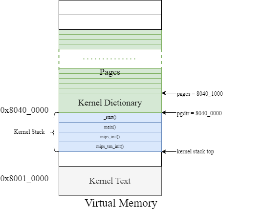

这有这样，我们才能在最后的输出上看到如下语句

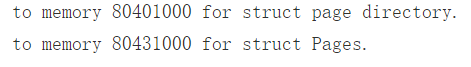

这里涉及一个需要仔细思考的问题，就是对于一个进程来说，他的数据可以存储在哪里？数据其实可以存在三个地方：

- 数据段里，这个相当于是静态的，在进程还没有运行的时候就已经存在了，相当于上图的 `Kernel Text` 中的一部分。在 lab2-extra 中，它让做伙伴系统，但是我当时以为数据只能存储在堆或者栈里，所以一直不敢动笔，实在是哭笑不得。在这个段里存储的数据最大的缺点就是在写程序的时候这部分数据就已经被固定了。这里说的 ”固定“ 不是说就是不能修改的，而是对于数据的规模不能修改，其实就是类似于 C 语言的数组，即使可以修改内容，但是不能修改数组的大小。 
- 栈上，这个是函数里的局部变量所在的位置，这个段是易失的，只要一个函数运行完了，所以在上面的局部变量都会被销毁，所以基本上是没法用作管理的（因为管理是对进程的管理，一堆随着函数消失就消失的数据，显然是没用的）
- 堆上，这些数据虽然也是在函数内部创建的，但是却不会随着函数的结束而结束，他们的生命周期跟进程一样长（如果不手动释放的话），但是似乎在这里我们使用的时候是有一定限制的，`alloc()` 是唯一可以使用的函数，但是 `page_alloc` 并不是。 堆上的数据是可以随着进程的执行情况而灵活调整的。我们将 `pages` 数组放到堆上就很有道理了，因为物理内存的大小是通过 `mips_detect_memory` 实现的（不太严谨），所以我们没办法确定 `pages` 数组的大小，放在数据段里太过死板了。

#### page_init()

说白了，page_init() 初始化的 page 就是刚才我们 mips_vm_init() 时用到的物理页。当然还完成了空闲链表的初始化

这个函数又涉及到了一个知识，就是我们是怎么把在虚拟地址空间中的操作系统内核映射（Kseg0）到物理内存中，我们都知道是直接把最高位抹掉。为啥呢，因为也没办法用MMU进行映射啊，操作系统还没建立起来的时候，MMU是没法使用的。那么我们需要分配多少的空间呢？或者说物理页框呢？其实就是我们用了多少的虚拟地址空间，也就是下面的语句：

```c
    /* Step 2: Align `freemem` up to multiple of BY2PG. */
    freemem = ROUND(freemem, BY2PG);

    /* Step 3: Mark all memory blow `freemem` as used(set `pp_ref`
	 * filed to 1) */
    int size = PADDR(freemem) / BY2PG;
    int i;
    for (i = 0; i < size; ++i)
    {
        pages[i].pp_ref = 1;
    }
```

`size` 表示我们用过的物理页框的数目，但是我们不能直接使用 `freemem` 去除 `BY2PG` ，因为 `freemem` 不是从 0 开始增长的。这个时候我们可以利用这个宏来先将其转换成物理地址，然后在去做比，就可以得出我们想要的结果了：

```c
// translates from kernel virtual address to physical address.
#define PADDR(kva)						                    \
	({								                        \
		u_long a = (u_long) (kva);				            \
		if (a < ULIM)					                    \
			panic("PADDR called with invalid kva %08lx", a);\
		a - ULIM;						                    \
	})
```

对于剩下的内存控制块，我们将他们插入到链表中，当然首先需要初始化链表

```c
	/* Step 1: Initialize page_free_list. */
	/* Hint: Use macro `LIST_INIT` defined in include/queue.h. */
    LIST_INIT(&page_free_list);

	/* Step 4: Mark the other memory as free. */
    for (i = size; i < npage; ++i)
    {
        pages[i].pp_ref = 0;
        LIST_INSERT_HEAD(&page_free_list, pages + i, pp_link);
    }
    LIST_REMOVE(pa2page(PADDR(TIMESTACK - BY2PG)), pp_link);
```

#### page_alloc()

这个函数实现的分配出一个空闲的物理页面，实现的方法就是从空闲内存控制块中挑取头结点并移除，并且把这个物理页框对应的虚拟地址空间清空。

```c
/*Overview:
	Allocates a physical page from free memory, and clear this page.

  Post-Condition:
	If failed to allocate a new page(out of memory(there's no free page)),
 	return -E_NO_MEM.
	Else, set the address of allocated page to *pp, and returned 0.

  Note:
 	Does NOT increment the reference count of the page - the caller must do
 	these if necessary (either explicitly or via page_insert).

  Hint:
	Use LIST_FIRST and LIST_REMOVE defined in include/queue.h .*/
int page_alloc(struct Page **pp)
{
    struct Page *ppage_temp;

    /* Step 1: Get a page from free memory. If fails, return the error code.*/
    if (LIST_EMPTY(&page_free_list))
    {
        return -E_NO_MEM;
    }

    ppage_temp = LIST_FIRST(&page_free_list);
    LIST_REMOVE(ppage_temp, pp_link);
    /* Step 2: Initialize this page.
     * Hint: use `bzero`. */
    bzero(page2kva(ppage_temp), BY2PG); // bzero requests virtual address!!!!
    *pp = ppage_temp;
    return 0;
}
```

其实我们之前也分配出过一些地址空间（在 page_init() 中），但是我们并没有用从链表中取元素的方法，因为当时这个链表还没有建立，所以我们采用的是把已经用到的物理页框就不插入链表的方法。

在这个函数开始的时候有一个判断链表为空的判断，其实这个就表示物理内存空间已经被完全分配完了，那么其实这个时候应该考虑页面置换的问题，比如 LRU 或者 FIFO 策略。但是我们的 MOS 比较简单。一旦物理页框全部被分配，进行新的映射时并不会进行任何的页面置换，而是直接返回错误，这对应 `page_alloc` 函数中返回的 `-E_NO_MEM`。

#### page_free()

首先其实是查看物理页面的引用次数，如果引用次数大于0，那么就啥也不做。只有引用次数等于 0 的时候。才把这个物理页面对应的内存控制块插入到空闲链表的头部。

```c
/*Overview:
	Release a page, mark it as free if it's `pp_ref` reaches 0.
  Hint:
	When to free a page, just insert it to the page_free_list.*/
void page_free(struct Page *pp)
{
    /* Step 1: If there's still virtual address refers to this page, do nothing. */
    if (pp->pp_ref > 0)
    {
        return;
    }

    /* Step 2: If the `pp_ref` reaches to 0, mark this page as free and return. */
    else if (pp->pp_ref == 0)
    {
        LIST_INSERT_HEAD(&page_free_list, pp, pp_link);
        return;
    }
    /* If the value of `pp_ref` less than 0, some error must occurred before,
     * so PANIC !!! */
    panic("cgh:pp->pp_ref is less than zero\n");
}
```

所以这个函数叫做“页面释放”，我觉得很好，因为它并不能完全代替删除功能（没有减少引用次数的功能）。

 #### boot_map_segment()

这个函数相当的有趣，他的作用是把一段虚拟地址空间中的一段内容映射到规定的一段物理地址空间上，也就是说，这是一个整块建立映射关系的函数。我们知道，所谓的建立映射关系，就是修改页表项，所以我们的函数这样写

```c
void boot_map_segment(Pde *pgdir, u_long va, u_long size, u_long pa, int perm)
{
	int i, va_temp;
	Pte *pgtable_entry;

	// Step 1: Check if `size` is a multiple of BY2PG. 
    size = ROUND(size, BY2PG);

    // Step 2: Map virtual address space to physical address. 
	// Hint: Use `boot_pgdir_walk` to get the page table entry of virtual address `va`.
    for (i = 0; i < size; i += BY2PG)
    {
        pgtable_entry = boot_pgdir_walk(pgdir, va + i, 1);
        *pgtable_entry = PTE_ADDR(pa + i) | (perm | PTE_V);
    }
}
```

具体的思路就是将这段虚拟地址划分成多个虚拟页，然后依次将这些虚拟页对应的页表项检索出来，然后修改这些页表项，完成映射。

这里突然想到一件事情，就是对于给定的虚拟地址，只是物理地址不不能确定，但是页表项却是固定的。特定的虚拟地址只能对应特定的页表项（对于同一个页目录），我们的 `pgdir_walk` 正是基于这个原理实现的。正是因为如此，我们才能完成这个函数，我们修改的只是页表项的内容。

另外还有一个有趣的东西，是这个函数的使用

```c
pages = (struct Page *)alloc(npage * sizeof(struct Page), BY2PG, 1);
printf("to memory %x for struct Pages.\n", freemem);
n = ROUND(npage * sizeof(struct Page), BY2PG);
// map the 'pages' in virtual address space to the physical address space 
boot_map_segment(pgdir, UPAGES, n, PADDR(pages), PTE_R);

/* Step 3, Allocate proper size of physical memory for global array `envs`,
* for process management. Then map the physical address to `UENVS`. */
envs = (struct Env *)alloc(NENV * sizeof(struct Env), BY2PG, 1);
n = ROUND(NENV * sizeof(struct Env), BY2PG);
boot_map_segment(pgdir, UENVS, n, PADDR(envs), PTE_R);
```

这个函数在 `mips_vm_init` 中被调用，在高 2G 的空间，`alloc` 以后其实对应的物理页面已经存储上相应的结构了，这是因为直接抹掉高 3 位就可以完成映射，所以映射已经完成了。那么还要两句 `boot_map_segment` 干嘛，他其实是在 `UPAGES` 和 `UENVS` 上拷贝了一份。也就是说，现在物理地址已经有两个控制块数组了，我们只是把一部分用户空间映射到了这写物理空间上面，先有的物理地址空间，后又的映射关系。这其实是内核对用户的一次分享。

#### boot_pgdir_walk()

这个函数实现的功能是给定一个虚拟地址，查找他的二级页表项，如果二级页表项不存在，那么就给这个虚拟地址分配一个物理页面（这个由参数控制，如果置 0，那么就是单纯的查找，如果置 1，那么就是查不到就分配页面），这样二级页表项就不是空了，最后返回这个二级页表项。需要注意的是，这里查找出的二级页表项指的是二级页表项在虚拟地址空间中的地址，而不是页表项本身，而是指向这个页表项的一个指针。

```c
/* Overview:
 	Get the page table entry for virtual address `va` in the given
 	page directory `pgdir`.
	If the page table is not exist and the parameter `create` is set to 1,
	then create it.*/
static Pte *boot_pgdir_walk(Pde *pgdir, u_long va, int create)
{

    Pde *pgdir_entryp;
    Pte *pgtable, *pgtable_entry;

    /* Step 1: Get the corresponding page directory entry and page table. */
    pgdir_entryp = pgdir + PDX(va); // higher 10 bits
   /* Step 2: If the corresponding page table is not exist and parameter `create`
     * is set, create one. And set the correct permission bits for this new page
     * table. */
    if (!(*pgdir_entryp & PTE_V))
    { 
        if (create) // not valid => not exists.
        {
            // page_init is not called yet, we should use alloc instead of page_alloc
            *pgdir_entryp = PADDR(alloc(BY2PG, BY2PG, 1));
            *pgdir_entryp = *pgdir_entryp | PTE_V | PTE_R;
            // PTE_V : valid
        }
        else
            return 0;
    }

    /* Step 3: Get the page table entry for `va`, and return it. */
    /* Hint: Use KADDR and PTE_ADDR to get the page table from page directory
     * entry value. */
    pgtable = (Pte *)KADDR(PTE_ADDR(*pgdir_entryp));
    pgtable_entry = pgtable + PTX(va);
    return pgtable_entry;
}
```

这个函数可以用如下流程图演示

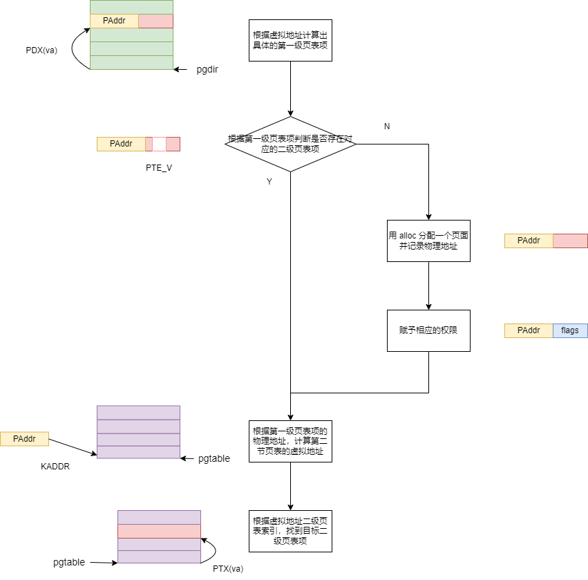

此外，关于二级页表的查找过程，在此补充


#### pgdir_walk()

流程基本上与 boot_pgdir_walk() 类似，只有以下区别：

- 返回值不再是虚拟地址对应的二级页表项了，而是状态码，0 表示运行成功，其他表示有故障，二级页表项变成指针修改
- 分配方式不再使用 alloc，而是使用 page_alloc。这是因为这个函数不在启动的时候使用，而是在启动完成后使用，此时已经建立了物理内存管理的机制（空闲链表）
- 需要增加引用次数，之前 boot 中不需要，是因为在 pages_init() 里统一加了

```c
/*Overview:
 	Given `pgdir`, a pointer to a page directory, pgdir_walk returns a pointer
 	to the page table entry (with permission PTE_R|PTE_V) for virtual address 'va'.

  Pre-Condition:
	The `pgdir` should be two-level page table structure.

  Post-Condition:
 	If we're out of memory, return -E_NO_MEM.
	Else, we get the page table entry successfully, store the value of page table
	entry to *ppte, and return 0, indicating success.

  Hint:
	We use a two-level pointer to store page table entry and return a state code to indicate
	whether this function execute successfully or not.
    This function have something in common with function `boot_pgdir_walk`.*/
int pgdir_walk(Pde *pgdir, u_long va, int create, Pte **ppte)
{
    Pde *pgdir_entryp;
    Pte *pgtable;
    struct Page *ppage;

    /* Step 1: Get the corresponding page directory entry and page table. */
    pgdir_entryp = pgdir + PDX(va);

    /* Step 2: If the corresponding page table is not exist(valid) and parameter `create`
     * is set, create one. And set the correct permission bits for this new page
     * table.
     * When creating new page table, maybe out of memory. */
    if (!((*pgdir_entryp) & PTE_V))
    {
        if (create)
        {
            if (page_alloc(&ppage) == -E_NO_MEM)
            {
                return -E_NO_MEM;
            }
            else
            {
                *pgdir_entryp = page2pa(ppage);
                *pgdir_entryp = (*pgdir_entryp) | PTE_V | PTE_R;
                ppage->pp_ref++;
            }
        }
        else
        {
            *ppte = 0;
            return 0;
        }
    }

    /* Step 3: Set the page table entry to `*ppte` as return value. */
    pgtable = (Pte *)KADDR(PTE_ADDR(*pgdir_entryp));
    *ppte = pgtable + PTX(va);

    return 0;
}
```

### page_lookup

讲这个之前，我想对很多东西做一个总结，`mm` 文件夹下有很多函数，有一个特点是只要是 `page` 开头的，一般都是与物理内存空间相关的，精确一些，他们在操作 `Pages` 结构体中的元素，比如

- page_init(): 初始化pages结构体数组和链表结构
- page_alloc(Page**): 从链表结构中分出一个
- page_free(Page**): 插入链表
- page_insert(Pde\*, Page\*, long, long): 建立一个虚拟页面与物理页面的映射关系，一般与 `page_alloc` 成对出现
- page_lookup(Pde*, u_long, Pte**): 查询某个虚拟地址对应的物理页面控制块
- page_decref(Page **): 将该页面的引用次数下降
- page_remove(Pde *, u_long): 将页面映射关系删除掉
- pageout：调用 page_insert 和 page_alloc 来建立一个映射关系

从上面可以看出，page_alloc 和 page_free 是比较基础的函数，他们涉及对空闲页面的操作。page_insert 的功能不完善，他必须在给定具体是哪一个物理页面之后，才可以建立映射关系，换句话说，他干的不是修改 page 的工作，而是修改页表的工作，page_remove 也呈现这个特征。pageout就比较完善了。

里面还有一些其他函数，大部分与查询页表有关。正是这些函数组成了内存管理。

还是需要强调，这些函数其实内核大部分都不会使用，因为高 2G 的映射关系就是高 3 位抹零，所以似乎在页表结构里登记都不用，因为就算登记了，也不能查，如果高 2 G 也查页表，那么就成了 bootloader 问题了，高 2G 需要借助页表完成转换，页表的登记需要高 2G 有完成转换的能力。

这个函数就是根据 va 将对应的物理页面的控制块查出来。同时还会获得对应的二级页表项，相比与 `pgdir_walk` 只能查找页表项，他可以完成对于该页表项的相关权限位的检验并且获取到控制块，可以看作是 `page_walk` 的加强版。

```c
struct Page *page_lookup(Pde *pgdir, u_long va, Pte **ppte)
{
	struct Page *ppage;
	Pte *pte;

	/* Step 1: Get the page table entry. */
	pgdir_walk(pgdir, va, 0, &pte);

	/* Hint: Check if the page table entry doesn't exist or is not valid. */
	if (pte == 0) 
	{
		return 0;
	}
	if ((*pte & PTE_V) == 0) 
	{
		return 0;    //the page is not in memory.
	}

	/* Step 2: Get the corresponding Page struct. */

	/* Hint: Use function `pa2page`, defined in include/pmap.h . */
	ppage = pa2page(*pte);
	if (ppte) 
	{
		*ppte = pte;
	}

	return ppage;
}
```

### tlb_invalidate()

给定特定进程的 context 这个函数可以让这个进程对应页表中的这个虚拟地址对应的 tlb 项失效。

```c
// Overview:
// 	Update TLB.
void tlb_invalidate(Pde *pgdir, u_long va)
{
    if (curenv)
    {
        tlb_out(PTE_ADDR(va) | GET_ENV_ASID(curenv->env_id));
    }
    else
    {
        tlb_out(PTE_ADDR(va));
    }
}
```

#### page_remove()

这个函数的意思是解除虚拟页面到物理页框的映射，也就是说，原来这个虚拟地址所在的虚拟页面在物理内存中是存在的，现在我们要解除这种映射关系。也就说，这个物理页面不在属于这个虚拟页面了。

首先，我们需要根据这个虚拟读地址来找到对应的物理页框的内存控制块和这个二级页表项

```c
	Pte *pagetable_entry;
    struct Page *ppage;

    /* Step 1: Get the page table entry, and check if the page table entry is valid. */
    ppage = page_lookup(pgdir, va, &pagetable_entry);
```

然后我们需要对内存块进行操作，具体就是减少引用次数，如果需要释放，那么就释放

```c
	/* Step 2: Decrease `pp_ref` and decide if it's necessary to free this page. */
    /* Hint: When there's no virtual address mapped to this page, release it. */
    ppage->pp_ref--;
    if (ppage->pp_ref == 0)
    {
        page_free(ppage);
    }
```

然后让二级页表项变为 0，这样说明没有办法通过二级页表项查到对应的物理页面了

```c
	*pagetable_entry = 0;
```

然后让 tlb 对应的项也清零

```c
	tlb_invalidate(pgdir, va);
```

#### page_decref()

减少物理页面的引用次数，如果引用次数减为0，才把这个物理页面对应的内存控制块插入到空闲链表的头部。似乎上面的 page_remove 里可以用这个函数改的更优雅些。

```c
void page_decref(struct Page *pp)
{
    if (--pp->pp_ref == 0)
    {
        page_free(pp);
    }
}
```

#### page_insert()

说是插入页面，其实更应该叫挤占页面。这个函数实现的功能是提供虚拟地址和给定的物理页框（所对应的内存控制块），把虚拟地址所在的虚拟页面映射到这个物理页框中去，并且给这个物理页框设置一些权限。

首先先获得该虚拟地址对应的二级页表项（方便之后处理和修改）

```c
	Pte *pgtable_entry;
	pgdir_walk(pgdir, va, 0, &pgtable_entry);
```

然后判断这个二级页表项有没有已经对应到物理页面上了

```c
if (pgtable_entry != 0 && (*pgtable_entry & PTE_V) != 0)
```

如果对应上了，那么接着判断已经对应的物理页框是不是我们需要它对应的物理页框

```c
 if (pa2page(*pgtable_entry) != pp)
```

如果不是，那么就把这原有的映射关系取消掉

```
page_remove(pgdir, va);
```

如果是，那么工作就很简单，基本上马上就能返回了。因为映射关系没有变，所以我们只需要把 TLB 无效掉，这是因为原有的权限可能和这次的权限不同。

```c
			tlb_invalidate(pgdir, va);
			*pgtable_entry = (page2pa(pp) | PERM);
            return 0;
```

然后我们插入一页

```c
pgdir_walk(pgdir, va, 1, &pgtable_entry)
```

注意这里不是冗余，上面的 walk 是查询，所以只查询，如果没查到不会创建新的页面，而这次如果没有查到，则会创建新的页面并且修改一级页表。

既然创建的新的，那么就需要设置一下二级页表项的权限

```c
	*pgtable_entry = page2pa(pp) | PERM;
    pp->pp_ref++;
```

#### page_out()

这里似乎可以先记录一下自己对于 context 的粗浅理解。context 是进程上下文的意思，当操作系统切换进程的时候，原有进程的虚拟地址映射需要保留，其实就是保留页表系统，context 是一级页表的起始地址。

这个函数主要实现的功能就是给定虚拟地址和特定的进程一级目录地址，为这个进程的该虚拟地址对应的虚拟页面分配一个物理页框。

```c
void pageout(int va, int context)
{
    u_long r;
    struct Page *p = NULL;

    if (context < 0x80000000)
    {
        panic("tlb refill and alloc error!");
    }

    if ((va > 0x7f400000) && (va < 0x7f800000))
    {
        panic(">>>>>>>>>>>>>>>>>>>>>>it's env's zone");
    }

    if (va < 0x10000)
    {
        panic("^^^^^^TOO LOW^^^^^^^^^");
    }

    if ((r = page_alloc(&p)) < 0)
    {
        panic("page alloc error!");
    }

    p->pp_ref++;

    page_insert((Pde *)context, p, VA2PFN(va), PTE_R);
}
```

### tlb_asm.S

#### tlb_out()

这个函数主要实现的是给定一个 tlb 需要的键值（即表项的高 32 位），把这个键值对应的表项置 0 （就是 64 位全是 0）。

首先我们需要弄懂 tlb 的结构，计组认为的 TLB，是长这样的：


也就是说，TLB 是一个全相连的 cache，既然是全相连，就不由 index 段了。我们用虚拟地址的前 22 位作为 TAG，并行的比较 64 个TLB 的 line，如果 TAG 相等，就说明找到了，反之，这说明没有找到。

不过这个模型还是有些粗糙的，很多细节并没有说明白。

在操作系统指导书里提到，tlb 构建了一个映射关系，我简化一下，就是 $VPN\space \rightarrow\space PPN$ 。当然这是对的了，但是这种说法我就弄成了每个 VPN 都会对应一个 PPN，但是其实这种映射关系只有 64 对。而且叫映射似乎就是一下就射过去了，而不是一个并行的比较过程。

其次就是，我们没有了解具体硬件发生了啥，比如 VPN 是怎样被检索的，被检索到的 PPN 放到了哪里，tlb 缺失以后具体怎么填补。都是没有的。这其实跟协处理器有很大关系。

在了解协处理器之前，我们先来看一下 tlb 的表项，他比计组版本要复杂一些，我们以 MOS 中 64MB （也就是共有 $2^{14}$ 页 ）的物理内存为例


我们来说明一下这些差别：

- 朴素版的 PPN 只有 14 位，是因为物理页框号可以最少用 14 位表示，但是真实版的 PPN 也与 VPN 相同，是 22 位。可能是考虑到不同电脑上内存不同吧，这估计也是 mips_detect_memory() 这个函数的设置。
- 朴素版一个 entry 是 36 位，而真实版一个 entry 是 64 位。这是因为真实版的标志位更多，所以需要的位数就更多
- 朴素版没有 ASID 段，而真实版有。ASID（address space identifier）应该是用于区分不同进程的一个标识符，因为操作系统可以同时运行多个进程，要是不用 ASID 的话，只要进程一切换，那么 TLB 里的所有内容都需要失效（因为进程切换就以为着虚拟地址和物理地址的映射关系切换），而这样是低效的，因为每次 TLB 中的内容清空，就意味着会发生 64 次的冷缺失。
- 朴素版没有物理地址权限标志位（N，D，V，G），而真实版有。这四个标志位的解释见下表

| 标志位            | 解释                                                         |
| ----------------- | ------------------------------------------------------------ |
| N（Non-cachable） | 当该位置高时，后续的物理地址访存将不通过 cache               |
| D（Dirty）        | 事实上是可写位。当该位置高时，该地址可写；否则任何写操作都将引发 TLB 异常。 |
| V（Valid）        | 如果该位为低，则任何访问该地址的操作都将引发 TLB 异常。      |
| G（Global）       | 如果该位置高，那么允许不同的虚拟地址映射到相同的物理地址，可能类似于进程级别的共享 |

总结起来就是真实版的 tlb 建立了一个这样的映射 $<VPN,ASID>\space\rightarrow\space<PPN,N,D,V,G>$ 。

然后我们来解决下一个问题，就是 tlb 怎么用的问题。这是一个我之前忽略的点，因为其实我对于 tlb 的定位并不清楚，我本以为它就好像是一个 cache，是对于程序员是透明的，我就在编程的时候写虚拟地址，然后就有硬件（MMU）拿着这个地址去问 tlb，tb再做出相关反应，这一切都是我不需要了解的，但是实际上 tlb 的各种操作，都是需要软件协作的。之所以有这个错误认知，是因为似乎在 X86 架构下确实是由硬件干的，但是由于我们的 MIPS 架构，也就是 RISC 架构，所以似乎交由软件负责效率更高一些。

如果 tlb 是程序员可见的，那么我们必然要管理它，那么我们就需要思考怎样管理它？我们管理它的方式就是设置了专门的寄存器和专门的指令。指令用于读或者写 tlb 中的内容，而寄存器则用于作为 CPU 和 tlb 之间沟通的媒介，就好像我们需要用 hi 和 lo 寄存器与乘除单元沟通一样。这些寄存器，都位于 CP0 中

在协处理器里面与 tlb 有关的寄存器如下表：

| 寄存器  | 编号 | 作用                                                         |
| ------- | ---- | ------------------------------------------------------------ |
| EntryHi | 10   | 保存某个 tlb 表项的高 32 位，任何对 tlb 的读写，都需要通过 EntryHi 和 EntryLo |
| EntryLo | 2    | 保存某个 tlb 表项的低 32 位                                  |
| Index   | 0    | 决定索引号为某个值的 tlb 表项被读或者写                      |
| Random  | 1    | 提供一个随机的索引号用于 tlb 的读写                          |

这里再说一下各个寄存器的域

- EntryHi，EntryLo 的域与 tlb 表项完全相同
- Index 的域：
- Random 的域：

与 tlb 相关的指令

| 指令  | 作用                                                         |
| ----- | ------------------------------------------------------------ |
| tlbr  | 以 Index 寄存器中的值为索引,读出 TLB 中对应的表项到 EntryHi 与 EntryLo。 |
| tlbwi | 以 Index 寄存器中的值为索引,将此时 EntryHi 与 EntryLo 的值写到索引指定的 TLB 表项中。 |
| tlbwr | 将 EntryHi 与 EntryLo 的数据随机写到一个 TLB 表项中（此处使用 Random 寄存器来“随机”指定表项，Random 寄存器本质上是一个不停运行的循环计数器） |
| tlbp  | tlb probe。用于查看 tlb 是否可以转换虚拟地址（即命中与否）根据 EntryHi 中的 Key（包含 VPN 与 ASID），查找 TLB 中与之对应的表项。如果命中，并将表项的索引存入 Index 寄存器。若未找到匹配项，则 Index 最高位被置 1。 |

然后我们来看这个函数的实现

它首先把原来 EntryHi 寄存器里的数据保存了下来（因为一会儿要把我们的键值放进去，怕数据被覆盖了）

```assembly
mfc0	k1, CP0_ENTRYHI
```

然后进行查询，并且判断有没有查询到

```assembly
mtc0	a0, CP0_ENTRYHI # 把键值移入 EntryHi
nop
tlbp					# 查询，将查询的结果存入 Index 寄存器
nop
nop
nop
nop
mfc0	k0, CP0_INDEX	# 把 Index 的内容移出来（Index 中保持着查询结果）
bltz	k0, NOFOUND		# 通过与 0 比较，判断有没有查到
nop
```

如果没有查到，就只进行如下操作：把原来的 EntryHi 给恢复了，返回

```assembly
NOFOUND:
	mtc0	k1, CP0_ENTRYHI		# 将原来的 EntryHi 给恢复了
	j		ra					# 返回
	nop
```

如果查到了，在进行上面的操作之前，还需要进行把这个条目全部清零的操作

```assembly
mtc0	zero, CP0_ENTRYHI	# 将 EntryHi 清零
mtc0	zero, CP0_ENTRYLO0	# 将 EntryLo 清零
nop
tlbwi						# 将 EntryHi 和 EntryLo 的内容写入 index 对应的 tlb条目
```


---

## lib/

### genex.S

个人感觉是 generate exception 的缩写。在这里突然想到到底需求的代码是没有办法用 C 语言书写的，而必须哟弄汇编语言书写。个人感觉一旦涉及到特定的寄存器了，那么 C 语言就会失效。比如说协处理器里面的寄存器。我们知道异常处理都与这些寄存器相关，所以必须得用汇编语言书写。可以这样表述：

>C 语言相较于汇编语言丧失了寄存器级别的控制力。
>
>C 语言实现了变量的抽象。

#### BUILD_HANDLER

这个代码里涉及了很多汇编的知识，先看代码

```assembly
.macro	BUILD_HANDLER exception handler clear
	.align	5
	NESTED(handle_\exception, TF_SIZE, sp)  
	//.set	noat

	nop

	SAVE_ALL				
	__build_clear_\clear
	.set	at
	move	a0, sp
	jal		\handler
	nop
	j		ret_from_exception
	nop
	END(handle_\exception)
.endm
```

首先是引用形参，gcc 不是依靠 `%` 而是依靠 `/` 这个符号（与这个现象类似的是注释也不再是 `#` ，而是 `//` ），比如说这句话

```assembly
NESTED(handle_\exception, TF_SIZE, sp)  
```

如果有一个宏的引用长这样

```assembly
BUILD_HANDLER tlb	do_refill	cli
```

其实上面那句话就是

```
NESTED(handle_tlb, TF_SIZE, sp)  
```

然后我们会看到很多 `.set` 伪指令，这些伪指令都是为了控制编译器的工作状态的。这里统一总结一下：

| 指令                | 解释                                                         |
| ------------------- | ------------------------------------------------------------ |
| noreorder/reorder   | reoder 就是乱序的意思，允许乱序就不让插入 nop，我不知道为啥  |
| volatile/novolatile | 当设置成 volatile 的时候，访存指令之间就不可以调换顺序了，反之，则可以调换顺序 |
| noat/at             | \$at 寄存器一般（即 at 状态）是归编辑器管理的，是编译器用来辅助宏的实现的，如果用户尝试使用，会报错或者警告。当设置为 noat 状态后，\$at 归用户管理，编辑器如果使用，则会报错或者警告 |
| nomacro/macro       | 不是禁用宏，而是禁用像 `li` 这样由其他多条指令组成的指令     |

这个宏声明了一个异常处理函数（Exception Handler），它提炼了一些异常处理函数的共性。

它先声明了一个函数，这个函数是一个嵌套函数，他的名字是 handle_exception

```assembly
NESTED(handle_\exception, TF_SIZE, sp)  
```

然后保存了寄存器

```assembly
SAVE_ALL
```

下面这句话设置了中断，但是叶哥哥说没用，因为 R3000 会在陷入中断时在硬件层面设置，不需要软件设置

```assembly
__build_clear_\clear
```

然后跳转到了真正的异常处理程序处

```assembly
	move	a0, sp
	jal		\handler
	nop
```

然后处理完后，跳转到返回函数处

```assembly
	j		ret_from_exception
	nop
```

这个返回函数应该是在其他文件定义的，因为有如下语句

```assembly
FEXPORT(ret_from_exception)
	.set noat
	.set noreorder
	RESTORE_SOME
	.set at
	lw	k0, TF_EPC(sp)				 
	lw	sp, TF_REG29(sp) /* Deallocate stack */  
//1:	
	j	1b
	nop
	jr	k0								 
	rfe		
```

最后我们在这个文件里找到了它应用这个宏声明了三个 handler，如下

```assembly
BUILD_HANDLER reserved do_reserved cli
BUILD_HANDLER tlb	do_refill	cli
BUILD_HANDLER mod	page_fault_handler cli
```

#### do_refill()

这个函数在 tlb 发生缺失异常的时候，将缺失的物理页面调入 tlb 中，修复异常。

当 tlb 发生缺失的时候，其实对应了两种情况

- 虚拟页没有映射到物理页框上
- 虚拟页面映射到物理页框上，但是物理页框没有放在 tlb 里

对于第二种情况，我们就其实就是可以直接挑一个 tlb 的项，然后覆盖掉就好了，具体的操作就是如下

```assembly
			mtc0	k1,CP0_ENTRYLO0
			nop
			tlbwr
```

但是如果是第一种情况，那么我们还需要为这个虚拟页分配好物理页框，也就是调用 page_out 函数。

```assembly
	.extern tlbra
.set	noreorder
NESTED(do_refill, 0, sp)
			//li	k1, '?'
			//sb	k1, 0x90000000
			.extern	mCONTEXT
//this "1" is important
1:			//j 1b
			nop
			lw		k1,mCONTEXT
			and		k1,0xfffff000   # k1 now store the phsical address of page dictionary
			mfc0	k0,CP0_BADVADDR
			srl		k0,20			# get the virtual address top 10 bit
			and		k0,0xfffffffc	# c = 1100 align 4 bit, k0 now is the offset(becacause pte size is 4 bit) 
			addu	k0,k1			# get the page_dictionary_entry address
			
			lw		k1,0(k0)		# get the page_dictionary_entry
			nop
			move	t0,k1			# t0 is the page_dictionary_entry
			and		t0,0x0200       # check the validility of the page_dictionary_entry
			beqz	t0,NOPAGE		# if not exist, call page_out()
			nop
			and		k1,0xfffff000
			mfc0	k0,CP0_BADVADDR
			srl		k0,10
			and		k0,0xfffffffc
			and		k0,0x00000fff
			addu	k0,k1			# get the page_table_entry

			or		k0,0x80000000
			lw		k1,0(k0)
			nop
			move	t0,k1
			and		t0,0x0200  		# check the validility of the page_table_entry
			beqz	t0,NOPAGE		# if not exist, call page_out()
			nop
			move	k0,k1
			and		k0,0x1
			beqz	k0,NoCOW
			nop
			and		k1,0xfffffbff
NoCOW:
			mtc0	k1,CP0_ENTRYLO0
			nop
			tlbwr

			j		2f
			nop
NOPAGE:
//3: j 3b
nop
			mfc0	a0,CP0_BADVADDR
			lw		a1,mCONTEXT
			nop
				
			sw	 	ra,tlbra
			jal		pageout
			nop
//3: j 3b
nop
			lw		ra,tlbra
			nop

			j		1b
2:			nop

			jr		ra
			nop
END(do_refill)
```

### printf.c

#### myoutput()

`myoutput`会打印出给定长度的给定字符串。

```c
static void myoutput(void *arg, char *s, int l)
{
    int i;

    // special termination call
    if ((l == 1) && (s[0] == '\0'))
        return;

    for (i = 0; i < l; i++)
    {
        printcharc(s[i]);
        if (s[i] == '\n')
            printcharc('\n');
    }
}
```

因为有 `static` 关键字，所以只在本文件可见，所以在调用的时候，用了函数指针的操作。奇怪的是，第一个参数 `arg` 并没有用到，这个在真正调用的时候，传入的是 0。我不太能理解为啥。后面的参数 `s` 就是需要打印的字符串，`l` 是字符串的长度，可以看到，就是用一个 for 循环去调用 `printcharc` 很好理解。

####  printf()

就是我们用的最熟的那个形式和功能。

```c
void printf(char *fmt, ...)
{
    va_list ap;
    va_start(ap, fmt);
    lp_Print(myoutput, 0, fmt, ap);
    va_end(ap);
}
```

因为指导书里介绍过了可变参数列表的内容，这里不再介绍，所以这个函数很显然，而且参数就是我们知道的参数。

#### _panic()

```c
void _panic(const char *file, int line, const char *fmt, ...)
{
    va_list ap;

    va_start(ap, fmt);
    printf("panic at %s:%d: ", file, line);
    lp_Print(myoutput, 0, (char *)fmt, ap);
    printf("\n");
    va_end(ap);

    for (;;);
}
```

在这次作业中没有涉及，但是可以查到他的用处

>用于显示内核错误信息并使系统进入死循环

结合这个作用来看，还挺自然的。

### print.c

#### OUTPUT

首先需要了解一下什么是函数指针

函数指针为什么可以存在，我觉得吴哥哥说的在理

>C 是高级的汇编语言。

函数是一段代码，代码存在内存中，我们可以用指针访问内存，所以函数指针是可行的。对于函数指针，是可以讲很多的，但是因为我不会，所以就不讲了。

对于函数指针的声明，虽然有**经典的一层一层分析**，但是我不会写，所以就记一下好了

```c
//函数返回值类型 (* 指针变量名) (函数参数列表);
int (*fp)(int,double);					// fp 是函数指针，第一个参数的类型是 int，第二个参数的类型是 double
int (*fpArray[])(float,char);			// fpArray 是函数指针数组
```

对于函数指针的赋值，我也打算记一下就好了

```c
fp = &f;
fp = f; 	// 两种写法都可以
```

对于函数指针的使用

```c
(*fp)(a,b);
fp(ab);		// 同样两种都可以
```

然后来看这个宏

```c
/* private variable */
static const char theFatalMsg[] = "fatal error in lp_Print!";

#define OUTPUT(arg, s, l)                                                     	\
	{                                                                         	\
		if (((l) < 0) || ((l) > LP_MAX_BUF))                                  	\                       
		{                                                                 		\
			(*output)(arg, (char *)theFatalMsg, sizeof(theFatalMsg) - 1); 		\
			for (;;);                                                           \
		}                                                                 		\
		else 																	\ 
		{                                                                     	\
			(*output)(arg, s, l);                                             	\
		}                                                                     	\
	}
```

这个宏其实就是用来输出的，这个宏的三个参数就是 `myoutput` 的三个参数。我们看到在 `if` 中首先看到的是错误输出语句，就是输出那句 `fatal error in lp_Print!` 。在 `else` 中才是正确语句。

#### PrintChar()

首先是 `PrintChar`

```c
int PrintChar(char *buf, char c, int length, int ladjust)
{
	int i;

	if (length < 1)
		length = 1;
	if (ladjust)
	{
		*buf = c;
		for (i = 1; i < length; i++)
			buf[i] = ' ';
	}
	else
	{
		for (i = 0; i < length - 1; i++)
			buf[i] = ' ';
		buf[length - 1] = c;
	}
	return length;
}
```

可以看出，他大概会往 buf 中写入 `_______C` 或者 `c_______` （下划线是空格的意思）这样的东西 ，这个写入字符串中的字符由参数 `c` 控制，字符串的长度由参数 `length` 控制，决定是空格在前还是在后，由 `ladjust` 控制。

#### PrintString()

```c
int PrintString(char *buf, char *s, int length, int ladjust)
{
	int i;
	int len = 0;
	char *s1 = s;
	while (*s1++)
		len++;
	if (length < len)
		length = len;

	if (ladjust)
	{
		for (i = 0; i < len; i++)
			buf[i] = s[i];
		for (i = len; i < length; i++)
			buf[i] = ' ';
	}
	else
	{
		for (i = 0; i < length - len; i++)
			buf[i] = ' ';
		for (i = length - len; i < length; i++)
			buf[i] = s[i - length + len];
	}
	return length;
}
```

这个函数实现的功能就是把字符串 `s` 中内容拷贝到 `buf` 中。同样涉及到一个左对齐还是右对齐的问题，如果 `ladjust`（left-adjust）大于零，那就进行左对齐，否则右对齐，里面引入了一个 `len` 就是为了实现这个功能（对齐补空格）。

#### PrintNum()

```c
int PrintNum(char *buf, unsigned long u, int base, int negFlag,
			 int length, int ladjust, char padc, int upcase)
{
	/* algorithm :
     *  1. prints the number from left to right in reverse form.
     *  2. fill the remaining spaces with padc if length is longer than
     *     the actual length
     *     TRICKY : if left adjusted, no "0" padding.
     *		    if negtive, insert  "0" padding between "0" and number.
     *  3. if (!ladjust) we reverse the whole string including paddings
     *  4. otherwise we only reverse the actual string representing the num.
     */

	int actualLength = 0;
	char *p = buf;
	int i;

	do
	{
		int tmp = u % base;
		if (tmp <= 9)
		{
			*p++ = '0' + tmp;
		}
		else if (upcase)
		{
			*p++ = 'A' + tmp - 10;
		}
		else
		{
			*p++ = 'a' + tmp - 10;
		}
		u /= base;
	} while (u != 0);

	if (negFlag)
	{
		*p++ = '-';
	}

	/* figure out actual length and adjust the maximum length */
	actualLength = p - buf;
	if (length < actualLength)
		length = actualLength;

	/* add padding */
	if (ladjust)
	{
		padc = ' ';
	}
	if (negFlag && !ladjust && (padc == '0'))
	{
		for (i = actualLength - 1; i < length - 1; i++)
			buf[i] = padc;
		buf[length - 1] = '-';
	}
	else
	{
		for (i = actualLength; i < length; i++)
			buf[i] = padc;
	}

	/* prepare to reverse the string */
	{
		int begin = 0;
		int end;
		if (ladjust)
		{
			end = actualLength - 1;
		}
		else
		{
			end = length - 1;
		}

		while (end > begin)
		{
			char tmp = buf[begin];
			buf[begin] = buf[end];
			buf[end] = tmp;
			begin++;
			end--;
		}
	}

	/* adjust the string pointer */
	return length;
}
```

这是把一个数拷贝到 `buf` 中，相当于**将数字转换成字符串**。我们可以指定基数，还可以指定对齐方式和前导零问题。但是就跟我们在程设中遇到的一样，是需要调转字符串的。

#### lp_Print()

```c
void lp_Print(void (*output)(void *, char *, int),
			  void *arg,
			  char *fmt,
			  va_list ap)
{
	char buf[LP_MAX_BUF];

	char c;
	char *s;
	long int num;

	int longFlag;
	int negFlag;
	int width;
	int prec;
	int ladjust;
	char padc;

	int length;

	/* special termination call */
	OUTPUT(arg, "\0", 1);
}
```

其实我们实现的最重要功能不是**打印字符串**，这个功能是很好实现的。我们实现的最重要功能是**格式化输出**，这个功能才是实现的需求，也是难点，所以格式符形式

```c
%[flags][width][.precision][length]specifier
```

只要了解就可以了。

---


## tools/

### scse0_3.lds

这个链接脚本还是十分重要的。

首先它规定了内核程序的入口函数

```c
ENTRY(_start)
```

其次，它规定了内核程序在虚拟地址空间中的分布

```bash
SECTIONS
{
  . = 0x80010000;
  .text : {
    *(.int)
	*(.text)
	*(.fini)
        }
  .data : {
	*(.data)
	}
  .bss  : {
	*(.bss)
    }
  .sdata : {
    *(.sdata)
    }
  . = 0x80400000;
  end = . ;
}
```

我们可以根据这个画出一幅图来


这个 end 指针会在分配虚拟内存空间的时候用到，这并不奇怪，因为 end 指针刚好是初始化结束后内核栈的栈顶，而内核栈是向下增长的。

---


## drivers/

### dev_cons.h

`dev_cons.h` 中定义了一些外设虚拟地址常量，这些常量会在 `console.c` 中被用到（从注释角度来看，应该是不止这个文件会用到），下面是源代码

```c
#ifndef	TESTMACHINE_CONS_H
#define	TESTMACHINE_CONS_H

/*
 *  Definitions used by the "cons" device in GXemul.
 *
 *  $Id: dev_cons.h,v 1.2 2006/07/05 05:38:36 debug Exp $
 *  This file is in the public domain.
 */


//#define	DEV_CONS_ADDRESS		0x180003f8
#define	    DEV_CONS_ADDRESS		0x10000000
#define	    DEV_CONS_LENGTH			0x0000000000000020
#define	    DEV_CONS_PUTGETCHAR		0x0000
#define	    DEV_CONS_HALT		    0x0010


#endif	/*  TESTMACHINE_CONS_H  */
```

### console.c

#### address macro

从这三个宏（以及上面那个头文件中的宏），我们可以得出 `PUTCHAR_ADDRESS` 的值是 `0xB000_000`，`HALT_ADDRESS` 的值是 `0xB000_0010`。他们都是虚拟地址。这个地址是很符合常理的，因为这俩地址都属于 kseg1，是留给外设的。唯一需要吐槽的就是 `PHYSADDR_OFFSET` 这个名字是错的。

```c
#define	PHYSADDR_OFFSET		((signed int)0xA0000000)

#define	PUTCHAR_ADDRESS		(PHYSADDR_OFFSET + DEV_CONS_ADDRESS + DEV_CONS_PUTGETCHAR)
#define	HALT_ADDRESS		(PHYSADDR_OFFSET + DEV_CONS_ADDRESS + DEV_CONS_HALT)
```

#### putcharc()

```c
void printcharc(char ch)
{
	*((volatile unsigned char *) PUTCHAR_ADDRESS) = ch;
}
```

前面的 `volatile` 是一个关键字，它提醒编译器它后面所定义的变量随时都有可能改变，因此编译后的程序每次需要存储或读取这个变量的时候，都会直接从变量地址中读取数据。如果没有volatile关键字，则编译器可能优化读取和存储，可能暂时使用寄存器中的值，如果这个变量由别的程序更新了的话，将出现不一致的现象。

然后我们看出就是它往内存中某个特定地址中写了一个字符，这个内存刚好对应外设，所以可以在屏幕上输出（或者其他的，我不清楚具体哪个外设）。

#### halt()

`halt` 函数也类似，都是往一个特殊的地址中写了个数据，作用是使程序终止。

```c
void halt(void)
{
	*((volatile unsigned char *) HALT_ADDRESS) = 0;
}
```

#### printstr()

`printstr` 就是连续调用 `printcharc` 

```c
void printstr(char *s)
{
	while (*s)
		printcharc(*s++);
}
```

