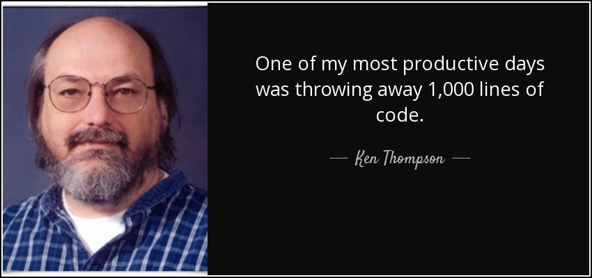
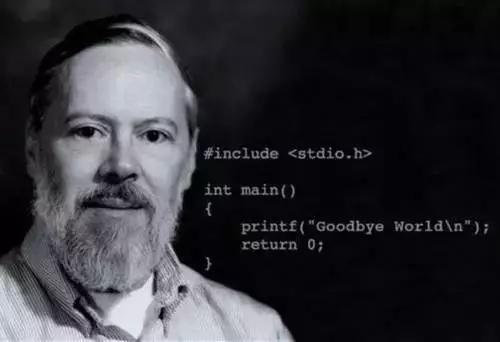
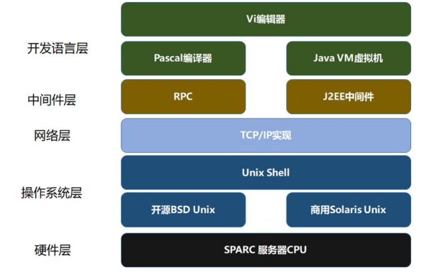
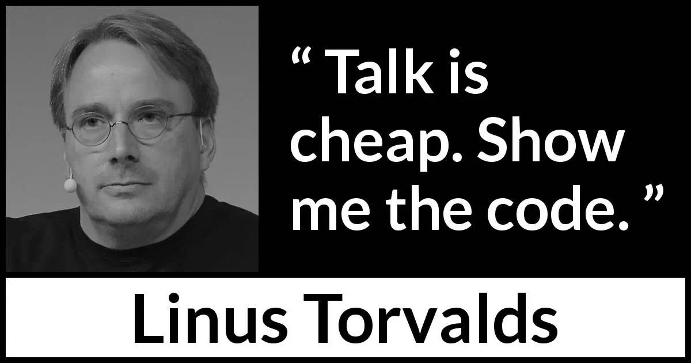
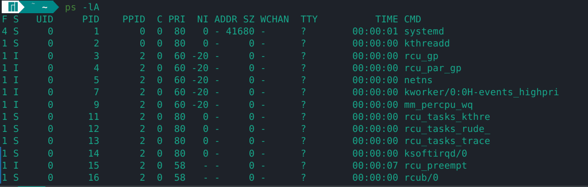
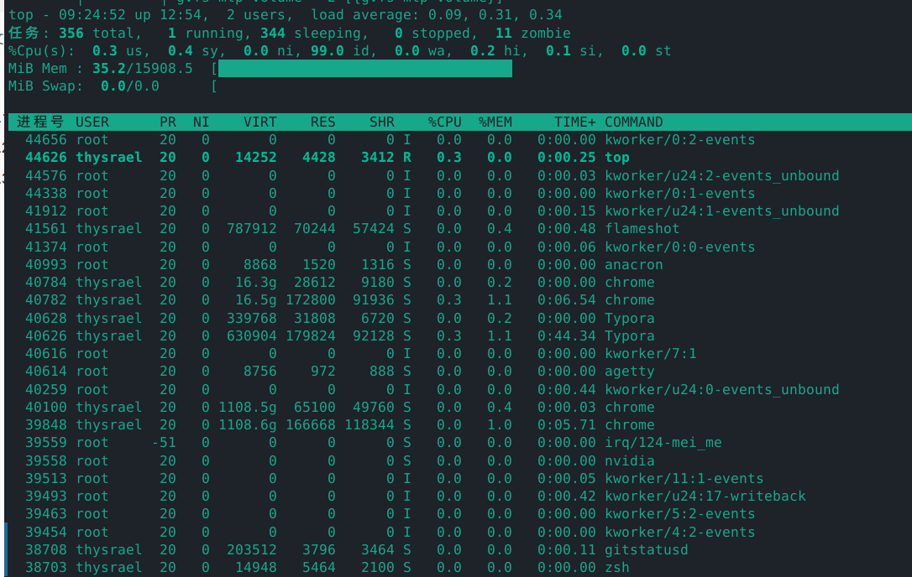
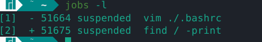
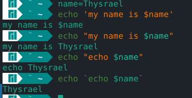
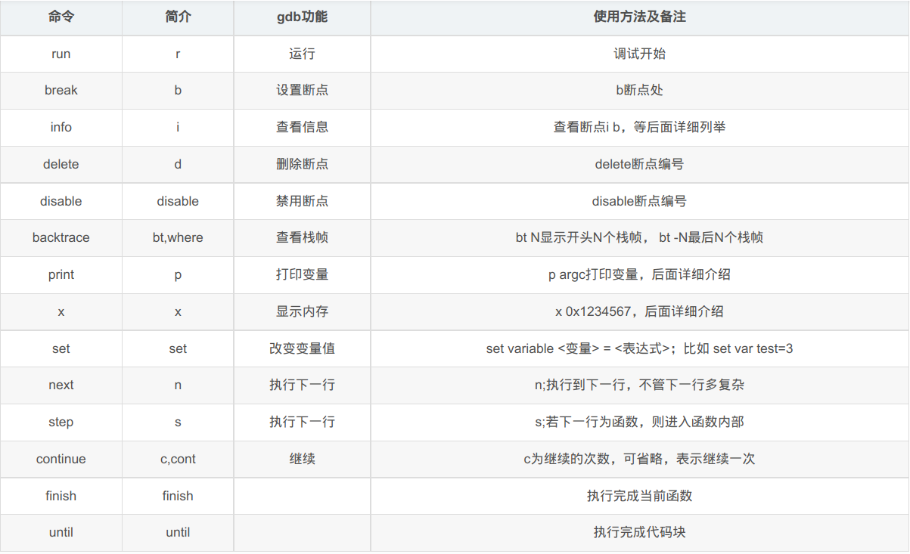

## 一、发展与历史

体系结构包括指令集，存储组织，I/O，总线结构。写到这里的时候真的觉得一切都值了。

### 1.1 操作系统迭代

一开始的操作系统是**批处理式**的。批处理的意思就是把一堆任务集中到一起，然后一起处理，这样的好处是实现了初步的流水线化。但是计算机要读取任务，要通过磁带，而磁带上的内容，要通过读卡器读取卡片（可能就是一堆打着孔的硬纸板吧）写到磁盘上，如果读一个任务写一个磁带，然后读一个磁带，处理一个任务，这就太慢了。所以就考虑可以先用读卡器将一堆任务的卡片都一起读到磁带上，然后一起把这些磁带上的任务处理了。这就是所谓的批处理。那么这个时候，操作系统的主要作用就是自动地一个任务一个任务的完成。

之后就变成了**多道程序设计**。尽管我们把写磁带这个功能给分割开来，让计算机可以安心处理磁带上的任务，但是计算机依然是需要读取磁盘上的内容的，这段 I/O 所占的时间 CPU 是不会工作的。为了把这段时间利用起来，我们可以考虑在内存中存放多个任务，这样当有一个任务在进行 I/O 的时候，CPU 可以去运算其他任务，这就是“多道程序设计”。所谓的“多道”，就是说在内存中存在多个任务。可以看作是在内存空间上实现了并行。

同时还有一个技术产生了，那就是**分时系统**。这说的是尽管有了多道程序设计去优化速度，但是其本质还是一个“批处理系统”，就是说攒一大堆任务一起处理，一起出成果，那么就会导致等待的时候过长。为了提高响应性，可以考虑将 CPU 轮流分配（虽然多道程序设计也实现了），然后关键的是，干完就赶快出货，别拖着一起出。

这三种技术的界限分割并不明显，因为事实就是他们在理论上本就具有一脉相承的。我感觉可能只是在具体的软硬件技术上有所区别，比如分时系统对于调度的要求可能就会跟批处理的难度有一个很大的提升。

### 1.2 名人

Kenneth Lane Thompson 肯尼斯 · 蓝 · 汤普森。一般称其为汤普森。开发 Unix 的人，除此之外，还参与了 C 和 go 语言的设计，还设计了 ed 和 UTF-8。他老人家还健在。



Dennis Ritchie 丹尼斯 · 里奇。是汤普森的好友。两人一起开发了 Unix 和 C。并且用 C 重写了 Unix。



Bill Joy 比尔 · 乔伊。这人之前没有听过，所以专门找了一张描述他成就的图，据说他就是各种“代码之神”段子的原本主角。他是汤普森在伯克利大学的学生。`SPARC` 同样是 RISC 类型，用于学术领域的大型工作站中，包括银行金融体系的主服务器。


他的成就




Linus Torvalds 林纳斯 · 托瓦兹。Linux 系统的开发者，还开发了 git。



Richard Stallman 理查德 · 斯托曼。gcc, gdb, Emacs 的创造者。GNU 运动的发起者。


### 1.3 历史

- 1970 年，UNIX 诞生，被称为 UNIX 元年，这可能也是各种计时装置从 1970 年 0 点 0 分开始的原因。
- 1973 年，用 C 语言重写的 UNIX 诞生，这个版本被叫做 SYSTEM V。这一年也是 C 语言的诞辰，可以说开发完 C 语言立刻就重写了 UNIX。
- 1977 年，UNIX 最著名的分发版之一的 BSD（Berkeley Software Distribution）诞生，这个发行版上有 vi、pascal编译器，并在之后与 TCP/IP 结合。
- 1988 年，为统一各UNIX系统编程接口，提供应用程序在各UNIX系统之间的可移植性，IEEE出台了POSIX（Portable Operating System Interface）标准，定义了UNIX系统必须提供的接口函数（在C语言头文件中定义）
- 1991 年，Linux 诞生。

---


## 二、基本操作

### 2.1 tty

tty，teletypewriter 电传打字机，其本意可能是为了比喻一种虚拟化的打字机，即一种与计算机沟通的手段。linux 提供 `tty1 ~ tty6` 6 个接口操作环境，给我个人感觉就是一个没有内置命令的 shell。

我们平时打开 Linux 的系统的时候，其实发生的是先打开 tty1，然后运行 XWindow 桌面管理器，然后再登陆的一个流程。如果我们想看原生的 tty 长啥样子，可以按 `Ctrl + Alt + Fn`  （其中 n 是 2 ~ 6）。就可以看见了。

进去 `tty` 以后首先要输入用户名并登陆。

### 2.2 进程查看

利用 `ps` 命令可以查看进程状态

```shell
ps -l		# 只查看自己当前 shel 运行的进程
ps -lA		# 查看所有系统运行的进程
```

其效果如图：



其中 `F` 用于说明进程的权限，`4` 表示 `root` 权限，`1` 表示子进程仅执行 `fork` ，没有实际执行 `exec`。

其中 `S` 表示进程的状态，`R` 表示 Running，说明该进程正在运行；`S` 表示 sleeping，该进程正在睡眠状态，但是可以被信号量唤醒；`D` 不可唤醒状态，一般为等待 I/O；`T` 停止状态，可能是在后台暂停；`Z` 表示 zombie，进程已经终止但是无法被移除到内存外。

`PID` 是进程编号，`PPID` 是父进程编号。

`C` 是 CPU 的使用率。

`PRI` 是 priority 的缩写， `NI` 是 Nice 的缩写，两者表示优先级，都是越小优先级越高。

此外用 `top` 命令也可以查看进程的状态，这个更像 windows 下的任务管理器，因为这是一个动态变化的东西，效果如图



他会进入 `top` 的工作环境，在此按键有了新的功能（注意大小写）：

- `P`：以 CPU 的使用排序显示
- `M`：以 Memory 的使用排序现实
- `N`： 以 PID 来排序
- `T`：由该进程使用的 CPU 时间积累（`TIME+`）进行排序
- `k`：给予某个 PID 一个信号（signal）
- `r`：给予某个 PID 重新定制一个 `nice` 值
- `q`：退出 `top` 的工作环境

关于进程的优先调度，`PRI` 的值是操作系统给的，而且还会实时变化，所以我们没有办法调控。但是我们还有调控优先级的需求，所以就有了 `Nice` 值，两者的相关性如下：
$$
\tt{PRI(new)\space = \space PRI(old) \space + \space Nice}
$$
此外 `Nice` 的值有如下限制：

- `nice` 的值可调整的范围为 `-20 ~ 19`
- `root` 可随意调整自己和他人进程的 `nice` 的值，且范围为 `-20 ~ 19`
- 一般用户仅可调整自己的 `nice` 值，且范围为 `0 ~ 19`
- 一般用户仅可将 `nice` 值越调越高

### 2.3 进程信号

就和 lab-4-2 extra 中介绍的一样，我们有一个命令叫做 `kill` ，其格式如下

```
kill -signal PID
```

正如 extra 提到的，`kill` 并不是一个单纯的“杀死进程”的命令，而是一个给进程发送信号的命令。发送的信号是“杀死”只是 `kill` 的一种用法。

我们用下面的命令可以查看 `signal` 的种类

```shell
kill -l
kill -L
```

输出结果如下

```shell
1) SIGHUP       2) SIGINT       3) SIGQUIT      4) SIGILL       5) SIGTRAP
6) SIGABRT      7) SIGBUS       8) SIGFPE       9) SIGKILL     10) SIGUSR1
11) SIGSEGV     12) SIGUSR2     13) SIGPIPE     14) SIGALRM     15) SIGTERM
16) SIGSTKFLT   17) SIGCHLD     18) SIGCONT     19) SIGSTOP     20) SIGTSTP
21) SIGTTIN     22) SIGTTOU     23) SIGURG      24) SIGXCPU     25) SIGXFSZ
26) SIGVTALRM   27) SIGPROF     28) SIGWINCH    29) SIGIO       30) SIGPWR
31) SIGSYS      34) SIGRTMIN    35) SIGRTMIN+1  36) SIGRTMIN+2  37) SIGRTMIN+3
38) SIGRTMIN+4  39) SIGRTMIN+5  40) SIGRTMIN+6  41) SIGRTMIN+7  42) SIGRTMIN+8
43) SIGRTMIN+9  44) SIGRTMIN+10 45) SIGRTMIN+11 46) SIGRTMIN+12 47) SIGRTMIN+13
48) SIGRTMIN+14 49) SIGRTMIN+15 50) SIGRTMAX-14 51) SIGRTMAX-13 52) SIGRTMAX-12
53) SIGRTMAX-11 54) SIGRTMAX-10 55) SIGRTMAX-9  56) SIGRTMAX-8  57) SIGRTMAX-7
58) SIGRTMAX-6  59) SIGRTMAX-5  60) SIGRTMAX-4  61) SIGRTMAX-3  62) SIGRTMAX-2
63) SIGRTMAX-1  64) SIGRTMAX
```

但是估计也用不到那么多，所以挑几个说一下

| 代号 | 名称 | 内容                                              |
| ---- | ---- | ------------------------------------------------- |
| 1    | HUP  | 启动终止的进程，可让该 PID 重新读取自己的配置文件 |
| 2    | INT  | 就是 `Ctrl + c` 的意思                            |
| 9    | KILL | 强制中断一个进程                                  |
| 15   | TERM | 以正常方式终止一个进程                            |
| 19   | STOP | 挂起一个进程，类似与 `Ctrl + z`                   |

### 2.4 任务管理

可以出现提示字符让用户操作的环境就称为前台（foreground），至于其他任务就可以放入后台（background）去暂停或运行。

一般的时候命令都是在前台执行的，如果我们想把他放到后台去管理，可以这样

```shell
command &
```

对于前台的命令，我们既可以按 `Ctrl + c` 终止任务，也可以按 `Ctrl + z` 将其放到后台并悬挂。

对于后台的命令，可以用下面的命令查看

```shell
jobs -l
```

其输出结果如下



除了进程号以外，还会提供形如 `[1], [2]` 的 `jobnumber` 。

如果想要将后台人物拿到前台来处理，可以使用命令

```shell
fg %jobnumber
```

如果想要让任务在后台下的状态变成运行中，可以使用如下命令

```shell
bg %jobnumber
```

但是似乎后台依然是和 `shell` 终端有关的。为了让其真正放到系统后台，可以如下命令

```shell
nohup command
```

---


## 三、文件系统

### 3.1 文件的类型

我们都知道文件的类型和权限都可以用 `ls -l` 查看。我注意到 linux 将文件分为这么几类：

- `d` 目录
- `-` 文件
- `l` 链接文件
- `b` 块设备，可以随机存储的外设
- `c`字符型设备，一般是串行端口，键盘鼠标，无法随机存取

### 3.2 文件的权限

其实这个似乎结合 MOS 的实现来看还挺好理解的。

对于普通的文件其权限

- `r` ，就是读取文件的实际内容
- `w`，可以编辑、新增、修改文件的内容（但是不能删除，因为删除文件其实是修改目录）、
- `x`，可以被系统执行

对于目录权限

- `r` 可以读取目录结构，就是可以 `ll`
- `w` 可以修改目录的内容，包括新建文件和目录，删除文件和目录，给文件改名
- `x` access directory，可以进入这个目录，使其成为工作目录

### 3.3 ext2

`Unix` 习惯的文件系统就是 ext2，就是我们熟悉的 `inode` 结构就是这个文件系统的方式。

FAT 是微软之前主要使用的文件系统，后来改成了 NTFS。现在 FAT 还是 U 盘的文件系统，另外说一下，FAT 是链表式的组织结构。

现在有一种新的文件系统叫做 XFS，似乎是日志式的。

### 3.4 常见外设

在一切皆文件的指导思想下，还是积累几个常用的外设文件吧

```shell
dev/tty*		# 终端
dev/pts&		# 远程终端
dev/stdin		# 标准输入
dev/stdout		# 标准输出
dev/stderr		# 标准错误
dev/zero		# 零字节流
dev/null		# 空
dev/fd			# 软盘
dev/hd			# 硬盘
```

其实还是要多积累。

---


## 四、文件编辑和流处理

### 4.1 常见环境变量

`PS1` 用来设置命令提示符的格式，具体的语法在 `P323` 页有，只是吐槽一句，这是 `bash` 的

```shell
\[\033[01;32m\][\u@\h\[\033[01;37m\] \W\[\033[01;32m\]]\$\[\033[00m\]
```

这是 `zsh` 的

```shell
${$((_p9k_on_expand()))+}%{${_p9k__raw_msg-}${_p9k__raw_msg::=}%}${(e)_p9k_t[7]}${_p9k__1-${${:-${_p9k__d::=0}${_p9k__rprompt::=${_p9k__1r-${${:-${_p9k__bg::=NONE}${_p9k__i::=0}${_p9k__sss::=}}+}${${:-${P9K_CONTENT::=}${_p9k__n::=}${${${_p9k__bg:-0}:#NONE}:-${_p9k__n::=8}}${_p9k__n:=${${(M)${:-x$_p9k__bg}:#x(000|000)}:+10}}${_p9k__n:=11}}${_p9k__e::=${${_p9k__1rstatus+00}:-${${(%):-$_p9k__c%1(l.1.0)}[-1]}1}}}+}${${_p9k__e:#00}:+${_p9k_t[$_p9k__n]/<_p9k__w>/$_p9k__w}${_p9k__c}%b%K{000\}%F{002\}${${(M)_p9k__e:#11}:+ }$_p9k__v${${:-${_p9k__w::=%b%K{000\}%F{002\} %b%K{000\}%F{002\}}${_p9k__sss::=%b%K{000\}%F{002\} }${_p9k__i::=1}${_p9k__bg::=000}}+}}${${:-"${${(%):-%j}:#0}"}:+${${:-${P9K_CONTENT::=""}${_p9k__n::=}${${${_p9k__bg:-0}:#NONE}:-${_p9k__n::=12}}${_p9k__n:=${${(M)${:-x$_p9k__bg}:#x(000|000)}:+14}}${_p9k__n:=15}${_p9k__v::=}${_}}${_p9k__e::=${${_p9k__1rbackground_jobs+00}:-${${(%):-$_p9k__c%1(l.1.0)}[-1]}1}}}+}${${_p9k__e:#00}:+${_p9k_t[$_p9k__n]/<_p9k__w>/$_p9k__w}${_p9k__c}%b%K{000\}%F{006\}${${(M)_p9k__e:#11}:+ }$_p9k__v${${:-${_p9k__w::=%b%K{000\}%F{006\} %b%K{000\}%F{006\}}${_p9k__sss::=%b%K{000\}%F{006\} }${_p9k__i::=3}${_p9k__bg::=000}}+}}}${${:-"${${(%):-%#}:#\#}"}:+${${:-${P9K_CONTENT::=%n@%m}${_p9k__n::=}${${${_p9k__bg:-0}:#NONE}:-${_p9k__n::=20}}${_p9k__n:=${${(M)${:-x$_p9k__bg}:#x(000|000)}:+22}}${_p9k__n:=23}${_}}${_p9k__e::=${${_p9k__1rcontext+00}:-${${(%):-$_p9k__c%1(l.1.0)}[-1]}0}}}+}${${_p9k__e:#00}:+${_p9k_t[$_p9k__n]/<_p9k__w>/$_p9k__w}${_p9k__c}%b%K{000\}%F{003\}${${:-${_p9k__w::=%b%K{000\}%F{003\} %b%K{000\}%F{003\}}${_p9k__sss::=%b%K{000\}%F{003\} }${_p9k__i::=30}${_p9k__bg::=000}}+}}}${${:-"${${(%):-%#}:#\%}"}:+${${:-${P9K_CONTENT::=%n@%m}${_p9k__n::=}${${${_p9k__bg:-0}:#NONE}:-${_p9k__n::=24}}${_p9k__n:=${${(M)${:-x$_p9k__bg}:#x(000|000)}:+26}}${_p9k__n:=27}${_p9k__c::="${P9K_CONTENT}"}${_p9k__c::=}}${_p9k__e::=${${_p9k__1rcontext+00}:-${${(%):-$_p9k__c%1(l.1.0)}[-1]}0}}}+}${${_p9k__e:#00}:+${_p9k_t[$_p9k__n]/<_p9k__w>/$_p9k__w}${_p9k__c}%b%K{000\}%F{001\}${${:-${_p9k__w::=%b%K{000\}%F{001\} %b%K{000\}%F{001\}}${_p9k__sss::=%b%K{000\}%F{001\} }${_p9k__i::=30}${_p9k__bg::=000}}+}}}${${:-"${${:-$_p9k__keymap.$_p9k__zle_state}:#(vicmd.*|vivis.*|vivli.*|*.*insert*)}"}:+${${:-${P9K_CONTENT::=OVERTYPE}${_p9k__n::=}${${${_p9k__bg:-0}:#NONE}:-${_p9k__n::=28}}${_p9k__n:=${${(M)${:-x$_p9k__bg}:#x(003|003)}}${_p9k__e::=${${_p9k__1rvi_mode+00}:-${${(%):-$_p9k__c%1(l.1.0)}[-1]}0}}}+}${${_p9k__e:#00}:+${_p9k_t[$_p9k__n]/<_p9k__w>/$_p9k__w}${_p9k__c}%b%K{003\}%F{000\}${${:-${_p9k__w::=%b%K{003\}%F{000\} %b%K{003\}%F{000\}}${_p9k__sss::=%b%K{003\}%F{000\} }${_p9k__i::=38}${_p9k__bg::=003}}+}}}${${:-"${(M)${:-$_p9k__keymap$_p9k__region_active}:#vicmd0}"}:+${${:-${P9K_CONTENT::=NORMAL}${_p9k__n::=}${${${_p9k__bg:-0}:#NONE}:-${_p9k__n::=32}}${_p9k__n:=${${(M)${:-x$_p9k__bg}:#x(002|002)}:+34}}${_p9k__n:=35}${_p9}}${_p9k__e::=${${_p9k__1rvi_mode+00}:-${${(%):-$_p9k__c%1(l.1.0)}[-1]}0}}}+}${${_p9k__e:#00}:+${_p9k_t[$_p9k__n]/<_p9k__w>/$_p9k__w}${_p9k__c}%b%K{002\}%F{000\}${${:-${_p9k__w::=%b%K{002\}%F{000\} %b%K{002\}%F{000\}}${_p9k__sss::=%b%K{002\}%F{000\} }${_p9k__i::=38}${_p9k__bg::=002}}+}}}${${:-"${(M)${:-$_p9k__keymap$_p9k__region_active}:#(vicmd1|vivis?|vivli?)}"}:+${${:-${P9K_CONTENT::=VISUAL}${_p9k__n::=}${${${_p9k__bg:-0}:#NONE}:-${_p9k__n::=36}}${_p9k__n:=${${(M)${:-x$_p9k__bg}:#x(004|004)}:+38}}${_}}${_p9k__e::=${${_p9k__1rvi_mode+00}:-${${(%):-$_p9k__c%1(l.1.0)}[-1]}0}}}+}${${_p9k__e:#00}:+${_p9k_t[$_p9k__n]/<_p9k__w>/$_p9k__w}${_p9k__c}%b%K{004\}%F{000\}${${:-${_p9k__w::=%b%K{004\}%F{000\} %b%K{004\}%F{000\}}${_p9k__sss::=%b%K{004\}%F{000\} }${_p9k__i::=38}${_p9k__bg::=004}}+}}}$_p9k__sss%b%k%f}}${_p9k__lprompt::=${_p9k__1l-${${:-${_p9k__bg::=NONE}${_p9k__i::=0}${_p9k__sss::=%f}}+}${${:-${P9K_CONTENT::=}${_p9k__n::=}${${${_p9k__bg:-0}:#NONE}:-${_p9k__n::=40}}${_p9k__n:=${${(M)${:-x007}:#x($_p}}${_p9k__e::=${${_p9k__1los_icon+00}:-${${(%):-$_p9k__c%1(l.1.0)}[-1]}0}}}+}${${_p9k__e:#00}:+${${_p9k_t[$_p9k__n]/<_p9k__ss>/$_p9k__ss}/<_p9k__s>/$_p9k__s}${_p9k__c}%b%K{007\}%F{030\} ${${:-${_p9k__s::=%F{007\}}${_p9k__ss::=}${_p9k__sss::=%F{007\}}${_p9k__i::=1}${_p9k__bg::=007}}+}}${${:-${P9K_CONTENT::="%{d%}${:-"%B%F{255}"}${(Q)${:-"\~"}}${:-"%b%K{030}%F{254}"}%{d%}"}${_p9k__n::=}${${${_p9k__bg:-0}:#NONE}:-${_p9k__n::=44}}${_p9k__n:=${${(M)${:-x030}:#x($_p9k__bg|${_p9k__bg:-0})}:+46}}${_p9k__n:=}}${_p9k__e::=${${_p9k__1ldir+00}:-${${(%):-$_p9k__c%1(l.1.0)}[-1]}1}}}+}${${_p9k__e:#00}:+${${_p9k_t[$_p9k__n]/<_p9k__ss>/$_p9k__ss}/<_p9k__s>/$_p9k__s}${_p9k__v}${${(M)_p9k__e:#11}:+ }${_p9k__c}%b%K{030\}%F{254\} ${${:-${_p9k__s::=%F{030\}}${_p9k__ss::=}${_p9k__sss::=%F{030\}}${_p9k__i::=2}${_p9k__bg::=030}}+}}${(e)_p9k__vcs}%b%k$_p9k__sss%b%k%f${:-" %b%k%f"}}}}+}${(e)_p9k_t[6]}${${_p9k__h::=84.5}+}${${_p9k__d::=$((_p9k__m-_p9k__h))}+}${_p9k__lprompt/\%\{d\%\}*\%\{d\%\}/${_p9k__1ldir-${:-"%B%F{255}"}${(Q)${:-"\~"}}${:-"%b%K{030}%F{254}"}}}${${_p9k__m::=$((_p9k__d+_p9k__h))}+}}${${COLUMNS::=$_p9k__clm}+}
```

`PS2` 是换行的时候的辅助提示符。

`$` 是本 shell 的 PID.

`?` 是上一个命令的返回值，一般返回 `0` 是正常的。这也是我们写 C 函数的时候在 `main` 里要 `return 0` 的原因。

 ### 4.2 三种引号

单引号中的变量并不会是原值，而是就是字符串。

双引号中变量会是原值。

反引号中的命令先会被执行，然后字符串会变成命令执行的输出，可以看作是另一种形式的重定向

有如下示例：



### 4.3 通配符

需要注意的是，通配符的解析是由 shell 提供的，shell 是不提供正则表达式功能的。然后有一个有意思的，就是一旦有了通配符，命令的输入参数就会变成不定长的，所以很多时候不是想不到用通配符，而是不敢用通配符，怕用了就会出现问题。只能说需要多看脚本来积累经验了。

常用的通配符：

| 符号  | 意义                           |
| ----- | ------------------------------ |
| `*`   | 代表 0 到任意个字符            |
| `?`   | 代表 1 到任意个字符            |
| `[]`  | 表示一定有一个在括号内的字符   |
| `[^]` | 表示一定有一个不在括号内的字符 |

通配符通配的东西应该是都在当前工作目录下的文件和目录（如果不指定的话），比如说在家目录下，输入和输出如下

```shell
echo *                                                                                                     
20373249 公共 模板 视频 图片 文档 下载 音乐 桌面 OS os-env shell
```

可以 `*` 匹配了家目录下的所有文件和目录名。

当有了通配符之后，就有了转义的需求。如果我只是想输出 `*` ，那么就不能直接 `echo *` 了，而是应该加转义符后输入 `echo \*`。

### 4.4 grep

单独拆一张来讲它，其实是想要讨论一下管道命令。管道命令的输入到底是什么？我觉得就是一个字符串。虽然这个字符串可能很长，有很多行，但是依然是一个字符串。管道命令一般都有非管道命令的用法，其实可能就是把文件中的字符串当作处理对象了。

`grep` 的格式入下

```shell
grep [选项] "模式" 文件
```

其中的模式就是一个字符串，这个字符串符合正则表达式，这些之前就聊过了。

主要强调的是 `grep` 的模式匹配是以行为单位进行的，只要在一行中找到匹配模式，`grep` 就会输出这一行。

### 4.5 sed

先说一下，`sed` 应该是 `strean ed` 的意思，`ed` 是一款编辑器，也就是 `editor` 。这个编辑器就是汤普森设计的，他的学生乔伊开发了 `vi` 。所以会发现其中有很多的思想是相通的。另外需要强调的是，因为是流处理器，所以对于“向前回溯”的操作，`sed` 的支持功能并不太好，这是流处理的性质。

`sed` 的流也是以行为单位进行的，`sed` 的功能就是以行为单位进行操作。所以理解其工作，就是理解两个部分，一个是怎么选择行，一个是对行有哪些操作。

对于第一个问题，一般用两种方式，一个是直接指定行号，比如 `1` 就是选择第一行，`3,5` 就是选择第 3 到 5 行。`$` 就是选择最后一行。另一种的方式是利用查找的方式 `/正则表达式/` 如果有匹配正则表达式的行，就会被选择。

对于第二个问题，之前都整理过了，就不赘述了。https://jingyan.baidu.com/article/adc81513a26ac7f723bf738f.html 这篇写的很好。

### 4.6 awk

`awk` 和 `cut` 的操作单位都要比 `grep` 和 `sed` 这样的行处理器要细致一些。`awk` 的优越之处太多了，但是之前总结过了，就不赘述了。主要是强调二者的关系和区别。

`awk` 自带了一大堆内置变量。我觉得比较容易弄混的是 `$0` 指的是这一行的字符串，`$1` 指的才是第一个被分割的字符

另外还有一点需要强调 `awk` 绝不是一个简单的字符处理工具，他是可以编程的，是可以有复杂的流程控制的。

----


## 五、系统管理

### 5.1 etc

`etc` 这个目录下记录着系统的配置信息，比较著名的有

```shell
/etc/passwd			# 用户数据库，其中的域给出了用户名、真实姓名、家目录、加密的口令和用户的其他信息.
/etc/shadow			# 在安装了影子口令软件的系统上的影子口令文件
/etc/group			# 用户组信息
```

### 5.2 网络入门

- IP地址，是用来标注你这台电脑的身份的，就如同我们每个人都有一个身份证一般。一般长这样

  ```
  192.168.1.255
  ```

- 子网掩码表示计算机使用的网络属于哪个网络段中，两个IP地址同属于一个网段就可以直接通信 。一般长这样

  ```
  255.255.0.0
  ```

- 当属于不同的网络段时则需要网关来发挥作用了，而网关指的是处于不同网络段的计算机联系在一起，可以让他们进行互相通信，网关需要依靠路由器来完成它的功能。

---


## 六、shell 编程

确实在那篇上已经整理过很多了。所以只是备考。

### 6.1 位置变量

其中 `$0` 指命令本身，`$1` 指第一个参数，以此类推。

对于位置变量，我们可以用 `set` 命令进行重新设置（类似于屏蔽传入的参数，而且哪怕只设置了一个，外面传进来三，也是只有一个），还可以用 `shift` 进行位移（第一个变成第二个……）有示例

```shell
echo $0 $1 $2 $3 $4
set a b c d e f g  			# 设置$1~$7分别为a,b,c,...g
echo $0 $1 $2 $3 $4
shift 2						# 左移2位，此时 $1 对应 c
echo $0 $1 $2 $3 $4			
```

当输入为

```shell
./Ctest/test.sh 1 2 3 4 5
```

输出为

```shell
./Ctest/test.sh 1 2 3 4
./Ctest/test.sh a b c d
./Ctest/test.sh c d e f
```

### 6.2 引号辨析

对于下面这组例题

```shell
echo don't do that					# 会另起一行接着要求输入，知道输入了配对的单引号为止
echo "don't do that"				# 输出：don't do that
echo "don't do that, $0"			# 输出：don't do that, bash 因为这是 bash 程序
echo "don't do that, `date`"		# 输出：don't do that, bash, 2022年 06月 08日 星期三 17:44:37 CST
echo "don't do that, \$0, \`date\`"	# 输出：don't do that, $0, `date` ，因为反引号被转义了
echo 'don't do that,  $0, `date`'	# 会另起一行接着要求输入，知道输入了配对的单引号为止
echo 'dont do that,  $0, `date`'	# 输出：dont do that,  $0, `date`，可见单引号内反引号不起作用
```

### 6.3 内置变量

- `$#`  命令行参数个数
- `$@` 代表所有的命令行参数，如果有 4 个，那么就是 `"$1""$2""$3""$4"`
- `$*` 代表所有的命令行参数，如果有 4 个，那么就是 `"$1 $2 $3 $4"`
- `$?` 最后一条命令的返回值
- `$$` 当前shell的进程号
- `$!` 最后一个后台命令的进程号

---


## 七、C 语言开发环境

### 7.1 gdb



---


## 八、系统调用

### 8.1 信号

完全跟 `lab4-2 extra` 几乎一模一样，可以说真的很开心。

信号的主要机制就是可以让一个用户进程向另一个用户进程发送一个信号，信号接受者进程只要接收到类型为sig的信号，不管其正在执行程序的哪一部分，就立即执行 `handler` 函数。当 `handler` 函数执行结束后，控制权返回进程被中断的那一点继续执行。这个行为跟中断很像，所以这也被称为“软中断”。

`signal` 函数确实是一个注册函数，其原型如下

```c
void (*signal(int signum,void(* handler)(int)))(int);
```

这个函数看着难，但是很好理解，可以先转换成这种形式

```c
typedef void (*sig_t)(int);
sig_t signal(int signum,sig_t handler);
```

这个 `sig_t` 就是一个函数指针，用来决定当信号来临，信号的接受者就会执行这个函数。返回值也是一个函数指针，它会返回被替换掉的那个 `handler` 函数。

`kill` 函数确实是用来发送信号的，在 `shell` 里使用的 `kill` 命令。实际上是对 `kill()` 函数的一个包装。其原型如下

```c
int kill(pid_t pid,int signo)
```

### 8.2 命名管道

首先说一下**半双工管道**的意思，就是数据流是单项的。我查资料说管道就是一种特殊的文件。

命名管道的“文件性质“会更加明显一些，他会在目录中登记，可以被查看，可以被各种函数使用。最好的一点就是不再需要通信的两个进程有父子关系。

读代码端：

```c
#include <stdio.h>  
#include <string.h>  
#include <unistd.h>  
#include <sys/types.h>  
#include <sys/stat.h>  
#include <fcntl.h>  
  
int main(int argc, char *argv[])  
{  
    int fd;  
    int ret;  
      
    ret = mkfifo("my_fifo", 0666);// 创建命名管道  
    if(ret != 0)  
    {  
        perror("mkfifo");  
    }  
      
    fd = open("my_fifo", O_RDONLY);// 等着只写  
    if(fd < 0)  
    {  
        perror("open fifo");  
    }  
      
    while(1)  
    {  
        char recv[100] = {0};  
        read(fd, recv, sizeof(recv)); // 读数据  
        printf("read from my_fifo buf=[%s]\n",recv);  
        sleep(1);  
    }  
      
    return 0;  
}  
```

写代码端：

```c
#include <stdio.h>  
#include <string.h>  
#include <unistd.h>  
#include <sys/types.h>  
#include <sys/stat.h>  
#include <fcntl.h>  
  
int main(int argc, char *argv[])  
{  
    int fd;  
    int ret;  
      
    ret = mkfifo("my_fifo", 0666); // 创建命名管道  
    if(ret != 0)  
    {  
        perror("mkfifo");  
    }  
      
    fd = open("my_fifo", O_WRONLY); // 等着只读  
    if(fd < 0)  
    {  
        perror("open fifo");  
    }  
      
    char send[100] = "Hello Mike";  
    write(fd, send, strlen(send));  //写数据  
    printf("write to my_fifo buf=%s\n",send);  
      
    while(1); // 阻塞，保证读写进程保持着通信过程  
      
    return 0;  
}  
```
