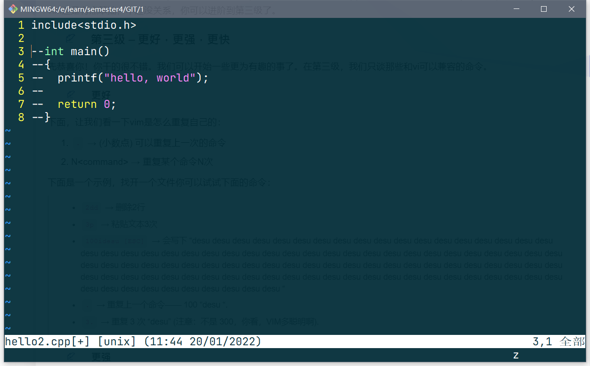

## 一、Vim 配置

vim界面打开以后很丑就不提了，关键有很多基本功能没有办法实现，所以需要自己配置，如果是linux系统，那么应该找到 

```
/usr/share/vim/.vimrc
```

如果是windows装完git以后会自动一个vim，此时应该找到

```
Git\etc\vimrc
```

打开这个文件以后，进行以下配置

```
"语法高亮"
syntax on
"显示行号"
set number
"设置tab缩进"
set tabstop=4
set softtabstop=4
set shiftwidth=4
"自动缩颈"
set autoindent
set cindent
"显示匹配括号"
set showmatch
set matchtime=1
"设置没有备份文件"
set nobackup
set noswapfile
"括号自动补全"
:inoremap ( ()<ESC>i
:inoremap ) <c-r>=ClosePair(')')<CR>
:inoremap { {<CR>}<ESC>O
:inoremap } <c-r>=ClosePair('}')<CR>
:inoremap [ []<ESC>i
:inoremap ] <c-r>=ClosePair(']')<CR>
:inoremap " ""<ESC>i
:inoremap ' ''<ESC>i
function! ClosePair(char)
	if getline('.')[col('.') - 1] == a:char
		return "\<Right>"
	else
		return a:char
	endif
endfunction
filetype plugin indent on 
```

---


## 二、Vim 操作

### 2.1 总论

个人感觉Vim太神奇了，但是我确实使用的不太舒服，虽然可以完全脱离鼠标办公了，但是功能键和编辑模式的完全分离，还是让人感觉到很不舒服。而且因为我现在也不需要那么多的功能，所以很多功能用的是真的很不习惯。所以只是在这里简单记录一下。

Vim 会涉及到很多个模式，但是我个人感觉模式之间并不是完全平等的关系，显然最开始进入的 Normal 模式为主模式，而其他模式就类似于卧房之于客厅，是从属关系，我们对文本的编辑主要依赖 Normal 模式。这也是我用不习惯 Vim 的原因。因为我没有很多的功能需求，我敲代码一个一个敲，用到的功能无非是复制粘贴，就好像有人买了台游戏机，却不打游戏一样，纯属浪费。所以为了符合 Vim的设计思想，我不打算一个模式一个模式的介绍，而是以功能分类进行介绍

| 模式    | 功能                                                         |
| ------- | ------------------------------------------------------------ |
| Normal  | 就是初始模式，在这个模式下，所有的按键都是功能按键           |
| Command | 命令行模式，输入“：”后进入，在这个模式下可以输入各种命令，一般是文件操作或者是查找替换 |
| Insert  | 编辑模式，输入“a，i，o”进入，就是所谓的编辑模式，可以码字的那种 |
| Visual  | 可视化模式，输入“v”进入，就是可以选中一些字符，类似于复制粘贴之前要选中目标的操作 |

此外，在Normal模式下输入的功能键，会在右下角显示，我一开始一直以为没有显示（图里输入了z）



### 2.2 进入编辑模式

- 朴素进入：按 a 或者 i 都可进入，按a是在光标后插入，按i是在光标前插入，所以应该按a
- 另起一行以后进入：按 o 进入

### 2.3 文件操作

这些操作都需要进入命令行模式后进行

- `w`：保存
- `q`：退出
- `wq`：保存后退出，但是因为还需要打一个：，所以不太方便，可以在Normal模式下用ZZ代替
- `saveas + filename`：另存为

### 2.4 撤销 / 恢复

- `u`：撤销
- `Ctrl + r`：恢复

### 2.5 选中

选中操作都需要在可视化模式下进行，通过光标的移动进行配合

- `o`：重新定位起始光标

有三种进入块操作的方式：

| 按键       | 意义                                                     |
| ---------- | -------------------------------------------------------- |
| `v`        | 字符选择，会将光标经过的地方反白选择                     |
| `V`        | 行选择，会将光标经过的行反白选择                         |
| `Ctrl + v` | 可视区块，可以用矩形的方式选择数据（就像鼠标的框选一样） |

### 2.6 复制/粘贴/删除

- `x`：删除（准确是**剪切**）光标后的一个字符
- `y`：复制选中的内容（包括可视块中的数据）
- `yy`：复制当前行
- `行数 + yy`：从当前行开始赋值指定的行数
- `y + 光标移动操作`：复制当前行到光标移动行中的所有内容，比如说 `ygg` 就是赋值从当前行到文首的内容
- `dd`：删除（准确是**剪切**）一行，下一行会自动上移
- `行数 + dd`：删除光标向下的 n 行
- `d + 光标移动操作`：删除当前行到光标移动行中的所有内容，比如说 `d10G` 就是删除从当前行到第十行所有内容
- `p`：粘贴，内容可以来自复制，也可以来自剪切

从2.5、2.6两节可以看出，稍微复杂一点，功能强大一点的命令都是与**光标的移动**结合在一起的，可以说光标的移动构成了指令的**执行范围**。还有一种**功能拓展方法**就是 `n + 操作`表示一种重复操作。

### 2.7 查找替换

- 替换：
  - `:s/要替换的关键词/替换后的关键词`：替换光标所在行第一个
  - `:s/要替换的关键词/替换后的关键词/g`：替换光标所在行所有
  - `:%s/要替换的关键词/替换后的关键词`：替换全行第一个
  - `:%s/要替换的关键词/替换后的关键词/g`：替换全行所有
- 查找：直接在命令模式下输入 **/查找内容** 即可
- `n`：表示向下再次执行查找内容
- `N`：表示向上再次执行查找内容

### 2.8 光标移动

- `0`：将光标移动到行首
- `gg`：是跳转回开头（感觉多余记这个，用 `1G` 代替挺好的）
- `G`（**命令是区分大小写的**）：移到最后一行
- `行号+G`：移到指定行
- `w`：按单词向后移动光标
- `b`：按单词向前移动光标

### 2.9 多文件编辑

- `vim filename1 filename2 …… filenamen` :在bash中输入这种命令，就可以同时打开多个文件

- `n`：可用于向下切换文件。
- `N`：可用于向上切换文件。
- `:files`：提供一个打开的文件目录

### 2.10 多窗口

- `:sp filename`：打开一个内容是filename的文件
- 先按`Ctrl + w `可以松手按 `up`：移动到下方窗口
- 先按`Ctrl + w` 可以松手按` down`：移动到上方窗口

