## 一、总论

### 1.1 软硬件分工

首先先明确，异常处理流是一个需要软硬件协作的流程。如果仅仅掌握了计组的知识，是没有办法对于异常处理流有一个很好的认识的。但是如果掌握了操作系统知识，而没有掌握计组知识，则不会有任何的实现负担。这是因为在 CPU 层面已经将异常处理流的硬件部分封装起来了（整个封装过程就是 P7，可以看到 P7 还是很难的），我们只要了解一下 CPU 提供给操作系统的接口，就可以利用这些接口提供的信息和功能完成异常处理流的软件部分。这是完全没有问题的。

我们有如下示意图：

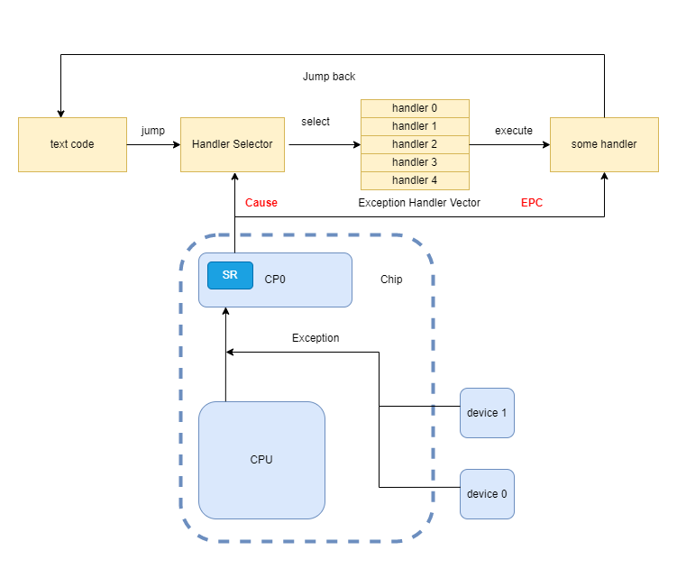

其中蓝色的是硬件部分（也就是计组要解决的问题），黄色的是软件部分（也就是操作系统），其中红色的部分，就是两个部分的接口。

这幅图最重要的就是搞懂那两个接口寄存器的意义。Cause 为选择哪一个异常处理函数提供了决策的依据，EPC 为有朝一日返回这个进程接着执行提供了支持（注意异常处理完成后不一定会返回异常发生时所在的进程，比如由于时钟中断导致的进程切换）。

### 1.2 明确概念

这个问题其实在计组实践的时候，就已经出现了。因为我们要处理的 “意外情况” 特别的多，所以我们需要一些名词来描述概念，但是往往会有一些因为名词冲突，而导致概念混淆的情况。所以在开始文章之前，还是先介绍一下概念名词，这些名词只在这篇文章中有效。另外声明，这里的概念定义跟我在计组P7博客里的概念是冲突的（只能说年少无知太轻狂）。

概念有如下关系

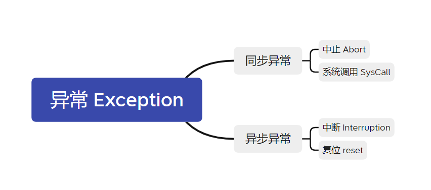

所有的“控制流异常情况的原因”统称为“异常”，同步异常指的是处理器执行某条指令而导致的异常，异步异常指的是异常触发的原因与处理器当前正在执行的指令无关的异常。更低一级的概念并不能保证正确性。

### 1.3 异常处理流程

这里给出异常处理的**一般**流程


---


## 二、硬件部分

### 2.1 计组 CP0 结构

这里给出上个学期我实现 P7 的时候的源码，但是需要注意的是计组实现的 CPU 架构好像是 Mips32，与操作系统用的 R3000 并不相同，CP0 的结构有一些细节上的差异。

这是 CP0 的实现。

```verilog
`timescale 1ns / 1ps
`define IM SR[15:10]
`define EXL SR[1]
`define IE SR[0]
`define BD Cause[31]
`define IP Cause[15:10]
`define ExcCode Cause[6:2]

module CP0
	(
		input clk,
		input reset,
		input en,
		input [4:0] CP0Add,
		input [31:0] CP0In,
		output [31:0] CP0Out,
		input [31:0] VPC,
		input BDIn,
		input [4:0] ExcCodeIn,
		input [5:0] HWInt,
		input EXLClr,
		output [31:0] EPCOut,
		output Req,
		output tbReq
	);
	
	reg [31:0] SR, Cause, EPC, PrID;
	
	//为了测试约定
	assign tbReq = (HWInt[2] & SR[12] & (~`EXL) & `IE);
	
	wire IntReq = (|(HWInt & `IM)) & (~`EXL) & `IE;
	//无论有没有全局中断使能，都要响应异常
	wire ExcReq = (|ExcCodeIn) & (~`EXL);
	assign Req = IntReq | ExcReq;
	//如果发生了中断，就要给更新 EPC，否则保持原值
	wire [31:0] nextEPC = (Req)? ((BDIn)? VPC - 4 : VPC) :
								 EPC;							 
	
	assign EPCOut = EPC;
	
	assign CP0Out = (CP0Add == 5'd12)? SR :
					(CP0Add == 5'd13)? Cause : 
					(CP0Add == 5'd14)? EPC :
					(CP0Add == 5'd15)? PrID :
					0;
	
	initial begin
		SR <= 0;
		Cause <= 0;
		EPC <= 0;
		PrID <= 32'hDEAD_C0DE;
	end
	
	always @(posedge clk) begin
		if(reset) begin
			SR <= 0;
			Cause <= 0;
			EPC <= 0;
			PrID <= 32'hDEAD_C0DE;		
		end
		else begin
			if(EXLClr) `EXL <= 0;
			
			if(Req) begin //相当于Req来临的时候，是没有办法用mt来写东西的
				`ExcCode <= IntReq ? 5'b0 : ExcCodeIn;
				`EXL <= 1;
				EPC <= nextEPC;
				`BD <= BDIn;
			end
			else if(en) begin
				if(CP0Add == 12) SR <= CP0In;
				//if(CP0Add == 13) Cause <= CP0In;
				if(CP0Add == 14) EPC <= CP0In;
				//if(CP0Add == 15) PrID <= CP0In;
			end
			`IP <= HWInt;
		end
	end
	
	
endmodule 
```

这是 CP0 的布线

```verilog
CP0 cp0
(
    .clk(clk),
    .reset(reset),
    .en(CP0En),
    .CP0Add(M_rd),
    .CP0In(M_FWrtOut),
    .CP0Out(M_CP0Out),
    .VPC(M_PC),
    .BDIn(M_BD),
    .ExcCodeIn(M_ExcCode),
    .HWInt(HWInt),
    .EXLClr(EXLClr),
    .EPCOut(M_EPCOut),
    .Req(Req),
    .tbReq(tbReq)
);
```

### 2.2 SR 寄存器

这个寄存不是接口！！！也就是说，这个寄存器不需要给操作系统看到。那么这个寄存器在异常处理方面是干啥的呢（它不止在异常流控制这一个方面发挥作用），其实是**控制异常**的。也就是说，所有的异常，都需要经过和 SR 寄存器某些位的加工处理以后，才可以将生成的数据放在 Cause 中提供给操作系统。

在计组中，表现为这样的形式：

```verilog
`define IM SR[15:10]
`define EXL SR[1]
`define IE SR[0]

wire IntReq = (|(HWInt & `IM)) & (~`EXL) & `IE;
wire ExcReq = (|ExcCodeIn) & (~`EXL);
assign Req = IntReq | ExcReq;
```

可以看到，SR 主要提供中断的掩码 `IM` 和中断使能 `IE` ，异常等级 `EXL` 三个位。之后通过这些位的运算后来确定到底要不要发出异常信号和更新 EPC 之类的一系列处理。重点其实就是**掩码**与**使能**。因为操作系统使用的是 R3000，所以重点介绍 R3000 的结构

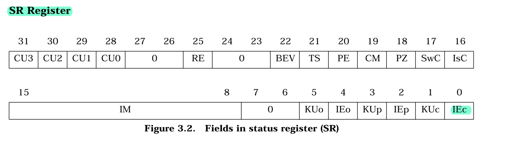

虽然有很多位，而且每一位都很重要，但是其实真正用到的没有几个，首先是 `IM` ，他是中断掩码，也就是说，R3000 有 8 个外部中断源，只有该位置 1 ，对应的外部中断才会被引发异常，否则不会。

然后就是所谓的二重栈结构，这个结构在 `SR[5:0]` ，首先解释一下，`KU` 如果置 1，就说明当前进程处于内核态（ 内核态可以使用的指令更多，访问的地址空间更大），`IE` 如果置 1，这说明当前允许异常发生（注意是异常，而不是中断，范围扩大了）。然后在解释一下下标，`o` 是 old 的意思，`p` 是 previous 的意思，`c` 是 current 的意思。

然后介绍一下这个所谓的二重三级栈，其实就是当发生异常的时候，previous 的内容会被拷贝到 old 中，current 的内容会被拷贝到 previous 中。然后当 `eret` 指令一下达，previous 的内容会被拷贝到 current 中，old 中内容会被拷贝到 previous 中。

关于这个神奇的栈设置，还是妄谈几句。R3000 应该是不希望允许嵌套中断的，所以当处理中断的时候，先把 IEc 设置为 0 ，这样就不允许其他的中断在处理这个中断的时候发生了，屏蔽了其他中断。但是似乎不允许嵌套中断，CPU 功能又实现不了了，如果缺页中断中又有一个缺页中断，那么就崩了（具体我不知道，下面截图），所以为了支持嵌套中断，所以必须有所记录。就跟我们用栈来支持函数嵌套一样，我们同样需要栈结构来支持，`EPC` 似乎自己找地方去了，然后 `SR` 这两位就是用这个栈结构。


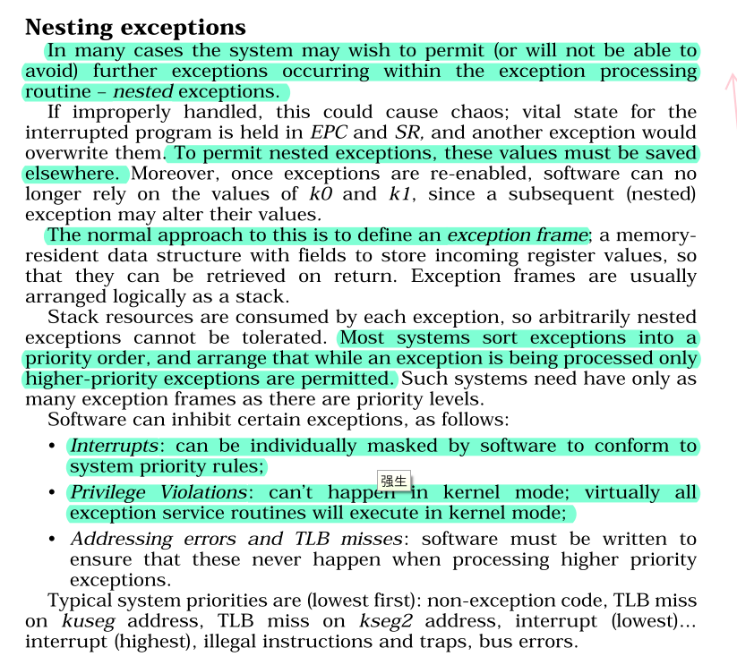

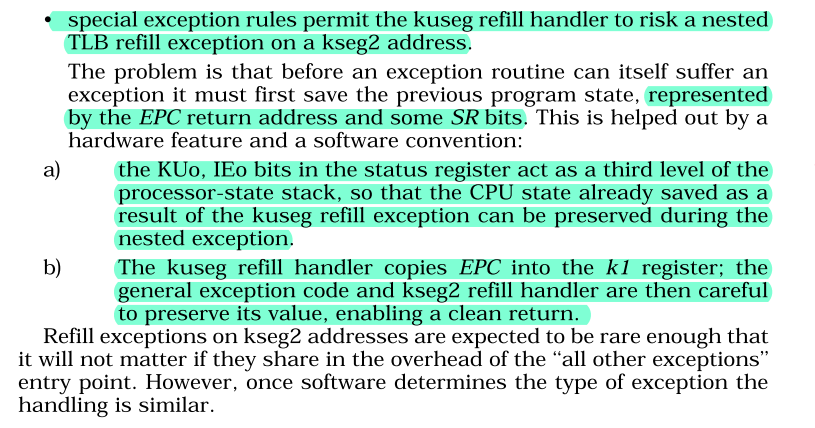

### 2.3 Cause 寄存器

 Cause 寄存器里的内容由 CP0 生成，然后操作系统会访问这个值，我们在计组中，有

```verilog
`define BD Cause[31]
`define IP Cause[15:10]
`define ExcCode Cause[6:2]

if(Req) begin //相当于Req来临的时候，是没有办法用mt来写东西的
    `ExcCode <= IntReq ? 5'b0 : ExcCodeIn;
    `EXL <= 1;
    EPC <= nextEPC;
    `BD <= BDIn;
end
`IP <= HWInt;
```

可以看到，Cause 里比较重要的一个域就是 `ExcCode` 用来记录到底是哪一种异常。这样操作系统才可以根据信息来选择不同的异常处理函数去处理。

对于R3000架构来说，Cause 寄存器如图：

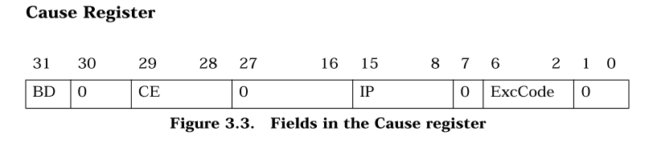

BD 这个域同样是接口，如果异常指令是一个分支延迟槽指令，那么这位就会被置 1。这是因为当异常指令为延迟槽指令的时候，`EPC` 的值会变成延迟槽指令的前一条指令（为了程序的正常执行）。我们在软件侧可以利用 `BD` 来获得真正发生异常的指令。

IP 是 Interrupt pending 的意思，他的意思结合代码来看就很容易，它记录的是现在发生的中断，但是这些中断不一定被响应，还有看 IM 的设置。IP 只是一个单纯的记录者

```verilog
`IP <= HWInt;
```

最重要的是 ExcCode，异常码，CPU 会根据异常的不同，将这个域设置成不同的值，操作系统通过读取这里的值，就可以获得这次异常的信息，R3000 常用的异常码如下：

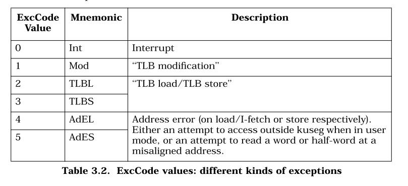

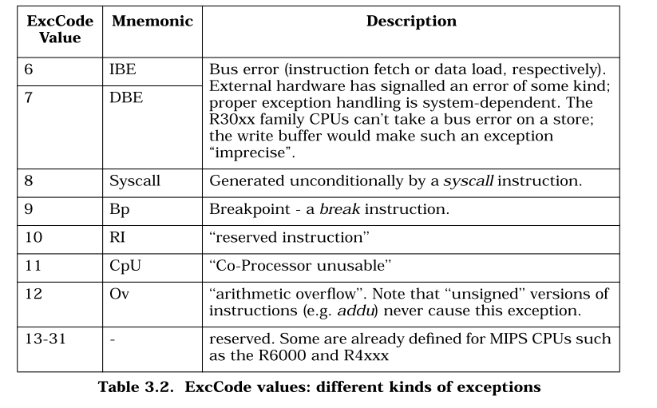

### 2.4 EPC 寄存器

计组 CP0 跟 R3000 这个是一样的，可以看代码

```verilog
wire [31:0] nextEPC = (Req)? ((BDIn)? VPC - 4 : VPC) :
								 EPC;		
```

就是保存一下当前的 PC，然后方便返回。

---


## 三、软件总论

### 3.1 文章结构

本文会分析先分析异常处理的共性，然后会每一章介绍一个异常的具体流程。

因为异常是一个很宏大的主题，期间逻辑错综复杂，所以我并没有能力把他们组织成一个逻辑完备的整体，所以可能有的时候只能放源码解读，而不是有理有据的总结。这个摆烂的部分可以看做是之前博文《MOS源码解读》的 lab3 和 lab4 部分。

我们要讲的异常处理函数有如下几个：

| 异常处理函数    | 编号 | 解释                                                         |
| --------------- | ---- | ------------------------------------------------------------ |
| handle_reserved | 无   | 没有内容，用于初始化异常分发矩阵                             |
| handle_int      | 0    | 用于处理时钟中断，主要是换进程调度                           |
| handle_mod      | 1    | 当尝试写一个只读的虚拟页面的时候会触发，主要会进行一个写时复制处理 |
| handle_tlb      | 2    | 当 TLB 缺失的时候会触发，会把需要的页表项调入 TLB            |
| handle_tlb      | 3    | 似乎与上面相同                                               |
| handle_sys      | 8    | 当使用 `syscall` 指令的时候调用，会根据系统调用号去决定异常处理的功能 |

### 3.2 直观理解

异常处理真的是很复杂，但是感觉第一次提出异常处理流并且利用它构建了各个抽象概念，比如进程的时候，简直就像在欣赏一件艺术品一样，实在是感到十分震撼。

我个人觉得异常处理跟**进程抽象**联系还是很紧密的，或者说是内核态用户态转换是很紧密的。异常处理的本质是**异常处理流**。换句话说，就是程序计数器的变化，执行指令的变化。通过这种异常处理，我们可以实现在各个功能的实现间的跳转。我们把一部分功能交给操作系统去实现，而让用户进程只考虑跟自己有关的事情。

落实到比较具体的，就是在异常处理的时候 PC 会怎么变化，为了恢复现场会怎么做，我们需要新的栈空间吗？之类的问题，是我们要关注的重点。

---


## 四、异常的共性

### 4.1 普遍流程

在 `lib/genex.S` 中有一个异常处理函数的构建宏，它总结了一些异常处理函数的普遍规律，我们可以通过这个函数来看一下异常的共性

```assembly
.macro	BUILD_HANDLER exception handler clear
	.align	5
	NESTED(handle_\exception, TF_SIZE, sp)  
	nop
	SAVE_ALL				
	__build_clear_\clear
	.set	at
	move	a0, sp
	jal		\handler
	nop
	j		ret_from_exception
	nop
	END(handle_\exception)
.endm
```

这里面虽然函数我都没有解释，但是从名字可以看出来，里面大概是先通过 `SAVE_ALL` 来保存现场，然后通过`_build_clear_\cli` 来禁用中断，然后会直接到达一个真正的 `handler`，这是各个异常处理的差异性体现，这个 handler 会接受一个参数，我们回头去讲。最后会通过 `ret_from_exception` 进行一个异常的返回。

需要强调的是，并不是所有异常处理都用了这个统一的模板，用这个模板的只有下面这几个

```assembly
BUILD_HANDLER 	reserved 		do_reserved 			cli
BUILD_HANDLER 	tlb				do_refill				cli
BUILD_HANDLER 	mod				page_fault_handler 		cli
```

但是其他的，比如说 `handle_int` 和 `handle_sys` 并没有使用这个模板处理。但是更需要强调的是，即使没有使用这个模板，但是他们的流程基本上也与模板类似，比如 `handle_int` 中就有如下代码片段，可以看出与模板是很类似的。

```assembly
SAVE_ALL
CLI
j			sched_yield
j			ret_from_exception
```

但是显然光看函数和宏的名字是没有办法来了解异常处理流程的，这里先简单介绍一下我们大致有干什么，然后再结合每一章进行介绍：

- **选择内核栈**：这是因为异常一定是由一个原来的进程转换到操作系统进程的，那么之前使用的栈肯定是不能用了（有可能异常的原因就是栈对应的虚拟页面 TLB 缺失），我们需要一个新的栈来保存上下文，完成异常处理函数的各个子函数的调用。
- **在内核栈上保存上下文**：这里保存的上下文就是指通用寄存器、乘除寄存器和一些协处理器的寄存器（在 MOS 中这些东西被打包成 `Trapframe`  结构体），这些寄存器的值都来自发生异常的用户进程。我们要保存他们是因为我们的异常处理函数可能会覆盖这些值，而我们又需要这些值。主要是因为我们异常处理的时候有时候会用到他们（通过上下文指定政策），而我们在结束处理后还需要将其恢复（但是并不一定完全不变）。
- **禁用中断**：MOS 并不支持嵌套中断，所以进入异常后就会把中断使能端关掉。
- **进行异常处理**：这个根据具体情况分析，是特异性的体现。
- **恢复栈指针**：因为之前使用了内核栈，所以我们现在要进行一个恢复，不过其实可以看做恢复上下文的一部分。
- **恢复上下文**：将内核栈上保存的用户进程上下文恢复。
- **跳转回用户进程**：将 `PC` 设置为 `EPC` ，跳转回用户进程。

下面就会结合这个流程来进行进行介绍。

### 4.2 选择内核栈

#### 4.2.1 内核中的栈

选择内核栈是通过重置栈指针实现的。为什么要重置栈指针？这是因为此时计算机刚刚处于异常后的状态，虽然 PC 已经被纠正到了 `0x80000080` 。但是栈指针还是用户进程的栈指针，这显然是不能正常发挥作用的，我们需要将栈指针设置成一个内核栈指针。

在内核上我们有三个栈（先别纠结为啥仨栈），一个栈的栈底是 `0x8040_0000` 一个栈的栈底是 `KERNEL_SP` （在 `settimer` 中设置 ）另一个栈的栈底是 `TIMESTACK`。他们在内存中的分布是这样的

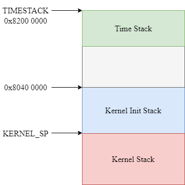

我们说这几个栈的作用是不一样的，`Kernel Init Stack` 是初始化操作系统的时候用到的栈，之后就不会再使用了，因为这个栈上没法减少，也就没法重复利用。

`Kernel Stack` 是在原来的栈上新增出的栈，这个栈的栈底是变量 `KERNEL_SP` ，这个变量在 `set_timer` 这个函数中设置

```assembly
sw	    sp, 			KERNEL_SP
```

他将这个时刻的栈指针存储在一个叫做 `KERNEL_SP` 的变量中，这个变量就定义在 `env_asm.S` 中，就一个字大小。

为什么要存储这个栈指针，是因为当发生异常的时候，不仅 PC 需要从用户进程更新到操作系统的指令流中，同时栈指针也需要调整到操作系统的栈，这就需要我们确定一下异常之后操作系统的栈指针应该在那里，那么就应该在这里。这是因为 `set_timer` 被 `klock_init` 调用，而 `mips_init` 的最后一个函数调用就是 `klock_init` 。之后会执行一个死循环，直到被时钟中断改变。所以此时的栈结构是这样的：

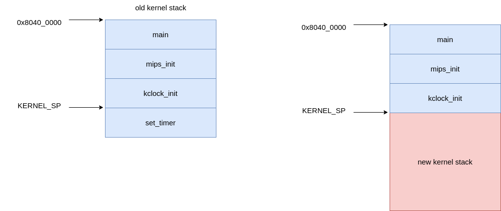

第三个栈是 TIMESTACK，这个栈主要是处理时钟中断的时候需要使用。这里讨论一下为啥内核需要两个栈（用于异常处理），我初步的结论（与叶哥哥和郭哥哥讨论过后）觉得一个就够了，没必要用两个。姜姐姐提供了一种说法，认为这两种栈的设计可能是一个未完成的设计，这个设计可能是为了支持在进行其他异常处理的时候也可以响应时钟中断，但是没有完成这个设计，所以现在的 MOS 两个栈的设计看上去就是很冗余。

#### 4.2.2 get_sp

这个宏就是用来选择栈的，我们来看一下其功能

```c
.macro get_sp
	mfc0	k1, CP0_CAUSE
    // 0x107c = 0001_0000_0111_1100, which means the exccode and the time irq
	andi	k1, 0x107C
	xori	k1, 0x1000
    // if it's not a time interupt,then jump
	bnez	k1, 1f
	nop
    // 0x82000000 is the TIMESTACK
	li	    sp, 0x82000000
	j	2f
	nop
1:
	// 当 sp 已经为内核栈的时候，不变
	bltz	sp, 2f	
	nop
	lw	    sp, KERNEL_SP
	nop

2:	nop

.endm
```

总之这一套下来，有一个固定的结论：

- 如果发生的为时钟中断，那么 sp 会被设置为 `TIMESTACK`
- 如果是其他异常，那么 sp 会被设置为 `KERNEL_SP`。
- 如果栈指针已经被设置为内核栈指针了（上面俩个中的一个），那么就不变，这个设计是为了支持嵌套异常。

再看 `SAVE_ALL` 中的代码就很清楚了

```assembly
move	k0,sp
get_sp
move	k1,sp
subu	sp,k1,TF_SIZE
sw	    k0,TF_REG29(sp)
```

`sp` 原本的值被保留了，而 `sp` 现在的值，作为了保存的基地址。

换句话说，当异常为时钟中断的时候，我们将进程的上下文保存在 `TIMESTACK` ，而当其他异常的时候，我们将进程的上下文保存在 `KERNEL_SP`。然后我们会继续使用这附近的栈作为我们的内核栈空间。

### 4.3 保存上下文

主要通过 `SAVEALL` 中的部分实现，因为还有一部分是调用 `get_sp` 实现栈选择，对于 `SAVE_ALL` 之后的栈的结构，大概就是这样的

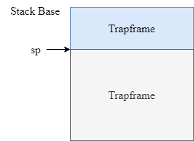

此时 `sp` 指向 `Trapframe` 的底部。之所以要强调这一点，是因为在这之后，有这个语句（在build里）

```assembly
move	    a0,         sp
```

这就表示如果是 C 函数，那么是可以完全利用这里面的上下文的，比如说

```c
void page_fault_handler(struct Trapframe *tf);
```

但是这个用法太低级了，lab3-2 的考试题目可以用 C 来写，用法很高级，而且比汇编简单多了。我本来已经总结了，但是找不到了，摆烂放一张 banana 的图就好了（她没处理延迟槽）。可以看到可以利用这个指针获得基本上所有的信息。

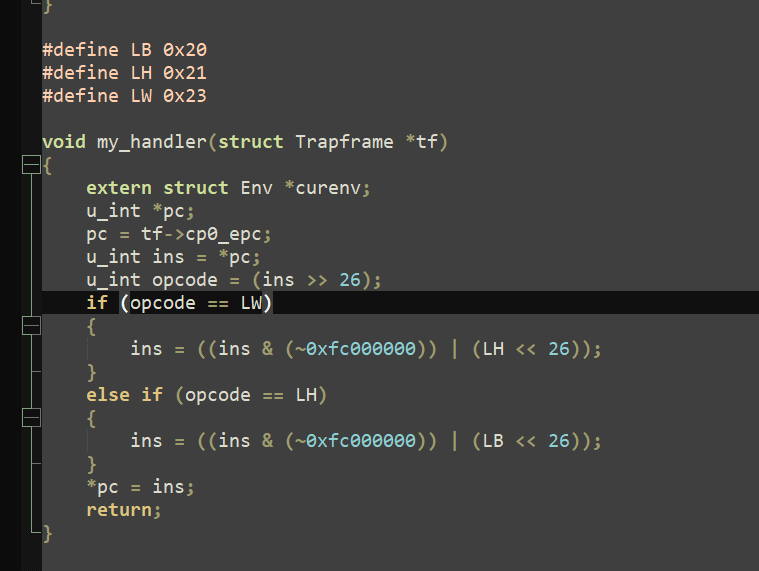

### 4.4 禁止中断

主要通过 `CLI` 进行设置，具体的代码之前博客里有。但是这件事情有待商榷，因为据叶哥哥说，异常处理的禁用是在硬件层次上实现的，而 R3000 并没有实现这个功能（或者说实现了支持嵌套异常的功能），在软件方面是没有办法禁止中断的，我就不细讨论了。

### 4.5 进行异常处理

这个每个都不一样，具体的回头再说。

### 4.6 从异常返回

#### 4.6.1 ret_from_exception

这个函数功能是从栈上恢复寄存器，并且跳转用户进程。

```assembly
FEXPORT(ret_from_exception)
	.set noat
	.set noreorder
	RESTORE_SOME
	.set at
	lw		k0,			TF_EPC(sp)				 
	lw		sp,			TF_REG29(sp) /* Deallocate stack */  
	nop
	jr		k0								 
	rfe	
```

恢复寄存器采用的是 `RESTORE_SOME`

```assembly
RESTORE_SOME
```

然后恢复栈指针和 PC 用的是下面的操作

```assembly
lw		k0,			TF_EPC(sp)				 
lw		sp,			TF_REG29(sp) /* Deallocate stack */  
nop
jr		k0								 
rfe	
```

#### 4.6.2 restore_some

这个宏可以分为两个部分，一个是设置 STATUS 寄存器的状态，一个是恢复各种通用寄存器。

对于第一点，没有全部看懂，这只知道它应该是先开启了异常功能。（因为 MOS 不太允许嵌套异常，所以会在进入中断后关闭异常）。

```assembly
// set the STATUS normal
mfc0	t0,         CP0_STATUS
ori	    t0,         0x3
xori	t0,         0x3
mtc0	t0,         CP0_STATUS
// I don't know exactly what it had done 
lw	    v0,         TF_STATUS(sp)
li	    v1,         0xff00 
and	    t0,         v1 
nor	    v1,         $0,             v1 
and	    v0,         v1 
or		v0, 		t0 
mtc0	v0,			CP0_STATUS 
```

然后进行寄存器的恢复，利用的依然是栈指针，这里需要注意的是，为什么可以利用栈指针，这是因为当异常处理完事后，栈指针就会回到当时 SAVE_ALL 之后的位置，所以地址向上查找就可以恢复现场

```assembly
lw		v1,			TF_LO(sp)
mtlo	v1
lw		v0,			TF_HI(sp)
lw		v1,			TF_EPC(sp)
mthi	v0
mtc0	v1,CP0_EPC
lw	$31,TF_REG31(sp)
lw	$30,TF_REG30(sp)
lw	$28,TF_REG28(sp)
lw	$25,TF_REG25(sp)
lw	$24,TF_REG24(sp)
lw	$23,TF_REG23(sp)
lw	$22,TF_REG22(sp)
lw	$21,TF_REG21(sp)
lw	$20,TF_REG20(sp)
lw	$19,TF_REG19(sp)
lw	$18,TF_REG18(sp)
lw	$17,TF_REG17(sp)
lw	$16,TF_REG16(sp)
lw	$15,TF_REG15(sp)
lw	$14,TF_REG14(sp)
lw	$13,TF_REG13(sp)
lw	$12,TF_REG12(sp)
lw	$11,TF_REG11(sp)
lw	$10,TF_REG10(sp)
lw	$9,TF_REG9(sp)
lw	$8,TF_REG8(sp)
lw	$7,TF_REG7(sp)
lw	$6,TF_REG6(sp)
lw	$5,TF_REG5(sp)
lw	$4,TF_REG4(sp)
lw	$3,TF_REG3(sp)
lw	$2,TF_REG2(sp)
lw	$1,TF_REG1(sp)
```

在这里没有恢复的寄存器是 PC 和 栈指针，二者的恢复是在其他函数里实现的（比如 `ret_from_exception` ） 这可能是因为设计的原因。

### 4.7 异常的分发

当发生异常的时候，就会自动跳转到一个固定的物理地址，然后执行一段固定的程序，这个程序就叫做异常分发程序，他根据 Cause 寄存器中的值决定到底要调用哪一个异常处理程序。

首先我们需要把程序链接到固定的位置，因此要修改链接脚本

```
. = 0x80000080;
.except_vec3 : {
    *(.text.exc_vec3)
}
```

然后我们来看这段代码

```assembly
.section .text.exc_vec3
NESTED(except_vec3, 0, sp)
    .set noat 
    .set noreorder
1:
    mfc0 	k1,		CP0_CAUSE
    la 		k0,		exception_handlers
    andi 	k1,		0x7c
    addu 	k0,		k1
    lw 		k0,		(k0)
    nop
    jr k0
    nop
END(except_vec3)
.set at
```

首先它指定了输出段的名称

```assembly
.section .text.exc_vec3
```

然后可以看到他用多个语句去分析 Cause，Cause 的具体设置，我异常处理那篇博客写了

```assembly
mfc0 	k1,		CP0_CAUSE
andi 	k1,		0x7c
```

然后利用异常码作为索引去跳转

```assembly
la 		k0,		exception_handlers
addu 	k0,		k1
lw 		k0,		(k0)
nop
jr 		k0
```

---


## 五、TLB 缺失中断

### 5.1 总体概览

这种异常会发生在 TLB 缺失的时候，流程图如下：

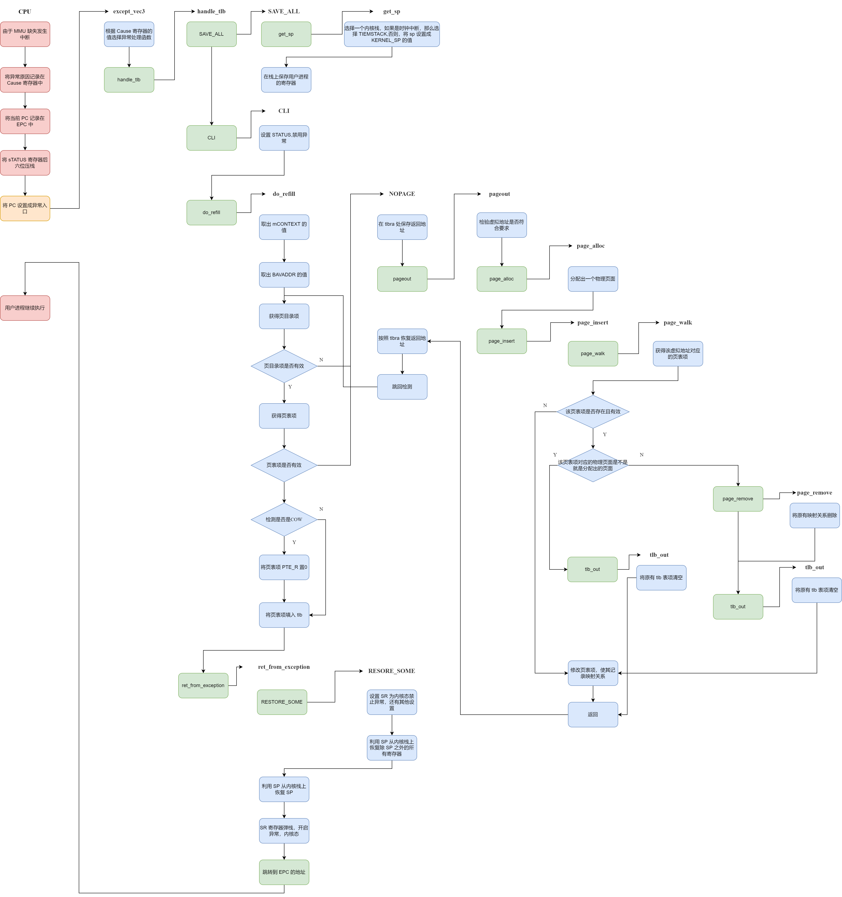


### 5.2 TLB 结构

首先我们需要弄懂 tlb 的结构，计组认为的 TLB，是长这样的：

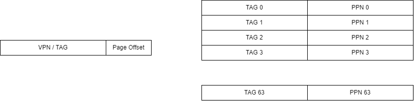

也就是说，TLB 是一个全相连的 cache，既然是全相连，就不由 index 段了。我们用虚拟地址的前 22 位作为 TAG，并行的比较 64 个TLB 的 line，如果 TAG 相等，就说明找到了，反之，这说明没有找到。

不过这个模型还是有些粗糙的，很多细节并没有说明白。

在操作系统指导书里提到，tlb 构建了一个映射关系，我简化一下，就是 $VPN\space \rightarrow\space PPN$ 。当然这是对的了，但是这种说法我就弄成了每个 VPN 都会对应一个 PPN，但是其实这种映射关系只有 64 对。而且叫映射似乎就是一下就射过去了，而不是一个并行的比较过程。

其次就是，我们没有了解具体硬件发生了啥，比如 VPN 是怎样被检索的，被检索到的 PPN 放到了哪里，tlb 缺失以后具体怎么填补。都是没有的。这其实跟协处理器有很大关系。

在了解协处理器之前，我们先来看一下 tlb 的表项，他比计组版本要复杂一些，我们以 MOS 中 64MB （也就是共有 $2^{14}$ 页 ）的物理内存为例

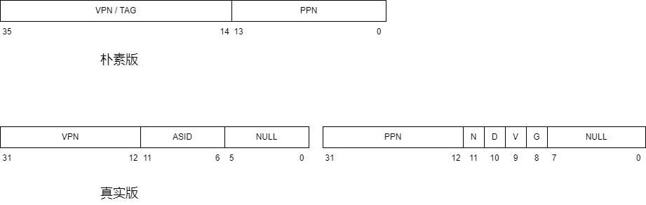

我们来说明一下这些差别：

- 朴素版的 PPN 只有 14 位，是因为物理页框号可以最少用 14 位表示，但是真实版的 PPN 也与 VPN 相同，是 22 位。可能是考虑到不同电脑上内存不同吧，这估计也是 mips_detect_memory() 这个函数的设置。
- 朴素版一个 entry 是 36 位，而真实版一个 entry 是 64 位。这是因为真实版的标志位更多，所以需要的位数就更多
- 朴素版没有 ASID 段，而真实版有。ASID（address space identifier）应该是用于区分不同进程的一个标识符，因为操作系统可以同时运行多个进程，要是不用 ASID 的话，只要进程一切换，那么 TLB 里的所有内容都需要失效（因为进程切换就以为着虚拟地址和物理地址的映射关系切换），而这样是低效的，因为每次 TLB 中的内容清空，就意味着会发生 64 次的冷缺失。
- 朴素版没有物理地址权限标志位（N，D，V，G），而真实版有。这四个标志位的解释见下表

| 标志位            | 解释                                                         |
| ----------------- | ------------------------------------------------------------ |
| N（Non-cachable） | 当该位置高时，后续的物理地址访存将不通过 cache               |
| D（Dirty）        | 事实上是可写位。当该位置高时，该地址可写；否则任何写操作都将引发 TLB 异常。 |
| V（Valid）        | 如果该位为低，则任何访问该地址的操作都将引发 TLB 异常。      |
| G（Global）       | 如果该位置高，那么允许不同的虚拟地址映射到相同的物理地址，可能类似于进程级别的共享 |

总结起来就是真实版的 tlb 建立了一个这样的映射 $<VPN,ASID>\space\rightarrow\space<PPN,N,D,V,G>$ 。

然后我们来解决下一个问题，就是 tlb 怎么用的问题。这是一个我之前忽略的点，因为其实我对于 tlb 的定位并不清楚，我本以为它就好像是一个 cache，是对于程序员是透明的，我就在编程的时候写虚拟地址，然后就有硬件（MMU）拿着这个地址去问 tlb，tb再做出相关反应，这一切都是我不需要了解的，但是实际上 tlb 的各种操作，都是需要软件协作的。之所以有这个错误认知，是因为似乎在 X86 架构下确实是由硬件干的，但是由于我们的 MIPS 架构，也就是 RISC 架构，所以似乎交由软件负责效率更高一些。

如果 tlb 是程序员可见的，那么我们必然要管理它，那么我们就需要思考怎样管理它？我们管理它的方式就是设置了专门的寄存器和专门的指令。指令用于读或者写 tlb 中的内容，而寄存器则用于作为 CPU 和 tlb 之间沟通的媒介，就好像我们需要用 hi 和 lo 寄存器与乘除单元沟通一样。这些寄存器，都位于 CP0 中

在协处理器里面与 tlb 有关的寄存器如下表：

| 寄存器  | 编号 | 作用                                                         |
| ------- | ---- | ------------------------------------------------------------ |
| EntryHi | 10   | 保存某个 tlb 表项的高 32 位，任何对 tlb 的读写，都需要通过 EntryHi 和 EntryLo |
| EntryLo | 2    | 保存某个 tlb 表项的低 32 位                                  |
| Index   | 0    | 决定索引号为某个值的 tlb 表项被读或者写                      |
| Random  | 1    | 提供一个随机的索引号用于 tlb 的读写                          |

这里再说一下各个寄存器的域

- EntryHi，EntryLo 的域与 tlb 表项完全相同
- Index 的域：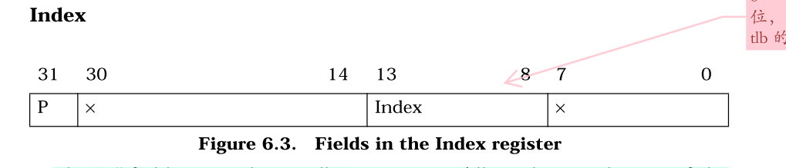
- Random 的域：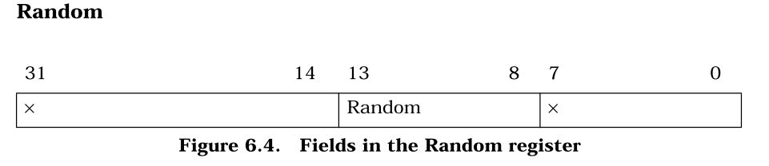

与 tlb 相关的指令

| 指令  | 作用                                                         |
| ----- | ------------------------------------------------------------ |
| tlbr  | 以 Index 寄存器中的值为索引,读出 TLB 中对应的表项到 EntryHi 与 EntryLo。 |
| tlbwi | 以 Index 寄存器中的值为索引,将此时 EntryHi 与 EntryLo 的值写到索引指定的 TLB 表项中。 |
| tlbwr | 将 EntryHi 与 EntryLo 的数据随机写到一个 TLB 表项中（此处使用 Random 寄存器来“随机”指定表项，Random 寄存器本质上是一个不停运行的循环计数器） |
| tlbp  | tlb probe。用于查看 tlb 是否可以转换虚拟地址（即命中与否）根据 EntryHi 中的 Key（包含 VPN 与 ASID），查找 TLB 中与之对应的表项。如果命中，并将表项的索引存入 Index 寄存器。若未找到匹配项，则 Index 最高位被置 1。 |

### 5.3 do_refill

那么当引发异常以后，我们的操作系统干了什么？可以很容易看到哈，找到异常向量组，发现处理这类异常的函数是 `handle_tlb()`，然后再把通用的部分忽略，发现实现功能的是 `do_refill` 这个函数，我们看一下

```assembly
.extern tlbra
.set	noreorder
NESTED(do_refill,0 , sp)
			.extern	mCONTEXT
//this "1" is important
1:			
			lw		k1,			mCONTEXT
			and		k1,			0xfffff000
			mfc0	k0,			CP0_BADVADDR
			srl		k0,			20
			and		k0,			0xfffffffc
			addu	k0,			k1
			lw		k1,			0(k0)
			nop
			
			move	t0,			k1
			and		t0,			0x0200
			beqz	t0,			NOPAGE
			nop
			
			and		k1,			0xfffff000
			mfc0	k0,			CP0_BADVADDR
			srl		k0,			10
			and		k0,			0xfffffffc
			and		k0,			0x00000fff
			addu	k0,			k1
			or		k0,			0x80000000
			lw		k1,			0(k0)
			nop
			
			move	t0,			k1
			and		t0,			0x0200
			beqz	t0,			NOPAGE
			nop
			
			move	k0,			k1
			and		k0,			0x1
			beqz	k0,			NoCOW
			nop
			and		k1,			0xfffffbff
NoCOW:
			mtc0	k1,         CP0_ENTRYLO0
			nop
			tlbwr

			j		2f
			nop
NOPAGE:
			mfc0    a0,         CP0_BADVADDR
			lw		a1,         mCONTEXT
			nop
				
			sw	 	ra,         tlbra
			jal		pageout
			nop
			
			lw		ra,         tlbra
			nop

			j	    1b
2:			nop

			jr		ra
			nop
END(do_refill)
```

首先我们需要找到引发异常的地址的页目录项，这个地址被存在了 `CP0_BADVADDR`。此时的页目录为 `mCONTEXT`。

```assembly
lw		k1,			mCONTEXT			# k1 存着当前用户进程页目录的地址
and		k1,			0xfffff000			# k1 的后12位偏移量被抹去，其实应该本来就没有
mfc0	k0,			CP0_BADVADDR		# k0 存着引发异常的虚拟地址
srl		k0,			20					# 取出 k0 的一级页目录号并 * 4,这是因为一个页目录是 4 字节
and		k0,			0xfffffffc			# 抹去 k0 后 2 位，对齐
addu	k0,			k1					# 页目录基地址加偏移量
lw		k1,			0(k0)				# k1 现在存着对应的页目录项
nop
```

当我们拿到这个页目录项以后，要看这个页目录项是否有效

```assembly
move	t0,			k1					# t0 存着页目录项
and		t0,			0x0200				# 0x200 是 PTE_V，所以进行与运算，如果该位有效，则 t0 非 0
beqz	t0,			NOPAGE				# 如果是 0 ，无效，那么跳转到 NOPAGE
nop
```

我们来看 NOPAGE 的操作

```assembly
NOPAGE:
mfc0    a0,         CP0_BADVADDR		# 把 a0 存成出现异常的虚拟地址
lw		a1,         mCONTEXT			# 把 a1 存成当前页目录地址
nop
sw	 	ra,         tlbra				# 把当前的栈指针保存一下，
										# 这么做是因为又要调用新的函数了，ra 马上被覆盖了。tlbra是块内存指定空间
jal		pageout							# 调用 pageout 这个C函数
nop
```

我们来看一下 pageout

```c
void pageout(int va, int context)
{
	...
	if ((r = page_alloc(&p)) < 0) 
	{
		panic ("page alloc error!");
	}

	p->pp_ref++;

	page_insert((Pde *)context, p, VA2PFN(va), PTE_R);
	printf("pageout:\t@@@___0x%x___@@@  ins a page \n", va);
}
```

可以看出这个函数就是就是分配一个空闲物理页面，然后把对应关系建立起来。这里才是用到页表结构的地方。也就是说，这个函数是体现我们用页表管理映射关系的地方。但是这里还没完，因为这个其实对应的是虚拟页面没有在物理内存中被映射的情况。解决了这个问题，还有把映射好的物理页号填到 TLB 中的工作。

出来这个函数以后，就是一些收尾工作

```assembly
			lw		ra,         tlbra 			# 把栈指针恢复了
			nop		
			j	    1b							# 跳回一开始重新来一遍
2:			nop
			jr		ra							# do_refill 执行完成
			nop
```

那么如果页目录项有效呢？我们会继续执行，检索第二级页表

```assembly
and		k1,			0xfffff000				# k1 原来是页目录项，抹掉后 12 位权限位
mfc0	k0,			CP0_BADVADDR			# k0 存着异常的地址
srl		k0,			10						# 取出 k0 的二级页表号并 * 4,这是因为一个页目录是 4 字节
and		k0,			0xfffffffc				# 抹去 k0 后 2 位，对齐
and		k0,			0x00000fff				# 前面的一级页目录号去掉
addu	k0,			k1						# 基地址加偏移量
or		k0,			0x80000000				# 物理地址转换成虚拟地址
lw		k1,			0(k0)					# 把对应的页表项存到 k1
nop
```

然后接着对页表项进行权限检查

```assembly
move	t0,			k1
and		t0,			0x0200
beqz	t0,			NOPAGE
nop
```

然后下面开展重填操作（如果都处理好了）

```assembly
    move	k0,			k1					# k0 k1 存着万事具备的页表项
    and		k0,			0x1					# 看 k0 的最低位，是 PTE_COW copy on write 
    beqz	k0,			NoCOW				# 如果没有，就不需要特殊处理了
    nop
    and		k1,			0xfffffbff			# 有的话，把 PTE_R 位置 0 ，相当于限制写权限
NoCOW:
    mtc0	k1,         CP0_ENTRYLO0		# 把 k1 装到 EntryLow 中
    nop
    tlbwr									# 随便找个 tlb 项用 EntryLow 覆盖掉
    j		2f
```

综上，能看见页表的是操作系统，而不是硬件。操作系统在 TLB 缺失异常的时候，给 TLB 提供的内容都是经过页表系统管理的，所以 TLB 的所有内容都是经过页表系统管理的，不得不说真是巧妙啊。

### 5.5 COW 的处理

在这里的 `do_refill` 会有一个对于页表项权限位 `PTE_COW` 的判断。但是由于我们还没有介绍写时复制机制，所以这里只需要了解一下，如果一个页面被标记为 `PTW_COW` 了，那么我们就会去掉他的写权限，也就是说，如果这个页面被写了，就会触发 `handle_mod`。那么是不是所有的 `COW` 都会被去掉写权限呢？我们说是的，因为这些页面被标记为 `COW` 的时候要么没在 TLB 中，要么在 TLB 中被失效了（在 page_insert 中），所以这些页面都是被使用都需要先经过 TLB，所以一定会发生缺失，那么就一定会被去掉写权限。

---


## 六、时钟中断

### 6.1 总体概览

这个异常其实虽然叫做时钟中断，但是其实现的功能其实是进程切换。这个流程也是一个极其复杂的流程，所以需要有很好的理解。总体的流程如下：

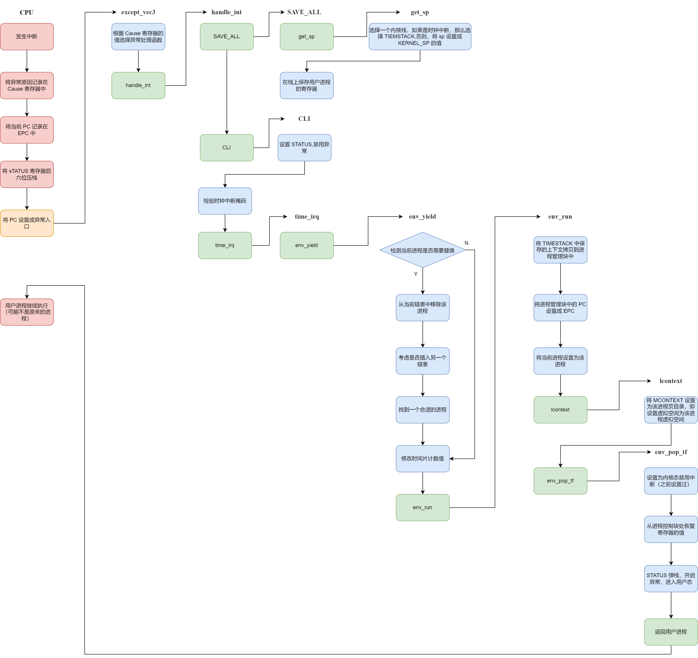

### 6.2 恢复另一个现场

这是跟其他异常最大的区别。就是其他异常都是在操作系统运行完异常处理程序以后，就会返回那个引发异常的进程。但是时钟中断不是，它不会返回发生异常的那个进程，而是重新挑选一个进程去运行。

这就提出了一个很严峻的问题，就是 `TIMESTACK` 不够用了，因为对于其他异常，我们会把用户进程的现场存储在内核栈上，在干完事情以后再从内核栈上把这个现场恢复了。但是对于进程调度，这个就不行了，因为栈上存储的还是原来进程的现场，所以即使在某个函数里把现场调整成了新进程的现场，但是一个 `ret_from_exception` 就又给恢复了。正是因为如此，在流程图中可以看到，这个流程里是没有 `ret_from_exception` 的。不仅如此，我们还需要把被替换掉的进程上下文保存在进程控制块中，这是因为不然等这个进程再次被调用的时候，又怎么知道当时的现场是啥呢？这件事也可以这样理解，就是我们恢复现场的来源变成了不再是从 `TIMESTACK` 上，而是从进程控制块里。

### 6.3 handle_int

先是在栈上保存用户寄存器的值，都是调用 SAVE_ALL。这个函数有两个功能，一个是选择一个内核栈（是 `KERNEL_SP` 还是 `TIMESTACK`）。另一个是在栈上报存寄存器。在时钟中断中，我们选择的是 `TIMESTACK`。

```assembly
SAVE_ALL
```

然后是禁用一切异常，这是通过将 `STATUS` 的最低位清 0 设置的

```assembly
CLI
```

然后就进入了特殊环节，每个异常处理程序具体会变得存在差异，我们首先检验是不是时钟中断，利用的是 `STATUS` 和 `CAUSE` 寄存器的值，这里可能是 `handle_int` 要单独处理的原因，因为时钟中断是一个外部中断，所以在处理的时候要检测**中断掩码**，而其他的很多异常是不需要检测中断掩码的。

```assembly
# 上面所作的一切都是为了检验是不是时钟中断
mfc0		t0, 		CP0_CAUSE
mfc0		t2, 		CP0_STATUS
and			t0, 		t2
andi		t1, 		t0, 		STATUSF_IP4
```

当检测通过之后，我们需要进行真正的处理。首先是要响应时钟的信号（可能是为了让这个信号停止吧，计组中也出现过）

```assembly
sb 			zero, 		0xb5000110
```

然后跳到 C 的调度函数中

```assembly
j			sched_yield
```

最后由恢复了统一的格式，即所有异常都需要恢复用户寄存器的值，并且将控制权重新归还给用户进程，但是这个函数从来不会用到，因为前面跳 `sched_yield` 连 `jal` 都没用。

```assembly
j			ret_from_exception
```

### 6.4 env_yield

这个函数实现的功能是进行进程调度，即选择一个进程去运行。根据函数的名字，其实是当前进程进行一次谦让，然后如果谦让成功就会挑选另一个进程去运行，这大概就是调度方式。

这个函数还是一个非常困难的函数的，首先我们需要知道一些 C 的语法知识。对于一个静态局部变量，只会初始化一次，并且其值不会在函数外部发生变化，所以这三个数只有在第一次执行 `env_yield` 的时候是这三个值，之后执行的时候不会赋值。

```c
static int count = 0; 			// remaining time slices of current env
static int point = 0; 			// current env_sched_list index
static struct Env *e = NULL;	// the current env
```

`count` 表示当前进程还剩多少个时间片，`point` 表示当前用的是哪一个调度链表，`e` 是当前进程，那么为啥不用 `curenv` 。我觉得是因为 `e` 在这个函数里还有 “遍历” 的功能，而且在其他函数里还设置了这个，所以实在是没必要。

我们首先要明确要挑一个进程的条件，有三个：

- 当前的时间片为0
- 第一次调度，要挑一个
- 当前进程的状态不再是可运行的

对应了下面的三个条件

```c
if (count == 0 || e == NULL || e->env_status != ENV_RUNNABLE)
```

这里提一嘴 MOS 中的三个状态，`ENV_RUNNABLE` 对应的是当前运行和就绪的进程，`ENV_NOT_RUNNABLE` 指的是被阻塞的进程，即缺少一定条件的进程，`ENV_FREE` 指的是空闲的进程，它们应该被插入到 `free_list` 中。

我们首先要把这个要被替换掉的进程从当前的队列中移除掉，然后根据它的状态考虑要不要把他插入到另一个队列的队尾

```c
if (e != NULL)
{
    LIST_REMOVE(e, env_sched_link);
    if (e->env_status != ENV_FREE)
    {
        LIST_INSERT_TAIL(&env_sched_list[1 - point], e, env_sched_link);
    }
}
```

然后考虑挑出下一个要运行的进程，方法是遍历链表

```c
 while (1)
 {
     while (LIST_EMPTY(&env_sched_list[point]))
         point = 1 - point;
     e = LIST_FIRST(&env_sched_list[point]);
     if (e->env_status == ENV_FREE)
         LIST_REMOVE(e, env_sched_link);
     else if (e->env_status == ENV_NOT_RUNNABLE)
     {
         LIST_REMOVE(e, env_sched_link);
         LIST_INSERT_TAIL(&env_sched_list[1 - point], e, env_sched_link);
     }
     else
     {
         count = e->env_pri;
         break;
     }
 }
```

挑出后就可以运行了

```c
count--;
e->env_runs++;
env_run(e);
```

这里有个细节是无论换不换进程，都会进行一个 `env_run` 的操作。我一开始觉得很没必要，因为只有换进程才有执行env_run的必要。如果不换进程，`env_yield` 会正常返回，那么就会由 `ret_from_exception`恢复现场。但是我发现呵呵，`time_irq` 里调用 `env_yield` 用的是 `j` 而不是 `jal` ，也就是说 MOS 就没把 `env_yield` 当作一个可以返回的函数用。

最后看一下整体的布局：

```c
void sched_yield(void)
{
    static int count = 0; // remaining time slices of current env
    static int point = 0; // current env_sched_list index
    static struct Env *e = NULL;
    /*  hint:
     *  1. if (count==0), insert `e` into `env_sched_list[1-point]`
     *     using LIST_REMOVE and LIST_INSERT_TAIL.
     *  2. if (env_sched_list[point] is empty), point = 1 - point;
     *     then search through `env_sched_list[point]` for a runnable env `e`, 
     *     and set count = e->env_pri
     *  3. count--
     *  4. env_run()
     *
     *  functions or macros below may be used (not all):
     *  LIST_INSERT_TAIL, LIST_REMOVE, LIST_FIRST, LIST_EMPTY
     */

    if (count == 0 || e == NULL || e->env_status != ENV_RUNNABLE)
    {
        if (e != NULL)
        {
            LIST_REMOVE(e, env_sched_link);
            if (e->env_status != ENV_FREE)
            {
                LIST_INSERT_TAIL(&env_sched_list[1 - point], e, env_sched_link);
            }
        }
        while (1)
        {
            while (LIST_EMPTY(&env_sched_list[point]))
                point = 1 - point;
            e = LIST_FIRST(&env_sched_list[point]);
            if (e->env_status == ENV_FREE)
                LIST_REMOVE(e, env_sched_link);
            else if (e->env_status == ENV_NOT_RUNNABLE)
            {
                LIST_REMOVE(e, env_sched_link);
                LIST_INSERT_TAIL(&env_sched_list[1 - point], e, env_sched_link);
            }
            else
            {
                count = e->env_pri;
                break;
            }
        }
    }
    count--;
    e->env_runs++;
    env_run(e);
}
```

### 6.5 新进程运行

#### 6.5.1 lcontext

当 `env_run` 被调用的时候，会调用这个函数，来改变 `mCONTEXT` 的值，有一说一，我不知道为啥要写一个汇编来实现这个功能，我觉得普通 C 语言就够了

```c
/* Step 3: Use lcontext() to switch to its address space. */
lcontext(curenv->env_pgdir);
```

这是具体的汇编

```assembly
LEAF(lcontext)
		.extern	    mCONTEXT
		sw		    a0,         mCONTEXT
		jr	        ra
		nop
END(lcontext)
```

可以看到 mCONTEXT 被赋值成了 `curenv->env_pgdir` 。

这里讲一下 `mCONTEXT` 的作用，主要是用在 `do_refill` 中，汇编会根据虚拟地址和页目录去定位页表。所以需要用到

```assembly
lw		k1,			mCONTEXT
and		k1,			0xfffff000
mfc0	k0,			CP0_BADVADDR
srl		k0,			20
and		k0,			0xfffffffc
addu	k0,			k1
```

具体的我在前面那一章讲到了。

#### 6.5.2 env_pop_tf

这个函数的最重要作用就是将处理器的控制权从操作系统手中交还给了用户进程。在这个函数里，我们会恢复用户进程的寄存器值，并且将 PC 重新设置成用户进程的 PC（之前是操作系统的 PC）。

同样也是在 `env_run` 中被调用，具体的调用如下，这里需要注意的是恢复现场是根据进程控制块的 `tf` 恢复的，而不是根据 `TIMESTACK` 恢复的

```cpp
env_pop_tf(&(curenv->env_tf), GET_ENV_ASID(curenv->env_id));
```

我们来解析一下这个函数

```assembly
LEAF(env_pop_tf)
.set	mips1
		//1:	j	1b
	nop
		# k0 is the address of e.tf
		move		k0,         a0
		mtc0	    a1,         CP0_ENTRYHI
		# 这里的操作相当于清空 CP0_STATUS 的后两位，达到的效果就是说明在内核态，而且禁止中断
		mfc0	    t0,         CP0_STATUS
		ori	        t0,         0x3
		xori	    t0,         0x3
		mtc0	    t0,         CP0_STATUS
		# 这里是分别恢复 LO, HI, EPC，可能顺序稍微有点奇怪，不知道为啥
		lw	        v1,         TF_LO(k0)
		mtlo	    v1
		lw	        v0,         TF_HI(k0)
		lw	        v1,         TF_EPC(k0)
		mthi	    v0
		mtc0	    v1,         CP0_EPC
		# 后面是按照 curenv 的 tf 恢复现场
		lw	$31,TF_REG31(k0)
		lw	$30,TF_REG30(k0)
		lw	$29,TF_REG29(k0)
		lw	$28,TF_REG28(k0)
		lw	$25,TF_REG25(k0)
		lw	$24,TF_REG24(k0)
		lw	$23,TF_REG23(k0)
		lw	$22,TF_REG22(k0)
		lw	$21,TF_REG21(k0)
		lw	$20,TF_REG20(k0)
		lw	$19,TF_REG19(k0)
		lw	$18,TF_REG18(k0)
		lw	$17,TF_REG17(k0)
		lw	$16,TF_REG16(k0)
		lw	$15,TF_REG15(k0)
		lw	$14,TF_REG14(k0)
		lw	$13,TF_REG13(k0)
		lw	$12,TF_REG12(k0)
		lw	$11,TF_REG11(k0)
		lw	$10,TF_REG10(k0)
		lw	$9,TF_REG9(k0)
		lw	$8,TF_REG8(k0)
		lw	$7,TF_REG7(k0)
		lw	$6,TF_REG6(k0)
		lw	$5,TF_REG5(k0)
		lw	$4,TF_REG4(k0)
		lw	$3,TF_REG3(k0)
		lw	$2,TF_REG2(k0)
		lw	$1,TF_REG1(k0)
		lw	        k1,         TF_PC(k0)
		lw	        k0,         TF_STATUS(k0)
		nop
		mtc0	    k0,         CP0_STATUS
		# k1 是 EPC 的值，现在可以跳转到那里运行了
		j			k1
		// 恢复中断设置
		rfe
		nop

END(env_pop_tf)
```

也就是说，这个函数实现的是一个把一个即将调用的进程的上下文恢复并且设置 PC 的功能。

这里说一下 `rfe` 指令，这个指令会对 `sTATUS` 的后六位寄存器进行一个弹栈的操作，所以是在这一步恢复的异常

此外，在这个文件里（`env_asm.S`），还声明了一个变量

```assembly
			.data
			.global	KERNEL_SP;
KERNEL_SP:
			.word		0
```

这个值因为是是 `.data` 段，所以属于一个全局变量。也就是在高地址区一个很低的地方，我们待会在说

#### 6.5.3 env_run

在了解上面的函数的作用后，我们就可以看 `env_run` 的作用了，他完成了一个将一个运行一个用户进程的功能。需要注意的是，这个函数是一个操作系统的函数，所以最后这个函数的目的是把控制权重新交还给用户进程。

首先他把前面的进程在的 tf 换成了 `TIMESTACK` 中的值。那么这里面的值是什么呢？其实在 `SAVE_ALL` 中有描述，正是即将被换掉的进程的上下文。

```c
if (curenv != NULL)
{
	struct Trapframe *old = (struct Trapframe *)(TIMESTACK - sizeof(struct Trapframe));
	bcopy(old, &(curenv->env_tf), sizeof(struct Trapframe));
	curenv->env_tf.pc = curenv->env_tf.cp0_epc;
}
```

然后设置当前进程为要 run 的那个进程，相当于进行一个操作系统登记

```c
curenv = e;
```

下面两个函数用于恢复进程的上下文

将页表换成这个进程的页表，及恢复虚拟环境

```c
lcontext(curenv->env_pgdir);
```

恢复这个进程的上下文，并跳转到用户进程

```c
env_pop_tf(&(curenv->env_tf), GET_ENV_ASID(curenv->env_id));
```

### 6.6 计时器的设置

这一节并不属于异常处理流程，而是一些关于计时器的设置，也就是说，属于操作系统的初始化部分，在这里记录一下，主要是 **set_timer**这个函数用于开启时钟计时器并且开启中断（中断在 `start.S` 中关闭了）

```assembly
.macro	setup_c0_status set clr
	.set	push
	mfc0	t0,         CP0_STATUS
	or	    t0,         \set|\clr
	xor	    t0,         \clr
	mtc0	t0, 		CP0_STATUS			
	.set	pop
.endm

	.text
LEAF(set_timer)
	li      t0,             0xc8
	sb      t0,             0xb5000100
	sw	    sp, 			KERNEL_SP
    setup_c0_status     	STATUS_CU0|0x1001 			0
	jr 		ra
	nop
END(set_timer)
```

这里先介绍一下 MOS 计时器的配置

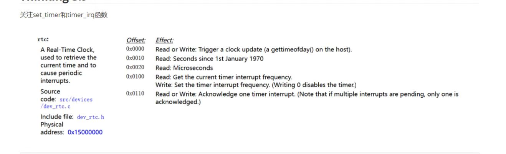

可以看到，这个函数的前两句将产生时钟中断的频率设置在了 200 次 / 秒。 

```assembly
li      t0,             0xc8
sb      t0,             0xb5000100
```

然后它进行了一个赋值

```assembly
sw	    sp, 			KERNEL_SP
```

他将这个时刻的栈指针存储在一个叫做 `KERNEL_SP` 的变量中，这个变量就定义在 `env_asm.S` 中，就一个字大小。

---


## 七、读写异常

### 7.1 总体概述

这个是当我们去写只读页面的时候，就会触发这个异常。但是这还不够精确，因为我们不会闲的没事去写一个只读的页面，所以很多时候就是发生在写时复制的情况，也就是当父进程 `fork` 出一个子进程的时候，父子进程都会把基本上所有的可写页面设置成 COW，而这些页面在通过 `do_refill` 进入 TLB 之后，都会变成只读页面，而当我们尝试去写这个只读页面的时候（我们不知道它已经变成只读的了），就会有异常发生，就是这个异常，这个异常会复制出一个页面来，这样两人就不存在“共享写”的情况了。

具体流程如下：

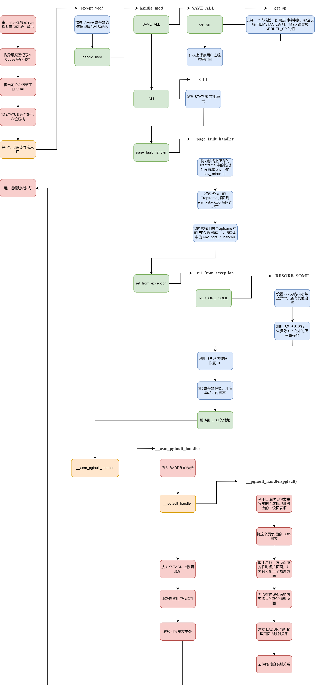

### 7.2 微内核设计

#### 7.2.1 分布式

微内核设计可以看做是将本来应该由操作系统负责的一些功能，移出到了用户进程中负责。在这个异常处理中，操作系统并不会处理异常，而是将异常处理的任务转交给用户进程。

这就涉及一个很有意思的问题，就是如果这些函数不是在内核中实现的，那么它就应该是每个用户进程都各自有一个的，这是因为如果由某个进程独占，那么本质上其实还是操作系统的性质，只不过是一个被放在低位的操作系统罢了。所以一定是每个用户进程都有异常处理函数的，就像一个分布式的操作系统，而微内核带来的好处就是一个用户进程崩了，但是其他进程的异常处理函数还能用，这正是分布式的好处。

具体的实现分布式，就是在 `Makefile` 中实现的

```c
%.b: entry.o syscall_wrap.o %.o $(USERLIB)
	echo ld $@
	$(LD) -o $@ $(LDFLAGS) -G 0 -static -n -nostdlib -T ./user.lds $^
```

最后说一嘴闲话，这个东西让应用程序的移植问题暴露出来，因为每个操作系统的系统调用和异常处理都是不同的，所以一个应用程序移植到操作系统上也是有一大堆需要改的

>操作系统移植考虑的是 ABI，应用程序移植考虑的是 API。

#### 7.2.2 用户异常栈

与我们需要内核栈的原因相同，我们依然不能在原来的用户栈上进行异常处理，我们需要在用户进程的虚拟地址空间上另外找一个地方，来当我们的异常处理栈，最后我们找到了，如图所示

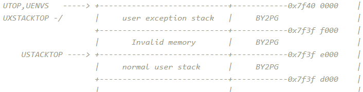

### 7.3 内核部分

内核部分采用的也是一个异常包装函数，所以主要的功能实现就是底下这个函数 `page_fault_handler`。

这是异常处理函数，是一个内核函数，其地位与 `do_refill` 类似，都是被包装过的。那么它到底进行了一个怎样的过程呢？。其实就是先看这个用户进程的栈指针在哪里，如果还在 `xstacktop` 这个页面上，就让其保存一下 `tf` 。如果已经超过了，那么就将栈指针重新定位到 `xstacktop` 然后再保存 `tf`。

也就是下面的代码

```c
bcopy(tf, &PgTrapFrame, sizeof(struct Trapframe));

if (tf->regs[29] >= (curenv->env_xstacktop - BY2PG) &&
    tf->regs[29] <= (curenv->env_xstacktop - 1))
{
    tf->regs[29] = tf->regs[29] - sizeof(struct Trapframe);
    bcopy(&PgTrapFrame, (void *)tf->regs[29], sizeof(struct Trapframe));
}
else
{
    tf->regs[29] = curenv->env_xstacktop - sizeof(struct Trapframe);
    bcopy(&PgTrapFrame, (void *)curenv->env_xstacktop - sizeof(struct Trapframe), sizeof(struct Trapframe));
}
```

然后把 `EPC` 设置成 `env_pgfault_handler` 。

```c
void page_fault_handler(struct Trapframe *tf)
{
    struct Trapframe PgTrapFrame;
    extern struct Env *curenv;

    bcopy(tf, &PgTrapFrame, sizeof(struct Trapframe));

    if (tf->regs[29] >= (curenv->env_xstacktop - BY2PG) &&
        tf->regs[29] <= (curenv->env_xstacktop - 1))
    {
        tf->regs[29] = tf->regs[29] - sizeof(struct Trapframe);
        bcopy(&PgTrapFrame, (void *)tf->regs[29], sizeof(struct Trapframe));
    }
    else
    {
        tf->regs[29] = curenv->env_xstacktop - sizeof(struct Trapframe);
        bcopy(&PgTrapFrame, (void *)curenv->env_xstacktop - sizeof(struct Trapframe), sizeof(struct Trapframe));
    }
    // TODO: Set EPC to a proper value in the trapframe
    tf->cp0_epc = curenv->env_pgfault_handler;
    
    return;
}
```

这个函数最有意思的是，他全程的赋值都是用的 `env` 里的成员，而没有用实际的值，所以 `env` 成员的值又是谁赋的呢？是在 `sys_set_pgfault_handler` 这个函数中完成的。但是这个函数对于 `env` 的赋值依然是通过传递进来的参数，那么 `sys_set_pgfault_handler` 又是谁调用的呢？是 `syscall_set_pgfault_handler` ，这是一个系统调用，但是依然是通过传参进行的，所以还要考虑这个系统调用是谁调用的？是在 `fork` 函数中的这句调用

```c
syscall_set_pgfault_handler(newenvid, __asm_pgfault_handler, UXSTACKTOP);
```

`UXSTACKTOP` 这个值就是 `UTOP` ，关于 `__asm_pgfault_handler` ，会单独开设一章介绍。

这里面还有一个有意思的点，就是在使用 `bcopy` 的时候，出现了低地址区，就是这里

```c
bcopy(&PgTrapFrame, (void *)tf->regs[29], sizeof(struct Trapframe));
```

这里的 `tf->regs[29]` 是低地址区的地址，但是在内核态依然写了。这个与我之前在《操作系统不相信抽象》中说的是不一致的，那篇博客最后看起来漏洞百出，不止这一处。

现在看上去应该是这样的，MMU 是一个硬件结构，他接受虚拟地址转换成物理地址，对于高地址，他会选择高三位抹零转换，而对于低地址，他会选择在 TLB 中查找转换。

### 7.4 用户部分

#### 7.4.1 __asm_pgfault_handler

这个函数就是当 `page_fault_handler`（异常处理程序）结束以后，返回到用户态之后的第一个函数（严格说就是指令序列，并不算函数），这个函数有两个功能，一个是跳转到 `__pgfault_handler` 中，这个函数被 `set_pgfault_handler` 设置为 `pgfault`。然后在结束完真正的处理以后，会重新恢复现场，这是因为恢复现场本应该在内核态完成，但是实际上并没有完成，所以需要在用户态恢复现场。

```assembly
__asm_pgfault_handler:
	// save the caller-save registers
	lw		a0, 		TF_BADVADDR(sp)
	lw		t1, 		__pgfault_handler
	jalr	t1
	nop
	
	lw		v1,	TF_LO(sp)
    mtlo	v1
    lw		v0,	TF_HI(sp)
    lw		v1,	TF_EPC(sp)
    mthi	v0
    mtc0	v1,	CP0_EPC
    lw	$31,TF_REG31(sp)
    lw	$30,TF_REG30(sp)
    lw	$28,TF_REG28(sp)
    lw	$25,TF_REG25(sp)
    lw	$24,TF_REG24(sp)
    lw	$23,TF_REG23(sp)
    lw	$22,TF_REG22(sp)
    lw	$21,TF_REG21(sp)
    lw	$20,TF_REG20(sp)
    lw	$19,TF_REG19(sp)
    lw	$18,TF_REG18(sp)
    lw	$17,TF_REG17(sp)
    lw	$16,TF_REG16(sp)
    lw	$15,TF_REG15(sp)
    lw	$14,TF_REG14(sp)
    lw	$13,TF_REG13(sp)
    lw	$12,TF_REG12(sp)
    lw	$11,TF_REG11(sp)
    lw	$10,TF_REG10(sp)
    lw	$9,TF_REG9(sp)
    lw	$8,TF_REG8(sp)
    lw	$7,TF_REG7(sp)
    lw	$6,TF_REG6(sp)
    lw	$5,TF_REG5(sp)
    lw	$4,TF_REG4(sp)
    lw	$3,TF_REG3(sp)
    lw	$2,TF_REG2(sp)
    lw	$1,TF_REG1(sp)
    lw	k0,TF_EPC(sp) 	
    jr	k0
    lw	sp,TF_REG29(sp)  /* Deallocate stack */
```

#### 7.4.2 pgfault

首先需要强调这是一个用户函数。这个函数实现的是根据虚拟地址 `va` 为其分配一个物理页面，而且这个新的物理页面要有一些内容。

最有意思的是，这个 `va` 之前是对应了一个物理页面的（这是一个子进程函数，所以之前是和父进程共享这个页面）。那么我们要实现的，似乎是让一个 `va` 对应两个物理页面。显然是不合理的。所以严谨地阐述这个函数的功能，是将 `va` 对应到新的物理页面，并将原来的物理页面映射关系去掉。这个新的物理页面的内容跟原来的物理页面内容一致。

```c
static void pgfault(u_int va)
{
    u_int *tmp = USTACKTOP;
    //	writef("fork.c:pgfault():\t va:%x\n",va);
    u_long perm = ((Pte *)(*vpt))[VPN(va)] & 0xfff;
    if ((perm & PTE_COW) == 0)
    {
        user_panic("pgfault err: COW not found");
    }
    perm -= PTE_COW;
    // map the new page at a temporary place
    syscall_mem_alloc(0, tmp, perm);
    // copy the content
    user_bcopy(ROUNDDOWN(va, BY2PG), tmp, BY2PG);
    // map the page on the appropriate place
    syscall_mem_map(0, tmp, 0, va, perm);
    // unmap the temporary place
    syscall_mem_unmap(0, tmp);
}
```

这就引发了一个矛盾，就是如果没有原来的映射关系，我就没有办法把原来物理页面的内容拷贝到新的物理页面上，而保持原来的映射关系，就会存在一个虚拟页面映射新的和旧的两个物理页面的情况。为了解决这个矛盾，我们选择一个临时的虚拟页面去映射这个新的物理页面，然后完成拷贝。在拷贝完成后，再将虚拟地址映射到这个新的物理页面上。

至于选择哪一个虚拟页面，我们选择的是用户栈的上方的一个页面，这个页面是 `invalid memory` 保证不会被使用。

### 7.5 设置函数指针

这是这个异常比较有特点的地方，就是它永远不可能好好的调用各个函数名，而是非得用个类似于函数指针的东西实现调用，最后函数指针和函数名分不开，导致了理解的难度 up。这里进行一个总结

#### 7.1.1 set_pgfault_handler

这个函数看着很奇怪，是因为把函数调用写到了条件里，其实比较好看懂的写法应该是这样（不严谨）

```c
void set_pgfault_handler(void (*fn)(u_int va))
{
	if (__pgfault_handler == 0) 
    {
    	syscall_mem_alloc(0, UXSTACKTOP - BY2PG, PTE_V | PTE_R);
    	syscall_set_pgfault_handler(0, __asm_pgfault_handler, UXSTACKTOP);
	}

	// Save handler pointer for assembly to call.
	__pgfault_handler = fn;
}
```

也就是说，当一个进程第一次调用 `fork` 的时候（对应的就是 `__pgfault_handler == 0` ）。那么这个函数就会为他分配出一个用来处理 `pgfault` 异常的栈，而且设置他处理这种异常的函数是 `__asm_pgfault_handler` 。

每次这个函数都会将 `__pgfault_handler` 设置成 `fn`，在 `fork` 中是传入参数是 `pgfault`。 

```c
void set_pgfault_handler(void (*fn)(u_int va))
{
	if (__pgfault_handler == 0) 
    {
		// Your code here:
		// map one page of exception stack with top at UXSTACKTOP
		// register assembly handler and stack with operating system
		if (syscall_mem_alloc(0, UXSTACKTOP - BY2PG, PTE_V | PTE_R) < 0 ||
			syscall_set_pgfault_handler(0, __asm_pgfault_handler, UXSTACKTOP) < 0) 
        {
			writef("cannot set pgfault handler\n");
			return;
		}

		//		panic("set_pgfault_handler not implemented");
	}

	// Save handler pointer for assembly to call.
	__pgfault_handler = fn;
}
```

#### 7.1.2 sys_set_pgfault_handler

用来给指定的进程设置它的 `pgfault` 函数和发生 `pgfault` 的时候所用的栈，是一个很基础的函数。

```c
int sys_set_pgfault_handler(int sysno, u_int envid, u_int func, u_int xstacktop)
{
    // Your code here.
    struct Env *env;
    int ret;

    // get the env
    ret = envid2env(envid, &env, 0);
    if (ret)
    {
        return ret;
    }

    // set the env_pgfault_handler as the set_pgfault_handler
    env->env_pgfault_handler = func;
    env->env_xstacktop = xstacktop;
    return 0;
    //	panic("sys_set_pgfault_handler not implemented");
}
```

这个函数会在 `fork` 中被调用，可以理解成需要给子进程设置一些状态，好让它比较方便

```c
syscall_set_pgfault_handler(newenvid, __asm_pgfault_handler, UXSTACKTOP);
```


---


## 八、系统调用异常

### 8.1 总体概述

前面的异常或多或少都有“被动”的成分，而系统调用是一种主动的异常，主要是通过陷入异常来获得一些更高权限的功能，所以这个异常逻辑是很简单的，复杂的是不同的系统调用的处理，流程如下：

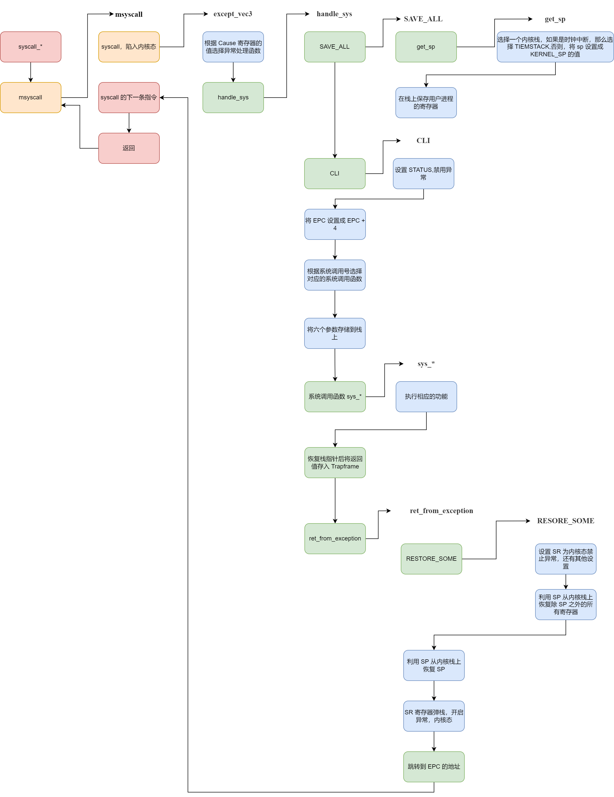

### 8.2 系统调用的前期

#### 8.2.1 syscall_*

所有的系统调用函数在用户进程看来都长成这样

```c
syscall_*(...);
```

然后他们所有函数都会调用 `myscall`，大概这样

```c
msyscall(id,...)
```

`id` 就是系统调用号，他跟异常分发一样，都是由一个类似于数组的结构去分发

#### 8.2.2 msyscall

这是一个用户态函数，其实就是执行了 `syscall`。这条指令会触发一个异常，然后计算机就会进入中断，但是注意，即使是这样，也不能将 `syscall` 看作一个函数调用。之所以强调这点，是因为 `handle_sys` 会使用传给 `mysyscall` 的参数

```assembly
LEAF(msyscall) 
    syscall
	nop
	jr		ra
	nop
END(msyscall)
```

我们来看一下它的参数都有啥

```c
msyscall(SYS_putchar, (int)ch, 0, 0, 0, 0);
msyscall(SYS_getenvid, 0, 0, 0, 0, 0);
...
```

其实每一个都不一样，这是因为只有第一个参数是为了让 `handler_sys` 选择使用哪个系统调用，而其他的参数都是为了某个具体的系统调用服务的，所以不一样。但是为了规格的统一，所以用 0 占位。

#### 8.2.3 handle_sys

与 `handle_int` 类似，都是没有用模板，但是跟用了模板没啥区别的异常处理函数。

上来依然是换栈，关异常，保存现场

```assembly
SAVE_ALL                            // Macro used to save trapframe
CLI                                 // Clean Interrupt Mask
```

然后是系统调用的一个特色，他的返回 `PC` 不是 `EPC`，而是 `EPC+4` 因为 `EPC` 对应的是 `syscall` 这条指令，所以应该返回下一条指令。

```assembly
// TODO: Fetch EPC from Trapframe, calculate a proper value and store it back to trapframe.
lw		t0, TF_EPC(sp)
addiu	t0, t0, 4
sw		t0, TF_EPC(sp)
```

然后是根据系统调用号（也就是 `myscall` 的第一个参数）来确定需要的具体的系统调用，其原理类似与异常处理表的查询

```assembly
// TODO: Copy the syscall number into $a0.
lw		a0, TF_REG4(sp)
addiu   a0, a0, -__SYSCALL_BASE     // a0 <- relative syscall number
sll     t0, a0, 2                   // t0 <- relative syscall number times 4
la      t1, sys_call_table          // t1 <- syscall table base
addu    t1, t1, t0                  // t1 <- table entry of specific syscall
lw      t2, 0(t1)                   // t2 <- function entry of specific syscall

.data
sys_call_table:                         // Syscall Table
.align 2
.word sys_putchar
.word sys_getenvid
.word sys_yield
.word sys_env_destroy
.word sys_set_pgfault_handler
.word sys_mem_alloc
.word sys_mem_map
.word sys_mem_unmap
.word sys_env_alloc
.word sys_set_env_status
.word sys_set_trapframe
.word sys_panic
.word sys_ipc_can_send
.word sys_ipc_recv
.word sys_cgetc
```

然后要获得第五个和第六个参数，这个同样是有 `ABI` 规范的，第五个参数和第六个参数会存在用户调用 `msyscall` 栈的上一个栈中，具体结构如图

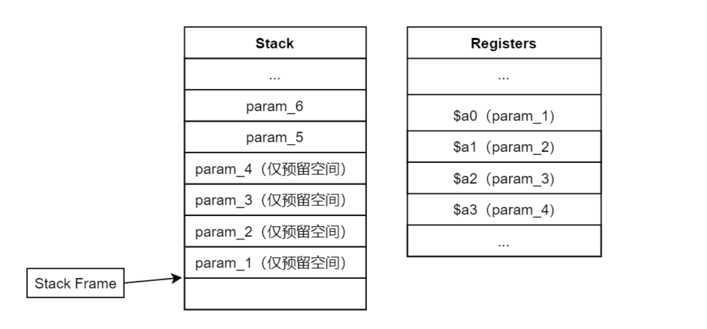

左侧为用户栈，所以我们可以从用户栈上把参数取出来

```assembly
lw      t0, TF_REG29(sp)            // t0 <- users stack pointer
lw      t3, 16(t0)                  // t3 <- the 5th argument of msyscall
lw      t4, 20(t0)                  // t4 <- the 6th argument of msyscall
```

然后我们需要把六个参数都存到用户栈上，我也不知道为啥要存首位的四个，可能是约定吧。先取出前四个参数

```assembly
lw		a0, TF_REG4(sp)
lw		a1, TF_REG5(sp)
lw		a2, TF_REG6(sp)
lw		a3, TF_REG7(sp)
```

然后再存进去

```assembly
addiu	sp, sp, -24
sw		a0, 0(sp)
sw		a1, 4(sp)
sw		a2, 8(sp)
sw		a3, 12(sp)
sw		t3, 16(sp)
sw		t4, 20(sp)
```

然后就可以调用具体的函数了

```assembly
jalr    t2                          // Invoke sys_* function
nop
```

调用完之后把栈空间释放了（释放的是那六个参数空间，不知道是不是 ABI ）

```assembly
addiu	sp, sp, 24
```

恢复一下返回值，我觉得用 `ret_from_exception` 似乎也行

```assembly
sw      v0, TF_REG2(sp)             // Store return value of function sys_* (in $v0) into trapframe
```

然后返回

```assembly
j       ret_from_exception          // Return from exeception
nop
```

### 8.3 系统调用函数总结

真正实现系统调用函数功能的都是以 `sys_` 开头的函数，有以下函数

#### 8.3.1 sys_set_pgfault_handler

用来给指定的进程设置它的 `pgfault` 函数和发生 `pgfault` 的时候所用的栈，是一个很基础的函数。

```c
int sys_set_pgfault_handler(int sysno, u_int envid, u_int func, u_int xstacktop)
{
    // Your code here.
    struct Env *env;
    int ret;

    // get the env
    ret = envid2env(envid, &env, 0);
    if (ret)
    {
        return ret;
    }

    // set the env_pgfault_handler as the set_pgfault_handler
    env->env_pgfault_handler = func;
    env->env_xstacktop = xstacktop;
    return 0;
    //	panic("sys_set_pgfault_handler not implemented");
}
```

这个函数会在 `fork` 中被调用，可以理解成需要给子进程设置一些状态，好让它比较方便

```c
syscall_set_pgfault_handler(newenvid, __asm_pgfault_handler, UXSTACKTOP);
```

#### 8.3.2 sys_yield

基本上所有的系统调用都是包装函数的形式，基本上都可以看作是一些预处理加上一些原有的 `API` 的调用。

对于 `sys_yield` 有个最重要的东西，就是把上下文从 `KERNEL_SP` 处拷贝到 `TIMESTACK` 上，因为后续的 `env_run` 会从 `TIMESTACK` 中恢复上下文。但是这之后使用的栈依然是内核栈。

```c
void sys_yield(void)
{
    bcopy((void *)KERNEL_SP - sizeof(struct Trapframe),
          (void *)TIMESTACK - sizeof(struct Trapframe),
          sizeof(struct Trapframe));
    sched_yield();
}
```

#### 8.3.3 sys_env_destory

这是一个新的预处理，就是根据 `envid` 获得需要处理的进程，可以看到如下操作

```c
int r;
struct Env *e;

if ((r = envid2env(envid, &e, 1)) < 0)
{
    return r;
}
```

有趣的是，用户进程自己为啥知道 `id` 。有两种方法，一个是 `fork` ，可以通过返回值判断 `id` 。另一个是使用系统调用 `sys_getenvid` 。

```c
int sys_env_destroy(int sysno, u_int envid)
{
    int r;
    struct Env *e;

    if ((r = envid2env(envid, &e, 1)) < 0)
    {
        return r;
    }

    printf("[%08x] destroying %08x\n", curenv->env_id, e->env_id);
    env_destroy(e);
    return 0;
}
```

不过有意思的是，这里并没有 `sys_yield` 中出现的上下文拷贝操作，这是因为这个拷贝操作在 `env_destroy` 中进行了。

#### 8.3.4 sys_mem_alloc

这个函数用于给指定进程的某个虚拟地址分配一个页面，这就很神奇了，我一开始以为会是只能给自己这个进程分配一个页面呢。

```c
int sys_mem_alloc(int sysno, u_int envid, u_int va, u_int perm)
{
    struct Env *env;
    struct Page *ppage;
    int ret;

    // check the perm
    if ((perm & PTE_V) == 0)
    {
        return -E_INVAL;
    }
    if (perm & PTE_COW)
    {
        return -E_INVAL;
    }
    // check the va
    if (va >= UTOP)
    {
        return -E_INVAL;
    }
    
    // we need the env to get the pgdir of the curenv
    // pgdir is the key to map
    ret = envid2env(envid, &env, 1);
    if (ret < 0)
    {
        return ret;
    }

    ret = page_alloc(&ppage);
    if (ret < 0)
    {
        return ret;
    }
    ret = page_insert(env->env_pgdir, ppage, va, perm);
    if (ret < 0)
    {
        return ret;
    }    

    ret = 0;
}
```

#### 8.3.5 sys_mem_map

这个函数用于“共享页面”，就是说给定两个进程，将两个进程各自不同的虚拟地址映射到同一页物理内存中去。这个的灵活性很大，因为可以指定两个进程，还可以指定两个虚拟地址。所以我们一般使用它的时候，会限制两个虚拟地址相等。

```c
int sys_mem_map(int sysno, u_int srcid, u_int srcva, u_int dstid, u_int dstva,
                u_int perm)
{
    int ret;
    u_int round_srcva, round_dstva;
    struct Env *srcenv;
    struct Env *dstenv;
    struct Page *ppage;
    // it's just a parameter occupy, it's useless
    Pte *ppte;

    ppage = NULL;
    ret = 0;
    // we need the va of vpage where the parameter va located 
    round_srcva = ROUNDDOWN(srcva, BY2PG);
    round_dstva = ROUNDDOWN(dstva, BY2PG);

    // check the permission
    if ((perm & PTE_V) == 0)
    {
        return -E_INVAL;
    }
    // check the va
    if (srcva >= UTOP || dstva >= UTOP)
    {
        return -E_INVAL;
    }

    // check the source env
    ret = envid2env(srcid, &srcenv, 0); 
    if (ret < 0)
    {
        return ret;
    }

    // check the destination env
    ret = envid2env(dstid, &dstenv, 0);
    if (ret < 0)
    {
        return ret;
    }
    
    // look up for the physical page
    ppage = page_lookup(srcenv->env_pgdir, round_srcva, &ppte);
    if (ppage == NULL)
    {
        return -E_INVAL;
    }

    // map the dstva to the ppage
    ret = page_insert(dstenv->env_pgdir, ppage, round_dstva, perm);
    return ret;
}
```

#### 8.3.6 sys_mem_unmap

这个函数用于将指定进程的指定虚拟地址到物理页面的映射关系解除。

```c
int sys_mem_unmap(int sysno, u_int envid, u_int va)
{
    int ret = 0;
    struct Env *env;

    // check the va
    if (va >= UTOP)
    {
        return -E_INVAL;
    }
    // get the env
    ret = envid2env(envid, &env, 0);
    if (ret < 0)
    {
        return ret;
    }

    // umap
    page_remove(env->env_pgdir, va);
    return ret;
    //	panic("sys_mem_unmap not implemented");
}
```

#### 8.3.7 sys_env_alloc

这个函数用于创造出一个新的进程。

```c
int sys_env_alloc(void)
{
    // Your code here.
    int r;
    struct Env *e;

    // alloc a new env 
    r = env_alloc(&e, curenv->env_id);
    if (r < 0)
    {
        return r;
    }
    // set the statur of new env    
    e->env_status = ENV_NOT_RUNNABLE;

    // copy the father env to the child env
    e->env_pri = curenv->env_pri;
    bcopy((void *)KERNEL_SP - sizeof(struct Trapframe),
          (void *)(&(e->env_tf)), sizeof(struct Trapframe));
    e->env_tf.pc = e->env_tf.cp0_epc;

    // set the return value = 0
    e->env_tf.regs[2] = 0; 
    return e->env_id;
    //	panic("sys_env_alloc not implemented");
}
```

最有意思的事实下面这个句话，他让 `v0` 的值为 0。

```c
e->env_tf.regs[2] = 0; 
```

#### 8.3.8 sys_set_env_status

设置进程的状态，主要就用于 `fork` 中，子进程并被分配后没有被设置为 `RUNNABLE` ，且并没有插入调度链表，这个函数就是解决这两件事情。从这个函数可以看出，子进程会被一种时钟中断的形式调用。

```c
int sys_set_env_status(int sysno, u_int envid, u_int status)
{
    // Your code here.
    struct Env *env;
    int ret;

    // check the status
    if (status != ENV_RUNNABLE && status != ENV_NOT_RUNNABLE && status != ENV_FREE)
    {
        return -E_INVAL;
    }

    // get the env
    ret = envid2env(envid, &env, 0);
    if (ret)
    {
        return ret;
    }
    if (status == ENV_RUNNABLE && env->env_status != ENV_RUNNABLE)
    {
        LIST_INSERT_TAIL(env_sched_list, env, env_sched_link);
    }
    env->env_status = status;
    return 0;
    //	panic("sys_env_set_status not implemented");
}
```

#### 8.3.9 sys_ipc_recv

这个函数实现的功能就是通过设置进程控制块，来做好“被通信”的准备，然后等待，在这个函数里可能出现了唯一一个 `ENV_NOT_RUNNABLE` 。（`fork` 中也有一个）

对于传进来的地址，首先会做一个地址检查。每一个系统调用只要参数中有虚拟地址，都会做这个检查。其实为了保证用户不会访问到不该访问的区域，一部分检查是在这里做的，另一部分是在 `pageout` 里做的。应该检查都是由软件实现的。

```c
// check the va
if (dstva >= UTOP)
{
	return;
}
```

然后我们设置一些状态

```c
// set the status
curenv->env_ipc_recving = 1;
// set the dstva
curenv->env_ipc_dstva = dstva;
```

最后让这个进程被阻塞，换一个进程调度。注意调度用的是 `sys_yield` 因为有一个上下文拷贝的操作需要进行。

```c
// block the env
curenv->env_status = ENV_NOT_RUNNABLE;
// we can't use the env_yield, because of the timer Irq
sys_yield();
```

#### 8.3.10 sys_ipc_can_send

这个函数用来给其他进程传递数据，传递数据的方法有两种，一种是通过进程控制块里的一个 `env_ipc_value` 可以传递一个整型数，还可以通过共享页面来进行一个大数据的传输。

首先依然是检查虚拟地址

```c
// check the srcva
if (srcva >= UTOP)
{
    return -E_INVAL;
} 
```

 然后是获得被传输进程的进程控制块，并检测相关权限

```c
// get the dstenv
r = envid2env(envid, &e, 0);
if (r < 0)
{
	return r;
}    
if (e->env_ipc_recving == 0)
{
	return -E_IPC_NOT_RECV;
}
```

然后进行一个值传递

```c
// pass the value    
e->env_ipc_value = value;
```

进行一下页面的共享，其实就是利用传输者查找出物理地址控制块，然后建立这个物理地址控制块与被传输者虚拟地址的联系

```c
if (srcva != 0)
{
    // share the physical page
    p = page_lookup(curenv->env_pgdir, srcva, NULL);
    if (p == NULL || e->env_ipc_dstva >= UTOP)
    {
        return -E_INVAL;
    }    
    r = page_insert(e->env_pgdir, p, e->env_ipc_dstva, perm);
    if (r != 0)
    {
        return r;
    }    
}
```

最后设置一下被传输进程的状态，使其停止阻塞

```c
e->env_ipc_from = curenv->env_id;
e->env_ipc_perm = perm;
e->env_ipc_recving = 0;
e->env_status = ENV_RUNNABLE;
```

### 8.4 fork

#### 8.4.1 不是系统调用函数

首先最需要强调的是，`fork` 不是一个系统调用函数，但是它使用了很多的系统调用函数。而且很多的系统调用函数都是**专门**为 `fork` 服务的，所以入过光看某些系统调用函数，会觉得有很多的操作是多余甚至冗余的。事实也确实是如此，比如说 `sys_env_alloc` ，按照自面理解，其实只需要一句 `env_alloc` 就结束这个函数了，但是实际上呢？

```c
e->env_status = ENV_NOT_RUNNABLE;						// 	为啥要设置成 NOT_RUNNABLE
e->env_pri = curenv->env_pri;							//	为啥要设置这个优先级
bcopy((void *)KERNEL_SP - sizeof(struct Trapframe),		//	为啥要拷贝
(void *)(&(e->env_tf)), sizeof(struct Trapframe));		
e->env_tf.pc = e->env_tf.cp0_epc;						//	为啥要这样设置 PC
e->env_tf.regs[2] = 0; 									//	为啥要设置 v0
```

这一大堆语句我都不知道它在干啥。这是因为这些操作都是为了 `fork` 这个语境服务的，如果不是用在 `fork` 里，这些语句就很无厘头。

所以理解某些系统调用，不能从其功能区理解，而是要从其语境理解，因为有的时候功能并不是一个泛化的功能，而可能只是一个函数里特化的一步而已。

#### 8.4.2 duppage

这个函数用于根据父进程的映射关系，去复制子进程的映射关系，`pn` 是虚拟页面号的意思。复制最困难的是对于权限位的考量，其实就是对于 `COW` 的设置。如果一个页面，他不是只读的（说明有写的可能），而且也没有明确说是可以共享的（只共享写），那么就是应该增设 `PTE_COW` 位，这种增设是对于父子进程都要设置的。所以尽管这里有两个`map`，但是第一个 `map` 是用于子进程建立页面映射，而第二个是用于修改父进程的映射权限。

```c
static void duppage(u_int envid, u_int pn)
{
    // addr is the va we need to process
    u_int addr = pn << PGSHIFT;
    // *vpt + pn is the adress of page_table_entry which is corresponded to the va
    u_int perm = ((Pte *)(*vpt))[pn] & 0xfff;

    // if the page can be write and is not shared, so the page need to be COW and map twice
    int flag = 0;
    if ((perm & PTE_R) && !(perm & PTE_LIBRARY))
    {
        perm |= PTE_COW;
        flag = 1;
    }
    syscall_mem_map(0, addr, envid, addr, perm);
    if (flag)
    {
        syscall_mem_map(0, addr, 0, addr, perm);
    }

    //	user_panic("duppage not implemented");
}
```

#### 8.4.3 fork

这个函数用于产生一个子进程，并且设置其状态和各种配置。这里需要强调的一个有趣的点是，`fork` 本身并不是系统调用函数，他是由一系列系统调用函数组成的一个用户函数。

```c
int fork(void)
{
    u_int newenvid;
    extern struct Env *envs;
    extern struct Env *env;
    u_int i;

    // The parent installs pgfault using set_pgfault_handler
    set_pgfault_handler(pgfault);

    // alloc a new alloc
    newenvid = syscall_env_alloc();
    if (newenvid == 0)
    {
        env = envs + ENVX(syscall_getenvid());
        return 0;
    }

    for (i = 0; i < VPN(USTACKTOP); ++i)
    {
        if (((*vpd)[i >> 10] & PTE_V) && ((*vpt)[i] & PTE_V))
        {
            duppage(newenvid, i);
        }
    }
    syscall_mem_alloc(newenvid, UXSTACKTOP - BY2PG, PTE_V | PTE_R);
    syscall_set_pgfault_handler(newenvid, __asm_pgfault_handler, UXSTACKTOP);
    syscall_set_env_status(newenvid, ENV_RUNNABLE);
    return newenvid;
}
```

首先我们先进行了一个父进程的配置，我们用这个函数为父进程分配了处理 `COW` 的时候的栈，还指定了处理 `pgfault` 异常的函数。至于为啥不一早就分配好了呢？我觉得是因为不是每个进程都需要用到这个栈，所以为了避免页面的浪费，就没有改成了用函数手动配置，而不是默认配置。

```c
set_pgfault_handler(pgfault);
```

然后我们利用系统调用创造一个进程

```c
newenvid = syscall_env_alloc();
```

我们先看子进程，它会被时钟中断调度（先别管咋调度的），那么就会从内存控制块里恢复现场，那么此时被恢复的 `v0` 就是 `0`，返回的 PC 就是 `syscall_env_alloc` 所导致的 `syscall` 的下一条，也就是 `msyscall` 中的这条

```c
LEAF(msyscall)
	syscall
	nop				// 这条
	jr		ra
	nop
END(msyscall)
```

那么再次返回的时候 `syscall_env_alloc` 的返回值就变成了 0。然后就会进入下面这个分支判断

```c
if (newenvid == 0)
{
    env = envs + ENVX(syscall_getenvid());
    return 0;
}
```

`env` 是对于用户进程的一个全局变量，他表示正在运行的进程块，一般会在 `start` 到 `main` 之间设置，但是以为 `fork` 出的子进程没有设置这个，所以需要在这里设置，然后就可以结束 `fork` 了，返回值是 `0`。

但是对于父进程来说，对于子进程的修改还没有结束，他还需要将虚拟环境完全的复制给子进程，也就是下面的语句。这里的 `i` 是虚页号，我们可以用 `(*vpd)[i >> 10]` 的找出这个虚页号对应的一级页表项，用 `(*vpt)[i]` 找出二级页表项，为什么可以这样呢？

```c
for (i = 0; i < VPN(USTACKTOP); ++i)
{
    if (((*vpd)[i >> 10] & PTE_V) && ((*vpt)[i] & PTE_V))
    {
        duppage(newenvid, i);
    }
}
```

首先我们需要弄清 `extern` 的用法，这似乎是理解的最难点，对于一个在 `file1` 中定义的全局变量 `a`

```c
int a = 1;  		// 假设地址 &a = 0x8000_5000
```

那么在文件 `file2` 的时候需要引入这个变量，那么可以有两种写法（虽然正常人只会用第一种）

```c
extern int a;
extern int a[];
```

但是两者的结果是不同的，如果我们打印第一个变量 `a`，那么会出现 `1`，如果打印第二个变量（我都感觉这是个指针常量了），那么就会出现 `a = 0x80005000` 。我不知道为啥是这样的，但是确实是这样的。

然后我们来看一下 `vpt` 和 `vpd` 的定义，在 `user` 文件夹下的 `entry.S` 下

```assembly
	.globl vpt
vpt:
	.word UVPT

	.globl vpd
vpd:
	.word (UVPT+(UVPT>>12)*4)
```

可以看到是一个自映射的标准写法，相关的宏就是我们在 `mmu.h` 中定义的，而且我们在进程创建之初，就完成了这个设置，

```c
e->env_pgdir[PDX(UVPT)] = e->env_cr3 | PTE_V;
```

但是最让人困惑的莫过于教程中“指针的指针”这一说法，我个人觉得直接认为他是错误的就好了。因为在引入的时候，我们用的是这种方法

```c
extern volatile Pte *vpt[];
extern volatile Pde *vpd[];
```

按照 c 的语法，`vpt` 应该是一个指针数组，但是这个操作 `(*vpt)[i]` 如果需要先按照数组方式理解，然后再按照指针方式理解，那么就会变成这样 `*(vpt[0] + i)` 或者直观一些 `vpt[0][i]` 。这都是无厘头的，因为类似于我们声明了一个指针数组，但是只用它的第一个元素当指针，为啥我们不直接声明一个指针 `Pte* vpt`。这是个未解之谜，我与叶哥哥讨论，叶哥哥也认为如果写成

```c
u_int *vpt = (u_int*) UVPT;
// use vpt[i]
```

会很好看，鬼知道他为啥写成这样。

但是既然写了，就要从语法上解释通，对于 `(*vpt)` 操作，结合上面介绍的 `extern` 知识，可以知道，`vpt` 的值不再是 `0x7fc0 0000 `了，而是 `vpt` 的地址（恶心）。然后 `(*vpt)` 的值才是 `0x7fc0 0000` 。所以再结合 `(*vpt) + VPN` ，知道这是在计算二级页表项的虚拟地址，然后取地址，就可以得到二级页表项 `*((*vpt) + VPN) = (*vpt)[VPN]` 。

在有了这些知识打底的基础上，我们就可以看到底要干啥了，我们遍历了所有的二级页表项和一级页表项，如果他是有效的，那么就要给子进程复制他，人物交给了 `duppage`。

```c
for (i = 0; i < VPN(USTACKTOP); ++i)
{
    if (((*vpd)[i >> 10] & PTE_V) && ((*vpt)[i] & PTE_V))
    {
        duppage(newenvid, i);
    }
}
```

然后我们需要设置一些子进程的对于 `COW` 的设置

```c
syscall_mem_alloc(newenvid, UXSTACKTOP - BY2PG, PTE_V | PTE_R);
syscall_set_pgfault_handler(newenvid, __asm_pgfault_handler, UXSTACKTOP);
```

上面两句话的作用其实跟父进程的 `set_pgfault_handler(pgfault)` 作用一样，就是没有设置 `pgout` 因为之前似乎已经设置了。

最后我们需要让子进程进入调度序列，就是底下这个函数实现的

```c
syscall_set_env_status(newenvid, ENV_RUNNABLE);
```

最后偷一张图放在这里：

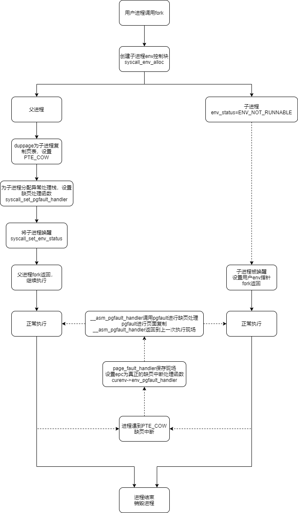

----


