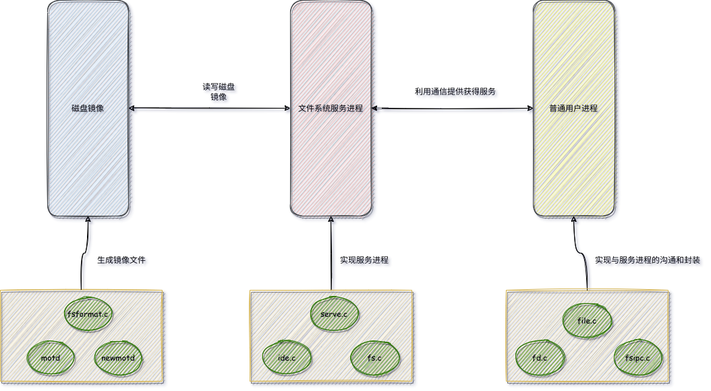
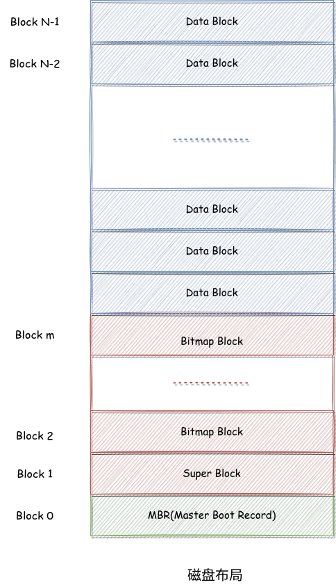
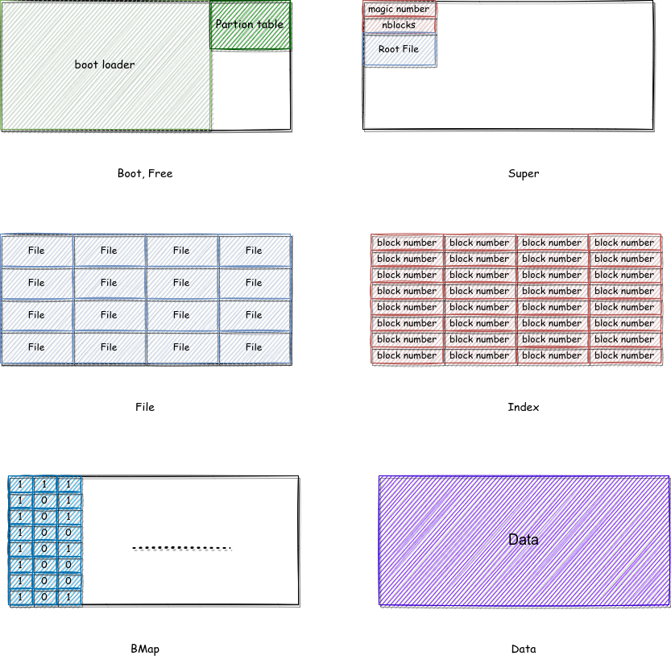
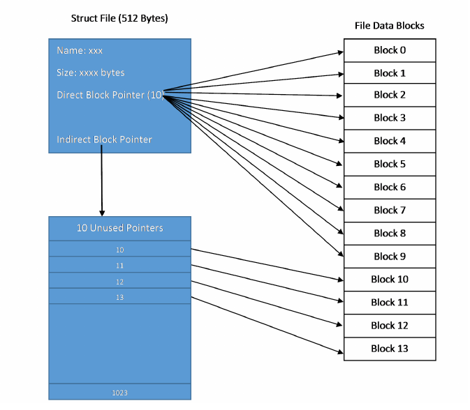
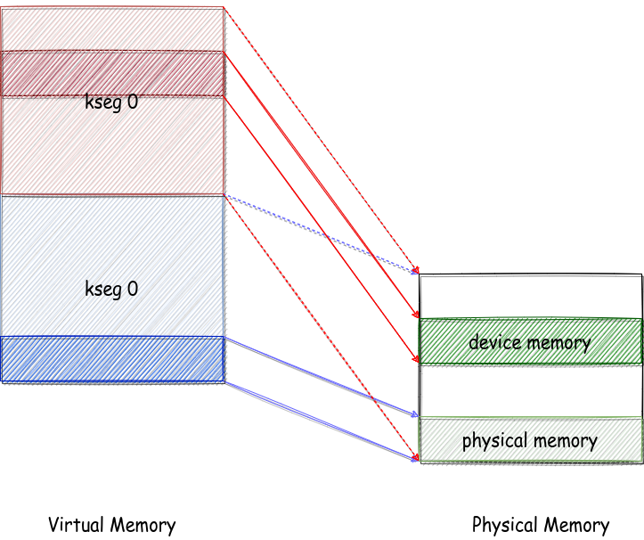
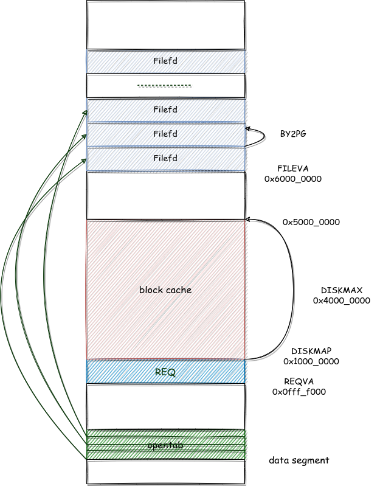
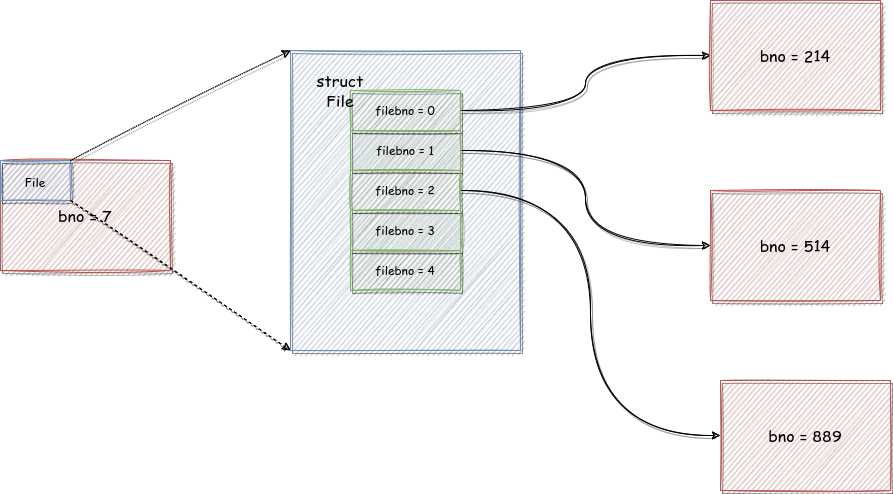
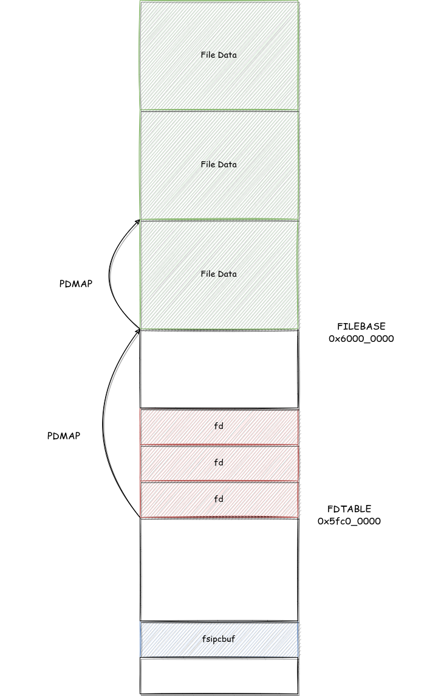
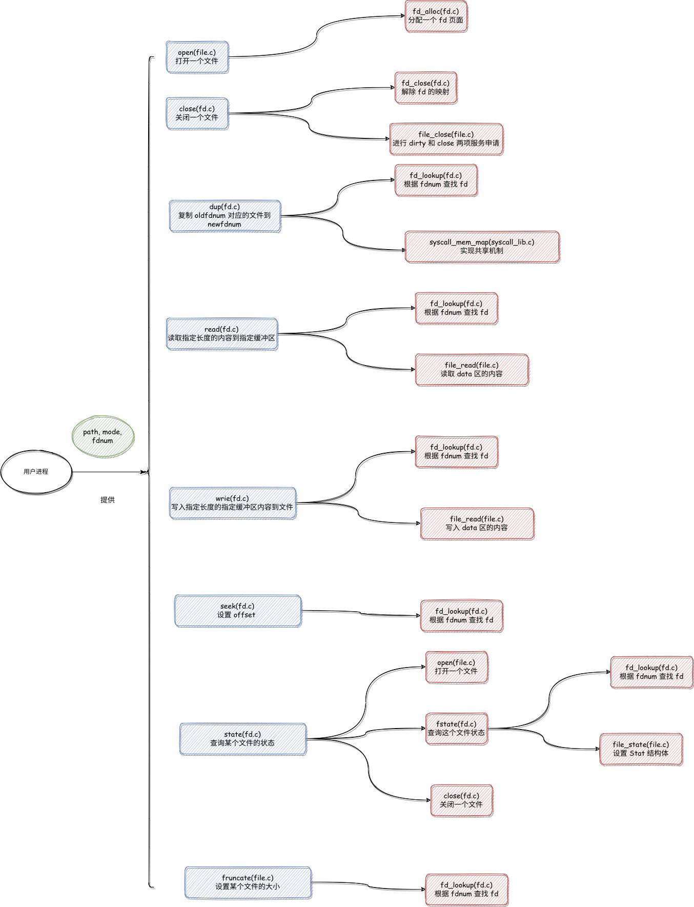

## 一、总论 

### 1.1 直观感受

这一章虽然名义上很简单，但是我个人觉得真的很难，其难度是要远超于 lab3 和 lab4 的。对于 lab3 和 lab4，其难度主要集中于复杂的函数调用关系上，如果理清了函数调用关系，会发现难度就很容易弄清了，而理清函数关系只要通过认认真真的看代码，整理就可以办到。而 lab5 的难度在于理解操作系统的设计，这种理解不是代码层次的“一个函数是调用了哪些函数，传了哪些参数？”这一类的问题，而是 MOS 是怎样设计的，为什么要这样设计的问题。这些问题在 lab4 中也出现了，比如异常处理的微内核设计。

### 1.2 文件系统微内核

这一章的微内核与 lab4 的异常处理的微内核是两个东西，这是最重要的一点。微内核设计都强调将原本属于操作系统的一部分功能分配出来（比如说异常处理，文件系统），分配给用户进程完成。在 lab4 中，微内核设计是把异常处理的功能分出来，让每个进程都具有异常处理的功能（以库函数的形式）。但是在 lab5 中，微内核设计确实将文件系统的实现分了出来，但是并不是配置到了每一个用户进程上，让每一个进程都有文件系统的能力，而是专门开设了一个用户进程专门提供文件系统的服务（这也是这个用户进程的大部分实现文件都被放置在了 `fs` 文件夹下，而不是 `user` 文件夹下的原因），而其他进程想要获得文件系统的服务，就要与这个特殊的用户进程进行通信，就好像之前与操作系统进行通信一样。

那么就引出了一个问题，就是如果是一个“集中式”的移出，那么为什么要移出？在每个用户进程上都装备上操作系统移出的功能显然是有益处的，这样一个用户进程的异常处理功能坏掉了，但是其他进程的异常处理功能并没有问题，这增加了程序的鲁棒性。但是一个特殊的进程单独负责文件系统服务，这个看似是没有意义的，因为这个进程只要崩掉，所有进程的文件系统功能就都会瘫痪，就跟操作系统崩掉是一样的。

其实是这样的，因为文件系统本质上不是一个完全由操作系统决定的东西，其很多的设计的决定权并不在操作系统（也就是操作系统并不是最底层的东西），而是在硬件存储设备上。不同的硬件存储设备可能有不同的文件系统。这就导致了一个操作系统要同时面对多个文件系统（因为可能有多个硬件存储设备）。这在设计上就会导致一个问题，就是代码会随着文件系统的增加而增加，这显然是不可能的，总不能指望用户自己手动修改操作系统代码。

那么为了解决这个问题，要么将新的文件系统的实现强行分配给硬件制造商，比如 Linux 采用的 `VFS`，就是规定了一系列通用的接口，所有的文件系统都必须向上提供这些接口的实现。要么就是操作系统自行实现，而将其放在用户进程部分是合理的，这里引用王哥哥的话

>每一种不同的文件系统都由一个进程来管理, 那么其余进程就不必操心格式的问题, 没必要引入相关的库, 只需要和相应的文件系统进程打交道就行,. 这样也方便移植, 我可以新建一个文件系统进程相关的库, 来支持一个新的磁盘文件系统格式. 这在微内核下比每个进程都掌握相应的库要来的方便。

此外还有一个理解，就是我们需要“块缓存机制”来提高效率，块缓存要求只有一个进程读写（不然就会出现一致性问题），所以只能交由一个单独的东西，要么是文件系统服务进程，要么操作系统。

### 1.3 磁盘文件系统

之前我对于磁盘的理解是非常机械的，我就觉得他就是一个物理的东西，跟一个挺长的纸没啥差别。但是其实给他的定位应该是一个跟 CPU 相似的东西。我们不能将 CPU 理解为一个计算器，因为他也有自己的设计，他向上提供了以汇编为代表的一整个系统。同样的，磁盘也是有自己的设计，他向上提供了文件系统的接口。

为啥磁盘就不能安安静静当一个挺长的纸呢？这是因为其实写这个纸也是一个很复杂的事情，这张纸上哪里写了，哪里没写，怎么去找纸的某个特定的位置，总不能所有的事情都交给操作系统去干，而且也不现实，这张纸最起码应该记录哪里用了，哪里没用，操作系统又不知道，也没办法知道。

### 1.4 磁盘镜像

然后还有一个概念需要理解一下，就是磁盘镜像。它是对于磁盘的一个完整拷贝，也就是说，可以看作是物理磁盘的一个模拟，物理磁盘上面有什么，它上面就有什么（包括分区表，元数据之类的信息）。

它的本质是一个文件。因为我们采用的是模拟器，所以我们也应该是没有办法给操作系统挂载一个实际的硬盘。所以我们除了要写有关于操作系统的东西，我们还要写一个生成磁盘镜像的程序。

### 1.5 内容概述

结合上面三个内容，我们这个单元要完成后的职能分工应该是这样的



所以最后我们要完成的任务有

- 构建一个磁盘镜像：涉及的文件是 `fsformat.c` 。我们会用 X64 的编译器去进行一个普通的编译（就是这个东西是与操作系统的实现没啥关系的），生成的 `fsformat` 会利用已经准备好的 `motd` 和 `newmotd` 文件构建出一个磁盘镜像。这个磁盘镜像就是我们要挂载到模拟器上的镜像。
- 实现一个文件系统服务进程：涉及的文件是 `serve.c, ide.c, fs.c`。其中 `ide.c` 用于实现与磁盘沟通的接口，`fs.c` 相当于服务进程的库，里面有各种服务函数。`servc.c` 是服务进程的实现函数，它组织 `fs.c` 中的函数，根据普通用户进程发来的不同请求，调用不同的函数，提供不同的服务。
- 在普通用户程序处实现请求服务接口：涉及的文件是 `file.c, fd.c, fsip.c` 。其中 `fsip.c` 实现了与服务进程的沟通，`fd.c` 实现了对于“文件”的文件描述符封装（直接接触文件操作对于用户进程而言过于繁琐），`file.c` 利用 `fd.c` 提供的封装函数，完成了功能的集成。

这个 lab 有一个比较难懂的地方就是大量的代码逻辑存在一定的相似性，这是因为本质上这么多的文件都在描述同一件事情（就好像有 `printf`，还有 `writef` 一样），所以会出现很多的相似的内容，所以要仔细甄别。

---


## 二、磁盘镜像

### 2.1 镜像生成程序

`fsformat.c` 这个程序不是一个磁盘镜像，而是一个磁盘镜像生成程序，也就是说，他会有很多和奇怪的信息用于控制镜像的结构，这些信息是不会被真正写入磁盘的。

如果没有这个观点，就会发现有些东西很难以理解，比如

```c
struct Block
{
    uint8_t data[BY2BLK];
    uint32_t type;
};
```

一个磁盘块的大小是 4096 B，但是一个 `Block` 结构体的大小却是 4100 B。这是因为 `type` 并不会被写到磁盘镜像中。如下给出佐证。

```c
for (i = 0; i < 1024; ++i)
{
    reverse_block(disk + i);
    write(fd, disk[i].data, BY2BLK);
}
```

真正写到磁盘中去的，只有 `data` 。

### 2.2 磁盘结构和初始化

首先了解一下 MOS 的磁盘的文件系统的结构（严格的说，应该叫做 Mips 磁盘的文件系统结构，设置叫做北航磁盘的文件系统结构，总之也是一个人为设计的东西）。我们磁盘上的文件系统结构如下



这里的磁盘块的大小是 4096 Byte，相关的常数在 `include/fs.h` 中有记录

```c
#define BY2BLK 		4096					// 每个磁盘块的字节数是 4096
#define BIT2BLK		(BY2BLK * 8)			// 每个磁盘块的bit位数是 4096 * 8
```

其中绿色的 block 是**主引导记录**（有可能知识磁盘块的第一个扇区，但是反正在 MOS 中是这样的），虽然跟这里的知识没啥关系，但是还是介绍一下，里面面主要是一个 `bootloader` 用于加载操作系统，还有一个分区表，记录这个这个磁盘的分区信息。因为我们加载操作系统在模拟器中被简化，采用一种文件系统格式也没有必要进行分区，所以这个块是没用的。

红色的块都是元数据存储的块（也就是管理数据，用来记录实际的信息的各种情况的数据）。对于 `Super` 块，记录着魔数，文件系统的大小，根目录，其结构如下

```c
struct Super
{
    u_int s_magic;      // Magic number: FS_MAGIC
    u_int s_nblocks;    // Total number of blocks on disk
    struct File s_root; // Root directory node
};
```

然后就会发现一个有趣的事情，就是这个结构体的大小是 264 字节，而 super 理论上大小是 4096 B，所以似乎没有占满，我们说是这样的，就是没有占满。

之后的一些块就是 `bitmap` 我们用位图的方式来记录磁盘块的使用情况。当我们进行初始化的时候，首先要计算需要多少个磁盘块来存放位图结构

```c
nbitblock = (NBLOCK + BIT2BLK - 1) / BIT2BLK;
```

之所以这么写，可能是为了向上取整。

然后需要将这些块都进行初始化置 `1` 。我们是利用 `memset` 进行的，将所有的位图块的每一位都置为 1 之后,还需要根据实际情况,将位图不存在的部分设为 0，即 `if` 语句实现的功能。

```c
for (i = 0; i < nbitblock; ++i)
{
    memset(disk[2 + i].data, 0xff, BY2BLK);
}
if (NBLOCK != nbitblock * BIT2BLK)
{
    diff = NBLOCK % BIT2BLK / 8;
    memset(disk[2 + (nbitblock - 1)].data + diff, 0x00, BY2BLK - diff);
}
```

除此之外，我们还给每个 block 一定的属性，如下所示

```c
enum
{
    BLOCK_FREE = 0,				// 不知道干啥的
    BLOCK_BOOT = 1,				// 启动块
    BLOCK_BMAP = 2,				// 位图块
    BLOCK_SUPER = 3,			// 超级块
    BLOCK_DATA = 4,				// 数据块，用于存放文件的内容
    BLOCK_FILE = 5,				// 文件块，是目录文件的内容
    BLOCK_INDEX = 6,			// 索引块，存放间接索引编号
};
```

这些属性决定了磁盘块内部数据排布的形式（Boot 那个块画错了，因为这俩东西都没那么大），如图所示



这些属性主要是在 `reverse` 函数改变大小端的时候用到（当然还有理解）。

```c
// Initial the disk. Do some work with bitmap and super block.
void init_disk()
{
    int i, r, diff;

    // Step 1: Mark boot sector block.
    disk[0].type = BLOCK_BOOT;

    // Step 2: Initialize boundary.
    nbitblock = (NBLOCK + BIT2BLK - 1) / BIT2BLK;
    nextbno = 2 + nbitblock;

    // Step 2: Initialize bitmap blocks.
    for (i = 0; i < nbitblock; ++i)
    {
        disk[2 + i].type = BLOCK_BMAP;
    }
    for (i = 0; i < nbitblock; ++i)
    {
        memset(disk[2 + i].data, 0xff, BY2BLK);
    }
    if (NBLOCK != nbitblock * BIT2BLK)
    {
        diff = NBLOCK % BIT2BLK / 8;
        memset(disk[2 + (nbitblock - 1)].data + diff, 0x00, BY2BLK - diff);
    }

    // Step 3: Initialize super block.
    disk[1].type = BLOCK_SUPER;
    super.s_magic = FS_MAGIC;
    super.s_nblocks = NBLOCK;
    super.s_root.f_type = FTYPE_DIR;
    strcpy(super.s_root.f_name, "/");
}
```

### 2.3 向镜像中烧录文件

虽然本质上只是一个“数据生成器”，但是通过研究文件的生成，可以很好的理解文件系统的工作机制。

#### 2.3.1 next_block

这个函数用于获得一个空闲的块，并且将这个块的属性进行设置。其中 `nextbno` 是 `cur` 指针的作用。

```c
struct Block
{
    uint8_t data[BY2BLK];
    uint32_t type;
} disk[NBLOCK];

int next_block(int type)
{
    disk[nextbno].type = type;
    return nextbno++;
}
```

#### 2.3.2 save_block_link

这个函数用于在建立一个文件控制块体与特定的磁盘块之间的联系。因为文件控制块里会有很多个指针指向磁盘块，被指向的磁盘块中的内容就是文件的内容，具体的结构如下



所以我们在创建文件过程中，需要在文件控制块处登记这个文件。首先熟悉一下文件结构体

```c
struct File
{
    u_char f_name[MAXNAMELEN]; 	// filename
    u_int f_size;              	// file size in bytes
    u_int f_type;              	// file type
    u_int f_direct[NDIRECT];	// 文件的直接磁盘块的标号数组
    u_int f_indirect;			// 包含间接磁盘块标号的磁盘块标号

    struct File *f_dir; // the pointer to the dir where this file is in, valid only in memory.
    u_char f_pad[BY2FILE - MAXNAMELEN - 4 - 4 - NDIRECT * 4 - 4 - 4]; // 占位用的
};
```

当文件的磁盘块编号 `nblk`（指的是文件中磁盘块的编号，比如某个文件的第一个磁盘块在磁盘中的编号是 `301` ，但是他是该文件的第一个磁盘块，所以有 `nblk = 0, bno = 301` ）过大的时候，要放到间接磁盘块中存储（如果没有间接磁盘块，那么就分配出一个），即下面的语句

```c
if (f->f_indirect == 0)
{
	// create new indirect block.
	f->f_indirect = next_block(BLOCK_INDEX);
}
((uint32_t *)(disk[f->f_indirect].data))[nblk] = bno;
```

最终效果如下：

```c
void save_block_link(struct File *f, int nblk, int bno)
{
    assert(nblk < NINDIRECT); // if not, file is too large !

    if (nblk < NDIRECT)
    {
        f->f_direct[nblk] = bno;
    }
    else
    {
        if (f->f_indirect == 0)
        {
            // create new indirect block.
            f->f_indirect = next_block(BLOCK_INDEX);
        }
        ((uint32_t *)(disk[f->f_indirect].data))[nblk] = bno;
    }
}
```

#### 2.3.3 make_link_block

这个函数会为一个目录分配出一个新的磁盘块来存储目录中包含的文件控制块结构体，其中 `dirf` 是目录对应的文件控制块，`nblk` 是该目录待分配的磁盘块的序号。需要注意的是，不是每次一个新的文件加入一个目录，都需要分配一个磁盘块，只有磁盘块不够的时候才会进行这个操作。

```c
// Make new block contians link to files in a directory.
int make_link_block(struct File *dirf, int nblk)
{
    int bno = next_block(BLOCK_FILE);
    save_block_link(dirf, nblk, bno);
    dirf->f_size += BY2BLK;
    return bno;
}
```

#### 2.3.4 create_file

这个函数会在指定的的目录下创建一个文件。具体的原理就是查找目录文件的磁盘块还有没有空余位置，有的话就放入一个文件控制块，要是没有的话，就利用 `make_link_block` 创建一个。

首先遍历已有的目录文件的磁盘块

```c
int nblk = dirf->f_size / BY2BLK;
    int j;

    for (i = 0; i < nblk; i++)
    {
        if (i < NDIRECT)
        {
            bno = dirf->f_direct[i];
        }
        else
        {
            bno = ((int *)(disk[dirf->f_indirect].data))[i];
        }
        // 外循环遍历磁盘块
    }
```

在遍历每个磁盘块的时候，步长改为文件控制块大小

```c
		// 内循环遍历文件控制块
		dirblk = (struct File *)(disk[bno].data);

        for (j = 0; j < FILE2BLK; ++j)
        {
            // 找到空余的文件控制块
            if (dirblk[j].f_name[0] == '\0')
            {
                return dirblk + j;
            }
        }
```

如果没有找到，那么就创建一个新块

```c
bno = make_link_block(dirf, nblk);
return (struct File *)(disk[bno].data);
```

最终布局如下：

```c
// Overview:
//      Create new block pointer for a file under sepcified directory.
//      Notice that when we delete a file, we do not re-arrenge all
//      other file pointers, so we should be careful of existing empty
//      file pointers
//
// Post-Condition:
//      We ASSUME that this function will never fail
//
// Return:
//      Return a unused struct File pointer
// Hint:
//      use make_link_block function
struct File *create_file(struct File *dirf)
{
    struct File *dirblk;
    int i, bno, found;
    int nblk = dirf->f_size / BY2BLK;
    int j;

    for (i = 0; i < nblk; i++)
    {
        if (i < NDIRECT)
        {
            bno = dirf->f_direct[i];
        }
        else
        {
            bno = ((int *)(disk[dirf->f_indirect].data))[i];
        }

        dirblk = (struct File *)(disk[bno].data);

        for (j = 0; j < FILE2BLK; ++j)
        {
            if (dirblk[j].f_name[0] == '\0')
            {
                return dirblk + j;
            }
        }
    }

    bno = make_link_block(dirf, nblk);
    return (struct File *)(disk[bno].data);
}
```

#### 2.3.5 write_file

这个函数就偏向于构造镜像了，跟磁盘文件系统的关系就比较小了，难点也是理解已有的库函数。这个函数实现的功能就是把一个已有的文件写入到我们的磁盘镜像中。

首先我们创造一个空文件，其实就是获得了一个文件控制块

```c
struct File *target = create_file(dirf);
```

然后利用各种系统调用把各种文件的属性都登记在这个文件控制块里

```c
// Get file name with no path prefix.
const char *fname = strrchr(path, '/');
if (fname)
{
    fname++;
}
else
{
    fname = path;
}
strcpy(target->f_name, fname);

target->f_size = lseek(fd, 0, SEEK_END);
target->f_type = FTYPE_REG;
```

然后开始一个块一个块的烧录

```c
int n = sizeof(disk[0].data);
lseek(fd, 0, SEEK_SET);
while ((r = read(fd, disk[nextbno].data, n)) > 0)
{
    save_block_link(target, iblk++, next_block(BLOCK_DATA));
}
close(fd); // Close file descriptor.
```

### 2.4 生成镜像文件

首先需要修改一下 `bitmap`， 我们一开始的时候将其全部置为 1 了，但是在烧录文件的时候并没有将用到的磁盘块置 0 。所以此时一起修改（吐槽这个名字，不是刷新，而是更新）：

```c
// Flush disk block usage to bitmap.
void flush_bitmap()
{
    int i;
    // update bitmap, mark all bit where corresponding block is used.
    for (i = 0; i < nextbno; ++i)
    {
        ((uint32_t *)disk[2 + i / BIT2BLK].data)[(i % BIT2BLK) / 32] &= ~(1 << (i % 32));
    }
}
```

然后我们去写这个磁盘文件

就是很简单的先烧录 `super`，然后烧录其他的块。

```c
void finish_fs(char *name)
{
    int fd, i, k, n, r;
    uint32_t *p;

    // Prepare super block.
    memcpy(disk[1].data, &super, sizeof(super));

    // Dump data in `disk` to target image file.
    fd = open(name, O_RDWR | O_CREAT, 0666);
    for (i = 0; i < 1024; ++i)
    {
        reverse_block(disk + i);
        write(fd, disk[i].data, BY2BLK);
    }

    // Finish.
    close(fd);
}
```

### 2.5 Makefile

通过 `Makefile` 进一步理解一下这个“镜像构造器”，相关内容如下

```makefile
FSIMGFILES := motd newmotd

fs.img: $(FSIMGFILES)
	dd if=/dev/zero of=../gxemul/fs.img bs=4096 count=1024 2>/dev/null
	gcc fsformat.c -o $(tools_dir)/fsformat -m32
	chmod +x $(tools_dir)/fsformat
	$(tools_dir)/fsformat ../gxemul/fs.img $(FSIMGFILES)
```

首先我们先把这个镜像文件创造出来

```shell
dd if=/dev/zero of=../gxemul/fs.img bs=4096 count=1024 2>/dev/null
```

`dd` 这个命令主要用于格式转化，`if` 指定了输入文件，`of` 指定了输出文件，`bs` 指定了一次写入的字节数，`count` 指定了写入的次数。`/dev/zero` 是一个“假文件”，它用于提供源源不断的 `null` 字节流。

由这条命令可以看出，我们一个磁盘块一个磁盘块的写入，写了 1024 个磁盘块，其中的内容都是 `null`。

然后我们编译并赋予相关权限

```shell
gcc fsformat.c -o $(tools_dir)/fsformat -m32
chmod +x $(tools_dir)/fsformat
```

最后我们想磁盘镜像烧录文件

```shell
$(tools_dir)/fsformat ../gxemul/fs.img $(FSIMGFILES)
```

参数可以结合 `fsformat.c` 的 `main` 函数很轻松理解。当有参数 `-r` 的时候，会生成目录而不是文件

```c
int main(int argc, char **argv)
{
    int i;

    init_disk();

    if (argc < 3 || (strcmp(argv[2], "-r") == 0 && argc != 4))
    {
        fprintf(stderr, "Usage: fsformat gxemul/fs.img files...\n");
        fprintf(stderr, "fsformat gxemul/fs.img -r DIR\n");
        exit(0);
    }

    if (strcmp(argv[2], "-r") == 0)
    {
        for (i = 3; i < argc; ++i)
        {
            write_directory(&super.s_root, argv[i]);
        }
    }
    else
    {
        for (i = 2; i < argc; ++i)
        {
            write_file(&super.s_root, argv[i]);
        }
    }

    flush_bitmap();
    finish_fs(argv[1]);

    return 0;
}
```

----


## 三、磁盘接口

### 3.1 外设地址

在《操作系统不相信抽象》里我提过，kseg0 段的映射是第一性的，并提到 kseg1 的“抹高三位”映射是错误的，因为这样的话会造成 kseg0 和 kseg1 的不同虚拟地址会写同一个物理地址，而且其本意不是这样的。但是只能说我太年轻了，对这个问题理解的还是不够透彻。

首先思考 MOS 的物理地址空间的大小是 `0x400_0000`，而对于 kseg0 段和 kseg1 段抹零以后可以映射的范围是 `0x0 ~ 0x3000_0000` 。也就是说，有些虚拟地址空间即使有了这种第一性的映射关系，但是依然是没有办法对应到实际的物理地址空间的，因为即使抹零了，这个地址也远远超过物理地址。也就是说，我之前一直以为我可以把操作系统放在 `0x8000_0000 ~ 0xB000_0000` 的任何一个地方，但是其实只能放在 `0x8000_0000 ~ 0x8400_0000` 的虚拟空间上，不然的话就会没有物理地址承载。

那么是不是说明高 2G 的大部分空间是没有的，似乎是这样的。但是这种映射的缺失却可以为我们访问外设而不造成冲突提供一种便利。我们可以把外设的物理地址设置成一个比 `0x400_0000` 大的地址，那么就不会有正常的读写物理内存的地址会访问到这片“域外之地”。事实上我们也是这么干的。我们的外设的物理地址最低是 `0x1000_0000` （这是控制台的物理地址）。

直观理解如图，其中虚线表示可能映射的范围，而实线表示实际可用的范围，蓝色实线和红色实线没有相交，所以不存在冲突现象：



如果从这个角度看，似乎读写设备并不能很容易的看成一种对虚拟空间的读写，因为确实不太一样。这正是我们需要系统调用的原因。如果只是写一个物理内存的话，其实可以在低地址区建立一个映射关系就可以完成，没必要系统调用。只有真正遇到页表无法建立的情况，才需要系统调用。

关于读写两个系统调用，主要是想强调参数问题，`va` 指的是一个“正常”的虚拟地址，而 `dev` 指的是一个“不太正常”的设备物理地址。写设备就是把 `va` 为起始地址长度为 `len` 的内容拷贝到以 `dev` 为起始地址的设备物理地址区域。读设备就是把 `dev` 为起始地址长度为 `len` 的内容拷贝到以 `va` 为起始地址的虚拟地址区域。

```c
int sys_write_dev(int sysno, u_int va, u_int dev, u_int len)
{
    if (dev >= 0x10000000 && dev + len <= 0x10000020 ||
        dev >= 0x13000000 && dev + len <= 0x13004200 ||
        dev >= 0x15000000 && dev + len <= 0x15000200)
    {
        bcopy(va, 0xa0000000 + dev, len);
        return 0;
    }
    return -E_INVAL;
}

int sys_read_dev(int sysno, u_int va, u_int dev, u_int len)
{
    if (dev >= 0x10000000 && dev + len <= 0x10000020 ||
        dev >= 0x13000000 && dev + len <= 0x13004200 ||
        dev >= 0x15000000 && dev + len <= 0x15000200)
    {
        bcopy(0xa0000000 + dev, va, len);
        return 0;
    }
    return -E_INVAL;
}
```

### 3.2 设备地址接口

然后需要熟悉一下磁盘的接口地址，有如下总结：

以 `0x1300_0000` 为起始物理地址

| 偏移量 | 大小（字节） | 功能                                                         |
| ------ | ------------ | ------------------------------------------------------------ |
| 0x00   | 4            | 读写某个磁盘块的时候相对于磁盘开始位置的偏移量               |
| 0x10   | 4            | 读写某个磁盘块的 id                                          |
| 0x20   | 4            | 读操作写入 `0`，写操作写入 `1`                               |
| 0x30   | 4            | 记录着上次读写操作是否成功                                   |
| 0x4000 | 512          | 读写缓存区，从磁盘读出的内容和写入磁盘的内容都会被先放到这里 |

然后 `ide.c` 里两个函数就显得很自然了

```c
void ide_read(u_int diskno, u_int secno, void *dst, u_int nsecs)
{
    // 0x200: the size of a sector: 512 bytes.
    int offset_begin = secno * 0x200;
    int offset_end = offset_begin + nsecs * 0x200;
    int offset = 0;

    u_int zero = 0;
    u_int cur_offset = 0;

    while (offset_begin + offset < offset_end)
    {
        // error occurred, then panic.
        cur_offset = offset_begin + offset;
        if (syscall_write_dev((u_int)&diskno, 0x13000010, 4) < 0)
            user_panic("ide_read panic");
        if (syscall_write_dev((u_int)&cur_offset, 0x13000000, 4) < 0)
            user_panic("ide_read panic");
        if (syscall_write_dev((u_int)&zero, 0x13000020, 4) < 0)
            user_panic("ide_read panic");
        if (syscall_read_dev((u_int)(dst + offset), 0x13004000, 0x200) < 0)
            user_panic("ide_read panic");
        u_int succ;
        if (syscall_read_dev((u_int)&succ, 0x13000030, 4) < 0)
            user_panic("ide_read panic");
        if (!succ)
            user_panic("ide_read panic");
        offset += 0x200;
    }
}

void ide_write(u_int diskno, u_int secno, void *src, u_int nsecs)
{
    int offset_begin = secno * 0x200;
    int offset_end = offset_begin + nsecs * 0x200;
    int offset = 0;

    u_int one = 1;
    u_int cur_offset = 0;

    // DO NOT DELETE WRITEF !!!
	writef("diskno: %d\n", diskno);

    while (offset_begin + offset < offset_end)
    {
        // copy data from source array to disk buffer.
        // if error occur, then panic.
        cur_offset = offset_begin + offset;
        if (syscall_write_dev((u_int)(src + offset), 0x13004000, 0x200) < 0)
            user_panic("ide_write panic");
        if (syscall_write_dev((u_int)&diskno, 0x13000010, 4) < 0)
            user_panic("ide_write panic");
        if (syscall_write_dev((u_int)&cur_offset, 0x13000000, 4) < 0)
            user_panic("ide_write panic");
        if (syscall_write_dev((u_int)&one, 0x13000020, 4) < 0)
            user_panic("ide_write panic");
        u_int succ;
        if (syscall_read_dev((u_int)&succ, 0x13000030, 4) < 0)
            user_panic("ide_write panic");
        if (!succ)
            user_panic("ide_read panic");
        offset += 0x200;
    }
}
```

### 3.3 块缓存

#### 3.3.1 块缓存意义

当完成了 `ide_read, ide_write` 之后，似乎就已经完成了与磁盘文件系统的对接工作，我们已经可以着手构建上层操作系统文件系统的工作了。但是实际上并没有，我们又引入了“块缓存”机制。这个机制我理解了很久，是因为它干的事情就是把磁盘中的内容先拷贝到一个固定虚拟地址空间，当我们访问磁盘的时候，并不直接访问磁盘，而是访问这片地址空间，这种莫名其秒的“中转行为”让我理解了很久。

但是其实是因为我没有考虑到读写磁盘的耗时问题，如果只使用 `ide_read, ide_write` 。那么相当于每次都需要读写磁盘，而读写磁盘是一个耗时的活动，所以就会造成大量的时间浪费，设置一个 cache 一样的结构，就可以提高读写效率。这就是块缓存存在的意义。

另外可以发现，如果将内存中的一部分（`DISKMAP ~ DISKMAP + DISKMAX`）当作 cache 来看，有两点有趣的事情：

- 这片区域是比一个磁盘大的，cache 到磁盘的映射规则是直接映射，而且一定不会发生冲突，也不支持发生冲突（现有 MOS）
- 这片区域是在用户地址空间的，但是并不会出现一致性问题，因为只有一个用户进程有块缓存机制，那就是文件系统服务进程。

这个部分的实现在 `fs.c` 的前面位置。

#### 3.3.2 块缓存实现

与 cache 类似，我们需要一系列的函数来是实现块缓存的功能，比如检测某个块在不在缓存区内，写回的时候需不需要拷贝（以脏没脏没基准），总之这些都需要实现，实现起来还是很简单的，记录如下

```c
// Overview:
//	Return the virtual address of this disk block. If the `blockno` is greater
//	than disk's nblocks, panic.
u_int diskaddr(u_int blockno)
{
    if (super != NULL && blockno > super->s_nblocks)
    {
        user_panic("diskaddr panic");
    }
    return DISKMAP + blockno * BY2BLK;
}

// Overview:
//	Check if this virtual address is mapped to a block. (check PTE_V bit)
u_int va_is_mapped(u_int va)
{
    return (((*vpd)[PDX(va)] & (PTE_V)) && ((*vpt)[VPN(va)] & (PTE_V)));
}

// Overview:
//	Check if this disk block is mapped to a vitrual memory address. (check corresponding `va`)
u_int block_is_mapped(u_int blockno)
{
    u_int va = diskaddr(blockno);
    if (va_is_mapped(va))
    {
        return va;
    }
    return 0;
}

// Overview:
//	Check if this virtual address is dirty. (check PTE_D bit)
u_int va_is_dirty(u_int va)
{
    return (*vpt)[VPN(va)] & PTE_D;
}

// Overview:
//	Check if this block is dirty. (check corresponding `va`)
u_int block_is_dirty(u_int blockno)
{
    u_int va = diskaddr(blockno);
    return va_is_mapped(va) && va_is_dirty(va);
}

// Overview:
//	Allocate a page to hold the disk block.
//
// Post-Condition:
//	If this block is already mapped to a virtual address(use `block_is_mapped`),
// 	then return 0, indicate success, else alloc a page for this `va` address,
//	and return the result(success or fail) of `syscall_mem_alloc`.
int map_block(u_int blockno)
{
    // Step 1: Decide whether this block has already mapped to a page of physical memory.
    if (block_is_mapped(blockno))
    {
        return 0;
    }
    // Step 2: Alloc a page of memory for this block via syscall.
    return syscall_mem_alloc(0, diskaddr(blockno), PTE_R | PTE_V);
}

// Overview:
//	Unmap a block.
void unmap_block(u_int blockno)
{
    int r;
    u_int addr;
    // Step 1: check if this block is mapped.
    addr = block_is_mapped(blockno);
    // Step 2: use block_is_free，block_is_dirty to check block,
    // if this block is used(not free) and dirty, it needs to be synced to disk: write_block
    // can't be unmap directly.
    if (!block_is_free(blockno) && block_is_dirty(blockno))
    {
        write_block(blockno);
    }
    // Step 3: use 'syscall_mem_unmap' to unmap corresponding virtual memory.
    r = syscall_mem_unmap(0, addr);
    if (r < 0)
    {
        return r;
    }
    // Step 4: validate result of this unmap operation.
    user_assert(!block_is_mapped(blockno));
}
```

### 3.4 实现磁盘接口

#### 3.4.1 总论

我们在磁盘上实现了文件系统还不够，我们依然需要在操作系统这侧再次实现一遍。就是两遍。我会相当于会在操作系统这侧再次使用 `bitmap` 进行管理。

我们会维护两个全局变量，来说明磁盘的各个性质，一个是 `super` ，一个是位图 `bitmap`

```c
struct Super *super;
u_int nbitmap; // number of bitmap blocks
u_int *bitmap; // bitmap blocks mapped in memory
```

#### 3.4.2 读写块

其实底下这么多的函数，都是为了 `read_block, write_block`  函数服务的子函数，所以先看一下这两个函数。

对于 `read_block`，参数提供一个 `blockno`，用来指定读取的磁盘块的编号。同时我们提供一个参数 `blk` 是这个磁盘块在缓存中的虚拟地址（相当于另一个返回值），因为读取的时候有可能会导致磁盘拷贝到内存中，所以还有一个参数 `isnew` 来表示这种情况，依然是一个另类的返回值。

```c
// Overview:
//	Make sure a particular disk block is loaded into memory.
//
// Post-Condition:
//	Return 0 on success, or a negative error code on error.
//
//	If blk!=0, set *blk to the address of the block in memory.
//
// 	If isnew!=0, set *isnew to 0 if the block was already in memory, or
//	to 1 if the block was loaded off disk to satisfy this request. (Isnew
//	lets callers like file_get_block clear any memory-only fields
//	from the disk blocks when they come in off disk.)
//
// Hint:
//	use diskaddr, block_is_mapped, syscall_mem_alloc, and ide_read.
int read_block(u_int blockno, void **blk, u_int *isnew)
{
    u_int va;

    // Step 1: validate blockno. Make file the block to read is within the disk.
    if (super && blockno >= super->s_nblocks)
    {
        user_panic("reading non-existent block %08x\n", blockno);
    }

    // Step 2: validate this block is used, not free.
    // Hint:
    //	If the bitmap is NULL, indicate that we haven't read bitmap from disk to memory
    // 	until now. So, before we check if a block is free using `block_is_free`, we must
    // 	ensure that the bitmap blocks are already read from the disk to memory.
    if (bitmap && block_is_free(blockno))
    {
        user_panic("reading free block %08x\n", blockno);
    }

    // Step 3: transform block number to corresponding virtual address.
    va = diskaddr(blockno);

    // Step 4: read disk and set *isnew.
    // Hint:
    //  If this block is already mapped, just set *isnew, else alloc memory and
    //  read data from IDE disk (use `syscall_mem_alloc` and `ide_read`).
    //  We have only one IDE disk, so the diskno of ide_read should be 0.
    if (block_is_mapped(blockno))
    { // the block is in memory
        if (isnew)
        {
            *isnew = 0;
        }
    }
    else
    { // the block is not in memory
        if (isnew)
        {
            *isnew = 1;
        }
        syscall_mem_alloc(0, va, PTE_V | PTE_R);
        ide_read(0, blockno * SECT2BLK, (void *)va, SECT2BLK);
    }

    // Step 5: if blk != NULL, set `va` to *blk.
    if (blk)
    {
        *blk = (void *)va;
    }
    return 0;
}
```

这个 `write_block` 是一个写回操作，不是写到缓存里去，而是写到磁盘里去。

```c
// Overview:
//	Wirte the current contents of the block out to disk.
void write_block(u_int blockno)
{
    u_int va;

    // Step 1: detect is this block is mapped, if not, can't write it's data to disk.
    if (!block_is_mapped(blockno))
    {
        user_panic("write unmapped block %08x", blockno);
    }

    // Step2: write data to IDE disk. (using ide_write, and the diskno is 0)
    va = diskaddr(blockno);
    ide_write(0, blockno * SECT2BLK, (void *)va, SECT2BLK);

    syscall_mem_map(0, va, 0, va, (PTE_V | PTE_R | PTE_LIBRARY));
}
```

底下都是辅助子函数：理解都较为简单

```c

// Overview:
//	Check to see if the block 'blockno' is free via bitmap.
//
// Post-Condition:
//	Return 1 if the block is free, else 0.
int block_is_free(u_int blockno)
{
    if (super == 0 || blockno >= super->s_nblocks)
    {
        return 0;
    }

    if (bitmap[blockno / 32] & (1 << (blockno % 32)))
    {
        return 1;
    }

    return 0;
}

// Overview:
//	Mark a block as free in the bitmap.
void free_block(u_int blockno)
{
    // Step 1: Check if the parameter `blockno` is valid (`blockno` can't be zero).
    if (blockno == 0 || (super != NULL && blockno >= super->s_nblocks))
    {
        return;
    }
    // Step 2: Update the flag bit in bitmap.
    bitmap[blockno / 32] |= 1 << (blockno & 0x1f);
}

// Overview:
//	Search in the bitmap for a free block and allocate it.
//
// Post-Condition:
//	Return block number allocated on success,
//		   -E_NO_DISK if we are out of blocks.
int alloc_block_num(void)
{
    int blockno;
    // walk through this bitmap, find a free one and mark it as used, then sync
    // this block to IDE disk (using `write_block`) from memory.
    for (blockno = 3; blockno < super->s_nblocks; blockno++)
    {
        if (bitmap[blockno / 32] & (1 << (blockno % 32)))
        { // the block is free
            bitmap[blockno / 32] &= ~(1 << (blockno % 32));
            write_block(blockno / BIT2BLK + 2); // write to disk.
            return blockno;
        }
    }
    // no free blocks.
    return -E_NO_DISK;
}

// Overview:
//	Allocate a block -- first find a free block in the bitmap, then map it into memory.
int alloc_block(void)
{
    int r, bno;
    // Step 1: find a free block.
    if ((r = alloc_block_num()) < 0)
    { // failed.
        return r;
    }
    bno = r;

    // Step 2: map this block into memory.
    if ((r = map_block(bno)) < 0)
    {
        free_block(bno);
        return r;
    }

    // Step 3: return block number.
    return bno;
}
```

#### 3.4.3 读写特殊块

其实就是磁盘中的 Super 和 Bitmap

```c
// Overview:
//	Read and validate the file system super-block.
//
// Post-condition:
//	If error occurred during read super block or validate failed, panic.
void read_super(void)
{
    int r;
    void *blk;

    // Step 1: read super block.
    if ((r = read_block(1, &blk, 0)) < 0)
    {
        user_panic("cannot read superblock: %e", r);
    }

    super = blk;

    // Step 2: Check fs magic nunber.
    if (super->s_magic != FS_MAGIC)
    {
        user_panic("bad file system magic number %x %x", super->s_magic, FS_MAGIC);
    }

    // Step 3: validate disk size.
    if (super->s_nblocks > DISKMAX / BY2BLK)
    {
        user_panic("file system is too large");
    }

    writef("superblock is good\n");
}

// Overview:
//	Read and validate the file system bitmap.
//
// Hint:
// 	Read all the bitmap blocks into memory.
// 	Set the "bitmap" pointer to point ablocknot the beginning of the first bitmap block.
//	For each block i, user_assert(!block_is_free(i))).Check that they're all marked as inuse
void read_bitmap(void)
{
    u_int i;
    void *blk = NULL;

    // Step 1: calculate this number of bitmap blocks, and read all bitmap blocks to memory.
    nbitmap = super->s_nblocks / BIT2BLK + 1;
    for (i = 0; i < nbitmap; i++)
    {
        read_block(i + 2, blk, 0);
    }

    bitmap = (u_int *)diskaddr(2);

    // Step 2: Make sure the reserved and root blocks are marked in-use.
    // Hint: use `block_is_free`
    user_assert(!block_is_free(0));
    user_assert(!block_is_free(1));

    // Step 3: Make sure all bitmap blocks are marked in-use.
    for (i = 0; i < nbitmap; i++)
    {
        user_assert(!block_is_free(i + 2));
    }

    writef("read_bitmap is good\n");
}
```

---


## 四、文件系统服务

### 4.1 总论

在之前的章节我们实现了对于在操作系统侧对文件块进行操作，虽然有读写外设和块缓存机制的抽象，但是本质上打开文件之类的操作依然是需要了解磁盘的知识，这显然是不够优雅的，我们可以先看一下用户进程这侧会提供什么，在 `fsipc.c` 中可以看到

```c
int fsipc_open(const char *path, u_int omode, struct Fd *fd);
int fsipc_map(u_int fileid, u_int offset, u_int dstva);
int fsipc_set_size(u_int fileid, u_int size);
int fsipc_close(u_int fileid);
int fsipc_dirty(u_int fileid, u_int offset);
int fsipc_remove(const char *path);
```

用户提供的都是 `req_path` 文件路径，`req_fileid` 文件编号，`req_offset` 文件偏移量等一系列参数。不过都可以看出，这些参数都是比较自然的（接近我们对于文件的概念），也就是抽象很好的。这跟磁盘块之类的东西是不相关的，而我们的目的，就是通过 `fs.c, serve.c` 这几个文件，将磁盘块的实现细节给彻底隐藏掉，这样才可以为用户提供更好的服务。

### 4.2 传递信息的方式

进程之间想要沟通，就需要传递信息，`ipc` 提供的传递信息的方式有两种，一种是利用 `env—>ipc_value` 进行传值，但是这样只能传递一个 `int` 值，显然是不符合我们的需求的。所以我们只能用共享页面的方式去传递数据。在用户侧，我们会单独分配出固定的一页来进行传递，可以看到

```c
// 用来共享的页面
extern u_char fsipcbuf[BY2PG];

// 将页面用不同的形式书写
req = (struct Fsreq_open *)fsipcbuf;
req = (struct Fsreq_map *)fsipcbuf;
...
req = (struct Fsreq_dirty *)fsipcbuf;


// 不同的请求格式
struct Fsreq_open
{
    char req_path[MAXPATHLEN];
    u_int req_omode;
};

struct Fsreq_map
{
    int req_fileid;
    u_int req_offset;
};

struct Fsreq_set_size
{
    int req_fileid;
    u_int req_size;
};

struct Fsreq_close
{
    int req_fileid;
};

struct Fsreq_dirty
{
    int req_fileid;
    u_int req_offset;
};

struct Fsreq_remove
{
    u_char req_path[MAXPATHLEN];
};
```

这是我们请求服务的方式，那么 `fs` 进程是如何响应服务的呢？基于同样的原因，依然是利用共享页面的方式，我们共享的，正是 `Filefd` 结构体，我们可以看一下其结构

```c
struct Filefd
{
    struct Fd f_fd;
    u_int f_fileid;
    struct File f_file;
};

struct Fd
{
    u_int fd_dev_id;
    u_int fd_offset;
    u_int fd_omode;
};

struct File
{
    u_char f_name[MAXNAMELEN]; // filename
    u_int f_size;              // file size in bytes
    u_int f_type;              // file type
    u_int f_direct[NDIRECT];
    u_int f_indirect;

    struct File *f_dir; // the pointer to the dir where this file is in, valid only in memory.
    u_char f_pad[BY2FILE - MAXNAMELEN - 4 - 4 - NDIRECT * 4 - 4 - 4];
};
```

可以看到 `Filefd` 里是没有指针的，所以这些信息都是会被完完全全的传递的给用户进程。我们来分析一下，`Fd` 结构体肯定是要传的，因为 `Fd` 是用户侧的抽象，`fileid` 也是要传的，这是文件的唯一标识，不过似乎 `File` 的作用需要限制一下，我们传递 `File` 结构体，是为了使用里面的 `f_name`，`f_size`, `f_type` 的信息，而不是为了使用里面记录的 `f_direct, f_indirect, f_dir` 信息，这些信息涉及了磁盘块，对于一般用户进程是不需要知道的。

正是因为采用的是页面共享的方式，所以每个 `Filefd` 必须占据一个页面，不然就会导致一次共享传递了多个 `Fielfd` 。导致了安全问题。

### 4.3 服务进程的内存布局

服务进程的内存布局如下图



我们首先来说一下 `struct Open` 结构体

```c
struct Open
{
    struct File *o_file; // mapped descriptor for open file
    u_int o_fileid;      // file id
    int o_mode;          // open mode
    struct Filefd *o_ff; // va of filefd page
};
```

可以看到基本上没有啥重要的信息，因为信息并不是在这里被记录的，而是在这两个指针指向的位置上记录的。第一个指针是一个 `File` 结构体指针，这个指针指向的是类型为 `FILE` 的磁盘块，一个磁盘块上存着 16 个 `File` 结构体，严谨地说，是指向这个磁盘块在内存中的块缓存地址。而 `Filefd` 指针指向的就是盛放 `Filefd` 结构体的页面，是一个顺序映射，可以在初始化函数中看到

```c
void serve_init(void)
{
    int i;
    u_int va;

    // Set virtual address to map.
    va = FILEVA;

    // Initial array opentab.
    for (i = 0; i < MAXOPEN; i++)
    {
        opentab[i].o_fileid = i;
        opentab[i].o_ff = (struct Filefd *)va;
        va += BY2PG;
    }
}
```

### 4.4 服务进程的结构

`serve` 进程用一个死循环结合 `switch` 的操作来根据收到的请求不同来提供不同的服务

```c
void serve(void)
{
    u_int req, whom, perm;

    for (;;)
    {
        perm = 0;

        req = ipc_recv(&whom, REQVA, &perm); // block here

        // All requests must contain an argument page
        if (!(perm & PTE_V))
        {
            writef("Invalid request from %08x: no argument page\n", whom);
            continue; // just leave it hanging, waiting for the next request.
        }

        switch (req)
        {
        case FSREQ_OPEN:
            serve_open(whom, (struct Fsreq_open *)REQVA);
            break;

        case FSREQ_MAP:
            serve_map(whom, (struct Fsreq_map *)REQVA);
            break;

        case FSREQ_SET_SIZE:
            serve_set_size(whom, (struct Fsreq_set_size *)REQVA);
            break;

        case FSREQ_CLOSE:
            serve_close(whom, (struct Fsreq_close *)REQVA);
            break;

        case FSREQ_DIRTY:
            serve_dirty(whom, (struct Fsreq_dirty *)REQVA);
            break;

        case FSREQ_REMOVE:
            serve_remove(whom, (struct Fsreq_remove *)REQVA);
            break;

        case FSREQ_SYNC:
            serve_sync(whom);
            break;

        default:
            writef("Invalid request code %d from %08x\n", whom, req);
            break;
        }

        syscall_mem_unmap(0, REQVA);
    }
}
```

其中请求的具体内容会被写在一个起始地址为 `REQVA` 的虚拟页上，然后我们通过不同的指针类型转换去按照不同方式访问信息，提供相应的服务。

在每次完成服务后，还需要解除映射关系

```c
syscall_mem_unmap(0, REQVA);
```

因为 `ipc_recv` 实现了阻塞机制，所以 `for` 的死循环并不会造成 CPU 的空转。

然后介绍具体的实现方式，我们从下面这张图中可以看出，所谓的查找，就是打开一个个 `File` 结构体，然后根据其记录的指针，去查找磁盘块的过程。



虽然磁盘块的编号 `bno` 是没有规律的（不连续，不单调），但是文件的磁盘块编号是连续一致的，即 `filebno` 。而 `filebno` 是很好与文件的偏移量转换的。所以我们要做的工作就是，在给出偏移量的时候，直接找到对应的磁盘块（一般普通文件都是这样的），在没有给出偏移量的时候，遍历所有的 `filebno` ，找到对应的磁盘块（一般目录是这样的）。

这个函数是最基础的函数，他可以查询出某个文件的某个块，他会传入一个文件控制块 `f`，然后传入需要查询的块 `filebno`，然后他会有一个参数式的返回值是 `ppdiskno`，会是磁盘编号，但是我想不清楚为啥是需要二重指针，我觉得一重就够了，然后还有一个 `allco` 负责当查询不到的时候就分配的一个操作。

```c
int file_block_walk(struct File *f, u_int filebno, u_int **ppdiskbno, u_int alloc)
{
    int r;
    u_int *ptr;
    void *blk;

    if (filebno < NDIRECT)
    {
        // Step 1: if the target block is corresponded to a direct pointer, just return the
        // 	disk block number.
        ptr = &f->f_direct[filebno];
    }
    else if (filebno < NINDIRECT)
    {
        // Step 2: if the target block is corresponded to the indirect block, but there's no
        //	indirect block and `alloc` is set, create the indirect block.
        if (f->f_indirect == 0)
        {
            if (alloc == 0)
            {
                return -E_NOT_FOUND;
            }

            if ((r = alloc_block()) < 0)
            {
                return r;
            }
            f->f_indirect = r;
        }

        // Step 3: read the new indirect block to memory.
        if ((r = read_block(f->f_indirect, &blk, 0)) < 0)
        {
            return r;
        }
        ptr = (u_int *)blk + filebno;
    }
    else
    {
        return -E_INVAL;
    }

    // Step 4: store the result into *ppdiskbno, and return 0.
    *ppdiskbno = ptr;
    return 0;
}
```

似乎没啥意思，鸽了。

### 4.5 打开一个文件

懒了，凑活分析得了。

这个函数传入进程号和 `Fsreq_open` 请求，打开一个文件。首先函数主主体如下：

```c
void serve_open(u_int envid, struct Fsreq_open *rq)
{
    writef("serve_open %08x %x 0x%x\n", envid, (int)rq->req_path, rq->req_omode);

    u_char path[MAXPATHLEN];
    struct File *f;
    struct Filefd *ff;
    int fileid;
    int r;
    struct Open *o;

    // Copy in the path, making sure it's null-terminated
    user_bcopy(rq->req_path, path, MAXPATHLEN);
    path[MAXPATHLEN - 1] = 0;

    // Find a file id.
    if ((r = open_alloc(&o)) < 0)
    {
        user_panic("open_alloc failed: %d, invalid path: %s", r, path);
        ipc_send(envid, r, 0, 0);
    }

    fileid = r;

    // Open the file.
    if ((r = file_open((char *)path, &f)) < 0)
    {
        //	user_panic("file_open failed: %d, invalid path: %s", r, path);
        ipc_send(envid, r, 0, 0);
        return;
    }

    // Save the file pointer.
    o->o_file = f;

    // Fill out the Filefd structure
    ff = (struct Filefd *)o->o_ff;
    ff->f_file = *f;
    ff->f_fileid = o->o_fileid;
    o->o_mode = rq->req_omode;
    ff->f_fd.fd_omode = o->o_mode;
    ff->f_fd.fd_dev_id = devfile.dev_id;

    ipc_send(envid, 0, (u_int)o->o_ff, PTE_V | PTE_R | PTE_LIBRARY);
}
```

首先参数 `envid` 很好分析，主要用于 `ipc` 通信，所以跟函数的功能实现没啥关系。然后我们看看最后返回的是啥 ？`o->o_ff` 。这个东西是啥，其实是这个

```c
struct Open
{
    struct File *o_file; // mapped descriptor for open file
    u_int o_fileid;      // file id
    int o_mode;          // open mode
    struct Filefd *o_ff; // va of filefd page
};

// file descriptor + file
struct Filefd
{
    struct Fd f_fd;
    u_int f_fileid;
    struct File f_file;
};
```

其中的 `o` 是一个 `struct Open` 的结构体，里面的成员 `o_ff` 是一个 `struct Filefd` 结构体。然后就会奇妙的发现，似乎这两个结构体有很多冗余的信息，比如说两者都有与 `struct File` 相关的结构，都有 `fileid` 这类的成员，如果要算上 `Fd` 里面的成员，会发现还有 `omode` 之类的东西，为什么会这么冗余。我们说这是因为这两个东西的用处并不一样。从上面的表我们可以得知，`Open` 结构体主要用于记录信息和查表，而 `Filefd` 结构体一个结构体就要占一页，其原因就是他会以共享页面的形式作为服务的反馈传递给一般用户进程。所以从服务进程的角度看，信息确实是冗余了，从下面的代码可以得到例证

```c
ff = (struct Filefd *)o->o_ff;
ff->f_file = *f;
ff->f_fileid = o->o_fileid;
o->o_mode = rq->req_omode;
ff->f_fd.fd_omode = o->o_mode;
ff->f_fd.fd_dev_id = devfile.dev_id;
```

这里进行了一波冗余的赋值，但是从一般用户进程的角度看，并不是冗余的，这是因为一般用户进程只能看到传递的共享页面，即 `struct Filefd` 结构体。

然后分析这个函数的流程，首先为这个即将打开的文件分配出一个地方，这个地方其实是有两个部分组成的，一个是一个 `struct Open`的元素（内存映射图中深绿色的条目），一个是 `struct Filefd` 的页面（内存映射图中淡蓝的页面）。通过下面这个函数实现

```c
// Overview:
//	Allocate an open file.
int open_alloc(struct Open **o)
{
    int i, r;

    // Find an available open-file table entry
    for (i = 0; i < MAXOPEN; i++)
    {
        switch (pageref(opentab[i].o_ff))
        {
        case 0:
            if ((r = syscall_mem_alloc(0, (u_int)opentab[i].o_ff,
                                       PTE_V | PTE_R | PTE_LIBRARY)) < 0)
            {
                return r;
            }
        case 1:
            opentab[i].o_fileid += MAXOPEN;
            *o = &opentab[i];
            user_bzero((void *)opentab[i].o_ff, BY2PG);
            return (*o)->o_fileid;
        }
    }

    return -E_MAX_OPEN;
}
```

有一说一这个函数是真的狗，我们都知道像这种从数组中分配一个空闲元素的方法一般就是设置一个“标记脏位”，这个位可以说明这个空闲函数有没有被占用。虽然这里采用的也是这个思想，但是这个写法这让人费解。

首先看对应的 `Filefd` 有没有空闲，这个理解起来就稍微有一点难度，我们知道本质上 `Filefd` 是一个共享页面，那么这个页面如果正常工作的话，那么应该被引用至少两次，一次是在服务进程处，一次是在打开这个文件的用户进程处。所以如果一个 `Filefd` 的页面被应用次数是 0 或者 1，那么就说明这个页面还没有被分配，那么我们就需要挑这种 `Filefd` 了。

```c
switch (pageref(opentab[i].o_ff))
{
    case 0: // 说明没有被分配
    case 1: // 说明应该被分配了，但是后面有被解除了映射关系，所以只有 fs 进程的一个引用
    default:// 说明已经被分配，就不考虑他们了
}
```

但是判断 `Open` 的占位情况，就骚的不行了。说先说明，他是用 `o_fileid` 这个成员来起“标记脏位的作用的”，但是这个真的恶心，我们知道对于 `opentab` 数组里的 `o_fileid` ，在初始化的时候，他们的值是 `0, 1, 2, 3, ... , 1023`。只要一位被分配了，我们就让他加上 `1024` ，那么可能就是 `1024, 1025, 3, ..., 1023` 。因为会反复利用，所以有可能出现 `2048, 1025, 1026, ..., 2047` 的情况。

然后就看一下实际功能，其实就是可能需要分配一个页面给 `struct Filefd` ，然后还需要修改一下 `fileid`，然后清空一下这个页面就完事了。

```c
syscall_mem_alloc(0, (u_int)opentab[i].o_ff, PTE_V | PTE_R | PTE_LIBRARY));
opentab[i].o_fileid += MAXOPEN;
user_bzero((void *)opentab[i].o_ff, BY2PG);
```

如果成功的话，会返回一个 `fileid` 从上面的分析可知，这个值没准着呢，只能说对于对 `1024` 取模一致的 `fileid` ，会对应到同一个 `Open` 结构体，进而对应到同一个 `Filefd` 结构体。

然后我们再来看一下 `file_open` 这个函数，这个函数实现的功能是给定一个路径，返回对应的文件结构体

```c
int file_open(char *path, struct File **file)
{
    return walk_path(path, 0, file, 0);
}
```

可以看到这其实就是 `walk_path` 的一个包装函数。`walk_path` 这个函数的功能更为强大，给定一个路径，如果找得到这个文件，那么就会返回这个文件的结构体，文件所在目录，如果找不到，那么就会返回文件所在目录和最后一个路径元素

```c
int walk_path(char *path, struct File **pdir, struct File **pfile, char *lastelem)
{
    char *p;
    char name[MAXNAMELEN];
    struct File *dir, *file;
    int r;

    // start at the root.
    path = skip_slash(path);
    file = &super->s_root;
    dir = 0;
    name[0] = 0;

    if (pdir)
    {
        *pdir = 0;
    }

    *pfile = 0;

    // find the target file by name recursively.
    while (*path != '\0')
    {
        dir = file;
        p = path;

        while (*path != '/' && *path != '\0')
        {
            path++;
        }

        if (path - p >= MAXNAMELEN)
        {
            return -E_BAD_PATH;
        }

        user_bcopy(p, name, path - p);
        name[path - p] = '\0';
        path = skip_slash(path);

        if (dir->f_type != FTYPE_DIR)
        {
            return -E_NOT_FOUND;
        }

        if ((r = dir_lookup(dir, name, &file)) < 0)
        {
            if (r == -E_NOT_FOUND && *path == '\0')
            {
                if (pdir)
                {
                    *pdir = dir;
                }

                if (lastelem)
                {
                    strcpy(lastelem, name);
                }

                *pfile = 0;
            }

            return r;
        }
    }

    if (pdir)
    {
        *pdir = dir;
    }

    *pfile = file;
    return 0;
}
```

可以看到这个函数依然是没有跟磁盘块进行交互，这个函数只是一个字符串处理函数，用来将路径中的各个路径元素分割开来，最后在指定的目录中查找一个文件，依然不是在这里进行的。

`dir_lookup` 实现了这个功能，其实现方法就是找到这个目录内容对应的所有磁盘块（第一重循环，遍历 `filebno`，利用 `file_get_block` 获得磁盘块对应的地址 `blk`），然后遍历每个磁盘块中的每个文件结构体 `File` （第二重循环）。然后对比文件名，获得结果。

```c
int dir_lookup(struct File *dir, char *name, struct File **file)
{
    int r;
    u_int i, j, nblock;
    void *blk;
    struct File *f;

    // Step 1: Calculate nblock: how many blocks are there in this dir？
    nblock = dir->f_size / BY2BLK;
    
    for (i = 0; i < nblock; i++)
    {
        // Step 2: Read the i'th block of the dir.
        // Hint: Use file_get_block.
        r = file_get_block(dir, i, &blk);
        if (r)
        {
            return r;
        }
        f = (struct File *)blk;
        // Step 3: Find target file by file name in all files on this block.
        // If we find the target file, set the result to *file and set f_dir field.
        for (j = 0; j < FILE2BLK; ++j)
        {
            if (strcmp(name, f[j].f_name) == 0)
            {
                *file = f + j;
                f[j].f_dir = dir;
                return 0;
            }
        }
    }

    return -E_NOT_FOUND;
}
```

### 4.6 操作一个文件

这里有很多个函数，但是大致逻辑是差不多的，首先根据这个 `fileid` 去查找某个特定的文件。这个是很简单的，因为 `opentab` 是一个数组，所以我们可以采用下标的方式直接访问，唯一需要注意的就是需要进行一个取模操作，因为 `fileid` 的取值范围是 `1024~2047`。

```c
int open_lookup(u_int envid, u_int fileid, struct Open **po)
{
    struct Open *o;

    o = &opentab[fileid % MAXOPEN];

    if (pageref(o->o_ff) == 1 || o->o_fileid != fileid)
    {
        return -E_INVAL;
    }

    *po = o;
    return 0;
}
```

然后找到这个结构体以后再获得 `File` 结构体，然后传入到某个特定的函数中，完成操作

```c
file_set_size(pOpen->o_file, rq->req_size);
file_close(pOpen->o_file);
file_remove(path);
file_dirty(pOpen->o_file, rq->req_offset);
fs_sync();
```

这些 `file_` 为前缀的函数都是需要一个文件结构体参数的，本来应该有章具体总结这个，但是我懒了，所以就没了。

----


## 五、用户侧介绍

### 5.1 一切皆文件

外设不只是磁盘，可能还有控制台和管道，总之这些东西的读写都是不一样的，如果每个东西都实现一遍，显然是有些浪费和冗余的。所以最好的就是我们抽象出一个对于文件、控制台、管道都适用的部分，这个部分用一个统一的东西来描述，而对于存在差异的部分，再分别实现，而这种结构可以用函数指针很好的实现。

```c
struct Dev
{
    int dev_id;
    char *dev_name;
    int (*dev_read)(struct Fd *, void *, u_int, u_int);
    int (*dev_write)(struct Fd *, const void *, u_int, u_int);
    int (*dev_close)(struct Fd *);
    int (*dev_stat)(struct Fd *, struct Stat *);
    int (*dev_seek)(struct Fd *, u_int);
};
```

可以看到，这个结构体里面定义了 `id` ，`name` ，最关机的是定义了一大堆的函数指针，包括读、写、关闭、定位等函数。只需要将这些函数指针在用到的时候替换成合适的函数，就可以实现上述目的，比如说：

```c
struct Dev devfile =
{
    .dev_id = 'f',
    .dev_name = "file",
    .dev_read = file_read,
    .dev_write = file_write,
    .dev_close = file_close,
    .dev_stat = file_stat,
};
```

其中 `file_read, file_write, file_close` 等函数都是具体的存在特异性的实现，它们是在 `file.c` 中具体实现的。

这里插一嘴闲话，这个部分越来越像面向对象的感觉了，函数指针类似于多态的实现，而各种指针的转换很像向下类型转换。

最后梳理一下这个部分的内容。对于所有的外设，我们统一抽象出一个叫做“文件描述符” `fd` 的东西去管理（不只是文件，或者说这正是“一切皆文件”哲学的体现）。但是依然是需要具体实现的，对于文件而言，我们把读写之类的具体函数放到了 `file.c` 文件中实现。

### 5.2 文件描述符

`fd` 的结构如下：

```c
// file descriptor
struct Fd
{
    u_int fd_dev_id;
    u_int fd_offset;
    u_int fd_omode;
};
```

`fd` 中记录着我们打开文件的时候的状态信息，我们平时也不用 `fd`，而是用一个索引去查找对应的 `fd`。这个索引被成为 `fdnum`，我们一般都会用这个东西。而 `fd` 会规规矩矩的存在一个地方（就像一个数组一样）。

那么为什么不直接做成一个 `fd` 的数组呢？在之前说为说过如果有共享页面的需求的话，可以一个数组元素单独存放一页，但是 `Fd` 数组是没有这个需求的，那么为啥不直接开一个数组。我觉得是这个原因，是因为最顶层用户是没有 `Filefd` 结构体的，用户只能看见 `Fd` 结构体，相当于 `File` 结构体被隐藏了。所以为了少让用户看见，干脆一个 `Fd` 开一页，这样也方便将 `Fd` 转换成 `Filefd`。但是有一说一，实在是丑。

### 5.3 用户进程的内存布局

用户进程的内存布局如图：



主要是三个部分，`fsipcbuf` 是用来与 `fs` 进程通信的页面，`FDTABLE` 是存放 `fd` 的伪数组。`Data` 区是一个以 `DMAP` 为元素大小的伪数组，用于存放 `fd` 对应的文件对应的数据。

对于用户来说，其实可以拿到三个东西，一个是 `fdno` ，这是一个 `int` 的变量，他表示第几个 `fd` （在代码中也被称为 `index, num`）；一个是 `fd` ，这是一个 `struct Fd` 的变量，但是大小为一个页面，里面记录着基本的信息（在代码中也被称为 `fd` ）；一个是 `file data`，这是文件在内存中的映射，每个元素为 `PDMAP` 那么大（在代码中也被称为 `data` ）。我们要做的，就是在着三种数据中进行转换，正确让用户接触到的数据结构越少越好，越简单越好。代码如下：

```c
#define INDEX2FD(i) (FDTABLE + (i)*BY2PG)

#define INDEX2DATA(i) (FILEBASE + (i)*PDMAP)

u_int fd2data(struct Fd *fd)
{
    return INDEX2DATA(fd2num(fd));
}

int fd2num(struct Fd *fd)
{
    return ((u_int)fd - FDTABLE) / BY2PG;
}

int num2fd(int fd)
{
    return fd * BY2PG + FDTABLE;
}

// 这个比较特殊，这个同样是将 fdnum 转换成 Fd,可以看作是 INDEX2FD 的包装函数，检验了相关的权限
int fd_lookup(int fdnum, struct Fd **fd)
{

    u_int va;

    if (fdnum >= MAXFD)
    {
        return -E_INVAL;
    }

    va = INDEX2FD(fdnum);

    if (((*vpt)[va / BY2PG] & PTE_V) != 0) // the fd is used
    { 
        *fd = (struct Fd *)va;
        return 0;
    }

    return -E_INVAL;
}
```

### 5.4 论代码组织结构

在 5.1 的时候我们看到一个类似于接口或者抽象类的处理

```c
struct Dev
{
    int dev_id;
    char *dev_name;
    int (*dev_read)(struct Fd *, void *, u_int, u_int);
    int (*dev_write)(struct Fd *, const void *, u_int, u_int);
    int (*dev_close)(struct Fd *);
    int (*dev_stat)(struct Fd *, struct Stat *);
    int (*dev_seek)(struct Fd *, u_int);
};
```

这个结构体通过定义了一大堆函数指针，相当于定义了一大堆没有实现的函数。我之前以为，`fd.c` 负责的就是通过组织调用这些抽象的方法，实现复杂的而且具有一致性的功能，向用户提供统一的接口，但是后来我发现，上面列出的抽象函数并没有覆盖完全所有的功能，导致比如说打开文件，创建文件之类的功能是没有办法通过组织这些抽象函数来实现的。也就是说，我原本以为用户进程调用的函数都在 `fd.c` 中，`file.c` 中的函数唯一功能就是实现 `fd.c` 中定义的抽象函数，用户不会实际接触到 `file.c` 中的函数。但是这是一种错误的观念，比如说 `open` 函数就是在 `file.c` 中定义的。

所以最后的结构是这样的：



尽管用户侧的文件系统实现也是很复杂的，但是实际上用户需要提供的东西是很少的，只有 `fdnum` 路径之类比较普通的东西，这些函数返回的也一般是 `fdnum` 和时候成功，只有在状态查询的时候会返回一个复杂的 `Stat` 结构体，结构如下

```c
// State
struct Stat
{
    char st_name[MAXNAMELEN];
    u_int st_size;
    u_int st_isdir;
    struct Dev *st_dev;
};
```

