 ## 一、Shell 相关知识

### 1.1 外部命令与内建命令

我认为 shell 其实可以看作由一个字符串处理的前端加一个调用其他文件的后端组成。前端将用户输入的字符串进行解析，然后将解析的结果传给后端，让后端去调用其他文件。这里的文件指的是“外部命令”。之所以叫这个名字，正是因为外部命令的功能实现并不在 shell 之内。正是因为 shell 不需要实现外部命令，所以这次大作业的难度并不高。相对应的内部命令，其功能的实现是在 shell 之内的（也就是需要在 shell 的代码中实现），幸好大作业并不要求实现内部命令。

关于一个命令是内部命令还是外部命令，可以用 `type` 命令查看，比如输入

```bash
type cd
```

就会有输出

```bash
cd 是 shell 内建
```

说明是内部命令，而当输入

```bash
type less
```

输出是

```bash
less 是 /usr/bin/less
```

说明是外部命令。

### 1.2 文件描述符

在“一切皆文件”的设计哲学下，我们所说的“重定向”，就是用我们自己选择的文件去代替标准输入输出文件的过程。这里会涉及一些操作系统的知识，下面展开介绍：

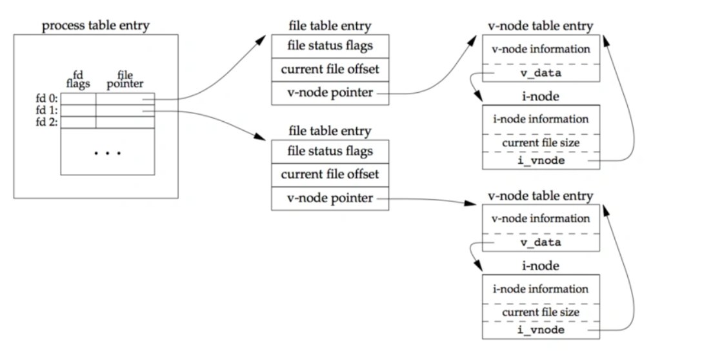	上图是一个完整的关于进程与文件关系的示意图。在最左侧是一个为每个进程独有的文件描述符表，他的本质是一个文件检索表，我们可以用文件描述符（file descriptor, fd)来检索对应的表项。

这里先介绍一下 fd 的性质：

- 每个进程具有自己的 fd 递增空间。已关闭的fd所占用的正整数是可能被重复利用的。单个进程能同时打开的fd数量是受到系统`limit`设置限制的。
- 按照约定，所有的`shell`在启动新应用程序的时候，总是将`0`、`1`、`2`这三个数字的描述符打开为`stdin`、`stdout`、`stderr`。它们在 C 中用宏命名，分别是 `STDIN_FILENO`，`STDOUT_FILENO`，`STDERR_FILENO`。

我们检索出的表项会指向叫做文件条目（file table entry）的东西，这个东西依然不是真实的文件。它可以看作是文件的状态，它记录这我们对这个文件的权限，当前读写的偏移量之类的信息。很容易想到，两个不同的文件条目可以对应同一个文件，只是存在权限和偏移量等状态信息的差异。这个文件条目表是所有进程共享的。

文件条目会含有一个指向 `v-node` 节点的指针，在这个上面才是记录着文件静态信息的控制块，才是每个文件与每个 `v-node` 一一对应。

总之我们在 C 语言编程时，要么使用 `fd`（最本质），要么使用 `FILE*` 去操控文件（应该是 C 提供的封装）。这里我们使用 fd ，因为我们一般用其实现重定向和管道，相关的系统调用的参数都是文件描述符。

### 1.3 文件的打开与关闭

在用户进程里可以通过系统调用实现，对于打开文件，我们有

```c
int open(char *filename, int flags, int mode);
```

可以利用。这个函数会打开文件名为 `filename` 的文件，其权限由 `flags` 描述，我们有一系列的宏，并且支持与操作

| 宏       | 含义                                                      |
| -------- | --------------------------------------------------------- |
| O_RDONLY | 只读                                                      |
| O_WRONLY | 只写                                                      |
| O_RDWR   | 可读可写                                                  |
| O_CREAT  | 如果文件不存在，就创建一个截断的（truncated, 即空的）文件 |
| O_TRUNC  | 如果文件已经存在，就截断它                                |
| O_APPEND | 在每次写操作前，设置文件位置到结尾处                      |

`mode` 指定了新文件的访问权限位，同样是有宏定义的，但是就不展开了，一般用 `0666` 就不会发生问题。

这个函数会返回打开文件的文件描述符 `fd` 。

当我们需要关闭一个文件的时候，可以这样

```c
int close(int fd);
```

### 1.4 读写文件

这个其实跟 shell 的实现没啥关系，但是还是第一次了解，记录一下，就是我们每次读写文件都会进行系统调用，但是这无疑是高代价的，因为频繁的在用户态和内核态间进行切换。

我们平常使用的 `getc` 之类的函数，叫做有缓冲的读写函数，他说的是，他会打开文件以后读取一整个缓冲区大小的信息，然后随着 `getc` 的调用，一个个从缓冲区往外递送，直到没有的时候，就再次系统调用填满整个缓冲区，比较方便。

### 1.5 重定向

有了上面的知识，就可以介绍重定向了，我们用到的函数是

```c
int dup2(int oldfd, int newfd);
```

这个函数说的是将 `oldfd` 对应的描述符表项复制到 `newfd` 表项。如果 `newfd` 没有对应文件，那么再次使用 `newfd` 的时候，其对应的文件就是 `oldfd` 文件对应的表项了。如果 `newfd` 有对应的文件，那么 `dup2` 会在复制 `oldfd` 之前关闭 `newfd`。返回值如果是负数，则说明失败了。

举个例子，则是未调用前

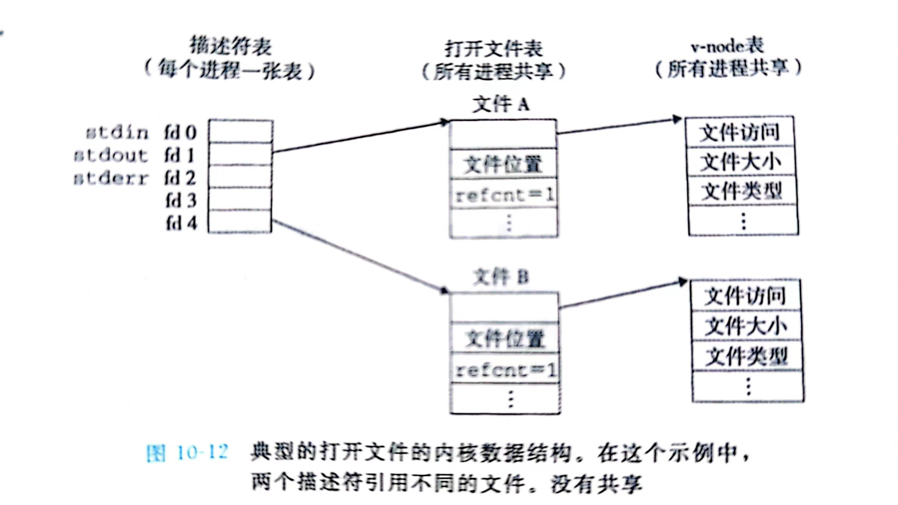

执行语句

```c
dup2(4,1)
```

就成了这样

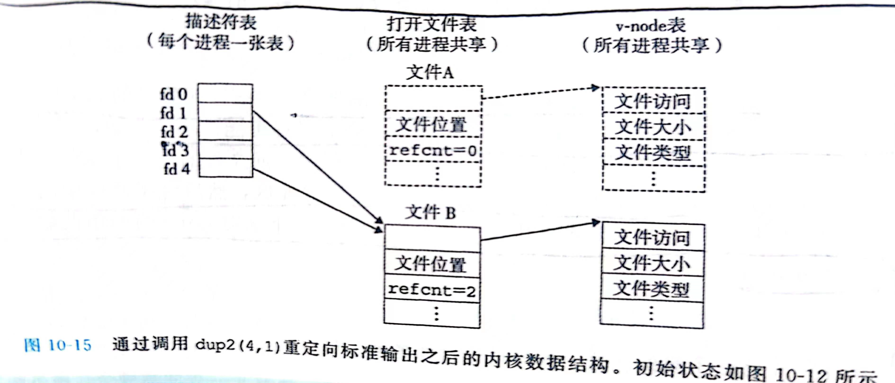

其实这就是对于 `stdout` 的重定向，以后所有对于 `stdout` 的操作都会指向 `fd=4` 的文件。

### 1.6 管道

管道也是要建立在前面的理解上的

```c
int pipe(int fd[2]);
```

执行成功返回 `0`，否则返回 `-1`。

成功时会修改 `fd` 数组内容，有规定：fd[0] → r； fd[1] → w。向管道文件读写数据其实是在读写内核缓冲区。无需 `open`，但需要手动 `close`。

其执行有示意图：


### 1.7 调用外部命令

我们可以使用如下函数

```c
int execvp(const char* command, char* argv[]);
```

需要注意的是，这个函数一般不会返回，也就是不会执行其之后的语句，所以如果执行了，那么就是报错。此外，`argv` 的最后一项一定是 `NULL`。

举个例子，比如说我们要输入如下命令

```bash
ls -a -l ~
```

那么对应的参数应该是

```c
command = "ls";
argv = {"ls", "-a", "-l", "~", NULL};
```


## 二、基本功能

### 2.1 需求分析

一开始的时候我十分害怕，因为觉得 shell 是跟操作系统沾边的，所以可能因为操作系统的知识不足，导致写不出来。后来随着深度的调研，我发现其实写一个 shell 并没有那么困难，一个简单的不实现重定向、管道、内置命令和后台命令的 shell，用 100 多行就可以写完了，其实其本质可以概括为自己实现一个 `system` 函数 。

对于重定向，其实只要在解析命令的时候将重定向符号 `<,>,>>` 单独识别出来，然后记录重定向的文件即可。在调用外部命令前先进行文件的重定向操作，再进行调用即可。

对于管道命令，因为题目要求只需要实现两个命令的管道连接即可，可以维护两个命令变量，然后在解析的时候识别出 `|` 的位置，然后据此将其切割为两个命令，然后分别进行重定向，就可以满足要求。但是“两个命令”不具有一般性，所以我拓展成了任意个管道命令的连接，效果会在后面演示，实现原理也会在后面介绍。

### 2.2 shell 程序流


因为解析过程较为复杂，在总流程图中展示过于冗杂。故画子流程图描述解析过程。

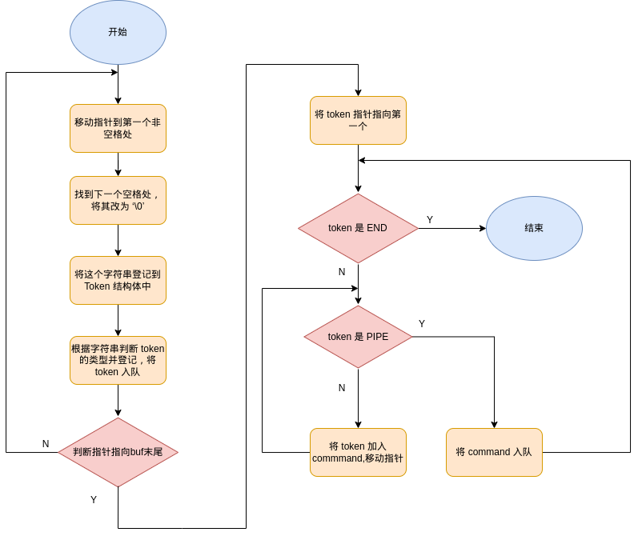

### 2.3 功能展示

#### 2.3.1 具有身份特征的命令行提示符

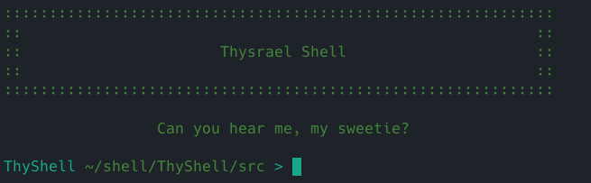

可以看到，在我的 shell 启动的时候，会首先打印 shell 名称 `Thysrael Shell`，然后在每一行的命令提示符的最左侧，都具有 `ThyShell` 的字样，这些都是具有编写者身份特征的字符。

#### 2.3.2 运行不带参数的外部命令

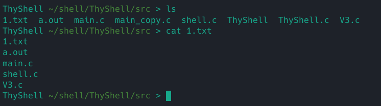

我们挑选 `ls` 作为检验对象，发现可以运行。

#### 2.3.3 支持 I/O 重定向

标准输出的重定向，可以看到无论是 `>` 还是 `>>` 均功能正常

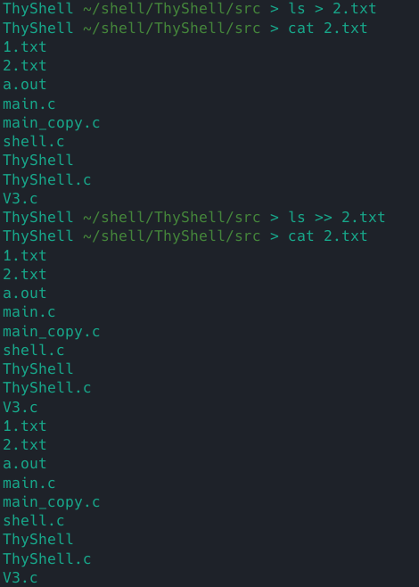

输入重定向

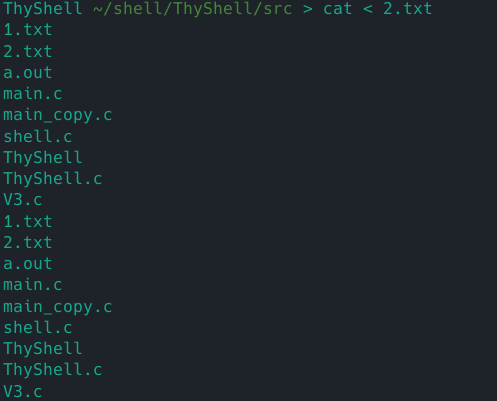

功能正常

#### 2.3.4 管道命令

可以通过管道连接两个命令

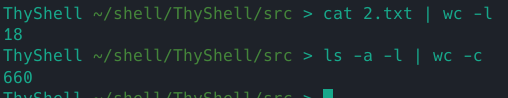

#### 2.3.5 管道与重定向组合

可以看到，无论是输入重定向还是输出重定向与管道结合都没有问题。

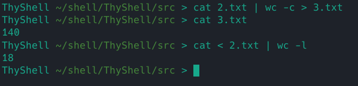

#### 2.3.6 代码量

`ThyShell` 所有代码均在 `ThyShell.c` 中实现，一共是 322 行，符合题意要求。

### 2.4 实现与系统调用


## 三、高级功能

### 3.1 打印并压缩路径

在命令提示符处，我打印了路径，并且实现了路径的压缩，即当路径中出现家目录的时候，会将 `/home/user_name` 压缩成 `~`

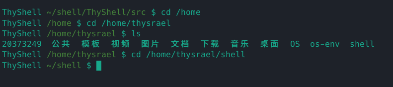

具体的实现方法是调用 `getcwd` 函数，就可以获得当前路径，在借助 `getenv` 函数，就可以获得当前的家目录路径，然后就可以进行比较并压缩，具体的实现代码如下

```c
void print_prompt()
{
    char *path = getcwd(NULL, 0);
    const char *home = getenv("HOME");
    if (strstr(home, path) == 0)
    {
        path[0] = '~';
        size_t len_home = strlen(home);
        size_t len_path = strlen(path);
        memmove(path + 1, path + len_home, len_path - len_home);
        path[len_path - len_home + 1] = '\0';
    }
    printf("ThyShell \033[0;32m%s\033[0m $ ", path);
    free(path);
}
```

### 3.2 quit 内置命令

实现效果如下

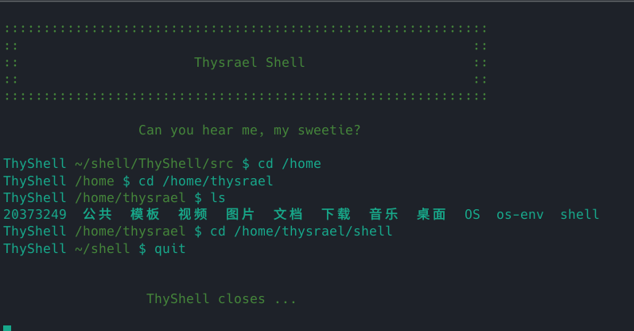

具体的方法是将 quit 也视为一个命令，然后在调用外部命令之前先进行判断，如果符合，则直接退出，实现代码如下

```c
int builtin_command(Command command)
{
    if (!strcmp(command.argv[0], "quit"))
    {
		quit();
    }
    else if (!strcmp(command.argv[0], "cd"))
    {
        if (chdir(command.argv[1]) != 0)
        {
            fprintf(stderr, "Error: cannot cd :%s\n", command.argv[1]);
        }
        return 1;
    }

    return 0;
}
```

### 3.3 cd 内置命令

效果演示如下

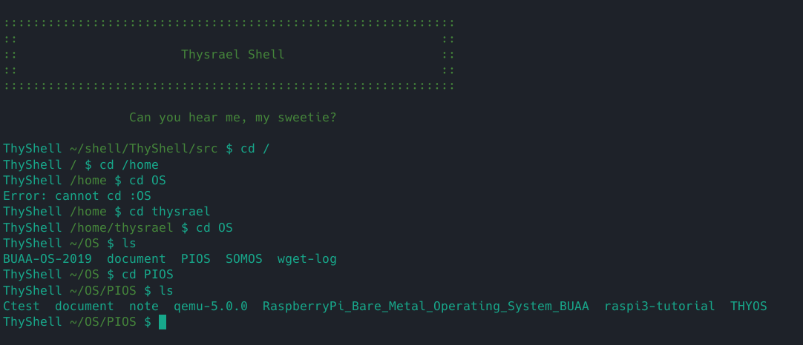

可以看到在用户权限下自由切换，实现的方法是使用 `chdir` 函数。具体的代码在 3.2 节。

### 3.4 错误检测

除了正常功能的运行，`ThyShell` 还具有异常检测功能，其可以检测 fork 异常，waitpid 异常和语法异常，具体的实现为将系统调用函数进行包装，这样既保证了功能的正常，也使代码具有简洁性，具体实现如下

```c
void unix_error(char *msg)
{
	fprintf(stderr, "%s: %s\n", msg, strerror(errno));
	exit(0);
}

pid_t Fork()
{
	pid_t pid;
	if ((pid = fork()) < 0)
	{
		unix_error("Fork error");
	}
	return pid;
}

void Wait(pid_t pid)
{
	int status;
	waitpid(pid, &status, 0);
	if (!WIFEXITED(status))
	{
		printf("child %d terminated abnormally\n", pid);
	}
}
```

### 3.5 多管道命令

`ThyShell` 可以实现多管道命令，具体演示如下：

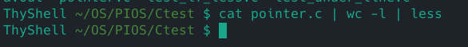

输入 `cat filename | wc -l | less` 可以出现如下图样


说明功能正常。

具体的实现可以参照流程图，思想是将命令行抽象成一个单独的层次，命令行可以包括一个或者多个命令。当出现管道命令的时候，需要开启管道后进行重定向。

### 3.6 带参数命令

这个在解析命令行的时候即可实现，参数会作为 `execvp` 的参数传递，具体实现如下

```c
execvp(command.argv[0], command.argv);
```

