## 一、OS 的启动过程

### 1.1 启动流程

在讲启动问题的时候，我手头其实可以参考的教材或者纸质资料并不多，如果有，很多也是偏向工具性的阐述，而不是理论化的结构。只能说是在这里给出一个直观的、不太严谨的描述，如果之后有了更深的理解，那么就在之后再说吧。

整个流程，应该是从 CPU 加电开始，到操作系统完全掌握硬件资源结束。

整个启动流程可以被总结为下面这张图：

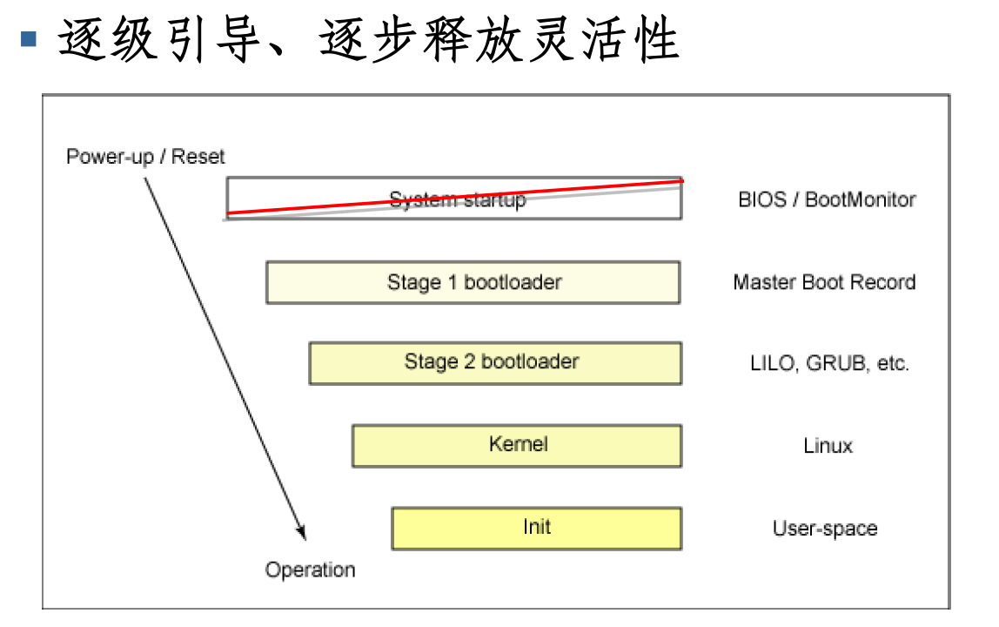

但是这张图似乎是不完善的，比如我在听课的时候听到的另一种流程：

- 加载 **BIOS** 的硬件信息与进行**自我检测**（自检），并根据设置取得第一个可启动的设备。
- 读取并执行第一个启动设备内 **MBR** 的**启动引导程序**（比如 grub2）。
- 根据**启动引导程序**的设置加载 **Kernel** 
- **Kernel** 会开始检测硬件与**加载驱动程序**。
- 在**硬件驱动**成功后，**Kernel** 会主动调用 **systemed** 程序（似乎就是 init 程序），并以 **default target** 流程启动。

当然，哪怕是我现在敲这些概念，我也没有完全掌握这些可怕的名词，只能说我能把我知道的记录在下面。

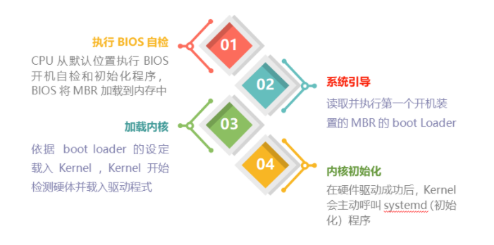

### 1.2 BIOS

#### 1.2.1 直观理解

即 Basic Input/Output System，这是我们启动操作系统的时候，第一个涉及的软件。也就是说，启动操作系统的第一步就是**加载BIOS**。

这里可以介绍一下加载程序的时候的背景，程序一定是 CPU 执行的，那么程序一定需要存在一个 CPU 够得着的地方。这种废话却引出了一个问题，就是 BIOS 本应是存在磁盘上的（就像大多数程序一样），因为放在内存里，一个停电，就啥都没了。可惜CPU 是没有办法直接访问磁盘的，一个程序必须先被搬运到内存中，然后才能被 CPU 访问。矛盾的是，决定把磁盘上面哪些东西搬到内存中，恰恰是操作系统的工作。

上面其实阐述了启动过程中的一个**普遍性**的矛盾，硬件调度需要操作系统已经启动，操作系统的启动需要硬件调度。这种“先有鸡还是先有蛋”的问题贯穿了整个启动。我们形象的称其为**“BootStrap”**（意思似乎是提着自己鞋子，把自己提上天，郭大侠的梯云纵）。

当然 BIOS 依然是给出了自己的解决办法的，就是把程序存在 ROM 中，ROM 和 RAM 是内存的组成成分，ROM 的好处是在断电以后并不会丢失程序，所以可以用来存放 BIOS。与之形成鲜明对比的是 RAM，这个在断电以后会变得乱糟糟的（不知道是不是清零），但是给人的直观感觉就是 RAM 在上电以后是一个杂乱的仓库，是没有办法存放东西的。而 ROM 的缺陷在于它是只读的，而只读的特性，大大限制了 BIOS 的功能。

值得一提的是，BIOS 并不被认为是一个传统意义上的软件，而是被称为是**固件**，强调的是其是写在 ROM 上不可更改的一段程序，而且与硬件联系即为紧密。

#### 1.2.2 功能

我觉得 BIOS 的功能可以被概括为两个部分，一个是进行自我检测（**Power-on self-test**），另一个是**设置读取启动顺序**（Boot Sequence），其实我觉得就是选择一个**启动设备**来进一步引导电脑（比如光盘，硬盘，USB）。

对于自我检测，其实可以看做是对照**电脑组件参数表**（比如 CPU 与内存的频率，网卡的各项配置参数）来进行检测。那么这些参数并没有存在 ROM 上，因为 ROM 的空间有限（ BIOS 一般几 MB）。而是写在了一个叫做 **CMOS** （与数字电路中的 CMOS 同名，但是应该只是重名）的芯片上，这个芯片需要借助额外的电源来使用记录功能，这也是主板上纽扣电池的作用。BIOS 干的事情就是读取 CMOS 上的信息，然后进行自我检测。

另一件事情就是**设置读取顺序**。这个也挺有意思的，尽管有诸多的限制，但是 BIOS 依然是实现了人机交互的（还实现了图像化界面），用户是可以通过 BIOS 来选择**启动设备**的，这个功能对安装操作系统，用 CD 引导电脑有作用。如图：

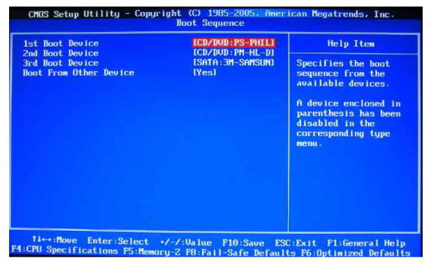

当完成了上面两件事情以后，我们可以说 BIOS 达到了他的最终目的**将引导的控制权交给了其他设备**。

BIOS 对电脑系统非常重要，因为它掌握了**系统硬件的详细信息和启动设备的选择**，但是电脑发展速度太快了，BIOS 的程序代码也需要做适度的修改。我们可以在主板官网上找到 BIOS 的更新程序。这与 ROM 的只读特性并不矛盾，是因为现在 BIOS 通常写入的是 flash 或者 EEPROM。

#### 1.2.3 UEFI

UEFI 即 Unified extensible firmware interface。我现在对它的理解就是他是 BIOS 的一种替代品，因为 UEFI 采用 C 语言，更容易开发，容错率更高，而且寻址能力更强。

### 1.3 引导程序

#### 1.3.1 直观理解

引导程序，即 **BootLoader** 是继 BIOS 后发挥功能的一个程序，他的主要目的是**硬件初始化和将内核文件加载到内存中**。BootLoader 就不是存在 ROM 上了，而是存在磁盘上了（至于是哪一个磁盘，或者其他啥的存储设备，都是由 BIOS 完成选择的）。在这个部分中我们会涉及一些**磁盘的硬件知识**。我个人认为，正是因为这些硬件知识，造成了理解上的障碍（即硬件知识和软件知识的穿插）。

关于 BootLoader，在指导书上说，它实现了软硬件的分离，即

> bootloader 主要负责硬件启动相关工作，同时操作系统内核则能够专注于软件启动以及对用户提供服务的工作，从而降低了硬件相关代码和软件相关代码的耦合度，有助于操作系统的移植。

此外，还有一个重要的直观理解，是 BootLoader 已经是可以看做是操作系统的组成成分之一了，对于不同的操作系统，我们有与之对应的不同的 BootLoader。

#### 1.3.2 磁盘硬件结构

硬件结构可以用两张图来介绍

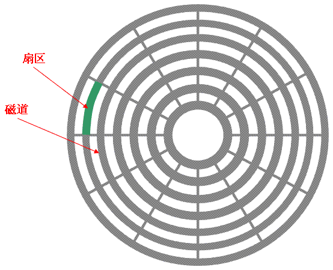

需要强调的是，**磁道**和**扇区**都是平面结构，而柱面是一个立体结构。应该这么说，长得像牛角包一样的扇区（不是扇子，它是一段圆弧，而不是一个披萨）绕成环组成了磁道，磁道就是一个圆圈（不是一个圆饼），磁道叠加起来，组成了柱面。但是这其实是物理结构概念。我们从软件角度去理解的话，只需要理解成两层结构就够了，即 `柱面 -> 扇面`。

其中**柱面**（cylinder）是文件系统的单位（文件系统跟实际存储又是两码事），也是分区的单位。而**扇区**（sector）是物理上的最小单位，一般为 512 字节或者 4K 字节。可以看成很多个扇区组成了柱面（忽略了磁道这一层）。

在介绍之前，还是先强调，尽管我已经记忆无数次了，但是我依然记不清磁盘的硬件结构。我觉得这有两个原因，一个是他是个立体的，而且很多示意图画的很不清楚（比如我无数次记忆扇区是披萨型的，其实很没道理，因为这样就不是**划分**了）。另一个是我没有将它的上层抽象搞出来，导致我没办法跟所学到的知识联系在一起，以后注意即可。

#### 1.3.3 磁盘分区

大概一个磁盘示意图就长这个样子

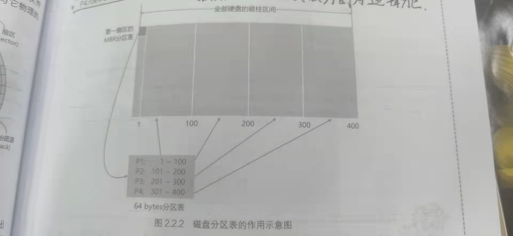

跟之前描述的很像，1,100,200……这些编号说的都是柱面，一共是 400 个柱面（假设），然后很多个 sector （方形的）堆成了一个长条的柱面。

磁盘是需要分区的，这是因为有如下考量

- 数据安全性：不同的分区的数据是**分开**的，当我们整理分区的时候（比如格式化某一个分区），并不会影响其他分区。
- 系统性能：由于数据是**集中**的，所以数据查找和读取的速度都会变快。

我们对分区也是有分类的，有如下示意图：

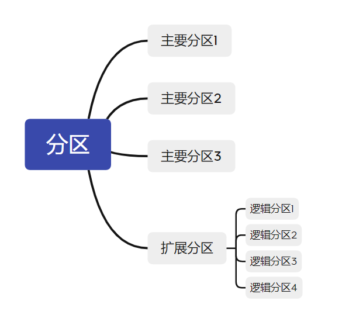

可以看到分区一共有三个种类：

- 主要分区：就是最普通的分区，可以被格式化。
- 拓展分区：可以进一步被细分为逻辑分区，不可以被格式化。
- 逻辑分区：由拓展分区持续划分出来的分区，可以被格式化。

对于分区，我们有如下约束：

- 主要分区和拓展分区的总数最多为 4 个（这是硬盘的限制，其实就是第一个 sector 里分区表最多只能记录四个区的信息）
- 拓展分区最多只有 1 个（操作系统的限制）
- 逻辑分区的数量取决于操作系统，Linux 中 SATA 硬盘可以超过 63 个。

我们为了记录分区信息，需要一种叫做**分区表**的结构，这种结构可以用于记录分区信息。在第一幅图中，可以看到在第一扇区里的分区表，它规定了四个分区。

分区表不仅会出现在**第一扇区**（不然只会有四个分区），还会出现在拓展分区，这里的分区表，记录的就是逻辑分区的内容。如下图所示：

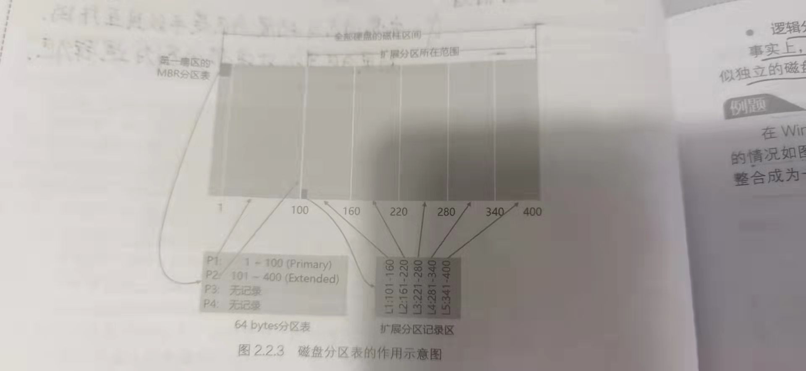

#### 1.3.4 启动扇区

之所以花了 1.3.2 和 1.3.3 两节，来讲与操作系统启动关系不大的硬件概念，主要就是为了这节打基础。Boot Sector 即**启动扇区**，可以看成每个分区都拥有的一个**特殊的扇区**，然后我们要讲的 **MBR**（Master Boot Record，主引导记录）就是在第一柱面第一扇区，它就是一个**启动扇区**。也就是逻辑关系 `扇区 -> 启动扇区 -> MBR`。

MBR 的结构如下

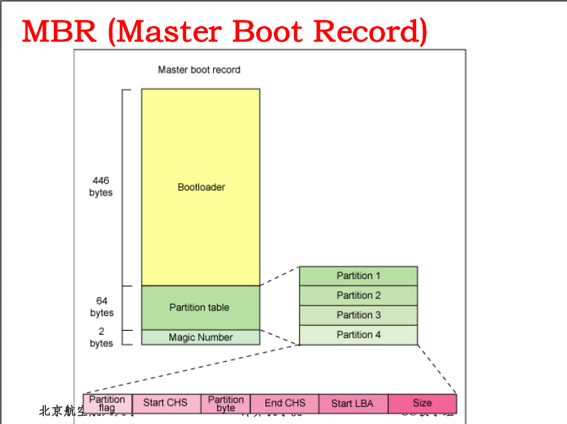

可以看到，这个扇区基本上有两部分组成（一共是 512 字节），BootLoader 占了 446字节，而分区表占了64字节。我们在 1.2 提到的 BIOS 会去读取 MBR （当然是选中的设备的 MBR），这样，就完成了控制权的交接。那么其他的 boot sector 怎么办？他们存在的意义其实是为了**多系统**服务的，在不同的分区上安装不同的操作系统，不同的操作系统有不同的 boot sector。但是如果默认读取 MBR 上的 BootLoader，那么其他的 boot sector 就没有意义了。

这就引出了一个重要的概念，即**多重引导**，即在 MBR 上的 Boot Loader 可以**将启动管理功能转交给其他的启动引导程序负责**，也就是下面的示意图

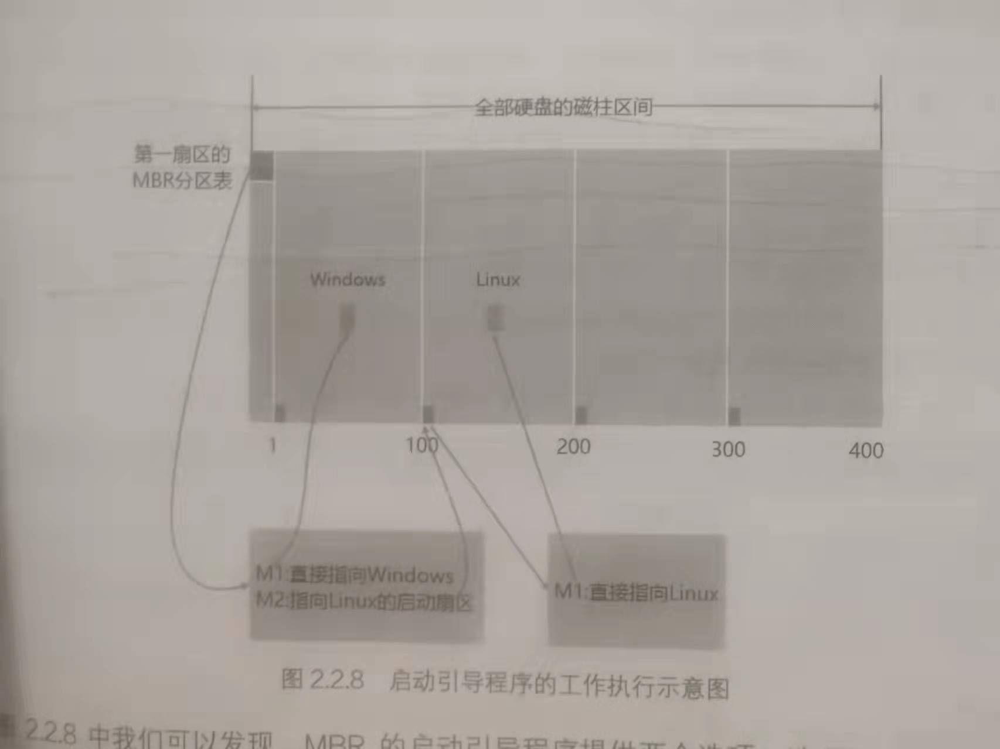

#### 1.3.5 引导程序功能

常见的 BootLoader 有 grub2 和 LILO，我不太清楚他们的区别。他们实现的功能就如图吧

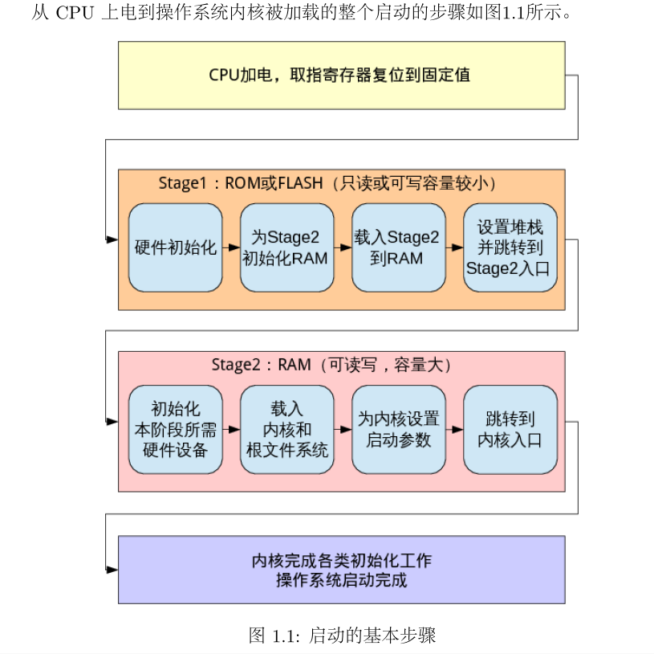

可以看到是分成了 stag1 和 stag2 的，具体的划分界限，我也是不清楚的。反正最终目的就是**加载内核到内存中**。

### 1.4 内核启动

这个的资料就更少了，应该说只有幻灯片上有，其他地方我都没有找到一点蛛丝马迹。只能说我们清楚的知道，这个环节的目的是**检测硬件**和**加载驱动程序**。

检测硬件这个还是比较好理解的，就是类似于 BIOS 曾经干过的活儿，内核又干了一遍。

关键是**加载驱动程序**，驱动程序是我们使用硬件的基础，而硬件中有个东西叫做磁盘，在没有驱动程序之前，我们是没有办法使用磁盘的。我们之前使用磁盘，可以说是相当固定化的一种方法，这也造成了运行程序不能太大，不能太灵活的限制，现在我们要的是灵活的软件，所以再一次出现了**梯云纵**问题，想要大软件，就要读磁盘，要读磁盘，就要磁盘驱动，磁盘驱动就是一个大软件。

在解决这个矛盾之前，我需要先补充一个概念，那就是**模块（moudle）** 驱动程序就是一种模块。

>Linux操作系统的内核是单一体系结构(monolithic kernel)的。也就是说，整个内核是一个单独的非常大的程序。与单一体系结构相对的是微内核体系结构(micro kernel)，比如Windows NT采用的就是微内核体系结构。对于微内核体系结构特点，操作系统的核心部分是一个很小的内核，实现一些最基本的服务，如创建和删除进程、内存管理、中断管理等等。而文件系统、网络协议等其它部分都在微内核外的用户空间里运行。
>
>这两种体系的内核各有优缺点。使用微内核的操作系统具有很好的可扩展性而且内核非常的小，但这样的操作系统由于不同层次之间的消息传递要花费一定的代价所以效率比较低。对单一体系结构的操作系统来说，所有的模块都集成在一起，系统的速度和性能都很好，但是可扩展性和维护性就相对比较差。
>
>据作者理解，正是为了改善单一体系结构的可扩展性、可维护性等，Linux操作系统使用了一种全新的内核模块机制。用户可以根据需要，在不需要对内核重新编译的情况下，模块能动态地装入内核或从内核移出。
>
>模块是在内核空间运行的程序，实际上是一种目标对象文件，没有链接，不能独立运行，但是其代码可以在运行时链接到系统中作为内核的一部分运行或从内核中取下，从而可以动态扩充内核的功能。这种目标代码通常由一组函数和数据结构组成，用来实现一种文件系统，一个驱动程序，或其它内核上层的功能。模块机制的完整叫法应该是动态可加载内核模块(Loadable Kernel Module)或 LKM，一般就简称为模块。与前面讲到的运行在微内核体系操作系统的外部用户空间的进程不同，模块不是作为一个进程执行的，而像其他静态连接的内核函数一样，它在内核态代表当前进程执行。由于引入了模块机制，Linux的内核可以达到最小，即内核中实现一些基本功能，如从模块到内核的接口，内核管理所有模块的方式等等，而系统的可扩展性就留给模块来完成。

内核是存在 `/boot` 中的，而模块是存在 `/lib/modules` 中的。

然后我们来看设计者是怎么解决梯云纵问题的，他们引入了一个叫做**虚拟文件系统**的东西，一般存在 `/boot/initrd` 或者 `/boot/initramfs` 中，这个文件也可以通过 BootLoader 加载到内存中，然后会在内存中解压缩并模拟出一个根目录（也就是一个低配的文件系统），这个文件系统可以提供一个程序来加载启动过程中的需要的**内核模块**，也就是各种驱动程序。如图

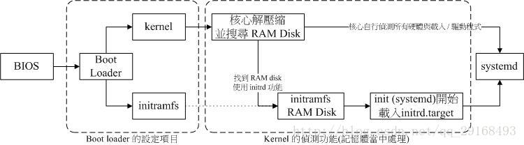

### 1.5 系统初始化

Kernel启动，并进行完硬件检测与驱动程序加载之后，主机的硬件已经准备就绪了，这时kernel会主动呼叫第一个程序，就是systemd（linux下的一种init软件）。systemd最主要的功能就是准备软件执行的环境，包括系统的主机名称，网络，语言，档案格式以及其他服务的启动等。

- 执行 sysinit.target 初始化系统及 basic.target 准备操作系统
- 执行 multi-user.target 下的本机与服务器服务
- 执行 multi-user.target 下的 /etc/rc.d/rc.local 文件
- 执行 multi-user.target 下的 getty.target 及登录服务
- 执行 graphical 需要的服务

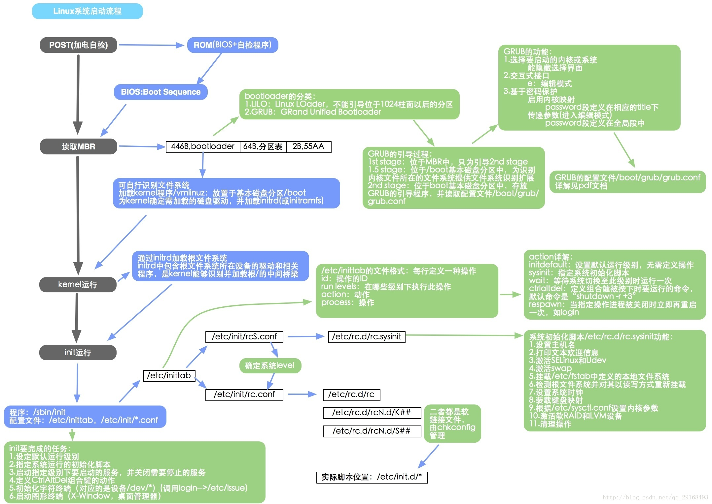

---

## 二、优化分析

### 2.1 最耗时的启动过程

由操作系统启动过程分析我们知道，BIOS 自检过程会对 CPU、内存、显卡、外设等硬件设备（包括中断向量，设置寄存器）进行检测和初始化，所以CPU、内存、外设这些硬件设备的性能好坏会对操作系统启动造成影响。除了硬件对启动造成影响，软件过多也会对降低操作系统的启动速度。

　例如，我们安装了打印机、扫描仪、USB硬盘等设备后，由于USB接口速度较慢，因此相应设备会对电脑启动速度有较明显的影响；如果设置了网卡，网络会自动获取IP地址，系统在启动时就会不断在网络中搜索服务器。

　而最耗时的部分应该是操作系统**自启动软件程序**时，当软件过多或者插件过多时，操作系统启动变慢。

这里很有意思，一开始在说 BIOS，而后面则开始讲 BootLoader。我觉得是 BootLoader 的可能性大一些，因为 BootLoader 的操作系统特异性，给我感觉有点像我那种会受我 C 盘空间影响的软件。

### 2.2 现有的优化措施

- 对用户软件和安装的插件进行优化处理，删除不必要的软件和插件；
- 对硬件性能做更进一步优化，加快数据计算、读写和传输速率。

### 2.3 优化建议

- 对个人用户的软件和插件进行优化；
- 由于硬件方面优化程度已经接近极限，所以不建议优化硬件了；
- 减少外部设备的接入或安装；
- 断开操作系统启动后不需要的驱动或设备。