## 一、gcc

### 1.1 一步到位

gcc 最简单的用法

```bash
gcc c_name.c						# 会产生一个 a.out 的可执行文件
```

这样会生成一个叫做 `a.out` 的可执行文件。

如果想要指定生成文件的名字，可以采用 `-o` 选项，也就是 `output`。比如下面的指令

```bash
gcc -o hello hello.c
```

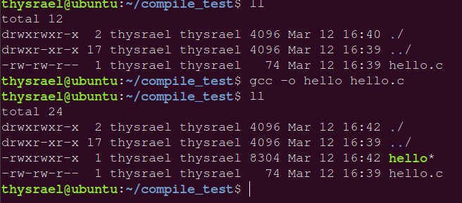

这个 `-o` 参数可以跟在后面讲的所有指令后面，也就是说，可以给所有生成的中间文件进行命名。

如果想要最佳化执行速度，可以使用下面的命令：

```bash
gcc -O c_name.c
```

可以根据操作环境最佳化执行速度

如果想要显示警告信息，可以用 `-Wall` 参数，如下

```bash
gcc -o hello hello.c -Wall
```

这样一步到位，似乎只能适用于比较低端的情况，如果想要更细致的操作，需要了解整个编译的流程，即图：

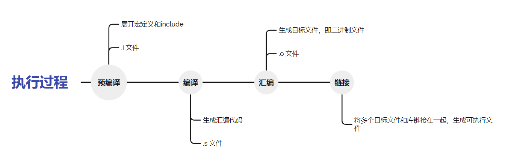

### 1.2 预处理

在这个过程就是展开宏定义和include文件，可以使用如下命令

```
gcc -E c_name.c
```

但是直接使用这条命令，不会生成一个 `.i` 文件，而是将展开结果直接输出到终端，所以得指定一个名字

```
gcc -E c_name.c -o i_name.i
```

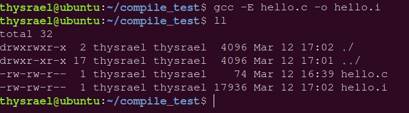

生成完的文件会特别丑，大概这样：

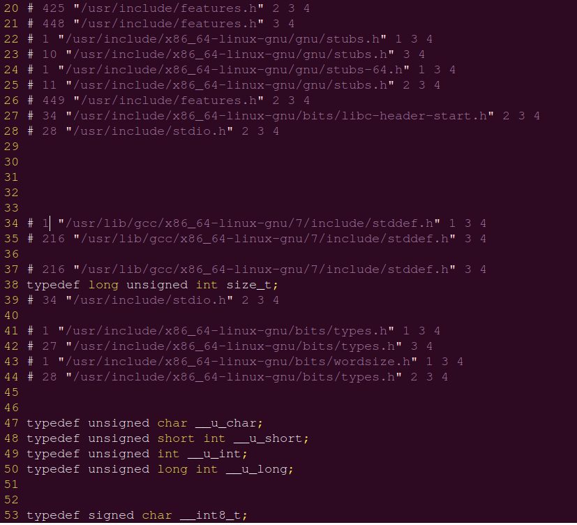

在这里，我们还有一个问题，就是**头文件**在哪里，我们系统一般会把头文件存在 `/usr/include` 下（ `/usr` 不是user的缩写,其实usr是**Unix Software Resource**的缩写, 也就是Unix操作系统软件资源所放置的目录,而不是用户的数据;所有系统默认的软件都会放置到 `/usr`），这个文件夹长这样，里面有我们常用的头文件

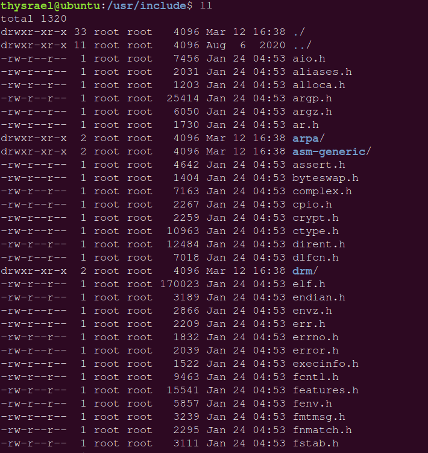

当然我们也可以使用指令来指定我们的头文件：

```bash
gcc c_name.c -I head_path
```

为了演示这个功能，我们在我们的工作目录下创建是三个文件，一个文件夹，如图

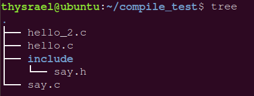

其中 `hello_2.c` 中内容如下

```c
#include<stdio.h>
#include<say.h>

int main()
{
    say();

    return 0;
}
```

`say.c` 中内容如下

```c
#include<stdio.h>

void say()
{
    printf("Hello, world!\n");
}
```

`say.h` 中内容如下

```c
#ifndef SAY_H
#define SAY_H

void say();

#endif
```

如果直接编译，会发现会报错

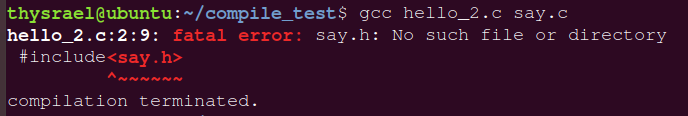

这是因为没有找到头文件，所以我们需要用 `-I` 参数来选择我们自己的头文件

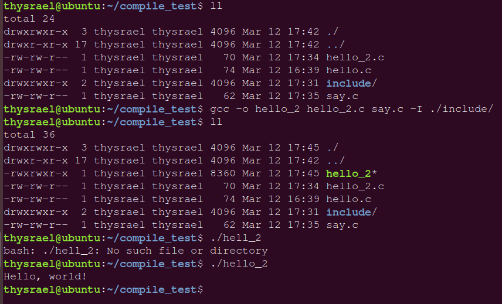

### 1.3 编译

编译就是将高级语言生成汇编代码的过程，有如下命令

```bash
gcc -S c_name.c
```

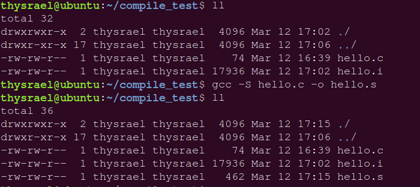

汇编代码长这样：

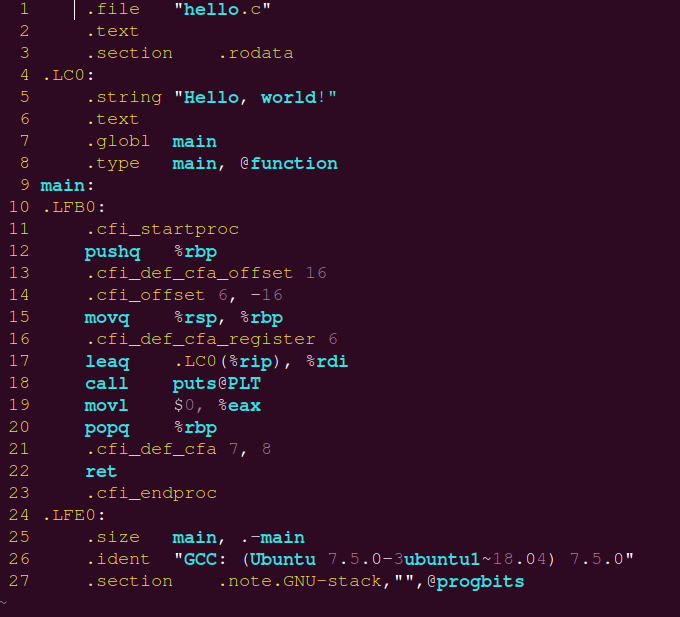

### 1.4 汇编

进行汇编可以生成**ELF格式**目标文件，命令为

```bash
gcc -c c_name.c
```

 这条命令后会生成 `c_name.o` ，此时已经是**二进制文件**了，所以不能用 vim 查看，而改成用 `od` 命令进行查看，如图

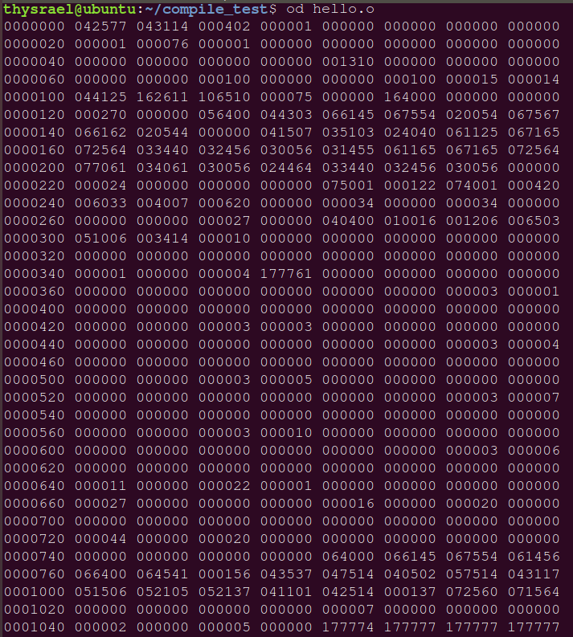

### 1.5 链接

链接是将多个目标文件和库链接到一起，生成可执行文件的过程，由下图可以看到，目标文件不具有可执行权限（就是没有 x ）

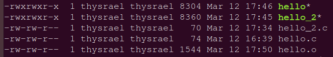

这里我们还是用 `hello_2` 来举例，因为它是一个多文件项目，我们编译出目标文件

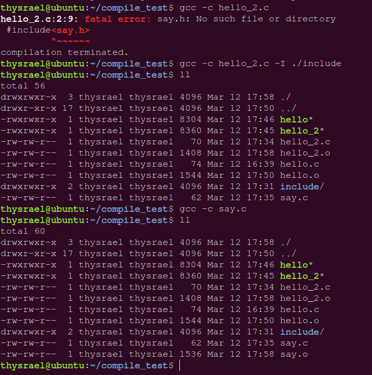

然后进行链接

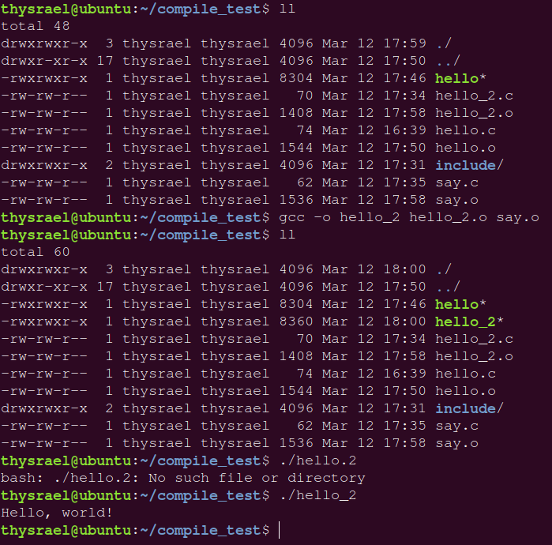

链接的时候会用到库文件，系统默认的库文件是在 `/lib` ，库文件分为**静态库**和**动态库**，静态库和动态库的区别体现在程序的链接阶段：静态库在程序的链接阶段被复制到了程序中；动态库在链接阶段没有被复制到程序中，而是程序在运行时由系统动态加载到内存中供程序调用。后缀与库文件对应关系

| 类型   | Linux | Windows |
| ------ | ----- | ------- |
| 静态库 | `.a`  | `.lib`  |
| 动态库 | `.so` | `.dll`  |

库文件目录大概长这样

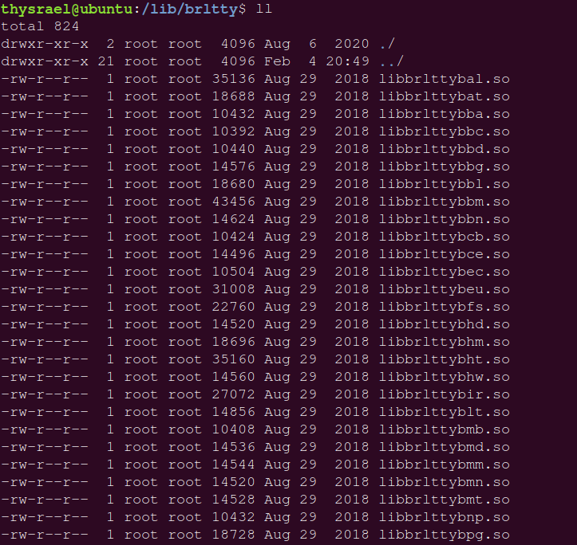

库文件同样是二进制文件，大概长这样

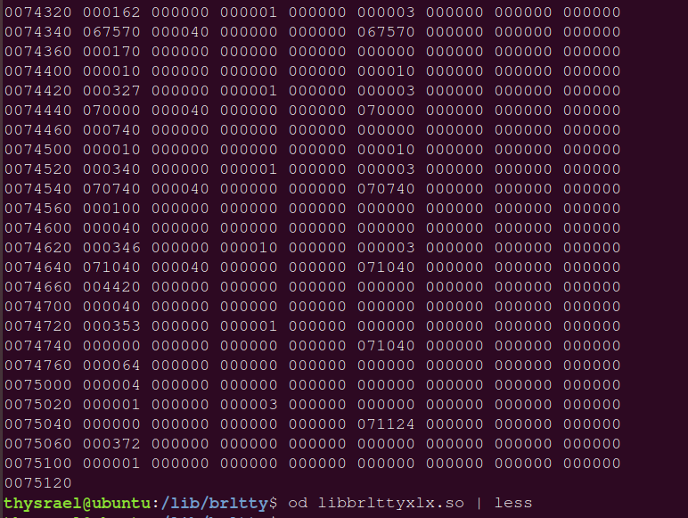

我们同样可以指定查找库的目录和特定的库，但是因为我不会写库文件，所以就没有示例了

```bash
gcc sin.c -lm -L/lib 		# 调用 libm.so 或者 libm.a，库的索引目录是/lib
```

其中 `-L` 说明了库文件的索引目录，`-l` 说明了调用的库。

说道最后，介绍一下标准操作格式：

```bash
gcc -o ELF_name object1.o object2.o
```
### 1.6 反汇编

**objdump**是用查看目标文件或者可执行的目标文件的构成的 gcc 工具。有如下参数

```bash
--archive-headers 
-a 
显示档案库的成员信息,类似ls -l将lib*.a的信息列出。 

-b bfdname 
--target=bfdname 
指定目标码格式。这不是必须的，objdump能自动识别许多格式，比如： 

objdump -b oasys -m vax -h fu.o 
显示fu.o的头部摘要信息，明确指出该文件是Vax系统下用Oasys编译器生成的目标文件。objdump -i将给出这里可以指定的目标码格式列表。 

-C 
--demangle 
将底层的符号名解码成用户级名字，除了去掉所开头的下划线之外，还使得C++函数名以可理解的方式显示出来。 

--debugging 
-g 
显示调试信息。企图解析保存在文件中的调试信息并以C语言的语法显示出来。仅仅支持某些类型的调试信息。有些其他的格式被readelf -w支持。 

-e 
--debugging-tags 
类似-g选项，但是生成的信息是和ctags工具相兼容的格式。 

--disassemble 
-d 
从objfile中反汇编那些特定指令机器码的section。

-D 
--disassemble-all 
与 -d 类似，但反汇编所有section.

-EB 
-EL 
--endian={big|little} 
指定目标文件的小端。这个项将影响反汇编出来的指令。在反汇编的文件没描述小端信息的时候用。例如S-records. 


-f 
--file-headers 
显示objfile中每个文件的整体头部摘要信息。

-h 
--section-headers 
--headers 
显示目标文件各个section的头部摘要信息。  

-H 
--help 
简短的帮助信息。 

-i 
--info 
显示对于 -b 或者 -m 选项可用的架构和目标格式列表。 

-j name
--section=name 
仅仅显示指定名称为name的section的信息 

-l
--line-numbers 
用文件名和行号标注相应的目标代码，仅仅和-d、-D或者-r一起使用使用-ld和使用-d的区别不是很大，在源码级调试的时候有用，要求编译时使用了-g之类的调试编译选项。 

-m machine 
--architecture=machine 
指定反汇编目标文件时使用的架构，当待反汇编文件本身没描述架构信息的时候(比如S-records)，这个选项很有用。可以用-i选项列出这里能够指定的架构. 

--reloc 
-r 
显示文件的重定位入口。如果和-d或者-D一起使用，重定位部分以反汇编后的格式显示出来。 

--dynamic-reloc 
-R 
显示文件的动态重定位入口，仅仅对于动态目标文件意义，比如某些共享库。 

-s 
--full-contents 
显示指定section的完整内容。默认所有的非空section都会被显示。

-S 
--source 
尽可能反汇编出源代码，尤其当编译的时候指定了-g这种调试参数时，效果比较明显。隐含了-d参数。 

--show-raw-insn 
反汇编的时候，显示每条汇编指令对应的机器码，如不指定--prefix-addresses，这将是缺省选项。 

--no-show-raw-insn 
反汇编时，不显示汇编指令的机器码，如不指定--prefix-addresses，这将是缺省选项。 

--start-address=address 
从指定地址开始显示数据，该选项影响-d、-r和-s选项的输出。 

--stop-address=address 
显示数据直到指定地址为止，该项影响-d、-r和-s选项的输出。 

-t 
--syms 
显示文件的符号表入口。类似于nm -s提供的信息 


-T 
--dynamic-syms 
显示文件的动态符号表入口，仅仅对动态目标文件意义，比如某些共享库。它显示的信息类似于 nm -D|--dynamic 显示的信息。 

-V 
--version 
版本信息 

--all-headers 
-x 
显示所可用的头信息，包括符号表、重定位入口。-x 等价于-a -f -h -r -t 同时指定。 

-z 
--disassemble-zeroes 
一般反汇编输出将省略大块的零，该选项使得这些零块也被反汇编。

@file 可以将选项集中到一个文件中，然后使用这个@file选项载入。
```


---


## 二、make

### 2.1 基本原理

代码变成可执行文件，叫做编译（compile）；先编译这个，还是先编译那个（即编译的安排），叫做**构建**。`Make` 就是一个帮助我们进行构建的**程序**。这个程序需要以一个叫做 `Makefile` 的文件作为输入。

关于具体的工作流程，我觉得应该是 `Makefile` 起到一个类似与脚本（与 bash 的语法很像）的作用，而 `Make` 作为一个脚本解释器，可以去执行 `Makefile` 中的命令。

那么为什么不直接写脚本呢，这是因为 make 的优势在于，他并不是每次都执行所有的命令（对于只修改了一个源文件的项目，将整个项目都编译一遍，过于大费周章）。而是只会编译相对于前面项目有改变的文件。

### 2.2 基本格式

```makefile
<target1> : <prerequisites1> 
[tab]  <commands1>

<target2> : <prerequisites2> 
[tab]  <commands2>
```

### 2.3 目标

其实 `Makefile` 更像是一种脚本的集合，每个目标其实可以看做是一个脚本，当我们使用命令

```bash
make someTarget
```

的时候，其实就类似于调用了 target 对应的脚本。

此外，如果直接输入命令

```bash
make
```

那么就执行第一个目标。

### 2.4 依赖

**依赖**，即 prerequisites。我们在 2.1 提到的**编译变动**的功能，是通过**依赖**来实现的，make 某个目标前，make 会检验该目标对应依赖的时间戳，如果发现距离上一次编译有改动，那么就重新编译。所以依赖不是真的依赖，而是一个检验记号，比如说这样的写法

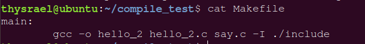

尽管我理论上需要依赖 `hello_2.c, say.c, ./include/` 文件，但是我不写，它照样能跑。

### 2.5 命令

正是因为 `make` 的大部分语法与脚本相像，所以**注释，通配符，变量赋值**就不写了，我在其他博客里写了。在这里主要讲一下**自动变量（Automatic Variables）**

```makefile
$@ 		# 即当前的 target

$<		# 指代第一个前置条件。比如，规则为 t: p1 p2，那么$< 就指代p1
$(<D) 	# 指向 $< 的目录名
$(<F) 	# 指向 $< 的文件名

$^ 		# 指代所有前置条件，之间以空格分隔
$?		# 指代比目标更新的所有前置条件，之间以空格分隔。
```

