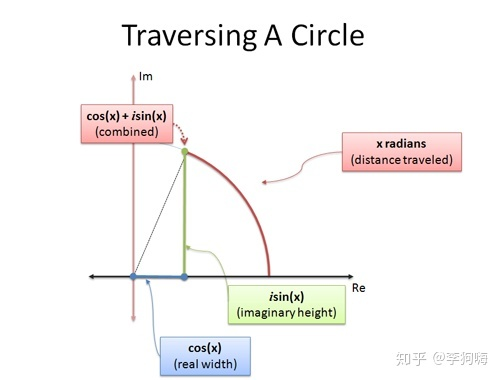

这篇文章里是有关数学分析中多个基本功的总结。

其中大量的知识在大物，数学建模，数学竞赛中使用。

<!-- more-->

# 基本功
## 一、求和

### 1.1 总论

**求和**的地位跟**极限**类似，是数学分析中的**基础操作**，因为利用求和，可以沟通**柯西收敛原理**，又是**级数**的**预处理步骤**，所以总结求和的方法就显得尤为重要了。

### 1.2 利用幂级数进行求和

这个的特征一般是**阶乘**，$n(n+1)$ ，$2^n$ 这种结构。
$$
\sum_{n=1}^{\infty}(-1)^n\frac{n(n+1)}{2^n}
$$

这个没有办法用**数项级数求和**的办法求和，所以是用**转化成函数项级数求和**的方法进行计算的。可以将式子看成
$$
S(x)=\sum_{n=1}^{\infty}(-1)^n\frac{n(n+1)}{2^n}x^n
$$
很明显，往上积分两次就可以得到**等比数列求和**，然后往下求导就可以了。

在这里列一下比较常见的**泰勒级数**

#### 1.2.1 阶乘类

$$
e^x=1+x+\frac{1}{2!}x^2+\dots+\frac{1}{n!}x^n+\dots
$$

$$
\sin x=x-\frac{1}{3!}x^3+\frac{1}{5!}x^5+\dots+(-1)^{n-1}\frac{1}{(2n-1)!}x^{2n-1}+\dots
$$

$$
\cos x=1-\frac{1}{2!}x^2+\frac{1}{4!}x^4+\dots+(-1)^{n}\frac{1}{2n!}x^{2n}+\dots
$$

#### 1.2.2 等比级数类

$$
\frac{1}{1-x}=1+x+x^2+\dots+x^n+\dots
$$

$$
\frac{1}{1+x}=1-x+x^2+\dots+(-x)^n+\dots
$$

$$
\frac{1}{1-x^2}=1+x^2+x^4+\dots+x^{2n}+\dots
$$

#### 1.2.3 等差特征类

$$
ln(1+x)=x-\frac{x^2}{2}+\frac{x^3}{3}+\dots+(-1)^n\frac{x^n}{n}+\dots
$$

$$
\arctan x=x-\frac{x^3}{3}+\frac{x^5}{5}+\dots+(-1)^n\frac{x^{2n-1}}{2n-1}+\dots
$$

可以看到**等差特征**求导就可以得到**等比特征**，这也正是依靠幂级数的分析性质（积分微分）来获得这些级数的。

#### 1.2.4 双阶乘特征类

$$
\sqrt{1+x}=1+\frac{1}{2}x-\frac{1}{8}x^2+\dots+(-1)^{n-1}\frac{(2n-3)!!}{(2n)!!}x^n+\dots
$$

$$
\frac{1}{\sqrt{1+x}}=1-\frac{1}{2}x+\frac{3}{8}x^2+\dots+(-1)^{n}\frac{(2n-1)!!}{(2n)!!}x^n+\dots
$$

$$
\frac{1}{\sqrt{1-x^2}}=1+\frac{1}{2}x^2+\frac{3}{8}x^4+\dots+\frac{(2n-1)!!}{(2n)!!}x^{2n}+\dots
$$

$$
\arcsin x=x+\frac{1}{6}x^3+\frac{3}{40}x^5+\dots+\frac{(2n-1)!!}{(2n)!!}\frac{1}{2n+1}x^{2n+1}+\dots
$$

可以看到这一组基本上就对求和没啥帮助了，双阶乘的特征不易观察，但是这一组都是由**幂函数**展开得来的，录于此也是为了全面。

### 1.3 裂项求和

#### 1.3.1 反正切函数裂项

$$
\arctan (\frac{x-y}{1+xy})=\arctan x-\arctan y
$$

有了这个公式就可以完成完成如下裂项
$$
\arctan (\frac{1}{2n^2})=\arctan \frac{1}{2n-1}-\arctan \frac{1}{2n+1}
$$

#### 1.3.2 积化和差裂项

对于求和 $\sum\sin nx$ ，可以进行如下处理
$$
\sum_{k=1}^\infty \sin kx\\
=\frac{1}{\sin \frac{x}{2}}\sum_{k=1}^\infty\sin \frac{x}{2}\sin kx\\
=\frac{1}{2\sin \frac{x}{2}}\sum_{k=1}^\infty \cos (kx-\frac{x}{2})-\cos (kx+\frac{x}{2})\\
<=\frac{1}{\sin \frac{x}{2}}
$$
对于 $\sum\cos nx$ 也有相同结论。除了处理这种简单的求和，还可以处理一些复杂的结构，如：
$$
S_n=\sum_{n=1}^{\infty}q^n\cos nx\\
2qcosxS_n=\sum_{k=1}^{\infty}q^{k+1}[\cos (k+1)x+\cos(k-1)x]
$$
然后再进行化简，其实后面的方法是**构造一个关于 $S_n$ 方程** ，就是高中时**求等差与等比相乘**数列的算法，现在因为有了更好的**级数**工具后，使用频次减少。

### 1.4 利用积分的定义求和

### 1.5 柯西求和

柯西求和的条件更为宽松，在这里可以探讨一下**什么结构是不好求和的**？我认为是三角函数，尤其是三角函数内还有其他结构的时候，但是由三角函数组成的结构往往又是**收敛**的，所以用**柯西收敛原理**直接放缩成1就显得很容易。**柯西求和**还有一个特点是对分母的关注远大于分子，可以在下面的例子中看出。
$$
|S_{3n+p}-S_{3n}|=|S_{6n}-S_{3n}|\\
=\frac{1}{3n+1}+\frac{1}{3n+2}-\frac{1}{3n+3}\dots+\frac{1}{6n-2}+\frac{1}{6n-1}-\frac{1}{6n}\\
>\frac{1}{3n+3}+\frac{1}{3n+3}-\frac{1}{3n+3}\dots+\frac{1}{6n}+\frac{1}{6n}-\frac{1}{6n}\\
>\frac{1}{3}(\frac{1}{2n}+\dots+\frac{1}{2n})=\frac{1}{6}>\varepsilon_0
$$

$$
\lvert\frac{\sin(n+1)!}{(n+1)!}+\frac{\sin(n+2)!}{(n+2)!}+\dots+\frac{\sin(n+p)!}{(n+p)!}\rvert\\
<=\frac{1}{(n+1)!}+\frac{1}{(n+2)!}+\dots+\frac{1}{(n+p)!}\\
<=\frac{1}{n(n+1)}+\frac{1}{(n+1)(n+2)}+\dots+\frac{1}{(n+p-1)(n+p)}\\
<\frac{1}{n}<\varepsilon
$$

-----

## 二、求极限

### 2.1 估算次数

#### 2.1.1 双阶乘比值

$$
\frac{1}{2\sqrt {n}}<\frac{(2n-1)!!}{(2n)!!}<\frac{1}{\sqrt {2n}}
$$

证明如下：

$$
\frac{(2n-1)!!}{(2n)!!}=\frac{\sqrt1*\sqrt1*\sqrt3*\sqrt3*\sqrt5\dots \sqrt{2n-1}*\sqrt{2n-1}}{2*4*6\dots*2n}\\
=1*\frac{\sqrt3}{2}*\frac{\sqrt{15}}{4}\dots*\frac{\sqrt{(2n-3)(2n-1)}}{2n-2}*\frac{\sqrt{2n-1}}{2n}\\
<\frac{\sqrt{2n-1}}{2n}<\frac{1}{\sqrt{2n}}
$$

#### 2.2.2 阶乘

由Stirling公式知：
$$
n!\sim \sqrt{2\pi n}(\frac{n}{e})^n
$$

#### 2.2.3 复杂分式

$$
\frac{1}{\sqrt n+(-1)^n}
$$

要注意到分式其实就是-1次方，所以是可以用**泰勒公式**进行化解的，有
$$
\frac{1}{\sqrt n+(-1)^n}=\frac{1}{\sqrt n}\frac{1}{1+\frac{(-1)^n}{\sqrt n}}=
\frac{1}{\sqrt n}[1-\frac{(-1)^n}{\sqrt n}+o(\frac{1}{n})]\sim \frac{1}{n}
$$

#### 2.3.4 三角函数周期

我们可以利用三角函数的周期性使他**吸收或排除**一个 $(-1)^n$ 结构，不仅可以用于求阶次，还可以用于化简。

这个是**求阶次**：
$$
\sin (\pi\sqrt {n^2+1})=(-1)^{n+1}\sin(n\pi-\pi\sqrt{n^2+1})=(-1)^{n+1}\sin\frac{\pi}{n+\sqrt {n^2+1}}\sim \frac{1}{n}
$$

这个是**化简**，这样就可以采用Dirichlet判别法了：
$$
\sum(-1)^n\frac{\cos 2n}{2n}=\sum\frac{\cos(2n+n\pi)}{2n}
$$

### 2.2 $1^{\infty}$ 型极限

我们要客观的评价这件事，就是确实利用 $1^{\infty}$ 型极限可以看出很多难求的极限，比如
$$
(\frac{2n^2+n+1}{2n^2+5n+4})^{\frac{n+1}{2}}
$$
但是这种处理的本质是**等价无穷小**代换，如果再遇到比如需要明确知道阶数的题目，这个方法容易使人产生惰性，如
$$
e-(1+\frac{1}{n})^n
$$
他的阶数是 $\frac{1}{n}$ 是通过泰勒展开获得的，但是容易让人麻爪。

----

## 三、微分方程

### 3.1 变量分离方程与齐次方程

满足如下结构被称为**变量分离方程**
$$
\frac{dy}{dx}=\frac{f(x)}{g(y)}
$$
这种情况就是进行如下变化
$$
f(x)dx = g(y)dy
$$
然后就可以进行积分了
$$
\int f(x)dx = \int g(y)dy
$$
而满足如下结构被称为**齐次方程**
$$
\frac{dy}{dx}=f(\frac{y}{x})
$$
在这种情况下，先利用 $u = \frac{y}{x}$ 进行换元，得到
$$
\frac{dy}{dx}=f(u)
$$
同时由 $u = \frac{y}{x}$ 可以得出
$$
dy = udx + xdu
$$
带入可得
$$
u + x \frac{du}{dx} = f(u)
$$
整理可得
$$
\frac{1}{f(u) - u} du = \frac{1}{x}dx 
$$
可以看到，**齐次方程**是**换元法**结合**变量分离**得出的技术，这两种方法基本上是人的计算范围内的方法。

### 3.2 一阶线性微分方程与伯努利方程

形如这种结构的方程被称为**一阶线性微分方程**
$$
\frac{dy}{dx}+P(x)y=Q(x)
$$
其解为：
$$
y=Ce^{-\int P(x)dx}+e^{-\int P(x)dx}\int Q(x)e^{\int P(x)dx}dx
$$
可以看出解呈现出**一个特解加上齐次通解**的结构。	

而伯努利方程为
$$
\frac{dy}{dx}+P(x)y=Q(x)y^n
$$
也是可以通过**换元法**转化成**一阶线性微分方程**求解的。在处理**非齐次方程式**，用到了**常数变异法**，大概是不能为人所想到的。

### 3.3 二阶线性齐次微分方程

形如这种结构的方程被称为**二阶线性齐次微分方程**
$$
y^{\prime\prime}+py^\prime+qy=0
$$
对于这种方程，首先要将其转为**特征根方程**，并解出 $x=r_1, r_2$
$$
r^2+rx+q=0
$$
然后据此进行分类讨论，一共有**三种情况**

- $r_1, r_2$ 为两互异实根，则通解为

$$
y=C_1e^{r_1 x}+C_2e^{r_2 x}
$$

- $ r_1, r_2$ 为两重根，则通解为
  $$
  y=C_1e^{rx}+C_2xe^{rx}
  $$

- $ r_1, r_2$ 为两互异虚根 $r_1=\alpha+\beta i,r_2=\alpha-\beta i$，则通解为
  $$
  y=e^{ax}(C_1\cos\beta x+C_2\sin\beta x)
  $$
  其实关于互异的虚根，是可以用统一的方法处理的
  $$
  e^{r_1 x} = e^{ax}(\cos \beta x +i\sin \beta x),\quad\quad e^{r_2 x} = e^{ax}(\cos \beta x -i\sin \beta x)
  $$
  因为我们想要实函数，所以基础解系进行重新构造
  $$
  y_1 = \frac12 (e^{r_1 x} + e^{r_2 x}) = e^{ax}\cos\beta x,\quad\quad
  y_2 = \frac12 i(e^{r_2 x} - e^{r_1 x}) = e^{ax} \sin\beta x
  $$
  所以才有了最后的结构
  $$
  y=e^{ax}(C_1\cos\beta+C_2\sin\beta)
  $$
  

### 3.4 二阶线性非齐次方程求解

依然是采取**通解+特解**的思路，求通解的方法在上一节已经介绍过了，这一节主要介绍**求特解**的方法。有两种情况，其中 $P_m(x), Q_m(x)$ 均指最高次项为 $m$ 的多项式。在确定特解的样子后，采用待定系数法求解即可。

#### 3.4.1 $y^{\prime\prime}+py^\prime+qy=P_m(x)e^{ax}$ 型

- 当a不是特征方程的根时，特解为

$$
y=Q_m(x)e^{ax}
$$

- 当a是特征方程的单根时，特解为
  $$
  y=xQ_m(x)e^{ax}
  $$

- 当a是特征方程的重根时，特解为
  $$
  y=x^2Q_m(x)e^{ax}
  $$
#### 3.4.2 $y^{\prime\prime}+py^\prime+qy=P_m(x)e^{ax}\cos\beta$  或 $y^{\prime\prime}+py^\prime+qy=P_m(x)e^{ax}\sin\beta$型

- 当 $\alpha+\beta i$ 不是特征方程的根时

$$
y=e^{ax}(C_1 Q_m(x)\sin\beta x+C_2R_m(x)\cos\beta x)
$$

- 当 $\alpha+\beta i$ 是特征方程的根时
  $$
  y=xe^{ax}(C_1Q_m(x)\sin\beta x+C_2R(m)\cos\beta x)
  $$

----

## 四、积分

### 4.1 点火公式

$$
I_n=\int_{0}^{\frac{\pi}{2}}\cos ^nxdx=\int_{0}^{\frac{\pi}{2}}\sin ^nxdx\\
I_n=\frac{n-1}{n}I_{n-2}\\
I_n=\begin{cases}\frac{(n-1)!!}{(n)!!}\frac{\pi}{2}\quad n偶\\\frac{(n-1)!!}{(n)!!}\quad n奇\end{cases}
$$

### 4.2 割函数积分

$$
\int\sec xdx=\int\frac{\cos x}{\cos^2x}dx=\int\frac{d\sin x}{\sin^2x-1}=\frac{1}{2}\ln|\frac{1+\sin x}{1-\sin x}|+C=\ln |\sec x+\tan x|+C
$$

$$
\int\csc xdx=\ln |\csc x+\cot x|+C
$$

### 4.3 有理函数积分

首先需要把**有理多项式**的积分，首先应该把它化为**多项式**和**真分式**的和，在把**真分式**分解成**部分分式**的形式，对于**部分分式**的四种**基本类型**，都是可以进行积分的。

另外需要强调的是，这种**预处理**几乎是必须的，它并不像三角函数那样可以跳过，这是必须的。
$$
\int\frac{1}{x-a}dx = ln|x-a|+C
$$
$$
\int\frac{1}{(x-a)^n}dx = \frac{1}{1-n}(x-a)^{1-n}+C
$$

$$
\int\frac{Mx+N}{x^2+px+q}dx 首先要对分子进行配方，转变成这种形式
$$

$$
\int\frac{Mu+b}{u^2+a^2}du= \frac{M}{2}\int\frac{d(u^2+a^2)}{u^2+a^2}+b\int\frac{du}{u^2+a^2}=\frac{M}2ln(u^2+a^2)+\frac b aarctan\frac u a+C
$$
可以看到，主要利用的是**配方法**和**arctanx的微分**，这种形式一定要熟悉。
$$
\int\frac{Mx+N}{(x^2+px+q)^n}dx=\frac M2\int\frac{u^2+a^2}{(u^2+a^2)^n}+b\int\frac{du}{(u^2+a^2)^n}
$$
现在难点就落在对最后一项的积分上了，这个是需要**迭代**才能积分出来的。较为复杂。有（**这里真的很复杂，首先（1）中那个构造就很反人类，然后（2）中分部积分的时候，居然把分子拆开了，也是不太常见，所以一定要背过**）
$$
I_n=\int\frac{du}{(u^2+a^2)^n}=\frac 1 {a^2}\int\frac{u^2+a^2-u^2}{(u^2+a^2)^n}du\tag{1}=\frac{I_{n-1}}{a^2}+\frac{1}{a^2}\int\frac{-u^2}{(u^2+a^2)^n}du
$$
所以问题的交点又变成了对最后一项的积分，采用**分部积分**有
$$
\int\frac{u^2}{(u^2+a^2)^n}du=\frac12\int\frac{u}{(u^2+a^2)^n}d(u^2+a^2)=\frac{1}{2(1-n)}(\frac{u}{(u^2+a^2)^{n-1}}- I_{n-1})\tag2
$$

### 4.4 积分逻辑

#### 4.4.1 微分的观察

积分的**最基本**逻辑一定是对微分的观察，下面罗列几个比较有用的
$$
(\arctan x)^{\prime}=\frac{1}{x^2+1}，(\arccot x)^{\prime}=-\frac{1}{x^2+1}
$$
这个结合**配方法**可以用来处理分子是**有实数解二次项**的式子。
$$
(\arcsin x)^{\prime} = \frac{1}{\sqrt{1-x^2}},(\arccos x)^{\prime} = -\frac{1}{\sqrt{1-x^2}}
$$
这个可以用于处理一部分的含根式的积分。
$$
(\tan x)^{\prime}=\sec^2x,(\cot x)^\prime=-\csc^2x,(\sec x)^\prime=\tan x\sec x,(\csc x)^\prime=-\cot x\csc x
$$
这四个主要是用于全部由三角函数组成积分项，因为化简的时候会所涉及积分变换。

#### 4.4.2 分部积分

对于分部积分，对**部分求导**和对**部分积分**所能达到的一种**均衡**。有些函数求导可以使其结构简单，有些函数积过分以后还是很好积分，下面分类讨论。

适合求导的函数：x的多项式，求几次就没了，就可以处理其他结构了。lnx，求完就变成多项式了，而且他也**没法积分**（这也是考量的要点），与他相同的还有反三角函数，因为没有办法直接积分，相反求导起码可以变成**多项式**或者**根式**。三角函数，积几次就变成原来了，就可以构造循环了。

适合积分的函数：$e^x$​​，积分完后还是本身。1，这个积分完以后就是x。$\sec^2x$ 这种，积分完是 $\tan x$ 然后再进行操作，比如
$$
\int\sec^3xdx=\int\sec x\sec^2 xdx=\sec x\tan x-\int\sec x(\tan x)^2dx=\sec x\tan x-\int\sec^3 xdx+\int\sec xdx
$$

#### 4.4.3 形式变换

### 4.5 根式函数积分

### 4.5.1 将根式换掉

这个方法适合于含 $\sqrt{ax+b}$，$\sqrt{\frac{ax+b}{cx+d}}$。这种方法的本质是可以将 $t = f(x)$ 这个解出来，而且解还是一个比较容易处理的，如果解出来**还是根式**，那么还不如不换。

#### 4.5.2 将根号下换掉

这个比较容易观察，如果是 $R(^n\sqrt x,^m\sqrt x)$的形式，那就令 $x=t^{mn}$ 即可。

#### 4.5.3 利用三角函数换元

因为我们有
$$
1-\sin^2x=\cos^2x,\sec^2x-1=\tan^2x，\sec^2x=\tan^2x+1
$$
这样的式子，所以可以说，只要是二次项，都可以用三角函数换掉。所以只要先**配方**，然后代换，就可以了。当然更快的直接用反函数。

### 4.6 特殊积分

#### 4.6.1 正态分布

$$
I=\int e^{x^2}dx
$$

$$
I^2=\int e^{-x^2}dx\cdot\int e^{-y^2}dy=\iint e^{-x^2-y^2}dxdy=-\int^{2\pi}_0d\theta\int^{+\infty}_0re^{-r^2}dr=\pi
$$

$$
I=\sqrt \pi
$$

### 4.7 二重积分

#### 4.7.1 将重积分转换为累次积分

只要是**可积**的，那么重积分就**一定**能转换成累次积分。也就是说，这是重积分必须进行的一步，然后还需要把积分区域分成x型区域，和y型区域。

#### 4.7.2 对称性

##### 4.7.2.1 对称性

要求**积分区域**和**被积函数**都具有对称性。对于被积函数，如果有 $f(x,y,z)=f(-x,y,z)$ 或者 $f(x,y,z)+f(-x,y,z)=0$ 就认为具有**对x具有对称性**，对于**积分区域**，积分区域的表示方程或方程组有 $D(x,y,z)=D(-x,y,z)$ 就认为可以使用对x可以使用对称性解题了。

##### 4.7.2.2 轮换对称性

只要求**积分区域具有对称性**，这种对称性只的是如果在表示积分区域的方程中两个变量可以交换位置，那么可以构造出一些函数，里面对应的变量也可以交换位置，比如说
$$
x^2+y^2<=1
$$
那么就有
$$
\int xdxdy=\int ydxdy\space\space\space\space\space\space\int x^2dxdy=\int y^2dxdy\space\space\space\space\space\space \int x^2ydxdy=\int xy^2dxdy
$$
利用这个性质可以大幅化简一些复杂的多项式。

这种对称性与上面的不同，上面的是对于一个变量具有对称性，比如对x有对称性，但是**轮换对称性**指的是两个不同的变元之间具有对称性，满足 $D(x,y,z)=D(y,x,z)$ 那么就可以在积分函数中进行 $f(x,y,z)=f(y,x,z)$​ 的代换，一般都是自己**构造函数**，可以消去某些量。

#### 4.7.3 换元法

常用的是**极坐标换元**，但是还是有必要强调一下换元的通识，**面积微元**一旦被换掉，是需要乘一个**雅克比矩阵**的行列式的，这是很好理解的，因为代换的本质是**代换面积微元**，不同的面积微元的面积是不同的，一个行列式的值刚好可以弥补这种差距，要是细说，就是**外积分**了。

但是需要强调的是，一旦进行了换元，我们的正负就得自己判断了，这点在**积分杂谈**中也有体现，为了计算的速度，牺牲了严谨性，这不是换元法带来的，而是从**重积分转成累次积分**就有的代价。正因如此，我们在积分前才要考虑对称性（这是必须要做的），因为只有这样，才方便我们判断积分的正负。

对于积分的上下限，之前我一直没有弄懂，其实有一个很好的判断标准，就是**极点与积分区域的关系**（在p151）

- 极点在积分区域外，则 $\theta$ 的限制是相切曲线的夹角，r 的上下限是两个函数
- 极点在积分区域边界上，则 $\theta$ 的限制是相切曲线的夹角，r 的上限是一个函数，下限是0
- 极点在积分区域内，则 $\theta$ 是 0 到 $2\pi$ ，r 的上限是一个函数，下限是0

---

## 五、证明方法

### 5.1 证明常值恒等式

这种常值恒等式一般是通过求导后导数为零来进行证明的：

当 $S(x)=\sum \frac{x^n}{n^2}$ ，求证
$$
S(x)+S(1-x)+\ln x \times \ln(1-x)=C
$$
可知，这样的求导就可以了。

###  5.2 反证法

因为反证可以获得一个新的性质，所以用处比较多，比如若证明**发散**，正面证明的话只有**必要条件**和**柯西**两条路，但是如果先假设他**收敛**，那么很多**收敛**的性质就可以使用了。

---

## 六、其他知识

### 6.1 欧拉公式

$$
e^{ix} = \cos x+i\cdot\sin x
$$

证明可以用 $e^x,\sin x,\cos x$​的**泰勒级数**带入虚数单位即可。 

这个公式是有极好的直观理解的，他可以看做是对复数的一种**在复平面内实现的一种旋转**，旋转的角度就是x

