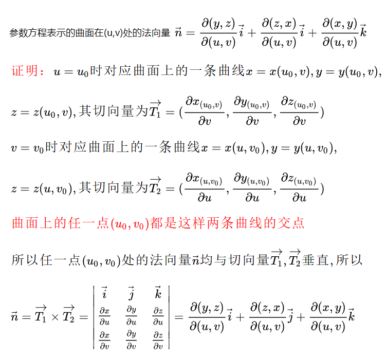

## 一、求极限

### 1.1 先化简

对于x趋于0，$e^{-x^2}$ 这种复杂的结构其实就是1。

### 1.2 减法式子化乘法

对于x趋于0，$\sqrt{1-x^3}- 1$ 当然要化成乘法了，这个其实是用**广义二项式定理**做的，属于**等价无穷小**，或者**泰勒级数**。

### 1.3 熟悉常见的泰勒级数

$$
e^x=1+x+\frac{1}{2!}x^2+\dots+\frac{1}{n!}x^n+\dots\\
\sin x=x-\frac{1}{3!}x^3+\frac{1}{5!}x^5+\dots+(-1)^{n-1}\frac{1}{(2n-1)!}x^{2n-1}+\dots\\
\cos x=1-\frac{1}{2!}x^2+\frac{1}{4!}x^4+\dots+(-1)^{n}\frac{1}{2n!}x^{2n}+\dots\\
(1+x)^p=1+px+p(p-1)x^2+p(p-1)(p-2)x^3+p(p-1)(p-2)(p-3)x^4+\dots\\
\frac{1}{1-x} = 1+x+x^2+x^3+\dots
$$

还有一个好玩的，
$$
\arctan x = x-\frac{1}{3}x^3+\frac15x^5-\frac17x^7+\dots
$$
这个为啥这么规整，是因为可以这样求
$$
\frac1{1+x^2} = 1-x^2+x^4-x^6+\dots
$$
这个式子是把之前这个式子中的x换成 $-x^2$ 得到的
$$
\frac{1}{1-x} = 1+x+x^2+x^3+\dots
$$
然后arctanx求导就是这个，所以往上积分就可以得到。

### 1.4 再谈比较幂次

我在数学分析基本功里讲过这个事情，可以通过记忆比较常见的函数的幂次，就可以判断一些极限，但是这个方法阐述的不是很完善，现在再次阐述一下。

采用比较阶数的极限一定是**分式型**极限，对于求极限，那么显然极限是**存在**的，那么首先，利用这个性质，我们就可以先考虑对加减型的分子进行拆项，如果是可以拆开的，那么每个拆完的分式都是有极限的。拆完以后可以化简问题。

那么怎样判断极限是否存在呢？那么就是**分子的最小幂次只能大于等于分母的最小幂次**。这就是最本质的道理。只要不满足这个条件，极限就不存在，当等于的时候，会有一个非零极限，当小于的时候，极限为0。

那么怎样利用这个性质呢？那么就是应该充分利用**麦克劳林展开**，然后再用**柯西乘积**，**大胆的舍弃高幂次的项**，就可以很快的判断极限，比如
$$
\lim_{x\rightarrow0}\frac{1-\cos x(\cos 2x)^\frac{1}{2}(\cos 3x)^\frac{1}{3}}{x^2}
$$
虽然是大部分是乘积形式的，但是只要胆子大，还是可以算的。首先，一旦幂次超过2，那么就不用考虑了，因为极限为0。所以要考虑就只有这样
$$
\cos x=1-\frac12x^2+o(x^2)\\
(\cos 2x)^\frac12 = 1-x^2+o(x^2)\\
(\cos 3x)^\frac13 = 1-\frac32x^2+o(x^2)
$$
而且也不用把他们完全乘开，只需要看幂次等于和小于2的项就好了（等于的用于出结果，小于的用于和其他小于的项消掉，不然极限就不存在了）。所以有
$$
\cos x(\cos 2x)^\frac{1}{2}(\cos 3x)^\frac{1}{3} = 1-3x^2+o(x^2)
$$
最后就可以得到答案3了。

----

## 二、微分

### 2.1 隐函数全微分

隐函数求导到底什么是最重要的？他跟普通的求导有什么区别？我们要怎样看待这种区别？我觉得这些问题都可以用**将求导转化为求全微分**解决，这种求法是我刚刚想出来的，让我花点时间解释一下。

**传统的**隐函数求导需要回答**对谁求导？**这个问题，这个问题在显函数之中是不存在的，谁是自变量，对谁求导，但是对于隐函数，这种东西是不靠谱的，比如一个简单的隐函数
$$
x^2+y^2=1
$$
那么为什么是要求成这种形式
$$
2x+2yy^\prime = 0
$$
这种因为**极其不对称**而极其丑陋的东西。

而且当隐函数出乘题目的时候，就会更加恶心（恶心表现在两方面**求导繁琐易错**和**做不出来**），比如这个题
$$
已知y^2(x-y) = x^2,求证：\int\frac{1}{y^2}dx=\frac{3y}x-2ln|\frac xy|+C
$$
因为知道是个隐函数题目，所以就先隐函数求导看看吧，结果巨难求，而且求完以后发现还要把后面那个式子等号两边求一下导，还是在是y而不是y(x)的情况下，就恶心至极，然后还解不出来，看了答案发现需要完成 $t=\frac xy$的换元才能做，这就很搞人心态。

但是如果是按全微分形式求呢？条件可以写成这样
$$
(y^2-2x)dx+(2xy-3y^2)dy=0
$$
哪怕这个时候再转成导数，也不要太简单。而且众所周知，分式（对应求导）比乘式（对应全微分）进行代数处理要方便许多。然后后面一路平趟，超级简单。

### 2.2 多元隐函数全微分

教材中给的还是结果，教材隐去了**全微分列方程组**，**将方程组转化成矩阵**，**利用克莱姆法则求解矩阵**这三个过程，直接上来**莫名其妙行列式**（相当于克莱姆法则的应用）。就让人摸不着头脑。我不知道我在这里哪怕记录下最原本的过程，过了一段时间以后会不会就忘记了，但是还是勉力记下吧。

我们以一道例题为例
$$
\begin{cases}
u^2 + v^2 - x^2 - y^2 = 0\\
-u + v - xy + 1 = 0
\end{cases}\tag1
$$
求 $\frac{\partial u}{\partial x},\frac{\partial u}{\partial y},\frac{\partial v}{\partial x},\frac{\partial v}{\partial y}$。我们先看看全微分形式的答案是怎样的
$$
\begin{cases}
du = \frac{\partial u}{\partial x}dx + \frac{\partial u}{\partial y}dy\\
dv = \frac{\partial v}{\partial x}dx + \frac{\partial v}{\partial y}dy
\end{cases}\tag2
$$
然后对于给出的隐函数求个全微分，看看会出现啥结果
$$
\begin{cases}
-2udu + 2vdv - 2xdx - dy = 0\\
-du + dv - ydx -xdy = 0
\end{cases}\tag3
$$
所以答案就很明显了，因为（3）是一个四元两项的方程组，所以基础解系是二维的，可以用dx和dy表示du和dv。那么他们前面的系数就是我们要求的偏导。

（3）是可以整理成矩阵形式的，就是
$$
\left[\begin{matrix}
-2u & 2v\\
-1 & 1
\end{matrix}\right]\cdot
\left[\begin{matrix}
du \\
dv
\end{matrix}\right]=
\left[\begin{matrix}
2x & 1\\
y & x
\end{matrix}\right]\cdot
\left[\begin{matrix}
dx\\dy
\end{matrix}\right]
$$
要是再粗糙一些，就可以用克莱姆法则解这个式子了（忽略dx，dy向量），但是这不是我要说的，我的方法就是普通的**高斯消元**。最后可以解得
$$
\begin{cases}
du = \frac{x - vy}{u + v}dx + \frac{1 - 2vx}{2v + 2u}dy\\
dv = \frac{x + uy}{u + v}dx + \frac{1 + 2ux}{2v + 2u}dy
\end{cases}
$$
只要让对应项相等就可以了。

如果上升到理论的高度，我们可以这样概括，对于多元的隐函数，通过求全微分，可以得到这样的一组式子
$$
\begin{cases}
F_udu + F_vdv + F_xdx + F_ydy = 0\\
G_udu + G_vdv + G_xdx + G_ydy = 0
\end{cases}
$$
然后一定可以整理成（或者求解成）这种形式：
$$
\begin{cases}
du = \frac{\partial u}{\partial x}dx + \frac{\partial u}{\partial y}dy\\
dv = \frac{\partial v}{\partial x}dx + \frac{\partial v}{\partial y}dy
\end{cases}
$$
其他的都是花活。

---

## 三、积分

### 3.1 莱布尼茨公式

### 3.2 第一型的积分微元

在这里，如果没有直观化的理解，就很容易忘记第一型的**线元**或者**面元**的公式，而且遇到比如参数方程，或者是普通方程组，要是只背了一个公式，就很容易麻爪，所以这一节的目的是**直观线元和面元的推导**。

线元和面元的推导其实原理都建立于解析几何上，准确的说，是建立在**角度**上，而**角度**又与真正的积分微元和法向量或者切向量有关。

对于线元，我们有
$$
ds = \frac{dx}{\cos \alpha}
$$
其中dx可以是dx，也可以是dy，是dt，是啥都行，只要是**具体的积分微元**就可以，$\alpha$ 是dx与ds的夹角，那么夹角是怎样求出来的呢，其实就是曲线的切向量与dx的内积除以切向量的模长。比如当曲线用参数方程表示的时候，切向量和切向量的模长
$$
n = (x^\prime(t), y^\prime(t), z^\prime(t)) ,|n|=\sqrt{x^\prime(t)^2 + y^\prime(t)^2 + z^\prime(t)^2}
$$
如果用dx做积分微元，那么此时 $\cos\alpha$就是
$$
\cos\alpha = \frac{x^\prime(t)}{\sqrt{x^\prime(t)^2 + y^\prime(t)^2 + z^\prime(t)^2}}=\frac{1}{\sqrt{1 + y_x^2 + z_x^2}}
$$
如果用dt作为积分微元，那么此时 $\cos\alpha$就是
$$
\cos\alpha = \frac{1}{\sqrt{x^\prime(t)^2 + y^\prime(t)^2 + z^\prime(t)^2}}
$$
对于面元，同样也有这种思考，即
$$
dS = \frac{dydz}{\cos\alpha} = \frac{dzdx}{\cos\beta} = \frac{dxdy}{\cos\gamma}
$$
最后还是要落实到求角度的问题，比如 $\alpha$ 就是dx与法向量的夹角（这里用了几何知识），所以求这个，其实就是
$$
\cos\alpha = \frac{F_x}{\sqrt{F_x^2 + F_y^2 + F_z^2}} = \frac{1}{\sqrt{1 + x_y^2 + x_z^2}}
$$

### 3.3 有理函数不定积分	

虽然复习了很多遍，但是遇见题还是不会，所以又整理了一遍。

首先需要把**有理多项式**的积分，首先应该把它化为**多项式**和**真分式**的和，在把**真分式**分解成**部分分式**的形式，对于**部分分式**的四种**基本类型**，都是可以进行积分的。

另外需要强调的是，这种**预处理**几乎是必须的，它并不像三角函数那样可以跳过，这是必须的。
$$
\int\frac{1}{x-a}dx = ln|x-a|+C
$$
$$
\int\frac{1}{(x-a)^n}dx = \frac{1}{1-n}(x-a)^{1-n}+C
$$

$$
\int\frac{Mx+N}{x^2+px+q}dx 首先要对分子进行配方，转变成这种形式
$$

$$
\int\frac{Mu+b}{u^2+a^2}du= \frac{M}{2}\int\frac{d(u^2+a^2)}{u^2+a^2}+b\int\frac{du}{u^2+a^2}=\frac{M}2ln(u^2+a^2)+\frac b aarctan\frac u a+C
$$
可以看到，主要利用的是**配方法**和**arctanx的微分**，这种形式一定要熟悉。
$$
\int\frac{Mx+N}{(x^2+px+q)^n}dx=\frac M2\int\frac{u^2+a^2}{(u^2+a^2)^n}+b\int\frac{du}{(u^2+a^2)^n}
$$
现在难点就落在对最后一项的积分上了，这个是需要**迭代**才能积分出来的。较为复杂。有（**这里真的很复杂，首先（1）中那个构造就很反人类，然后（2）中分部积分的时候，居然把分子拆开了，也是不太常见，所以一定要背过**）
$$
I_n=\int\frac{du}{(u^2+a^2)^n}=\frac 1 {a^2}\int\frac{u^2+a^2-u^2}{(u^2+a^2)^n}du\tag{1}=\frac{I_{n-1}}{a^2}+\frac{1}{a^2}\int\frac{-u^2}{(u^2+a^2)^n}du
$$
所以问题的交点又变成了对最后一项的积分，采用**分部积分**有
$$
\int\frac{u^2}{(u^2+a^2)^n}du=\frac12\int\frac{u}{(u^2+a^2)^n}d(u^2+a^2)=\frac{1}{2(1-n)}(\frac{u}{(u^2+a^2)^{n-1}}- I_{n-1})\tag2
$$

### 3.4 多元函数积分变量代换

教材依然是给的不明就里，平白无故出现**雅克比行列式**，然后平白无故进行代换。我思考良久，决定还是应该从**全微分**的角度给出推导。

当我们进行多重积分的时候，其实就是对**体积微元**进行积分，体积微元一般是dv，但是我们一般用dxdydz来近似（其实严格的话是需要证明的），变量代换说的解释将dxdydz换成dudvdw的过程，虽然两者都是体积微元，但是两个体积微元的大小并不相同，而是需要计算的，那么如何计算呢，很简单，因为**微元具有线性性质**，只要把这种微元表示成那种微元（就跟换基）一样，然后利用行列式的绝对值是面积或者体积的特性，就可以求出两种体积微元的比值。具体操作如下。
$$
\begin{cases}
x = x(u, v, w)\\
y = y(u, v, w)\\
z = z(u, v, w)
\end{cases}
$$
对其求全微分，有
$$
dx = x_udu + x_vdv + x_wdw\\
dy = y_udu + y_vdv + y_wdw\\
dz = z_udu + z_vdv + z_wdw
$$
这个式子可以理解为**换基**了，所以可以求出比值就是基变换行列式的值。
$$
|J| = 
\left|\begin{matrix}
x_u & x_v & x_w\\
y_u & y_v & y_w\\
z_u & z_v & z_w
\end{matrix}\right|\\
dxdydz = J \cdot dudvdw
$$
这就是根本原理。

另外说一下书上的标记，书上有如下记号
$$
\frac{\partial(x, y, z)}{\partial(u, v, w)} =
\left[\begin{matrix}
x_u & x_v & x_w\\
y_u & y_v & y_w\\
z_u & z_v & z_w
\end{matrix}\right]
$$
常见的雅克比行列式的值，有柱坐标系的 $r$ ，还有球坐标系的 $r^2\sin\phi$ （phi是0到pi的那个），极坐标系的 $r$ 。

### 3.5 三个积分公式

$$
\oint_L Pdx + Qdy = 
\iint_S \left | \begin{matrix}
\frac{\partial}{\partial x} & \frac{\partial}{\partial y} \\
P & Q 
\end{matrix} \right |
dxdy
$$

格林公式可以用于将二重积分转换成第二型曲线积分（就是普通积分），需要通过**简单构造**：
$$
S = \frac{1}{2}\oint xdy - ydx
$$

$$
\oint_L Pdx + Qdy + Rdz = 
\iint_S \left | \begin{matrix}
dydz & dzdx & dxdy \\
\frac{\partial}{\partial x} & \frac{\partial}{\partial y} & \frac{\partial}{\partial z} \\
P & Q & R
\end{matrix} \right |
$$

$$
\oiint _S Pdydz + Qdzdx + Rdxdy = \iiint_V (\frac{\partial P}{\partial x} + \frac{\partial Q}{\partial y} + \frac{\partial R}{\partial z})dxdydz
$$

---

## 四、解析几何

### 4.1 切向量和法向量

这个章节我已经总结无数次了，但是每次都忘，实在是没有办法了。只好再次写一次了，就很无奈。

#### 4.1.1 求垂直于两个向量的第三个向量

我们都知道可以用**形式行列式**来求解，就是这样：
$$
\left[
\begin{matrix}
i & j & k\\
x_1 & y_1 & z_1\\
x_2 & y_2 & z_2
\end{matrix}
\right]
$$
最后求解出来就是这样（用n表示法向量，因为n是normal vector的意思）
$$
n = (y_1z_2-y_2z_1, x_2z_1-x_1z_2,x_1y_2-x_2y_1)
$$
但是其实这个并不本质，最本质的是用的是**当两个向量垂直时，他们点乘为0**这个性质，列出两个式子，这样：
$$
\begin{cases}x_1x+y_1y+z_1z = 0\\x_2x+y_2y+z_2z = 0\end{cases}
$$
然后这个再转换成一个矩阵相乘的形式
$$
\left[
\begin{matrix}
x_1 & y_1 & z_1\\
x_2 & y_2 & z_2
\end{matrix}
\right]\cdot n = 0
$$
n对应一个基础解系。然后最对称的一个就是上面那个用形式行列式解出来的那个。

#### 4.1.2 已知法向量求过定点的平面

这个其实也是**垂直的向量点乘等于0**的应用，因为是法向量，所以他应该**与平面内的任何一条直线垂直**，所以我们利用这个性质，可以列出一个等式
$$
n\cdot\left[\begin{matrix}x-x_0\\y-y_0\\z-z_0\end{matrix}\right] = 0
$$
如果要是将其写开，可以整理成很漂亮的形式，如下
$$
x_nx+y_ny+z_nz = x_nx_0+y_ny_0+z_nz_0
$$
正因为如此，当我们看见一个一般平面的时候，可以很轻易的写出他的法向量。
$$
Ax+By+Cz+D=0,n=(A, B,C)
$$

#### 4.1.3 参数方程表示的曲线的切向量和法平面

其实最自然的是曲线方程就是**参数方程**，尤其是那种带t的，t最好是曲线的长度，然后x，y，z是t在三个面上的投影，简直完美，所以对于，我们可以很容易想到，当参数方程式这样的
$$
\begin{cases}x = x(t)\\y = y(t)\\z = z(t)\end{cases}
$$
他的切向量是
$$
n = (x^\prime(t),y^\prime(t),z^\prime(t))
$$
然后根据4.1.2的内容，可以求它的法平面
$$
x^\prime(t_0)x+y^\prime(t_0)y+z^\prime(t_0)z=x^\prime(t_0)x(t_0)+y^\prime(t_0)y(t_0)+z^\prime(t_0)z(t_0)
$$

#### 4.1.4 对“方程组表示的曲线的切向量和法平面”书上解法的批判

方程组表示的曲线长成这个样子
$$
\begin{cases}F(x,y,z) = 0\\G(x,y,z)=0\end{cases}
$$
可以看出，远远没有参数形式**直观**，那么应该怎么办呢？书上给了一种我要**批判**的方法，这种方法就是强行将其转换为**参数方程**然后套用4.1.3的形式，具体说来，就是把x看为参数，然后就可以这样
$$
\begin{cases}x=x\\y=y(x)\\z=z(x)\end{cases}
$$
那么 $y^\prime(x),z^\prime(x)$怎么求呢？当然是**隐函数求导**了（这个也是要批判的点，具体原因见2.1），可以获得一个方程组
$$
\begin{cases}F_x+F_yy^\prime(x)+F_zz^\prime(x) = 0\\G_x+G_yy^\prime(x)+G_zz^\prime(x) = 0\end{cases}
$$
然后书上最骚的是，居然还不老老实实解，还非得用一下**克莱姆法则**（还是先给结论，后给推导，都不知道这俩其实是一种方法）
$$
\left[\begin{matrix}F_y & F_z\\G_y & G_z\end{matrix}\right]\cdot
\left[\begin{matrix}y^\prime\\z^\prime\end{matrix}\right]=
-\left[\begin{matrix}F_x\\G_x\end{matrix}\right]
$$
然后就可以解出来了，其他就梳理成章了。

#### 4.1.5 曲面的直观理解

在4.1.2中，我们在最后介绍了**如何从平面的方程观察性质（法向量）**。现在介绍一下面对曲线方程，如何求法向量。

这其实还是建立在对曲面的直观理解上，我个人感觉，应该将平面方程**更换**为这个
$$
F_xdx+F_ydy+F_zdz=0
$$
这个接近**以直代曲**的思想，考虑平面，有
$$
Ax+By+Cz+D=0
$$
那么将x,y,z换成dx，dy，dz，就是将**一小片曲面看成平面**，此时这个平面的法向量就是 $(F_x,F_y,F_z)$ ，然后往上积分，就可以得到
$$
F(x,y,z) = C
$$
这就是我们熟悉的曲面的一般形式。

总结一下，就是有了这个直观感觉，当给定一个曲面方程的时候，就可以写出它在任一点的法向量$(F_x,F_y,F_z)$。

#### 4.1.6 直观化方程组表示的曲线

有了4.1.5的基础，我们就可以对**方程组表示**的曲线有了一个更深的理解，我们首先将方程组写成这个样子
$$
\begin{cases}F_xdx+F_ydy+F_zdz=0\\G_xdx+G_ydy+G_zdz=0\end{cases}
$$
也就是说，所谓曲线，就是在任意点(x,y,z)都保证他的（dx,dy,dz）与两个平面在此点的法向量都垂直（因为**直线同时在两个面上**），这样，就是(dx,dy,dz)是法向量，那么两个方程解三个未知量，刚好符合法向量的定义（定方向，不定长）。

然后解完法向量以后，就可以再求切平面了。

#### 4.1.7 参数方程的曲面的切平面和法向量

